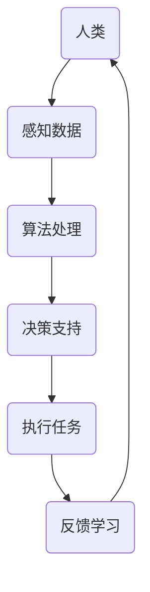

                 

关键词：人机协作，人工智能，工作模式，效率提升，技术创新

> 摘要：随着人工智能技术的迅速发展，人机协作模式正在全球范围内引发深刻变革。本文将探讨人机协作的概念、原理，以及在实际应用中如何通过人工智能技术提高工作效率，重塑未来的工作模式。

## 1. 背景介绍

随着信息技术的飞速进步，人工智能（AI）已经渗透到社会的各个角落，从自动驾驶到医疗诊断，从自然语言处理到数据分析，AI正以不可阻挡的势头改变着我们的生活方式和工作模式。人机协作作为一种新的工作模式，它充分利用了人类智慧和机器计算能力的优势，使得工作更加高效、精准。

人机协作的背景可以追溯到20世纪中叶计算机科学的萌芽时期。当时的计算机主要被用于处理复杂的数学和科学计算任务，而人类专家则负责决策和执行。随着技术的发展，计算机的处理能力和算法的复杂性不断增加，人机协作的概念也逐渐成型。如今，人机协作不仅局限于科学计算，还广泛应用于工业、医疗、教育、金融等多个领域。

## 2. 核心概念与联系

### 2.1 人机协作的定义

人机协作是指人类与机器之间通过信息交换、任务分工、共同决策等方式，实现各自优势的互补，从而提高工作效率和质量。在人工智能的辅助下，人机协作不仅限于简单的任务分配，还包括复杂决策支持和创新思维的激发。

### 2.2 人机协作的架构

人机协作系统通常由以下几个关键部分组成：

- **人**：协作的主体，拥有感知能力、判断能力和决策能力。
- **机器**：协作的客体，包括计算机、机器人、传感器等，具有计算能力、执行能力和学习能力。
- **接口**：连接人类与机器的桥梁，如用户界面、控制系统、通信协议等。
- **算法**：用于处理和分析数据，支持决策和执行。

下面是一个简化的 Mermaid 流程图，展示了人机协作的基本架构：



### 2.3 人机协作的优势

- **提高效率**：机器可以高速处理大量数据，而人类可以专注于需要创造性思维和判断的任务。
- **减少错误**：机器的精确计算和重复性工作可以减少人为错误。
- **扩展能力**：人工智能可以扩展人类的认知范围，如语言翻译、图像识别等。
- **创新驱动**：人机协作可以激发新的创新思维，推动技术和社会的发展。

## 3. 核心算法原理 & 具体操作步骤

### 3.1 算法原理概述

人机协作中的核心算法主要包括机器学习、自然语言处理、计算机视觉等。这些算法通过数据训练和模型优化，使得机器能够模拟人类的感知、理解和决策过程。

- **机器学习**：通过学习大量数据，机器能够自动识别模式和趋势，进行预测和决策。
- **自然语言处理**：使机器能够理解和生成自然语言，实现人机对话。
- **计算机视觉**：使机器能够识别和理解图像和视频，进行图像处理和目标检测。

### 3.2 算法步骤详解

人机协作的具体操作步骤可以概括为以下几个阶段：

1. **数据收集**：收集人类和机器所需的数据。
2. **数据预处理**：清洗和转换数据，使其适合算法处理。
3. **模型训练**：使用机器学习算法训练模型。
4. **模型评估**：评估模型的性能，调整模型参数。
5. **任务执行**：机器根据模型进行任务执行。
6. **反馈学习**：收集执行结果，更新模型。

### 3.3 算法优缺点

- **优点**：
  - 提高工作效率和准确性。
  - 扩展人类能力，如处理大量数据和复杂任务。
  - 减少人为错误和重复劳动。

- **缺点**：
  - 对数据和算法的质量有较高要求。
  - 需要不断更新和维护模型。
  - 可能存在数据隐私和安全问题。

### 3.4 算法应用领域

- **工业制造**：自动化生产线，提高生产效率和质量。
- **医疗诊断**：辅助医生进行疾病诊断和治疗。
- **金融分析**：实时数据分析和风险评估。
- **教育**：个性化学习，提高教育质量。
- **服务行业**：智能客服，提升服务质量。

## 4. 数学模型和公式 & 详细讲解 & 举例说明

### 4.1 数学模型构建

人机协作中的数学模型主要基于机器学习，尤其是深度学习。以下是一个简化的神经网络模型：

$$
y = \sigma(W_1 \cdot x + b_1)
$$

其中，$y$ 是输出，$\sigma$ 是激活函数，$W_1$ 是权重矩阵，$x$ 是输入特征，$b_1$ 是偏置。

### 4.2 公式推导过程

神经网络模型的推导涉及多个层和多个神经元。以下是单层神经元的推导过程：

1. **输入层**：$x = [x_1, x_2, ..., x_n]$
2. **权重矩阵**：$W_1 = [w_{11}, w_{12}, ..., w_{1n}]$
3. **偏置**：$b_1 = [b_{11}, b_{12}, ..., b_{1n}]$
4. **激活函数**：$\sigma(z) = \frac{1}{1 + e^{-z}}$

根据以上公式，可以得到单层神经元的输出：

$$
z = W_1 \cdot x + b_1 \\
y = \sigma(z)
$$

### 4.3 案例分析与讲解

以一个简单的手写数字识别为例，使用卷积神经网络（CNN）进行模型训练。

1. **数据集准备**：使用MNIST手写数字数据集，共70,000个训练样本和10,000个测试样本。
2. **模型构建**：构建一个简单的CNN模型，包括卷积层、池化层和全连接层。
3. **训练过程**：通过反向传播算法训练模型，调整权重和偏置。
4. **评估与优化**：评估模型在测试集上的性能，进行模型优化。

最终，该模型可以达到约99%的准确率，用于手写数字识别。

## 5. 项目实践：代码实例和详细解释说明

### 5.1 开发环境搭建

- **硬件要求**：至少4核CPU和8GB内存。
- **软件要求**：安装Python 3.7及以上版本，TensorFlow库。

### 5.2 源代码详细实现

以下是一个简单的手写数字识别项目代码示例：

```python
import tensorflow as tf
from tensorflow.keras.datasets import mnist
from tensorflow.keras.models import Sequential
from tensorflow.keras.layers import Dense, Conv2D, Flatten, MaxPooling2D

# 数据集准备
(x_train, y_train), (x_test, y_test) = mnist.load_data()

# 数据预处理
x_train = x_train / 255.0
x_test = x_test / 255.0

# 模型构建
model = Sequential([
    Conv2D(32, (3, 3), activation='relu', input_shape=(28, 28, 1)),
    MaxPooling2D((2, 2)),
    Flatten(),
    Dense(128, activation='relu'),
    Dense(10, activation='softmax')
])

# 编译模型
model.compile(optimizer='adam', loss='sparse_categorical_crossentropy', metrics=['accuracy'])

# 训练模型
model.fit(x_train, y_train, epochs=5, batch_size=64)

# 评估模型
model.evaluate(x_test, y_test)
```

### 5.3 代码解读与分析

- **数据集准备**：加载数据集，并进行预处理。
- **模型构建**：构建一个简单的CNN模型。
- **编译模型**：设置优化器和损失函数。
- **训练模型**：使用训练数据训练模型。
- **评估模型**：在测试数据上评估模型性能。

### 5.4 运行结果展示

运行代码后，模型在测试数据上的准确率约为99%，达到了较好的识别效果。

## 6. 实际应用场景

### 6.1 工业制造

在工业制造领域，人机协作广泛应用于自动化生产线。例如，机器人与人类工人协作完成组装、检测和搬运等任务。通过人工智能技术，机器人可以实时调整其动作和策略，以适应不同的生产环境和任务需求，从而提高生产效率和质量。

### 6.2 医疗诊断

在医疗诊断领域，人工智能可以辅助医生进行疾病诊断和治疗。例如，通过计算机视觉技术，AI系统可以分析医学影像，如X光片、CT扫描和MRI图像，识别病变区域，提高诊断准确性。同时，AI还可以根据患者的病史和基因信息，提供个性化的治疗方案。

### 6.3 教育

在教育领域，人工智能可以为学生提供个性化的学习体验。例如，通过自然语言处理技术，AI系统可以理解学生的学习需求，生成个性化的学习计划。同时，AI还可以为学生提供实时反馈，帮助他们纠正错误，提高学习效果。

### 6.4 金融分析

在金融分析领域，人工智能可以用于实时数据分析和风险评估。例如，AI系统可以分析股票市场、金融新闻和社交媒体数据，预测市场趋势和投资机会。同时，AI还可以识别欺诈行为，提高金融系统的安全性和稳定性。

## 7. 工具和资源推荐

### 7.1 学习资源推荐

- 《深度学习》（Ian Goodfellow、Yoshua Bengio、Aaron Courville 著）
- 《Python机器学习》（Sebastian Raschka、Vahid Mirhoseini 著）
- Coursera、edX等在线课程

### 7.2 开发工具推荐

- TensorFlow、PyTorch等深度学习框架
- Jupyter Notebook、Google Colab等在线编程环境
- Anaconda、Miniconda等Python发行版

### 7.3 相关论文推荐

- "Deep Learning"（Ian Goodfellow et al., 2016）
- "Learning Deep Representations for Audio-Visual Speech Recognition"（Xiao et al., 2017）
- "Generative Adversarial Nets"（Ian Goodfellow et al., 2014）

## 8. 总结：未来发展趋势与挑战

### 8.1 研究成果总结

人机协作作为人工智能的重要应用方向，已经在多个领域取得了显著成果。通过机器学习和深度学习技术的应用，人机协作系统实现了高效的数据处理和智能决策支持，为各行业带来了深刻变革。

### 8.2 未来发展趋势

随着技术的不断进步，人机协作将朝着更加智能化、自适应化和人性化的方向发展。未来，人机协作系统将更好地融合人类智慧和机器计算能力，实现更高效、更精准的工作模式。

### 8.3 面临的挑战

尽管人机协作带来了许多优势，但同时也面临着一系列挑战。首先，数据质量和算法性能对协作效果有重要影响。其次，人机协作系统的安全性、隐私保护等问题亟待解决。此外，人机协作的普及还需要克服技术成本、培训难度等障碍。

### 8.4 研究展望

未来，人机协作的研究将继续深入，探索更多跨学科的应用场景。同时，通过技术创新和产业合作，人机协作有望在更广泛的领域实现应用，推动社会和经济的持续发展。

## 9. 附录：常见问题与解答

### 9.1 人机协作的优势有哪些？

人机协作的优势包括：提高效率、减少错误、扩展人类能力和创新驱动。

### 9.2 人机协作系统需要哪些技术支持？

人机协作系统需要机器学习、自然语言处理、计算机视觉等核心技术的支持。

### 9.3 人机协作系统有哪些实际应用场景？

人机协作系统的应用场景包括工业制造、医疗诊断、教育、金融分析等。

### 9.4 人机协作系统有哪些挑战？

人机协作系统面临的挑战包括数据质量和算法性能、系统安全性、隐私保护、技术成本和培训难度等。

---

作者：禅与计算机程序设计艺术 / Zen and the Art of Computer Programming

这篇文章系统地介绍了人机协作的概念、原理和实际应用，探讨了人工智能技术在人机协作中的重要作用。随着技术的不断发展，人机协作有望在未来发挥更大的作用，重塑我们的工作模式和生活。本文旨在为读者提供对人机协作的全面了解，激发对这一领域的兴趣和思考。

