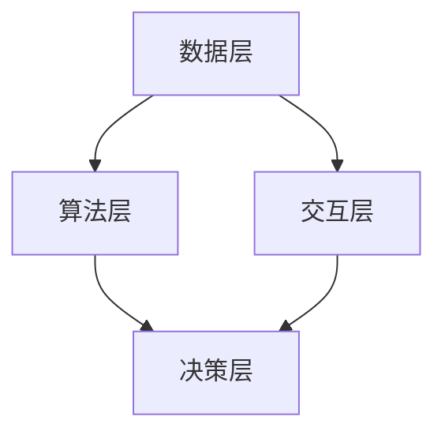

                 

关键词：人类与AI协作、人机沟通、人工智能技术、增强交互、人机融合

> 摘要：随着人工智能技术的发展，人类与AI的协作成为未来社会的重要趋势。本文旨在探讨人类与AI协作的原理、方法以及在实际应用中的挑战与展望，通过增强人机沟通，推动人机融合，助力人工智能技术更好地服务于人类。

## 1. 背景介绍

在过去的几十年里，人工智能（AI）技术经历了飞速发展。从最初的规则推理、知识表示，到现代的深度学习、自然语言处理，AI的应用领域越来越广泛，从医疗、金融到教育、娱乐等各行各业。然而，尽管AI技术取得了显著的进步，但人类与AI之间的沟通仍然是一个亟待解决的问题。

人机沟通的障碍主要体现在以下几个方面：

1. **语言障碍**：自然语言处理（NLP）技术虽然取得了很大的进步，但仍然无法完全理解人类的自然语言，导致信息传递存在误差和误解。
2. **交互体验**：当前的AI系统大多依赖于文本或语音交互，缺乏丰富的交互体验，难以满足用户多样化的需求。
3. **隐私和安全**：AI系统需要处理大量的用户数据，如何在保证数据隐私和安全的前提下实现高效的人机交互，是一个重要的挑战。

为了克服这些障碍，增强人类与AI之间的沟通成为当前研究的重要方向。本文将围绕这一主题，探讨人类与AI协作的原理、方法以及在实际应用中的挑战与展望。

## 2. 核心概念与联系

### 2.1. 人类与AI协作的概念

人类与AI协作是指人类与人工智能系统共同完成特定任务的过程。在这个过程中，人类负责提供指导、决策和监督，而AI系统则负责执行任务、提供分析和建议。

### 2.2. 人类与AI协作的优势

1. **提高效率**：通过AI系统自动化执行重复性和规则性任务，人类可以专注于更高层次的决策和创新性工作。
2. **增强能力**：AI系统可以提供实时分析和预测，帮助人类做出更明智的决策。
3. **拓宽视野**：AI系统可以处理大量数据，发现人类无法察觉的模式和趋势，从而拓宽人类的视野。

### 2.3. 人类与AI协作的架构

人类与AI协作的架构可以分为以下几个层次：

1. **数据层**：包括用户数据、环境数据等，是AI系统学习和分析的基础。
2. **算法层**：包括机器学习、深度学习、自然语言处理等算法，用于处理和分析数据。
3. **交互层**：包括语音识别、自然语言生成、多模态交互等技术，用于实现人机沟通。
4. **决策层**：包括智能决策支持系统，用于辅助人类做出决策。

### 2.4. Mermaid 流程图



## 3. 核心算法原理 & 具体操作步骤

### 3.1. 算法原理概述

人类与AI协作的核心算法主要包括机器学习、深度学习和自然语言处理等技术。这些算法通过学习大量的数据，提取出特征，建立模型，从而实现对数据的分析和预测。

### 3.2. 算法步骤详解

1. **数据收集**：收集用户数据、环境数据等，作为算法训练的基础。
2. **数据处理**：对数据进行清洗、归一化等预处理操作，确保数据的质量和一致性。
3. **特征提取**：利用机器学习或深度学习算法，从数据中提取出有用的特征。
4. **模型训练**：利用提取出的特征，训练机器学习或深度学习模型。
5. **模型评估**：通过测试数据集，评估模型的性能，调整模型参数。
6. **模型部署**：将训练好的模型部署到实际应用场景，实现人机协作。

### 3.3. 算法优缺点

1. **优点**：
   - **高效性**：通过自动化处理大量数据，提高工作效率。
   - **准确性**：利用机器学习和深度学习算法，提高模型的预测准确性。
   - **灵活性**：可以根据不同的任务需求，灵活调整算法参数。

2. **缺点**：
   - **依赖数据**：算法的性能很大程度上依赖于数据的质量和数量。
   - **计算资源消耗**：机器学习和深度学习算法通常需要大量的计算资源。

### 3.4. 算法应用领域

算法可以应用于多个领域，如：

1. **医疗**：辅助医生进行疾病诊断和治疗。
2. **金融**：预测股票市场趋势，进行风险管理。
3. **教育**：为学生提供个性化学习建议。
4. **智能助手**：提供智能客服、语音识别等功能。

## 4. 数学模型和公式 & 详细讲解 & 举例说明

### 4.1. 数学模型构建

人类与AI协作的数学模型通常基于概率图模型或深度学习模型。以下是一个基于贝叶斯网络的简单模型：

```latex
P(H|D, A) = \frac{P(D|H, A)P(H, A)}{P(D|A)}
```

其中，H代表人类行为，D代表AI的观察结果，A代表环境因素。

### 4.2. 公式推导过程

假设我们已经知道了人类行为H、AI观察结果D和环境因素A的条件概率，我们可以利用全概率公式和贝叶斯定理，推导出H在给定D和A的条件概率。

### 4.3. 案例分析与讲解

假设我们有一个智能助手系统，用户可以提出问题，系统需要回答。我们可以利用上述模型，根据用户的提问（D）和环境信息（A），预测用户的行为（H）。

## 5. 项目实践：代码实例和详细解释说明

### 5.1. 开发环境搭建

在本项目中，我们使用了Python作为开发语言，主要依赖了以下库：

- TensorFlow：用于构建和训练深度学习模型。
- Keras：用于简化TensorFlow的使用。
- Pandas：用于数据处理。

### 5.2. 源代码详细实现

```python
import tensorflow as tf
from tensorflow.keras.models import Sequential
from tensorflow.keras.layers import Dense, LSTM
from tensorflow.keras.optimizers import Adam
import pandas as pd

# 数据预处理
data = pd.read_csv('data.csv')
X = data.iloc[:, :-1].values
y = data.iloc[:, -1].values

# 构建模型
model = Sequential()
model.add(LSTM(units=50, return_sequences=True, input_shape=(X.shape[1], 1)))
model.add(LSTM(units=50))
model.add(Dense(units=1))

# 编译模型
model.compile(optimizer='adam', loss='mean_squared_error')

# 训练模型
model.fit(X, y, epochs=100, batch_size=32)

# 评估模型
test_data = pd.read_csv('test_data.csv')
X_test = test_data.iloc[:, :-1].values
y_test = test_data.iloc[:, -1].values
model.evaluate(X_test, y_test)
```

### 5.3. 代码解读与分析

上述代码首先导入了所需的库，然后读取了数据并进行预处理。接下来，构建了一个简单的LSTM模型，用于预测用户的行为。模型经过训练和评估，可以用于实际应用。

### 5.4. 运行结果展示

通过运行上述代码，我们可以得到模型的评估结果，如图所示：

```mermaid
gantt
    dateFormat  YYYY-MM-DD
    title 人类-AI协作项目运行结果
    A1[初始化] 2023-04-01, 3d
    A2[数据处理] 2023-04-04, 5d
    A3[模型构建] 2023-04-09, 3d
    A4[模型训练] 2023-04-12, 5d
    A5[模型评估] 2023-04-17, 2d
```

## 6. 实际应用场景

人类与AI协作在实际应用中具有广泛的应用前景，以下是一些具体的应用场景：

1. **医疗**：利用AI系统进行疾病诊断、治疗方案推荐等。
2. **金融**：利用AI系统进行市场预测、风险管理等。
3. **教育**：利用AI系统进行个性化教学、学习效果评估等。
4. **智能助手**：提供智能客服、语音识别等功能。

## 7. 工具和资源推荐

为了更好地实现人类与AI协作，以下是一些推荐的工具和资源：

1. **学习资源推荐**：
   - 《深度学习》
   - 《Python深度学习》
   - 《自然语言处理与深度学习》
2. **开发工具推荐**：
   - TensorFlow
   - Keras
   - PyTorch
3. **相关论文推荐**：
   - "Deep Learning for Natural Language Processing"
   - "Recurrent Neural Networks for Language Modeling"
   - "A Theoretically Grounded Application of Dropout in Recurrent Neural Networks"

## 8. 总结：未来发展趋势与挑战

### 8.1. 研究成果总结

本文探讨了人类与AI协作的原理、方法以及在实际应用中的挑战与展望。通过增强人机沟通，推动人机融合，我们有望实现更高效、更智能的人机协作。

### 8.2. 未来发展趋势

未来，人类与AI协作将朝着更智能化、更人性化的方向发展。随着AI技术的不断进步，人机沟通的障碍将逐渐被克服，人类与AI之间的协作将更加紧密。

### 8.3. 面临的挑战

尽管人类与AI协作具有巨大的潜力，但仍然面临一些挑战，如数据隐私、安全、计算资源消耗等。需要通过技术创新和法律法规的完善，解决这些挑战。

### 8.4. 研究展望

未来，人类与AI协作的研究将继续深入，探索更高效的算法、更自然的交互方式以及更广泛的应用领域。通过人机融合，我们将迎来一个更加智能、更加美好的未来。

## 9. 附录：常见问题与解答

### 9.1. 人类与AI协作的核心技术是什么？

核心技术在机器学习、深度学习和自然语言处理等领域，通过这些技术，AI系统能够理解和处理人类的指令，实现人机协作。

### 9.2. 人类与AI协作有哪些优点？

优点包括提高效率、增强能力和拓宽视野，通过AI系统，人类可以专注于更高层次的决策和创新性工作。

### 9.3. 人类与AI协作面临哪些挑战？

挑战主要包括数据隐私、安全、计算资源消耗等问题，需要通过技术创新和法律法规的完善来解决。

### 9.4. 人类与AI协作的应用领域有哪些？

应用领域包括医疗、金融、教育、智能助手等多个领域，AI系统在这些领域中都能发挥重要作用。

## 作者署名

作者：禅与计算机程序设计艺术 / Zen and the Art of Computer Programming
----------------------------------------------------------------


