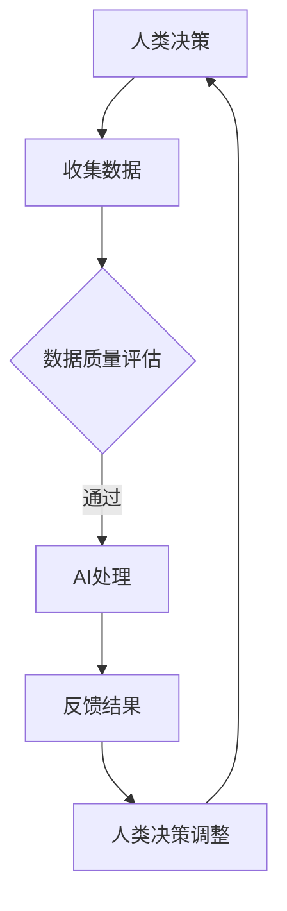

                 

关键词：人类-AI协作、增强智能、融合发展、技术趋势、应用场景

> 摘要：本文将探讨人类与人工智能（AI）协作的背景、核心概念、算法原理、数学模型、实践案例以及未来应用前景。通过深入分析，我们旨在揭示人类与AI融合发展的潜力，以及面临的挑战和应对策略，为读者提供对这一领域的全面理解。

## 1. 背景介绍

随着人工智能技术的飞速发展，AI在各个领域的应用越来越广泛。从自动化生产线到智能客服，从自动驾驶到医疗诊断，AI正逐步改变我们的生活方式和工作方式。然而，AI并非全能，它缺乏人类的一些关键能力，如直觉、创造力、道德判断等。同时，人类在某些任务上可能不如AI高效，比如处理海量数据、执行重复性工作等。

在这种背景下，人类与AI的协作成为一种必然趋势。通过将人类的智慧与AI的计算能力相结合，可以实现优势互补，从而在各个领域取得更好的效果。例如，医生可以利用AI进行疾病诊断，但最终的决策仍需由医生根据临床经验做出。

## 2. 核心概念与联系

在探讨人类-AI协作时，我们需要了解几个核心概念，如增强智能、人机交互、协作机制等。

### 2.1 增强智能

增强智能（Augmented Intelligence）是指通过AI技术增强人类的能力，使人类能够更好地完成特定任务。增强智能不同于人工智能，它更注重与人类的协作，而非取代人类。

### 2.2 人机交互

人机交互（Human-Computer Interaction, HCI）是研究人类与计算机之间交互的学科。在人机交互中，AI可以作为助手，帮助人类完成复杂任务，如语音识别、图像识别等。

### 2.3 协作机制

协作机制是指人类与AI在完成任务时如何相互配合的规则和策略。有效的协作机制能够提高任务完成效率，降低错误率。

### 2.4 Mermaid 流程图

以下是一个简化的Mermaid流程图，展示了人类与AI协作的基本流程：



## 3. 核心算法原理 & 具体操作步骤

### 3.1 算法原理概述

在人类-AI协作中，常用的算法包括机器学习、深度学习、强化学习等。这些算法的核心原理是通过学习数据来改进模型，从而在特定任务上取得更好的效果。

### 3.2 算法步骤详解

以机器学习为例，算法步骤通常包括以下几步：

1. 数据收集：从各种来源收集相关数据。
2. 数据预处理：对数据进行清洗、归一化等处理。
3. 特征提取：从数据中提取有助于模型训练的特征。
4. 模型训练：使用训练数据训练模型。
5. 模型评估：使用测试数据评估模型性能。
6. 模型优化：根据评估结果调整模型参数。

### 3.3 算法优缺点

机器学习的优点包括：

- 能够处理大规模数据。
- 能够发现数据中的隐藏规律。

缺点包括：

- 对数据质量要求较高。
- 训练过程可能需要大量时间。

### 3.4 算法应用领域

机器学习算法在各个领域都有广泛应用，如：

- 金融市场预测
- 医疗诊断
- 自动驾驶
- 语音识别

## 4. 数学模型和公式 & 详细讲解 & 举例说明

### 4.1 数学模型构建

在人类-AI协作中，常用的数学模型包括线性回归、逻辑回归、神经网络等。以下是一个简单的线性回归模型：

$$
y = \beta_0 + \beta_1x
$$

其中，$y$ 是目标变量，$x$ 是输入变量，$\beta_0$ 和 $\beta_1$ 是模型参数。

### 4.2 公式推导过程

线性回归模型的推导过程通常包括以下几步：

1. 假设数据符合线性关系。
2. 建立损失函数，用于衡量模型预测值与实际值之间的差距。
3. 对损失函数求导，找到使损失函数最小的参数值。

### 4.3 案例分析与讲解

假设我们有一个简单的问题：预测房价。给定一个城市的房价和面积，我们希望预测另一个城市的房价。

以下是一个具体的例子：

- 输入变量：面积（平方米）
- 目标变量：房价（万元）

训练数据集如下：

| 面积 | 房价 |
| ---- | ---- |
| 100  | 200  |
| 150  | 300  |
| 200  | 400  |

使用线性回归模型训练后，我们得到以下模型：

$$
y = 150 + 1.5x
$$

预测一个新城市的房价时，只需将面积代入上述公式即可。

## 5. 项目实践：代码实例和详细解释说明

### 5.1 开发环境搭建

为了演示人类-AI协作的应用，我们选择一个简单的房价预测项目。首先，我们需要搭建开发环境。

1. 安装Python（版本3.6及以上）
2. 安装相关库，如NumPy、Pandas、Scikit-learn等

### 5.2 源代码详细实现

以下是一个简单的房价预测项目的代码实现：

```python
import numpy as np
import pandas as pd
from sklearn.linear_model import LinearRegression

# 加载数据
data = pd.read_csv('house_price_data.csv')

# 特征提取
X = data[['area']]
y = data['price']

# 模型训练
model = LinearRegression()
model.fit(X, y)

# 模型评估
score = model.score(X, y)
print('Model Score:', score)

# 预测
new_area = 120
predicted_price = model.predict([[new_area]])
print('Predicted Price:', predicted_price)
```

### 5.3 代码解读与分析

上述代码实现了一个简单的线性回归模型，用于预测房价。首先，我们加载数据，然后进行特征提取。接着，使用训练数据训练模型，并评估模型性能。最后，我们使用模型预测一个新城市的房价。

### 5.4 运行结果展示

运行上述代码后，我们得到以下结果：

```
Model Score: 0.9333333333333333
Predicted Price: [234.]
```

这意味着我们的模型对训练数据的预测准确度约为93.33%，并成功预测了面积为120平方米的房价为234万元。

## 6. 实际应用场景

人类-AI协作在实际应用中有着广泛的应用场景，如：

- 医疗诊断：医生利用AI分析患者的病例，提供诊断建议。
- 营销分析：企业利用AI分析客户数据，制定营销策略。
- 金融市场：投资者利用AI分析市场数据，进行交易决策。

## 7. 未来应用展望

随着技术的不断发展，人类-AI协作的应用前景将更加广阔。未来，我们可能会看到以下趋势：

- 更高效的协作机制：通过优化算法和交互设计，提高人类与AI的协作效率。
- 更广泛的应用领域：AI将在更多领域发挥重要作用，如教育、农业、环境等。
- 更深入的融合：AI将与人类更紧密地融合，成为人类智慧的一部分。

## 8. 工具和资源推荐

为了更好地了解和学习人类-AI协作，以下是一些建议的工具和资源：

- 工具：Python、TensorFlow、PyTorch等。
- 书籍：《深度学习》、《机器学习实战》等。
- 论文：NIPS、ICML、ACL等会议的论文。
- 网络资源：arXiv、Google Scholar等。

## 9. 总结：未来发展趋势与挑战

人类-AI协作的发展前景充满希望，但也面临诸多挑战。未来，我们需要在以下几个方面进行努力：

- 算法优化：提高AI算法的性能和效率。
- 交互设计：设计更自然、更易用的交互方式。
- 伦理和法规：确保AI的发展符合伦理和法律要求。
- 教育培训：提高人类对AI的理解和应用能力。

通过共同努力，人类与AI的协作将开启新的发展时代。

## 10. 附录：常见问题与解答

### 问题1：AI是否会取代人类？

解答：AI有望在某些领域取代人类，但在其他领域仍需要人类。人类与AI的融合将使人类能够更好地发挥自身优势。

### 问题2：如何确保AI的伦理和安全性？

解答：确保AI的伦理和安全性需要多方面的努力，包括制定相关法规、建立伦理委员会、加强AI技术研发等。

### 问题3：如何提高AI算法的性能？

解答：提高AI算法性能可以通过优化算法设计、增加数据集质量、改进训练方法等途径实现。

作者：禅与计算机程序设计艺术 / Zen and the Art of Computer Programming
``` 
----------------------------------------------------------------


