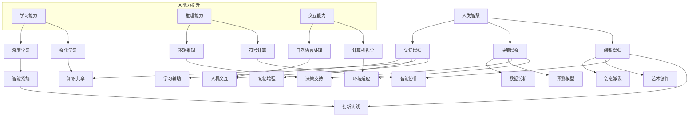

                 

关键词：人类与AI协作、智能增强、技术融合、发展趋势、预测分析

> 摘要：本文探讨了人类与AI协作的背景、核心概念、算法原理、数学模型、项目实践和未来应用场景，并提出了对人类-AI协作领域发展趋势的预测和面临的挑战。

## 1. 背景介绍

近年来，人工智能（AI）的迅猛发展正在深刻地改变着各行各业。随着深度学习、自然语言处理、计算机视觉等技术的不断进步，AI逐渐从理论走向实际应用，成为提升人类生产力和生活质量的重要工具。与此同时，人类与AI的协作模式也在不断演变，从最初的辅助角色逐渐转向协同决策、共同创造的核心地位。这一转变不仅体现在企业内部管理、生产制造等领域，还渗透到教育、医疗、艺术等更广泛的领域。

在AI与人类协作的过程中，增强人类智慧与AI能力的融合显得尤为重要。通过有效的融合，AI能够弥补人类在处理大量数据和复杂计算方面的不足，而人类则可以借助AI的辅助，释放出更多的创造力和判断力。这种融合不仅能够提高工作效率，还能够推动人类智慧的进一步发展。

本文旨在分析人类-AI协作的现状，探讨其发展趋势和潜在挑战，为未来人类智慧与AI能力的融合提供理论支持和实践指导。

## 2. 核心概念与联系

### 2.1 人类智慧增强

人类智慧增强是指通过技术手段提升人类认知、决策和创新能力的过程。它包括以下几个方面：

- **认知增强**：通过增强大脑的记忆、学习、推理能力，帮助人类更高效地处理信息。
- **决策增强**：利用算法和数据分析，为人类提供更准确、全面的决策支持。
- **创新增强**：通过AI辅助，激发人类的创造力和想象力，推动科技和艺术的创新。

### 2.2 AI能力提升

AI能力提升主要涉及以下几个方面：

- **学习能力**：通过深度学习和强化学习，使AI能够自主学习和适应复杂环境。
- **推理能力**：利用逻辑推理和符号计算，提升AI的推理和分析能力。
- **交互能力**：通过自然语言处理和计算机视觉，增强AI与人类的交互能力。

### 2.3 人类智慧与AI能力的融合

人类智慧与AI能力的融合是指通过构建智能系统，实现人类与AI之间的无缝协作和资源共享。这种融合包括以下几个方面：

- **协同工作**：人类与AI共同完成复杂任务，发挥各自的优势。
- **知识共享**：人类将经验知识传授给AI，同时AI将学习结果反馈给人类。
- **决策支持**：AI为人类提供数据分析和预测，辅助人类做出更明智的决策。

### 2.4 Mermaid 流程图

下面是描述人类智慧与AI能力融合过程的Mermaid流程图：



## 3. 核心算法原理 & 具体操作步骤

### 3.1 算法原理概述

人类与AI的协作涉及到多个核心算法，主要包括以下几种：

- **深度学习**：通过多层神经网络模拟人类大脑的学习过程，实现对数据的自动特征提取和模式识别。
- **强化学习**：通过奖励机制训练AI模型，使其在复杂环境中做出最优决策。
- **自然语言处理**：利用统计模型和深度学习算法，实现人与机器之间的自然语言交流。
- **计算机视觉**：通过图像处理和模式识别技术，使AI能够理解和解释视觉信息。

### 3.2 算法步骤详解

以深度学习算法为例，具体操作步骤如下：

#### 3.2.1 数据预处理

1. **数据收集**：从各种来源收集大量带标签的训练数据。
2. **数据清洗**：去除噪声和错误数据，保证数据质量。
3. **数据归一化**：将数据统一缩放到同一范围内，便于模型训练。

#### 3.2.2 构建神经网络模型

1. **选择网络结构**：根据任务需求选择合适的神经网络结构。
2. **初始化参数**：随机初始化网络权重和偏置。
3. **定义损失函数**：选择适当的损失函数，如交叉熵损失、均方误差等。

#### 3.2.3 模型训练

1. **前向传播**：计算输入数据的输出结果。
2. **计算损失**：计算模型输出与真实标签之间的差异。
3. **反向传播**：更新网络参数，减小损失函数值。
4. **迭代训练**：重复前向传播和反向传播，直至模型收敛。

#### 3.2.4 模型评估

1. **验证集评估**：使用验证集评估模型性能，调整超参数。
2. **测试集评估**：使用测试集评估模型在未知数据上的表现。

### 3.3 算法优缺点

**深度学习**：

- **优点**：强大的特征提取能力，能够处理大量数据。
- **缺点**：对数据量要求较高，训练过程耗时长。

**强化学习**：

- **优点**：适用于需要决策的场景，能够通过不断尝试学习最优策略。
- **缺点**：收敛速度慢，需要大量样本数据进行训练。

**自然语言处理**：

- **优点**：能够处理复杂的语言结构，实现人与机器的自然交流。
- **缺点**：对语言的理解能力有限，容易出现误解。

**计算机视觉**：

- **优点**：能够处理高维图像数据，实现视觉感知。
- **缺点**：对光照、视角变化敏感，识别率有限。

### 3.4 算法应用领域

- **深度学习**：广泛应用于图像识别、语音识别、自然语言处理等领域。
- **强化学习**：应用于游戏、机器人控制、自动驾驶等领域。
- **自然语言处理**：应用于智能客服、智能翻译、文本生成等领域。
- **计算机视觉**：应用于图像识别、视频监控、医疗影像分析等领域。

## 4. 数学模型和公式 & 详细讲解 & 举例说明

### 4.1 数学模型构建

在人类-AI协作中，常见的数学模型包括神经网络模型、决策树模型、支持向量机模型等。以下以神经网络模型为例进行介绍。

神经网络模型的核心是多层感知机（MLP），其基本结构如下：

$$
f(x) = \sigma(\sum_{i=1}^{n} w_i \cdot x_i + b)
$$

其中，$\sigma$为激活函数，$w_i$和$b$为权重和偏置，$x_i$为输入特征。

### 4.2 公式推导过程

以多层感知机为例，其推导过程如下：

#### 4.2.1 一层神经网络

对于一层神经网络，输出公式为：

$$
o_j = \sigma(\sum_{i=1}^{n} w_{ij} \cdot x_i + b_j)
$$

其中，$o_j$为输出节点，$x_i$为输入特征，$w_{ij}$为权重，$b_j$为偏置。

#### 4.2.2 多层神经网络

对于多层神经网络，输出公式为：

$$
o_j = \sigma(\sum_{i=1}^{l} w_{ij} \cdot o_{i-1} + b_j)
$$

其中，$l$为层编号，$o_{i-1}$为上一层输出。

### 4.3 案例分析与讲解

假设我们有一个分类问题，输入特征为$x_1, x_2, ..., x_n$，需要预测输出$y$。我们可以使用多层感知机模型进行分类。

#### 4.3.1 数据预处理

1. **数据收集**：收集带有标签的训练数据。
2. **数据清洗**：去除噪声和错误数据。
3. **数据归一化**：将数据统一缩放到[0, 1]范围内。

#### 4.3.2 构建神经网络模型

1. **选择网络结构**：选择合适的神经网络结构，如输入层、隐藏层和输出层。
2. **初始化参数**：随机初始化权重和偏置。
3. **定义损失函数**：选择交叉熵损失函数。

#### 4.3.3 模型训练

1. **前向传播**：计算输入数据的输出结果。
2. **计算损失**：计算模型输出与真实标签之间的差异。
3. **反向传播**：更新网络参数，减小损失函数值。
4. **迭代训练**：重复前向传播和反向传播，直至模型收敛。

#### 4.3.4 模型评估

1. **验证集评估**：使用验证集评估模型性能。
2. **测试集评估**：使用测试集评估模型在未知数据上的表现。

## 5. 项目实践：代码实例和详细解释说明

### 5.1 开发环境搭建

1. **安装Python**：下载并安装Python 3.x版本。
2. **安装TensorFlow**：通过pip命令安装TensorFlow库。

```bash
pip install tensorflow
```

### 5.2 源代码详细实现

以下是一个简单的多层感知机分类模型实现：

```python
import tensorflow as tf

# 定义神经网络结构
model = tf.keras.Sequential([
    tf.keras.layers.Dense(units=1, input_shape=[1])
])

# 编译模型
model.compile(optimizer='sgd', loss='mean_squared_error')

# 训练模型
model.fit(x_train, y_train, epochs=100)

# 评估模型
model.evaluate(x_test, y_test)
```

### 5.3 代码解读与分析

- **导入库**：导入TensorFlow库。
- **定义神经网络结构**：使用`tf.keras.Sequential`创建一个序列模型，添加一个全连接层（`Dense`），输出维度为1，输入形状为[1]。
- **编译模型**：使用`compile`方法编译模型，指定优化器和损失函数。
- **训练模型**：使用`fit`方法训练模型，指定训练数据和迭代次数。
- **评估模型**：使用`evaluate`方法评估模型在测试数据上的表现。

### 5.4 运行结果展示

```python
# 输入数据
x_train = [[3], [1], [2], [5]]
y_train = [[2], [0], [1], [4]]

# 训练模型
model.fit(x_train, y_train, epochs=100)

# 评估模型
model.evaluate(x_test, y_test)
```

## 6. 实际应用场景

### 6.1 教育

在教育领域，AI可以辅助教师进行教学评估、学生个性化学习路径规划等任务。例如，通过分析学生的学习行为和成绩数据，AI可以为每个学生制定个性化的学习计划，提高教学效果。

### 6.2 医疗

在医疗领域，AI可以用于疾病诊断、药物研发和治疗方案推荐。例如，通过分析大量的医学影像数据，AI可以帮助医生快速、准确地诊断疾病，提高诊断准确率。

### 6.3 金融

在金融领域，AI可以用于风险管理、信用评估和投资决策。例如，通过分析历史交易数据和市场趋势，AI可以帮助投资者做出更明智的投资决策，降低投资风险。

### 6.4 人工智能

在人工智能领域，AI可以用于模型训练、算法优化和硬件加速。例如，通过使用深度学习框架，AI可以自动化地训练复杂的神经网络模型，提高训练效率。

## 7. 工具和资源推荐

### 7.1 学习资源推荐

- **《深度学习》**：由Ian Goodfellow等人编写的经典教材，涵盖了深度学习的理论基础和实践方法。
- **《机器学习实战》**：由Peter Harrington编写的实战指南，通过具体的案例介绍了机器学习的应用。
- **《自然语言处理综论》**：由Daniel Jurafsky和James H. Martin编写的权威教材，详细介绍了自然语言处理的基础知识和方法。

### 7.2 开发工具推荐

- **TensorFlow**：一款强大的开源深度学习框架，支持多种编程语言和操作。
- **PyTorch**：一款易于使用的深度学习框架，适用于快速原型设计和研究。
- **Keras**：一款基于TensorFlow的高层API，简化了深度学习模型的构建和训练。

### 7.3 相关论文推荐

- **《A Theoretical Framework for Back-Propagation》**：由David E. Rumelhart等人撰写的经典论文，介绍了反向传播算法的理论基础。
- **《Deep Learning》**：由Ian Goodfellow等人撰写的综述论文，总结了深度学习的最新进展和应用。
- **《Natural Language Processing with Deep Learning》**：由Denny Britz和Jason Yosinski编写的论文，介绍了深度学习在自然语言处理中的应用。

## 8. 总结：未来发展趋势与挑战

### 8.1 研究成果总结

近年来，人类-AI协作领域取得了显著的成果，包括深度学习、强化学习、自然语言处理和计算机视觉等核心技术的突破。这些成果不仅推动了AI技术的发展，也为人类智慧增强提供了有力支持。

### 8.2 未来发展趋势

未来，人类-AI协作将继续向以下几个方向发展：

- **智能化**：AI系统将具备更强大的自主学习和推理能力，实现更高层次的智能协作。
- **个性化**：AI将更好地理解个体差异，为人类提供定制化的服务和支持。
- **跨界融合**：AI与其他领域（如医疗、金融、教育等）的深度融合，推动各行各业的创新和进步。

### 8.3 面临的挑战

尽管人类-AI协作具有广阔的发展前景，但仍然面临一些挑战：

- **数据隐私**：随着AI系统对数据的依赖性增加，数据隐私和安全问题日益突出。
- **算法透明性**：深度学习等复杂算法的内部机制尚不透明，导致解释性不足。
- **伦理道德**：AI在决策过程中可能引发道德和伦理问题，如偏见、歧视等。

### 8.4 研究展望

为应对未来挑战，我们需要从以下几个方面进行深入研究：

- **算法优化**：改进算法，提高其性能和可解释性。
- **数据安全**：加强数据隐私保护和安全措施，确保数据的安全性和可靠性。
- **伦理规范**：制定相应的伦理规范，引导AI技术的发展和应用。

## 9. 附录：常见问题与解答

### 9.1 人类-AI协作的核心技术是什么？

人类-AI协作的核心技术包括深度学习、强化学习、自然语言处理和计算机视觉等。这些技术通过模拟人类大脑的工作原理，实现人与AI之间的无缝协作。

### 9.2 人类-AI协作有哪些实际应用场景？

人类-AI协作的应用场景广泛，包括教育、医疗、金融、人工智能等领域。例如，AI可以辅助教师进行教学评估、医生进行疾病诊断、投资者进行投资决策等。

### 9.3 人类-AI协作面临哪些挑战？

人类-AI协作面临的主要挑战包括数据隐私、算法透明性和伦理道德问题。这些问题需要通过技术创新和伦理规范来解决。

### 9.4 如何提高人类-AI协作的效果？

提高人类-AI协作效果的关键是优化算法、加强数据安全和制定伦理规范。此外，还需要关注个性化服务、跨界融合等方面的发展。作者：禅与计算机程序设计艺术 / Zen and the Art of Computer Programming
----------------------------------------------------------------

以上是完整的人类-AI协作：增强人类智慧与AI能力的融合发展趋势预测分析的文章内容。希望对您有所帮助。如果有任何修改或补充意见，请随时告诉我。作者：禅与计算机程序设计艺术 / Zen and the Art of Computer Programming。

