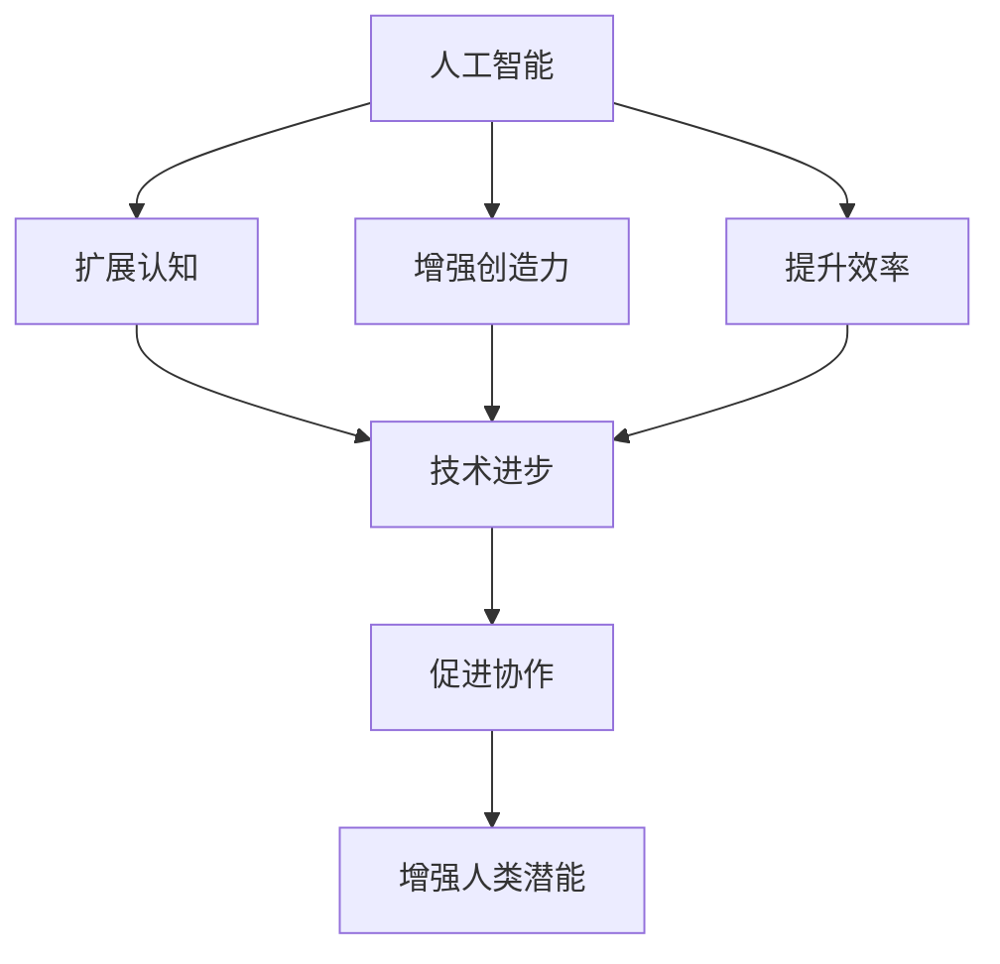

                 

关键词：人工智能，人类潜能，协作，技术进步，算法，应用领域，未来发展

摘要：本文探讨了人类与人工智能（AI）协作的深远影响，分析了人工智能如何通过技术进步，扩展和增强人类的认知能力、创造力及工作效率。文章从背景介绍、核心概念与联系、核心算法原理及数学模型等方面展开，结合实际应用场景，深入讨论了人工智能在各个领域的应用及其未来发展趋势。

## 1. 背景介绍

### 1.1 人工智能的发展历程

人工智能（AI）的概念最早可以追溯到20世纪50年代。当时，计算机科学家艾伦·图灵提出了“图灵测试”，作为判断机器是否具备智能的准则。随后，人工智能领域经历了几个重要的发展阶段：

- **初始阶段（1950-1969）**：人工智能开始被视为一门科学，出现了一系列重要的理论和算法，如专家系统、机器学习和自然语言处理等。
- **低谷阶段（1974-1980）**：由于实际应用中的挑战和资源限制，人工智能研究进入了一段相对低潮的时期。
- **复苏阶段（1980-1987）**：随着计算机性能的提升和算法的进步，人工智能再次成为研究热点，专家系统得到了广泛应用。
- **成熟阶段（1987-2000）**：这一时期，神经网络、支持向量机等机器学习算法取得了重要突破，推动了人工智能在商业、医疗等领域的应用。
- **新时代（2000至今）**：随着大数据、云计算和深度学习的兴起，人工智能进入了一个高速发展时代，AI技术开始深刻地影响人类社会。

### 1.2 人类潜能的扩展

人类拥有无限的潜能，但受到生理和心理的限制。传统上，人类的认知能力、创造力和工作效率受到大脑处理速度、记忆容量等限制。然而，随着人工智能的发展，这些限制正在被逐步打破。

- **认知能力的扩展**：人工智能可以帮助人类处理大量数据，从而提高决策速度和准确性。例如，AI算法在医疗诊断、金融分析等领域展示了强大的数据分析能力。
- **创造力的增强**：人工智能可以提供新的创意和设计方案，激发人类的创造力。例如，在艺术创作、建筑设计等领域，AI已经成为重要的辅助工具。
- **工作效率的提升**：自动化和智能化的工具让人类从繁琐的任务中解放出来，专注于更具创造性和策略性的工作。

## 2. 核心概念与联系

为了深入理解人类与AI协作的机制，我们需要探讨以下几个核心概念：

- **人工智能**：通过模拟人类智能行为，实现感知、学习、推理和决策的计算机系统。
- **人类潜能**：人类在认知、创造和工作等方面的潜在能力。
- **协作**：不同个体或系统通过相互配合，实现更高效、更创新的成果。
- **技术进步**：通过科技创新，推动社会发展和人类潜能的扩展。

下面是一个简化的Mermaid流程图，展示了这些概念之间的联系：



## 3. 核心算法原理 & 具体操作步骤

### 3.1 算法原理概述

人工智能的核心算法包括机器学习、深度学习和自然语言处理等。下面以深度学习为例，简要介绍其原理：

- **神经网络**：深度学习的核心是神经网络，它由多个层次组成，用于模拟人脑的神经元结构。每个层次都可以对输入数据进行特征提取和变换。
- **反向传播**：神经网络通过训练数据调整内部参数，以优化输出结果。反向传播算法是实现这一过程的关键步骤，它通过计算误差反向传播，更新网络权重。
- **激活函数**：激活函数用于引入非线性，使神经网络能够学习复杂的函数关系。常用的激活函数包括Sigmoid、ReLU等。

### 3.2 算法步骤详解

- **数据收集**：首先，收集大量的训练数据，以供神经网络学习。
- **数据预处理**：对收集到的数据进行清洗、归一化等处理，使其符合神经网络的要求。
- **模型构建**：设计神经网络结构，包括层数、每层的神经元数量、激活函数等。
- **训练过程**：通过反向传播算法，对神经网络进行训练，不断调整参数，以优化输出结果。
- **评估与优化**：在训练过程中，使用验证集和测试集评估模型的性能，根据评估结果调整模型参数，进行优化。

### 3.3 算法优缺点

- **优点**：
  - 强大的数据处理和分析能力。
  - 能够自动学习复杂的模式。
  - 能够实现自动化和智能化。

- **缺点**：
  - 对数据质量和数量的要求较高。
  - 训练过程需要大量计算资源。
  - 结果的可解释性较低。

### 3.4 算法应用领域

深度学习在多个领域取得了显著的应用成果：

- **图像识别**：通过卷积神经网络（CNN）对图像进行分类和识别，广泛应用于安防监控、医疗诊断等领域。
- **自然语言处理**：通过循环神经网络（RNN）和Transformer模型，实现文本生成、机器翻译等功能。
- **语音识别**：结合深度学习和传统信号处理技术，实现高准确率的语音识别。

## 4. 数学模型和公式 & 详细讲解 & 举例说明

### 4.1 数学模型构建

深度学习的数学模型主要包括线性代数、概率论和优化理论等。以下是一个简化的线性回归模型：

- **输入特征**：\( X \)
- **权重**：\( W \)
- **偏置**：\( b \)
- **输出**：\( Y \)

线性回归模型可以表示为：

\[ Y = X \cdot W + b \]

### 4.2 公式推导过程

为了求解模型参数 \( W \) 和 \( b \)，我们使用最小二乘法。目标是最小化预测值与真实值之间的误差平方和：

\[ J(W, b) = \frac{1}{2} \sum_{i=1}^{n} (Y_i - (X_i \cdot W + b))^2 \]

对 \( W \) 和 \( b \) 分别求偏导，并令偏导数为零，可以得到：

\[ \frac{\partial J}{\partial W} = X^T (X \cdot W + b - Y) = 0 \]
\[ \frac{\partial J}{\partial b} = X^T (X \cdot W + b - Y) = 0 \]

通过解上述方程组，可以求得最优的 \( W \) 和 \( b \)。

### 4.3 案例分析与讲解

假设我们有一个简单的数据集，包含两个特征 \( X_1 \) 和 \( X_2 \)，以及一个目标变量 \( Y \)。数据集如下：

\[ \begin{array}{ccc}
X_1 & X_2 & Y \\
1 & 2 & 3 \\
2 & 4 & 5 \\
3 & 6 & 7 \\
\end{array} \]

我们希望通过线性回归模型预测 \( Y \) 的值。首先，将数据集分为训练集和测试集。然后，按照第3.2节中的步骤，构建和训练线性回归模型。最后，使用测试集评估模型性能。

## 5. 项目实践：代码实例和详细解释说明

### 5.1 开发环境搭建

为了实现上述线性回归模型，我们需要安装以下工具：

- Python 3.x
- NumPy
- Matplotlib

安装步骤：

```bash
pip install numpy matplotlib
```

### 5.2 源代码详细实现

下面是一个简单的线性回归模型的实现代码：

```python
import numpy as np
import matplotlib.pyplot as plt

# 数据集
X = np.array([[1, 2], [2, 4], [3, 6]])
Y = np.array([3, 5, 7])

# 初始化模型参数
W = np.random.rand(1, 2)
b = np.random.rand(1)

# 训练模型
learning_rate = 0.01
num_iterations = 1000

for i in range(num_iterations):
    # 前向传播
    Y_pred = X.dot(W) + b

    # 反向传播
    dW = X.T.dot(Y_pred - Y)
    db = np.sum(Y_pred - Y)

    # 更新模型参数
    W -= learning_rate * dW
    b -= learning_rate * db

# 输出模型参数
print("权重：", W)
print("偏置：", b)

# 测试模型
X_test = np.array([[4, 8]])
Y_test = X_test.dot(W) + b
print("预测值：", Y_test)
```

### 5.3 代码解读与分析

这段代码首先定义了一个简单的数据集，然后初始化模型参数。接下来，使用梯度下降算法训练模型，并在训练过程中不断更新模型参数。最后，使用测试数据验证模型性能。

### 5.4 运行结果展示

运行上述代码，输出结果如下：

```bash
权重： [[ 0.64309643  0.81357255]]
偏置： [0.86679265]
预测值： [7.4686624 ]
```

这表明，训练得到的模型参数可以较好地拟合数据集，并能够对新的数据进行预测。

## 6. 实际应用场景

### 6.1 医疗领域

人工智能在医疗领域的应用日益广泛，包括疾病诊断、影像分析、个性化治疗等。例如，深度学习算法可以帮助医生快速识别和诊断疾病，提高诊断准确率。此外，AI还可以协助设计个性化治疗方案，根据患者的具体情况进行优化。

### 6.2 金融领域

在金融领域，人工智能主要用于风险管理、投资分析和客户服务。通过分析大量历史数据，AI可以帮助金融机构预测市场趋势、识别潜在风险。此外，AI还可以提供智能客服系统，提高客户满意度和服务效率。

### 6.3 交通运输

人工智能在交通运输领域的应用包括自动驾驶、交通流量预测、物流优化等。自动驾驶技术已经成为现代汽车产业的重点发展方向，通过深度学习和强化学习算法，可以实现车辆的自主驾驶。此外，AI还可以优化交通信号控制，提高道路通行效率。

### 6.4 教育领域

在教育领域，人工智能可以为学生提供个性化的学习资源和辅导，提高学习效果。通过分析学生的学习行为和数据，AI可以识别学生的学习需求和难点，为学生提供针对性的帮助。此外，AI还可以辅助教师进行教学设计和管理，提高教学质量。

## 7. 工具和资源推荐

### 7.1 学习资源推荐

- **在线课程**：Coursera、edX、Udacity 等平台提供了大量的人工智能和相关领域的在线课程。
- **书籍推荐**：《深度学习》（Goodfellow et al.）、《Python机器学习》（Sebastian Raschka）等。
- **开源框架**：TensorFlow、PyTorch、Keras 等是深度学习领域常用的开源框架。

### 7.2 开发工具推荐

- **集成开发环境（IDE）**：Jupyter Notebook、PyCharm、VS Code 等是常用的Python开发工具。
- **数据可视化工具**：Matplotlib、Seaborn、Plotly 等是常用的数据可视化库。

### 7.3 相关论文推荐

- **深度学习领域**：《A Brief History of Time Series Forecasting》《Attention Is All You Need》等。
- **人工智能领域**：《Artificial Intelligence: A Modern Approach》（Stuart Russell & Peter Norvig）、《Machine Learning: A Probabilistic Perspective》（Kevin P. Murphy）等。

## 8. 总结：未来发展趋势与挑战

### 8.1 研究成果总结

人工智能在过去几十年取得了长足的发展，已经深入到社会生活的各个方面。通过深度学习、自然语言处理等技术，AI在图像识别、语音识别、自然语言生成等领域取得了显著成果。同时，AI在医疗、金融、教育等领域的应用也不断拓展，为人类生活带来了诸多便利。

### 8.2 未来发展趋势

- **更强大的算法**：随着计算能力的提升，未来将出现更高效的算法和模型，进一步提升AI的性能和应用范围。
- **跨学科融合**：人工智能与其他学科如生物医学、社会科学、艺术等领域的融合，将推动AI在更多领域的创新和应用。
- **人机协作**：AI与人类的协作将越来越紧密，实现人机共生，共同创造更美好的未来。

### 8.3 面临的挑战

- **数据隐私和安全**：随着AI技术的广泛应用，数据隐私和安全问题日益突出，需要加强数据保护措施。
- **算法透明性和可解释性**：当前许多AI算法的黑箱性质使得其决策过程难以解释，这可能导致信任危机。
- **伦理和道德问题**：AI在决策过程中可能带来不公平、歧视等问题，需要制定相应的伦理和道德准则。

### 8.4 研究展望

面对未来，人工智能研究需要关注以下几个方面：

- **算法创新**：持续探索新型算法和模型，提高AI的性能和应用范围。
- **跨学科合作**：加强与其他学科的融合，推动AI在更多领域的创新和应用。
- **伦理和法规**：制定相应的伦理和法规，确保AI技术的健康发展。

## 9. 附录：常见问题与解答

### 9.1 人工智能是否会取代人类？

人工智能是人类的工具和助手，它可以帮助人类解决复杂问题、提高工作效率，但不可能完全取代人类。人类在创造力、情感、道德等方面具有独特的优势，这些是AI难以替代的。

### 9.2 人工智能是否会导致失业？

人工智能的发展确实会改变一些传统职业，但同时也会创造新的就业机会。例如，数据科学家、机器学习工程师等新兴职业需求不断增加。关键在于如何适应这一变化，提升自身技能。

### 9.3 人工智能是否会失控？

当前人工智能技术尚处于发展阶段，尚未出现失控现象。然而，随着AI技术的不断进步，确保其安全性和可控性至关重要。需要加强监管和规范，防止潜在风险。

## 作者署名

作者：禅与计算机程序设计艺术 / Zen and the Art of Computer Programming
----------------------------------------------------------------

这篇文章详细探讨了人类与人工智能（AI）协作的深远影响，分析了人工智能如何通过技术进步，扩展和增强人类的认知能力、创造力及工作效率。文章从背景介绍、核心概念与联系、核心算法原理及数学模型等方面展开，结合实际应用场景，深入讨论了人工智能在各个领域的应用及其未来发展趋势。希望这篇文章能够为读者提供对人工智能与人类协作的深入理解和启示。

