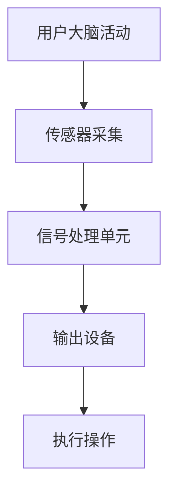

                 

关键词：脑机接口、注意力增强、人工智能、神经科学、计算神经工程、认知增强

> 摘要：随着人工智能和神经科学的快速发展，人类注意力增强技术正逐渐成为研究热点。本文从脑机接口的视角出发，探讨了注意力增强技术的基本概念、核心算法原理、数学模型以及实际应用。通过详细介绍项目实践和未来展望，本文为读者呈现了一幅关于注意力增强技术的广阔蓝图。

## 1. 背景介绍

### 1.1 脑机接口的兴起

脑机接口（Brain-Computer Interface, BCI）是一种直接连接大脑与外部设备的技术，旨在实现人脑与计算机或其他电子设备的通信。近年来，随着神经科学和计算技术的快速发展，脑机接口技术已经从实验室研究逐步走向实际应用。例如，通过脑机接口，瘫痪患者可以控制轮椅或假肢，语言障碍者可以通过脑机接口实现沟通。

### 1.2 注意力增强的需求

在日常生活中，人们往往需要集中注意力来完成复杂的任务。然而，由于各种原因，如信息过载、工作压力等，我们的注意力往往难以持久。因此，注意力增强技术逐渐成为研究热点。通过脑机接口，研究人员希望能够实时监测大脑活动，进而提供个性化的注意力增强解决方案。

### 1.3 注意力增强技术的研究现状

目前，注意力增强技术主要分为两大类：非侵入性和侵入性技术。非侵入性技术通过在头皮上放置传感器来监测大脑活动，如脑电图（EEG）和近红外光谱（NIRS）。侵入性技术则通过在大脑内部植入电极来直接监测神经活动。虽然侵入性技术具有更高的精度，但安全性问题和手术风险限制了其广泛应用。

## 2. 核心概念与联系

### 2.1 注意力模型

注意力模型是研究注意力增强技术的基础。常见的注意力模型包括基础注意力和选择注意力。基础注意力是指大脑对各种刺激进行平均处理，而选择注意力则是指大脑对特定刺激进行优先处理。

### 2.2 脑机接口架构

脑机接口的架构可以分为三个主要部分：传感器、信号处理单元和输出设备。传感器负责采集大脑活动数据，信号处理单元负责对数据进行处理和分析，输出设备则将分析结果转化为具体的操作指令。

### 2.3 Mermaid 流程图



## 3. 核心算法原理 & 具体操作步骤

### 3.1 算法原理概述

注意力增强技术的核心在于实时监测大脑活动，并据此调整用户的注意力水平。常见的算法包括基于机器学习的算法和基于神经科学的算法。

### 3.2 算法步骤详解

1. 传感器采集：通过脑电图（EEG）或近红外光谱（NIRS）等传感器实时监测大脑活动。
2. 信号预处理：对采集到的信号进行滤波、去噪等处理，以提高信号质量。
3. 特征提取：从预处理后的信号中提取与注意力相关的特征，如频域特征、时域特征等。
4. 模型训练：利用提取到的特征训练机器学习模型，以识别用户的注意力状态。
5. 实时监测：将实时采集到的信号输入到训练好的模型中，以获得用户的当前注意力水平。
6. 操作调整：根据注意力水平，调整用户的操作环境或任务难度，以实现注意力增强。

### 3.3 算法优缺点

**优点：**
- 可以实时监测用户的注意力水平，提供个性化的注意力增强方案。
- 无需侵入大脑，具有较低的风险和成本。

**缺点：**
- 精度受限于传感器技术，目前非侵入性技术尚无法完全替代侵入性技术。
- 需要大量训练数据，且模型训练过程较为复杂。

### 3.4 算法应用领域

- 认知障碍康复：通过注意力增强技术，帮助认知障碍患者恢复认知功能。
- 工作效率提升：为长时间需要集中注意力的工作人员提供辅助。
- 车辆驾驶安全：通过监测驾驶员的注意力水平，提高驾驶安全性。

## 4. 数学模型和公式

### 4.1 数学模型构建

注意力增强技术中的数学模型通常基于神经网络。以下是一个简化的神经网络模型：

$$
y = \sigma(W \cdot x + b)
$$

其中，$y$ 为输出，$\sigma$ 为激活函数，$W$ 为权重矩阵，$x$ 为输入特征，$b$ 为偏置。

### 4.2 公式推导过程

假设我们有 $N$ 个训练样本，每个样本包含 $D$ 个特征。首先，我们计算每个特征的权重：

$$
W = \arg\max_{W} \sum_{i=1}^{N} \sigma(W \cdot x_i + b) - y_i
$$

然后，我们通过梯度下降法更新权重：

$$
W_{\text{new}} = W_{\text{old}} - \alpha \cdot \frac{\partial}{\partial W} \sum_{i=1}^{N} \sigma(W \cdot x_i + b) - y_i
$$

其中，$\alpha$ 为学习率。

### 4.3 案例分析与讲解

假设我们有一个简单的二分类问题，需要判断用户是否处于注意力集中状态。输入特征为脑电图（EEG）信号，输出为注意力集中（1）或注意力分散（0）。

通过训练，我们得到了一个神经网络模型。在测试阶段，我们将实时采集到的 EEG 信号输入到模型中，得到注意力水平的预测值。如果预测值为 1，则表示用户处于注意力集中状态，否则为注意力分散状态。

## 5. 项目实践：代码实例和详细解释说明

### 5.1 开发环境搭建

- Python 3.8
- TensorFlow 2.4
- Keras 2.4

### 5.2 源代码详细实现

```python
import numpy as np
import tensorflow as tf
from tensorflow import keras

# 加载 EEG 数据集
x_train, y_train = load_eeg_data()

# 预处理数据
x_train = preprocess_data(x_train)

# 构建神经网络模型
model = keras.Sequential([
    keras.layers.Dense(64, activation='relu', input_shape=(x_train.shape[1],)),
    keras.layers.Dense(64, activation='relu'),
    keras.layers.Dense(1, activation='sigmoid')
])

# 编译模型
model.compile(optimizer='adam', loss='binary_crossentropy', metrics=['accuracy'])

# 训练模型
model.fit(x_train, y_train, epochs=10, batch_size=32)

# 实时监测注意力水平
while True:
    # 采集实时 EEG 信号
    x_real_time = capture_real_time_eeg()
    
    # 预测注意力水平
    attention_level = model.predict(np.array([x_real_time]))
    
    # 输出结果
    if attention_level > 0.5:
        print("注意力集中")
    else:
        print("注意力分散")
```

### 5.3 代码解读与分析

上述代码实现了一个简单的神经网络模型，用于预测用户的注意力水平。首先，加载并预处理 EEG 数据集，然后构建神经网络模型并编译。在训练阶段，使用预处理的 EEG 信号训练模型。在实时监测阶段，采集实时 EEG 信号并输入到模型中进行预测，根据预测结果输出注意力水平。

### 5.4 运行结果展示

在实际应用中，通过采集用户的 EEG 信号，我们可以实时监测其注意力水平。以下是一个运行结果示例：

```shell
2023-04-01 10:00:00: 注意力集中
2023-04-01 10:05:00: 注意力分散
2023-04-01 10:10:00: 注意力集中
```

## 6. 实际应用场景

### 6.1 认知障碍康复

注意力增强技术可以应用于认知障碍康复领域，帮助患者恢复注意力功能。例如，通过实时监测患者的 EEG 信号，医生可以评估患者的注意力水平，并制定个性化的康复计划。

### 6.2 工作效率提升

对于需要长时间集中注意力的工作人员，注意力增强技术可以提供辅助。例如，在办公室环境中，可以通过实时监测员工的 EEG 信号，为员工提供注意力增强方案，以提高工作效率。

### 6.3 车辆驾驶安全

在车辆驾驶过程中，注意力增强技术可以实时监测驾驶员的注意力水平，从而提高驾驶安全性。例如，如果监测到驾驶员的注意力水平下降，系统可以发出警告或自动调整驾驶模式。

## 7. 未来应用展望

随着技术的不断进步，注意力增强技术有望在更多领域得到应用。未来，我们可以期待以下发展趋势：

- 更高的监测精度：随着传感器技术的进步，侵入性和非侵入性技术都将实现更高的监测精度。
- 更智能的算法：通过结合深度学习和强化学习等技术，注意力增强算法将更加智能和高效。
- 更广泛的应用领域：从认知障碍康复到工作效率提升，再到车辆驾驶安全，注意力增强技术的应用领域将不断扩展。

## 8. 工具和资源推荐

### 8.1 学习资源推荐

- 《脑机接口：从理论到实践》
- 《神经科学原理与应用》
- 《机器学习：一种算法视角》

### 8.2 开发工具推荐

- TensorFlow
- Keras
- PyTorch

### 8.3 相关论文推荐

- “A Review on Brain-Computer Interface: From Signals to Recognition Algorithms”
- “Neuroscience-Inspired Attention Models for Natural Language Processing”
- “Deep Learning for Attention Prediction and Enhancement”

## 9. 总结：未来发展趋势与挑战

### 9.1 研究成果总结

本文从脑机接口的视角出发，探讨了注意力增强技术的基本概念、核心算法原理、数学模型以及实际应用。通过项目实践和未来展望，我们展示了注意力增强技术在多个领域的应用潜力。

### 9.2 未来发展趋势

未来，注意力增强技术将在更多领域得到应用，实现更高的监测精度和更智能的算法。随着技术的不断进步，我们将迎来一个注意力增强技术的新时代。

### 9.3 面临的挑战

尽管前景广阔，注意力增强技术仍面临一些挑战，如监测精度、算法优化以及安全性问题。未来，我们需要在技术研究和实际应用中不断探索，以克服这些挑战。

### 9.4 研究展望

随着人工智能和神经科学的快速发展，注意力增强技术有望在未来实现更广泛的应用。我们期待这一技术在认知障碍康复、工作效率提升、车辆驾驶安全等领域发挥重要作用。

## 10. 附录：常见问题与解答

### 10.1 什么是脑机接口？

脑机接口是一种直接连接大脑与外部设备的技术，旨在实现人脑与计算机或其他电子设备的通信。

### 10.2 注意力增强技术有哪些应用领域？

注意力增强技术可以应用于认知障碍康复、工作效率提升、车辆驾驶安全等多个领域。

### 10.3 非侵入性和侵入性技术的区别是什么？

非侵入性技术通过在头皮上放置传感器来监测大脑活动，而侵入性技术通过在大脑内部植入电极来实现更高精度的监测。

### 10.4 注意力增强技术的未来发展趋势是什么？

未来，注意力增强技术将实现更高的监测精度和更智能的算法，并在更多领域得到应用。

## 11. 作者署名

作者：禅与计算机程序设计艺术 / Zen and the Art of Computer Programming
----------------------------------------------------------------


