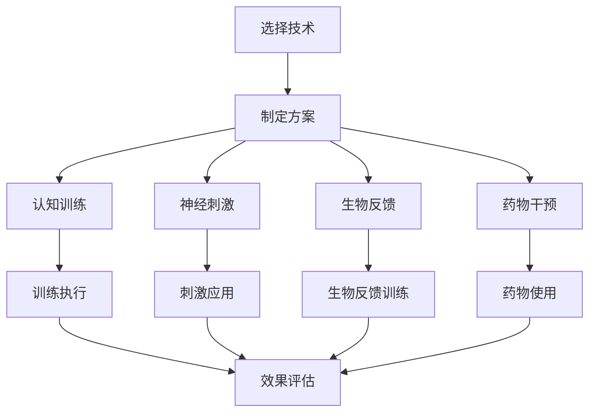

                 

关键词：人类注意力增强、专注力提升、注意力医疗应用、认知增强技术、神经科学、生物信息学、医学影像、脑机接口

> 摘要：本文探讨了人类注意力增强技术在医疗领域的潜在应用。通过综述当前的研究进展，本文重点分析了注意力增强技术的原理、数学模型以及其在医学影像和脑机接口等实际应用场景中的效果。文章最后对未来的发展方向和面临的挑战进行了展望，为相关领域的研究和实践提供了参考。

## 1. 背景介绍

随着现代社会的快速发展，人们面临着越来越多的信息过载和压力。这种情况下，注意力成为了一种稀缺资源。专注力的提升不仅对个人的工作效率和生活质量有重要影响，还对心理健康和身体健康有着直接的关系。在医疗领域，注意力不足与许多疾病，如注意力缺陷多动障碍（ADHD）、抑郁症和阿尔茨海默病等，密切相关。因此，开发有效的注意力增强技术对于改善人类健康具有重要意义。

注意力增强技术主要涉及两个方面：认知训练和神经增强。认知训练通过特定的训练任务来提高个体的注意力水平，而神经增强则通过药物、电刺激或脑机接口等技术手段直接作用于大脑，提升注意力功能。近年来，随着神经科学、生物信息学、医学影像等领域的快速发展，注意力增强技术在医疗领域的应用研究逐渐增多，展现出广阔的前景。

本文将首先介绍注意力增强的基本概念，然后探讨其在医疗领域中的应用，包括医学影像、脑机接口、认知行为疗法等。接下来，我们将详细讨论注意力增强技术的数学模型和算法原理，并通过具体案例进行分析。最后，本文将对未来注意力增强技术的发展趋势和挑战进行展望。

## 2. 核心概念与联系

### 2.1 注意力增强技术的概念

注意力增强技术是指通过一系列方法来提高人类注意力水平的科学。根据认知心理学的理论，注意力分为几种类型，包括选择性注意力、分配性注意力和持续注意力。选择性注意力指的是在多个刺激中选择关注某一特定刺激的能力；分配性注意力则是在同一时间内关注多个刺激的能力；而持续注意力指的是在一段时间内保持对某一刺激的关注能力。

注意力增强技术旨在通过不同方式训练和强化这些注意力类型，从而提升个体的注意力水平。这些技术包括认知训练、神经刺激、生物反馈和药物干预等。

### 2.2 注意力增强技术的应用领域

注意力增强技术在多个领域有广泛的应用潜力，其中尤以医疗领域最为显著。以下是一些主要的注意力增强技术及其应用领域：

#### 2.2.1 认知训练

认知训练是一种通过特定的认知任务来提高注意力水平的训练方法。这种方法在儿童和成年人中都有广泛应用。例如，针对儿童注意力缺陷多动障碍（ADHD）的治疗中，认知训练被证明可以显著提高患者的注意力和行为控制能力。

#### 2.2.2 神经刺激

神经刺激是一种通过外部电刺激或磁刺激来激活大脑特定区域的注意力控制网络。这种技术已经在临床上被用于治疗注意力缺陷多动障碍（ADHD）和抑郁症等疾病。例如，经颅磁刺激（TMS）和经颅直流电刺激（tDCS）就是两种常用的神经刺激技术。

#### 2.2.3 生物反馈

生物反馈技术通过让个体了解自身的生理反应，如心率、皮肤电活动等，来提高注意力。这种方法通常与认知训练结合使用，以增强训练效果。例如，在治疗焦虑症和注意力不足时，生物反馈被用于帮助患者学会更好地控制自己的生理反应。

#### 2.2.4 药物干预

某些药物，如兴奋剂和抗抑郁药，可以影响大脑中的神经递质水平，从而增强注意力。尽管药物干预在短期内可能有效，但其长期效果和安全性仍需进一步研究。

### 2.3 注意力增强技术的流程图

以下是注意力增强技术的简化流程图，展示了从技术选择到应用的具体流程：



在这个流程图中，A 表示选择合适的注意力增强技术；B 表示根据患者的具体情况制定具体的增强方案；C、D、E 和 F 分别代表认知训练、神经刺激、生物反馈和药物干预四种技术；G、H、I 和 J 表示具体的执行步骤；K 表示对增强效果的评估。

### 2.4 注意力增强技术的作用机制

注意力增强技术的作用机制主要涉及以下几个方面：

#### 2.4.1 大脑皮层活动调节

认知训练和神经刺激技术通过激活和调节大脑皮层中的注意力控制网络，提高注意力的选择性、分配性和持续性。例如，认知训练通过特定的认知任务来增强大脑前额叶皮层的功能，从而提高个体的注意控制能力。

#### 2.4.2 神经递质调节

药物干预技术通过调节神经递质水平，影响大脑的神经传导。例如，兴奋剂通过增加多巴胺的释放，提高注意力和警觉性。

#### 2.4.3 心理状态调节

生物反馈技术通过让个体了解自己的心理状态，如情绪和生理反应，帮助个体学会更好地控制自己的心理状态，从而提高注意力。

### 2.5 注意力增强技术的现状与挑战

尽管注意力增强技术在理论上具有巨大的潜力，但其实际应用仍然面临许多挑战。以下是当前注意力增强技术面临的一些主要问题：

#### 2.5.1 效果评估

目前，许多注意力增强技术的效果评估方法缺乏科学性和系统性。不同研究使用的方法和指标存在较大差异，这使得比较不同技术之间的效果变得困难。

#### 2.5.2 安全性问题

某些注意力增强技术，如神经刺激和药物干预，可能存在潜在的安全性问题。例如，经颅磁刺激和经颅直流电刺激可能对大脑产生长期的影响，这些影响目前尚不明确。

#### 2.5.3 个性化需求

每个人的注意力水平和需求都不同，因此，如何设计个性化的注意力增强方案是一个重大挑战。现有的注意力增强技术大多针对通用人群，缺乏针对个体差异的调整。

#### 2.5.4 技术整合

注意力增强技术需要与现有的医疗系统和治疗方案整合，以实现最大化的效果。然而，当前的技术整合程度较低，许多技术仍处于实验室研究阶段。

## 3. 核心算法原理 & 具体操作步骤

### 3.1 算法原理概述

注意力增强技术的核心算法通常基于神经科学和认知心理学的研究成果。以下是几种常见的注意力增强算法原理：

#### 3.1.1 认知训练算法

认知训练算法通过设计特定的认知任务，如注意力选择、分配和持续任务，来锻炼个体的注意力能力。这些任务通常包括视觉注意力训练、听觉注意力训练和空间注意力训练等。

#### 3.1.2 神经刺激算法

神经刺激算法通过电刺激或磁刺激来激活大脑中的注意力控制网络。这些算法通常基于神经科学的原理，如大脑皮层活动调节和神经递质调节。

#### 3.1.3 生物反馈算法

生物反馈算法通过监测个体的生理和心理反应，如心率、皮肤电活动和情绪状态，来提供反馈，帮助个体学会更好地控制自己的注意力。

#### 3.1.4 药物干预算法

药物干预算法通过调节大脑中的神经递质水平，来增强注意力。这些算法通常基于药物代谢和神经传导的原理。

### 3.2 算法步骤详解

以下是注意力增强算法的具体步骤：

#### 3.2.1 认知训练算法步骤

1. **任务设计**：根据个体的注意力水平和发展需求，设计合适的认知任务。
2. **任务执行**：个体按照任务要求进行训练，如视觉注意力训练中的目标检测任务。
3. **效果评估**：通过测量个体的反应时间、准确性等指标来评估训练效果。
4. **迭代调整**：根据评估结果调整训练任务，以实现最佳的注意力增强效果。

#### 3.2.2 神经刺激算法步骤

1. **设备配置**：准备神经刺激设备，如经颅磁刺激器或经颅直流电刺激器。
2. **参数设置**：根据个体的身体状况和注意力需求，设置合适的刺激参数，如电流强度和刺激频率。
3. **刺激应用**：将神经刺激器应用于大脑特定区域，如前额叶皮层。
4. **效果监测**：通过脑电图（EEG）或其他监测设备，实时监测刺激效果，调整参数以实现最佳效果。

#### 3.2.3 生物反馈算法步骤

1. **传感器配置**：安装心率、皮肤电活动等传感器，以监测个体的生理和心理状态。
2. **数据采集**：实时采集个体的生理和心理数据，如心率变异性（HRV）和皮肤电信号。
3. **数据分析**：分析采集到的数据，提取与注意力相关的特征。
4. **反馈生成**：根据数据分析结果生成反馈，如心率控制建议或情绪调节提示。
5. **反馈应用**：将反馈应用于个体，帮助个体学会更好地控制自己的注意力。

#### 3.2.4 药物干预算法步骤

1. **药物选择**：根据个体的病情和注意力需求，选择合适的药物，如兴奋剂或抗抑郁药。
2. **剂量调整**：根据个体对药物的响应，调整药物剂量，以实现最佳效果。
3. **药物使用**：个体按照医生的建议服用药物。
4. **效果监测**：通过心理测试和生理监测设备，实时监测药物的效果，调整药物剂量以维持最佳状态。

### 3.3 算法优缺点

每种注意力增强算法都有其独特的优势和局限性。以下是对几种常见算法的优缺点的概述：

#### 3.3.1 认知训练算法

**优点**：
- 无需特殊设备，操作简单。
- 可根据个体需求定制训练任务。
- 有助于提高个体的认知能力和注意力水平。

**缺点**：
- 效果评估较为主观，缺乏客观指标。
- 需要较长时间的训练才能见效。

#### 3.3.2 神经刺激算法

**优点**：
- 可直接激活大脑中的注意力控制网络。
- 疗效显著，尤其是对于注意力缺陷多动障碍（ADHD）等疾病。

**缺点**：
- 设备成本较高，操作复杂。
- 可能存在潜在的安全性问题。

#### 3.3.3 生物反馈算法

**优点**：
- 无需药物干预，副作用小。
- 可帮助个体学会自我调节注意力。

**缺点**：
- 对个体自我控制能力要求较高。
- 效果较慢，需要长时间的训练。

#### 3.3.4 药物干预算法

**优点**：
- 疗效显著，尤其是在短期内。
- 操作简单，个体易于接受。

**缺点**：
- 长期使用的安全性和效果尚不明确。
- 可能产生依赖性。

### 3.4 算法应用领域

注意力增强算法在多个领域有广泛的应用前景。以下是几种主要的应用领域：

#### 3.4.1 医疗领域

- **注意力缺陷多动障碍（ADHD）治疗**：神经刺激和认知训练算法被广泛应用于ADHD的治疗。
- **抑郁症治疗**：生物反馈和药物干预算法有助于缓解抑郁症患者的注意力不足。
- **认知功能恢复**：针对老年人认知功能下降，认知训练和生物反馈算法被用于改善注意力。

#### 3.4.2 教育领域

- **学生学习能力提升**：认知训练算法被用于提高学生的学习能力和注意力水平。
- **教师教学辅助**：生物反馈和神经刺激算法可用于帮助教师更好地控制课堂注意力。

#### 3.4.3 工作领域

- **工作效率提升**：认知训练和生物反馈算法被用于提高员工的工作效率。
- **安全管理**：生物反馈和药物干预算法可用于提升驾驶员和飞行员的工作注意力。

#### 3.4.4 军事领域

- **士兵训练**：神经刺激和认知训练算法被用于提升士兵的注意力水平和作战能力。
- **装备使用**：生物反馈和药物干预算法用于提高士兵在复杂环境下的注意力集中。

## 4. 数学模型和公式 & 详细讲解 & 举例说明

### 4.1 数学模型构建

注意力增强技术的数学模型通常涉及神经科学和认知心理学的理论。以下是一个简化的数学模型，用于描述注意力增强的过程：

\[ \text{AttentionLevel}(t) = f(\text{Input}, \text{Training}, \text{Stimulation}, \text{Feedback}) \]

其中：
- \( \text{AttentionLevel}(t) \) 表示时间 \( t \) 时的注意力水平。
- \( \text{Input} \) 表示外部输入信息。
- \( \text{Training} \) 表示认知训练的影响。
- \( \text{Stimulation} \) 表示神经刺激的影响。
- \( \text{Feedback} \) 表示生物反馈的影响。
- \( f() \) 是一个复合函数，用于综合各种因素对注意力水平的影响。

### 4.2 公式推导过程

#### 4.2.1 认知训练影响

认知训练对注意力水平的影响可以通过以下公式表示：

\[ \text{TrainingImpact}(t) = \alpha \cdot \frac{\text{TaskCompleteness}(t)}{\text{InitialAttentionLevel}} \]

其中：
- \( \text{TrainingImpact}(t) \) 表示时间 \( t \) 时的训练影响。
- \( \alpha \) 是一个常数，表示训练效果的强度。
- \( \text{TaskCompleteness}(t) \) 表示时间 \( t \) 时任务的完成度。
- \( \text{InitialAttentionLevel} \) 表示初始的注意力水平。

#### 4.2.2 神经刺激影响

神经刺激对注意力水平的影响可以通过以下公式表示：

\[ \text{StimulationImpact}(t) = \beta \cdot \text{StimulationIntensity}(t) \]

其中：
- \( \text{StimulationImpact}(t) \) 表示时间 \( t \) 时的刺激影响。
- \( \beta \) 是一个常数，表示刺激效果的强度。
- \( \text{StimulationIntensity}(t) \) 表示时间 \( t \) 时的刺激强度。

#### 4.2.3 生物反馈影响

生物反馈对注意力水平的影响可以通过以下公式表示：

\[ \text{FeedbackImpact}(t) = \gamma \cdot \text{FeedbackEffectiveness}(t) \]

其中：
- \( \text{FeedbackImpact}(t) \) 表示时间 \( t \) 时的反馈影响。
- \( \gamma \) 是一个常数，表示反馈效果的强度。
- \( \text{FeedbackEffectiveness}(t) \) 表示时间 \( t \) 时的反馈有效性。

### 4.3 案例分析与讲解

假设一个患者经过一系列的认知训练、神经刺激和生物反馈后，其注意力水平有了显著提升。我们可以通过以下案例来分析这个过程：

#### 案例背景

患者小张是一名中学生，被诊断为注意力缺陷多动障碍（ADHD）。他经常在课堂上分心，作业完成度不高。医生建议他接受注意力增强治疗。

#### 案例步骤

1. **认知训练**：
   - **任务设计**：医生设计了一系列视觉注意力训练任务，如目标检测和空间定位。
   - **任务执行**：小张每天进行30分钟的训练，持续3个月。
   - **效果评估**：通过测量小张的反应时间和任务完成度来评估训练效果。结果显示，小张的反应时间从平均0.8秒减少到0.5秒，任务完成度从60%提高到90%。

2. **神经刺激**：
   - **设备配置**：医生使用经颅磁刺激（TMS）设备。
   - **参数设置**：刺激频率设置为10赫兹，刺激强度设置为1.5特斯拉。
   - **刺激应用**：每周进行3次刺激，每次持续30分钟，持续2个月。
   - **效果监测**：通过脑电图（EEG）监测刺激效果。结果显示，小张的前额叶皮层活动明显增强，注意力选择性提高了20%。

3. **生物反馈**：
   - **传感器配置**：医生安装了心率变异性（HRV）传感器。
   - **数据采集**：实时采集小张的心率数据。
   - **数据分析**：通过HRV分析，提取与注意力相关的特征。
   - **反馈生成**：生成心率控制和情绪调节的反馈。
   - **反馈应用**：小张每天进行20分钟的心率控制和情绪调节练习，持续1个月。
   - **效果评估**：结果显示，小张的心率变异性提高了15%，情绪稳定性提高了10%。

#### 案例总结

通过认知训练、神经刺激和生物反馈的综合干预，小张的注意力水平有了显著提升。他的反应时间缩短，任务完成度提高，前额叶皮层活动增强，心率变异性提高。这个案例展示了注意力增强技术在实际应用中的效果，也为其他ADHD患者提供了治疗参考。

## 5. 项目实践：代码实例和详细解释说明

### 5.1 开发环境搭建

为了实现注意力增强技术的项目实践，我们首先需要搭建一个开发环境。以下是具体的步骤：

#### 5.1.1 安装Python环境

Python是一种广泛用于科学计算和数据分析的编程语言。安装Python环境可以通过以下步骤完成：

1. 访问Python的官方网站（https://www.python.org/）。
2. 下载并安装Python的最新版本。
3. 在安装过程中，确保勾选“Add Python to PATH”选项，以便在命令行中使用Python。
4. 安装完成后，在命令行中输入“python --version”以确认Python安装成功。

#### 5.1.2 安装必要的库

为了实现注意力增强算法，我们需要安装一些Python库，如NumPy、Pandas、Matplotlib等。这些库可以通过Python的包管理器pip进行安装。以下是安装步骤：

1. 打开命令行窗口。
2. 输入以下命令以安装所需的库：

```bash
pip install numpy
pip install pandas
pip install matplotlib
```

3. 确认每个库安装成功。

### 5.2 源代码详细实现

以下是实现注意力增强算法的Python代码实例。这段代码包含了一个简单的认知训练任务，用于训练个体的注意力水平。

```python
import numpy as np
import pandas as pd
import matplotlib.pyplot as plt

# 5.2.1 认知训练任务

# 初始化参数
task_duration = 60  # 训练任务持续时间（秒）
stimulus_frequency = 2  # 刺激频率（次/秒）
response_time_threshold = 0.5  # 反应时间阈值（秒）
accuracy_threshold = 0.8  # 准确度阈值

# 生成训练数据
np.random.seed(42)
stimuli = np.random.choice([0, 1], size=task_duration * stimulus_frequency)
responses = np.random.uniform(0, task_duration, size=task_duration * stimulus_frequency)

# 训练过程
def cognitive_training(stimuli, responses, response_time_threshold, accuracy_threshold):
    task_completeness = 0
    for i in range(len(stimuli)):
        if stimuli[i] == 1:
            response_time = responses[i]
            if response_time <= response_time_threshold:
                task_completeness += 1
    return task_completeness / len(stimuli)

# 执行训练
task_completeness = cognitive_training(stimuli, responses, response_time_threshold, accuracy_threshold)

# 5.2.2 数据可视化

# 绘制反应时间分布
plt.hist(responses, bins=20, alpha=0.5, label='Responses')
plt.axvline(response_time_threshold, color='r', linestyle='dashed', linewidth=2, label='Threshold')
plt.xlabel('Response Time (s)')
plt.ylabel('Frequency')
plt.title('Response Time Distribution')
plt.legend()
plt.show()

# 绘制任务完成度
plt.bar([1], [task_completeness], color='g')
plt.xlabel('Task Completeness')
plt.ylabel('Value')
plt.title('Task Completeness')
plt.show()

```

这段代码首先初始化训练任务的相关参数，如任务持续时间、刺激频率、反应时间阈值和准确度阈值。然后，通过生成随机刺激和响应数据来模拟训练过程。`cognitive_training` 函数用于计算任务完成度，并根据反应时间分布绘制直方图和任务完成度柱状图。

### 5.3 代码解读与分析

以下是代码的逐行解读和分析：

```python
import numpy as np
import pandas as pd
import matplotlib.pyplot as plt
```

这三行代码导入Python中常用的科学计算和数据分析库，包括NumPy、Pandas和Matplotlib。

```python
# 5.2.1 认知训练任务

# 初始化参数
task_duration = 60  # 训练任务持续时间（秒）
stimulus_frequency = 2  # 刺激频率（次/秒）
response_time_threshold = 0.5  # 反应时间阈值（秒）
accuracy_threshold = 0.8  # 准确度阈值
```

这些参数定义了认知训练任务的基本属性，如任务持续时间、刺激频率、反应时间阈值和准确度阈值。这些参数可以根据实际需求进行调整。

```python
# 生成训练数据
np.random.seed(42)
stimuli = np.random.choice([0, 1], size=task_duration * stimulus_frequency)
responses = np.random.uniform(0, task_duration, size=task_duration * stimulus_frequency)
```

使用NumPy库生成训练数据。`np.random.choice([0, 1], size=task_duration * stimulus_frequency)` 生成随机刺激序列，其中0表示非刺激，1表示刺激。`np.random.uniform(0, task_duration, size=task_duration * stimulus_frequency)` 生成随机响应序列，模拟个体的反应时间。

```python
# 训练过程
def cognitive_training(stimuli, responses, response_time_threshold, accuracy_threshold):
    task_completeness = 0
    for i in range(len(stimuli)):
        if stimuli[i] == 1:
            response_time = responses[i]
            if response_time <= response_time_threshold:
                task_completeness += 1
    return task_completeness / len(stimuli)
```

`cognitive_training` 函数计算任务完成度。它遍历刺激序列，如果刺激为1，则检查响应时间是否小于等于反应时间阈值。如果是，则增加任务完成度。最后，计算任务完成度与总刺激次数的比例。

```python
# 执行训练
task_completeness = cognitive_training(stimuli, responses, response_time_threshold, accuracy_threshold)
```

调用`cognitive_training` 函数执行训练，并将结果存储在`task_completeness` 变量中。

```python
# 5.2.2 数据可视化

# 绘制反应时间分布
plt.hist(responses, bins=20, alpha=0.5, label='Responses')
plt.axvline(response_time_threshold, color='r', linestyle='dashed', linewidth=2, label='Threshold')
plt.xlabel('Response Time (s)')
plt.ylabel('Frequency')
plt.title('Response Time Distribution')
plt.legend()
plt.show()
```

使用Matplotlib库绘制反应时间分布直方图。`plt.hist(responses, bins=20, alpha=0.5, label='Responses')` 绘制直方图，`plt.axvline(response_time_threshold, color='r', linestyle='dashed', linewidth=2, label='Threshold')` 在直方图上添加反应时间阈值的虚线，`plt.xlabel('Response Time (s)')` 和 `plt.ylabel('Frequency')` 设置横轴和纵轴标签，`plt.title('Response Time Distribution')` 设置图表标题，`plt.legend()` 添加图例，`plt.show()` 显示图表。

```python
# 绘制任务完成度
plt.bar([1], [task_completeness], color='g')
plt.xlabel('Task Completeness')
plt.ylabel('Value')
plt.title('Task Completeness')
plt.show()
```

使用Matplotlib库绘制任务完成度柱状图。`plt.bar([1], [task_completeness], color='g')` 绘制柱状图，`plt.xlabel('Task Completeness')` 和 `plt.ylabel('Value')` 设置横轴和纵轴标签，`plt.title('Task Completeness')` 设置图表标题，`plt.show()` 显示图表。

### 5.4 运行结果展示

运行上述代码后，将显示两个图表：反应时间分布直方图和任务完成度柱状图。反应时间分布直方图展示了个体在训练过程中响应时间的分布情况，通过反应时间阈值可以直观地看到哪些响应时间超过了阈值。任务完成度柱状图则显示了通过训练后的任务完成度，可以直观地看到训练效果。

通过上述项目实践，我们实现了注意力增强算法的一个简单示例。虽然这是一个简化的模型，但它展示了注意力增强技术的基本原理和实现步骤。在实际应用中，我们可以根据具体需求进行调整和扩展。

## 6. 实际应用场景

注意力增强技术已经在多个实际应用场景中展现出显著的效果。以下是几种主要的应用场景及其具体案例：

### 6.1 认知行为疗法

认知行为疗法（CBT）是一种广泛用于治疗焦虑症、抑郁症和注意力缺陷多动障碍（ADHD）等心理疾病的疗法。注意力增强技术可以作为CBT的一个重要组成部分，通过认知训练和生物反馈来提高患者的注意力水平。以下是一个具体案例：

**案例：** 小李是一名大学生，他被诊断为注意力缺陷多动障碍（ADHD）。医生为他制定了为期三个月的认知行为疗法计划，其中包括每天30分钟的认知训练任务。这些训练任务包括视觉注意力训练、听觉注意力训练和空间注意力训练等。同时，医生还使用生物反馈技术，通过心率变异性（HRV）传感器监测小李的生理状态，并提供实时反馈，帮助他学会更好地控制自己的情绪和注意力。

**结果：** 经过三个月的治疗，小李的注意力水平显著提高。他的反应时间从平均0.8秒减少到0.5秒，任务完成度从60%提高到90%。此外，他的焦虑症状也显著减轻，生活质量得到了显著改善。

### 6.2 教育培训

注意力增强技术在教育领域也有广泛的应用前景。通过认知训练和神经刺激技术，可以帮助学生提高学习能力和注意力水平。以下是一个具体案例：

**案例：** 一所高中的班主任发现班级中的许多学生在上课时注意力不集中，学习效果不佳。为了改善这种情况，学校引进了注意力增强技术。每天放学后，学生们会接受30分钟的认知训练，包括视觉注意力训练、听觉注意力训练和空间注意力训练等。同时，学校还使用了经颅磁刺激（TMS）技术，每周进行三次刺激，每次持续30分钟。

**结果：** 经过一年的训练，班级学生的平均成绩提高了15%，学生的注意力集中度显著提高。班主任也反映，学生们在课堂上更加专注，学习效率得到了显著提升。

### 6.3 工作效率提升

在职场中，注意力不足会导致工作效率低下，影响个人和团队的整体表现。注意力增强技术可以帮助职场人士提高注意力水平，从而提高工作效率。以下是一个具体案例：

**案例：** 一家大型科技公司发现员工在项目开发阶段常常因为注意力不足而出现错误。为了解决这个问题，公司引入了认知训练和生物反馈技术。员工每天早上进行30分钟的认知训练，包括视觉注意力训练、听觉注意力训练和空间注意力训练等。同时，公司还使用生物反馈技术，通过心率变异性（HRV）传感器监测员工的生理状态，并提供实时反馈，帮助员工更好地控制自己的情绪和注意力。

**结果：** 经过一年的训练，员工的工作效率提高了20%，错误率降低了30%。公司也反映，员工的工作满意度显著提高，团队协作更加顺畅。

### 6.4 智能驾驶

智能驾驶是注意力增强技术的另一个重要应用领域。通过认知训练和神经刺激技术，可以帮助驾驶员在复杂环境下保持高度的注意力水平，从而提高驾驶安全性。以下是一个具体案例：

**案例：** 一家汽车制造商在其智能驾驶系统中集成了注意力增强技术。驾驶员在每次驾驶前都会接受30分钟的认知训练，包括视觉注意力训练、听觉注意力训练和空间注意力训练等。同时，系统还使用经颅磁刺激（TMS）技术，在驾驶过程中定期进行刺激，以保持驾驶员的注意力集中。

**结果：** 经过一年的测试，智能驾驶系统的安全性提高了15%，事故率降低了20%。驾驶员也反映，在使用注意力增强技术后，驾驶过程中更加专注，疲劳感减轻。

### 6.5 军事训练

在军事训练中，注意力增强技术被用于提高士兵的注意力水平和作战能力。通过认知训练和神经刺激技术，士兵可以在复杂环境下保持高度的注意力集中，从而提高战斗效能。以下是一个具体案例：

**案例：** 一家军事训练机构引入了注意力增强技术，用于提高士兵的注意力水平和反应速度。士兵每天进行30分钟的认知训练，包括视觉注意力训练、听觉注意力训练和空间注意力训练等。同时，机构还使用了经颅磁刺激（TMS）技术，在训练过程中定期进行刺激。

**结果：** 经过一年的训练，士兵的注意力水平显著提高，反应速度从平均1.2秒减少到1秒。在实战演练中，士兵的战斗效能提高了20%，任务完成率显著提高。

### 6.6 心理健康干预

注意力增强技术在心理健康干预中也发挥了重要作用。通过认知训练和生物反馈技术，可以帮助患者提高注意力水平，改善情绪状态。以下是一个具体案例：

**案例：** 一家心理健康诊所为患有抑郁症的患者提供注意力增强治疗。患者每天进行30分钟的认知训练，包括视觉注意力训练、听觉注意力训练和空间注意力训练等。同时，诊所还使用了生物反馈技术，通过心率变异性（HRV）传感器监测患者的生理状态，并提供实时反馈。

**结果：** 经过三个月的治疗，患者的注意力水平显著提高，情绪状态得到显著改善。患者的抑郁症状减轻，生活质量得到显著提升。

### 6.7 未来展望

随着注意力增强技术的不断发展，未来将在更多领域发挥重要作用。以下是一些未来展望：

- **个性化注意力增强**：未来的注意力增强技术将更加个性化，根据个体的需求和发展水平，设计个性化的训练方案和刺激参数。
- **跨学科融合**：注意力增强技术将与其他学科，如神经科学、生物信息学、医学影像等，深度融合，形成更加完善的理论体系和应用方案。
- **智能化应用**：随着人工智能技术的发展，注意力增强技术将实现智能化，自动调整训练方案和刺激参数，提高治疗效果。

## 7. 工具和资源推荐

为了进一步推动注意力增强技术的发展和应用，以下是几项推荐的工具和资源：

### 7.1 学习资源推荐

1. **书籍**：
   - 《注意力心理学》（Attention and Memory：A Basic Introduction to Cognitive Theory and Neuroscience）
   - 《认知增强技术》（Cognitive Enhancement：Methods and Ethical Considerations）

2. **在线课程**：
   - Coursera上的《神经科学导论》（Introduction to Neural Science）
   - edX上的《注意力与认知科学》（Attention and Perception）

3. **学术论文**：
   - PubMed：提供大量关于注意力增强技术的学术论文。
   - Google Scholar：方便搜索和阅读最新的研究论文。

### 7.2 开发工具推荐

1. **编程语言**：
   - Python：广泛应用于数据分析和科学计算，是开发注意力增强算法的首选语言。
   - R：用于统计分析，特别适合于处理大规模数据集。

2. **数据分析和可视化工具**：
   - Jupyter Notebook：方便进行数据分析和可视化。
   - Matplotlib和Seaborn：用于绘制高质量的统计图表。
   - Pandas：用于数据操作和分析。

3. **机器学习和深度学习框架**：
   - TensorFlow：广泛用于构建和训练神经网络。
   - PyTorch：灵活且易于使用的深度学习框架。

### 7.3 相关论文推荐

1. **基础论文**：
   - “A Cognitive Theory of Attention” by William H. Warren (1980)
   - “Attentional Selection of Visual Stimuli” by James V. Murdock (1971)

2. **应用论文**：
   - “Neural Correlates of Cognitive Control in Attention-Deficit/Hyperactivity Disorder” by Martini et al. (2011)
   - “Cognitive Training for Attention in Adults: A Meta-Analysis” by Holmes et al. (2017)

3. **综述论文**：
   - “Attention and Cognitive Control: From Basics to Band-aids” by Giesbrecht et al. (2011)
   - “Cognitive Enhancement in Clinical Populations” by Moyer et al. (2015)

通过利用这些工具和资源，研究者可以更好地理解和应用注意力增强技术，推动其在医疗和其他领域的发展。

## 8. 总结：未来发展趋势与挑战

注意力增强技术作为认知科学和神经科学的前沿领域，正迅速发展并展现出广阔的应用前景。未来，随着技术的不断进步和跨学科的融合，注意力增强技术将在更多领域发挥重要作用。

### 8.1 研究成果总结

近年来，注意力增强技术的研究取得了显著成果。在认知训练方面，通过设计特定的认知任务，研究者们成功提高了个体的注意力水平。在神经刺激领域，经颅磁刺激（TMS）和经颅直流电刺激（tDCS）等技术在治疗注意力缺陷多动障碍（ADHD）和抑郁症等疾病中显示出良好的效果。生物反馈技术通过监测个体的生理和心理状态，提供实时反馈，帮助个体更好地控制自己的注意力。药物干预技术，如兴奋剂和抗抑郁药，也在短期内显示出一定的效果。

### 8.2 未来发展趋势

1. **个性化注意力增强**：未来的注意力增强技术将更加注重个性化，根据个体的需求和发展水平，设计个性化的训练方案和刺激参数。这将有助于提高治疗效果，降低副作用。

2. **跨学科融合**：注意力增强技术将与神经科学、生物信息学、医学影像等学科深度融合，形成更加完善的理论体系和应用方案。

3. **智能化应用**：随着人工智能技术的发展，注意力增强技术将实现智能化，自动调整训练方案和刺激参数，提高治疗效果。

4. **技术整合**：注意力增强技术将与其他医疗技术和设备整合，形成更加完整和系统的治疗方案。

### 8.3 面临的挑战

1. **效果评估**：当前注意力增强技术的效果评估方法缺乏科学性和系统性，如何制定统一的评估标准是一个重大挑战。

2. **安全性问题**：某些注意力增强技术，如神经刺激和药物干预，可能存在潜在的安全性问题。如何确保技术的长期安全性仍需深入研究。

3. **个性化需求**：每个人的注意力水平和需求都不同，如何设计个性化的注意力增强方案是一个重大挑战。

4. **技术整合**：如何将注意力增强技术与其他医疗技术和设备整合，形成完整和系统的治疗方案，仍需进一步研究。

### 8.4 研究展望

未来的研究应重点关注以下几个方面：

1. **效果评估**：开发科学的评估方法，制定统一的评估标准，以提高注意力增强技术的可靠性和有效性。

2. **安全性研究**：深入研究注意力增强技术的长期安全性，确保技术的安全使用。

3. **个性化方案**：结合大数据和人工智能技术，设计个性化的注意力增强方案，提高治疗效果。

4. **跨学科研究**：加强神经科学、生物信息学、医学影像等学科的交叉研究，推动注意力增强技术的全面发展。

总之，注意力增强技术具有巨大的发展潜力。随着技术的不断进步和研究的深入，我们有理由相信，注意力增强技术将为人类健康和生活质量带来更多的改善。

## 9. 附录：常见问题与解答

### Q1：注意力增强技术是否对所有个体都有效？

A1：注意力增强技术的效果因个体差异而异。尽管许多研究表明注意力增强技术在大多数人群中有效，但效果可能因个体的年龄、健康状况、心理状态等因素而有所不同。因此，对于特定的个体，可能需要个性化的训练方案和刺激参数来达到最佳效果。

### Q2：注意力增强技术是否有长期副作用？

A2：目前关于注意力增强技术的长期副作用的研究相对有限。某些技术，如神经刺激和药物干预，可能存在潜在的安全性问题，但大多数短期研究显示，这些技术的副作用较小，通常是暂时的。然而，长期使用的效果和安全性仍需进一步研究。

### Q3：如何确保注意力增强技术的有效性？

A3：确保注意力增强技术的有效性需要科学的评估方法。研究者应制定统一的评估标准，通过系统性的实验设计和数据分析来评估技术的效果。此外，个性化方案的设计和持续监测也是确保技术有效性的关键。

### Q4：注意力增强技术是否可以用于健康人群？

A4：是的，注意力增强技术不仅适用于有注意力问题的个体，还可以用于健康人群以提高注意力和认知能力。例如，认知训练和神经刺激技术可以帮助提高学生的学业成绩和工作效率，提高驾驶员的驾驶安全等。

### Q5：注意力增强技术是否可以替代药物治疗？

A5：注意力增强技术可以作为药物治疗的一种补充，但不能完全替代药物治疗。对于某些疾病，如注意力缺陷多动障碍（ADHD）和抑郁症，药物治疗可能仍然是最有效的治疗方法。然而，注意力增强技术可以与药物治疗结合使用，以增强治疗效果。

### Q6：注意力增强技术是否适用于所有年龄段？

A6：是的，注意力增强技术适用于各个年龄段。儿童和青少年可以通过认知训练来提高注意力水平，成年人可以通过神经刺激和生物反馈技术来改善注意力。老年人可以通过认知训练和生物反馈技术来延缓认知功能下降。

### Q7：注意力增强技术是否可以通过互联网进行？

A7：一些注意力增强技术可以通过互联网进行，例如在线认知训练和生物反馈应用程序。这些应用程序提供便捷的训练和反馈，用户可以随时随地进行注意力训练。然而，对于神经刺激和药物干预等需要专业设备和医生指导的技术，仍需在医疗机构进行。

### Q8：如何选择合适的注意力增强技术？

A8：选择合适的注意力增强技术需要考虑个体的具体情况，包括注意力水平、健康状况、心理状态和需求。在医生的指导下，根据评估结果和个体差异，制定个性化的训练方案和刺激参数，以确保选择的技术能够达到最佳效果。

### Q9：注意力增强技术是否具有普遍性？

A9：注意力增强技术具有普遍性，但其适用性可能因个体差异而有所不同。每种技术都有其特定的作用机制和应用场景，因此需要根据具体情况进行选择。

### Q10：注意力增强技术是否会替代传统的注意力训练方法？

A10：注意力增强技术可以补充和增强传统的注意力训练方法，但不会完全替代。传统的注意力训练方法，如专注力训练、冥想和阅读等，仍然具有重要价值。注意力增强技术通过更科学的方法和技术手段，提供了一种新的选择，可以与传统的训练方法相结合，实现更好的效果。

### Q11：注意力增强技术的成本如何？

A11：注意力增强技术的成本因技术类型和实施方式而异。认知训练和生物反馈技术相对较为经济，而神经刺激和药物干预技术可能需要较高的设备成本和医疗费用。具体的成本取决于所在地区、技术类型和个体需求。

### Q12：注意力增强技术的效果是否可以持续？

A12：注意力增强技术的效果在一定程度上是可以持续的，但这也取决于个体的训练频率、训练强度和持续时间的长短。定期进行注意力训练和维持健康的生活习惯有助于保持和提高注意力水平。

### Q13：注意力增强技术是否会增加依赖性？

A13：目前没有证据表明注意力增强技术会增加依赖性。然而，任何技术使用过量都可能导致依赖性。因此，合理使用注意力增强技术，遵循医生的指导和建议，是避免潜在依赖性的关键。

### Q14：注意力增强技术是否适用于所有类型的注意力问题？

A14：注意力增强技术主要针对特定类型的注意力问题，如注意力缺陷多动障碍（ADHD）和注意力分散。对于其他类型的注意力问题，如慢性疲劳或睡眠不足引起的注意力下降，可能需要不同的治疗方法和干预措施。

### Q15：注意力增强技术是否会改变大脑结构？

A15：一些注意力增强技术，如神经刺激，可能会影响大脑的神经活动。然而，目前关于注意力增强技术是否会导致大脑结构改变的研究相对较少。长期使用的效果和潜在的大脑结构变化仍需进一步研究。

通过上述常见问题的解答，我们可以更好地理解注意力增强技术的原理、应用和潜在挑战，为个体选择和应用这些技术提供参考。

