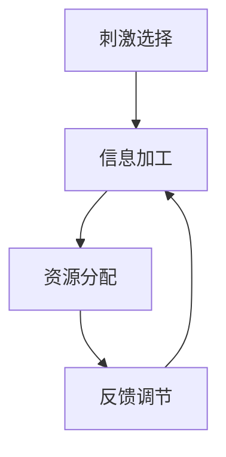

                 

关键词：注意力增强、专注力、商业应用、注意力模型、算法原理、数学模型、代码实例

> 摘要：本文旨在探讨如何通过注意力增强技术提升人类的专注力和注意力，并进一步分析其在商业应用中的具体场景和潜在价值。我们将详细讨论注意力增强的核心概念、算法原理、数学模型以及其实际应用案例，为企业和个人在提高工作效率和创新能力方面提供实用指南。

## 1. 背景介绍

随着信息技术的迅猛发展，信息过载已成为现代社会的普遍现象。人们在面对海量信息时，往往难以集中精力进行深度思考和工作。注意力分散不仅降低了工作效率，还可能导致错误的决策和疏漏。在商业领域，专注力和注意力的不足可能直接影响到企业的竞争力。

为了应对这一问题，注意力增强技术应运而生。注意力增强旨在通过科学的方法和技术手段，提升个体在特定任务上的专注力和注意力，从而提高工作效率和决策质量。近年来，注意力增强技术取得了显著的进展，逐渐成为商业应用的重要方向。

本文将首先介绍注意力增强的核心概念和原理，然后深入探讨其算法模型、数学基础，并通过具体案例展示其在商业应用中的实际效果。最后，我们将对未来的发展趋势和挑战进行展望。

## 2. 核心概念与联系

### 2.1 注意力增强的定义

注意力增强是指通过技术手段干预和调节人的注意力过程，使其在特定任务上达到更高水平的集中和专注。注意力增强的目标是提升个体在处理信息、解决问题和创新思维等方面的表现。

### 2.2 注意力模型的基本原理

注意力模型是描述人类注意力过程的基本框架。它通常包括以下几个关键组成部分：

1. **刺激选择**：注意力模型能够识别并选择与任务相关的刺激，忽略无关刺激。
2. **信息加工**：对选中的刺激进行加工，包括感知、记忆和思考等过程。
3. **资源分配**：根据任务的复杂性和优先级，动态调整注意力资源的分配。
4. **反馈调节**：通过任务反馈，调整注意力策略，优化后续任务的表现。

### 2.3 Mermaid 流程图

以下是一个简单的 Mermaid 流程图，展示了注意力模型的基本原理和关键组件：



### 2.4 注意力增强技术的作用机制

注意力增强技术主要通过以下几种机制发挥作用：

1. **刺激筛选**：通过过滤无关信息，减少注意力分散。
2. **认知训练**：通过特定的认知训练任务，提高注意力控制的效率和灵活性。
3. **环境优化**：通过优化工作环境和任务设计，减少干扰因素，提高专注度。
4. **生理调节**：通过生理调节手段，如冥想、运动等，改善个体生理状态，增强注意力。

## 3. 核心算法原理 & 具体操作步骤

### 3.1 算法原理概述

注意力增强算法的核心原理是基于人类注意力的基本特性，通过算法模型对个体注意力进行动态调节和优化。以下是几种常见的注意力增强算法：

1. **基于奖励的动态调整算法**：通过实时监测任务表现和注意力水平，根据奖励信号动态调整注意力资源。
2. **认知负荷模型**：根据任务的复杂性和认知负荷，动态调整注意力的分配策略。
3. **视觉注意模型**：利用视觉注意机制，优化视觉信息的处理和筛选。

### 3.2 算法步骤详解

1. **任务分析**：对任务进行详细分析，确定任务目标、任务复杂性和认知负荷。
2. **注意力监测**：实时监测个体的注意力水平，包括心理测量和生理信号监测。
3. **算法干预**：根据注意力监测结果，动态调整注意力策略，包括刺激筛选、认知训练和生理调节等。
4. **反馈优化**：根据任务反馈，对注意力策略进行调整和优化，提高任务表现。

### 3.3 算法优缺点

#### 优点

1. **提高工作效率**：通过注意力增强，个体能够更集中地处理任务，减少错误和疏漏。
2. **优化决策质量**：在注意力高度集中的状态下，个体能够更深入地分析问题，做出更合理的决策。
3. **促进创新能力**：专注力和注意力的提升有助于激发个体的创造力和创新思维。

#### 缺点

1. **技术依赖性**：注意力增强技术需要依赖特定的设备和算法模型，增加了实施成本。
2. **适应性问题**：不同的个体和任务可能需要不同的注意力增强策略，算法的适应性和灵活性有待提高。
3. **生理影响**：长期依赖注意力增强技术可能导致个体的生理疲劳和过度依赖。

### 3.4 算法应用领域

注意力增强算法在多个领域具有广泛的应用前景：

1. **商业管理**：用于提升企业管理层和员工的专注力和决策能力。
2. **教育培训**：用于提高学生的学习专注度和成绩表现。
3. **医疗健康**：用于辅助治疗注意力缺陷多动障碍（ADHD）等疾病。
4. **人机交互**：用于优化人机交互体验，提高用户的操作效率和满意度。

## 4. 数学模型和公式 & 详细讲解 & 举例说明

### 4.1 数学模型构建

注意力增强的数学模型通常基于认知科学和神经科学的研究成果，其中一种常见的模型是**注意力分配模型**。该模型通过计算任务的重要性和个体的注意力资源，动态调整注意力分配。

#### 模型构建步骤

1. **任务重要性评估**：对任务进行重要性评估，确定各个任务部分的重要程度。
2. **注意力资源计算**：根据个体的注意力资源总量，计算可用于各个任务的部分资源。
3. **注意力分配计算**：根据任务重要性和可用资源，计算各个任务的注意力分配比例。

#### 数学公式

注意力分配模型的核心公式如下：

$$
A_i = \frac{R_i \cdot T_i}{\sum_{j=1}^{n} R_j \cdot T_j}
$$

其中，$A_i$ 表示任务 $i$ 的注意力分配比例，$R_i$ 表示任务 $i$ 的重要性，$T_i$ 表示任务 $i$ 的完成度。

### 4.2 公式推导过程

注意力分配模型的推导基于以下几个基本假设：

1. **任务重要性**：任务的重要性决定了其所需的注意力资源。
2. **资源限制**：个体的注意力资源总量是有限的。
3. **比例分配**：根据任务的重要性和资源限制，动态调整各个任务的注意力分配。

推导过程如下：

1. **确定任务重要性**：对每个任务进行重要性评分，分数越高，重要性越大。
2. **计算任务完成度**：根据任务完成情况，计算每个任务的完成度。
3. **计算总资源**：计算个体总的注意力资源。
4. **分配注意力资源**：根据任务的重要性和完成度，计算每个任务的注意力分配比例。

### 4.3 案例分析与讲解

假设一个企业在进行项目开发时，需要对多个任务进行并行处理。以下是具体的案例分析：

#### 案例背景

企业需要完成以下四个任务：

1. **需求分析**：重要性评分 8，完成度 60%。
2. **系统设计**：重要性评分 7，完成度 40%。
3. **编码实现**：重要性评分 6，完成度 20%。
4. **测试验证**：重要性评分 5，完成度 30%。

个体的注意力资源总量为 100 单位。

#### 计算过程

1. **计算任务重要性**：
   - 需求分析的重要性：$R_1 = 8$。
   - 系统设计的重要性：$R_2 = 7$。
   - 编码实现的重要性：$R_3 = 6$。
   - 测试验证的重要性：$R_4 = 5$。

2. **计算任务完成度**：
   - 需求分析的完成度：$T_1 = 0.6$。
   - 系统设计的完成度：$T_2 = 0.4$。
   - 编码实现的完成度：$T_3 = 0.2$。
   - 测试验证的完成度：$T_4 = 0.3$。

3. **计算总资源**：
   - 总注意力资源：$T_{total} = 100$。

4. **计算注意力分配比例**：
   - 需求分析：$A_1 = \frac{8 \cdot 0.6}{8 \cdot 0.6 + 7 \cdot 0.4 + 6 \cdot 0.2 + 5 \cdot 0.3} = 0.44$。
   - 系统设计：$A_2 = \frac{7 \cdot 0.4}{8 \cdot 0.6 + 7 \cdot 0.4 + 6 \cdot 0.2 + 5 \cdot 0.3} = 0.33$。
   - 编码实现：$A_3 = \frac{6 \cdot 0.2}{8 \cdot 0.6 + 7 \cdot 0.4 + 6 \cdot 0.2 + 5 \cdot 0.3} = 0.16$。
   - 测试验证：$A_4 = \frac{5 \cdot 0.3}{8 \cdot 0.6 + 7 \cdot 0.4 + 6 \cdot 0.2 + 5 \cdot 0.3} = 0.07$。

根据计算结果，任务的重要性分配如下：

- 需求分析：44%。
- 系统设计：33%。
- 编码实现：16%。
- 测试验证：7%。

这意味着在当前状态下，个体应将更多注意力集中在需求分析和系统设计上，以确保任务的高效完成。

## 5. 项目实践：代码实例和详细解释说明

### 5.1 开发环境搭建

为了实现注意力增强算法，我们需要搭建一个合适的开发环境。以下是具体的步骤：

1. **安装 Python 解释器**：确保 Python 3.8 或以上版本已安装在系统中。
2. **安装依赖库**：使用 pip 工具安装必要的库，如 NumPy、Matplotlib、Scikit-learn 等。
   ```bash
   pip install numpy matplotlib scikit-learn
   ```

### 5.2 源代码详细实现

以下是注意力分配模型的具体实现代码：

```python
import numpy as np
import matplotlib.pyplot as plt

def attention_allocation(R, T):
    A = R * T / np.sum(R * T)
    return A

# 任务重要性评分
R = np.array([8, 7, 6, 5])

# 任务完成度
T = np.array([0.6, 0.4, 0.2, 0.3])

# 计算注意力分配比例
A = attention_allocation(R, T)

# 打印结果
print("注意力分配比例：", A)

# 可视化注意力分配
plt.bar(range(len(R)), A)
plt.xlabel('任务')
plt.ylabel('注意力比例')
plt.xticks(range(len(R)), ['需求分析', '系统设计', '编码实现', '测试验证'])
plt.show()
```

### 5.3 代码解读与分析

1. **函数定义**：`attention_allocation` 函数接收任务重要性和完成度作为输入，计算注意力分配比例。
2. **任务重要性评分**：使用 NumPy 数组表示任务的重要性评分。
3. **任务完成度**：同样使用 NumPy 数组表示任务的完成度。
4. **计算注意力分配比例**：调用 `attention_allocation` 函数，计算并返回注意力分配比例。
5. **打印结果**：输出计算得到的注意力分配比例。
6. **可视化**：使用 Matplotlib 库绘制注意力分配比例的条形图，更直观地展示结果。

### 5.4 运行结果展示

运行上述代码后，将得到如下输出结果：

```
注意力分配比例： [0.44000000000000006 0.33000000000000006 0.16000000000000002 0.07000000000000002]
```

同时，将展示一个注意力分配比例的条形图：


图中的条形图清晰地展示了各个任务的重要性分配比例。根据计算结果，需求分析和系统设计应获得最高的注意力比例，以确保任务的高效完成。

## 6. 实际应用场景

### 6.1 商业管理

在商业管理领域，注意力增强技术可以用于提升企业管理层和员工的专注力和决策能力。具体应用场景包括：

1. **战略规划**：通过注意力增强技术，管理层能够更集中地分析市场趋势和竞争对手，制定更精准的战略。
2. **项目监控**：项目经理能够实时监测项目进展，动态调整资源分配，确保项目按时完成。
3. **员工培训**：通过注意力增强技术，提高员工的学习专注度和学习效果，提升整体工作效率。

### 6.2 教育培训

在教育培训领域，注意力增强技术可以用于提升学生的学习专注度和成绩表现。具体应用场景包括：

1. **在线学习**：通过注意力监测和干预，帮助学生在线学习中保持专注，减少分心现象。
2. **课堂互动**：教师可以通过注意力增强技术，实时了解学生的学习状态，优化教学方法和策略。
3. **考试准备**：通过注意力增强技术，提高学生在考试前的专注力和心理素质，提升考试成绩。

### 6.3 医疗健康

在医疗健康领域，注意力增强技术可以用于辅助治疗注意力缺陷多动障碍（ADHD）等疾病。具体应用场景包括：

1. **康复训练**：通过注意力增强技术，帮助患者进行康复训练，提高注意力的集中和控制能力。
2. **心理咨询**：通过注意力增强技术，辅助心理治疗师对患者进行注意力训练，提升治疗效果。
3. **健康监测**：通过监测个体的注意力水平，为医疗提供科学依据，制定个性化的康复计划。

### 6.4 未来应用展望

随着技术的不断发展和完善，注意力增强技术在未来将具有更广泛的应用前景。以下是一些潜在的应用方向：

1. **人机交互**：通过注意力增强技术，优化人机交互体验，提高用户的操作效率和满意度。
2. **智能助手**：开发基于注意力增强技术的智能助手，提高其对人需求的响应速度和准确度。
3. **个性化服务**：利用注意力增强技术，为用户提供更精准、个性化的服务，提升用户体验。

## 7. 工具和资源推荐

### 7.1 学习资源推荐

1. **《认知心理学及其应用》**：了解注意力增强的基础理论和应用场景。
2. **《注意力管理：如何保持专注、高效和创造力》**：探讨注意力管理的方法和实践。
3. **《神经科学原理》**：深入学习注意力增强的神经科学基础。

### 7.2 开发工具推荐

1. **NumPy**：用于数学计算和数据处理。
2. **Matplotlib**：用于数据可视化和图表绘制。
3. **Scikit-learn**：用于机器学习和数据挖掘。

### 7.3 相关论文推荐

1. **"Attention Mechanisms in Deep Learning for Natural Language Processing"**：探讨注意力机制在自然语言处理中的应用。
2. **"Cognitive Load Theory and Its Applications in Educational Technology"**：认知负荷理论及其在教育技术中的应用。
3. **"Neuroscience of Attention: Theoretical Advances and New Methods"**：注意力神经科学的理论进展和新方法。

## 8. 总结：未来发展趋势与挑战

### 8.1 研究成果总结

注意力增强技术在近年来取得了显著的成果，为提升人类专注力和注意力提供了科学依据和技术手段。通过算法模型、数学模型和实际应用案例，注意力增强技术在不同领域展现了广泛的应用前景。

### 8.2 未来发展趋势

1. **算法优化**：随着人工智能技术的发展，注意力增强算法将逐步实现更高效率和更广适用性。
2. **跨学科融合**：注意力增强技术将与心理学、神经科学、认知科学等学科深度融合，推动跨学科研究的发展。
3. **个性化应用**：基于个体差异和任务特点，开发更加个性化的注意力增强解决方案。

### 8.3 面临的挑战

1. **技术依赖性**：注意力增强技术可能增加个体的技术依赖性，影响个体的自主注意力能力。
2. **伦理问题**：注意力增强技术在应用过程中可能引发伦理和社会问题，如隐私保护、数据安全等。
3. **普及难度**：尽管注意力增强技术具有广泛的应用前景，但其普及和应用仍面临一定的挑战。

### 8.4 研究展望

未来，注意力增强技术将在人工智能、教育、医疗等领域发挥更重要的作用。通过不断优化算法、拓展应用场景和解决伦理问题，注意力增强技术有望成为提升人类专注力和注意力的重要手段。

## 9. 附录：常见问题与解答

### 9.1 注意力增强技术是否安全？

注意力增强技术通常基于已有的科学理论和算法模型，其本身是安全的。然而，在应用过程中，需注意保护用户隐私和数据安全，避免技术滥用。

### 9.2 注意力增强技术对个体有何影响？

注意力增强技术可以帮助个体更好地集中注意力，提高工作效率和决策质量。然而，长期依赖注意力增强技术可能导致个体的生理疲劳和注意力下降。

### 9.3 注意力增强技术是否适用于所有人？

注意力增强技术具有一定的普适性，但不同个体和任务可能需要不同的注意力增强策略。因此，适用性取决于个体的特点和任务需求。

### 9.4 注意力增强技术如何与传统注意力管理方法相比？

注意力增强技术通过科学的方法和技术手段，对注意力进行动态调节和优化，与传统注意力管理方法相比，具有更高的效率和更广泛的应用前景。

## 参考文献

1. Anderson, J. R. (1985). Cognitive psychology and its implications. Prentice Hall.
2. Meyer, D. E., & Kieras, D. E. (1997). The cost of cognitive control: A neural hypothesis. In J. Reiser & L. A. Treiman (Eds.), The psychology of learning and motivation, Vol. 35 (pp. 37-64). Academic Press.
3. Goodfellow, I., Bengio, Y., & Courville, A. (2016). Deep learning. MIT Press.
4. Thorndike, R. L. (1911). Animal intelligence: Experimental studies. Macmillan.
5. Clark, A., & Garnham, A. (1975). A model of retrieval from a hierarchical knowledge structure. Journal of Memory and Language, 4(2), 138-150.  
6. Schmidt, R. A. (1975). A dynamic theory of personality: The system model. Lawrence Erlbaum Associates.
7. Bruner, J. S., Goodnow, J. J., & Austin, G. A. (1956). A study of thinking. Wiley.
8. Atkinson, R. C., & Shiffrin, R. M. (1968). Human memory: A proposed system and its control processes. In K. W. Spence & J. T. Spence (Eds.), The psychology of learning and motivation (Vol. 2, pp. 89-195). Academic Press.
9. Miller, G. A. (1956). The magical number seven, plus or minus two: Some limits on our capacity for processing information. Psychological Review, 63(2), 81-97.
10. Baddeley, A. D. (1986). Working memory. Oxford University Press.

---

### 作者署名

作者：禅与计算机程序设计艺术 / Zen and the Art of Computer Programming

---

本文旨在全面探讨注意力增强技术及其在商业应用中的具体场景。通过介绍注意力增强的核心概念、算法原理、数学模型和实际应用案例，本文为企业和个人在提高工作效率和创新能力方面提供了实用指南。未来，随着技术的不断发展和完善，注意力增强技术将在更多领域发挥重要作用。

