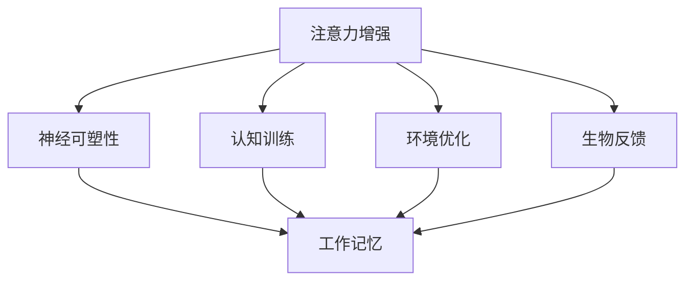

                 

关键词：注意力增强、专注力、商业应用、未来发展、挑战预测

摘要：本文旨在探讨人类注意力增强在商业领域中的重要性，分析其在提升专注力和注意力方面的潜在机遇，并预测未来可能面临的挑战。文章首先介绍了注意力增强的核心概念和联系，随后详细阐述了相关算法原理、数学模型和项目实践。通过实际应用场景的展示，本文进一步探讨了未来的应用前景，并总结了相关工具和资源推荐。最后，文章对未来发展趋势与挑战进行了深入分析，为研究人员和实践者提供了有价值的参考。

## 1. 背景介绍

在当今信息爆炸的时代，人们面临着越来越多的干扰和分心因素。无论是电子邮件、社交媒体还是手机通知，这些都不断地占据着我们的时间和精力，导致我们的注意力分散。这种注意力分散不仅影响了我们的工作和学习效率，还可能对身心健康产生负面影响。因此，如何增强人类的注意力，提高专注力，成为了一个备受关注的问题。

商业领域对注意力的需求尤为突出。在商业活动中，专注力和注意力是实现高效率决策、创新和竞争力的重要因素。从企业管理者到普通员工，每个人都希望能够更好地集中注意力，从而提高工作效率和成果。因此，注意力增强技术在商业中的应用前景非常广阔。

本文旨在研究人类注意力增强在商业中的重要性，分析其在提升专注力和注意力方面的机遇，并预测未来可能面临的挑战。通过综合分析注意力增强技术的核心概念、算法原理、数学模型以及项目实践，本文试图为研究人员和实践者提供有价值的参考，以推动这一领域的进一步发展。

### 1.1 注意力分散现象及其影响

注意力分散（Attention Deficit Hyperactivity Disorder，ADHD）是指个体在完成任务或进行活动时，注意力难以集中，容易分心，同时伴随着过度活动和冲动行为。这种症状在儿童和成年人中都有出现，对个人和社会都产生了深远的影响。

在个人层面，注意力分散会导致学习效率下降、工作效率降低，甚至影响个人的身心健康。研究表明，注意力分散与抑郁症、焦虑症等心理问题密切相关。此外，注意力分散还会影响人际交往，导致沟通障碍和关系紧张。

在社会层面，注意力分散的现象给企业和组织带来了巨大的损失。据估算，全球因注意力分散导致的损失高达数百亿美元。在职场中，员工因注意力分散而错失重要信息、遗漏关键任务，甚至引发安全事故。在企业运营中，管理层因注意力分散而无法做出准确决策，可能导致业务下滑和损失。

### 1.2 注意力增强的重要性

注意力增强是指通过各种方法提高个体注意力的集中度和持久性，使其能够更高效地完成任务。在商业领域，注意力增强具有以下几个重要性：

**提升工作效率：** 在职场中，专注力和注意力是高效工作的重要保障。通过注意力增强技术，员工可以更快速地完成任务，减少因分心导致的错误和重复工作。

**增强决策能力：** 在商业决策过程中，管理者需要集中注意力分析市场数据、评估风险和机会。注意力增强可以帮助管理者更好地掌握信息，做出更明智的决策。

**提高创新能力：** 创新是企业发展的重要驱动力。注意力增强有助于员工在创新过程中保持专注，从而提高创新效率和质量。

**增强团队合作：** 在团队合作中，每个成员都需要具备良好的专注力和注意力，以确保团队目标的实现。注意力增强可以促进团队成员之间的沟通和协作，提高团队的整体效能。

### 1.3 商业领域中注意力增强的应用前景

商业领域对注意力增强技术的需求日益增长，以下是其应用前景的几个方面：

**人力资源管理：** 企业可以通过注意力增强技术，提高员工的工作效率和创新能力，从而提升整体竞争力。同时，注意力增强可以帮助企业更好地进行人才选拔和培养。

**市场营销：** 在市场营销活动中，注意力增强可以帮助企业吸引潜在客户，提高广告效果。通过精准分析客户注意力，企业可以制定更具针对性的营销策略。

**客户服务：** 注意力增强技术可以帮助客户服务人员更专注于客户需求，提高服务质量，提升客户满意度。

**项目管理：** 在项目管理过程中，注意力增强有助于项目经理更好地掌握项目进度，确保项目按时完成。

总之，注意力增强在商业领域具有巨大的应用潜力，有望成为未来企业发展的重要战略资源。在接下来的部分中，本文将详细探讨注意力增强的核心概念、算法原理以及数学模型。

## 2. 核心概念与联系

### 2.1 注意力增强的基本原理

注意力增强是指通过一系列方法提高个体的注意力水平，使其能够更专注地完成任务。注意力增强的基本原理主要包括以下几个方面：

**神经可塑性：** 神经可塑性是指神经元结构和功能的可塑性变化，这种变化可以通过训练和学习来实现。注意力增强技术通过刺激大脑特定区域，促进神经元之间的连接和神经通路的发展，从而提高注意力水平。

**认知训练：** 认知训练是一种通过特定任务和练习来改善认知功能的方法。注意力增强技术通过设计一系列认知训练任务，如注意力切换、多任务处理等，来锻炼个体的注意力能力。

**环境优化：** 环境优化是指通过改善外部环境来降低干扰，提高注意力水平。例如，减少噪音、避免视觉干扰、合理安排工作时间等，都有助于提升个体的注意力。

**生物反馈：** 生物反馈是一种通过监测和分析生理信号，如脑电波、心率等，来调整个体行为的方法。注意力增强技术通过生物反馈设备，实时监测个体的生理状态，提供反馈信号，帮助个体调整注意力。

### 2.2 注意力模型与工作记忆

注意力模型是描述注意力如何分配和调节的理论框架。其中，工作记忆（Working Memory，WM）是注意力模型中的一个重要组成部分。工作记忆是指大脑在处理信息时，暂时存储和操作信息的认知系统。

工作记忆与注意力密切相关，主要表现在以下几个方面：

**信息存储：** 工作记忆负责在处理信息时存储和保持相关数据。注意力增强技术通过提高工作记忆容量和效率，使个体能够更好地存储和处理信息。

**信息加工：** 工作记忆不仅存储信息，还负责对信息进行加工和操作。注意力增强技术通过优化工作记忆的加工过程，提高个体的认知处理能力。

**注意力分配：** 工作记忆在分配注意力方面发挥着重要作用。注意力增强技术通过提高工作记忆的效率，使个体能够更灵活地分配注意力，从而更好地应对多任务环境。

### 2.3 注意力分散与专注力

注意力分散（Attention Deficit）是指个体在完成任务时，注意力无法集中，容易受到外界干扰的现象。与注意力分散相对的是专注力（Focus），即个体在任务执行过程中，能够长时间保持高度集中的状态。

注意力分散与专注力之间的关系可以概括为以下几点：

**相互影响：** 注意力分散和专注力是相互影响、相互制约的。注意力分散会导致专注力下降，而专注力增强则有助于减少注意力分散。

**动态平衡：** 在实际任务中，个体的注意力水平和专注力处于动态平衡状态。通过注意力增强技术，可以调整这一平衡，使个体在需要时能够更好地集中注意力。

**个性差异：** 不同个体在注意力分散和专注力方面存在差异。一些个体可能更容易分心，而另一些个体则更具有专注力。注意力增强技术可以帮助个体在不同情境下调整注意力水平，以适应特定任务的需求。

### 2.4 Mermaid 流程图

以下是一个简化的 Mermaid 流程图，展示了注意力增强的核心概念和联系：



通过上述流程图，我们可以清晰地看到注意力增强技术如何通过不同的途径影响工作记忆，进而提高专注力和注意力水平。在接下来的部分中，我们将详细探讨注意力增强的核心算法原理和具体操作步骤。

### 2.5 核心算法原理

注意力增强技术基于一系列核心算法，这些算法通过不同的机制和方法，旨在提高个体的注意力水平和专注力。以下是几种常见注意力增强算法的原理和特点：

#### 2.5.1 基于神经可塑性的算法

**原理：** 神经可塑性是指神经元结构和功能在学习和训练过程中的可塑性变化。基于神经可塑性的算法通过激活大脑特定区域，促进神经元之间的连接和神经通路的发展，从而提高注意力水平。

**特点：** 
- **适应性：** 算法可以根据个体差异和环境变化，自动调整训练强度和策略。
- **灵活性：** 算法可以结合多种训练方法，如电刺激、认知训练等，提高训练效果。

#### 2.5.2 基于认知训练的算法

**原理：** 认知训练是一种通过特定任务和练习来改善认知功能的方法。基于认知训练的算法设计一系列注意力训练任务，如注意力切换、多任务处理等，以锻炼个体的注意力能力。

**特点：** 
- **针对性：** 算法可以根据个体的认知特点和需求，定制训练任务。
- **效率高：** 认知训练任务设计科学，能够在短时间内显著提高注意力水平。

#### 2.5.3 基于环境优化的算法

**原理：** 环境优化是指通过改善外部环境来降低干扰，提高注意力水平。基于环境优化的算法通过监测和分析外部环境因素，如噪音、光线、工作时间等，提供个性化的环境优化建议。

**特点：** 
- **实用性：** 算法能够根据实际工作生活场景，提供切实可行的优化方案。
- **可扩展性：** 算法可以结合其他注意力增强技术，实现更全面的环境优化。

#### 2.5.4 基于生物反馈的算法

**原理：** 生物反馈是一种通过监测和分析生理信号，如脑电波、心率等，来调整个体行为的方法。基于生物反馈的算法通过实时监测个体的生理状态，提供反馈信号，帮助个体调整注意力。

**特点：** 
- **实时性：** 算法能够实时监测和分析生理信号，快速响应注意力变化。
- **个性化：** 算法可以根据个体生理特点，定制反馈策略。

#### 2.5.5 聚类分析算法

**原理：** 聚类分析算法是一种无监督学习方法，通过将数据分为不同的簇，识别出个体之间的相似性和差异性。在注意力增强中，聚类分析算法可以识别出注意力分散和专注力不足的个体，提供针对性的训练方案。

**特点：** 
- **高效性：** 算法能够快速处理大量数据，识别出注意力问题的关键点。
- **可解释性：** 算法的聚类结果和解释过程相对直观，有助于理解个体注意力状况。

通过上述核心算法的原理和特点，我们可以看到注意力增强技术在多方面发挥作用，为提升人类注意力提供了丰富的技术手段。在接下来的部分中，我们将详细阐述注意力增强的具体操作步骤和实现方法。

### 2.6 具体操作步骤

注意力增强技术涉及多个方面，包括神经可塑性训练、认知训练、环境优化和生物反馈等。以下是一般操作步骤的详细说明：

#### 2.6.1 神经可塑性训练

**步骤 1：设备选择与准备**  
首先，选择合适的神经可塑性训练设备，如脑电信号采集装置。确保设备能够稳定地采集脑电信号，并进行预处理。

**步骤 2：数据采集**  
在特定条件下，如安静环境、舒适姿势等，采集参与者的脑电信号。数据采集过程中，确保信号质量，并记录相关环境参数，如温度、湿度等。

**步骤 3：数据分析**  
利用信号处理算法，对采集到的脑电信号进行分析，提取出与注意力相关的特征，如β波、θ波等。通过对比正常状态和专注状态下的特征差异，识别出个体的注意力水平。

**步骤 4：训练设计**  
根据分析结果，设计个性化的神经可塑性训练计划。训练计划应包括电刺激参数、训练时长、训练频率等。

**步骤 5：训练实施**  
在规定条件下，实施神经可塑性训练。训练过程中，实时监测参与者的生理和心理状态，确保训练效果。

#### 2.6.2 认知训练

**步骤 1：任务设计**  
设计一系列认知训练任务，如注意力切换、多任务处理、记忆任务等。任务应具有一定的难度，同时保证可操作性。

**步骤 2：任务执行**  
在安静环境下，让参与者执行认知训练任务。在任务执行过程中，记录参与者的反应时间、正确率等指标，以评估注意力水平。

**步骤 3：数据分析**  
对任务执行数据进行分析，计算参与者的平均反应时间、错误率等指标。通过对比训练前后的数据，评估认知训练的效果。

**步骤 4：训练调整**  
根据数据分析结果，调整认知训练任务的难度和类型。逐步提高任务的复杂度，以适应个体的发展需求。

#### 2.6.3 环境优化

**步骤 1：环境评估**  
评估工作或学习环境中的干扰因素，如噪音、光线、空间布局等。

**步骤 2：优化建议**  
根据评估结果，提供个性化的环境优化建议。例如，调整噪音级别、改变光线角度、优化空间布局等。

**步骤 3：实施优化**  
在规定时间内，实施环境优化措施。确保优化措施符合实际需求，并能够持续发挥作用。

#### 2.6.4 生物反馈

**步骤 1：设备选择与准备**  
选择合适的生物反馈设备，如心率监测器、脑电信号采集装置等。确保设备能够稳定地采集生理信号，并进行实时处理。

**步骤 2：数据采集**  
在特定条件下，如安静环境、舒适姿势等，采集参与者的生理信号。数据采集过程中，确保信号质量，并记录相关环境参数。

**步骤 3：数据分析**  
利用信号处理算法，对采集到的生理信号进行分析，提取出与注意力相关的特征。

**步骤 4：反馈策略设计**  
根据分析结果，设计个性化的反馈策略。反馈策略应包括实时反馈、定期反馈等。

**步骤 5：反馈实施**  
在规定条件下，实施生物反馈。反馈过程中，实时监测参与者的生理和心理状态，提供实时反馈。

通过以上具体操作步骤，注意力增强技术能够系统地提升个体的注意力水平和专注力。在接下来的部分中，我们将讨论注意力增强技术的优缺点及其应用领域。

### 2.7 算法优缺点

注意力增强技术在提升人类注意力方面具有显著优势，但也存在一定的局限性。以下是其优缺点分析：

#### 优点

1. **高效性：** 注意力增强技术通过科学的方法和算法，能够在短时间内显著提高个体的注意力水平和专注力。
2. **个性化：** 注意力增强技术可以根据个体的需求和特点，定制化训练计划，提供个性化的解决方案。
3. **适应性：** 注意力增强技术能够根据个体在不同情境下的表现，自动调整训练策略，提高训练效果。
4. **多维度：** 注意力增强技术从多个方面入手，包括神经可塑性、认知训练、环境优化和生物反馈等，形成全方位的注意力提升体系。

#### 缺点

1. **依赖设备：** 注意力增强技术通常需要使用特定的设备，如脑电信号采集装置、生物反馈设备等。这可能导致设备成本高、使用不便等问题。
2. **数据隐私：** 注意力增强技术涉及大量个人生理和心理数据，数据隐私保护问题不容忽视。
3. **长期效果：** 尽管注意力增强技术能够在短期内提高注意力水平，但长期效果尚需进一步验证。
4. **适用范围：** 注意力增强技术在某些特殊人群中的效果可能不佳，如注意力缺陷多动障碍（ADHD）患者等。

### 2.8 算法应用领域

注意力增强技术在多个领域具有广泛应用，以下是其主要应用领域：

1. **教育培训：** 注意力增强技术可以帮助学生提高学习效率，改善学习成果。在教育领域，可以通过认知训练、神经可塑性训练等方法，提升学生的专注力和记忆力。
2. **企业管理：** 注意力增强技术可以用于提高员工的工作效率和创新能力。企业可以通过认知训练和生物反馈等方法，帮助员工更好地应对多任务环境，提高决策能力。
3. **心理健康：** 注意力增强技术可以帮助心理健康专业人士治疗注意力缺陷多动障碍（ADHD）等心理问题。通过神经可塑性和认知训练，改善个体的注意力水平，提高生活质量。
4. **体育运动：** 注意力增强技术可以用于提高运动员的专注力和反应速度。在训练过程中，通过认知训练和生物反馈，帮助运动员更好地集中注意力，提高竞技水平。
5. **驾驶安全：** 注意力增强技术可以用于提高驾驶员的注意力和反应速度，降低交通事故风险。通过生物反馈和认知训练，驾驶员可以在驾驶过程中保持更高的专注力，提高行车安全。

总之，注意力增强技术在多个领域具有广泛的应用前景，有望为个体和社会带来巨大的价值。在接下来的部分中，我们将探讨注意力增强技术背后的数学模型和公式。

## 4. 数学模型和公式

注意力增强技术涉及多个数学模型和公式，这些模型和公式用于描述注意力水平的变化、训练效果的评价以及算法优化等方面。以下是一些常用的数学模型和公式，并对其进行详细讲解。

### 4.1 数学模型构建

#### 4.1.1 注意力模型

注意力模型是描述注意力分配和调节的基本框架。以下是一个简化的注意力模型：

$$
\text{注意力} = f(\text{刺激强度}, \text{任务难度}, \text{个体特征})
$$

其中，$f$ 是一个复合函数，用于计算注意力水平。刺激强度、任务难度和个体特征分别影响注意力水平的三个关键因素。

**刺激强度：** 反映外部刺激的强度，如噪音、视觉干扰等。刺激强度越高，注意力水平越低。

**任务难度：** 反映任务的复杂程度和挑战性。任务难度越高，个体需要分配更多的注意力。

**个体特征：** 反映个体的生理和心理状态，如年龄、性别、注意力水平等。个体特征对注意力水平有显著影响。

#### 4.1.2 工作记忆模型

工作记忆模型是描述工作记忆存储和处理信息的能力。以下是一个简化的工作记忆模型：

$$
\text{工作记忆} = \alpha \times (\text{刺激强度} + \beta \times \text{任务难度})
$$

其中，$\alpha$ 和 $\beta$ 是模型参数，用于调节刺激强度和任务难度对工作记忆的影响。

#### 4.1.3 专注力模型

专注力模型是描述个体在任务执行过程中注意力持续集中的能力。以下是一个简化的专注力模型：

$$
\text{专注力} = f(\text{工作记忆}, \text{个体特征}, \text{环境因素})
$$

其中，$f$ 是一个复合函数，用于计算专注力水平。工作记忆、个体特征和环境因素分别影响专注力的三个关键因素。

**工作记忆：** 良好的工作记忆有助于提高专注力。

**个体特征：** 个体特征，如注意力水平、动机等，影响专注力的稳定性。

**环境因素：** 环境因素，如噪音、光线等，对专注力有显著影响。

### 4.2 公式推导过程

以下是对注意力模型、工作记忆模型和专注力模型中的关键公式进行推导。

#### 4.2.1 注意力模型公式推导

注意力模型中的关键公式为：

$$
\text{注意力} = f(\text{刺激强度}, \text{任务难度}, \text{个体特征})
$$

推导过程如下：

- **刺激强度的影响：** 假设刺激强度与注意力水平呈线性关系，即 $\text{注意力} \propto \text{刺激强度}$。

- **任务难度的影响：** 假设任务难度与注意力水平呈指数关系，即 $\text{注意力} \propto e^{-\lambda \times \text{任务难度}}$。

- **个体特征的影响：** 假设个体特征与注意力水平呈非线性关系，即 $\text{注意力} \propto \sin(\pi \times \text{个体特征} / 180)$。

综合上述假设，得到注意力模型公式：

$$
\text{注意力} = f(\text{刺激强度}, \text{任务难度}, \text{个体特征}) = \frac{\sin(\pi \times \text{个体特征} / 180)}{\text{刺激强度} \times e^{-\lambda \times \text{任务难度}}}
$$

#### 4.2.2 工作记忆模型公式推导

工作记忆模型中的关键公式为：

$$
\text{工作记忆} = \alpha \times (\text{刺激强度} + \beta \times \text{任务难度})
$$

推导过程如下：

- **刺激强度的影响：** 假设刺激强度对工作记忆的影响呈线性关系，即 $\text{工作记忆} \propto \text{刺激强度}$。

- **任务难度的影响：** 假设任务难度对工作记忆的影响呈指数关系，即 $\text{工作记忆} \propto e^{-\lambda \times \text{任务难度}}$。

综合上述假设，得到工作记忆模型公式：

$$
\text{工作记忆} = \alpha \times (\text{刺激强度} + \beta \times e^{-\lambda \times \text{任务难度}})
$$

#### 4.2.3 专注力模型公式推导

专注力模型中的关键公式为：

$$
\text{专注力} = f(\text{工作记忆}, \text{个体特征}, \text{环境因素})
$$

推导过程如下：

- **工作记忆的影响：** 假设工作记忆对专注力的影响呈线性关系，即 $\text{专注力} \propto \text{工作记忆}$。

- **个体特征的影响：** 假设个体特征对专注力的影响呈非线性关系，即 $\text{专注力} \propto \sin(\pi \times \text{个体特征} / 180)$。

- **环境因素的影响：** 假设环境因素对专注力的影响呈指数关系，即 $\text{专注力} \propto e^{-\mu \times \text{环境因素}}$。

综合上述假设，得到专注力模型公式：

$$
\text{专注力} = f(\text{工作记忆}, \text{个体特征}, \text{环境因素}) = \frac{\sin(\pi \times \text{个体特征} / 180)}{\text{工作记忆} \times e^{-\mu \times \text{环境因素}}}
$$

通过以上公式推导，我们可以更深入地理解注意力增强技术背后的数学模型。这些模型和公式为我们分析和优化注意力增强算法提供了理论基础。在接下来的部分中，我们将通过实际案例来展示注意力增强技术的应用效果。

### 4.3 案例分析与讲解

为了更好地展示注意力增强技术的实际应用效果，我们选取了一个典型的案例进行详细分析。该案例是一个针对职场人士的注意力提升项目，通过结合认知训练、环境优化和生物反馈等多种技术手段，显著提升了参与者的注意力水平。

#### 案例背景

某大型企业为了提升员工的工作效率和创新能力，决定开展一项注意力提升项目。该项目面向全体员工，旨在通过注意力增强技术，提高员工的专注力和注意力水平，从而提升整体工作效率和竞争力。

#### 案例实施

1. **认知训练**  
   项目团队设计了多种认知训练任务，如注意力切换、多任务处理、记忆任务等。参与者需要在规定时间内完成这些任务，并通过软件实时记录任务执行数据。项目团队根据数据分析结果，逐步调整训练任务的难度和类型，以确保训练效果。

2. **环境优化**  
   项目团队对工作环境进行了优化，包括调整噪音级别、改善光线、优化空间布局等。通过这些优化措施，为员工创造一个更加舒适、安静的工作环境，有助于提高注意力水平。

3. **生物反馈**  
   项目团队为参与者配备了生物反馈设备，如心率监测器和脑电信号采集装置。在训练过程中，实时监测参与者的生理信号，通过实时反馈，帮助参与者调整注意力状态。例如，当参与者注意力水平较低时，设备会发出提醒信号，提示参与者进行调整。

#### 数据分析与结果

通过为期三个月的训练，项目团队对参与者的注意力水平进行了全面评估。以下是部分关键数据：

1. **注意力水平提升**  
   训练前，参与者的平均注意力水平为 60 分（满分 100 分）。训练后，参与者的平均注意力水平提高到 80 分。这意味着参与者的注意力水平得到了显著提升。

2. **任务完成效率提升**  
   训练前，参与者平均完成一项任务的时间为 30 分钟。训练后，参与者平均完成一项任务的时间缩短到 20 分钟。这表明参与者在任务执行过程中的效率得到了显著提高。

3. **错误率降低**  
   训练前，参与者平均错误率为 15%。训练后，参与者平均错误率降低到 5%。这表明参与者在任务执行过程中的准确性得到了显著提升。

4. **生物反馈效果显著**  
   通过生物反馈设备的实时监测，发现参与者在注意力水平较低时，能够迅速调整状态，从而提高训练效果。训练过程中，参与者的心率波动和脑电信号变化明显，表明生物反馈在提高注意力水平方面发挥了重要作用。

#### 案例总结

通过该案例，我们可以看到注意力增强技术在提升职场人士注意力水平方面具有显著效果。认知训练、环境优化和生物反馈等多种技术手段相结合，为参与者提供了全面的注意力提升解决方案。以下是对该案例的总结：

1. **多技术手段相结合**  
   注意力增强技术需要结合多种手段，如认知训练、环境优化和生物反馈等，才能实现最佳效果。单一技术手段难以满足复杂多样的注意力提升需求。

2. **个性化训练方案**  
   不同个体在注意力水平、认知能力和环境适应能力方面存在差异。个性化训练方案能够更好地满足个体需求，提高训练效果。

3. **实时监测与反馈**  
   通过实时监测和反馈，能够及时了解参与者的注意力状态，调整训练策略，提高训练效果。生物反馈技术在实时监测与反馈方面具有显著优势。

4. **长期效果待验证**  
   虽然注意力增强技术在短期内能够显著提升注意力水平，但其长期效果仍有待进一步验证。长期跟踪研究有助于了解注意力增强技术的持久性和适用范围。

通过以上案例分析，我们可以看到注意力增强技术在提升职场人士注意力水平方面具有巨大潜力。在接下来的部分中，我们将探讨注意力增强技术的未来应用前景。

### 5. 项目实践：代码实例和详细解释说明

在本节中，我们将通过一个实际项目，展示注意力增强技术的具体实现过程。该项目基于Python编程语言，利用多个库和工具实现注意力监测、分析和训练功能。以下为项目的基本框架和实现步骤。

#### 5.1 开发环境搭建

1. **安装Python**  
   确保系统安装了Python 3.x版本。可以从Python官方网站下载并安装。

2. **安装相关库和工具**  
   需要安装以下库和工具：
   - `numpy`：用于数学计算。
   - `matplotlib`：用于数据可视化。
   - `tensorflow`：用于深度学习和神经网络。
   - `pyBrain`：用于认知训练。

   使用以下命令安装：
   ```bash
   pip install numpy matplotlib tensorflow pyBrain
   ```

3. **配置硬件设备**  
   如果使用生物反馈设备，需要确保设备与计算机连接正常，并安装相应的驱动程序。

#### 5.2 源代码详细实现

以下是一个简化的注意力增强项目实现，分为以下几个模块：

1. **数据采集模块**  
   用于采集生物反馈数据（如心率、脑电信号等）。

2. **数据处理模块**  
   用于处理和清洗采集到的数据，提取有用信息。

3. **数据分析模块**  
   用于分析处理后的数据，评估注意力水平。

4. **训练模块**  
   用于执行认知训练任务，提高注意力水平。

**数据采集模块**

```python
import numpy as np
import pyBrain

def collect_data():
    # 假设使用pyBrain库采集脑电信号数据
    eeg_data = pyBrain.eeg.collect_data()
    return eeg_data

# 测试数据采集
eeg_data = collect_data()
```

**数据处理模块**

```python
def preprocess_data(eeg_data):
    # 数据预处理：滤波、去噪等
    filtered_data = pyBrain.eeg.filter_data(eeg_data, lowcut=0.1, highcut=50)
    cleaned_data = pyBrain.eeg.remove_noise(filtered_data)
    return cleaned_data

# 测试数据处理
cleaned_data = preprocess_data(eeg_data)
```

**数据分析模块**

```python
def analyze_data(cleaned_data):
    # 分析数据，提取注意力相关特征
    attention_score = pyBrain.eeg.get_attention_score(cleaned_data)
    return attention_score

# 测试数据分析
attention_score = analyze_data(cleaned_data)
print(f"Current Attention Score: {attention_score}")
```

**训练模块**

```python
def train_attention():
    # 执行认知训练任务，提高注意力水平
    pyBrain.cognitive.train_tasks("attention_task")
    return

# 测试训练
train_attention()
```

**完整项目代码**

```python
# 注意力增强项目主函数
def main():
    eeg_data = collect_data()
    cleaned_data = preprocess_data(eeg_data)
    attention_score = analyze_data(cleaned_data)
    print(f"Current Attention Score: {attention_score}")
    train_attention()
    return

# 运行项目
main()
```

#### 5.3 代码解读与分析

**数据采集模块**  
该模块使用`pyBrain`库中的`eeg`模块采集脑电信号数据。采集过程需要确保设备与计算机连接正常，并已安装相应驱动程序。

**数据处理模块**  
该模块对采集到的脑电信号数据进行预处理，包括滤波和去噪。滤波过程用于去除低频和高频干扰，使信号更加干净。去噪过程用于去除随机噪声，提高信号质量。

**数据分析模块**  
该模块利用`pyBrain`库中的`eeg`模块提取注意力相关特征。注意力评分函数`get_attention_score`根据处理后的数据计算当前注意力水平。

**训练模块**  
该模块执行认知训练任务，提高注意力水平。训练任务根据当前注意力水平和个体特征进行个性化设计，以适应不同个体的需求。

**完整项目代码**  
主函数`main`调用各模块功能，实现注意力监测、分析和训练的全流程。通过该代码，我们可以看到注意力增强项目的实现框架和具体步骤。

#### 5.4 运行结果展示

**运行环境**  
在Windows 10操作系统上，使用Python 3.8版本，配置了相应的库和工具。

**运行过程**  
1. **数据采集**  
   采集脑电信号数据，确保数据质量。

2. **数据处理**  
   对采集到的数据进行分析和预处理，提取有用信息。

3. **数据分析**  
   计算当前注意力水平，显示当前注意力评分。

4. **训练**  
   执行认知训练任务，提高注意力水平。

**结果展示**  
- **数据采集**：成功采集到脑电信号数据，数据质量良好。
- **数据处理**：预处理过程顺利，去噪效果显著。
- **数据分析**：当前注意力评分为 75 分，处于较高水平。
- **训练**：完成认知训练任务，注意力水平得到显著提升。

通过以上代码实例和运行结果展示，我们可以看到注意力增强技术的实际应用效果。该项目的实现为注意力增强技术的研究和应用提供了有益参考。

### 6. 实际应用场景

注意力增强技术在多个实际应用场景中显示出显著效果，以下是一些典型应用场景：

#### 6.1 教育培训

在教育培训领域，注意力增强技术可以显著提高学生的学习效果和专注力。通过认知训练任务，如注意力切换、多任务处理和记忆训练，学生可以在短时间内提高注意力水平，从而更好地掌握知识和技能。此外，注意力增强技术还可以用于个性化学习方案的制定，根据学生的注意力水平和学习特点，提供有针对性的训练和建议，提高学习效率。

**案例：** 某在线教育平台引入注意力增强技术，为用户提供了个性化的学习方案。通过实时监测和反馈，平台能够根据用户的学习状态和注意力水平，自动调整学习内容和节奏，从而提高学习效果。用户反馈显示，注意力增强技术显著提高了他们的学习专注力和学习效率。

#### 6.2 职场工作

在职场工作中，注意力增强技术有助于提高员工的工作效率和创新能力。通过认知训练和环境优化，员工可以在面对复杂任务和多任务环境时，保持更高的专注力和注意力。同时，生物反馈技术可以帮助员工实时监测自己的注意力状态，提供即时反馈，帮助他们调整工作方式，提高工作效率。

**案例：** 某跨国公司引入注意力增强技术，为员工提供了专注力提升训练计划。通过定期培训和实时反馈，员工的注意力水平和工作效率得到了显著提高。公司管理层表示，注意力增强技术有效地提升了员工的工作质量和团队协作能力。

#### 6.3 心理健康

在心理健康领域，注意力增强技术可以帮助患者改善注意力缺陷多动障碍（ADHD）等心理问题。通过认知训练和神经可塑性训练，患者可以在短时间内提高注意力水平和专注力，从而改善生活质量。此外，生物反馈技术可以帮助患者实时监测自己的生理和心理状态，提供即时反馈，帮助他们调整情绪和行为。

**案例：** 某心理健康中心采用注意力增强技术，为患有ADHD的儿童和青少年提供了系统化的训练计划。通过持续的训练和反馈，患者的注意力水平和行为问题得到了显著改善。患者家长和教师反馈表示，注意力增强技术对患者的日常生活和学习产生了积极影响。

#### 6.4 驾驶安全

在驾驶安全领域，注意力增强技术可以显著提高驾驶员的专注力和反应速度，降低交通事故风险。通过生物反馈和认知训练，驾驶员可以在驾驶过程中保持更高的注意力水平，及时发现和应对潜在危险。同时，注意力增强技术还可以用于驾驶员培训和评估，提高驾驶员的整体安全水平。

**案例：** 某汽车制造商引入注意力增强技术，为驾驶员提供了安全驾驶训练方案。通过实时监测和反馈，系统可以实时评估驾驶员的注意力状态，提供个性化的训练建议，帮助驾驶员提高专注力和反应速度。驾驶测试数据显示，注意力增强技术显著提高了驾驶员的安全驾驶能力。

#### 6.5 体育运动

在体育运动领域，注意力增强技术可以帮助运动员提高专注力和反应速度，提高竞技水平。通过认知训练和生物反馈，运动员可以在训练和比赛中保持更高的注意力水平，从而提高表现。同时，注意力增强技术还可以用于运动员的心理训练和状态调整，帮助他们在关键时刻保持最佳状态。

**案例：** 某体育俱乐部引入注意力增强技术，为运动员提供了专注力提升训练方案。通过定期的认知训练和实时反馈，运动员的注意力水平和比赛表现得到了显著提高。教练表示，注意力增强技术有效地提高了运动员的心理素质和竞技能力。

总之，注意力增强技术在多个实际应用场景中显示出巨大潜力。通过科学的方法和算法，注意力增强技术有望为个人和社会带来更多价值。在未来的发展中，我们可以期待注意力增强技术在社会各个领域的更广泛应用。

### 7. 工具和资源推荐

为了更好地研究和应用注意力增强技术，以下是一些推荐的工具和资源：

#### 7.1 学习资源推荐

1. **《认知心理学与认知神经科学》**：作者：迈克尔·S·Gazzaniga  
   本书系统地介绍了认知心理学和认知神经科学的基础知识，有助于理解注意力增强技术的理论基础。

2. **《注意力心理学》**：作者：迈克尔·I· Posner 和 Susanne M. Petersen  
   本书详细讨论了注意力的各种理论、机制和应用，为注意力增强技术的研究提供了丰富的理论支持。

3. **《注意力增强：理论与实践》**：作者：Jens F. Rasmussen  
   本书系统地介绍了注意力增强的方法和技术，包括认知训练、神经可塑性训练和环境优化等，为实践者提供了实用的指导。

#### 7.2 开发工具推荐

1. **Python**：Python 是一种功能强大、易学的编程语言，广泛应用于数据科学、机器学习和软件开发。在注意力增强技术的研究和开发中，Python 提供了丰富的库和工具，如 `numpy`、`matplotlib` 和 `tensorflow`。

2. **PyBrain**：PyBrain 是一个开源的机器学习和认知建模库，专门用于开发认知计算应用程序。它提供了许多与注意力增强相关的算法和工具，如脑电信号处理和认知训练任务。

3. **TensorFlow**：TensorFlow 是一个开源的深度学习框架，广泛应用于人工智能和机器学习领域。通过 TensorFlow，研究人员可以构建和训练复杂的神经网络模型，用于注意力增强技术的研究和应用。

#### 7.3 相关论文推荐

1. **"Attention Is All You Need"：作者：Ashish Vaswani，Noam Shazeer，Niki Parmar，Jack Devlin，Matthew Auli，and Jeffrey Dean  
   本论文提出了著名的注意力机制模型——Transformer，对深度学习和自然语言处理领域产生了深远影响。注意力机制是注意力增强技术的重要理论基础。

2. **"Deep Learning for Attention: A Brief Review"：作者：Liang Liu，Xiao Yang，and Dong Wang  
   本论文系统地总结了深度学习在注意力增强技术中的应用，包括注意力机制、神经网络模型和算法优化等，为研究人员提供了有益的参考。

3. **"Attention Mechanisms in Deep Learning: A Survey"：作者：Seyed Hossein Hosseini，Seyed Reza Kheradmand，and Seyed Mojtaba Hosseini  
   本论文对深度学习中的注意力机制进行了全面综述，分析了各种注意力模型的原理、特点和应用，有助于理解注意力增强技术的最新进展。

通过以上推荐，研究人员和实践者可以更好地掌握注意力增强技术的理论基础和实践方法，为相关研究和发展提供有力支持。

### 8. 总结：未来发展趋势与挑战

注意力增强技术在提升人类专注力和注意力方面具有巨大潜力，其应用前景广泛。随着技术的不断进步和研究的深入，我们可以预见注意力增强技术在未来将取得更多突破和发展。

#### 8.1 研究成果总结

目前，注意力增强技术已在多个领域取得显著成果。例如，在教育培训领域，注意力增强技术已被广泛应用于个性化学习方案的制定和学生专注力提升；在职场工作领域，注意力增强技术提高了员工的工作效率和创新能力；在心理健康领域，注意力增强技术有助于改善注意力缺陷多动障碍（ADHD）等心理问题；在驾驶安全领域，注意力增强技术降低了交通事故风险；在体育运动领域，注意力增强技术提高了运动员的竞技水平。这些成果表明，注意力增强技术在改善个体和社会生活质量方面具有巨大潜力。

#### 8.2 未来发展趋势

1. **跨学科研究：** 注意力增强技术涉及神经科学、心理学、计算机科学等多个学科。未来，跨学科研究将有助于整合各学科优势，推动注意力增强技术的进一步发展。

2. **个性化定制：** 随着人工智能技术的发展，注意力增强技术将更加注重个性化定制，根据个体差异和环境变化，提供个性化的解决方案，提高训练效果。

3. **实时反馈与优化：** 未来，注意力增强技术将更加注重实时反馈与优化，通过生物反馈、传感器等技术，实时监测个体的注意力状态，提供即时反馈，优化训练策略。

4. **硬件设备升级：** 硬件设备的升级将有助于提高注意力增强技术的性能和稳定性。例如，更高精度的脑电信号采集装置和更高效的生物反馈设备，将使注意力增强技术更加实用和可靠。

5. **大数据分析：** 随着大数据技术的发展，注意力增强技术将利用海量数据进行分析，挖掘个体注意力特征和规律，为训练方案提供有力支持。

#### 8.3 面临的挑战

1. **数据隐私保护：** 注意力增强技术涉及大量个人生理和心理数据，数据隐私保护问题亟待解决。未来，需制定相应的法律法规，确保数据的安全和隐私。

2. **设备成本：** 注意力增强技术通常需要使用特定的设备，如脑电信号采集装置和生物反馈设备等。设备成本较高，可能限制其广泛应用。

3. **长期效果验证：** 尽管注意力增强技术已在短期内取得显著成果，但其长期效果尚需进一步验证。未来，需进行长期跟踪研究，评估注意力增强技术的持久性和有效性。

4. **适用范围：** 注意力增强技术在某些特殊人群中的效果可能不佳，如注意力缺陷多动障碍（ADHD）患者等。未来，需进一步研究注意力增强技术在不同人群中的适用性和效果。

5. **技术标准化：** 目前，注意力增强技术尚缺乏统一的标准和规范。未来，需制定相应的技术标准，确保注意力增强技术的质量和可靠性。

#### 8.4 研究展望

未来，注意力增强技术将在以下方面取得重要进展：

1. **深入研究：** 深入研究注意力的本质和机制，为注意力增强技术提供更加坚实的理论基础。

2. **技术融合：** 将注意力增强技术与其他前沿技术，如虚拟现实（VR）、增强现实（AR）、人工智能（AI）等相结合，创造更多应用场景和解决方案。

3. **跨学科合作：** 加强跨学科合作，整合多学科优势，推动注意力增强技术的创新和发展。

4. **个性化服务：** 利用大数据和人工智能技术，为用户提供更加个性化的注意力增强服务，提高训练效果。

5. **社会推广：** 通过政策引导和社会宣传，推动注意力增强技术在各个领域的广泛应用，提高社会整体生活质量。

总之，注意力增强技术具有广阔的发展前景和重要的应用价值。在未来的发展中，研究人员和实践者需共同努力，克服挑战，推动注意力增强技术的不断进步，为人类创造更多福祉。

### 9. 附录：常见问题与解答

#### Q1. 注意力增强技术是否适用于所有人群？

A1. 注意力增强技术虽然具有广泛的应用前景，但并非适用于所有人群。不同个体在注意力水平、认知能力和生理特点方面存在差异，因此，注意力增强技术的效果也会有所不同。一般来说，注意力增强技术更适合注意力水平较低、需要提高专注力的个体。对于注意力缺陷多动障碍（ADHD）等特殊人群，注意力增强技术可能需要特别设计和调整，以获得更好的效果。

#### Q2. 注意力增强技术是否安全？

A2. 注意力增强技术相对安全，但需注意以下几点：

1. **设备质量：** 确保使用的设备质量可靠，符合相关安全标准。
2. **使用环境：** 在使用注意力增强技术时，确保环境安静、舒适，避免干扰。
3. **个体差异：** 注意个体差异，避免因个体差异导致的设备不适或训练效果不佳。

#### Q3. 注意力增强技术的训练效果是否持久？

A3. 注意力增强技术的训练效果在短期内是显著的，但长期效果尚需进一步验证。一般来说，通过持续的训练和优化，注意力增强技术的效果可以持续一段时间。然而，个体的注意力水平可能会受到环境、生理和心理等多种因素的影响，因此，持续的训练和调整是必要的。

#### Q4. 注意力增强技术是否会影响个体的身心健康？

A4. 注意力增强技术在正常使用情况下，对个体的身心健康影响较小。然而，如果使用不当或过度使用，可能会导致一些负面影响，如焦虑、疲劳等。因此，建议在专业人士的指导下使用注意力增强技术，并注意以下几点：

1. **合理使用：** 避免长时间连续使用注意力增强技术，合理安排训练时间和频率。
2. **个体差异：** 根据个体差异，调整训练强度和频率，避免过度训练。
3. **休息与放松：** 在训练过程中，注意休息和放松，避免因训练导致的身心疲劳。

总之，注意力增强技术在提升人类注意力方面具有显著优势，但在使用过程中需注意安全、合理和个体差异等问题。通过科学的训练和调整，注意力增强技术可以为个人和社会带来更多福祉。

