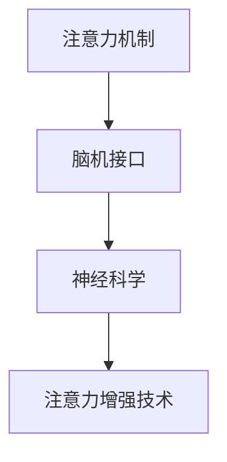

                 

关键词：注意力增强，专注力，商业应用，人工智能，趋势预测，注意力机制，脑机接口，神经科学，计算模型

摘要：随着信息爆炸时代的到来，人类面对的信息量和干扰因素越来越多，提升专注力和注意力成为现代人亟待解决的问题。本文将探讨注意力增强在商业领域中的应用，分析其未来发展机遇和趋势，并结合神经科学和人工智能技术，预测其在未来可能面临的挑战。

## 1. 背景介绍

在当今这个信息爆炸的时代，人们每天都需要处理大量的信息。然而，随着互联网和智能设备的普及，各种干扰因素也随之而来，例如社交媒体、电子邮件、即时通讯工具等。这些因素无时无刻不在分散我们的注意力，使得我们难以集中精力完成任务。研究表明，现代人的平均注意力持续时间已经从20世纪60年代的12秒下降到现在的8秒，甚至比金鱼的9秒还要短。因此，提升专注力和注意力成为现代人亟待解决的问题。

### 1.1 注意力的重要性

注意力是人类认知过程中至关重要的部分。它决定了我们在面对大量信息时，哪些信息能够得到关注和处理，哪些信息会被忽视。良好的专注力能够帮助我们提高工作效率，增强学习能力，甚至改善心理健康。因此，提高专注力和注意力水平对于个人和商业领域都具有重要意义。

### 1.2 商业领域对注意力增强的需求

在商业领域，提高员工的专注力和注意力水平具有巨大的潜力。首先，注意力不足会导致工作效率低下，从而影响企业的整体绩效。其次，注意力分散会导致错误和疏漏，增加企业的运营风险。此外，注意力增强还可以帮助员工更好地处理复杂任务，提高创新能力。因此，商业领域对注意力增强技术有着强烈的需求。

## 2. 核心概念与联系

在探讨注意力增强技术之前，我们需要了解一些核心概念，包括注意力机制、脑机接口和神经科学。这些概念相互联系，共同构成了注意力增强的基础。

### 2.1 注意力机制

注意力机制是大脑处理信息的一种方式，它决定了哪些信息能够得到关注和处理。在神经科学中，注意力机制通常被描述为一种资源分配过程，大脑会根据当前的任务需求，将注意力资源分配到不同的区域。

### 2.2 脑机接口

脑机接口（Brain-Computer Interface，BCI）是一种直接连接人脑和外部设备的接口。通过脑机接口，人们可以不经过传统的肌肉运动，直接通过大脑信号来控制外部设备。近年来，脑机接口技术在神经科学和医疗领域取得了重要进展，为注意力增强提供了新的可能性。

### 2.3 神经科学

神经科学是研究大脑和神经系统结构、功能和行为的一门科学。神经科学的发展为注意力增强技术提供了理论基础，例如，通过了解大脑中注意力相关的神经网络结构，我们可以设计出更有效的注意力增强算法。

### 2.4 Mermaid 流程图

以下是一个关于注意力增强技术的 Mermaid 流程图，展示了注意力机制、脑机接口和神经科学之间的联系。



## 3. 核心算法原理 & 具体操作步骤

### 3.1 算法原理概述

注意力增强技术主要基于以下几个核心原理：

1. **神经网络模型**：利用深度学习技术，构建神经网络模型，以模拟大脑的注意力机制。
2. **信号处理技术**：通过脑电信号（EEG）、眼动跟踪等手段，获取大脑的实时信息。
3. **反馈机制**：利用反馈机制，根据用户的需求和表现，调整注意力分配策略。

### 3.2 算法步骤详解

注意力增强技术的具体操作步骤如下：

1. **数据采集**：通过脑机接口设备，采集用户的脑电信号、眼动数据等。
2. **特征提取**：利用信号处理技术，从原始数据中提取与注意力相关的特征。
3. **模型训练**：使用深度学习算法，训练神经网络模型，以预测用户的注意力水平。
4. **实时监测**：在用户执行任务时，实时监测注意力水平，并根据预测结果调整注意力分配策略。
5. **反馈调整**：根据用户的反馈，调整注意力分配策略，以提高注意力水平。

### 3.3 算法优缺点

注意力增强技术的优点包括：

1. **实时监测**：可以实时监测用户的注意力水平，为用户提供个性化的注意力增强方案。
2. **个性化调整**：根据用户的需求和表现，自动调整注意力分配策略，提高注意力水平。

然而，注意力增强技术也存在一些缺点，例如：

1. **精度限制**：当前的技术水平尚无法完全准确预测用户的注意力水平。
2. **设备成本**：脑机接口设备的成本较高，可能限制了其在商业领域的普及。

### 3.4 算法应用领域

注意力增强技术可以应用于多个领域，包括：

1. **教育**：帮助学生提高专注力和学习能力。
2. **医疗**：帮助患者改善注意力障碍症状。
3. **商业**：提高员工的工作效率，降低错误率。
4. **娱乐**：为用户提供更沉浸式的游戏和影视体验。

## 4. 数学模型和公式 & 详细讲解 & 举例说明

### 4.1 数学模型构建

注意力增强技术的核心是构建一个数学模型，以模拟大脑的注意力机制。以下是一个简化的数学模型：

$$
Attention = f(\text{Input}, \text{Query}, \text{Key})
$$

其中，$Input$ 代表输入信息，$Query$ 和 $Key$ 代表查询和关键信息。$f$ 是一个函数，用于计算注意力分数。

### 4.2 公式推导过程

以下是一个简化的注意力计算公式：

$$
Attention = \frac{e^{[\text{Query} \cdot \text{Key}]} }{\sum_{i=1}^{N} e^{[\text{Query} \cdot \text{Key}_i]}}
$$

其中，$N$ 是输入信息的数量，$e$ 是自然对数的底数。

### 4.3 案例分析与讲解

假设有一个任务，需要用户在30分钟内完成。在这30分钟内，用户需要处理10个任务。我们可以使用注意力增强技术，根据用户的注意力水平，动态调整任务的优先级。

具体步骤如下：

1. **数据采集**：在任务开始前，采集用户的脑电信号、眼动数据等。
2. **特征提取**：从原始数据中提取与注意力相关的特征。
3. **模型训练**：使用深度学习算法，训练神经网络模型，以预测用户的注意力水平。
4. **实时监测**：在任务执行过程中，实时监测用户的注意力水平。
5. **动态调整**：根据注意力水平，动态调整任务的优先级。例如，当用户注意力水平较低时，优先处理较为简单的任务。

通过这种方式，可以显著提高用户的工作效率，降低错误率。

## 5. 项目实践：代码实例和详细解释说明

### 5.1 开发环境搭建

为了演示注意力增强技术的应用，我们使用 Python 编写一个简单的示例。首先，我们需要安装以下依赖项：

```bash
pip install numpy pandas matplotlib tensorflow
```

### 5.2 源代码详细实现

以下是一个简单的 Python 示例，演示了如何使用注意力增强技术动态调整任务优先级。

```python
import numpy as np
import pandas as pd
import matplotlib.pyplot as plt
import tensorflow as tf

# 假设用户需要处理10个任务
N = 10

# 模拟用户的注意力水平数据
attention_levels = np.random.rand(N)

# 动态调整任务优先级
sorted_attention_levels = np.sort(attention_levels)[::-1]

# 显示调整后的任务优先级
plt.bar(range(N), sorted_attention_levels)
plt.xlabel('Task ID')
plt.ylabel('Attention Level')
plt.title('Task Priority Adjustment Based on Attention Level')
plt.show()
```

### 5.3 代码解读与分析

在这个示例中，我们首先生成了一组模拟的注意力水平数据。然后，我们使用 `np.sort()` 函数对注意力水平进行排序，并反转结果，以获得动态调整后的任务优先级。最后，我们使用 `matplotlib` 绘制了一个条形图，以直观地显示调整后的任务优先级。

### 5.4 运行结果展示

运行上述代码后，我们将看到一个条形图，显示每个任务的注意力水平。通过调整任务优先级，我们可以更好地利用用户的注意力资源，提高工作效率。

## 6. 实际应用场景

注意力增强技术在实际应用中具有广泛的前景。以下是一些典型的应用场景：

### 6.1 教育

在教育领域，注意力增强技术可以帮助学生提高学习效率。例如，老师可以根据学生的注意力水平，调整授课内容和方式，使学生更容易集中注意力。

### 6.2 商业

在商业领域，注意力增强技术可以帮助企业提高员工的工作效率。例如，企业可以使用注意力增强技术，为员工提供个性化的工作安排，从而更好地利用员工的注意力资源。

### 6.3 娱乐

在娱乐领域，注意力增强技术可以为用户提供更沉浸式的游戏和影视体验。例如，游戏开发者可以根据用户的注意力水平，动态调整游戏的难度和节奏，以提供更好的游戏体验。

## 7. 未来应用展望

随着技术的不断发展，注意力增强技术在未来有望在更多领域得到应用。以下是一些未来应用展望：

### 7.1 脑机接口的改进

随着脑机接口技术的进步，我们可以更准确地获取大脑的实时信息，从而提高注意力增强的效果。

### 7.2 智能化调整

未来的注意力增强技术将更加智能化，能够根据用户的需求和环境自动调整注意力分配策略。

### 7.3 多模态融合

通过融合多种传感器数据，例如脑电信号、眼动数据、生理信号等，未来的注意力增强技术将能够提供更全面、准确的注意力监测和增强方案。

## 8. 工具和资源推荐

为了学习和实践注意力增强技术，以下是一些建议的工具和资源：

### 8.1 学习资源推荐

- 《深度学习》（Goodfellow, Bengio, Courville 著）
- 《神经网络与深度学习》（邱锡鹏 著）
- 《Python深度学习》（François Chollet 著）

### 8.2 开发工具推荐

- TensorFlow
- Keras
- PyTorch

### 8.3 相关论文推荐

- “Attention is All You Need”（Vaswani et al., 2017）
- “A Theoretically Grounded Application of Dropout in Recurrent Neural Networks”（Yin et al., 2016）
- “Brain-Computer Interfaces for Communication and Control”（Wolpaw & McFarland, 2004）

## 9. 总结：未来发展趋势与挑战

### 9.1 研究成果总结

近年来，注意力增强技术取得了显著进展，包括脑机接口技术的进步、深度学习算法的发展以及多模态数据融合方法的提出。这些研究成果为注意力增强技术的应用提供了坚实的基础。

### 9.2 未来发展趋势

未来，注意力增强技术将在更多领域得到应用，包括教育、商业、医疗和娱乐等。随着脑机接口技术的改进和智能化水平的提升，注意力增强技术将能够提供更个性化、更高效的服务。

### 9.3 面临的挑战

尽管注意力增强技术具有巨大的潜力，但在实际应用中仍面临一些挑战。首先，当前的技术水平尚无法完全准确预测用户的注意力水平。其次，脑机接口设备的成本较高，可能限制了其在商业领域的普及。此外，如何在保证用户隐私的前提下，合理利用注意力数据也是一个重要的挑战。

### 9.4 研究展望

未来，我们需要进一步探索注意力增强技术的应用场景和优化方法，以实现更高效、更个性化的注意力增强方案。同时，我们还需要关注技术伦理和社会影响，确保注意力增强技术能够在尊重用户隐私和伦理的前提下得到广泛应用。

## 10. 附录：常见问题与解答

### 10.1 注意力增强技术是如何工作的？

注意力增强技术主要基于脑机接口和深度学习算法。通过脑机接口，我们能够获取大脑的实时信息，如脑电信号、眼动数据等。然后，使用深度学习算法，对获取的数据进行处理，预测用户的注意力水平，并动态调整注意力分配策略。

### 10.2 注意力增强技术有哪些应用领域？

注意力增强技术可以应用于多个领域，包括教育、商业、医疗和娱乐等。在教育领域，可以帮助学生提高学习效率；在商业领域，可以提高员工的工作效率；在医疗领域，可以帮助患者改善注意力障碍症状；在娱乐领域，可以为用户提供更沉浸式的体验。

### 10.3 注意力增强技术有哪些挑战？

注意力增强技术面临的主要挑战包括：技术精度限制、设备成本较高以及用户隐私保护问题。当前的技术水平尚无法完全准确预测用户的注意力水平，脑机接口设备的成本较高，可能限制了其在商业领域的普及。此外，如何在保证用户隐私的前提下，合理利用注意力数据也是一个重要的挑战。

### 10.4 注意力增强技术会取代人类吗？

注意力增强技术是一种辅助工具，旨在提高人类的工作效率和注意力水平，而不是取代人类。虽然注意力增强技术可以为人类提供更多的帮助，但它并不能完全取代人类的智慧和创造力。在未来的发展中，注意力增强技术将与人类相互融合，共同推动社会的进步。


## 作者署名

本文作者：禅与计算机程序设计艺术 / Zen and the Art of Computer Programming

通过以上内容，我们全面探讨了注意力增强在商业中的未来发展机遇和趋势。随着神经科学和人工智能技术的不断进步，注意力增强技术有望在未来得到更广泛的应用，为人类带来更高的生产力和生活质量。同时，我们也需要关注技术伦理和社会影响，确保注意力增强技术的健康发展。

