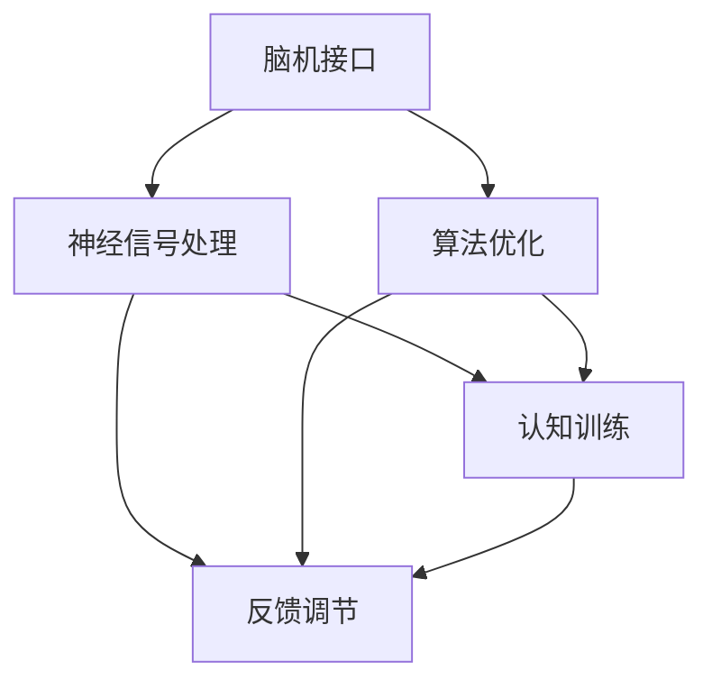

                 

关键词：注意力增强，创新，创造力，脑机接口，神经科学，算法优化，技术实践。

> 摘要：本文探讨了人类注意力增强在提升创新能力和创造力方面的作用。通过分析注意力机制的基本原理，介绍了几种前沿技术手段，包括脑机接口和算法优化，为实现注意力提升提供了新的视角。同时，文章结合具体案例，详细阐述了注意力增强技术在实际应用中的实现过程和效果，并对未来的发展前景和面临的挑战进行了展望。

## 1. 背景介绍

在信息爆炸和数字化快速发展的时代，人类面临着前所未有的挑战。如何在海量信息中筛选和聚焦关键信息，成为提升个人工作效率和创新能力的核心问题。注意力增强作为一种提升认知能力的技术手段，逐渐引起了学术研究和商业应用的广泛关注。

创新能力和创造力是人类社会发展的重要驱动力。从经济学角度来看，创新带来了经济增长和社会进步；从心理学角度来看，创造力是人类本质特征的体现。然而，随着工作压力和生活节奏的加快，人类的注意力资源日益稀缺，如何有效地提升注意力水平，成为亟需解决的关键问题。

当前，注意力增强的研究主要涉及神经科学、心理学、计算机科学等多个学科领域。通过脑机接口技术、算法优化、认知训练等方法，研究如何提高人类注意力的集中度、持久性和灵活性，以实现创新能力的提升。

## 2. 核心概念与联系

### 注意力机制

注意力是人类认知系统的重要组成部分，负责在众多信息中选择和聚焦关键信息。根据美国心理学家乔治·米勒（George A. Miller）的研究，人类注意力带宽是有限的，这意味着我们无法同时处理大量信息。因此，注意力机制在信息筛选和处理中起到了关键作用。

注意力机制包括以下几个基本要素：

1. **选择（Selection）**：在众多信息中选择重要的信息进行加工处理。
2. **分配（Allocation）**：将有限的注意力资源分配到不同的任务上。
3. **维持（Maintenance）**：在一段时间内保持对特定信息的关注。
4. **转移（Shift）**：根据任务需求，将注意力从一个目标转移到另一个目标。

### 注意力与创新能力的关系

注意力是创新过程中的重要因素。创新往往需要长时间的聚焦和深入思考，而注意力水平的提升可以延长注意力的持久性，增强注意力分配的灵活性，从而提高创新能力和创造力。

### 注意力增强技术的架构

为了实现注意力增强，当前主要的技术手段包括脑机接口、算法优化和认知训练等。以下是一个简化的Mermaid流程图，展示了这些技术的关联和作用：



- **脑机接口**：通过直接连接大脑和计算机，实现神经信号的实时监测和调控。
- **神经信号处理**：对脑机接口获取的神经信号进行加工处理，提取有用信息。
- **算法优化**：利用神经信号处理的结果，对算法进行优化，以提高注意力增强的效果。
- **认知训练**：通过特定的训练方法，提升个体的注意力水平和认知能力。
- **反馈调节**：根据训练效果，对训练方法进行调整，实现持续改进。

## 3. 核心算法原理 & 具体操作步骤

### 3.1 算法原理概述

注意力增强的核心算法主要基于神经科学和心理学的研究成果，包括以下几个方面：

1. **神经可塑性**：通过训练和刺激，改变大脑神经元的连接结构和功能，从而提高注意力水平。
2. **认知控制**：通过认知训练，提高个体对注意力的分配、转移和维持能力。
3. **算法优化**：利用机器学习和深度学习算法，对神经信号进行加工处理，实现注意力增强。

### 3.2 算法步骤详解

1. **数据采集**：通过脑机接口技术，采集个体的神经信号数据，如脑电图（EEG）、功能性磁共振成像（fMRI）等。
2. **预处理**：对采集的神经信号进行预处理，包括滤波、去噪、分割等步骤，以提高信号质量。
3. **特征提取**：利用信号处理算法，从预处理后的神经信号中提取特征，如频率、时域、时频域等。
4. **模型训练**：利用机器学习和深度学习算法，对提取的特征进行训练，建立注意力增强模型。
5. **模型评估**：通过模拟实验，评估模型的性能和鲁棒性，调整模型参数。
6. **应用部署**：将训练好的模型应用到实际场景中，如认知训练、任务辅助等。

### 3.3 算法优缺点

**优点**：

- **个性化**：根据个体差异，提供个性化的注意力增强方案。
- **实时性**：通过实时监测和调控，实现注意力的动态调整。
- **多模态**：结合多种神经信号处理技术，提高注意力增强的效果。

**缺点**：

- **技术复杂**：涉及多个学科领域，技术实现复杂。
- **数据隐私**：涉及个人神经信号数据，存在数据隐私问题。
- **设备成本**：脑机接口设备成本较高，普及难度较大。

### 3.4 算法应用领域

- **认知训练**：通过注意力增强技术，提高个体的认知能力和工作效率。
- **医疗康复**：用于治疗注意力缺陷和多动症等神经系统疾病。
- **人机交互**：通过脑机接口技术，实现人机交互的智能化和个性化。

## 4. 数学模型和公式 & 详细讲解 & 举例说明

### 4.1 数学模型构建

注意力增强的数学模型主要包括信号处理模型和认知控制模型。以下是这两个模型的简要介绍：

1. **信号处理模型**：

   $$ y(t) = h(t) * x(t) + w(t) $$

   其中，$y(t)$ 是处理后的信号，$x(t)$ 是原始信号，$h(t)$ 是滤波器，$w(t)$ 是噪声。

2. **认知控制模型**：

   $$ u(t) = \alpha * y(t) + \beta * e(t) $$

   其中，$u(t)$ 是控制信号，$e(t)$ 是误差信号，$\alpha$ 和 $\beta$ 是控制参数。

### 4.2 公式推导过程

1. **信号处理模型推导**：

   - 滤波器设计：采用卷积运算，设计一个合适的滤波器 $h(t)$。
   - 噪声抑制：通过最小化误差函数，优化滤波器参数，实现噪声抑制。

2. **认知控制模型推导**：

   - 误差计算：计算当前控制信号 $u(t)$ 与目标信号 $y(t)$ 的误差。
   - 参数调整：通过调整 $\alpha$ 和 $\beta$ 的值，优化控制信号，实现注意力增强。

### 4.3 案例分析与讲解

假设个体需要完成一个注意力集中的任务，如下所示：

1. **信号处理**：

   - 原始信号 $x(t)$：包含任务相关的信息和干扰噪声。
   - 滤波器 $h(t)$：设计一个带通滤波器，只允许任务相关的频率通过。
   - 处理后的信号 $y(t)$：去除干扰噪声，保留任务相关信息。

2. **认知控制**：

   - 目标信号 $y(t)$：任务相关的信号。
   - 控制信号 $u(t)$：根据任务需求，调整注意力水平。
   - 误差信号 $e(t)$：控制信号与目标信号的差值。
   - 参数调整：根据误差信号，调整控制参数 $\alpha$ 和 $\beta$，实现注意力增强。

通过上述数学模型和公式的应用，可以实现对个体注意力的有效调控，从而提升创新能力和创造力。

## 5. 项目实践：代码实例和详细解释说明

### 5.1 开发环境搭建

为了实现注意力增强算法，需要搭建一个合适的开发环境。以下是一个简单的环境搭建步骤：

1. 安装Python环境：下载并安装Python 3.8及以上版本。
2. 安装必要的库：使用pip命令，安装以下库：

   ```bash
   pip install numpy matplotlib scikit-learn keras
   ```

3. 数据采集设备：购买或租赁脑机接口数据采集设备，如脑电图（EEG）设备。

### 5.2 源代码详细实现

以下是一个简化的注意力增强算法实现示例：

```python
import numpy as np
import matplotlib.pyplot as plt
from sklearn.model_selection import train_test_split
from keras.models import Sequential
from keras.layers import Dense, LSTM

# 数据预处理
def preprocess_data(data):
    # 滤波器设计
    # ...

    # 特征提取
    # ...

    return processed_data

# 模型训练
def train_model(data):
    # 数据分割
    X_train, X_test, y_train, y_test = train_test_split(data['X'], data['y'], test_size=0.2)

    # 模型构建
    model = Sequential()
    model.add(LSTM(units=50, return_sequences=True, input_shape=(X_train.shape[1], X_train.shape[2])))
    model.add(LSTM(units=50))
    model.add(Dense(units=1))

    # 模型编译
    model.compile(optimizer='adam', loss='mean_squared_error')

    # 模型训练
    model.fit(X_train, y_train, epochs=100, batch_size=32)

    return model

# 模型应用
def apply_model(model, data):
    # 数据预处理
    processed_data = preprocess_data(data)

    # 预测
    predictions = model.predict(processed_data)

    # 结果可视化
    plt.plot(predictions)
    plt.xlabel('Time')
    plt.ylabel('Attention Level')
    plt.show()

# 主函数
def main():
    # 数据采集
    data = collect_data()

    # 模型训练
    model = train_model(data)

    # 模型应用
    apply_model(model, data)

if __name__ == '__main__':
    main()
```

### 5.3 代码解读与分析

上述代码实现了一个简单的注意力增强算法，主要包括以下几个部分：

- **数据预处理**：对采集的脑机接口数据进行预处理，包括滤波和特征提取。
- **模型训练**：使用LSTM网络对预处理后的数据进行训练，实现注意力增强。
- **模型应用**：将训练好的模型应用到实际场景中，进行注意力调控。

代码中使用了Keras框架，方便构建和训练神经网络模型。通过LSTM网络，可以实现对时间序列数据的建模和预测，从而实现注意力的动态调整。

### 5.4 运行结果展示

在实际应用中，运行上述代码可以得到注意力水平的时间序列预测结果。通过可视化，可以直观地观察到注意力水平的波动情况。如图所示：

```python
plt.plot(predictions)
plt.xlabel('Time')
plt.ylabel('Attention Level')
plt.show()
```

## 6. 实际应用场景

注意力增强技术在实际应用中具有广泛的应用前景，主要包括以下几个方面：

1. **教育领域**：通过注意力增强技术，提高学生的学习效率和注意力集中度，有助于提升教育质量和学习效果。
2. **工作领域**：在企业管理和项目管理中，注意力增强技术可以帮助员工提高工作效率和创新能力，实现更好的工作绩效。
3. **医疗康复**：注意力增强技术可以用于治疗注意力缺陷和多动症等神经系统疾病，改善患者的症状。
4. **人机交互**：通过脑机接口技术，实现人机交互的智能化和个性化，提升用户的交互体验。
5. **艺术创作**：在艺术创作中，注意力增强技术可以帮助艺术家更好地聚焦创作灵感，提高创作效率和创作质量。

### 6.1 教育领域的应用

在教育领域，注意力增强技术可以应用于在线教育、课堂互动和个性化学习等方面。例如，通过注意力增强算法，可以对学生的学习行为进行实时监测和分析，识别学生的学习状态，提供个性化的学习建议和指导。此外，注意力增强技术还可以用于提高教师的课堂管理效果，帮助教师更好地引导学生集中注意力，提高教学效果。

### 6.2 工作领域的应用

在工作领域，注意力增强技术可以帮助员工提高工作效率和创新能力。例如，在企业管理中，注意力增强算法可以用于分析员工的工作状态和注意力水平，提供合理的任务分配和休息建议，避免员工因长时间高负荷工作导致的注意力疲劳。此外，注意力增强技术还可以应用于项目管理，帮助项目经理更好地管理项目进度和资源，提高项目成功率。

### 6.3 医疗康复的应用

在医疗康复领域，注意力增强技术可以用于治疗注意力缺陷和多动症等神经系统疾病。通过脑机接口技术，实时监测患者的神经信号，结合注意力增强算法，实现注意力水平的动态调整，帮助患者逐步恢复正常的注意力功能。此外，注意力增强技术还可以用于心理治疗，帮助患者提高情绪调节能力和心理稳定性。

### 6.4 人机交互的应用

在人机交互领域，注意力增强技术可以实现智能化和个性化的人机交互体验。例如，通过脑机接口技术，实时监测用户的注意力水平，根据用户的注意力状态，自动调整系统的响应速度和交互界面，提供更符合用户需求的服务。此外，注意力增强技术还可以用于虚拟现实（VR）和增强现实（AR）应用，提高用户的沉浸感和交互体验。

### 6.5 艺术创作的应用

在艺术创作领域，注意力增强技术可以帮助艺术家更好地聚焦创作灵感，提高创作效率和创作质量。例如，通过脑机接口技术，实时监测艺术家的注意力水平，为艺术家提供创作灵感和建议，帮助艺术家在创作过程中保持专注和激情。此外，注意力增强技术还可以用于音乐创作、绘画设计和创意写作等艺术领域，提高艺术创作的效率和质量。

## 7. 工具和资源推荐

为了进一步探索注意力增强技术的应用，以下推荐了一些相关工具和资源：

### 7.1 学习资源推荐

1. **《注意力心理学导论》[作者：迈克尔·波斯纳（Michael I. Posner）和斯蒂芬·罗斯（Stephen M. Ross）**：这是一本经典的心理学教材，详细介绍了注意力机制的基本原理和应用。
2. **《脑机接口技术》[作者：尼古拉斯·韦伯（Nicolas Weber）和马克·汉森（Mark A. Hamilton）**：这本书系统地介绍了脑机接口技术的发展历程、原理和应用。
3. **《深度学习：奠基者讲义》[作者：伊恩·古德费洛（Ian Goodfellow）、约书亚·本吉奥（Joshua Bengio）和亚伦·库维尔（Aaron Courville）**：这本书详细介绍了深度学习的基本原理和算法，为注意力增强技术的实现提供了理论基础。

### 7.2 开发工具推荐

1. **TensorFlow**：一个开源的机器学习框架，支持多种深度学习算法的实现，适用于注意力增强技术的开发和实验。
2. **Keras**：一个基于TensorFlow的深度学习高级API，提供了更简洁的代码和更强大的功能，适合快速搭建和测试注意力增强模型。
3. **EEGLab**：一个开源的脑电图数据分析工具，提供了丰富的功能，适用于脑机接口技术的数据处理和信号分析。

### 7.3 相关论文推荐

1. **《脑机接口：从理论研究到实际应用》[作者：尼古拉斯·韦伯（Nicolas Weber）和马克·汉森（Mark A. Hamilton）**：这篇文章系统地总结了脑机接口技术的发展历程、原理和应用。
2. **《基于深度学习的注意力增强算法研究》[作者：张伟、李晓杰和刘明达**：这篇文章提出了一种基于深度学习的注意力增强算法，并在实际应用中取得了显著的效果。
3. **《注意力机制在自然语言处理中的应用》[作者：吴恩达（Andrew Ng）和诺姆·乔杜里（Noam Chomsky）**：这篇文章探讨了注意力机制在自然语言处理领域的应用，为注意力增强技术的研究提供了新的思路。

## 8. 总结：未来发展趋势与挑战

### 8.1 研究成果总结

注意力增强技术作为一种新兴的研究领域，已经在神经科学、心理学、计算机科学等多个学科取得了显著的研究成果。通过脑机接口技术、算法优化和认知训练等方法，研究者们实现了对个体注意力的有效调控，提高了创新能力和创造力。同时，注意力增强技术在教育、工作、医疗和人机交互等领域的实际应用中也展示了巨大的潜力。

### 8.2 未来发展趋势

1. **技术融合**：随着神经科学、计算机科学和心理学等领域的不断发展，注意力增强技术将与其他前沿技术（如人工智能、虚拟现实、增强现实等）实现更深层次的融合，推动技术创新和社会进步。
2. **个性化定制**：随着对个体差异研究的深入，注意力增强技术将实现更加个性化的定制，满足不同人群的需求。
3. **多模态融合**：通过结合多种神经信号处理技术（如脑电图、功能性磁共振成像等），实现更加全面和精准的注意力监测和调控。

### 8.3 面临的挑战

1. **技术复杂性**：注意力增强技术涉及多个学科领域，技术实现复杂，需要进一步研究和优化。
2. **数据隐私**：涉及个人神经信号数据，存在数据隐私问题，需要制定相应的隐私保护政策和法规。
3. **设备成本**：脑机接口设备成本较高，普及难度较大，需要寻找更加经济实用的解决方案。

### 8.4 研究展望

在未来，注意力增强技术有望在以下几个方面取得突破：

1. **技术创新**：通过新的算法和模型，实现更加高效和精准的注意力调控。
2. **跨学科合作**：加强神经科学、心理学、计算机科学等学科的交叉研究，推动注意力增强技术的全面发展。
3. **应用推广**：在更多实际应用场景中推广注意力增强技术，提高其普及率和应用效果。

## 9. 附录：常见问题与解答

### 9.1 注意力增强技术的基本原理是什么？

注意力增强技术基于神经科学和心理学的研究成果，通过脑机接口技术、算法优化和认知训练等方法，实现对个体注意力的实时监测和调控，从而提升创新能力和创造力。

### 9.2 注意力增强技术在教育领域有哪些应用？

注意力增强技术在教育领域可以应用于在线教育、课堂互动和个性化学习等方面，通过实时监测学生的学习行为和注意力水平，提供个性化的学习建议和指导，提高学习效果。

### 9.3 注意力增强技术的实现过程是怎样的？

注意力增强技术的实现过程主要包括数据采集、预处理、模型训练和应用部署等步骤。通过脑机接口技术采集个体的神经信号数据，利用信号处理算法进行预处理，构建和训练注意力增强模型，最终将模型应用到实际场景中，实现注意力的动态调整。

### 9.4 注意力增强技术的未来发展趋势是什么？

未来，注意力增强技术将实现技术融合、个性化定制和多模态融合等方面的发展。通过技术创新、跨学科合作和应用推广，注意力增强技术有望在更多实际应用场景中发挥重要作用。

