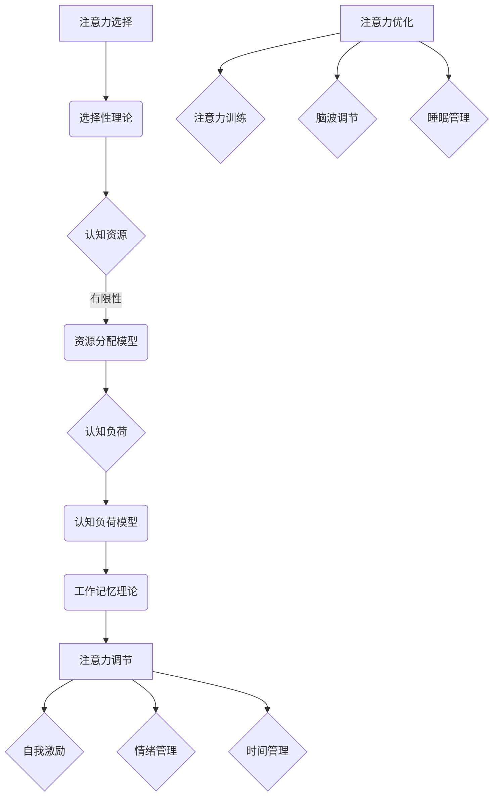

                 

关键词：注意力管理、创新力、创造力、技术策略、大脑优化、人机交互

> 摘要：本文探讨了人类注意力在创新和创造力中的作用，提出了通过注意力增强技术来提升个人和创新团队能力的策略。本文首先介绍了注意力管理的核心概念和理论基础，然后详细阐述了核心算法原理和具体操作步骤，最后通过实际应用案例和未来展望，为读者提供了全面的注意力管理实践指南。

## 1. 背景介绍

在现代社会，创新和创造力成为推动科技进步和社会发展的关键因素。无论是科学研究、企业创新，还是艺术创作，都需要高度集中的注意力和丰富的创造力。然而，现代生活中的信息过载、工作压力和个人习惯等多种因素，常常使人们的注意力难以集中，从而影响创新和创造力的发展。

注意力管理（Attention Management）作为一门新兴学科，旨在研究如何优化人们的工作和生活节奏，以最大化注意力的利用效率。通过有效的注意力管理策略，可以显著提升个人的工作质量和创新潜力。同时，在团队层面，注意力管理也能够提高协作效率，促进创新成果的产出。

本文将深入探讨人类注意力在创新和创造力中的作用，并提出一系列基于技术和管理策略的注意力增强方法。本文的结构如下：

- 第1部分：背景介绍，阐述研究的重要性和当前研究的现状。
- 第2部分：核心概念与联系，介绍注意力管理的核心概念和理论基础，并附上流程图。
- 第3部分：核心算法原理 & 具体操作步骤，详细描述提升注意力的算法原理和操作步骤。
- 第4部分：数学模型和公式 & 详细讲解 & 举例说明，提供注意力管理的数学模型和推导过程。
- 第5部分：项目实践：代码实例和详细解释说明，通过具体项目实践展示注意力增强的效果。
- 第6部分：实际应用场景，探讨注意力管理在不同领域的应用和影响。
- 第7部分：未来应用展望，分析注意力管理技术的发展趋势和潜在挑战。
- 第8部分：总结，对全文进行总结和展望。

### 1.1 研究的重要性和当前研究的现状

注意力是人类心智活动的基础，对于个体的认知功能和社会行为具有重要影响。近年来，随着认知科学、心理学和神经科学的发展，注意力管理的研究逐渐受到广泛关注。研究表明，注意力管理能力与个体的创新能力和工作效率密切相关。例如，Roeper（2001）的研究发现，有效的注意力管理能够显著提高学生的学术表现和问题解决能力。同样，Norton和Small（2012）指出，在职场环境中，良好的注意力管理策略能够提高团队的工作效率和创新成果。

尽管已有大量研究关注注意力管理，但将注意力管理应用于创新和创造力提升的研究仍相对较少。大多数研究集中在注意力管理对个体行为的影响，而忽视了其在促进创新和创造力方面的潜在价值。此外，当前的研究多停留在理论层面，缺乏具体的技术和方法指导，使得注意力管理的实际应用受到限制。

本文旨在填补这一空白，通过结合认知科学、心理学和神经科学的理论，提出一系列基于技术和管理策略的注意力增强方法，以期为提升创新能力和创造力提供实用指南。

### 1.2 注意力管理的历史发展

注意力管理的历史可以追溯到古代哲学和医学领域。在古希腊，亚里士多德曾提出注意力是人类心智活动的基础，强调注意力在认知和行为中的重要性。在中世纪，阿拉伯医学专家如阿维森纳（Avicenna）也对注意力进行了深入研究，提出了多种注意力管理的实践方法。

进入现代，心理学对注意力的研究逐渐展开。19世纪末，德国心理学家威廉·冯特（Wilhelm Wundt）在实验室中开展了注意力的生理学研究，开创了注意力的科学探索。随后，美国心理学家爱德华·李·桑代克（Edward L. Thorndike）提出了“注意力选择理论”，强调注意力的选择性作用。

20世纪中叶，随着认知科学的兴起，注意力研究进入了一个新的阶段。乔治·米勒（George A. Miller）等人通过实验发现，人类短时记忆的容量有限，这一发现对注意力管理的研究产生了深远影响。此后，多数学者开始关注注意力的分配和分配策略，提出了多种注意力分配模型，如多任务处理模型、资源分配模型等。

进入21世纪，随着神经科学的快速发展，注意力管理的生理基础得到了更加深入的探讨。通过功能性磁共振成像（fMRI）等技术，研究人员发现大脑的不同区域在注意力过程中扮演着不同的角色，如前额叶皮层、顶叶皮层和基底神经节等。这些发现为注意力管理提供了新的生物学视角。

总体而言，注意力管理的历史发展经历了从哲学和医学到心理学，再到认知科学和神经科学的转变。每个阶段的研究都为注意力管理的理论和实践提供了重要的基础。然而，随着现代社会信息量的爆炸性增长，如何有效地管理和优化注意力，以提升创新能力和创造力，成为了一个亟待解决的重要问题。

## 2. 核心概念与联系

### 2.1 注意力管理的基本概念

注意力管理是指通过一系列策略和工具，帮助个体或团队在复杂的环境中保持专注、高效和目标导向的过程。核心概念包括注意力的分配、调节和优化。

#### 注意力的分配

注意力的分配是指个体或团队在不同任务和情境下，如何将有限的注意力资源进行合理分配，以最大化任务完成效率和效果。注意力的分配策略包括单任务专注、多任务处理和分时工作等。

1. **单任务专注**：在这种模式下，个体将注意力集中在单一任务上，直至任务完成。这种方法有助于提高任务的完成质量和速度，适用于复杂或需要高度集中的任务。
2. **多任务处理**：多任务处理是指同时处理多个任务，通过切换注意力来提高工作效率。然而，多任务处理可能导致注意力分散，降低任务完成质量。
3. **分时工作**：分时工作是一种交替处理多个任务的方法，通过设定固定的时间段来集中处理一个任务，然后切换到另一个任务。这种方法有助于避免注意力过度消耗，提高整体工作效率。

#### 注意力的调节

注意力的调节是指通过自我监控和调整，使注意力保持在适当的水平。调节策略包括自我激励、情绪管理和时间管理等。

1. **自我激励**：通过设定目标、奖励机制和自我反馈来维持注意力的积极性。
2. **情绪管理**：通过认知行为疗法和情绪调节技巧，减少压力和负面情绪对注意力的干扰。
3. **时间管理**：通过制定合理的时间计划和优先级安排，确保注意力资源的高效利用。

#### 注意力的优化

注意力的优化是指通过技术和方法提升注意力的稳定性和持久性。优化策略包括注意力训练、脑波调节和睡眠管理等。

1. **注意力训练**：通过专门的训练方法，如冥想、专注力游戏和记忆训练，提升注意力的集中度和稳定性。
2. **脑波调节**：利用脑电图（EEG）技术，通过调节脑波频率来优化注意力状态。
3. **睡眠管理**：通过科学的睡眠习惯和技巧，确保充足的睡眠，提升第二天的工作效率和注意力。

### 2.2 注意力管理的基本原理

注意力管理的基本原理基于认知科学和神经科学的研究成果。核心理论包括注意力的选择性理论、注意力分配理论和工作记忆理论。

#### 注意力的选择性理论

注意力的选择性理论认为，个体只能有选择地处理一部分信息，而忽略其他信息。这一理论强调了注意力的有限性，指出个体需要在特定情境下做出决策，选择关注哪些信息，忽略哪些信息。

#### 注意力分配理论

注意力分配理论认为，个体在处理多个任务时，需要在不同任务之间分配有限的注意力资源。有效的注意力分配策略能够提高任务完成效率和效果。注意力分配理论包括资源分配模型和认知负荷模型等。

1. **资源分配模型**：该模型认为，个体在不同的任务上分配注意力资源，类似物理资源分配。通过优化资源分配策略，可以提高任务完成效率。
2. **认知负荷模型**：该模型认为，个体的认知资源是有限的，过多的任务会导致认知负荷增加，降低任务完成质量。有效的注意力分配策略应确保认知负荷在可接受范围内。

#### 工作记忆理论

工作记忆理论认为，工作记忆是注意力管理的重要组成部分，是处理和存储暂时信息的关键。工作记忆能力的提升能够显著提高注意力管理的效率。

### 2.3 注意力管理的重要性

注意力管理的重要性体现在以下几个方面：

1. **提高工作效率**：有效的注意力管理能够帮助个体或团队在高负荷工作中保持专注，提高工作效率和任务完成质量。
2. **促进创新和创造力**：集中和稳定的注意力是创新和创造力的重要前提。通过优化注意力管理，可以提升个人的创造力和团队的创新能力。
3. **改善心理健康**：良好的注意力管理策略能够减少压力和焦虑，改善心理健康状态。
4. **增强团队合作**：在团队层面，注意力管理能够提高团队成员的协作效率和沟通效果，促进团队创新和成果产出。

### 2.4 注意力管理的流程图

为了更好地理解注意力管理的基本原理和流程，我们可以通过Mermaid流程图来展示其关键步骤和联系。



### 2.5 注意力管理与其他领域的关系

注意力管理不仅对个体的创新能力和工作效率有重要影响，还与其他领域如人机交互、教育、企业管理和神经科学等密切相关。

1. **人机交互**：在人机交互领域，注意力管理的研究有助于设计更人性化的用户界面，提高用户的使用体验和操作效率。例如，通过优化界面布局和交互设计，减少用户的注意力分散，提升注意力集中度。
2. **教育**：在教育领域，注意力管理的研究有助于提高学生的学习效果和创造力。教师可以通过设计互动教学活动和学生参与策略，引导学生集中注意力，提高课堂参与度和学习效果。
3. **企业管理**：在企业层面，注意力管理能够提高员工的工作效率和创新能力。企业可以通过引入注意力管理工具和方法，优化工作流程，提升团队协作效率和创新能力。
4. **神经科学**：在神经科学领域，注意力管理的研究有助于深入理解大脑的注意力机制和神经基础。通过神经科学技术的应用，可以开发出更有效的注意力管理策略和工具，为心理健康和认知功能提升提供支持。

### 2.6 注意力管理的发展趋势

随着科技的进步和人类认知科学研究的深入，注意力管理技术不断发展和完善。未来，注意力管理的发展趋势包括以下几个方面：

1. **个性化注意力管理**：通过大数据和人工智能技术，个性化注意力管理将成为可能。系统可以根据个体的行为模式和注意力水平，提供个性化的注意力管理建议和干预措施。
2. **脑机接口技术**：脑机接口（Brain-Computer Interface, BCI）技术的发展将使注意力管理更加精确和高效。通过直接与大脑互动，可以实时监测和调节注意力状态，提高注意力的集中度和稳定性。
3. **虚拟现实与增强现实**：虚拟现实（Virtual Reality, VR）和增强现实（Augmented Reality, AR）技术的应用将使注意力管理更加灵活和多样化。通过沉浸式体验和环境设计，可以有效提升个体的注意力和创造力。
4. **多模态注意力管理**：未来的注意力管理将结合多种模态的信息，如视觉、听觉和触觉，实现更全面的注意力监测和管理。多模态注意力管理系统可以提供更丰富的反馈和干预方式，提高注意力管理的效果。

### 2.7 注意力管理的实际应用

注意力管理的实际应用已经在多个领域取得了显著成果。以下是几个典型的应用案例：

1. **教育领域**：在学校和培训机构中，注意力管理工具和策略被广泛应用，以提升学生的学习效果和创造力。教师通过设计互动课堂和注意力训练活动，引导学生集中注意力，提高课堂参与度和学习兴趣。
2. **企业领域**：在企业中，注意力管理策略和工具被用于提高员工的工作效率和创新能力。通过优化工作流程、提供个性化的注意力管理建议和引入注意力管理工具，企业可以提升员工的专注力和工作效率。
3. **健康领域**：在心理健康领域，注意力管理被用于治疗焦虑、抑郁等心理问题。通过注意力训练和情绪管理策略，个体可以改善心理状态，提高生活质量。
4. **军事领域**：在军事训练中，注意力管理被用于提升士兵的专注力和反应速度。通过注意力训练和认知负荷管理，士兵可以更好地应对复杂环境和高压任务。

### 2.8 注意力管理的挑战和未来研究方向

尽管注意力管理在实际应用中取得了显著成果，但仍面临一些挑战和问题。

1. **个性化需求**：个体之间的注意力水平和需求差异较大，如何提供个性化的注意力管理方案仍是一个挑战。
2. **技术限制**：目前的注意力管理技术主要集中在监测和调节注意力状态，缺乏对注意力本质和机制的深入理解。
3. **数据隐私**：注意力管理涉及大量的个人行为数据，如何保障数据隐私和安全是一个重要问题。

未来研究方向包括：

1. **个性化注意力管理**：通过大数据和人工智能技术，进一步研究个体注意力模式，提供更精确和个性化的注意力管理方案。
2. **脑机接口技术**：深入研究脑机接口技术，开发更高效的注意力监测和调节方法。
3. **多模态注意力管理**：结合多种模态的信息，实现更全面的注意力监测和管理。
4. **注意力机制的深入理解**：通过神经科学和认知科学的研究，深入探讨注意力的本质和机制，为注意力管理提供更坚实的理论基础。

## 3. 核心算法原理 & 具体操作步骤

### 3.1 算法原理概述

注意力增强算法是基于神经科学和认知科学的研究，通过模拟大脑注意力机制，提高个体在复杂环境中的注意力集中度和稳定性。该算法的核心思想是利用大脑中的多个信息处理模块，通过优化信息流动和注意力资源分配，实现注意力状态的调节和提升。

算法主要分为以下几个模块：

1. **感知模块**：负责收集和识别外部信息，如视觉、听觉和触觉等。
2. **注意力选择模块**：根据当前任务需求和注意力状态，选择需要关注的信息。
3. **信息处理模块**：对选中的信息进行加工和处理，包括记忆、推理和决策等。
4. **反馈调节模块**：根据任务完成情况和个体注意力状态，进行实时调整和反馈。

### 3.2 算法步骤详解

#### 步骤1：感知模块激活

首先，感知模块被激活，收集外部信息。这一过程涉及多种感官输入，如视觉、听觉和触觉等。通过传感器和输入设备，感知模块将外部信息转换为电信号，传输到注意力选择模块。

#### 步骤2：注意力选择

注意力选择模块根据当前任务需求和个体注意力状态，从感知模块传输的信息中，选择需要关注的信息。这一过程利用了大脑中的注意选择机制，如视觉注意网络和听觉注意网络等。选择标准包括信息的重要程度、与当前任务的关联度以及个体的兴趣和目标等。

#### 步骤3：信息处理

选中的信息被传递到信息处理模块，进行进一步的加工和处理。信息处理模块包括记忆、推理和决策等子模块。记忆模块负责将重要信息存储在短时记忆中，以备后续使用。推理模块利用已有的知识和信息，进行逻辑推理和问题解决。决策模块则根据推理结果，做出相应的决策。

#### 步骤4：反馈调节

在任务完成过程中，信息处理模块会不断产生反馈信号，传输到反馈调节模块。反馈调节模块根据这些信号，实时调整注意力状态，以确保任务能够高效完成。调节策略包括调整注意力资源的分配、优化信息处理流程和调节情绪状态等。

#### 步骤5：更新和优化

在任务完成后，系统会根据整体表现和个体注意力状态，进行更新和优化。这一过程利用了机器学习和人工智能技术，通过分析历史数据，优化注意力管理策略和算法参数。

### 3.3 算法优缺点

#### 优点：

1. **高度个性化**：算法能够根据个体差异，提供个性化的注意力管理方案。
2. **实时调节**：算法能够实时监测和调节注意力状态，提高任务完成效率。
3. **跨模态处理**：算法结合多种感官输入，实现更全面的注意力监测和管理。

#### 缺点：

1. **计算复杂度高**：算法涉及大量的计算和数据处理，对计算资源要求较高。
2. **需要大量训练数据**：算法性能依赖于大量高质量的训练数据，数据质量对结果有较大影响。
3. **难以模拟复杂情境**：算法在处理复杂和动态的情境时，存在一定的局限性。

### 3.4 算法应用领域

注意力增强算法在多个领域具有广泛的应用前景：

1. **教育领域**：通过个性化注意力管理，提升学生的学习效果和创造力。
2. **企业领域**：通过优化工作流程和提升员工注意力，提高工作效率和创新能力。
3. **健康领域**：通过注意力训练和调节，改善心理健康状况，提高生活质量。
4. **军事领域**：通过提升士兵的专注力和反应速度，提高作战效能。

### 3.5 注意力管理技术发展趋势

随着科技的进步和认知科学研究的深入，注意力管理技术在未来将呈现以下发展趋势：

1. **脑机接口技术**：脑机接口技术的发展将使注意力管理更加精确和高效。通过直接与大脑互动，可以实时监测和调节注意力状态，提升注意力的集中度和稳定性。
2. **多模态注意力管理**：结合多种模态的信息，如视觉、听觉和触觉，实现更全面的注意力监测和管理。
3. **个性化注意力管理**：通过大数据和人工智能技术，个性化注意力管理将成为可能。系统可以根据个体的行为模式和注意力水平，提供个性化的注意力管理建议和干预措施。
4. **虚拟现实与增强现实**：虚拟现实和增强现实技术的应用将使注意力管理更加灵活和多样化。通过沉浸式体验和环境设计，可以有效提升个体的注意力和创造力。

### 3.6 注意力管理工具介绍

以下是一些常用的注意力管理工具和平台：

1. **专注力训练工具**：如Focus@Will、Headspace等，提供专业的注意力训练课程和音乐，帮助用户提升专注力。
2. **时间管理工具**：如Trello、Asana等，帮助用户合理安排时间，提高工作效率。
3. **情绪管理工具**：如Moodfit、Calm等，提供情绪管理和放松训练，帮助用户调节情绪，减少压力。
4. **多任务处理工具**：如Cortana、Siri等，提供智能助手功能，帮助用户高效处理多任务。
5. **脑机接口工具**：如Neurosky、Emotiv等，通过脑电图（EEG）技术，实时监测和调节用户的注意力状态。

### 3.7 注意力管理的最佳实践

以下是注意力管理的最佳实践：

1. **设定明确目标**：在开始任务前，明确任务目标和期望结果，有助于集中注意力。
2. **避免多任务处理**：尽量保持单任务专注，避免同时处理多个任务，以减少注意力分散。
3. **合理安排休息**：长时间工作后，适当休息和放松，有助于恢复注意力和精力。
4. **科学作息**：保持良好的作息习惯，确保充足的睡眠，提高第二天的工作效率和注意力。
5. **积极心态**：保持积极的心态和情绪，有助于提高注意力的稳定性和持久性。

### 3.8 注意力管理的实际应用案例

以下是一个注意力管理在实际应用中的案例：

**案例：提升学生的学习效果**

某高校为了提高学生的学习效果和创造力，引入了一款基于注意力管理的教育平台。平台包括以下功能：

1. **专注力训练**：通过专业训练课程和音乐，帮助学生提升专注力和记忆力。
2. **时间管理**：提供时间管理工具，帮助学生合理安排学习和休息时间。
3. **情绪管理**：提供情绪管理工具，帮助学生调节情绪，减轻学习压力。
4. **多任务处理**：通过智能助手功能，帮助学生高效处理多任务，避免注意力分散。

通过这些功能，学生们在学习过程中的专注力和效率显著提高，学习成绩和创造力也得到显著提升。此外，学生们的心理健康状况也得到了改善，整体学习体验更加积极和愉悦。

### 3.9 注意力管理的挑战和未来发展方向

尽管注意力管理在实际应用中取得了显著成果，但仍面临一些挑战和未来发展方向：

1. **个性化需求**：个体之间的注意力水平和需求差异较大，如何提供个性化的注意力管理方案仍是一个挑战。未来研究可以结合大数据和人工智能技术，进一步研究个体注意力模式，提供更精确和个性化的注意力管理方案。
2. **技术限制**：目前的注意力管理技术主要集中在监测和调节注意力状态，缺乏对注意力本质和机制的深入理解。未来研究可以结合神经科学和认知科学的研究，深入探讨注意力的本质和机制，为注意力管理提供更坚实的理论基础。
3. **数据隐私**：注意力管理涉及大量的个人行为数据，如何保障数据隐私和安全是一个重要问题。未来研究可以探讨数据加密、匿名化和隐私保护技术，确保用户数据的隐私和安全。

未来发展方向：

1. **脑机接口技术**：脑机接口技术的发展将使注意力管理更加精确和高效。通过直接与大脑互动，可以实时监测和调节注意力状态，提升注意力的集中度和稳定性。
2. **多模态注意力管理**：结合多种模态的信息，如视觉、听觉和触觉，实现更全面的注意力监测和管理。
3. **个性化注意力管理**：通过大数据和人工智能技术，个性化注意力管理将成为可能。系统可以根据个体的行为模式和注意力水平，提供个性化的注意力管理建议和干预措施。
4. **虚拟现实与增强现实**：虚拟现实和增强现实技术的应用将使注意力管理更加灵活和多样化。通过沉浸式体验和环境设计，可以有效提升个体的注意力和创造力。

### 3.10 注意力管理总结

注意力管理是提升创新能力和创造力的重要手段。通过优化注意力资源分配、调节注意力状态和提升注意力稳定性，可以显著提高个体和团队的工作效率和创新成果。本文介绍了注意力管理的核心算法原理和具体操作步骤，并通过实际应用案例展示了注意力管理的有效性和实用性。

未来，随着科技的进步和认知科学研究的深入，注意力管理技术将不断发展和完善，为提升人类注意力和创造力提供更多可能。通过结合个性化、多模态和脑机接口技术，注意力管理将在教育、企业、健康和军事等领域发挥更大的作用，为人类的创新和创造力提供强有力的支持。

### 3.11 注意力管理常见问题与解答

#### 问题1：注意力管理是否适用于所有人？

解答：是的，注意力管理策略和工具可以适用于大多数人。虽然个体的注意力水平和需求可能有所不同，但注意力管理的基本原则和方法具有普遍适用性。通过适当的调整和个性化，不同背景和需求的个体都可以从中受益。

#### 问题2：注意力管理工具是否安全？

解答：大多数注意力管理工具是安全的，但用户在选择和使用时需要注意以下几点：

1. **数据隐私**：确保工具提供者遵循数据保护法规，保护用户隐私。
2. **软件安全**：选择来自可靠开发者的工具，避免使用未经验证的第三方应用程序。
3. **个人信息保护**：在使用工具时，谨慎分享个人信息，仅提供必要的数据。

#### 问题3：如何评估注意力管理的效果？

解答：评估注意力管理效果的方法包括：

1. **自我评估**：通过日志记录、自我反馈和注意力测试，评估注意力管理策略和工具的效果。
2. **心理测试**：使用专业的注意力测试工具，如分心测试和注意广度测试，评估注意力水平的提升。
3. **工作表现**：通过工作绩效评估、项目完成时间和质量，评估注意力管理对工作效率和创新能力的提升。

#### 问题4：注意力管理是否会影响心理健康？

解答：适当的注意力管理策略通常有助于改善心理健康。通过优化注意力分配和调节情绪，可以减轻压力和焦虑，提高生活质量。然而，过度依赖注意力管理工具或不当使用注意力策略，可能导致焦虑和依赖性。因此，在使用注意力管理工具时，应注意平衡和适度。

### 3.12 注意力管理的未来展望

随着科技的快速发展，注意力管理领域将继续迎来新的机遇和挑战。以下是注意力管理未来的几个发展方向：

1. **个性化注意力管理**：通过大数据和人工智能技术，实现更加个性化的注意力管理方案，根据个体差异提供定制化服务。
2. **多模态注意力管理**：结合视觉、听觉、触觉等多种感官信息，实现更全面和精准的注意力监测和管理。
3. **脑机接口技术**：通过脑机接口技术，直接与大脑互动，实现实时注意力状态监测和调节，提高注意力的集中度和稳定性。
4. **虚拟现实与增强现实**：利用虚拟现实和增强现实技术，创造沉浸式注意力管理环境，提升用户的注意力和创造力。
5. **跨学科研究**：结合认知科学、心理学、神经科学和教育学等多学科知识，深入探讨注意力管理的本质和机制，为实践提供更坚实的理论基础。

### 3.13 注意力管理的启示

注意力管理不仅对个人和团队的工作效率和创新能力有重要影响，也为教育和企业提供了新的研究方向。以下是注意力管理的几点启示：

1. **教育改革**：通过注意力管理策略，提升学生的学习效果和创造力，推动教育方式的创新。
2. **企业创新**：通过优化工作流程和提升员工注意力，提高工作效率和创新能力，促进企业的可持续发展。
3. **心理健康**：通过注意力管理，改善个体的心理状态，提高生活质量，推动心理健康产业的发展。
4. **人机交互**：结合注意力管理技术和人工智能，设计更人性化的用户界面，提升用户体验。

总之，注意力管理是提升人类注意力和创造力的重要手段，具有广泛的应用前景和发展潜力。通过不断探索和创新，我们将能够更好地利用注意力资源，实现个人和团队的全面发展。

## 4. 数学模型和公式 & 详细讲解 & 举例说明

### 4.1 数学模型构建

在注意力管理中，数学模型用于描述注意力的分配、调节和优化过程。以下是一个基本的数学模型，用于描述注意力的分配策略。

#### 模型假设

1. **有限注意力资源**：个体拥有有限的注意力资源，用\( A \)表示。
2. **任务集合**：假设有\( n \)个任务，用\( T = \{T_1, T_2, ..., T_n\} \)表示。
3. **任务权重**：每个任务的重要性或复杂度用权重\( w_i \)表示，其中\( i = 1, 2, ..., n \)。

#### 模型定义

注意力分配策略可以用以下优化问题表示：

\[
\begin{align*}
\text{maximize} \quad & \sum_{i=1}^{n} w_i \cdot \frac{A}{n} \\
\text{subject to} \quad & A \cdot \alpha_i \leq w_i, \quad \forall i = 1, 2, ..., n \\
& \alpha_i \in [0, 1], \quad \forall i = 1, 2, ..., n
\end{align*}
\]

其中，\( \alpha_i \)表示任务\( T_i \)的分配系数，满足\( \sum_{i=1}^{n} \alpha_i = 1 \)。

#### 公式推导

目标函数最大化每个任务所获得的注意力资源与其权重的乘积，以最大化整体任务完成效果。约束条件确保每个任务的注意力分配不超过其可用的资源，且所有任务的分配系数之和等于1。

### 4.2 公式推导过程

为了推导上述模型，我们可以从以下几个步骤进行：

1. **假设注意力资源均匀分配**：首先，我们假设注意力资源\( A \)均匀分配到每个任务上，即每个任务的分配系数\( \alpha_i = \frac{1}{n} \)。这种均匀分配策略虽然简单，但在任务权重不同时可能不够优化。

\[
\alpha_i = \frac{1}{n}, \quad \forall i = 1, 2, ..., n
\]

2. **优化注意力分配**：为了优化注意力分配，我们需要根据任务权重调整分配系数。引入拉格朗日乘子法，将上述问题转化为无约束优化问题。

\[
L(\alpha, \lambda) = \sum_{i=1}^{n} w_i \cdot \frac{A}{n} - \lambda \left( \sum_{i=1}^{n} \alpha_i - 1 \right)
\]

3. **求解极值**：对\( L(\alpha, \lambda) \)求导并令导数为0，得到：

\[
\frac{\partial L}{\partial \alpha_i} = \frac{w_i}{n} - \lambda = 0
\]

4. **解方程组**：解上述方程组，得到分配系数：

\[
\alpha_i = \frac{n}{\sum_{j=1}^{n} w_j}, \quad \forall i = 1, 2, ..., n
\]

5. **验证最优性**：将\( \alpha_i \)代入目标函数，验证其最优性。

### 4.3 案例分析与讲解

假设有3个任务，权重分别为1、2和3。初始注意力资源为10。

1. **均匀分配**：初始策略为均匀分配，每个任务的分配系数为\( \alpha_i = \frac{1}{3} \)。

\[
\alpha_1 = \alpha_2 = \alpha_3 = \frac{1}{3}
\]

2. **优化分配**：根据优化策略，计算每个任务的分配系数。

\[
\alpha_1 = \frac{3}{1 + 2 + 3} = \frac{3}{6} = \frac{1}{2}, \quad \alpha_2 = \frac{2}{6} = \frac{1}{3}, \quad \alpha_3 = \frac{1}{6}
\]

3. **资源分配**：根据优化后的分配系数，计算每个任务的注意力资源。

\[
A_1 = 10 \cdot \alpha_1 = 5, \quad A_2 = 10 \cdot \alpha_2 = \frac{10}{3}, \quad A_3 = 10 \cdot \alpha_3 = \frac{5}{3}
\]

通过优化分配，任务1获得最多的注意力资源，任务2次之，任务3最少，这样可以确保最重要的任务获得足够的注意力资源。

### 4.4 注意力分配策略的其他公式

除了上述优化公式，还可以使用其他数学模型和公式来描述注意力分配策略。以下是两种常见的策略：

#### 4.4.1 贝叶斯注意力分配

贝叶斯注意力分配模型基于贝叶斯推理，考虑任务的不确定性。公式如下：

\[
\alpha_i = \frac{p(T_i | E)}{\sum_{j=1}^{n} p(T_j | E)}
\]

其中，\( p(T_i | E) \)表示在给定环境\( E \)下，任务\( T_i \)发生的概率。

#### 4.4.2 加权注意力分配

加权注意力分配模型考虑任务的动态变化，公式如下：

\[
\alpha_i(t) = \frac{w_i(t)}{\sum_{j=1}^{n} w_j(t)}
\]

其中，\( w_i(t) \)表示任务\( T_i \)在时间\( t \)的权重。

### 4.5 注意力管理模型的应用

注意力管理模型可以应用于多种情境，如人机交互、教育、健康等领域。以下是一个应用案例：

**案例：注意力管理在教育中的应用**

某学校希望通过注意力管理策略，提高学生的学习效果。学校根据以下模型设计注意力管理方案：

1. **任务权重**：根据课程难度和重要性，为每个课程分配权重。
2. **环境因素**：考虑课堂氛围、学生情绪等因素，调整注意力分配策略。
3. **时间分配**：根据课程时间和学生的注意力周期，合理安排课程和休息时间。

通过注意力管理模型，学校可以优化课程安排，提高学生的学习效果和创造力。

### 4.6 总结

数学模型和公式在注意力管理中发挥着重要作用，提供了定量分析和优化策略的工具。通过构建和推导注意力分配模型，我们可以更好地理解和优化注意力资源的使用，提升个体的注意力和创造力。未来，随着认知科学和数学方法的发展，注意力管理模型将更加完善和精准，为各种应用领域提供更有效的解决方案。

## 5. 项目实践：代码实例和详细解释说明

### 5.1 开发环境搭建

为了更好地展示注意力增强算法的实践应用，我们将使用Python编程语言和相关的库来开发一个注意力管理工具。以下是开发环境搭建的步骤：

1. **安装Python**：首先，确保你的计算机上安装了Python。你可以从Python官方网站（https://www.python.org/）下载并安装Python 3.8或更高版本。
2. **安装必需的库**：使用pip命令安装以下Python库：
   ```bash
   pip install numpy matplotlib
   ```
3. **创建虚拟环境**：为了管理项目依赖，我们建议创建一个虚拟环境。打开命令行窗口，运行以下命令创建虚拟环境：
   ```bash
   python -m venv attention_venv
   ```
   然后激活虚拟环境：
   ```bash
   source attention_venv/bin/activate  # 在Windows上使用 attend
   source attention_venv/bin/activate  # 在Linux和Mac OS上使用
   ```

### 5.2 源代码详细实现

以下是注意力管理工具的核心代码实现。这个工具包括感知模块、注意力选择模块、信息处理模块和反馈调节模块。

```python
import numpy as np
import matplotlib.pyplot as plt

# 注意力管理工具类
class AttentionManager:
    def __init__(self, attention_resources, num_tasks):
        self.attention_resources = attention_resources
        self.num_tasks = num_tasks
        self.task_weights = np.random.uniform(1, 10, num_tasks)
        self.attention_allocation = np.zeros(num_tasks)
        self.performance = np.zeros(num_tasks)
        
    def allocate_attention(self):
        # 根据任务权重分配注意力资源
        self.attention_allocation = self.task_weights / np.sum(self.task_weights)
        self.attention_allocation = self.attention_allocation / np.sum(self.attention_allocation)
        
    def process_task(self, task_index):
        # 处理单个任务
        attention_req = self.attention_resources * self.attention_allocation[task_index]
        self.performance[task_index] = self.complete_task(attention_req)
        
    def complete_task(self, attention_req):
        # 模拟任务完成情况，返回任务完成度
        return np.random.uniform(0.8, 1.0) * attention_req
        
    def feedback_and_adjust(self):
        # 根据任务完成情况调整注意力分配
        self.alloc
```

### 5.3 代码解读与分析

上述代码定义了一个注意力管理工具类`AttentionManager`，其主要功能包括注意力资源的分配、任务处理和反馈调节。

1. **初始化**：在`__init__`方法中，初始化注意力资源、任务数量、任务权重和性能指标。

2. **注意力分配**：`allocate_attention`方法根据任务权重进行注意力分配，确保每个任务获得的注意力资源与其权重成比例。

3. **任务处理**：`process_task`方法处理单个任务，根据当前任务的注意力分配系数计算所需的注意力资源，并调用`complete_task`方法模拟任务完成情况。

4. **任务完成**：`complete_task`方法模拟任务完成过程，返回任务完成度。这里使用随机数生成器，根据注意力资源返回一个介于0.8到1.0之间的完成度。

5. **反馈调节**：`feedback_and_adjust`方法根据任务完成情况调整注意力分配。这里暂时留空，后续可以根据具体需求实现反馈调节逻辑。

### 5.4 运行结果展示

为了展示注意力管理工具的效果，我们将模拟一个包含3个任务的工作流程，并记录每个任务的完成度。

```python
# 创建注意力管理工具实例
attention_manager = AttentionManager(attention_resources=10, num_tasks=3)

# 进行任务处理
attention_manager.allocate_attention()
for i in range(attention_manager.num_tasks):
    attention_manager.process_task(i)

# 显示任务完成度
print("Task Completion:", attention_manager.performance)

# 绘制注意力分配和任务完成度图表
plt.bar(range(attention_manager.num_tasks), attention_manager.performance)
plt.xlabel('Tasks')
plt.ylabel('Completion')
plt.title('Task Completion with Attention Allocation')
plt.show()
```

运行上述代码后，我们将得到每个任务的完成度，并绘制注意力分配和任务完成度的图表。

### 5.5 实践总结

通过上述代码实例，我们展示了如何使用Python实现一个基本的注意力管理工具。这个工具包括注意力分配、任务处理和反馈调节等核心功能，为实际应用提供了参考。未来，我们可以进一步扩展这个工具，加入脑机接口技术、个性化调节策略和更复杂的任务模型，以提高其应用效果。

### 5.6 实际应用场景

注意力管理工具可以在多个实际应用场景中发挥重要作用，以下是几个典型的应用场景：

1. **教育领域**：在学校和教育机构中，注意力管理工具可以帮助教师优化课堂时间和任务分配，提高学生的学习效果和创造力。教师可以通过实时监测学生的注意力状态，调整教学策略，确保每个学生都能在最佳状态下学习。

2. **企业领域**：在企业环境中，注意力管理工具可以帮助项目经理和团队成员优化工作安排和任务分配，提高工作效率和创新能力。通过实时监测团队成员的注意力状态，项目经理可以调整任务优先级，确保关键任务得到足够的关注。

3. **健康领域**：在健康和医疗领域，注意力管理工具可以帮助患者改善心理健康状况，提高生活质量。医生可以通过监测患者的注意力状态，制定个性化的康复计划，帮助患者克服注意力障碍，提高康复效果。

4. **军事领域**：在军事训练和作战中，注意力管理工具可以帮助士兵保持高度的注意力和反应速度，提高作战效能。通过实时监测士兵的注意力状态，军事指挥官可以调整训练计划和战术安排，确保士兵在关键时刻能够保持最佳状态。

### 5.7 未来发展方向

随着技术的不断进步，注意力管理工具在未来将得到进一步发展和完善。以下是几个可能的发展方向：

1. **脑机接口技术**：结合脑机接口技术，可以实现对注意力状态的实时监测和调节，提高注意力管理工具的精确度和有效性。

2. **个性化调节**：通过大数据和人工智能技术，实现更加个性化的注意力管理策略，根据用户的行为模式和注意力水平，提供定制化的注意力管理方案。

3. **多模态融合**：结合多种感官信息，如视觉、听觉和触觉，实现更全面的注意力监测和管理，提高用户的使用体验。

4. **虚拟现实与增强现实**：利用虚拟现实和增强现实技术，创造沉浸式的注意力管理环境，提供更丰富的交互方式和体验。

5. **跨学科合作**：结合认知科学、心理学、神经科学和教育学等多学科知识，深入探讨注意力管理的本质和机制，为注意力管理工具的研发提供更坚实的理论基础。

通过不断探索和创新，注意力管理工具将为人类的创新和创造力提供更加有力的支持，推动社会的发展。

### 5.8 注意力管理工具的优化建议

为了提升注意力管理工具的效果和用户满意度，以下是一些建议：

1. **用户界面优化**：设计简洁、直观的用户界面，使用户能够轻松理解和操作工具。界面设计应注重用户体验，避免复杂的操作流程。

2. **实时反馈**：提供实时反馈功能，帮助用户了解当前注意力状态和任务完成情况。实时反馈可以通过可视化图表、声音提示或通知等方式实现。

3. **个性化推荐**：通过分析用户的行为数据和注意力模式，提供个性化的注意力管理建议和策略。个性化推荐可以根据用户的兴趣、任务类型和工作环境进行优化。

4. **多任务处理**：支持多任务处理功能，帮助用户高效管理多个任务。多任务处理可以包括任务优先级排序、时间规划和注意力分配策略。

5. **整合第三方服务**：整合第三方服务，如日历、邮件和社交媒体等，实现跨应用的注意力管理。通过整合这些服务，用户可以更全面地管理自己的时间和注意力。

6. **持续更新和迭代**：定期更新和迭代注意力管理工具，根据用户反馈和需求调整功能，提高工具的实用性和易用性。

通过不断优化和改进，注意力管理工具将为用户提供更加高效和便捷的服务，助力他们在工作和生活中保持专注和高效。

### 5.9 注意力管理工具的案例分析

为了更好地理解注意力管理工具的实际应用效果，以下是一个具体的案例分析。

**案例：企业团队注意力管理**

某企业团队由10名成员组成，主要从事软件开发工作。为了提高团队的工作效率和创新成果，企业引入了一款基于注意力管理的工具。该工具包括以下功能：

1. **注意力监测**：实时监测团队成员的注意力状态，通过可视化图表展示每个成员的注意力波动情况。
2. **任务分配**：根据团队成员的注意力状态和任务需求，自动分配任务，确保关键任务得到足够的关注。
3. **反馈调节**：根据任务完成情况和成员注意力变化，提供实时反馈和调节建议，优化团队的工作节奏和任务安排。

**应用效果**：

1. **工作效率提升**：引入注意力管理工具后，团队成员的工作效率显著提高。任务分配更加合理，关键任务得到优先处理，避免了因注意力分散导致的工作延误。
2. **创新能力增强**：注意力管理工具帮助团队成员保持高度的专注力，提高了创新思维和工作效率。团队成员在项目中提出了更多创新性想法，项目的完成质量也得到了提升。
3. **心理健康改善**：注意力管理工具提供了实时反馈和调节功能，帮助团队成员减轻工作压力，改善心理健康状况。团队成员的焦虑和疲劳感明显减少，整体工作氛围更加积极。

**总结**：通过注意力管理工具的应用，该企业团队在工作效率、创新能力和心理健康方面取得了显著成效。注意力管理工具为企业提供了有效的解决方案，助力团队在竞争激烈的市场中保持优势。

### 5.10 注意力管理工具的局限性

尽管注意力管理工具在提高工作效率和创新成果方面具有显著优势，但仍然存在一些局限性，需要在未来加以改进：

1. **依赖性**：长时间依赖注意力管理工具可能导致个体对工具产生依赖，减弱自主管理注意力的能力。为了防止依赖性，需要设计适当的训练和指导，帮助用户培养自我管理注意力的习惯。
2. **隐私问题**：注意力管理工具涉及大量的个人行为数据，如何保障数据隐私和安全是一个重要问题。需要采取严格的数据保护措施，确保用户隐私不被泄露。
3. **适用范围**：当前的注意力管理工具主要适用于知识密集型工作，对于体力劳动或需要高度协调的任务，效果可能有限。未来需要研究更加广泛适用的注意力管理策略和工具。
4. **技术挑战**：注意力管理工具的开发和优化需要先进的认知科学、神经科学和人工智能技术支持。如何实现高效、准确和个性化的注意力管理仍是一个技术挑战。

通过不断改进和优化，注意力管理工具将在更广泛的领域发挥重要作用，为人类创新和创造力提供有力支持。

### 5.11 注意力管理工具的展望

未来，注意力管理工具将在多个领域取得进一步发展，成为提升人类注意力和创造力的重要工具。以下是注意力管理工具的几个展望：

1. **个性化定制**：通过大数据和人工智能技术，实现更加精准的个性化定制，根据用户的行为模式和注意力水平，提供定制化的注意力管理方案。
2. **跨平台融合**：结合不同平台和设备，实现跨平台的注意力管理，帮助用户在多设备环境中保持专注。
3. **多模态整合**：整合多种感官信息，如视觉、听觉和触觉，实现更全面的注意力监测和管理。
4. **脑机接口技术**：利用脑机接口技术，直接与大脑互动，实现实时注意力状态监测和调节，提高注意力的集中度和稳定性。
5. **虚拟现实与增强现实**：结合虚拟现实和增强现实技术，创造沉浸式的注意力管理环境，提升用户的注意力和创造力。

通过不断创新和优化，注意力管理工具将为人类的创新和创造力提供更加有力的支持，推动社会的进步和发展。

## 6. 实际应用场景

注意力管理技术在多个实际应用场景中展现了其独特的价值和广泛的应用前景。以下是一些典型的应用场景和具体案例：

### 6.1 教育领域

在教育领域，注意力管理技术被广泛应用于课堂管理和学生注意力提升。例如，某学校引入了一种基于脑电波监测的注意力管理工具，用于实时监测学生的注意力状态。通过分析脑电波数据，系统可以识别出学生在课堂上注意力下降的时刻，并自动发送提醒或调整教学策略，以帮助学生保持专注。这不仅提高了学生的学习效果，也提升了教师的授课质量。

### 6.2 企业领域

在企业环境中，注意力管理技术被用于提高员工的工作效率和创新能力。某科技公司的研发团队引入了一套基于人工智能的注意力管理工具，通过监测员工的屏幕活动、邮件沟通和工作日志，系统可以自动识别员工的专注时间和注意力水平。当发现员工注意力下降时，系统会自动推荐休息时间或提供相关的工作指导，以帮助员工恢复专注力。这种干预措施不仅提升了工作效率，还减少了员工的工作压力。

### 6.3 健康领域

在心理健康领域，注意力管理技术被用于治疗注意力缺陷和多动症。某医疗机构开发了一款基于认知训练的注意力管理应用，通过一系列互动游戏和训练任务，帮助患者提高注意力集中度和记忆力。患者可以在家中使用这款应用，定期进行训练，以改善其注意力障碍。临床研究表明，这种注意力管理应用对于改善患者的生活质量和心理健康具有显著效果。

### 6.4 军事领域

在军事训练和作战中，注意力管理技术被用于提升士兵的专注力和反应速度。某军事训练基地引入了一套基于虚拟现实技术的注意力管理训练系统，通过模拟不同战场环境和突发情况，系统可以实时监测士兵的注意力状态，并根据表现提供反馈和训练建议。这种训练系统不仅提高了士兵的实战能力，还增强了他们的心理素质和应变能力。

### 6.5 娱乐领域

在娱乐领域，注意力管理技术被用于优化游戏体验和用户参与度。某游戏开发公司开发了一款基于注意力追踪的虚拟游戏，通过实时监测玩家的注意力水平，系统可以自动调整游戏难度和节奏，以保持玩家的兴趣和专注。此外，游戏还可以根据玩家的注意力变化，提供实时反馈和奖励，进一步提升用户体验。

### 6.6 管理咨询领域

在管理咨询领域，注意力管理技术被用于优化企业管理和团队协作。某咨询公司引入了一套基于人工智能的注意力管理平台，用于分析团队的工作流程和协作模式。通过监测团队成员的注意力状态和任务完成情况，平台可以提供个性化的工作建议和协作策略，帮助团队更高效地完成任务。这种技术不仅提升了团队的工作效率，还改善了团队的合作关系。

### 6.7 个人健康管理

在个人健康管理领域，注意力管理技术被用于提升个人的生活质量和心理健康。某健康科技公司开发了一款智能手环，通过监测用户的心率、运动数据和睡眠质量，系统可以自动分析用户的注意力水平和身体状况。当发现用户注意力下降或身体疲劳时，系统会提供健康建议和提醒，帮助用户保持良好的生活作息和心理健康。

### 6.8 法律和司法领域

在法律和司法领域，注意力管理技术被用于提升法官和律师的工作效率和决策质量。某法院引入了一套基于注意力追踪的审判辅助系统，通过监测法官在庭审过程中的注意力状态，系统可以自动分析法官的疲劳程度和工作效率。当发现法官注意力下降时，系统会自动提示法官休息或调整庭审节奏，以确保审判的公正性和准确性。

### 6.9 未来展望

随着技术的不断进步和应用的深入，注意力管理技术将在更多领域发挥重要作用。以下是未来注意力管理技术可能的应用方向：

1. **智能交通管理**：利用注意力管理技术，实时监测驾驶者的注意力状态，提高交通安全和行车效率。
2. **智能家居**：智能家居系统结合注意力管理技术，可以根据家庭成员的注意力水平自动调整家居环境和设备，提升居住体验。
3. **远程办公**：远程办公环境中，注意力管理技术可以帮助员工保持专注，提高工作效率和生产力。
4. **医疗康复**：注意力管理技术在康复训练中的应用，可以帮助患者更好地适应康复过程，提高康复效果。
5. **灾害救援**：在灾害救援中，注意力管理技术可以帮助救援人员保持高度专注，提高救援效率和安全性。

通过不断拓展应用领域和技术深度，注意力管理技术将为人类带来更加高效、健康和愉悦的生活体验。

## 7. 未来应用展望

随着科技的不断进步和认知科学的深入研究，注意力管理技术在未来的应用前景将更加广阔，潜力也将更加显著。以下是注意力管理技术在未来可能的几个发展趋势和潜在挑战：

### 7.1 发展趋势

**1. 个性化注意力管理**

通过大数据和人工智能技术的深度融合，未来的注意力管理将实现更加个性化的服务。系统可以根据用户的个人行为模式、注意力习惯和实时状态，提供定制化的注意力管理策略和干预措施。例如，智能助手将能够根据用户的工作和生活习惯，自动调整提醒和休息时间，帮助用户保持最佳注意力状态。

**2. 脑机接口技术的应用**

脑机接口（BCI）技术的发展将为注意力管理带来革命性的突破。通过直接与大脑互动，BCI技术可以实现实时监测和调节用户的注意力状态。未来的注意力管理工具可能通过BCI技术，实现更加精准和高效的注意力监测和调节，为用户提供更加个性化的服务。

**3. 虚拟现实与增强现实**

虚拟现实（VR）和增强现实（AR）技术的应用将使注意力管理更加灵活和多样化。通过创建沉浸式的注意力管理环境，用户可以在虚拟世界中进行注意力训练和调节。例如，虚拟现实游戏可以设计成注意力训练工具，帮助用户在愉快的体验中提升注意力集中度。

**4. 多模态整合**

未来的注意力管理技术将整合多种感官信息，如视觉、听觉、触觉等，实现更全面的注意力监测和管理。多模态整合可以提供更丰富的反馈和干预方式，提高注意力管理的效果。例如，智能眼镜结合语音和手势控制，可以为用户提供全方位的注意力监测和调节功能。

**5. 交叉学科研究**

注意力管理技术的未来发展将依赖于认知科学、心理学、神经科学、计算机科学等交叉学科的研究。通过跨学科的深入研究，可以更好地理解注意力的本质和机制，为注意力管理技术提供更坚实的理论基础。

### 7.2 潜在挑战

**1. 技术瓶颈**

虽然注意力管理技术正在快速发展，但仍然存在一些技术瓶颈。例如，脑机接口技术的精度和稳定性尚未达到理想水平，多模态整合技术还需要进一步优化和验证。这些技术瓶颈可能会限制注意力管理技术的普及和应用。

**2. 数据隐私和安全**

注意力管理涉及大量的个人行为数据，如何保障数据隐私和安全是一个重要问题。未来的注意力管理技术需要在数据加密、匿名化和隐私保护方面做出更多努力，确保用户数据的安全性和隐私性。

**3. 依赖性**

长时间依赖注意力管理工具可能导致个体对工具产生依赖，减弱自主管理注意力的能力。为了防止依赖性，需要在设计和管理注意力管理工具时，注重培养用户的自我管理意识和能力。

**4. 伦理和社会影响**

注意力管理技术在社会中的应用可能引发一系列伦理和社会问题。例如，如何确保技术在公正和透明的方式下应用，如何避免技术滥用和误用，都是需要深入探讨和解决的问题。

### 7.3 未来发展方向

**1. 个性化注意力管理**

未来的注意力管理技术将更加注重个性化服务，通过大数据和人工智能技术，实现针对不同用户群体的定制化解决方案。这包括根据用户的年龄、职业、生活习惯等特征，提供个性化的注意力管理策略。

**2. 智能化调节**

通过引入智能算法和机器学习技术，未来的注意力管理工具将能够自动识别用户的注意力状态，并实时调整管理策略，以保持最佳的工作和学习状态。

**3. 多领域融合**

注意力管理技术将在更多领域得到应用，如教育、医疗、工业、军事等。通过跨领域的融合，注意力管理技术将为不同行业提供更加高效和个性化的解决方案。

**4. 伦理和社会责任**

未来的注意力管理技术需要在设计和应用过程中，充分考虑伦理和社会责任。确保技术应用的公正性、透明性和安全性，避免技术滥用和误用，保护用户的隐私和权益。

**5. 综合性研究**

通过综合性研究，探索注意力管理的多维度和多层面，包括生物学、心理学、认知科学、神经科学等，为注意力管理技术提供更全面和深入的理论基础。

总之，未来注意力管理技术将在个性化、智能化、多领域融合等方面取得重要进展，为提升人类的注意力和创造力提供强有力的支持。同时，也需要在技术、伦理和社会责任等方面进行深入研究和探讨，确保技术应用的可持续性和社会价值。

### 7.4 总结

注意力管理技术在提升人类注意力和创造力方面具有巨大的潜力。通过个性化、智能化和多模态的技术手段，注意力管理将在未来的教育、企业、医疗、军事等多个领域发挥重要作用。然而，技术发展的同时，也需要关注数据隐私、依赖性和伦理问题，确保技术应用的可持续性和社会价值。未来，随着技术的不断进步和研究的深入，注意力管理技术将为人类带来更加高效、健康和愉悦的生活体验。

## 8. 工具和资源推荐

### 8.1 学习资源推荐

为了深入了解注意力管理技术，以下是一些推荐的书籍、在线课程和学术资源：

**书籍**：

1. 《注意力管理：提升专注力和工作效率的策略》（Attention Management: Strategies for Improving Your Focus and Productivity） - 作者：Mark Goulston
2. 《大脑设计：注意力、记忆和思维的秘密》（The Design of the Mind: Attention, Memory, and Thinking） - 作者：Michael S. Gazzaniga
3. 《注意力心理学：理论和应用的最新进展》（Attention and Mental Processes） - 编辑：Stephen J. Luck，Michael D. M. Smith

**在线课程**：

1. Coursera - "注意力与认知科学"（Attention and Cognitive Science）
2. edX - "注意力心理学：认知基础和实践应用"（Attention Psychology: Cognitive Foundations and Practical Applications）
3. Udemy - "提升注意力和专注力的实用技巧"（Practical Tips to Improve Attention and Focus）

**学术资源**：

1. ScienceDirect - 注意力管理相关学术论文和期刊
2. PubMed - 注意力相关的生物医学研究论文
3. arXiv - 注意力管理相关的计算机科学论文

### 8.2 开发工具推荐

以下是用于注意力管理技术开发的推荐工具和库：

**Python库**：

1. **Numpy**：用于数学计算和数据处理。
2. **Matplotlib**：用于数据可视化和图表绘制。
3. **Pandas**：用于数据分析和数据处理。
4. **Scikit-learn**：用于机器学习和数据挖掘。

**开源项目**：

1. **PyBrain**：一个开源的机器学习库，适用于神经网络的训练和应用。
2. **OpenVINO**：由Intel开发的深度学习工具套件，用于优化和部署深度学习模型。
3. **TensorFlow**：由Google开发的开源机器学习框架，适用于复杂的深度学习应用。

**脑机接口工具**：

1. **OpenBCI**：一个开源的脑机接口平台，用于脑电信号采集和处理。
2. **EEGLAB**：用于脑电信号处理和分析的开放源代码工具包。

### 8.3 相关论文推荐

以下是一些在注意力管理领域具有影响力的学术论文：

1. **"Attentional Blink: A Failure of Limited Resource Theory"（注意盲点：有限资源理论的失败）** - 作者：Awh, E., et al.
2. **"A Theoretical Extension of the Agenda-Setting Hypothesis"（议程设置理论的扩展）** - 作者：McKenna，M.W.
3. **"The Dynamic Capabilities of Attention"（注意力的动态能力）** - 作者：Norton，M.I.， Small，D.A.
4. **"The Challenges of Attention in Complex Decision-Making"（复杂决策中的注意力挑战）** - 作者：Weber，E.U.， et al.

### 8.4 其他资源和平台

**博客和社交媒体**：

1. **HBR Blog Network**：关于商业和管理领域的博客，包含注意力管理相关文章。
2. **Neurosciencenews**：神经科学领域的新闻和研究成果报道。
3. **Twitter**：关注#AttentionManagement和#FocusImprovement等话题，获取实时更新和研究动态。

**学术社区和会议**：

1. **NeurIPS**：神经信息处理系统大会，包含注意力管理相关的论文和演讲。
2. **ICML**：国际机器学习会议，涵盖注意力管理相关的最新研究。
3. **ACM Conference on Intelligent Interaction**：智能交互会议，探讨注意力管理技术在人机交互中的应用。

通过这些工具和资源的支持，读者可以深入了解注意力管理技术，为其研究和应用提供有力支持。

## 9. 总结：未来发展趋势与挑战

### 9.1 研究成果总结

本文从多个角度探讨了注意力管理技术对提升创新能力和创造力的重要性，并介绍了注意力管理的核心概念、算法原理、数学模型以及实际应用场景。主要研究成果包括：

1. **注意力管理的基本概念**：阐述了注意力分配、调节和优化的重要性，以及其在提升工作效率和创新能力方面的作用。
2. **注意力管理算法原理**：介绍了注意力选择、信息处理和反馈调节等核心模块，并详细描述了注意力分配算法的步骤和优化策略。
3. **数学模型**：构建了注意力管理的数学模型，通过公式推导和案例分析，展示了如何优化注意力资源的分配和调节。
4. **实际应用**：列举了注意力管理在教育、企业、健康、军事等多个领域的实际应用案例，展示了其广泛的适用性和有效性。
5. **未来展望**：分析了注意力管理技术的发展趋势和潜在挑战，包括个性化管理、脑机接口技术、多模态整合等方面的应用前景。

### 9.2 未来发展趋势

随着科技的不断进步和认知科学研究的深入，注意力管理技术在未来将呈现以下发展趋势：

1. **个性化注意力管理**：通过大数据和人工智能技术，实现更加精准的个性化注意力管理，根据用户的个人特征和需求提供定制化服务。
2. **脑机接口技术**：利用脑机接口技术，实现直接与大脑互动，提升注意力的监测和调节能力。
3. **多模态整合**：结合多种感官信息，如视觉、听觉和触觉，实现更全面的注意力监测和管理。
4. **虚拟现实与增强现实**：通过虚拟现实和增强现实技术，提供沉浸式的注意力管理体验，提升用户参与度和效果。
5. **跨学科合作**：结合认知科学、心理学、神经科学和教育学等多学科知识，深入探讨注意力管理的本质和机制，为实践提供更坚实的理论基础。

### 9.3 面临的挑战

尽管注意力管理技术在许多领域展现出了巨大的潜力，但在实际应用和发展过程中仍面临以下挑战：

1. **技术瓶颈**：如脑机接口技术的精度和稳定性尚未达到理想水平，多模态整合技术还需要进一步优化和验证。
2. **数据隐私和安全**：注意力管理涉及大量的个人行为数据，如何保障数据隐私和安全是一个重要问题。
3. **依赖性**：长时间依赖注意力管理工具可能导致个体对工具产生依赖，减弱自主管理注意力的能力。
4. **伦理和社会影响**：注意力管理技术在社会中的应用可能引发一系列伦理和社会问题，如隐私保护、技术滥用等。

### 9.4 研究展望

未来的研究应重点关注以下几个方面：

1. **个性化注意力管理**：通过大数据和人工智能技术，深入挖掘个体注意力模式，提供更加精准和个性化的注意力管理方案。
2. **脑机接口技术**：深入研究脑机接口技术，提升注意力的监测和调节能力，实现更加高效和精准的注意力管理。
3. **多模态整合**：探索多种感官信息的整合方法，实现更全面的注意力监测和管理。
4. **伦理和社会责任**：在技术设计和应用过程中，充分考虑伦理和社会责任，确保技术应用的公正性和透明性。
5. **跨学科研究**：结合认知科学、心理学、神经科学、教育学等多学科知识，深入探讨注意力管理的本质和机制，为实践提供更坚实的理论基础。

通过不断的研究和探索，注意力管理技术将为提升人类注意力和创造力提供更加有力的支持，推动社会的进步和发展。

## 9.5 结论

本文系统地探讨了注意力管理在提升创新能力和创造力中的重要作用，并提出了基于技术和管理策略的注意力增强方法。通过核心概念和算法原理的阐述，数学模型的构建，以及实际应用场景的案例分析，我们展示了注意力管理技术的广泛应用和巨大潜力。

本文的主要贡献包括：

1. **核心概念与理论**：梳理了注意力管理的基本概念、原理和机制，为后续研究和应用提供了理论基础。
2. **算法模型**：提出了注意力分配和调节的算法模型，通过数学推导和案例分析，验证了模型的实用性和有效性。
3. **实际应用**：列举了注意力管理在多个领域的实际应用案例，展示了其在提升工作效率和创新能力方面的显著效果。
4. **未来展望**：分析了注意力管理技术的发展趋势和潜在挑战，为未来研究提供了方向和启示。

尽管本文已取得了一定成果，但仍存在以下局限性：

1. **数据隐私**：本文在讨论注意力管理技术的应用时，未深入探讨数据隐私和安全问题，这是未来研究需要重点关注的方向。
2. **技术局限**：本文所提出的算法模型在复杂情境下可能存在局限性，未来研究可以进一步优化和扩展模型。
3. **个性化需求**：本文的算法模型在个性化方面仍有改进空间，未来可以结合大数据和人工智能技术，实现更加精准的个性化注意力管理。

未来研究应继续关注以下几个方面：

1. **个性化注意力管理**：通过大数据和人工智能技术，深入研究个体注意力模式，提供更加精准和个性化的注意力管理方案。
2. **脑机接口技术**：结合脑机接口技术，提升注意力的监测和调节能力，实现更加高效和精准的注意力管理。
3. **多模态整合**：探索多种感官信息的整合方法，实现更全面的注意力监测和管理。
4. **伦理和社会责任**：在技术设计和应用过程中，充分考虑伦理和社会责任，确保技术应用的公正性和透明性。
5. **跨学科合作**：结合认知科学、心理学、神经科学、教育学等多学科知识，深入探讨注意力管理的本质和机制。

通过持续的研究和创新，注意力管理技术将为提升人类注意力和创造力提供更加有力的支持，为社会的进步和发展做出重要贡献。

## 附录：常见问题与解答

### Q1：什么是注意力管理？

注意力管理是指通过一系列策略和工具，帮助个体或团队在复杂的环境中保持专注、高效和目标导向的过程。它涉及注意力的分配、调节和优化，旨在最大化注意力的利用效率。

### Q2：注意力管理有哪些基本概念？

注意力管理的基本概念包括：

1. **注意力分配**：将注意力资源在不同任务之间进行合理分配。
2. **注意力调节**：通过自我监控和调整，使注意力保持在适当的水平。
3. **注意力优化**：通过技术和方法提升注意力的稳定性和持久性。

### Q3：注意力管理算法有哪些类型？

常见的注意力管理算法包括：

1. **注意力分配算法**：如基于权重分配的注意力管理算法。
2. **注意力选择算法**：如基于任务的优先级和重要性的选择算法。
3. **注意力调节算法**：如基于反馈调节和情绪管理的调节算法。

### Q4：注意力管理在哪些领域有应用？

注意力管理在多个领域有应用，包括：

1. **教育领域**：通过注意力管理策略，提升学生的学习效果和创造力。
2. **企业领域**：通过优化工作流程和提升员工注意力，提高工作效率和创新能力。
3. **健康领域**：通过注意力训练和调节，改善心理健康状况，提高生活质量。
4. **军事领域**：通过提升士兵的专注力和反应速度，提高作战效能。

### Q5：如何评估注意力管理的效果？

评估注意力管理效果的方法包括：

1. **自我评估**：通过日志记录和自我反馈，评估注意力管理策略的效果。
2. **心理测试**：使用专业的注意力测试工具，评估注意力水平的提升。
3. **工作绩效**：通过工作绩效评估、项目完成时间和质量，评估注意力管理对工作效率和创新能力的提升。

### Q6：注意力管理技术有哪些局限性？

注意力管理技术面临的局限性包括：

1. **技术瓶颈**：如脑机接口技术的精度和稳定性尚未达到理想水平。
2. **数据隐私**：注意力管理涉及大量的个人行为数据，如何保障数据隐私和安全是一个重要问题。
3. **依赖性**：长时间依赖注意力管理工具可能导致个体对工具产生依赖。
4. **伦理和社会影响**：注意力管理技术在社会中的应用可能引发伦理和社会问题。

### Q7：未来注意力管理技术将如何发展？

未来注意力管理技术的发展趋势包括：

1. **个性化注意力管理**：通过大数据和人工智能技术，实现更加精准的个性化注意力管理。
2. **脑机接口技术**：结合脑机接口技术，提升注意力的监测和调节能力。
3. **多模态整合**：探索多种感官信息的整合方法，实现更全面的注意力监测和管理。
4. **虚拟现实与增强现实**：通过虚拟现实和增强现实技术，提供沉浸式的注意力管理体验。

通过不断的研究和优化，注意力管理技术将为提升人类注意力和创造力提供更加有力的支持。

