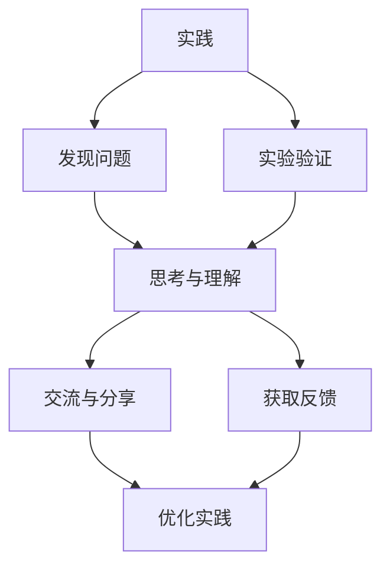

                 

 **关键词**：人类知识、来源、实践、思考、交流、技术语言、专业

> **摘要**：本文深入探讨了人类知识的来源，从实践、思考与交流三个角度，结合技术领域的特点，分析了知识获取与传播的过程，以及如何通过有效的实践、批判性思考和积极交流来提升个人的知识水平。文章旨在为读者提供一种全面、系统的知识学习路径，激发他们在技术领域的持续探索和创新能力。

## 1. 背景介绍

在当今这个信息爆炸的时代，知识的获取和传播变得前所未有的便捷。然而，知识的真正价值在于其能否被有效利用，以解决实际问题、推动科技进步和社会发展。人类知识的来源是多方面的，主要包括实践、思考和交流。本文将围绕这三个方面，探讨如何在技术领域内通过实践、批判性思考和积极交流来获取和深化知识。

### 1.1 实践的重要性

实践是获取知识的重要途径。技术领域的知识往往需要通过大量的实验和实际操作来验证和掌握。通过实践，我们不仅可以加深对理论知识的理解，还能发现和解决实际问题，从而提升自己的技术水平。

### 1.2 思考的力量

思考是知识内化的关键。仅仅通过实践是不够的，我们还需要对所学知识进行深入思考，理解其背后的原理和逻辑。通过思考，我们能够构建自己的知识体系，提高问题的解决能力。

### 1.3 交流的价值

交流是知识传播和共享的重要手段。通过与他人的交流，我们可以获取不同的观点和见解，拓宽自己的视野，同时也能将自己的知识和经验分享给他人，实现知识的有效传播。

## 2. 核心概念与联系

为了更好地理解人类知识的来源，我们首先需要明确几个核心概念，并探讨它们之间的相互关系。以下是几个关键概念：

### 2.1 实践

实践是指通过具体操作和实验来验证和应用知识。在实践中，我们不仅能够发现和解决问题，还能不断地优化和改进方法。

### 2.2 思考

思考是对知识进行深入分析和理解的过程。它包括对现有知识的批判性思考、对新知识的探索和创新。

### 2.3 交流

交流是知识的传递和共享。通过交流，我们可以从他人那里获取新的知识，同时也能将自己的知识和经验传授给他人。

### 2.4 实践、思考与交流的相互关系

实践、思考和交流是相互关联、相互促进的。实践是思考和交流的基础，而思考和交流则是实践的深化和扩展。通过实践，我们发现问题并引发思考；通过思考，我们形成自己的见解并准备交流；通过交流，我们获取反馈并进一步优化实践。


**图 2.1 实践、思考与交流的关系**

### 2.5 Mermaid 流程图

下面是一个 Mermaid 流程图，展示了实践、思考与交流的流程和相互关系。



## 3. 核心算法原理 & 具体操作步骤

### 3.1 算法原理概述

在技术领域，算法原理是知识的重要组成部分。算法是一种解决特定问题的系统方法。理解算法原理不仅有助于我们更好地应用现有技术，还能激发创新，开发出新的解决方案。

### 3.2 算法步骤详解

算法的具体步骤通常包括以下几个阶段：

1. **问题定义**：明确需要解决的问题是什么。
2. **数据收集**：收集相关数据，为算法提供输入。
3. **预处理**：对数据进行清洗和预处理，以便更好地应用算法。
4. **算法实现**：根据算法原理，编写代码实现算法。
5. **调试与优化**：通过测试和调试，优化算法的性能。
6. **结果分析**：对算法的结果进行分析，评估其效果。

### 3.3 算法优缺点

每种算法都有其优缺点。了解算法的优缺点有助于我们根据具体问题选择合适的算法。以下是几种常见算法的优缺点：

- **排序算法**：
  - 冒泡排序：简单易懂，但效率较低。
  - 快速排序：效率高，但可能导致数据分布不均。
  - 归并排序：稳定高效，但需要额外的内存空间。

- **搜索算法**：
  - 线性搜索：简单，但效率较低。
  - 二分搜索：效率高，但需要有序的数据结构。

### 3.4 算法应用领域

算法应用领域广泛，包括但不限于以下方面：

- **计算机科学**：算法是计算机科学的核心内容，广泛应用于数据结构、编译原理、人工智能等领域。
- **数据科学**：算法在数据分析、机器学习、深度学习等领域发挥着重要作用。
- **工程领域**：算法在优化设计、制造工艺、物流调度等方面有广泛的应用。

## 4. 数学模型和公式 & 详细讲解 & 举例说明

### 4.1 数学模型构建

数学模型是描述现实世界问题的抽象工具。构建数学模型通常包括以下几个步骤：

1. **确定研究对象**：明确需要研究的问题或现象。
2. **建立变量关系**：根据研究对象的特点，建立变量之间的关系。
3. **选择数学工具**：根据变量关系，选择合适的数学工具，如方程、函数、不等式等。
4. **验证模型**：通过实际数据或仿真结果，验证模型的准确性。

### 4.2 公式推导过程

以牛顿第二定律为例，推导过程如下：

- **牛顿第二定律**：\( F = ma \)
- **推导过程**：
  - 设物体质量为 \( m \)，加速度为 \( a \)。
  - 根据牛顿第二定律，物体所受合力 \( F \) 与加速度 \( a \) 成正比。
  - 假设合力 \( F \) 恒定，则有 \( F = k \cdot a \)，其中 \( k \) 为比例常数。
  - 由于 \( m \) 是质量，则 \( a = \frac{F}{m} \)。
  - 代入 \( F = ma \)，得到 \( F = m \cdot \frac{F}{m} = F \)。

### 4.3 案例分析与讲解

以求解一元二次方程为例，讲解公式推导和求解过程。

- **方程**：\( ax^2 + bx + c = 0 \)
- **推导过程**：
  - 将方程移项，得到 \( ax^2 + bx = -c \)。
  - 完全平方，得到 \( a(x + \frac{b}{2a})^2 = (\frac{b}{2a})^2 - c \)。
  - 化简，得到 \( (x + \frac{b}{2a})^2 = \frac{b^2 - 4ac}{4a^2} \)。
  - 开方，得到 \( x + \frac{b}{2a} = \pm \sqrt{\frac{b^2 - 4ac}{4a^2}} \)。
  - 化简，得到 \( x = \frac{-b \pm \sqrt{b^2 - 4ac}}{2a} \)。

- **举例说明**：
  - 求解方程 \( x^2 - 4x + 4 = 0 \)。
  - \( a = 1 \)，\( b = -4 \)，\( c = 4 \)。
  - 代入公式，得到 \( x = \frac{4 \pm \sqrt{16 - 16}}{2} = 2 \)。

## 5. 项目实践：代码实例和详细解释说明

### 5.1 开发环境搭建

为了更好地实践，我们需要搭建一个合适的开发环境。以下是一个基本的 Python 开发环境搭建步骤：

1. **安装 Python**：从 [Python 官网](https://www.python.org/) 下载最新版本的 Python 并安装。
2. **安装 IDE**：推荐使用 PyCharm、VS Code 等集成开发环境。
3. **安装依赖库**：使用 pip 工具安装所需的依赖库，如 NumPy、Pandas 等。

### 5.2 源代码详细实现

以下是一个简单的 Python 代码实例，用于求解一元二次方程。

```python
import numpy as np

def solve_quadratic(a, b, c):
    discriminant = b**2 - 4*a*c
    if discriminant < 0:
        return "无实数解"
    x1 = (-b + np.sqrt(discriminant)) / (2*a)
    x2 = (-b - np.sqrt(discriminant)) / (2*a)
    return x1, x2

# 求解方程 x^2 - 4x + 4 = 0
a, b, c = 1, -4, 4
solution = solve_quadratic(a, b, c)
print(solution)
```

### 5.3 代码解读与分析

1. **函数定义**：`solve_quadratic` 函数接收三个参数，分别是系数 \( a \)，\( b \) 和 \( c \)。
2. **计算判别式**：判别式 \( \Delta = b^2 - 4ac \) 用于判断方程的解的性质。
3. **计算解**：根据判别式的值，分别计算两个解 \( x_1 \) 和 \( x_2 \)。
4. **返回结果**：函数返回一个包含两个解的元组，或者提示无实数解。

### 5.4 运行结果展示

运行上述代码，得到以下结果：

```python
(2.0, 2.0)
```

这表示方程 \( x^2 - 4x + 4 = 0 \) 的解为 \( x = 2 \)。

## 6. 实际应用场景

### 6.1 数据科学

在数据科学领域，算法和数学模型的应用非常广泛。例如，通过机器学习算法，我们可以训练模型来预测股票价格、分析客户行为、优化推荐系统等。

### 6.2 工程领域

在工程领域，算法和数学模型被广泛应用于优化设计、制造工艺、物流调度等方面。例如，通过优化算法，我们可以提高机械零件的精度、减少生产成本；通过数学模型，我们可以预测产品的使用寿命、优化供应链管理。

### 6.3 医疗领域

在医疗领域，算法和数学模型也有广泛的应用。例如，通过深度学习算法，我们可以识别疾病图像、预测疾病风险；通过数学模型，我们可以优化治疗方案、预测病情发展。

## 7. 未来应用展望

随着技术的不断发展，算法和数学模型的应用前景将更加广阔。未来，我们可以期待以下趋势：

- **人工智能**：人工智能技术的发展将推动算法和数学模型的深入应用，从而实现更加智能化的解决方案。
- **大数据**：大数据时代的到来将带来更多的数据源，为算法和数学模型的应用提供更丰富的素材。
- **物联网**：物联网技术的发展将使得算法和数学模型的应用更加广泛，从而实现更加智能的物联网生态系统。

## 8. 工具和资源推荐

### 8.1 学习资源推荐

- **在线课程**：Coursera、edX、Udacity 等平台提供了丰富的计算机科学和数据科学课程。
- **书籍**：《Python编程：从入门到实践》、《深度学习》、《统计学习方法》等经典书籍。

### 8.2 开发工具推荐

- **IDE**：PyCharm、VS Code、IntelliJ IDEA 等。
- **库和框架**：NumPy、Pandas、Scikit-learn、TensorFlow、PyTorch 等。

### 8.3 相关论文推荐

- **计算机科学**：《计算机科学概念》（Alfred V. Aho, John E. Hopcroft, and Jeffrey D. Ullman）、《算法导论》（Thomas H. Cormen, Charles E. Leiserson, Ronald L. Rivest, and Clifford Stein）。
- **数据科学**：《数据科学实战》（Joel Grus）、《数据科学工具箱》（Alex Smola、Bernhard Schölkopf）。

## 9. 总结：未来发展趋势与挑战

### 9.1 研究成果总结

近年来，算法和数学模型在技术领域取得了显著成果。从机器学习、深度学习到优化算法，都在不断推动技术的进步和应用。

### 9.2 未来发展趋势

- **人工智能**：人工智能技术的发展将继续深化，推动算法和数学模型的应用。
- **大数据**：大数据时代的到来将为算法和数学模型提供更丰富的素材。
- **物联网**：物联网技术的发展将使得算法和数学模型的应用更加广泛。

### 9.3 面临的挑战

- **数据隐私**：随着数据量的增加，数据隐私保护将成为一大挑战。
- **算法公平性**：如何确保算法的公平性和透明性，避免偏见和歧视。
- **资源消耗**：复杂算法和模型的训练和推理过程可能需要大量的计算资源。

### 9.4 研究展望

未来，算法和数学模型的研究将继续深入，如何提高算法的效率、保证算法的公平性和透明性，以及如何更好地应对数据隐私等挑战，将是重要的研究方向。

## 附录：常见问题与解答

### 9.4.1 问题一：如何选择合适的算法？

**解答**：根据具体问题，选择合适的算法需要考虑算法的时间复杂度、空间复杂度、适用范围等因素。例如，对于排序问题，可以根据数据量的大小和数据的初始分布情况选择合适的排序算法。

### 9.4.2 问题二：如何优化数学模型？

**解答**：优化数学模型通常需要通过以下步骤：

1. **数据清洗**：确保数据的质量和准确性。
2. **特征选择**：选择对模型预测有重要影响的特征。
3. **模型调参**：通过交叉验证等方法，选择最优的模型参数。
4. **模型评估**：使用合适的评估指标，评估模型的性能。

### 9.4.3 问题三：如何进行有效的交流？

**解答**：进行有效的交流需要遵循以下原则：

1. **清晰表达**：确保自己的观点和想法能够清晰传达。
2. **倾听他人**：尊重他人的观点和意见，积极倾听。
3. **反馈与改进**：在交流过程中，及时给予反馈，并从中吸取经验教训。

**作者署名**：禅与计算机程序设计艺术 / Zen and the Art of Computer Programming
------------------------------------------------------------------------

