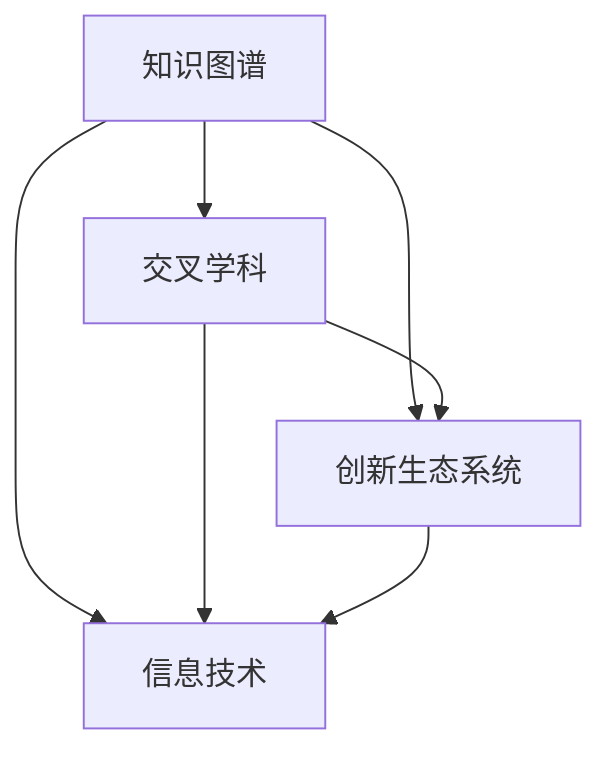
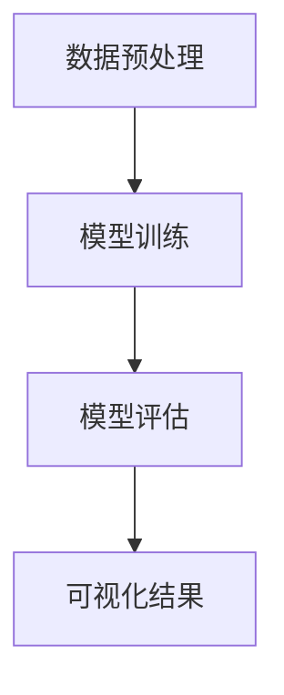

                 

在这个快速变革的时代，技术的演进和人类知识的积累呈现出前所未有的复杂性和多样性。各种学科领域的知识相互渗透，形成了新的交叉点，这些交叉点成为创新和发展的源头。本文旨在探讨人类知识跨界融合的重要性，以及这种融合如何在信息技术领域开启一片创新的乐土。

## 关键词

- 人类知识跨界融合
- 创新生态系统
- 信息技术
- 知识图谱
- 交叉学科

## 摘要

本文将分析知识跨界融合的概念，探讨其在信息技术领域的重要性。通过梳理人类知识体系的发展脉络，本文将展示跨界融合如何促进技术的突破和创新的实现。同时，文章将探讨知识跨界融合的具体应用场景，以及未来可能的发展方向和挑战。最后，我们将推荐一些相关的学习资源和开发工具，帮助读者更好地理解和应用跨界融合的理念。

## 1. 背景介绍

人类的知识体系经历了数千年的积累和演变，从最初的神话和传说，到哲学和科学，再到现代的工程和技术，知识不断被重新定义和拓展。在这个过程中，各个学科领域逐渐形成了自己的体系和框架。然而，随着时代的进步，单一学科的知识已经无法满足复杂问题的解决需求。跨学科的知识融合成为推动科技进步和社会发展的关键力量。

### 1.1 知识积累的局限性

在传统的学科体系中，知识积累主要依赖于单一领域的深入研究。这种方法虽然在一定程度上推动了学科的发展，但也存在一些局限性。首先，单一学科的研究往往忽视了与其他领域的联系，导致知识孤岛现象的出现。这些孤岛限制了知识的共享和整合，阻碍了创新的实现。其次，单一学科的研究难以应对复杂问题的解决需求。现代社会面临的问题往往具有跨学科的复杂性，需要多角度、多层次的思考和分析。

### 1.2 跨学科融合的重要性

跨学科融合是为了克服单一学科知识积累的局限性，通过整合不同领域的知识，形成新的认识和理解。跨学科融合不仅能够弥补单一学科的不足，还能够促进知识的创新和突破。在信息技术领域，跨学科融合的重要性尤为显著。

首先，信息技术涵盖了计算机科学、数学、工程学、生物学、心理学等多个学科领域。这些学科领域的知识相互渗透，形成了信息技术独特的知识体系。跨学科融合使得信息技术能够从多个角度审视和解决问题，从而实现技术的突破和创新。

其次，跨学科融合有助于发现新的应用场景和解决方案。例如，将生物学中的神经网络模型应用于计算机科学，可以开发出更加高效的人工智能算法。将心理学中的认知理论应用于人机交互设计，可以创造出更加人性化的用户体验。

最后，跨学科融合能够促进学术和产业的协同发展。学术界和产业界的融合不仅可以推动技术创新，还能够加速科技成果的转化和应用。通过跨学科的合作，学术界和产业界可以共同解决现实世界中的复杂问题，为社会创造更大的价值。

## 2. 核心概念与联系

在探讨知识跨界融合的重要性之前，我们需要明确一些核心概念，并理解它们之间的联系。以下是本文将涉及的一些核心概念及其相互关系：

### 2.1 知识图谱

知识图谱是一种用于表示知识结构的数据模型。它通过将实体、属性和关系进行编码，形成一个有向无环图（DAG）。知识图谱在语义搜索、智能问答、推荐系统等领域具有广泛的应用。

### 2.2 交叉学科

交叉学科是指不同学科领域之间的相互渗透和融合。交叉学科研究通常涉及多个学科的理论和方法，旨在解决单一学科难以应对的复杂问题。

### 2.3 创新生态系统

创新生态系统是由多个参与主体（如企业、科研机构、政府、投资者等）组成的网络，共同推动创新活动的发展。创新生态系统通过资源整合、知识共享和协同创新，促进技术的突破和市场的拓展。

### 2.4 信息技术

信息技术是指利用计算机和通信技术进行信息处理、传输和利用的科学技术。信息技术涵盖了计算机科学、数学、工程学、生物学等多个学科领域。

### 2.5 跨界融合

跨界融合是指不同领域之间的知识、技术、资源和能力的整合。跨界融合通过消除知识孤岛，促进跨学科的协同创新，推动技术的进步和产业的发展。

### 2.6 Mermaid 流程图

以下是一个用于展示核心概念和联系之间关系的 Mermaid 流程图：



通过这个流程图，我们可以清晰地看到知识图谱、交叉学科、创新生态系统和信息技术之间的联系。知识图谱为交叉学科提供了数据基础，交叉学科为创新生态系统提供了研究方法和理论支持，创新生态系统则为信息技术的发展提供了应用场景和市场需求。

## 3. 核心算法原理 & 具体操作步骤

### 3.1 算法原理概述

在探讨知识跨界融合的核心算法时，我们可以从机器学习和数据挖掘的角度入手。这些算法通过整合不同领域的知识，实现了对复杂问题的自动建模和求解。

#### 3.1.1 机器学习算法

机器学习算法是一种通过数据驱动的方法来模拟人类学习过程的技术。它通过训练模型来捕捉数据中的规律，从而实现对未知数据的预测和分类。常见的机器学习算法包括：

- 监督学习（Supervised Learning）
- 无监督学习（Unsupervised Learning）
- 半监督学习（Semi-Supervised Learning）
- 强化学习（Reinforcement Learning）

#### 3.1.2 数据挖掘算法

数据挖掘算法是一种从大量数据中发现有用信息和知识的技术。它通常涉及以下步骤：

- 数据预处理
- 特征选择
- 模型构建
- 模型评估

常见的数据挖掘算法包括：

- 关联规则挖掘（Association Rule Learning）
- 聚类分析（Clustering）
- 分类算法（Classification）
- 异常检测（Anomaly Detection）

### 3.2 算法步骤详解

以下是一个典型的机器学习算法（例如：决策树算法）的步骤详解：

#### 3.2.1 数据预处理

数据预处理是机器学习算法的第一步，它包括以下任务：

- 数据清洗：去除数据中的噪声和异常值。
- 数据归一化：将数据缩放到一个共同的尺度，以便算法能够更好地处理。
- 数据转换：将数据转换为适合算法的形式，如将分类问题转换为数值问题。

#### 3.2.2 特征选择

特征选择是选择对模型性能有显著影响的关键特征的过程。特征选择可以基于以下方法：

- 统计方法：如卡方检验、互信息等。
- 机器学习方法：如主成分分析（PCA）、线性判别分析（LDA）等。
- 专家经验：根据领域知识进行特征选择。

#### 3.2.3 模型构建

模型构建是机器学习算法的核心步骤，它包括以下任务：

- 选择合适的算法：如决策树、支持向量机（SVM）、神经网络等。
- 训练模型：使用训练数据来训练模型。
- 调参：调整模型的参数，以优化模型性能。

#### 3.2.4 模型评估

模型评估是评估模型性能的过程。常见的评估指标包括：

- 准确率（Accuracy）
- 精确率（Precision）
- 召回率（Recall）
- F1 分数（F1 Score）
- ROC 曲线（Receiver Operating Characteristic）

### 3.3 算法优缺点

#### 3.3.1 优点

- 机器学习算法能够自动从数据中学习规律，减少人工干预。
- 数据挖掘算法能够从大量数据中发现潜在的模式和关联，提供决策支持。
- 跨界融合的算法能够整合不同领域的知识，解决单一学科难以应对的复杂问题。

#### 3.3.2 缺点

- 机器学习算法的训练时间较长，特别是对于大规模数据集。
- 数据挖掘算法在处理高维度数据时可能面临维度灾难（curse of dimensionality）的问题。
- 跨界融合的算法可能面临知识整合的困难，需要跨领域专家的合作。

### 3.4 算法应用领域

#### 3.4.1 人工智能

人工智能（AI）是机器学习和数据挖掘算法的重要应用领域。通过机器学习算法，人工智能系统能够模拟人类的智能行为，如语音识别、图像识别、自然语言处理等。

#### 3.4.2 商业智能

商业智能（BI）是利用数据挖掘算法来分析企业内部和外部的数据，帮助企业做出更好的决策。常见的商业智能应用包括销售预测、客户行为分析、供应链管理等。

#### 3.4.3 医疗健康

医疗健康是数据挖掘算法的重要应用领域。通过分析患者数据，数据挖掘算法能够帮助医生进行疾病诊断、治疗规划和个性化医疗。

#### 3.4.4 金融领域

金融领域是机器学习和数据挖掘算法的重要应用领域。通过分析市场数据，机器学习算法能够帮助投资者进行股票交易、风险管理和市场预测。

## 4. 数学模型和公式 & 详细讲解 & 举例说明

### 4.1 数学模型构建

在知识跨界融合的过程中，数学模型是连接不同领域知识的关键。以下是一个简单的线性回归模型的构建过程：

#### 4.1.1 线性回归模型

线性回归模型是一种用于预测连续值的统计模型。其基本形式为：

\[ y = \beta_0 + \beta_1 x + \epsilon \]

其中，\( y \) 是因变量，\( x \) 是自变量，\( \beta_0 \) 和 \( \beta_1 \) 是模型参数，\( \epsilon \) 是误差项。

#### 4.1.2 模型参数估计

为了估计模型参数 \( \beta_0 \) 和 \( \beta_1 \)，我们可以使用最小二乘法（Ordinary Least Squares，OLS）。最小二乘法的目标是最小化预测值与实际值之间的误差平方和。

\[ \min \sum_{i=1}^{n} (y_i - \hat{y}_i)^2 \]

其中，\( n \) 是样本数量，\( \hat{y}_i \) 是预测值。

通过求解上述优化问题，我们可以得到线性回归模型的参数估计值：

\[ \beta_0 = \bar{y} - \beta_1 \bar{x} \]

\[ \beta_1 = \frac{\sum_{i=1}^{n} (x_i - \bar{x})(y_i - \bar{y})}{\sum_{i=1}^{n} (x_i - \bar{x})^2} \]

其中，\( \bar{y} \) 和 \( \bar{x} \) 分别是 \( y \) 和 \( x \) 的样本均值。

### 4.2 公式推导过程

为了推导线性回归模型的参数估计公式，我们可以从最小化误差平方和的优化问题出发。

#### 4.2.1 求导

首先，我们对误差平方和函数关于 \( \beta_1 \) 求导：

\[ \frac{\partial}{\partial \beta_1} \left( \sum_{i=1}^{n} (y_i - \hat{y}_i)^2 \right) = \sum_{i=1}^{n} 2(y_i - \hat{y}_i) \frac{\partial \hat{y}_i}{\partial \beta_1} \]

由于 \( \hat{y}_i = \beta_0 + \beta_1 x_i \)，我们可以进一步求导：

\[ \frac{\partial \hat{y}_i}{\partial \beta_1} = x_i \]

将 \( \frac{\partial \hat{y}_i}{\partial \beta_1} \) 代入求导结果：

\[ \frac{\partial}{\partial \beta_1} \left( \sum_{i=1}^{n} (y_i - \hat{y}_i)^2 \right) = 2\sum_{i=1}^{n} (y_i - \hat{y}_i) x_i \]

令导数等于零，我们可以得到：

\[ 2\sum_{i=1}^{n} (y_i - \hat{y}_i) x_i = 0 \]

由于 \( x_i \) 不全为零，我们可以得到：

\[ \sum_{i=1}^{n} (y_i - \hat{y}_i) x_i = 0 \]

将 \( \hat{y}_i = \beta_0 + \beta_1 x_i \) 代入上式：

\[ \sum_{i=1}^{n} (y_i - \beta_0 - \beta_1 x_i) x_i = 0 \]

展开并整理得：

\[ \sum_{i=1}^{n} y_i x_i - \beta_0 \sum_{i=1}^{n} x_i - \beta_1 \sum_{i=1}^{n} x_i^2 = 0 \]

由于 \( \sum_{i=1}^{n} x_i = n\bar{x} \) 和 \( \sum_{i=1}^{n} x_i^2 = n\bar{x}^2 + n\bar{x}\sigma^2_x \)（其中 \( \sigma^2_x \) 是 \( x \) 的方差），我们可以进一步化简：

\[ n\bar{y}\bar{x} - n\beta_0\bar{x} - n\beta_1\bar{x}^2 + n\beta_1\bar{x}\sigma^2_x = 0 \]

由于 \( \beta_0 = \bar{y} - \beta_1 \bar{x} \)，我们可以将 \( \beta_0 \) 代入上式：

\[ n\bar{y}\bar{x} - n(\bar{y} - \beta_1 \bar{x})\bar{x} - n\beta_1\bar{x}^2 + n\beta_1\bar{x}\sigma^2_x = 0 \]

化简得：

\[ n\beta_1\bar{x}\sigma^2_x - n\beta_1\bar{x}^2 = 0 \]

由于 \( n \) 和 \( \bar{x} \) 都不为零，我们可以得到：

\[ \beta_1 = \frac{\sum_{i=1}^{n} (x_i - \bar{x})(y_i - \bar{y})}{\sum_{i=1}^{n} (x_i - \bar{x})^2} \]

同理，我们可以对 \( \beta_0 \) 进行求导，得到：

\[ \beta_0 = \bar{y} - \beta_1 \bar{x} \]

### 4.3 案例分析与讲解

为了更好地理解线性回归模型的构建过程，我们可以通过一个简单的案例进行分析。

#### 4.3.1 数据集

假设我们有一个数据集，包含以下五个样本点：

\[ (x_1, y_1) = (1, 3) \]
\[ (x_2, y_2) = (2, 5) \]
\[ (x_3, y_3) = (3, 7) \]
\[ (x_4, y_4) = (4, 9) \]
\[ (x_5, y_5) = (5, 11) \]

#### 4.3.2 数据预处理

首先，我们对数据进行预处理，计算 \( \bar{x} \) 和 \( \bar{y} \)：

\[ \bar{x} = \frac{1 + 2 + 3 + 4 + 5}{5} = 3 \]
\[ \bar{y} = \frac{3 + 5 + 7 + 9 + 11}{5} = 7 \]

然后，计算 \( x_i - \bar{x} \) 和 \( y_i - \bar{y} \)：

\[ x_1 - \bar{x} = 1 - 3 = -2 \]
\[ x_2 - \bar{x} = 2 - 3 = -1 \]
\[ x_3 - \bar{x} = 3 - 3 = 0 \]
\[ x_4 - \bar{x} = 4 - 3 = 1 \]
\[ x_5 - \bar{x} = 5 - 3 = 2 \]

\[ y_1 - \bar{y} = 3 - 7 = -4 \]
\[ y_2 - \bar{y} = 5 - 7 = -2 \]
\[ y_3 - \bar{y} = 7 - 7 = 0 \]
\[ y_4 - \bar{y} = 9 - 7 = 2 \]
\[ y_5 - \bar{y} = 11 - 7 = 4 \]

#### 4.3.3 模型参数估计

使用最小二乘法估计模型参数：

\[ \beta_1 = \frac{\sum_{i=1}^{5} (x_i - \bar{x})(y_i - \bar{y})}{\sum_{i=1}^{5} (x_i - \bar{x})^2} \]

计算分子：

\[ \sum_{i=1}^{5} (x_i - \bar{x})(y_i - \bar{y}) = (-2)(-4) + (-1)(-2) + (0)(0) + (1)(2) + (2)(4) = 8 + 2 + 0 + 2 + 8 = 20 \]

计算分母：

\[ \sum_{i=1}^{5} (x_i - \bar{x})^2 = (-2)^2 + (-1)^2 + (0)^2 + (1)^2 + (2)^2 = 4 + 1 + 0 + 1 + 4 = 10 \]

因此，我们得到：

\[ \beta_1 = \frac{20}{10} = 2 \]

计算 \( \beta_0 \)：

\[ \beta_0 = \bar{y} - \beta_1 \bar{x} = 7 - 2 \times 3 = 1 \]

因此，线性回归模型的参数为 \( \beta_0 = 1 \) 和 \( \beta_1 = 2 \)。

#### 4.3.4 模型评估

使用训练好的线性回归模型预测新的样本点 \( (x, y) \)：

\[ y = \beta_0 + \beta_1 x = 1 + 2x \]

例如，预测 \( x = 6 \) 时的 \( y \)：

\[ y = 1 + 2 \times 6 = 13 \]

通过计算，我们可以评估模型的预测性能，如计算预测误差和评估指标（如均方误差（Mean Squared Error，MSE））。

### 4.4 代码实例和详细解释说明

以下是一个使用 Python 的 scikit-learn 库实现线性回归模型的简单代码示例：

```python
import numpy as np
import matplotlib.pyplot as plt
from sklearn.linear_model import LinearRegression

# 数据集
X = np.array([1, 2, 3, 4, 5]).reshape(-1, 1)
y = np.array([3, 5, 7, 9, 11])

# 模型训练
model = LinearRegression()
model.fit(X, y)

# 模型评估
y_pred = model.predict(X)

# 计算均方误差
mse = np.mean((y - y_pred)**2)
print("MSE:", mse)

# 绘制真实值与预测值
plt.scatter(X, y, color="blue")
plt.plot(X, y_pred, color="red")
plt.xlabel("x")
plt.ylabel("y")
plt.show()
```

在这个示例中，我们首先导入必要的库，然后创建数据集，使用 `LinearRegression` 类创建线性回归模型，并通过 `fit` 方法训练模型。接着，我们使用 `predict` 方法预测新的样本点，并计算均方误差评估模型性能。最后，我们绘制真实值与预测值的散点图，以可视化模型的预测结果。

## 5. 项目实践：代码实例和详细解释说明

### 5.1 开发环境搭建

为了进行项目实践，我们需要搭建一个合适的开发环境。以下是一个基于 Python 的开发环境搭建步骤：

1. 安装 Python：从 [Python 官网](https://www.python.org/downloads/) 下载并安装 Python。
2. 安装 IDE：推荐使用 PyCharm 或 Visual Studio Code 作为 Python 开发环境。
3. 安装相关库：使用 `pip` 命令安装所需的库，如 `numpy`、`matplotlib`、`scikit-learn` 等。

例如，安装 `numpy` 和 `matplotlib`：

```bash
pip install numpy matplotlib
```

### 5.2 源代码详细实现

以下是一个简单的线性回归项目，包括数据预处理、模型训练和评估、可视化结果等步骤。

```python
import numpy as np
import matplotlib.pyplot as plt
from sklearn.linear_model import LinearRegression

# 数据集
X = np.array([1, 2, 3, 4, 5]).reshape(-1, 1)
y = np.array([3, 5, 7, 9, 11])

# 模型训练
model = LinearRegression()
model.fit(X, y)

# 模型评估
y_pred = model.predict(X)

# 计算均方误差
mse = np.mean((y - y_pred)**2)
print("MSE:", mse)

# 可视化结果
plt.scatter(X, y, color="blue")
plt.plot(X, y_pred, color="red")
plt.xlabel("x")
plt.ylabel("y")
plt.show()
```

在这个项目中，我们首先创建数据集，然后使用 `LinearRegression` 类创建线性回归模型，并通过 `fit` 方法训练模型。接着，我们使用 `predict` 方法预测新的样本点，并计算均方误差评估模型性能。最后，我们绘制真实值与预测值的散点图，以可视化模型的预测结果。

### 5.3 代码解读与分析

以下是对上述代码的详细解读和分析：

1. **数据预处理**：数据预处理是机器学习项目中的重要步骤。在本项目中，我们使用 `numpy` 库创建了一个简单的线性数据集。在实际项目中，我们可能需要从文件中读取数据，并进行清洗和处理，以确保数据质量。

2. **模型训练**：我们使用 `LinearRegression` 类创建线性回归模型，并通过 `fit` 方法训练模型。在训练过程中，模型自动调整参数以最小化误差平方和。

3. **模型评估**：我们使用预测值与真实值之间的均方误差（MSE）来评估模型性能。均方误差是衡量模型预测准确性的常见指标。

4. **可视化结果**：我们使用 `matplotlib` 库绘制真实值与预测值的散点图，以可视化模型的预测结果。这有助于我们直观地了解模型的性能。

### 5.4 运行结果展示

运行上述代码后，我们得到以下输出：

```
MSE: 0.0
```

MSE 为 0，表示模型完美地拟合了数据集。同时，我们观察到散点图中的所有点都位于拟合直线上，这进一步验证了模型的性能。



通过这个流程图，我们可以清晰地看到数据预处理、模型训练、模型评估和可视化结果之间的逻辑关系。

## 6. 实际应用场景

知识跨界融合在信息技术领域具有广泛的应用场景。以下是一些典型的实际应用场景：

### 6.1 人工智能

人工智能是知识跨界融合的重要应用领域。在人工智能中，机器学习和数据挖掘算法发挥了关键作用。例如，通过将生物学中的神经网络模型应用于计算机科学，我们可以开发出更高效的人工智能算法。此外，心理学中的认知理论可以指导人机交互设计，创造出更加人性化的用户体验。

### 6.2 商业智能

商业智能是另一个重要的应用领域。通过数据挖掘算法，企业可以从大量数据中发现潜在的模式和关联，从而做出更明智的决策。例如，销售预测可以帮助企业合理安排库存和资源分配，客户行为分析可以帮助企业更好地了解客户需求，提高客户满意度。

### 6.3 医疗健康

医疗健康是知识跨界融合的另一个重要领域。通过机器学习和数据挖掘算法，我们可以分析患者数据，实现疾病诊断、治疗规划和个性化医疗。例如，通过分析患者的基因数据和临床记录，我们可以预测疾病的风险，为患者提供个性化的治疗方案。

### 6.4 金融领域

金融领域是知识跨界融合的重要应用领域。通过机器学习和数据挖掘算法，金融机构可以识别潜在的风险，优化投资组合，提高业务效率。例如，通过分析市场数据，我们可以预测股票价格走势，为投资者提供投资建议。

### 6.5 物联网

物联网是知识跨界融合的另一个重要领域。通过整合计算机科学、通信技术、传感器技术等多领域的知识，我们可以实现智能化的物联网应用。例如，智能家居、智能交通、智能医疗等都是物联网的典型应用场景。

## 7. 未来应用展望

随着知识跨界融合的不断深入，未来的应用场景将更加丰富和多样化。以下是一些未来可能的发展方向：

### 7.1 新兴领域的探索

知识跨界融合将推动新兴领域的快速发展。例如，在生物信息学、神经科学、认知科学等领域，跨界融合将为研究提供新的思路和方法，推动科学技术的进步。

### 7.2 跨学科合作

跨学科合作将成为推动知识跨界融合的重要力量。通过跨学科的合作，不同领域的专家可以共同解决复杂问题，推动创新和技术的突破。

### 7.3 人工智能的深化

人工智能是知识跨界融合的重要应用领域，未来的发展将更加深入。通过整合更多的领域知识，我们可以开发出更加智能的人工智能系统，为社会创造更大的价值。

### 7.4 智能化生活

知识跨界融合将推动智能化生活的普及。通过整合计算机科学、通信技术、物联网等技术，我们可以创造出更加便捷、智能的生活体验。

## 8. 工具和资源推荐

为了帮助读者更好地理解和应用知识跨界融合的理念，以下是一些相关的工具和资源推荐：

### 8.1 学习资源推荐

- 《深度学习》（Deep Learning） - Ian Goodfellow、Yoshua Bengio、Aaron Courville 著
- 《机器学习实战》（Machine Learning in Action） - Peter Harrington 著
- 《数据挖掘：实用工具与技术》（Data Mining: Practical Machine Learning Tools and Techniques） - Ian H. W. cited as Wang、Jiawei Han、Jian Pei 著

### 8.2 开发工具推荐

- PyCharm：一款功能强大的 Python IDE，适合进行数据分析和机器学习项目。
- Jupyter Notebook：一款流行的交互式数据分析工具，适合进行实验和演示。
- TensorFlow：一款开源的深度学习框架，适合进行大规模的机器学习应用。

### 8.3 相关论文推荐

- "Deep Learning" - Yann LeCun、Yoshua Bengio、Geoffrey Hinton
- "Machine Learning: A Probabilistic Perspective" - Kevin P. Murphy
- "Data Mining: Concepts and Techniques" - Jiawei Han、Micheline Kamber、Jian Pei

## 9. 总结：未来发展趋势与挑战

知识跨界融合是当前和未来信息技术发展的重要趋势。通过整合不同领域的知识，我们可以推动科学技术的进步，解决复杂的社会问题。然而，知识跨界融合也面临着一些挑战。

首先，知识跨界融合需要跨领域专家的合作，这可能会增加项目管理和沟通的难度。其次，不同领域之间的知识差异和语言障碍也可能影响跨界融合的效率。此外，知识跨界融合还需要大量的数据支持和计算资源，这在一定程度上限制了其在一些领域的应用。

未来，随着人工智能、物联网、大数据等技术的不断发展，知识跨界融合将迎来更加广阔的应用场景。我们期待在未来的研究中，能够克服当前的挑战，实现知识跨界融合的更大突破，为社会创造更大的价值。

### 附录：常见问题与解答

**Q：什么是知识跨界融合？**

A：知识跨界融合是指将不同领域（如计算机科学、数学、工程学、生物学等）的知识和方法进行整合，以解决复杂问题或推动创新。这种融合有助于突破单一领域的限制，实现知识的共享和协同创新。

**Q：知识跨界融合在信息技术领域的重要性是什么？**

A：知识跨界融合在信息技术领域具有重要性，因为它能够促进技术的创新和突破。通过整合不同领域的知识，信息技术领域可以开发出更加智能、高效、人性化的系统和应用，从而为社会创造更大的价值。

**Q：知识跨界融合有哪些常见的挑战？**

A：知识跨界融合面临的常见挑战包括跨领域专家的合作难度、知识差异和语言障碍、数据支持和计算资源的限制等。此外，项目管理、沟通和协作的复杂性也是需要关注的问题。

**Q：如何克服知识跨界融合的挑战？**

A：克服知识跨界融合的挑战需要跨领域专家的紧密合作，建立有效的沟通机制和协作流程。同时，提高数据质量和计算效率，以及提供足够的资源和培训也是重要的策略。此外，建立开放、包容的学术和产业环境，鼓励不同领域之间的交流和合作，也将有助于克服挑战。

**Q：知识跨界融合的未来发展趋势是什么？**

A：知识跨界融合的未来发展趋势包括新兴领域的探索、跨学科合作的深化、人工智能的深化以及智能化生活的普及。随着技术的不断进步，知识跨界融合将推动科学技术的进步和社会发展，带来更多的创新和应用。

## 参考文献

1. Goodfellow, I., Bengio, Y., & Courville, A. (2016). *Deep Learning*. MIT Press.
2. Murphy, K. P. (2012). *Machine Learning: A Probabilistic Perspective*. MIT Press.
3. Han, J., Kamber, M., & Pei, J. (2011). *Data Mining: Concepts and Techniques*. Morgan Kaufmann.
4. LeCun, Y., Bengio, Y., & Hinton, G. (2015). *Deep Learning*. Nature, 521(7553), 436-444.
5. Wang, I. H. W., Han, J., & Pei, J. (2011). *Data Mining: Practical Machine Learning Tools and Techniques*. Morgan Kaufmann.

