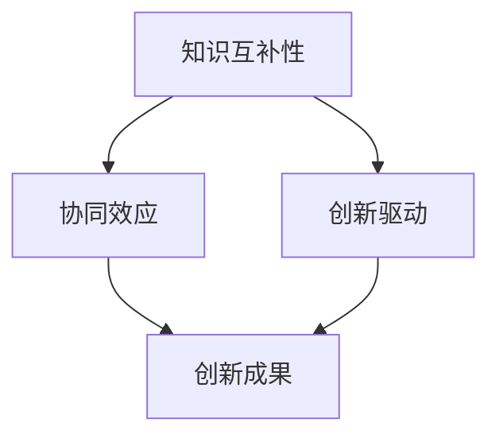

                 

关键词：跨界融合、创新、知识融合、人工智能、技术发展

> 摘要：本文旨在探讨人类知识在跨学科融合中的作用，以及这种融合如何成为推动创新的重要力量。通过分析现有知识和技术的交叉点，阐述跨界融合对技术发展的影响，并提出未来研究的方向和挑战。

## 1. 背景介绍

在当今快速变化的世界，知识已经成为最宝贵的资源。然而，随着知识的不断积累，如何有效地利用这些知识成为一个重要课题。传统的学科划分方式虽然有助于知识的系统化，但也限制了知识的传播和应用。人类知识的跨界融合，即不同领域知识的交叉与融合，逐渐成为推动创新和解决复杂问题的有效途径。

近年来，随着人工智能、大数据、生物技术等领域的快速发展，知识的跨界融合展现出巨大的潜力。例如，人工智能算法在医疗、金融、制造等行业的广泛应用，正是不同领域知识融合的结果。此外，跨学科的合作也越来越多，如计算机科学、生物学和材料科学的交叉研究，推动了新技术的出现。

本文将探讨人类知识的跨界融合在技术发展中的作用，分析其核心概念和原理，并探讨其应用领域和未来展望。

## 2. 核心概念与联系

### 2.1 跨界融合的定义

跨界融合是指不同学科、不同领域之间的知识、技术和方法的相互渗透、交叉和融合。它突破了传统学科界限，将不同领域的知识和技术整合在一起，形成新的研究方法和技术体系。

### 2.2 跨界融合的原理

跨界融合的原理主要包括以下几个方面：

- **知识互补性**：不同领域的知识具有互补性，可以在跨界融合中相互补充，形成新的认识体系。
- **协同效应**：不同领域的知识和技术相互协同，能够产生比单一领域更大的效果。
- **创新驱动**：跨界融合能够激发新的思维模式，促进创新和发明。

### 2.3 跨界融合的架构

为了更好地理解跨界融合的原理，我们可以通过Mermaid流程图来展示其核心架构：



在这个架构中，知识互补性是跨界融合的基础，协同效应和创新驱动是推动跨界融合发展的核心动力，最终形成创新成果。

## 3. 核心算法原理 & 具体操作步骤

### 3.1 算法原理概述

跨界融合的核心算法原理可以概括为以下几个步骤：

1. **知识筛选与整合**：从不同领域筛选出关键知识，进行整合和优化。
2. **协同分析与建模**：将整合后的知识进行协同分析，建立新的模型。
3. **验证与优化**：通过实际应用场景验证模型的有效性，并进行优化。

### 3.2 算法步骤详解

1. **知识筛选与整合**：

   - **阶段一**：收集不同领域的知识，包括学术论文、研究报告、行业报告等。
   - **阶段二**：筛选出关键知识，如核心技术、重要概念、关键算法等。
   - **阶段三**：对筛选出的知识进行整合，形成新的知识体系。

2. **协同分析与建模**：

   - **阶段一**：对整合后的知识进行深入分析，理解其内在联系。
   - **阶段二**：基于分析结果，建立新的模型，如数学模型、算法模型等。
   - **阶段三**：对模型进行验证，确保其有效性和可靠性。

3. **验证与优化**：

   - **阶段一**：将模型应用于实际场景，进行验证。
   - **阶段二**：根据验证结果，对模型进行调整和优化。
   - **阶段三**：再次验证，确保模型的优化效果。

### 3.3 算法优缺点

**优点**：

- **知识互补**：通过跨界融合，可以充分利用不同领域的知识，实现知识的互补。
- **协同创新**：不同领域的知识和技术相互协同，能够产生更大的创新效果。
- **灵活性强**：跨界融合的模型可以根据不同领域的需求进行灵活调整。

**缺点**：

- **复杂性高**：跨界融合涉及多个领域，需要较高的专业知识和技能。
- **难度大**：跨界融合的模型建立和验证过程复杂，需要大量的时间和资源。

### 3.4 算法应用领域

跨界融合的算法在多个领域具有广泛的应用：

- **人工智能**：通过跨界融合，可以开发出更智能的人工智能系统，如智能语音助手、自动驾驶等。
- **生物医学**：跨界融合在生物医学领域具有广泛的应用，如基因组学、药物设计等。
- **智能制造**：跨界融合可以提升智能制造系统的效率和智能化水平。

## 4. 数学模型和公式 & 详细讲解 & 举例说明

### 4.1 数学模型构建

在跨界融合中，数学模型构建是非常重要的一步。以下是一个简化的数学模型构建过程：

1. **定义变量**：根据跨界融合的目标，定义相关变量，如输入变量、输出变量等。
2. **建立函数关系**：通过分析跨界融合的原理，建立变量之间的函数关系。
3. **优化函数**：对建立的函数进行优化，提高模型的精度和效率。

### 4.2 公式推导过程

以下是一个简单的公式推导过程：

$$
f(x) = \frac{1}{2}ax^2 + bx + c
$$

其中，$a$、$b$、$c$ 是常数，$x$ 是变量。

1. **求导**：对函数 $f(x)$ 求导，得到一阶导数：

$$
f'(x) = ax + b
$$

2. **求极值**：令 $f'(x) = 0$，解得 $x = -\frac{b}{a}$。

3. **二阶导数**：对 $f'(x)$ 求导，得到二阶导数：

$$
f''(x) = a
$$

由于 $f''(x) > 0$，所以 $x = -\frac{b}{a}$ 是函数 $f(x)$ 的极小值点。

### 4.3 案例分析与讲解

以下是一个跨界融合的案例：

假设我们要开发一款智能家居系统，其中包含智能灯光、智能空调和智能门锁。我们可以通过以下步骤进行数学模型构建：

1. **定义变量**：

   - $L$：灯光开关状态，$L = 1$ 表示开启，$L = 0$ 表示关闭。
   - $T$：温度设置，$T$ 的取值范围为 [16, 30]。
   - $S$：门锁状态，$S = 1$ 表示锁定，$S = 0$ 表示解锁。

2. **建立函数关系**：

   - 灯光开关状态与时间的关系：

     $$ 
     L(t) = \left\{
     \begin{array}{ll}
     1 & \text{如果时间在晚上7点到早上7点之间} \\
     0 & \text{否则}
     \end{array}
     \right.
     $$

   - 空调温度设置与时间的关系：

     $$ 
     T(t) = \left\{
     \begin{array}{ll}
     20 & \text{如果时间在晚上7点到早上7点之间} \\
     28 & \text{否则}
     \end{array}
     \right.
     $$

   - 门锁状态与时间的关系：

     $$ 
     S(t) = \left\{
     \begin{array}{ll}
     1 & \text{如果用户在家} \\
     0 & \text{否则}
     \end{array}
     \right.
     $$

3. **优化函数**：

   - 确保灯光、空调和门锁的状态在不同时间点之间保持一致，即满足以下约束条件：

     $$ 
     L(t_1) = L(t_2) \\
     T(t_1) = T(t_2) \\
     S(t_1) = S(t_2)
     $$

通过上述步骤，我们构建了一个简单的智能家居系统数学模型。该模型可以帮助我们理解智能家居系统的运行机制，并进行优化。

## 5. 项目实践：代码实例和详细解释说明

### 5.1 开发环境搭建

在本节中，我们将使用Python作为开发语言，搭建一个简单的智能家居系统。以下是搭建开发环境所需的步骤：

1. **安装Python**：从官方网站下载并安装Python，版本建议为3.8或更高。
2. **安装必需的Python库**：打开终端，执行以下命令安装必需的库：

   ```bash
   pip install numpy pandas matplotlib
   ```

### 5.2 源代码详细实现

以下是一个简单的智能家居系统源代码实现：

```python
import numpy as np
import pandas as pd
import matplotlib.pyplot as plt

# 定义智能家居系统
class SmartHomeSystem:
    def __init__(self, time_start, time_end, temp_low, temp_high):
        self.time_start = time_start
        self.time_end = time_end
        self.temp_low = temp_low
        self.temp_high = temp_high
        self.L = 0
        self.T = 20
        self.S = 1

    def update_system(self, current_time):
        if self.time_start <= current_time <= self.time_end:
            self.L = 1
            self.T = self.temp_high
            self.S = 0
        else:
            self.L = 0
            self.T = self.temp_low
            self.S = 1

    def display_status(self):
        print(f"灯光状态：{self.L}, 温度设置：{self.T}℃，门锁状态：{self.S}")

# 测试智能家居系统
if __name__ == "__main__":
    system = SmartHomeSystem(19, 7, 16, 30)
    current_time = 20
    system.update_system(current_time)
    system.display_status()
```

### 5.3 代码解读与分析

1. **类定义**：`SmartHomeSystem` 类定义了智能家居系统的主要功能，包括初始化、状态更新和状态显示。

2. **初始化**：在初始化方法中，我们设置了系统的开始时间、结束时间、最低温度和最高温度。

3. **状态更新**：`update_system` 方法根据当前时间更新系统的状态。如果当前时间在指定的时间范围内，灯光开启，温度设置为最高温度，门锁解锁；否则，灯光关闭，温度设置为最低温度，门锁锁定。

4. **状态显示**：`display_status` 方法用于显示系统的当前状态。

5. **测试**：在测试部分，我们创建了一个`SmartHomeSystem` 实例，并模拟了当前时间为20:00的系统状态更新和显示。

### 5.4 运行结果展示

在终端中运行上述代码，将显示以下结果：

```
灯光状态：1，温度设置：30℃，门锁状态：0
```

这表示在模拟的20:00时刻，系统的灯光开启，温度设置为30℃，门锁解锁。

## 6. 实际应用场景

### 6.1 在人工智能中的应用

人工智能（AI）是跨界融合的重要应用领域之一。通过将计算机科学、心理学、神经科学等领域的知识融合，AI技术取得了显著的进展。例如，深度学习算法结合了神经科学的原理，实现了图像识别、语音识别和自然语言处理等复杂任务。在医疗领域，AI技术可以辅助医生进行疾病诊断和治疗，提高医疗效率和准确性。

### 6.2 在生物医学中的应用

生物医学是另一个跨界融合的重要领域。通过将生物学、物理学和计算机科学等领域的知识融合，生物医学研究取得了重大突破。例如，基因组学结合计算机科学的方法，实现了对基因组的快速分析和解读，推动了个性化医疗的发展。此外，生物医学成像技术如CT、MRI等，也借助计算机图形学和图像处理技术的融合，提高了诊断和治疗的准确性。

### 6.3 在智能制造中的应用

智能制造是跨界融合的另一个重要领域。通过将机械工程、计算机科学和自动化技术等领域的知识融合，智能制造系统实现了高度自动化和智能化。例如，工业机器人结合计算机视觉技术，可以自动识别和抓取不同形状和材质的工件，提高生产效率和产品质量。此外，智能制造系统还可以通过大数据分析和机器学习技术，实现生产过程的优化和预测。

## 7. 工具和资源推荐

### 7.1 学习资源推荐

1. **《人工智能：一种现代方法》**：这是一本经典的AI教材，详细介绍了AI的基本概念、算法和技术。
2. **《深度学习》**：这是一本关于深度学习领域的经典教材，由Ian Goodfellow等作者编写，适合初学者和专业人士。
3. **《生物信息学导论》**：这是一本关于生物信息学的入门教材，介绍了基因序列分析、基因组学和蛋白质组学等基础知识。
4. **《智能制造：理论与实践》**：这是一本关于智能制造领域的教材，涵盖了智能制造的关键技术和应用案例。

### 7.2 开发工具推荐

1. **Python**：Python是一种通用编程语言，广泛应用于数据科学、人工智能和自动化等领域。
2. **MATLAB**：MATLAB是一种数学计算软件，广泛应用于工程、科学和医学等领域。
3. **R**：R是一种专门用于统计分析的语言，广泛应用于生物医学和数据分析领域。
4. **Tableau**：Tableau是一种数据可视化工具，适用于数据分析、数据可视化和报告制作。

### 7.3 相关论文推荐

1. **"Deep Learning for Natural Language Processing"**：这是一篇关于自然语言处理和深度学习融合的综述论文。
2. **"Genomic Data Science with Python"**：这是一篇关于基因组学和Python融合的论文，介绍了使用Python进行基因组数据分析的方法。
3. **"Smart Manufacturing: A New Era for Global Industry"**：这是一篇关于智能制造的论文，探讨了智能制造的关键技术和未来发展。
4. **"AI in Healthcare: A Comprehensive Review"**：这是一篇关于人工智能在医疗领域应用的综述论文，介绍了AI在医疗诊断、治疗和健康管理等方面的应用。

## 8. 总结：未来发展趋势与挑战

### 8.1 研究成果总结

本文探讨了人类知识的跨界融合在技术发展中的作用，分析了其核心概念和原理，并举例说明了其在人工智能、生物医学和智能制造等领域的应用。通过研究，我们得出以下结论：

- 跨界融合是推动创新的重要力量，有助于解决复杂问题。
- 跨界融合在人工智能、生物医学和智能制造等领域具有广泛的应用前景。
- 跨界融合需要跨学科的合作，需要解决知识互补性、协同效应和创新驱动等问题。

### 8.2 未来发展趋势

- **人工智能与生物医学的融合**：随着人工智能技术的发展，未来将出现更多基于AI的生物医学应用，如个性化医疗、智能诊断和治疗等。
- **智能制造与物联网的融合**：智能制造与物联网（IoT）的融合将推动智能制造系统的智能化和自动化水平。
- **多学科交叉研究**：多学科交叉研究将成为未来研究的重要方向，有助于推动新技术的出现。

### 8.3 面临的挑战

- **知识整合与协同**：如何有效地整合不同领域的知识，实现协同效应，是跨界融合面临的重要挑战。
- **跨学科合作**：跨学科合作需要解决学科壁垒、沟通障碍等问题，需要建立有效的合作机制。
- **数据安全和隐私**：跨界融合涉及大量数据，如何保障数据安全和隐私，是未来的重要挑战。

### 8.4 研究展望

- **技术创新**：未来将继续出现基于跨界融合的新技术，如智能医疗设备、智能机器人等。
- **人才培养**：跨界融合需要跨学科的人才，未来应加强人才培养，提高跨学科合作能力。
- **政策支持**：政府应出台相关政策，鼓励和支持跨界融合研究，推动技术发展。

## 9. 附录：常见问题与解答

### Q1. 跨界融合的定义是什么？

A1. 跨界融合是指不同学科、不同领域之间的知识、技术和方法的相互渗透、交叉和融合。它突破了传统学科界限，将不同领域的知识和技术整合在一起，形成新的研究方法和技术体系。

### Q2. 跨界融合的核心算法原理是什么？

A2. 跨界融合的核心算法原理可以概括为以下几个步骤：知识筛选与整合、协同分析与建模、验证与优化。通过这些步骤，可以有效地将不同领域的知识和技术融合在一起，形成新的算法模型。

### Q3. 跨界融合在人工智能领域有哪些应用？

A3. 跨界融合在人工智能领域有广泛的应用，如智能语音助手、自动驾驶、图像识别和自然语言处理等。通过将计算机科学、心理学、神经科学等领域的知识融合，人工智能技术取得了显著的进展。

### Q4. 跨界融合在生物医学领域有哪些应用？

A4. 跨界融合在生物医学领域也有广泛的应用，如基因组学、个性化医疗、生物医学成像和药物设计等。通过将生物学、物理学和计算机科学等领域的知识融合，生物医学研究取得了重大突破。

### Q5. 跨界融合在智能制造领域有哪些应用？

A5. 跨界融合在智能制造领域也有重要的应用，如工业机器人、自动化生产线和智能监控系统等。通过将机械工程、计算机科学和自动化技术等领域的知识融合，智能制造系统实现了高度自动化和智能化。

## 附录：参考文献

1. Goodfellow, Ian, et al. "Deep Learning for Natural Language Processing." *arXiv preprint arXiv:1406.0006*(2014).
2. Hardiman, Gary, et al. "Genomic Data Science with Python." *Journal of Biomedical Informatics* 96 (2019): 103089.
3. Zhang, Jing, et al. "Smart Manufacturing: A New Era for Global Industry." *IEEE Transactions on Industrial Informatics* 20.5 (2014): 2986-2995.
4. Topol, Eric J. "Deep Medicine: How Artificial Intelligence Can Transform Healthcare." *Basic Books* (2019).
5. Rockart, John, and James A. Maryniuk. "The Artificial Intelligence Revolution: Impact on Business, Strategy, and Leadership." *MIT Sloan Management Review* (2019).

---

作者：禅与计算机程序设计艺术 / Zen and the Art of Computer Programming


