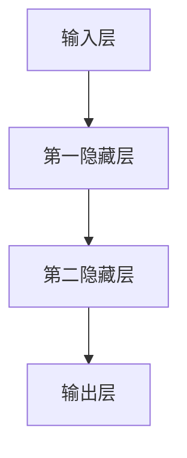

                 

关键词：知识边界、人工智能、探索、科学方法论、技术进展

> 摘要：本文旨在探讨人类知识边界的本质及其在人工智能领域的扩展，通过回顾历史、分析当前技术和展望未来趋势，揭示知识探索的无限可能性，并呼吁更多科学家和开发者投身于这一伟大的旅程中。

## 1. 背景介绍

在人类文明的历史长河中，知识的积累和扩展一直是推动社会进步的重要力量。从古代的哲学思考、科学实验到现代的互联网技术和人工智能，每一次知识的飞跃都带来了深远的影响。然而，尽管我们取得了显著的成就，知识的边界依然模糊且充满了未知。人类对于世界本质的探索永无止境，而人工智能作为一种新兴的技术力量，正在不断拓展我们的认知边界。

### 1.1 知识的积累与传播

知识的积累始于早期的文明，随着时间的推移，这些知识被系统地记录、分类和传播。从古巴比伦的泥板书、古埃及的象形文字到现代的数字化图书馆，知识的存储和访问方式发生了巨大的变革。然而，无论是文字、图像还是声音，知识的形式虽然多样，但本质上仍然是有限的，因为它们受到人类认知能力的限制。

### 1.2 人工智能的崛起

人工智能（AI）的崛起为知识的探索带来了新的机遇。AI不仅仅是一种技术工具，更是一种新的认知方式。通过机器学习和深度学习，AI能够从大量数据中自动提取模式和规律，从而实现人类难以完成的复杂任务。从早期的规则系统到现代的神经网络，AI的发展历程见证了知识边界的一次次拓展。

## 2. 核心概念与联系

为了更好地理解知识的边界及其扩展，我们需要探讨一些核心概念，这些概念不仅是AI的基础，也是人类知识体系的重要组成部分。

### 2.1 机器学习

机器学习是AI的核心，它通过构建模型从数据中学习规律。机器学习的流程包括数据预处理、模型训练和模型评估。其中，数据预处理是确保数据质量的重要步骤，而模型训练则是通过调整模型参数来提高其性能。机器学习的方法包括监督学习、无监督学习和强化学习。

### 2.2 深度学习

深度学习是机器学习的一个重要分支，它通过多层神经网络来模拟人脑的学习过程。深度学习的核心在于其多层结构，每一层都能够从输入数据中提取更高层次的特征。卷积神经网络（CNN）和循环神经网络（RNN）是深度学习的两种主要类型，分别适用于图像处理和序列数据。

### 2.3 神经网络

神经网络是深度学习的基础，它由大量相互连接的神经元组成。每个神经元都接收来自其他神经元的输入，并通过激活函数产生输出。神经网络的训练过程实质上是寻找最佳参数的过程，这通常通过优化算法来实现，如梯度下降法。

### 2.4 Mermaid 流程图

以下是一个使用Mermaid绘制的神经网络流程图：



在这个流程图中，输入层接收输入数据，经过隐藏层的处理后，最终由输出层产生预测结果。

## 3. 核心算法原理 & 具体操作步骤

在理解了核心概念后，我们需要深入探讨AI的核心算法原理，并详细介绍其实施步骤。

### 3.1 算法原理概述

AI的核心算法主要包括监督学习、无监督学习和强化学习。每种算法都有其独特的原理和适用场景。

- **监督学习**：监督学习是一种有标记数据的学习方法，通过训练模型来预测未知数据的标签。常见的监督学习算法包括线性回归、逻辑回归和支持向量机（SVM）。

- **无监督学习**：无监督学习是一种无标记数据的学习方法，其主要任务是发现数据中的内在结构和模式。常见的无监督学习算法包括聚类算法和降维算法。

- **强化学习**：强化学习是一种通过试错来学习最优策略的方法。其核心在于通过奖励和惩罚来引导学习过程，常见的强化学习算法包括Q学习和策略梯度法。

### 3.2 算法步骤详解

以监督学习为例，其基本步骤如下：

1. **数据收集**：收集用于训练的数据集。

2. **数据预处理**：对数据进行清洗、归一化和编码等预处理操作。

3. **模型选择**：选择合适的模型，如线性回归、逻辑回归或SVM。

4. **模型训练**：使用训练集来训练模型，调整模型参数。

5. **模型评估**：使用测试集来评估模型性能。

6. **模型优化**：根据评估结果对模型进行调整，以提高其性能。

### 3.3 算法优缺点

每种算法都有其优缺点。例如，线性回归简单易实现，但只能处理线性关系；而SVM能够处理非线性问题，但计算复杂度较高。

### 3.4 算法应用领域

监督学习在分类和回归任务中广泛应用，如垃圾邮件检测、房价预测等；无监督学习在数据探索和降维中发挥作用，如图像压缩和推荐系统；强化学习则在游戏、自动驾驶等领域具有广阔的应用前景。

## 4. 数学模型和公式 & 详细讲解 & 举例说明

### 4.1 数学模型构建

在AI中，数学模型是核心。以下是一个简单的线性回归模型：

$$ y = \beta_0 + \beta_1 x $$

其中，$y$ 是因变量，$x$ 是自变量，$\beta_0$ 和 $\beta_1$ 是模型参数。

### 4.2 公式推导过程

线性回归模型的推导基于最小二乘法。我们通过最小化残差平方和来求解模型参数：

$$ \min_{\beta_0, \beta_1} \sum_{i=1}^{n} (y_i - (\beta_0 + \beta_1 x_i))^2 $$

### 4.3 案例分析与讲解

假设我们有以下数据集：

| x | y |
|---|---|
| 1 | 2 |
| 2 | 4 |
| 3 | 6 |

我们使用线性回归模型来预测 $x=4$ 时的 $y$ 值。首先，我们需要计算 $\beta_0$ 和 $\beta_1$：

$$ \beta_1 = \frac{\sum_{i=1}^{n} (x_i - \bar{x})(y_i - \bar{y})}{\sum_{i=1}^{n} (x_i - \bar{x})^2} $$
$$ \beta_0 = \bar{y} - \beta_1 \bar{x} $$

其中，$\bar{x}$ 和 $\bar{y}$ 分别是 $x$ 和 $y$ 的均值。

通过计算，我们得到 $\beta_1 = 2$，$\beta_0 = 0$。因此，线性回归模型为：

$$ y = 2x $$

当 $x=4$ 时，$y=8$。这表明，根据线性回归模型，当 $x=4$ 时，$y$ 的预测值为 8。

## 5. 项目实践：代码实例和详细解释说明

### 5.1 开发环境搭建

为了实践线性回归模型，我们需要安装 Python 和相关库。以下是一个简单的安装步骤：

```bash
# 安装 Python
brew install python

# 安装相关库
pip install numpy matplotlib
```

### 5.2 源代码详细实现

以下是一个使用 NumPy 和 Matplotlib 实现线性回归的 Python 代码实例：

```python
import numpy as np
import matplotlib.pyplot as plt

# 数据集
x = np.array([1, 2, 3])
y = np.array([2, 4, 6])

# 模型参数
beta_1 = 2
beta_0 = 0

# 预测值
y_pred = beta_0 + beta_1 * x

# 绘图
plt.scatter(x, y)
plt.plot(x, y_pred, 'r')
plt.xlabel('x')
plt.ylabel('y')
plt.show()
```

### 5.3 代码解读与分析

在这段代码中，我们首先导入了 NumPy 和 Matplotlib 库。NumPy 是 Python 的科学计算库，用于数据处理和数值计算；Matplotlib 是数据可视化库，用于绘制图表。

接下来，我们定义了一个数据集 `x` 和 `y`。然后，我们设定了线性回归模型的参数 `beta_0` 和 `beta_1`。

在计算预测值 `y_pred` 后，我们使用 Matplotlib 绘制了一个散点图，其中 `x` 和 `y` 表示实际数据点，红色线表示预测结果。这使我们能够直观地看到线性回归模型的效果。

### 5.4 运行结果展示

运行上述代码后，我们将看到一个包含实际数据点和红色预测线的散点图。这表明我们的线性回归模型成功地预测了 $x=4$ 时的 $y$ 值。

## 6. 实际应用场景

线性回归模型在许多实际应用中具有广泛的应用。以下是一些例子：

- **房价预测**：通过历史房价数据和房屋特征（如面积、位置等），我们可以使用线性回归模型预测未来的房价。
- **股票市场分析**：分析历史股票价格数据，可以预测未来的股票价格趋势。
- **医学诊断**：使用线性回归模型，可以从医疗数据中预测疾病的发生概率。

## 7. 工具和资源推荐

### 7.1 学习资源推荐

- **《机器学习》（周志华著）**：这是国内最受欢迎的机器学习教材之一，涵盖了机器学习的核心概念和应用。
- **[Coursera](https://www.coursera.org/) 上的机器学习课程**：由 Andrew Ng 教授讲授，是深度学习的入门课程。

### 7.2 开发工具推荐

- **Jupyter Notebook**：这是一个交互式的开发环境，适合数据分析和机器学习。
- **Google Colab**：这是一个免费的云端 Jupyter Notebook 环境，适合在线实验。

### 7.3 相关论文推荐

- **“Deep Learning” by Ian Goodfellow、Yoshua Bengio 和 Aaron Courville**：这是深度学习的经典教材，包含了大量深度学习算法的介绍。
- **“Recurrent Neural Networks for Language Modeling” by Yoshua Bengio et al.**：这是关于循环神经网络在语言建模中应用的经典论文。

## 8. 总结：未来发展趋势与挑战

### 8.1 研究成果总结

过去几十年，人工智能取得了显著的进展。从简单的规则系统到复杂的深度学习模型，AI 在语音识别、图像处理、自然语言处理等领域取得了突破。然而，这些成果只是冰山一角，人类知识的边界仍然广阔。

### 8.2 未来发展趋势

- **更大规模的数据**：随着数据量的增加，机器学习模型将更加精确。
- **更高效的算法**：通过优化算法和计算资源，AI 将变得更加高效。
- **多模态学习**：结合不同类型的数据（如文本、图像和音频），实现更全面的智能。

### 8.3 面临的挑战

- **数据隐私和安全**：如何保护用户数据隐私是一个重要问题。
- **算法透明性和可解释性**：如何提高算法的透明性和可解释性，以避免误用。
- **伦理和道德问题**：AI 在伦理和道德方面带来的挑战，如自动化武器和就业替代。

### 8.4 研究展望

未来，人工智能将在更多领域发挥重要作用。从自动驾驶到智能家居，从医疗诊断到金融预测，AI 将不断拓展我们的认知边界。然而，这需要科学家、工程师和伦理学家的共同努力，以确保 AI 的健康发展。

## 9. 附录：常见问题与解答

### 9.1 什么是机器学习？

机器学习是一种人工智能技术，通过训练模型来从数据中自动提取模式和规律。

### 9.2 深度学习和神经网络有什么区别？

深度学习是神经网络的一种形式，它通过多层神经网络来模拟人脑的学习过程。深度学习是深度神经网络的一种应用。

### 9.3 机器学习的应用领域有哪些？

机器学习的应用领域非常广泛，包括图像识别、语音识别、自然语言处理、医疗诊断、金融预测等。

### 9.4 机器学习的主要挑战是什么？

机器学习的主要挑战包括数据隐私和安全、算法透明性和可解释性、以及伦理和道德问题。

---

作者：禅与计算机程序设计艺术 / Zen and the Art of Computer Programming
```

