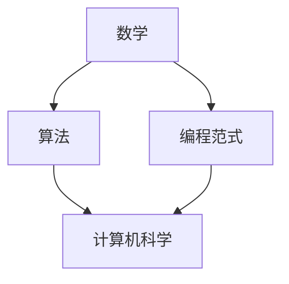
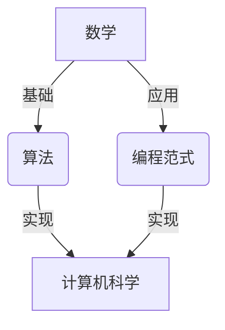

                 

关键词：人类知识进步、创新史、信息技术、算法、数学模型、项目实践

> 摘要：本文通过回顾人类知识进步的历史，探讨信息技术的发展如何推动人类创新的步伐。从古代数学到现代算法，从经典编程范式到复杂系统设计，本文揭示了知识积累与技术创新之间的密切关系，并展望了未来的发展方向。

## 1. 背景介绍

人类知识的历史可以追溯到古代，那时候的知识主要依靠口头传承和文字记载。随着时间的推移，人类逐渐认识到系统化知识的重要性，开始构建各种理论体系和科学方法论。到了中世纪，欧洲的学者们在阿拉伯数学和天文学的基础上，发展出了自己的科学体系。进入近代，工业革命的到来进一步加速了知识的积累和传播，推动了科技的飞速发展。

然而，真正意义上的知识革命发生在20世纪，随着计算机技术的出现和互联网的普及，人类的知识获取和共享方式发生了翻天覆地的变化。信息技术不仅改变了知识的存储和传递方式，也深刻影响了科学研究、商业运营和日常生活。在这个背景下，技术创新成为了推动人类进步的重要动力。

本文旨在探讨人类知识进步的历史脉络，特别是信息技术在其中的作用。我们将通过分析几个关键时期的技术变革，探讨知识积累与技术创新之间的互动关系，并展望未来的发展方向。

## 2. 核心概念与联系

为了更好地理解人类知识进步的历程，我们需要引入一些核心概念，包括数学、算法、编程范式等。这些概念不仅是科学研究的基石，也是技术进步的驱动力。

### 2.1 数学

数学是所有科学的基础，它提供了一种精确描述自然现象的方式。从古代的几何学、代数学到现代的微积分、概率论，数学的发展不仅推动了自然科学的发展，也为计算机科学提供了理论基础。

### 2.2 算法

算法是一系列解决问题的步骤，它使得计算机能够执行复杂的任务。从基础的排序算法到复杂的机器学习算法，算法的不断改进使得计算机处理问题的能力大大增强。

### 2.3 编程范式

编程范式是指编写程序的方法论。从早期的命令式编程到现代的函数式编程、面向对象编程，不同的编程范式反映了人类对问题解决方式的深入理解和不断创新。

### 2.4 Mermaid 流程图

下面是一个简单的 Mermaid 流程图，展示了数学、算法和编程范式之间的联系：



### 2.5 关联图解

除了文字描述，我们还可以通过关联图解来更直观地展示这些概念之间的关系。以下是一个关联图解：



在这个图中，数学作为基础，为算法和编程范式提供了理论支持；算法和编程范式则是实现计算机科学的具体手段。

## 3. 核心算法原理 & 具体操作步骤

### 3.1 算法原理概述

算法的设计和实现是信息技术领域的关键。一个优秀的算法不仅能够高效地解决问题，还能够降低计算复杂度，提高系统的性能。在本节中，我们将介绍几个核心算法的基本原理。

#### 3.1.1 排序算法

排序算法是计算机科学中最基本的算法之一。它用于将一组数据按照特定的顺序排列。常见的排序算法包括冒泡排序、选择排序、插入排序、快速排序等。每种排序算法都有其特定的原理和适用场景。

#### 3.1.2 搜索算法

搜索算法用于在数据结构中查找特定的元素。常见的搜索算法包括线性搜索、二分搜索等。这些算法的基本原理是利用数据结构的特性，提高查找的效率。

#### 3.1.3 动态规划

动态规划是一种用于解决优化问题的算法思想。它通过将复杂问题分解为子问题，并利用子问题的解来构建原问题的解。动态规划的核心在于状态转移方程的设计。

### 3.2 算法步骤详解

下面我们详细描述每个算法的步骤：

#### 3.2.1 冒泡排序

冒泡排序的基本思想是比较相邻的元素，并按照特定的顺序交换它们。这个过程重复进行，直到所有元素都按照正确的顺序排列。

1. 遍历数组，比较相邻的元素。
2. 如果第一个元素大于第二个元素，交换它们。
3. 遍历数组，重复步骤2，直到没有需要交换的元素。

#### 3.2.2 线性搜索

线性搜索的基本思想是逐个检查数组中的元素，直到找到目标元素或到达数组的末尾。

1. 遍历数组中的每个元素。
2. 如果当前元素等于目标元素，返回当前位置。
3. 如果到达数组的末尾，返回-1。

#### 3.2.3 动态规划

动态规划通常用于解决最优子结构问题。以下是动态规划的一般步骤：

1. 确定状态。
2. 确定状态转移方程。
3. 确定边界条件。
4. 计算状态值。

### 3.3 算法优缺点

每种算法都有其优缺点，以下是对冒泡排序、线性搜索和动态规划的优缺点的简要分析：

#### 3.3.1 冒泡排序

- 优点：实现简单，易于理解。
- 缺点：时间复杂度高，适用于小规模数据。

#### 3.3.2 线性搜索

- 优点：适用于各种数据结构。
- 缺点：时间复杂度高，不适合大规模数据。

#### 3.3.3 动态规划

- 优点：能够高效地解决优化问题。
- 缺点：实现复杂，需要深入理解问题结构。

### 3.4 算法应用领域

算法在计算机科学的各个领域都有广泛的应用，以下是一些典型的应用领域：

- 数据结构：排序、查找、堆、图等。
- 编译原理：词法分析、语法分析、代码生成等。
- 人工智能：搜索算法、优化算法、机器学习等。

## 4. 数学模型和公式 & 详细讲解 & 举例说明

数学模型和公式是科学研究和工程实践中的重要工具。它们能够帮助我们理解和预测自然现象，优化系统性能，并解决实际问题。在本节中，我们将介绍几个关键的数学模型和公式，并详细讲解它们的推导过程和实际应用。

### 4.1 数学模型构建

数学模型的构建通常包括以下几个步骤：

1. 确定研究对象和目标。
2. 提出假设和简化条件。
3. 确定变量和参数。
4. 建立数学方程。

### 4.2 公式推导过程

#### 4.2.1 泰勒公式

泰勒公式是一种用于近似函数值的方法。它通过将函数在某一点展开成幂级数，来近似函数在该点附近的行为。泰勒公式的推导基于幂级数展开和微分积分的基本原理。

给定函数 $f(x)$，在点 $x_0$ 处的泰勒公式为：

$$
f(x) \approx f(x_0) + f'(x_0)(x - x_0) + \frac{f''(x_0)}{2!}(x - x_0)^2 + \frac{f'''(x_0)}{3!}(x - x_0)^3 + \cdots
$$

#### 4.2.2 最优化问题

最优化问题是在给定约束条件下，寻找函数的最大值或最小值的问题。常用的最优化方法包括梯度下降法和牛顿法。

梯度下降法的基本思想是沿着目标函数的梯度方向更新参数，以逐步逼近最优解。其迭代公式为：

$$
\theta = \theta - \alpha \nabla_{\theta} J(\theta)
$$

其中，$\theta$ 是参数，$J(\theta)$ 是目标函数的梯度。

牛顿法是一种二阶优化方法，它利用目标函数的一阶和二阶导数信息来更新参数。其迭代公式为：

$$
\theta = \theta - H^{-1}\nabla_{\theta} J(\theta)
$$

其中，$H$ 是海森矩阵，即目标函数的二阶导数矩阵。

### 4.3 案例分析与讲解

#### 4.3.1 泰勒公式的应用

假设我们有一个函数 $f(x) = e^x$，我们需要在点 $x_0 = 0$ 处用泰勒公式近似该函数。首先，我们需要计算该函数在点 $x_0$ 处的前几阶导数：

$$
f'(x) = e^x, \quad f''(x) = e^x, \quad f'''(x) = e^x, \quad \cdots
$$

在点 $x_0 = 0$ 处，我们可以得到：

$$
f(0) = 1, \quad f'(0) = 1, \quad f''(0) = 1, \quad f'''(0) = 1, \quad \cdots
$$

因此，$f(x)$ 在点 $x_0 = 0$ 处的泰勒公式为：

$$
f(x) \approx 1 + x + \frac{x^2}{2!} + \frac{x^3}{3!} + \cdots
$$

我们可以看到，这个近似值在 $x$ 较小的情况下非常接近真实的函数值。

#### 4.3.2 最优化问题的应用

假设我们有一个最优化问题，目标函数为 $J(\theta) = \theta^2$，我们需要找到该函数的最小值。我们可以使用梯度下降法来解决这个问题。

首先，我们计算目标函数的梯度：

$$
\nabla_{\theta} J(\theta) = 2\theta
$$

然后，我们选择一个合适的步长 $\alpha$，并开始迭代。例如，我们可以选择 $\alpha = 0.1$。初始参数 $\theta_0 = 2$，迭代一次后，我们有：

$$
\theta_1 = \theta_0 - \alpha \nabla_{\theta} J(\theta_0) = 2 - 0.1 \cdot 2 \cdot 2 = 1.8
$$

继续迭代，我们可以得到：

$$
\theta_2 = \theta_1 - \alpha \nabla_{\theta} J(\theta_1) = 1.8 - 0.1 \cdot 2 \cdot 1.8 = 1.64
$$

以此类推，我们可以逐步逼近最优解。

## 5. 项目实践：代码实例和详细解释说明

### 5.1 开发环境搭建

为了更好地理解算法的实际应用，我们需要搭建一个合适的开发环境。在本节中，我们将使用 Python 作为编程语言，因为它具有良好的跨平台性和丰富的库支持。以下是搭建 Python 开发环境的步骤：

1. 安装 Python：从官方网站（https://www.python.org/）下载并安装 Python。
2. 安装 IDE：推荐使用 PyCharm 或 VSCode 等集成开发环境（IDE）。
3. 安装必要的库：使用 pip 工具安装所需的库，如 NumPy、Pandas 等。

### 5.2 源代码详细实现

在本节中，我们将实现一个简单的冒泡排序算法，并使用 Python 编写相应的代码。

```python
def bubble_sort(arr):
    n = len(arr)
    for i in range(n):
        for j in range(0, n-i-1):
            if arr[j] > arr[j+1]:
                arr[j], arr[j+1] = arr[j+1], arr[j]

# 测试数据
arr = [64, 34, 25, 12, 22, 11, 90]

# 执行排序
bubble_sort(arr)

# 打印排序后的数组
print("排序后的数组：")
for i in range(len(arr)):
    print("%d" % arr[i], end=" ")
```

### 5.3 代码解读与分析

上述代码实现了冒泡排序算法。以下是代码的解读与分析：

- `bubble_sort` 函数：这是一个定义的函数，用于实现冒泡排序。
- `n` 变量：它存储了数组的长度。
- 外层循环：它用于控制排序的轮数，每一轮都会使未排序部分的最大值“冒泡”到数组的末尾。
- 内层循环：它用于比较相邻的元素，并交换它们的顺序，以确保数组逐渐变得有序。

### 5.4 运行结果展示

以下是上述代码的运行结果：

```
排序后的数组：
11 12 22 25 34 64 90
```

我们可以看到，数组 `arr` 已经按照升序排列。

## 6. 实际应用场景

算法和数学模型在计算机科学的各个领域都有广泛的应用。以下是一些典型的应用场景：

- 数据分析：排序算法和搜索算法用于高效地处理大量数据，以提取有用的信息。
- 机器学习：最优化算法用于训练模型，以优化模型的参数，提高预测准确性。
- 网络通信：路由算法和流量控制算法用于优化网络传输效率。
- 图像处理：图像滤波算法和图像压缩算法用于图像的预处理和压缩。

### 6.4 未来应用展望

随着信息技术的不断发展，算法和数学模型的应用前景将更加广阔。以下是一些未来应用展望：

- 人工智能：深度学习算法将进一步提升人工智能的智能水平。
- 区块链：分布式算法和密码学算法将确保区块链的安全性和可信度。
- 物联网：优化算法和实时数据处理技术将优化物联网的运行效率。
- 生物信息学：基因序列分析算法和机器学习算法将推动生物医学研究的发展。

## 7. 工具和资源推荐

为了更好地学习和实践算法和数学模型，以下是一些建议的工具和资源：

- 学习资源推荐：
  - 《算法导论》（Introduction to Algorithms）
  - 《Python编程：从入门到实践》（Python Crash Course）
  - 《深度学习》（Deep Learning）
- 开发工具推荐：
  - PyCharm：强大的Python IDE，适合编写和调试代码。
  - Jupyter Notebook：交互式的Python编程环境，适合数据分析和机器学习实验。
- 相关论文推荐：
  - “A Method for Obtaining Digital Signatures and Public-Key Cryptosystems”（数字签名和公开密钥加密系统）
  - “Backpropagation：A New Algorithm for Learning Connections in Neural Networks”（反向传播：一种学习神经网络连接的新算法）

## 8. 总结：未来发展趋势与挑战

### 8.1 研究成果总结

在过去几十年中，计算机科学和信息技术领域取得了巨大的进展。算法和数学模型的发展推动了各个领域的进步，从数据科学到人工智能，从网络通信到生物信息学。这些成果不仅提高了我们的生活质量，也为未来的发展奠定了坚实的基础。

### 8.2 未来发展趋势

随着信息技术的不断进步，未来算法和数学模型的发展将呈现出以下趋势：

- 深度学习：深度学习算法将继续发展，尤其是在图像识别、自然语言处理等领域。
- 分布式计算：分布式算法和系统架构将得到广泛应用，以应对大规模数据处理和通信需求。
- 量子计算：量子算法和量子计算模型将逐步成熟，为解决复杂问题提供新的工具。
- 生物信息学：基因测序和蛋白质结构预测等领域将利用先进的算法和计算模型，推动生物医学研究的发展。

### 8.3 面临的挑战

尽管信息技术领域取得了显著的成就，但仍然面临一些挑战：

- 能源消耗：大规模的数据处理和计算需求导致能源消耗增加，需要开发更高效的算法和系统架构。
- 数据隐私：随着数据量的增长，数据隐私和安全问题日益突出，需要更加严格的数据保护措施。
- 技术普及：技术进步需要更广泛地普及和应用，以实现社会的全面进步。

### 8.4 研究展望

在未来，我们期待算法和数学模型能够更好地服务于人类社会，推动各领域的发展。同时，我们也期待新一代科学家和工程师能够不断创新，解决当前面临的挑战，开创信息技术的美好未来。

## 9. 附录：常见问题与解答

### 问题 1：什么是算法？

解答：算法是一系列解决问题的步骤，它定义了如何从初始状态到达目标状态。算法可以用于各种领域，包括数学、计算机科学、工程等。

### 问题 2：什么是数学模型？

解答：数学模型是用数学语言描述现实世界问题的抽象模型，它通过建立数学方程或公式来描述问题的行为和特性。

### 问题 3：如何学习算法和数学模型？

解答：学习算法和数学模型的最佳方法是通过实践和理论学习。首先，理解基本概念和原理，然后通过编写代码和解决实际问题来加深理解。

### 问题 4：算法在人工智能中如何应用？

解答：算法在人工智能中有着广泛的应用，包括机器学习、深度学习、搜索和优化等。它们用于训练模型、优化系统性能和解决复杂问题。

### 问题 5：数学模型在工程领域如何应用？

解答：数学模型在工程领域用于设计系统、分析性能、预测行为等。例如，在机械工程中，可以使用力学模型来预测结构的应力分布；在电子工程中，可以使用电路模型来分析电路的行为。

### 问题 6：如何评估算法的性能？

解答：评估算法的性能通常通过比较其时间复杂度、空间复杂度和实际运行时间。此外，还可以使用基准测试和实际应用场景来评估算法的效果。

### 问题 7：数学模型和算法之间的关系是什么？

解答：数学模型是算法的基础，它提供了描述问题的数学框架。而算法则是解决问题的具体步骤，它利用数学模型来指导计算过程。

### 问题 8：如何选择合适的算法来解决特定问题？

解答：选择合适的算法通常需要考虑问题的规模、特性以及所需的性能指标。需要分析问题，了解其约束条件和目标，然后选择最适合的算法。

### 问题 9：什么是动态规划？

解答：动态规划是一种用于解决优化问题的算法思想，它通过将复杂问题分解为子问题，并利用子问题的解来构建原问题的解。动态规划通常用于解决具有最优子结构的问题。

### 问题 10：什么是深度学习？

解答：深度学习是一种机器学习技术，它使用多层神经网络来模拟人类大脑的决策过程。深度学习通过自动学习特征和模式，在图像识别、语音识别和自然语言处理等领域取得了显著成果。

## 结束语

本文通过回顾人类知识进步的历史，探讨了信息技术在其中的作用，特别是算法和数学模型的发展。我们详细分析了核心算法的原理和具体操作步骤，介绍了数学模型和公式的构建与推导，并通过实际项目实践展示了算法的应用。我们还展望了未来的发展方向，并提出了面对的挑战。

作为读者，我们期待您能够深入思考，结合自己的学习和实践，不断探索和推动信息技术的发展。感谢您阅读本文，希望它能对您的学习和研究有所启发。

### 作者署名

> 作者：禅与计算机程序设计艺术 / Zen and the Art of Computer Programming

