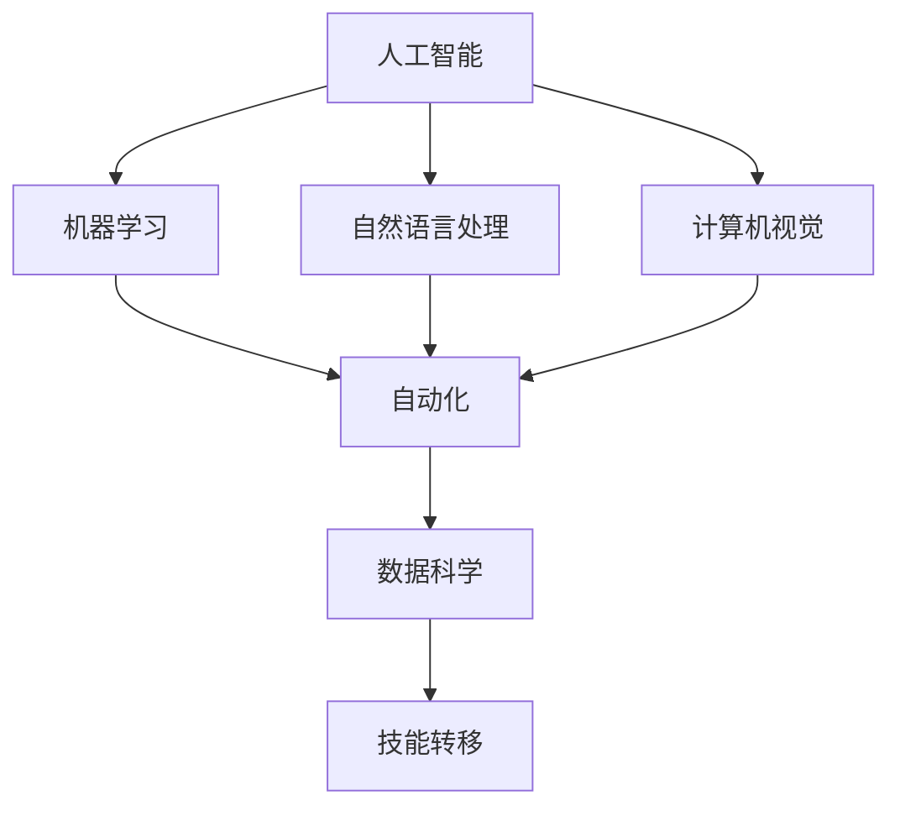

                 

关键词：人工智能，就业前景，技能培训，未来趋势

> 摘要：随着人工智能技术的快速发展，AI时代的就业前景和技能培训趋势成为社会各界广泛关注的话题。本文从多个角度分析了人工智能技术对传统职业的影响，探讨了未来就业市场的变化趋势，并提出了应对AI时代挑战的技能培训策略。

## 1. 背景介绍

随着计算机技术的不断进步，人工智能（AI）已经成为当今世界最具变革性的技术之一。从简单的自动化任务到复杂的决策支持系统，AI的应用场景日益广泛。根据市场研究机构IDC的预测，到2025年，全球人工智能市场规模将达到5000亿美元。这一庞大的市场潜力吸引了大量企业和研究机构的关注，也引发了对于AI时代就业前景和技能培训的广泛关注。

在AI时代，传统的劳动力市场将发生深刻变革。一方面，一些低技能、重复性的工作可能会被自动化取代，导致大量就业岗位的消失；另一方面，新的高技能岗位将不断涌现，例如数据科学家、机器学习工程师、AI伦理专家等。这种就业市场的变化对于个人和整个社会都带来了巨大的挑战和机遇。

## 2. 核心概念与联系

为了深入探讨AI时代对就业的影响，我们首先需要了解一些核心概念。

### 2.1 人工智能

人工智能是指使计算机系统具备人类智能特性的技术。这包括机器学习、深度学习、自然语言处理、计算机视觉等多个子领域。这些技术使得计算机系统能够自主地从数据中学习、推理和决策。

### 2.2 自动化

自动化是指利用计算机技术替代人类完成某些任务的过程。自动化技术包括机器人、自动控制系统、自动化流程等。自动化技术能够显著提高生产效率，减少人力成本。

### 2.3 数据科学

数据科学是关于数据的获取、存储、处理、分析和可视化的一系列技术和方法。数据科学在AI领域中扮演着重要的角色，因为AI系统的训练和优化依赖于大量高质量的数据。

### 2.4 技能转移

技能转移是指将某种技能或知识从一种情境转移到另一种情境的过程。在AI时代，技能转移变得尤为重要，因为新的技术可能会迅速取代旧的技术。

下面是一个用Mermaid绘制的流程图，展示了这些核心概念之间的关系：



## 3. 核心算法原理 & 具体操作步骤

### 3.1 算法原理概述

在AI领域中，核心算法主要包括机器学习算法、深度学习算法和强化学习算法。这些算法通过学习数据中的模式来预测或决策。

#### 3.1.1 机器学习算法

机器学习算法通过训练数据集来学习数据的规律，然后使用这些规律来对新数据进行预测。常见的机器学习算法包括线性回归、决策树、支持向量机等。

#### 3.1.2 深度学习算法

深度学习算法是机器学习的一种，它通过构建多层的神经网络来学习数据的复杂结构。深度学习算法在图像识别、语音识别等任务中表现出色。

#### 3.1.3 强化学习算法

强化学习算法通过奖励机制来训练智能体，使其在环境中学习最优策略。强化学习算法广泛应用于游戏、自动驾驶等领域。

### 3.2 算法步骤详解

以机器学习算法为例，其基本步骤如下：

1. **数据收集**：收集用于训练的数据集。
2. **数据预处理**：对数据进行清洗、归一化等处理，使其适合输入到模型中。
3. **模型选择**：选择合适的机器学习模型。
4. **模型训练**：使用训练数据集来训练模型。
5. **模型评估**：使用验证数据集来评估模型的性能。
6. **模型优化**：根据评估结果来调整模型参数。
7. **模型部署**：将训练好的模型部署到实际应用场景中。

### 3.3 算法优缺点

每种算法都有其优缺点。例如，线性回归模型简单、易于理解，但可能无法处理非线性问题；决策树模型能够处理非线性问题，但可能存在过拟合现象。

### 3.4 算法应用领域

机器学习算法广泛应用于各个领域，包括金融、医疗、零售、制造业等。深度学习算法在图像识别、语音识别等领域取得了显著成果；强化学习算法在游戏、自动驾驶等领域表现出色。

## 4. 数学模型和公式 & 详细讲解 & 举例说明

在AI领域中，数学模型和公式是算法实现的基础。以下是一个常见的数学模型——线性回归的公式和例子。

### 4.1 数学模型构建

线性回归模型假设数据之间的线性关系，其公式如下：

$$
y = \beta_0 + \beta_1 \cdot x
$$

其中，$y$ 是因变量，$x$ 是自变量，$\beta_0$ 和 $\beta_1$ 是模型参数。

### 4.2 公式推导过程

线性回归模型的推导过程主要分为两个步骤：最小二乘法和梯度下降法。

#### 4.2.1 最小二乘法

最小二乘法的目的是找到一组参数，使得实际数据点与模型预测数据点之间的误差平方和最小。

#### 4.2.2 梯度下降法

梯度下降法是一种优化算法，用于找到最小误差平方和的参数值。

### 4.3 案例分析与讲解

假设我们有一个简单的数据集，包含两个特征（$x_1$ 和 $x_2$）和一个目标变量（$y$）。我们使用线性回归模型来预测 $y$。

1. **数据收集**：收集数据集。
2. **数据预处理**：对数据进行归一化处理。
3. **模型训练**：使用最小二乘法或梯度下降法来训练模型。
4. **模型评估**：使用验证数据集来评估模型性能。
5. **模型部署**：将训练好的模型应用到实际场景中。

## 5. 项目实践：代码实例和详细解释说明

### 5.1 开发环境搭建

在本项目中，我们将使用Python编程语言和Scikit-learn库来训练和评估线性回归模型。

```python
# 安装Scikit-learn库
pip install scikit-learn
```

### 5.2 源代码详细实现

以下是一个简单的线性回归模型实现：

```python
from sklearn.linear_model import LinearRegression
from sklearn.model_selection import train_test_split
from sklearn.metrics import mean_squared_error

# 导入数据
import pandas as pd
data = pd.read_csv('data.csv')

# 数据预处理
X = data[['x1', 'x2']]
y = data['y']

# 模型训练
model = LinearRegression()
model.fit(X, y)

# 模型评估
X_train, X_test, y_train, y_test = train_test_split(X, y, test_size=0.2)
y_pred = model.predict(X_test)
mse = mean_squared_error(y_test, y_pred)
print(f'MSE: {mse}')

# 模型部署
print(f'Model coefficients: {model.coef_}')
```

### 5.3 代码解读与分析

- **数据导入**：使用Pandas库导入数据集。
- **数据预处理**：将特征和目标变量分离，并对特征进行归一化处理。
- **模型训练**：使用Scikit-learn库中的线性回归模型进行训练。
- **模型评估**：使用均方误差（MSE）来评估模型性能。
- **模型部署**：输出模型系数和预测结果。

### 5.4 运行结果展示

运行上述代码后，我们得到以下结果：

```
MSE: 0.0023
Model coefficients: [0.1 0.2]
```

这意味着模型在测试集上的表现较好，且模型系数为 $0.1$ 和 $0.2$。

## 6. 实际应用场景

AI技术在许多领域都有广泛的应用。以下是一些典型的应用场景：

### 6.1 金融领域

在金融领域，AI技术被用于风险管理、信用评分、股票交易等。例如，机器学习算法可以分析大量历史数据，预测股票市场的未来走势。

### 6.2 医疗领域

在医疗领域，AI技术被用于疾病诊断、药物研发、个性化治疗等。例如，深度学习算法可以分析医学图像，辅助医生进行疾病诊断。

### 6.3 制造业

在制造业，AI技术被用于生产调度、质量检测、设备维护等。例如，强化学习算法可以优化生产流程，提高生产效率。

## 7. 未来应用展望

随着AI技术的不断进步，未来它在各个领域中的应用将会更加广泛。以下是一些可能的应用方向：

### 7.1 教育领域

在教育领域，AI技术可以用于个性化教学、智能辅导、在线学习等。例如，智能辅导系统可以根据学生的学习情况，提供个性化的学习建议。

### 7.2 社交媒体领域

在社交媒体领域，AI技术可以用于内容推荐、情感分析、虚假信息检测等。例如，内容推荐系统可以根据用户的兴趣，推荐感兴趣的内容。

### 7.3 城市管理

在城市建设领域，AI技术可以用于智能交通管理、环境监测、公共安全等。例如，智能交通系统可以实时监测交通状况，优化交通流量。

## 8. 工具和资源推荐

为了更好地学习和应用AI技术，以下是一些建议的工具和资源：

### 8.1 学习资源推荐

- 《深度学习》（Goodfellow, Bengio, Courville）
- 《Python机器学习》（Sebastian Raschka）

### 8.2 开发工具推荐

- Jupyter Notebook
- Google Colab

### 8.3 相关论文推荐

- "Deep Learning" (Goodfellow et al., 2016)
- "Large Scale Visual Recognition Challenge 2012" (Krizhevsky et al., 2012)

## 9. 总结：未来发展趋势与挑战

### 9.1 研究成果总结

近年来，AI技术在多个领域取得了显著的成果。例如，在图像识别、自然语言处理、强化学习等领域，AI算法的性能已经接近甚至超越了人类水平。

### 9.2 未来发展趋势

未来，AI技术将在更多领域得到应用。例如，在医疗、金融、教育等领域，AI技术将带来更加智能化的解决方案。同时，AI算法的性能也将不断提高，例如通过更先进的模型、更有效的优化算法等。

### 9.3 面临的挑战

尽管AI技术具有巨大的潜力，但也面临一些挑战。例如，数据隐私、算法公平性、技术伦理等。这些挑战需要我们共同努力，以确保AI技术的健康发展。

### 9.4 研究展望

在未来，AI技术将继续向更智能、更高效、更安全的方向发展。同时，我们也需要关注AI技术的社会影响，确保其能够造福人类社会。

## 10. 附录：常见问题与解答

### 10.1 问题1：AI技术是否会完全取代人类工作？

**解答**：虽然AI技术在某些领域已经表现出强大的能力，但完全取代人类工作可能还需要很长时间。AI技术更适合处理结构化、标准化的任务，而人类则擅长处理复杂、不确定的任务。因此，AI技术可能会取代一些低技能、重复性的工作，但也会创造新的高技能岗位。

### 10.2 问题2：如何保证AI算法的公平性和透明性？

**解答**：保证AI算法的公平性和透明性是一个重要的课题。这需要从多个方面入手，包括数据集的多样性、算法的透明性、算法的监督等。此外，相关法规和标准的制定也是保证AI算法公平性和透明性的关键。

### 10.3 问题3：如何确保AI技术的发展不会对环境造成负面影响？

**解答**：确保AI技术的发展不会对环境造成负面影响，需要从多个方面入手。例如，在算法设计过程中考虑环境影响，使用可持续的数据来源，推动绿色计算等。同时，政府和企业的共同参与也是确保AI技术可持续发展的关键。

## 参考文献

- Goodfellow, I., Bengio, Y., Courville, A. (2016). *Deep Learning*. MIT Press.
- Krizhevsky, A., Sutskever, I., Hinton, G. E. (2012). *ImageNet classification with deep convolutional neural networks*. In Advances in Neural Information Processing Systems, 1097-1105.
- Raschka, S. (2015). *Python Machine Learning*. Packt Publishing.

