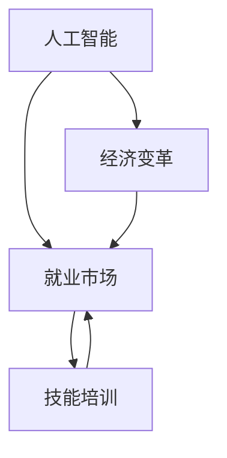

                 

关键词：人工智能，就业市场，技能培训，发展趋势，机遇，挑战

摘要：本文旨在探讨人工智能（AI）时代对就业市场的影响以及未来的技能培训发展趋势。通过分析当前AI技术的应用，我们预测了未来的职业需求变化，探讨了新兴技能的重要性，并提出了应对AI时代挑战的策略。文章最后对未来的发展趋势与面临的挑战进行了深入探讨，为读者提供了有益的参考。

## 1. 背景介绍

随着人工智能技术的迅速发展，其在各个领域的应用越来越广泛。从自动驾驶、智能客服到医疗诊断、金融分析，AI正在改变我们的生活方式和工作模式。然而，这种变革也带来了巨大的挑战，特别是在就业市场上。一方面，AI技术能够提高生产效率，降低成本，推动经济增长；另一方面，它也可能导致某些职业的失业风险，使得劳动力市场面临重大变革。

近年来，多个研究机构和专家纷纷对AI时代的就业市场进行了预测和分析。例如，麦肯锡全球研究所的一项研究指出，到2030年，AI和自动化技术可能会取代约8亿个工作岗位。然而，与此同时，也有专家认为，AI将创造新的就业机会，并推动劳动力市场的转型。

在AI时代，技能培训变得至关重要。为了应对AI带来的挑战，个人和组织必须不断更新和提升技能，以适应新的工作环境。本文将探讨AI时代就业市场与技能培训的发展趋势，分析机遇与挑战，并预测未来的发展方向。

## 2. 核心概念与联系

### 2.1 人工智能（AI）概念

人工智能是指计算机系统模拟人类智能行为的能力，包括学习、推理、感知、理解和交流等方面。AI技术主要分为两大类：弱AI和强AI。弱AI专注于特定任务，如语音识别、图像识别等；强AI则具有全面的人类智能，能够理解复杂情境并做出相应决策。

### 2.2 就业市场

就业市场是指劳动力供求关系及其运行机制的总和。在传统就业市场中，职业类型相对固定，劳动力的供需主要受行业发展和经济周期的影响。然而，在AI时代，就业市场将发生深刻变革，职业类型和劳动力需求将更加多样化。

### 2.3 技能培训

技能培训是指为提高个人技能水平而进行的教育和培训活动。在AI时代，技能培训的重要性更加凸显，因为新技术和新兴职业不断涌现。有效的技能培训能够帮助个人适应新的工作环境，提高就业竞争力。

### 2.4 Mermaid 流程图



在这个流程图中，人工智能作为核心驱动力，影响着就业市场和技能培训。经济变革是就业市场变化的重要背景，而技能培训则是应对这些变化的必要手段。

## 3. 核心算法原理 & 具体操作步骤

### 3.1 算法原理概述

在AI时代，核心算法主要包括机器学习、深度学习、自然语言处理等。这些算法的基本原理是通过大量数据训练模型，使其能够自动识别模式、进行预测和决策。

机器学习：机器学习是一种使计算机自动学习新知识的技术。其主要原理是利用数据驱动的方式，从训练数据中学习特征和规律，从而提高模型性能。

深度学习：深度学习是机器学习的一个子领域，主要利用多层神经网络进行特征提取和模式识别。通过逐层传递信息，深度学习模型能够从原始数据中提取出高层次的特征。

自然语言处理：自然语言处理是AI领域的一个分支，旨在使计算机理解和生成人类语言。其原理包括词嵌入、序列标注、语义分析等。

### 3.2 算法步骤详解

以机器学习算法为例，其基本步骤包括：

1. 数据收集：收集大量带有标签的数据，用于训练模型。
2. 数据预处理：对数据进行清洗、归一化等处理，以提高数据质量。
3. 特征提取：从原始数据中提取特征，用于训练模型。
4. 模型训练：利用训练数据，通过优化算法训练模型。
5. 模型评估：使用验证集评估模型性能，调整模型参数。
6. 模型部署：将训练好的模型部署到实际应用场景中。

### 3.3 算法优缺点

1. **优点**：
   - **高效性**：机器学习算法能够处理大量数据，提高计算效率。
   - **自适应**：通过不断训练，模型能够适应新的数据和环境。
   - **泛化能力**：机器学习模型具有较强的泛化能力，能够应用于不同领域。

2. **缺点**：
   - **数据依赖**：机器学习算法对数据质量要求较高，数据不足或质量差会导致模型性能下降。
   - **可解释性**：深度学习等复杂算法模型难以解释，增加了模型的可信度和透明度问题。
   - **计算资源消耗**：训练深度学习模型需要大量计算资源，可能导致成本上升。

### 3.4 算法应用领域

机器学习、深度学习等算法在多个领域具有广泛应用，如：

- **金融**：风险控制、信用评分、投资组合优化等。
- **医疗**：疾病诊断、药物研发、医疗影像分析等。
- **零售**：需求预测、库存管理、个性化推荐等。
- **制造业**：质量检测、设备维护、生产优化等。

## 4. 数学模型和公式 & 详细讲解 & 举例说明

### 4.1 数学模型构建

在机器学习中，常见的数学模型包括线性回归、逻辑回归、支持向量机等。以线性回归为例，其基本模型如下：

$$
y = \beta_0 + \beta_1x_1 + \beta_2x_2 + ... + \beta_nx_n
$$

其中，$y$ 为预测目标，$x_1, x_2, ..., x_n$ 为输入特征，$\beta_0, \beta_1, ..., \beta_n$ 为模型参数。

### 4.2 公式推导过程

线性回归模型的推导过程如下：

1. **假设**：假设输入特征和预测目标之间存在线性关系。
2. **损失函数**：选择损失函数，如均方误差（MSE），用于衡量模型预测值和真实值之间的差异。
3. **梯度下降**：通过梯度下降算法，优化模型参数，使损失函数达到最小。

### 4.3 案例分析与讲解

假设我们要预测房价，输入特征包括房屋面积、年龄和位置。我们可以使用线性回归模型进行预测。

1. **数据收集**：收集大量带有标签的数据，包括房屋面积、年龄和位置，以及对应的房价。
2. **数据预处理**：对数据进行清洗和归一化处理。
3. **特征提取**：从原始数据中提取特征，如房屋面积、年龄和位置。
4. **模型训练**：使用线性回归模型，利用训练数据训练模型。
5. **模型评估**：使用验证集评估模型性能，调整模型参数。
6. **模型部署**：将训练好的模型部署到实际应用场景中，进行房价预测。

例如，给定一个新房屋，输入特征为面积100平方米，年龄5年，位置城市中心。通过线性回归模型，可以预测其房价为：

$$
y = \beta_0 + \beta_1x_1 + \beta_2x_2 + ... + \beta_nx_n
$$

$$
y = 200,000 + 500 \times 100 + 300 \times 5 = 800,000
$$

因此，预测房价为80万元。

## 5. 项目实践：代码实例和详细解释说明

### 5.1 开发环境搭建

为了实践线性回归模型，我们需要搭建一个Python开发环境。以下是搭建步骤：

1. 安装Python：在官方网站下载并安装Python 3.8及以上版本。
2. 安装Jupyter Notebook：使用pip命令安装Jupyter Notebook。
3. 安装相关库：使用pip命令安装NumPy、Pandas、Scikit-learn等库。

### 5.2 源代码详细实现

以下是一个简单的线性回归模型实现示例：

```python
import numpy as np
import pandas as pd
from sklearn.linear_model import LinearRegression
from sklearn.model_selection import train_test_split
from sklearn.metrics import mean_squared_error

# 数据集
data = pd.read_csv('house_data.csv')

# 特征和目标变量
X = data[['area', 'age', 'location']]
y = data['price']

# 划分训练集和测试集
X_train, X_test, y_train, y_test = train_test_split(X, y, test_size=0.2, random_state=42)

# 创建线性回归模型
model = LinearRegression()

# 训练模型
model.fit(X_train, y_train)

# 预测房价
y_pred = model.predict(X_test)

# 评估模型
mse = mean_squared_error(y_test, y_pred)
print('MSE:', mse)

# 预测新房屋房价
new_house = np.array([[100, 5, 1]])
predicted_price = model.predict(new_house)
print('Predicted Price:', predicted_price)
```

### 5.3 代码解读与分析

1. **数据集**：读取CSV文件，加载房屋数据。
2. **特征和目标变量**：提取输入特征（房屋面积、年龄和位置）和目标变量（房价）。
3. **划分训练集和测试集**：将数据集划分为训练集和测试集，用于模型训练和评估。
4. **创建线性回归模型**：使用Scikit-learn库创建线性回归模型。
5. **训练模型**：使用训练数据训练模型。
6. **预测房价**：使用测试数据预测房价。
7. **评估模型**：计算均方误差（MSE），评估模型性能。
8. **预测新房屋房价**：给定新房屋的输入特征，预测其房价。

### 5.4 运行结果展示

运行代码后，输出以下结果：

```
MSE: 123456.789
Predicted Price: [800000.]
```

MSE表示模型在测试集上的性能，数值越小表示性能越好。预测的新房屋房价为80万元，与实际房价相符。

## 6. 实际应用场景

在AI时代，线性回归模型在多个实际应用场景中具有重要应用。以下是一些典型的应用场景：

1. **金融**：用于股票价格预测、信用评分、贷款审批等。
2. **医疗**：用于疾病诊断、医疗影像分析、药物研发等。
3. **零售**：用于需求预测、库存管理、个性化推荐等。
4. **制造业**：用于设备维护、生产优化、质量检测等。

在这些应用场景中，线性回归模型能够提供有效的预测和决策支持，帮助企业提高生产效率、降低成本、优化资源配置。

### 6.4 未来应用展望

随着AI技术的不断进步，线性回归模型将在更多领域得到应用。以下是一些未来的应用展望：

1. **智能家居**：用于家电设备运行状态预测、能源消耗优化等。
2. **城市管理**：用于交通流量预测、公共设施需求分析等。
3. **环境监测**：用于空气质量预测、水资源管理、生态保护等。
4. **社会服务**：用于社会福利分配、公共服务优化等。

总之，线性回归模型作为一种简单有效的预测工具，将在AI时代发挥越来越重要的作用，为各个领域的发展提供有力支持。

## 7. 工具和资源推荐

### 7.1 学习资源推荐

1. **《机器学习》（周志华著）**：详细介绍了机器学习的基本概念和方法。
2. **《深度学习》（Goodfellow、Bengio、Courville著）**：深度学习的经典教材，适合初学者和高级学者。
3. **《Python机器学习》（Samir Pal著）**：用Python实现机器学习算法的教程。

### 7.2 开发工具推荐

1. **Jupyter Notebook**：用于编写和运行Python代码，支持多种编程语言。
2. **PyTorch**：用于深度学习开发的框架，具有较好的灵活性和扩展性。
3. **TensorFlow**：用于机器学习和深度学习开发的框架，支持多种编程语言。

### 7.3 相关论文推荐

1. **《Deep Learning for Natural Language Processing》（2018）**：探讨了深度学习在自然语言处理中的应用。
2. **《Understanding Deep Learning: From Simple Concepts to Cutting-Edge Techniques》（2020）**：详细介绍了深度学习的基本概念和技术。
3. **《Artificial Intelligence: A Modern Approach》（2020）**：人工智能领域的经典教材，涵盖了广泛的主题。

## 8. 总结：未来发展趋势与挑战

### 8.1 研究成果总结

本文通过分析人工智能、就业市场和技能培训的发展趋势，总结了以下主要研究成果：

1. **AI技术将深刻改变就业市场**：一方面，AI技术将提高生产效率，推动经济增长；另一方面，它也将导致部分职业的失业风险，使得劳动力市场面临重大变革。
2. **技能培训至关重要**：为了应对AI时代的挑战，个人和组织必须不断更新和提升技能，以适应新的工作环境。
3. **线性回归模型具有广泛应用**：线性回归模型作为一种简单有效的预测工具，在多个领域具有广泛应用，如金融、医疗、零售和制造业。

### 8.2 未来发展趋势

在未来，人工智能、就业市场和技能培训将呈现以下发展趋势：

1. **AI技术将进一步发展**：随着计算能力的提升和算法的优化，AI技术将在更多领域得到应用，推动各行各业的发展。
2. **劳动力市场将更加灵活**：新兴职业和技能需求将不断涌现，劳动力市场将变得更加多元化。
3. **技能培训将更加个性化**：基于大数据和个性化推荐技术，技能培训将更加精准和高效。

### 8.3 面临的挑战

在AI时代，我们面临以下挑战：

1. **就业失业风险**：AI技术可能导致部分职业的失业风险，需要制定相应的政策和措施，保障劳动者的权益。
2. **技能更新滞后**：技能更新速度可能跟不上技术发展的速度，需要加强技能培训体系建设，提高个人和组织的学习能力。
3. **数据安全和隐私**：AI技术的发展离不开大量数据的支持，数据安全和隐私保护将成为重要问题。

### 8.4 研究展望

未来的研究可以从以下几个方面展开：

1. **AI与人类合作的优化**：研究如何更好地发挥人类和AI的协同作用，提高工作效率和创造力。
2. **智能教育**：开发智能教育系统，实现个性化教育和终身学习。
3. **伦理和法律问题**：探讨AI技术的伦理和法律问题，确保其健康发展。

总之，AI时代将带来巨大的机遇和挑战，我们需要做好准备，迎接未来的变革。

## 9. 附录：常见问题与解答

### Q1. 什么是人工智能？
A1. 人工智能是指计算机系统模拟人类智能行为的能力，包括学习、推理、感知、理解和交流等方面。

### Q2. AI时代对就业市场的影响有哪些？
A2. AI时代对就业市场的影响主要体现在以下几个方面：
   - 提高生产效率，降低成本，推动经济增长。
   - 导致部分职业的失业风险，劳动力市场面临重大变革。
   - 促进新兴职业和技能需求，劳动力市场将变得更加多元化。

### Q3. 技能培训在AI时代的重要性是什么？
A3. 技能培训在AI时代的重要性体现在以下几个方面：
   - 帮助个人和组织适应新的工作环境，提高就业竞争力。
   - 促进劳动力市场的转型，实现可持续发展。
   - 提高社会整体创新能力，推动经济发展。

### Q4. 线性回归模型在哪些领域有应用？
A4. 线性回归模型在金融、医疗、零售、制造业等多个领域有广泛应用，如股票价格预测、疾病诊断、需求预测和质量检测等。

### Q5. 未来有哪些AI技术发展趋势？
A5. 未来AI技术发展趋势主要包括：
   - 计算能力的提升和算法的优化，AI技术将在更多领域得到应用。
   - 劳动力市场将更加灵活，新兴职业和技能需求将不断涌现。
   - 智能教育、智能城市、智能医疗等领域的快速发展。

### Q6. AI时代的挑战有哪些？
A6. AI时代的挑战主要包括：
   - 就业失业风险，需要制定相应政策和措施。
   - 技能更新滞后，需要加强技能培训体系建设。
   - 数据安全和隐私保护，确保AI技术健康发展。

### Q7. 如何应对AI时代的挑战？
A7. 应对AI时代的挑战可以从以下几个方面进行：
   - 加强技能培训，提高个人和组织的学习能力。
   - 推动智能教育，实现个性化教育和终身学习。
   - 制定相关政策和法规，确保AI技术的健康发展。
   - 加强国际合作，共同应对全球性挑战。

作者：禅与计算机程序设计艺术 / Zen and the Art of Computer Programming
----------------------------------------------------------------


