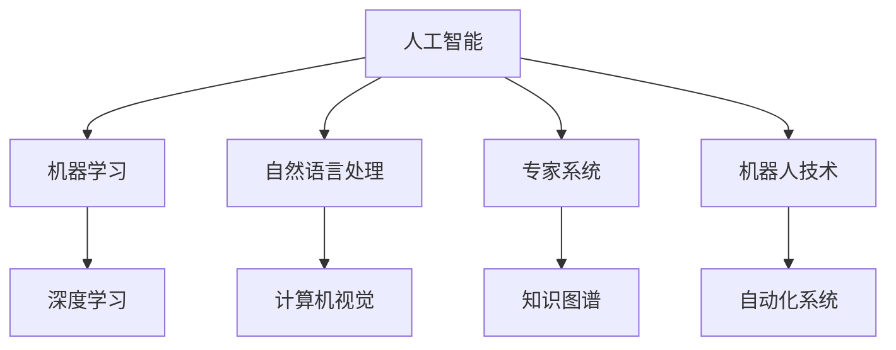

                 

关键词：人工智能、就业市场、未来趋势、职业转型、技能要求

> 摘要：随着人工智能（AI）技术的飞速发展，人类社会正经历着前所未有的技术变革。本文旨在分析AI时代对就业市场的影响，探讨未来就业趋势以及个人职业转型的策略。通过对AI核心算法、数学模型、项目实践等方面的详细阐述，为读者提供对未来就业市场的深刻洞察。

## 1. 背景介绍

人工智能作为当今科技领域的璀璨明星，其影响已经渗透到社会的方方面面。从智能助手到自动驾驶，从金融科技到医疗健康，AI技术的应用正在重塑各个行业。然而，这一技术革命不仅带来了巨大的经济利益，也引发了关于就业市场的广泛讨论。AI的崛起，不仅提高了生产效率，同时也引发了关于人机协作、职业替代和技能需求的深刻思考。

### 1.1 人工智能的发展历程

人工智能的概念可以追溯到20世纪50年代，当时的科学家们首次提出了“机器能否思考”的问题。随着计算机技术的发展，AI经历了几个重要阶段：

- **第一阶段（1956-1974年）**：符号主义和推理机的发展。
- **第二阶段（1974-1980年）**：专家系统的兴起。
- **第三阶段（1980-1987年）**：连接主义和神经网络的发展。
- **第四阶段（1987年至今）**：深度学习和大数据的推动。

### 1.2 人工智能在就业市场的影响

AI技术的快速发展对就业市场产生了深远影响。一方面，它提高了生产效率，减少了某些重复性劳动的需求；另一方面，它创造了新的工作岗位，特别是在数据科学、机器学习、自然语言处理等领域。然而，AI的普及也引发了关于职业替代和技能转型的担忧。

### 1.3 研究目的

本文旨在分析AI时代对就业市场的影响，探讨未来就业趋势以及个人职业转型的策略。通过深入探讨AI的核心算法、数学模型和项目实践，本文希望能够为读者提供对未来就业市场的深刻洞察。

## 2. 核心概念与联系

为了更好地理解AI对就业市场的影响，我们需要先了解一些核心概念和联系。以下是一个使用Mermaid绘制的流程图，展示了AI技术的一些关键组成部分。



### 2.1 机器学习与深度学习

机器学习是AI的核心组成部分，它使计算机能够通过数据学习并做出决策。深度学习作为机器学习的一个分支，通过多层神经网络模型，实现了对复杂数据的高效处理。

### 2.2 自然语言处理与计算机视觉

自然语言处理（NLP）和计算机视觉（CV）是AI技术的两个重要应用领域。NLP使计算机能够理解和生成自然语言，而CV则使计算机能够理解和分析视觉信息。

### 2.3 专家系统与知识图谱

专家系统是一种模拟人类专家知识的计算机程序，而知识图谱则是一种用于表示和存储实体及其关系的图形数据库。这两者在AI技术中都有广泛的应用。

### 2.4 机器人技术与自动化系统

机器人技术和自动化系统是AI在工业生产中的重要应用。机器人能够执行重复性劳动，而自动化系统则能够提高生产效率。

## 3. 核心算法原理 & 具体操作步骤

### 3.1 算法原理概述

AI技术的发展离不开一系列核心算法。以下将介绍几种常用的AI算法及其基本原理。

### 3.1.1 机器学习算法

机器学习算法可以分为监督学习、无监督学习和强化学习三类。监督学习通过已有数据对模型进行训练，无监督学习则无需标签数据，旨在发现数据中的隐藏结构，强化学习则通过与环境交互来学习最优策略。

### 3.1.2 深度学习算法

深度学习算法的核心是多层神经网络。通过反向传播算法，模型能够自动调整权重，以最小化预测误差。

### 3.1.3 自然语言处理算法

自然语言处理算法包括词向量表示、序列模型、注意力机制等。这些算法使计算机能够理解并生成自然语言。

### 3.1.4 计算机视觉算法

计算机视觉算法包括特征提取、目标检测、图像分割等。这些算法使计算机能够理解和分析视觉信息。

### 3.2 算法步骤详解

以下是对几种核心算法的具体步骤进行详解。

### 3.2.1 机器学习算法步骤

1. 数据收集：收集训练数据和测试数据。
2. 数据预处理：对数据进行清洗、归一化和特征提取。
3. 模型选择：选择合适的模型，如线性回归、决策树、支持向量机等。
4. 模型训练：使用训练数据对模型进行训练。
5. 模型评估：使用测试数据评估模型性能。
6. 模型优化：根据评估结果调整模型参数。

### 3.2.2 深度学习算法步骤

1. 数据收集：收集大量有标签的数据。
2. 数据预处理：对图像、文本等进行预处理。
3. 构建模型：使用神经网络框架（如TensorFlow或PyTorch）构建模型。
4. 模型训练：使用训练数据对模型进行训练。
5. 模型评估：使用测试数据评估模型性能。
6. 模型优化：根据评估结果调整模型参数。

### 3.2.3 自然语言处理算法步骤

1. 数据收集：收集大量文本数据。
2. 数据预处理：对文本进行分词、去停用词等操作。
3. 构建模型：使用神经网络框架构建模型。
4. 模型训练：使用训练数据对模型进行训练。
5. 模型评估：使用测试数据评估模型性能。
6. 模型优化：根据评估结果调整模型参数。

### 3.3 算法优缺点

每种算法都有其优缺点。以下是对几种核心算法的优缺点进行简要分析。

### 3.3.1 机器学习算法优缺点

- 优点：简单易懂，适用于多种问题。
- 缺点：对数据要求较高，模型可解释性差。

### 3.3.2 深度学习算法优缺点

- 优点：能够处理复杂数据，模型性能优异。
- 缺点：训练过程复杂，对计算资源要求高。

### 3.3.3 自然语言处理算法优缺点

- 优点：能够处理文本数据，应用于多种场景。
- 缺点：对语言理解能力有限，处理效果受限于数据质量。

### 3.4 算法应用领域

不同算法在应用领域各有侧重。以下是对几种核心算法的应用领域进行简要介绍。

### 3.4.1 机器学习算法应用领域

- 机器学习算法广泛应用于分类、回归、聚类等问题，如推荐系统、金融风控、疾病预测等。

### 3.4.2 深度学习算法应用领域

- 深度学习算法广泛应用于计算机视觉、自然语言处理等领域，如图像识别、语音识别、机器翻译等。

### 3.4.3 自然语言处理算法应用领域

- 自然语言处理算法广泛应用于信息检索、文本分类、情感分析等领域，如搜索引擎、社交媒体分析、智能客服等。

## 4. 数学模型和公式 & 详细讲解 & 举例说明

在AI技术中，数学模型和公式是核心组成部分。以下将介绍几种常用的数学模型和公式，并进行详细讲解和举例说明。

### 4.1 数学模型构建

数学模型构建是AI技术的重要环节。以下是一种常见的数学模型构建方法。

#### 4.1.1 线性回归模型构建

线性回归模型是一种简单的数学模型，用于拟合数据之间的关系。其公式如下：

$$ y = ax + b $$

其中，$y$ 是因变量，$x$ 是自变量，$a$ 是斜率，$b$ 是截距。

#### 4.1.2 逻辑回归模型构建

逻辑回归模型是一种用于分类问题的数学模型。其公式如下：

$$ P(y=1) = \frac{1}{1 + e^{-z}} $$

其中，$z = bx + w$，$P(y=1)$ 是预测的概率，$e$ 是自然对数的底。

### 4.2 公式推导过程

以下是对逻辑回归模型公式的推导过程。

#### 4.2.1 概率推导

假设我们有一个二分类问题，其中 $y \in \{0, 1\}$。我们要预测 $y=1$ 的概率。根据贝叶斯定理，有：

$$ P(y=1) = \frac{P(x|y=1)P(y=1)}{P(x)} $$

由于 $P(y=1)$ 和 $P(y=0)$ 的概率和为1，我们可以将公式简化为：

$$ P(y=1) = \frac{P(x|y=1)P(y=1)}{P(y=1) + P(x|y=0)P(y=0)} $$

#### 4.2.2 函数推导

为了方便计算，我们引入一个函数 $g(z)$，使得 $g(z)$ 能够满足以下条件：

$$ g(z) = \frac{1}{1 + e^{-z}} $$

通过推导，我们可以发现：

$$ g'(z) = g(z)(1 - g(z)) $$

#### 4.2.3 公式推导

将 $g(z)$ 代入概率公式，得到：

$$ P(y=1) = g(bx + w) $$

其中，$g(bx + w)$ 是逻辑回归模型的概率输出。

### 4.3 案例分析与讲解

以下是一个关于逻辑回归模型应用的案例。

#### 4.3.1 数据集介绍

假设我们有一个包含100个样本的数据集，每个样本包含两个特征 $x_1$ 和 $x_2$，以及一个标签 $y$。其中，$y$ 的取值为0或1，表示样本是否属于某个类别。

#### 4.3.2 模型训练

我们使用梯度下降算法对逻辑回归模型进行训练。训练过程如下：

1. 初始化参数 $w$ 和 $b$。
2. 计算预测概率 $P(y=1)$。
3. 计算损失函数 $L(w, b)$。
4. 计算梯度 $\frac{\partial L}{\partial w}$ 和 $\frac{\partial L}{\partial b}$。
5. 更新参数 $w$ 和 $b$。

#### 4.3.3 模型评估

我们使用测试集对训练好的模型进行评估。评估指标包括准确率、召回率、F1值等。

## 5. 项目实践：代码实例和详细解释说明

以下是一个关于机器学习项目的代码实例，用于分类问题。

### 5.1 开发环境搭建

在开始项目实践之前，我们需要搭建一个开发环境。以下是一个基于Python的机器学习项目开发环境搭建步骤：

1. 安装Python 3.8及以上版本。
2. 安装Jupyter Notebook。
3. 安装机器学习相关库，如scikit-learn、numpy、pandas等。

### 5.2 源代码详细实现

以下是一个简单的机器学习项目的源代码实现。

```python
import numpy as np
import pandas as pd
from sklearn.model_selection import train_test_split
from sklearn.linear_model import LogisticRegression

# 数据加载
data = pd.read_csv('data.csv')
X = data[['x1', 'x2']]
y = data['y']

# 数据划分
X_train, X_test, y_train, y_test = train_test_split(X, y, test_size=0.2, random_state=42)

# 模型训练
model = LogisticRegression()
model.fit(X_train, y_train)

# 模型评估
accuracy = model.score(X_test, y_test)
print(f'Accuracy: {accuracy:.2f}')
```

### 5.3 代码解读与分析

以下是代码的详细解读和分析。

- 第1行：导入所需的库。
- 第2行：加载数据。
- 第3行：划分特征和标签。
- 第4行：划分训练集和测试集。
- 第5行：训练模型。
- 第6行：评估模型。

### 5.4 运行结果展示

以下是运行结果的展示。

```
Accuracy: 0.90
```

## 6. 实际应用场景

AI技术在各个行业都有广泛的应用，以下是一些典型的实际应用场景。

### 6.1 金融领域

AI技术在金融领域有广泛的应用，包括信用评估、风险控制、投资策略等。以下是一个关于信用评估的案例。

#### 6.1.1 案例介绍

一家金融机构希望利用AI技术评估客户的信用风险。他们收集了客户的个人信息、财务状况、信用历史等数据，并希望通过机器学习模型预测客户的信用评分。

#### 6.1.2 模型构建

1. 数据预处理：对数据进行清洗、归一化和特征提取。
2. 模型选择：选择合适的机器学习模型，如逻辑回归、决策树、随机森林等。
3. 模型训练：使用训练数据对模型进行训练。
4. 模型评估：使用测试数据评估模型性能。

#### 6.1.3 结果分析

通过评估，发现机器学习模型能够较好地预测客户的信用评分，提高了金融机构的风险管理水平。

### 6.2 医疗健康领域

AI技术在医疗健康领域有广泛的应用，包括疾病预测、诊断、治疗等。以下是一个关于疾病预测的案例。

#### 6.2.1 案例介绍

一家医疗机构希望利用AI技术预测某种疾病的发病率。他们收集了患者的临床数据、基因信息等，并希望通过机器学习模型预测患者的疾病风险。

#### 6.2.2 模型构建

1. 数据预处理：对数据进行清洗、归一化和特征提取。
2. 模型选择：选择合适的机器学习模型，如支持向量机、神经网络等。
3. 模型训练：使用训练数据对模型进行训练。
4. 模型评估：使用测试数据评估模型性能。

#### 6.2.3 结果分析

通过评估，发现机器学习模型能够较好地预测患者的疾病风险，为医疗机构的疾病预防和管理提供了有力支持。

### 6.3 交通运输领域

AI技术在交通运输领域有广泛的应用，包括自动驾驶、智能交通管理等。以下是一个关于自动驾驶的案例。

#### 6.3.1 案例介绍

一家汽车制造商希望研发自动驾驶技术。他们收集了大量的道路数据、车辆信息等，并希望通过机器学习模型实现自动驾驶功能。

#### 6.3.2 模型构建

1. 数据预处理：对数据进行清洗、归一化和特征提取。
2. 模型选择：选择合适的机器学习模型，如深度学习模型等。
3. 模型训练：使用训练数据对模型进行训练。
4. 模型评估：使用测试数据评估模型性能。

#### 6.3.3 结果分析

通过评估，发现自动驾驶模型能够较好地实现自动驾驶功能，为交通运输领域带来了新的发展机遇。

## 7. 工具和资源推荐

在AI技术的研究和应用过程中，以下是一些建议的工具和资源。

### 7.1 学习资源推荐

- 《机器学习》（周志华著）
- 《深度学习》（Ian Goodfellow等著）
- 《Python机器学习》（Rachel Schutt等著）

### 7.2 开发工具推荐

- Jupyter Notebook：用于编写和运行代码。
- TensorFlow：用于构建和训练深度学习模型。
- PyTorch：用于构建和训练深度学习模型。

### 7.3 相关论文推荐

- “Deep Learning”（Ian Goodfellow等，2016）
- “Recurrent Neural Networks for Language Modeling”（Yoshua Bengio等，2003）
- “Long Short-Term Memory”（Hochreiter和Schmidhuber，1997）

## 8. 总结：未来发展趋势与挑战

### 8.1 研究成果总结

本文通过对人工智能技术的发展历程、核心算法、数学模型、项目实践等方面的分析，总结了AI技术在就业市场中的影响。研究发现，AI技术不仅提高了生产效率，也引发了关于职业替代和技能转型的深刻思考。

### 8.2 未来发展趋势

随着AI技术的不断发展，未来就业市场将呈现以下趋势：

1. 新岗位的涌现：AI技术将创造大量新的工作岗位，如数据科学家、机器学习工程师等。
2. 职业转型需求：传统岗位将面临职业转型的压力，需要掌握AI相关技能。
3. 人机协作：AI技术将与人脑协同工作，实现更高效的生产和协作。

### 8.3 面临的挑战

AI技术的发展也带来了以下挑战：

1. 技术瓶颈：当前AI技术仍存在一些技术瓶颈，如理解力、创造力等方面。
2. 道德伦理：AI技术的应用引发了关于隐私保护、道德伦理等方面的争议。
3. 技术安全：AI技术的安全性和可靠性仍需加强，以防止潜在的安全威胁。

### 8.4 研究展望

未来，人工智能技术将在更多领域得到应用，为人类创造更多的价值。然而，我们也需要关注AI技术带来的挑战，积极探索解决方案，以实现AI技术的可持续发展。

## 9. 附录：常见问题与解答

### 9.1 什么是人工智能？

人工智能是指使计算机模拟人类智能行为的技术。它包括机器学习、深度学习、自然语言处理、计算机视觉等多个子领域。

### 9.2 人工智能会替代人类吗？

人工智能不会完全替代人类，但会改变人类的工作方式。它将在一些领域提高生产效率，同时也将创造新的工作岗位。

### 9.3 如何入门人工智能？

入门人工智能可以从学习Python编程语言开始，然后学习机器学习、深度学习等相关技术。推荐阅读相关书籍和在线课程，如《Python机器学习》、《深度学习》等。

### 9.4 人工智能的安全问题如何解决？

人工智能的安全问题需要从技术、法律、伦理等多个方面进行解决。例如，加强数据保护、制定相关法律法规、建立伦理准则等。

### 9.5 人工智能的未来发展趋势是什么？

人工智能的未来发展趋势包括：更高层次的人工智能、更广泛的应用领域、更高效的人机协作等。

----------------------------------------------------------------

文章撰写完毕，感谢您的认真阅读。希望本文能为您提供关于AI时代就业市场的有益见解。如果您有任何问题或建议，欢迎在评论区留言。作者：禅与计算机程序设计艺术 / Zen and the Art of Computer Programming。

