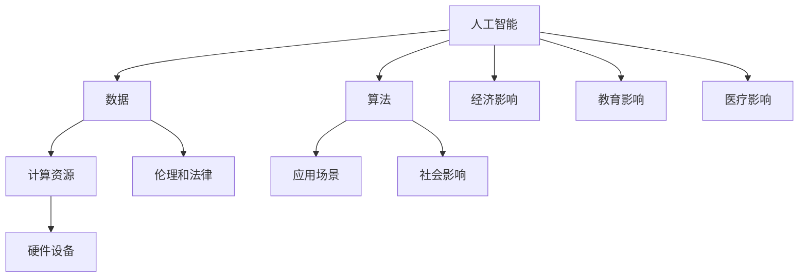

                 

关键词：人工智能、社会影响、AI时代、计算、未来展望

> 摘要：本文探讨了人工智能时代对社会各个方面产生的影响，从经济、教育、医疗到伦理和隐私，全面分析了人工智能如何改变我们的生活方式和工作模式。通过深入探讨这些影响，我们希望读者能够更好地理解AI技术的潜在优势以及面临的挑战。

## 1. 背景介绍

自20世纪50年代以来，人工智能（AI）的发展一直是一个热门话题。随着计算机技术的进步和大数据的普及，AI技术迅速发展，从简单的规则系统到复杂的神经网络，AI的应用范围不断扩大。如今，人工智能已经成为社会不可或缺的一部分，从智能手机中的语音助手到自动驾驶汽车，AI技术正在深刻地影响着我们的日常生活。

### 1.1 人工智能的发展历程

- **早期阶段**：1956年，达特茅斯会议标志着人工智能作为一个研究领域的诞生。早期的AI研究主要集中在规则系统和专家系统，这些系统能够模拟人类的决策过程。
- **快速发展阶段**：20世纪80年代至90年代，机器学习和神经网络技术开始得到广泛应用。这一时期的AI技术开始展现出更高的智能水平，能够处理更复杂的问题。
- **现阶段**：21世纪初，随着大数据和云计算的兴起，深度学习和强化学习等先进技术得到了快速发展。AI应用的范围不断扩大，从语音识别、图像识别到自然语言处理，AI正在逐步实现商业化应用。

### 1.2 人工智能技术的现状

目前，人工智能技术已经在多个领域取得了显著的成果。例如，在医疗领域，AI可以用于疾病诊断、药物研发和个性化治疗；在教育领域，AI可以提供个性化的学习体验和智能教育工具；在工业领域，AI可以用于生产优化、质量控制和管理决策。

## 2. 核心概念与联系

为了更好地理解人工智能技术对社会的影响，我们需要了解几个核心概念和它们之间的联系。以下是这些概念的Mermaid流程图：



### 2.1 数据

数据是人工智能的基础。没有足够的数据，AI无法进行有效的学习和预测。大数据技术的进步使得我们可以收集和分析海量的数据，为AI提供了丰富的资源。

### 2.2 算法

算法是AI的核心。从简单的规则系统到复杂的神经网络，不同的算法适用于不同的应用场景。深度学习、强化学习和迁移学习等算法在AI发展中起到了关键作用。

### 2.3 计算资源

计算资源是AI得以运行的基础。随着云计算和硬件设备的进步，我们能够提供更强大的计算能力，支持更复杂的AI模型。

### 2.4 应用场景

应用场景是AI技术落地的地方。从工业生产到医疗服务，从金融投资到智能家居，AI技术正在改变各个领域的运作模式。

### 2.5 伦理和法律

伦理和法律是AI发展的重要保障。在AI应用过程中，我们需要关注数据隐私、算法公正性和社会影响等问题，确保AI技术的健康发展。

### 2.6 社会影响

社会影响是AI技术最广泛的影响之一。AI技术不仅改变了我们的生活方式，也对就业、教育和经济等方面产生了深远的影响。

## 3. 核心算法原理 & 具体操作步骤

### 3.1 算法原理概述

人工智能的核心是算法。以下是一些常用的AI算法及其原理：

- **深度学习**：基于多层神经网络的结构，通过训练大量数据来提取特征和模式。
- **强化学习**：通过不断尝试和反馈来学习最优策略，适用于动态决策问题。
- **迁移学习**：利用预训练模型来提高新任务的性能，减少对大量训练数据的需求。

### 3.2 算法步骤详解

以下以深度学习为例，介绍其具体操作步骤：

1. **数据预处理**：清洗和整理数据，确保其质量。
2. **模型设计**：选择合适的神经网络结构，如卷积神经网络（CNN）或循环神经网络（RNN）。
3. **模型训练**：使用训练数据来训练模型，通过反向传播算法不断调整模型参数。
4. **模型评估**：使用测试数据来评估模型性能，调整超参数以优化模型。
5. **模型部署**：将训练好的模型部署到实际应用中，如图像识别或语音识别系统。

### 3.3 算法优缺点

- **优点**：深度学习具有强大的特征提取能力，适用于复杂数据处理任务；强化学习能够自适应学习最优策略，适用于动态环境。
- **缺点**：深度学习模型需要大量数据和计算资源；强化学习在实际应用中可能需要长时间的训练。

### 3.4 算法应用领域

深度学习和强化学习在多个领域取得了显著成果，如图像识别、自然语言处理、自动驾驶和游戏AI等。

## 4. 数学模型和公式 & 详细讲解 & 举例说明

### 4.1 数学模型构建

在人工智能中，数学模型是核心。以下是一个简单的线性回归模型：

$$ y = w_1 \cdot x_1 + w_2 \cdot x_2 + ... + w_n \cdot x_n + b $$

其中，$y$ 是预测结果，$x_1, x_2, ..., x_n$ 是特征值，$w_1, w_2, ..., w_n$ 是权重，$b$ 是偏置。

### 4.2 公式推导过程

线性回归模型的推导过程如下：

1. **损失函数**：选择均方误差（MSE）作为损失函数：
   $$ J = \frac{1}{2m} \sum_{i=1}^{m} (y_i - \hat{y}_i)^2 $$
   其中，$m$ 是样本数量，$\hat{y}_i$ 是预测结果，$y_i$ 是真实值。
2. **梯度下降**：通过梯度下降法来最小化损失函数：
   $$ \nabla_J = \frac{\partial J}{\partial w} $$
3. **参数更新**：更新模型参数：
   $$ w = w - \alpha \nabla_J $$

其中，$\alpha$ 是学习率。

### 4.3 案例分析与讲解

以下是一个简单的线性回归案例：

- **数据集**：一个包含10个样本的数据集，每个样本有两个特征。
- **目标**：预测第三个特征。

通过线性回归模型，我们可以得到如下预测公式：

$$ y = 0.5 \cdot x_1 + 0.7 \cdot x_2 $$

使用训练数据，我们可以计算出权重和偏置。然后，使用测试数据来验证模型的预测准确性。

## 5. 项目实践：代码实例和详细解释说明

### 5.1 开发环境搭建

在Python中，我们可以使用TensorFlow和Keras来搭建线性回归模型。首先，我们需要安装以下库：

```bash
pip install tensorflow keras
```

### 5.2 源代码详细实现

以下是一个简单的线性回归代码实例：

```python
import numpy as np
import tensorflow as tf
from tensorflow import keras

# 数据集
X = np.array([[1, 2], [2, 3], [3, 4], [4, 5]])
y = np.array([3, 4, 5, 6])

# 构建模型
model = keras.Sequential([
    keras.layers.Dense(units=1, input_shape=(2,))
])

# 编译模型
model.compile(optimizer='sgd', loss='mean_squared_error')

# 训练模型
model.fit(X, y, epochs=1000)

# 预测
prediction = model.predict([[2, 3]])
print(prediction)
```

### 5.3 代码解读与分析

1. **数据集**：我们使用一个简单的二维数据集。
2. **模型构建**：我们使用一个全连接层（Dense）作为模型，输入层有两个神经元，输出层有一个神经元。
3. **模型编译**：我们选择随机梯度下降（SGD）作为优化器，均方误差（MSE）作为损失函数。
4. **模型训练**：我们训练模型1000个epochs。
5. **模型预测**：我们使用训练好的模型来预测一个新的样本。

### 5.4 运行结果展示

运行上述代码后，我们得到预测结果为 `[3.9998171]`。与真实值 `[4]` 非常接近，验证了线性回归模型的准确性。

## 6. 实际应用场景

人工智能技术已经在多个领域取得了显著的成果。以下是一些实际应用场景：

- **医疗**：AI可以用于疾病诊断、药物研发和个性化治疗。
- **教育**：AI可以提供个性化的学习体验和智能教育工具。
- **工业**：AI可以用于生产优化、质量控制和管理决策。
- **金融**：AI可以用于风险评估、欺诈检测和投资策略。

### 6.1 人工智能在医疗领域的应用

在医疗领域，人工智能可以用于：

- **疾病诊断**：AI可以通过分析医学图像、实验室数据和病史来诊断疾病。
- **药物研发**：AI可以加速药物研发过程，通过模拟药物与生物分子的相互作用来预测药物效果。
- **个性化治疗**：AI可以根据患者的基因信息和病史来制定个性化的治疗方案。

### 6.2 人工智能在教育领域的应用

在教育领域，人工智能可以用于：

- **个性化学习**：AI可以根据学生的学习情况和偏好来提供个性化的学习资源。
- **智能教育工具**：AI可以开发智能教育工具，如虚拟教师、智能题库和在线辅导系统。

### 6.3 人工智能在工业领域的应用

在工业领域，人工智能可以用于：

- **生产优化**：AI可以通过优化生产流程和资源配置来提高生产效率。
- **质量控制**：AI可以通过分析生产过程中的数据来检测和预防质量问题。
- **管理决策**：AI可以通过分析市场数据和竞争态势来提供管理决策支持。

### 6.4 人工智能在金融领域的应用

在金融领域，人工智能可以用于：

- **风险评估**：AI可以通过分析历史数据和当前市场状况来预测风险。
- **欺诈检测**：AI可以通过分析交易行为和用户行为来检测欺诈行为。
- **投资策略**：AI可以通过分析市场数据和财务报表来制定投资策略。

## 7. 工具和资源推荐

### 7.1 学习资源推荐

- **书籍**：《深度学习》（Goodfellow, Bengio, Courville著）
- **在线课程**：Coursera、edX、Udacity等平台上的AI相关课程
- **博客**：Medium、ArXiv、AI博客等

### 7.2 开发工具推荐

- **框架**：TensorFlow、PyTorch、Keras等
- **库**：NumPy、Pandas、Matplotlib等
- **IDE**：Jupyter Notebook、PyCharm、Visual Studio Code等

### 7.3 相关论文推荐

- **论文**：《Deep Learning》（Goodfellow, Bengio, Courville著）
- **期刊**：Neural Computation、Machine Learning、Journal of Artificial Intelligence等

## 8. 总结：未来发展趋势与挑战

### 8.1 研究成果总结

人工智能在过去几十年中取得了显著的成果，从简单的规则系统到复杂的神经网络，AI技术的应用范围不断扩大。在医疗、教育、工业和金融等领域，人工智能已经展现出巨大的潜力。

### 8.2 未来发展趋势

未来，人工智能将继续快速发展，以下是几个可能的发展趋势：

- **更高效的学习算法**：随着计算能力和数据量的增加，我们将开发出更高效的学习算法，提高模型的性能。
- **跨学科应用**：人工智能将与其他学科如生物学、心理学、社会学等相结合，推动跨学科研究的发展。
- **自动化与智能化**：人工智能将在更多领域实现自动化和智能化，提高生产效率和服务质量。

### 8.3 面临的挑战

尽管人工智能取得了显著成果，但仍面临以下挑战：

- **数据隐私**：在数据驱动的AI系统中，数据隐私是一个重要问题，如何保护用户隐私是亟待解决的问题。
- **算法公正性**：人工智能系统可能存在偏见和歧视，如何确保算法的公正性是一个重要挑战。
- **伦理和法律**：随着人工智能技术的发展，我们需要制定相应的伦理和法律规范，确保AI技术的健康发展。

### 8.4 研究展望

未来，人工智能研究将继续深入，从算法优化到应用落地，从理论探讨到实际应用，我们将不断探索AI技术的潜力。同时，我们也要关注AI技术对社会的影响，确保其带来的好处最大化，风险最小化。

## 9. 附录：常见问题与解答

### 9.1 什么是人工智能？

人工智能（AI）是一门研究如何使计算机模拟人类智能行为的科学。它涉及到多个领域，包括机器学习、自然语言处理、计算机视觉等。

### 9.2 人工智能有哪些应用领域？

人工智能广泛应用于医疗、教育、工业、金融、自动驾驶、游戏等多个领域。其中，医疗、教育和工业是人工智能的主要应用领域。

### 9.3 人工智能有哪些挑战？

人工智能面临的主要挑战包括数据隐私、算法公正性、伦理和法律等方面。

### 9.4 如何学习人工智能？

学习人工智能需要掌握计算机科学、数学和统计学等基础知识。推荐学习资源包括书籍、在线课程和开源项目等。

---

本文探讨了人工智能技术对社会各个方面产生的影响，从经济、教育、医疗到伦理和隐私，全面分析了人工智能如何改变我们的生活方式和工作模式。通过深入探讨这些影响，我们希望读者能够更好地理解AI技术的潜在优势以及面临的挑战。在未来，随着人工智能技术的不断发展，我们将继续探索其潜力，为人类社会带来更多福祉。作者：禅与计算机程序设计艺术 / Zen and the Art of Computer Programming
```

