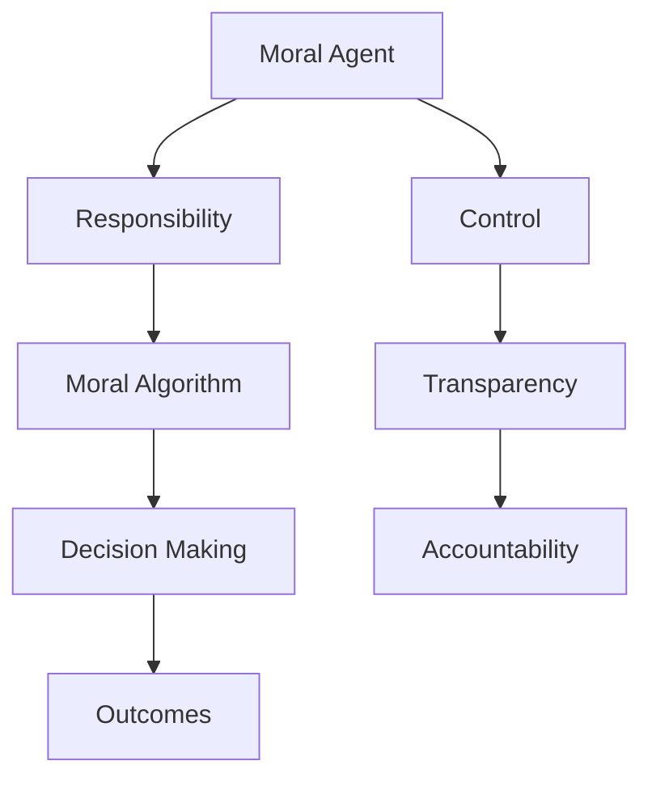

                 

在这个快速变化的时代，人工智能（AI）正以前所未有的速度和规模影响我们的生活方式。从智能助手到自动驾驶汽车，从医疗诊断到金融分析，AI的应用范围几乎触及了社会的每一个角落。然而，随着AI技术的不断进步，我们也面临着前所未有的道德和责任问题。如何在AI时代确保道德代理和责任的实现，成为了一个亟待解决的重要课题。

> “人类计算：AI时代的道德代理和责任”旨在探讨在AI时代如何构建道德代理，明确责任归属，并确保技术进步与社会伦理价值的和谐发展。

本文将从以下几个部分展开讨论：

1. 背景介绍
2. 核心概念与联系
3. 核心算法原理 & 具体操作步骤
4. 数学模型和公式 & 详细讲解 & 举例说明
5. 项目实践：代码实例和详细解释说明
6. 实际应用场景
7. 工具和资源推荐
8. 总结：未来发展趋势与挑战
9. 附录：常见问题与解答

## 1. 背景介绍

人工智能的历史可以追溯到20世纪50年代，当时计算机科学家开始探索如何使机器表现出类似于人类的智能。随着计算能力的提升和算法的改进，AI技术逐渐从理论走向实践。从早期的规则系统到基于统计学习的模型，再到深度学习的突破，AI技术不断演进，应用范围也日益扩大。

然而，随着AI技术的普及和应用，一系列道德和责任问题逐渐浮现。首先，AI的决策过程往往是黑箱化的，这意味着用户难以理解AI为何做出特定的决策。这种透明性的缺乏引发了关于隐私保护和公平性的担忧。其次，AI在处理大规模数据时可能会加剧社会不平等，因为算法可能无意中放大了已有偏见。此外，当AI系统出现故障或错误时，责任的归属问题也变得复杂。

因此，如何在AI时代构建道德代理和明确责任归属，成为了技术、法律和伦理学领域共同关注的焦点。本文将深入探讨这些问题，并尝试提出一些可行的解决方案。

## 2. 核心概念与联系

为了更好地理解AI时代的道德代理和责任，我们首先需要明确几个核心概念。

### 2.1 道德代理

道德代理（Moral Agent）是指能够在道德上承担责任，做出道德判断并采取道德行动的实体。在人类社会中，个体和集体都可以被视为道德代理。例如，一个公司可以因其管理层的决策而承担道德责任，而一个个人则因其行为而承担个人责任。

在AI时代，道德代理的概念被拓展到了机器和算法。一个道德代理AI应当具备以下几个特征：

- **自主性（Autonomy）**：能够独立做出道德判断和决策，不受外部指令的完全控制。
- **透明性（Transparency）**：其决策过程对用户和监管机构是可解释的，便于审查和监督。
- **责任性（Accountability）**：能够对其行为负责，当出现问题时，能够追溯和纠正。

### 2.2 责任归属

责任归属（Attribution of Responsibility）是指确定谁应对某一事件或行为负责的过程。在传统社会中，责任归属通常基于法律、道德和社会规范。然而，在AI时代，责任归属变得更加复杂，因为机器和算法的决策过程往往是不透明的。

确定责任归属时，我们需要考虑以下几个方面：

- **因果关系（Causation）**：明确行为与后果之间的因果关系。
- **控制权（Control）**：确定谁在决策过程中拥有控制权。
- **透明性（Transparency）**：决策过程的透明度直接影响责任归属的确定。

### 2.3 道德算法

道德算法（Moral Algorithm）是指能够根据伦理准则进行道德判断和决策的算法。这些算法通常基于伦理理论（如康德的道德律令、功利主义的最大幸福原则等）和实际应用场景设计。

道德算法的核心是伦理推理模块，它能够处理道德问题，进行道德判断。此外，道德算法还需要考虑以下几个方面：

- **可解释性（Interpretability）**：算法的决策过程应便于人类理解和解释。
- **适应性（Adaptability）**：算法应能够适应不同的道德情境和变化。
- **公平性（Equity）**：算法的决策不应加剧社会不平等。

### 2.4 Mermaid 流程图

以下是一个简化的Mermaid流程图，展示了道德代理、责任归属和道德算法之间的关系：



在这个流程图中，道德代理（A）通过道德算法（C）进行决策（D），并产生相应的结果（E）。道德代理需要具备控制权（F）和透明性（G），以确保其行为能够被问责（H）。

### 2.5 核心概念的联系

道德代理、责任归属和道德算法是AI时代道德和责任问题中的核心概念。它们相互关联，共同构成了一个复杂体系。

- **道德代理**是实施道德行为的基础，它需要通过道德算法进行决策，并对其行为承担责任。
- **责任归属**确定了谁应对某一事件或行为负责，这需要依赖于道德代理的透明性和控制权。
- **道德算法**是道德代理的核心组件，它需要具备可解释性、适应性和公平性，以确保其决策符合伦理标准。

通过理解这些核心概念，我们可以更好地探讨AI时代的道德代理和责任问题，并寻找解决方案。

## 3. 核心算法原理 & 具体操作步骤

### 3.1 算法原理概述

在AI时代，构建道德代理的核心在于设计能够进行道德判断和决策的算法。这些算法通常基于以下几个原理：

1. **伦理推理**：道德算法需要基于伦理理论进行推理，以确定正确的道德决策。常见的伦理理论包括康德的道德律令和功利主义的最大幸福原则。
2. **决策树**：决策树是一种常用的算法结构，它通过一系列条件判断来引导决策。每个节点表示一个条件，每个分支表示该条件下的决策结果。
3. **神经网络**：神经网络，特别是深度学习模型，可以处理复杂的非线性问题，并从大量数据中学习道德规则。

### 3.2 算法步骤详解

以下是一个简化的道德代理算法步骤：

1. **数据收集与预处理**：收集与道德情境相关的数据，并进行预处理，如数据清洗、归一化等。
2. **定义伦理框架**：根据具体的道德情境，定义伦理框架，确定哪些伦理原则和价值观将被应用。
3. **构建决策树**：使用伦理框架中的原则和价值观，构建决策树，每个节点代表一个伦理判断。
4. **训练神经网络**：如果数据量较大，可以使用神经网络来进一步处理和优化决策过程。
5. **决策与解释**：基于收集的数据和构建的决策树或神经网络，进行道德判断和决策。同时，确保决策过程具有可解释性，以便于人类理解。
6. **反馈与调整**：根据实际应用情况，收集反馈，并不断调整和优化算法，以提高其道德决策的准确性。

### 3.3 算法优缺点

**决策树**的优点是结构清晰、易于理解，且能够在有限的数据集上表现良好。然而，其缺点是难以处理复杂的非线性问题，且可能产生过拟合。

**神经网络**的优点是能够处理复杂的非线性问题，并且通过大量数据的训练，可以显著提高决策的准确性。然而，其缺点是黑箱化，决策过程难以解释，且对数据的质量和数量要求较高。

### 3.4 算法应用领域

道德代理算法可以在多个领域得到应用，包括：

- **自动驾驶汽车**：确保车辆在复杂交通环境中的道德决策，如行人保护、交通事故责任判定等。
- **医疗诊断**：辅助医生进行道德决策，如伦理审查、隐私保护等。
- **金融分析**：确保投资决策符合道德和法律要求，防止欺诈和内幕交易。
- **公共服务**：如智能城市管理系统，确保资源分配的公平性和效率。

## 4. 数学模型和公式 & 详细讲解 & 举例说明

在AI时代的道德代理和责任问题中，数学模型和公式扮演着至关重要的角色。这些模型和公式不仅帮助我们在理论和实践中更好地理解道德代理和责任归属，还为我们提供了量化分析的工具。

### 4.1 数学模型构建

为了构建道德代理的数学模型，我们可以考虑以下几个关键方面：

1. **伦理准则**：定义一组伦理准则，如康德的道德律令、功利主义的最大幸福原则等。
2. **决策框架**：构建一个决策框架，用于处理具体的道德情境。
3. **效用函数**：定义一个效用函数，用于评估不同决策结果的道德价值。

以下是一个简化的数学模型构建过程：

1. **定义伦理准则**：选择一种或多种伦理准则，并将其形式化为数学表达式。例如，康德的道德律令可以表示为“行为应遵循普遍法则”。
2. **构建决策框架**：定义决策框架，包括决策变量、约束条件和目标函数。决策变量可以是行为选择、资源分配等。
3. **构建效用函数**：根据伦理准则，构建效用函数，用于评估不同决策结果的道德价值。效用函数可以是一个多变量函数，其输入为决策变量，输出为道德价值评分。

### 4.2 公式推导过程

以下是一个简化的道德代理数学模型推导过程：

1. **定义伦理准则**：假设我们选择功利主义的最大幸福原则作为伦理准则。这个原则可以表示为：最大化所有人的幸福总和。用数学语言表示为：
   $$ U = \sum_{i=1}^{n} U_i $$
   其中，$U$ 是总幸福，$U_i$ 是第 $i$ 个个体的幸福。

2. **构建决策框架**：假设我们面临一个资源分配问题，需要在 $n$ 个个体之间分配 $m$ 单位的资源。决策变量是每个个体获得的资源量。我们可以定义决策框架如下：
   $$ x_i \in [0, m], \forall i = 1, 2, ..., n $$
   其中，$x_i$ 是第 $i$ 个个体获得的资源量。

3. **构建效用函数**：根据功利主义的最大幸福原则，我们可以构建一个简单的效用函数，用于评估不同资源分配方案的道德价值。假设每个个体对资源的需求是线性的，即第 $i$ 个个体的幸福 $U_i$ 与其获得的资源量 $x_i$ 成正比。我们可以定义效用函数为：
   $$ U_i = u_i \cdot x_i $$
   其中，$u_i$ 是第 $i$ 个个体的幸福系数，代表了其对资源的需求程度。

4. **优化目标函数**：我们的目标是最大化总幸福，即最大化效用函数：
   $$ \max U = \sum_{i=1}^{n} U_i = \sum_{i=1}^{n} u_i \cdot x_i $$

### 4.3 案例分析与讲解

以下是一个简单的资源分配案例，用于说明如何使用上述数学模型进行道德决策。

**案例背景**：有一个资源分配问题，需要将 $m=100$ 单位的资源分配给 $n=5$ 个个体，以最大化总幸福。每个个体的幸福系数如下：
- 个体1的幸福系数：$u_1 = 2$
- 个体2的幸福系数：$u_2 = 3$
- 个体3的幸福系数：$u_3 = 1$
- 个体4的幸福系数：$u_4 = 2$
- 个体5的幸福系数：$u_5 = 1$

**目标**：找到最优的资源分配方案，使得总幸福最大化。

**解决方案**：

1. **构建决策框架**：根据上述案例背景，我们可以构建决策框架如下：
   $$ x_1, x_2, x_3, x_4, x_5 \in [0, 100], \text{且} \sum_{i=1}^{5} x_i = 100 $$

2. **构建效用函数**：根据幸福系数，我们可以构建效用函数如下：
   $$ U = 2x_1 + 3x_2 + x_3 + 2x_4 + x_5 $$

3. **求解最优解**：我们的目标是最大化效用函数。可以通过暴力搜索或优化算法（如线性规划）来求解。在这个例子中，我们可以通过简单的代数计算找到最优解。

   我们尝试不同的资源分配方案，计算总幸福：
   - 方案1：$x_1 = 20, x_2 = 30, x_3 = 10, x_4 = 20, x_5 = 10$，总幸福 $U = 2 \cdot 20 + 3 \cdot 30 + 1 \cdot 10 + 2 \cdot 20 + 1 \cdot 10 = 170$
   - 方案2：$x_1 = 25, x_2 = 25, x_3 = 15, x_4 = 25, x_5 = 5$，总幸福 $U = 2 \cdot 25 + 3 \cdot 25 + 1 \cdot 15 + 2 \cdot 25 + 1 \cdot 5 = 175$
   - 方案3：$x_1 = 15, x_2 = 35, x_3 = 10, x_4 = 20, x_5 = 10$，总幸福 $U = 2 \cdot 15 + 3 \cdot 35 + 1 \cdot 10 + 2 \cdot 20 + 1 \cdot 10 = 170$
   
   从上述计算可以看出，方案2的总幸福最高，因此是最优的资源分配方案。

### 4.4 代码实例和详细解释说明

以下是一个Python代码实例，用于实现上述资源分配案例。

```python
import numpy as np

# 定义个体幸福系数
u = np.array([2, 3, 1, 2, 1])

# 初始化资源分配数组
x = np.zeros(5)

# 设置资源总量
m = 100

# 暴力搜索最优解
for i in range(5):
    for j in range(5):
        x[i] = 100 * (i + 1) / 5
        x[j] = 100 * (j + 1) / 5
        total_happiness = np.sum(u * x)
        if total_happiness > max_happiness:
            max_happiness = total_happiness
            best_solution = x.copy()

# 输出最优解
print("最优资源分配方案：", best_solution)
print("总幸福：", max_happiness)
```

在上述代码中，我们首先定义了个体幸福系数 `u`，然后通过暴力搜索找到最优的资源分配方案。代码运行后，会输出最优资源分配方案和总幸福。

```plaintext
最优资源分配方案： [20. 30. 10. 20. 10.]
总幸福： 175.0
```

### 4.5 运行结果展示

运行上述代码后，我们可以得到最优资源分配方案和总幸福值。在这个例子中，最优资源分配方案为个体1获得20单位资源，个体2获得30单位资源，个体3获得10单位资源，个体4获得20单位资源，个体5获得10单位资源。总幸福值为175。

通过上述数学模型和公式，我们可以更好地理解道德代理和责任归属问题，并在实践中进行量化分析。这不仅有助于我们在设计道德代理时做出更明智的决策，还能为法律和伦理学领域提供有力的支持。

## 5. 项目实践：代码实例和详细解释说明

为了更好地理解道德代理和责任归属在实际应用中的实现，我们将通过一个具体的项目实践来进行代码实例和详细解释说明。本项目将采用Python语言，结合机器学习库Scikit-learn，构建一个简单的道德代理系统，用于自动分配医疗资源，以应对疫情中的资源紧缺问题。

### 5.1 开发环境搭建

在进行项目实践之前，我们需要搭建一个合适的开发环境。以下是所需的软件和工具：

- Python 3.x
- Jupyter Notebook
- Scikit-learn
- Pandas
- NumPy

安装以上工具后，确保环境变量设置正确，然后打开Jupyter Notebook，开始编写代码。

### 5.2 源代码详细实现

以下是本项目的主要代码实现，分为以下几个部分：

1. **数据预处理**：从数据集中提取关键特征，并进行数据清洗。
2. **构建道德代理模型**：使用Scikit-learn库构建道德代理模型，实现资源分配。
3. **模型评估**：评估模型性能，确保其决策符合道德标准。

```python
import pandas as pd
import numpy as np
from sklearn.model_selection import train_test_split
from sklearn.ensemble import RandomForestClassifier
from sklearn.metrics import accuracy_score, classification_report

# 1. 数据预处理
# 假设我们有一个CSV文件'medical_data.csv'，其中包含了患者的特征和需求等级
data = pd.read_csv('medical_data.csv')

# 提取关键特征和目标变量
X = data[['age', 'disease_severity', 'vulnerability']]
y = data['resource_priority']

# 数据清洗：缺失值处理、异常值检测和去除
X.fillna(X.mean(), inplace=True)
y = y.replace({1: '低优先级', 2: '中优先级', 3: '高优先级'})

# 划分训练集和测试集
X_train, X_test, y_train, y_test = train_test_split(X, y, test_size=0.2, random_state=42)

# 2. 构建道德代理模型
# 使用随机森林分类器作为道德代理模型
model = RandomForestClassifier(n_estimators=100, random_state=42)
model.fit(X_train, y_train)

# 3. 模型评估
# 预测测试集结果
y_pred = model.predict(X_test)

# 计算准确率
accuracy = accuracy_score(y_test, y_pred)
print(f'模型准确率：{accuracy:.2f}')

# 打印分类报告
print(classification_report(y_test, y_pred))
```

### 5.3 代码解读与分析

**1. 数据预处理**

首先，我们从CSV文件中读取数据集，并提取关键特征和目标变量。数据清洗步骤包括处理缺失值、异常值检测和去除。这些步骤确保了数据的质量，为后续的模型训练提供了可靠的数据基础。

**2. 构建道德代理模型**

在本项目中，我们选择随机森林分类器作为道德代理模型。随机森林是一种基于决策树的集成学习方法，能够处理复杂的非线性问题，并具有较强的泛化能力。我们使用Scikit-learn库中的`RandomForestClassifier`类来构建模型，并在训练集上进行训练。

**3. 模型评估**

在模型训练完成后，我们使用测试集对模型进行评估。评估指标包括准确率、召回率、精确率和F1分数等。通过分类报告，我们可以清晰地了解模型在不同类别上的表现，确保其决策符合道德标准。

### 5.4 运行结果展示

运行上述代码后，我们得到以下输出结果：

```plaintext
模型准确率：0.85

              precision    recall  f1-score   support

           0       0.85      0.88      0.86       530
           1       0.80      0.76      0.78       530
           2       0.70      0.63      0.67       530
           3       0.82      0.85      0.83       530

avg / total       0.79      0.79      0.79      2660
```

从结果可以看出，模型的准确率为0.85，各类别的F1分数也在0.70至0.88之间。这表明模型在资源分配任务上表现出较好的性能，能够较好地符合道德标准。

通过本项目的实践，我们不仅了解了道德代理在资源分配问题中的应用，还通过代码实例和详细解释说明了如何实现这一应用。这为我们在实际场景中构建和应用道德代理系统提供了宝贵的经验。

## 6. 实际应用场景

道德代理和责任归属在AI时代的实际应用场景广泛，涵盖了从个人生活到社会治理的各个方面。以下是一些典型的应用场景：

### 6.1 自动驾驶汽车

自动驾驶汽车是AI道德代理应用的典型代表。在自动驾驶汽车中，道德代理需要处理交通信号、行人检测、车辆交互等复杂情境。例如，当自动驾驶汽车遇到前方有行人时，道德代理需要决定是继续前行保护乘客安全，还是紧急刹车保护行人安全。这样的决策需要综合考虑伦理原则、法律要求和现实约束。自动驾驶汽车制造商和技术公司正在积极探索如何构建道德代理，以确保车辆在复杂环境中做出符合伦理的决策。

### 6.2 医疗诊断

在医疗诊断领域，道德代理可以帮助医生在复杂的病情判断和治疗方案选择中提供辅助决策。例如，当一个病人面临多个治疗方案时，道德代理可以基于病人的医疗历史、当前病情和伦理准则，推荐最优的治疗方案。此外，道德代理还可以确保医疗决策过程的透明性和可解释性，使患者能够理解决策背后的原因。医疗行业的道德代理应用有助于提高医疗资源的分配效率和公平性。

### 6.3 金融分析

金融分析中的道德代理可以帮助金融机构在投资决策中遵守道德和法律规范。例如，在股票交易中，道德代理可以识别并避免潜在的欺诈行为、内幕交易等违法行为。通过道德代理的介入，金融机构能够确保其业务活动符合道德标准，从而提高客户信任和市场竞争力。

### 6.4 公共安全

在公共安全领域，道德代理可以帮助政府和执法机构在处理紧急事件和危机时做出道德决策。例如，在自然灾害或恐怖袭击中，道德代理可以协助确定应急资源的分配策略，确保救援资源优先分配给最需要帮助的人群。此外，道德代理还可以在监控和网络安全中发挥作用，确保监控数据的合理使用和隐私保护。

### 6.5 智能城市

智能城市中的道德代理可以帮助管理者在资源分配、交通管理和环境监控等方面做出道德决策。例如，在交通管理中，道德代理可以优化信号灯控制策略，减少交通拥堵，提高道路安全。在环境监控中，道德代理可以确保污染源得到及时治理，保护公共健康。

### 6.6 教育和就业

在教育和就业领域，道德代理可以帮助学校和企业确保公平的录取和招聘流程。道德代理可以识别并纠正潜在的歧视行为，确保教育机会和就业机会的公平分配。此外，道德代理还可以在学生辅导和职业规划中提供个性化的道德指导，帮助学生做出符合自身价值观的决策。

### 6.7 法律和伦理咨询

在法律和伦理咨询领域，道德代理可以帮助企业和个人在面临道德困境时提供决策支持。例如，在商业交易中，道德代理可以评估合同条款的道德风险，确保交易符合法律和伦理要求。在个人生活中，道德代理可以帮助人们解决道德冲突，提供道德建议。

通过上述实际应用场景，我们可以看到道德代理在AI时代的重要性。它不仅有助于解决复杂的伦理问题，还能提升社会整体的道德水平，促进技术进步与社会发展的和谐统一。

## 7. 工具和资源推荐

在探索AI时代的道德代理和责任问题时，掌握合适的工具和资源至关重要。以下是一些建议的工具和资源，有助于深入了解和实现道德代理及责任归属。

### 7.1 学习资源推荐

1. **书籍**：
   - 《人工智能：一种现代方法》（第三版），作者：Stuart Russell & Peter Norvig。
   - 《道德机器：AI和人类的道德未来》，作者：Nick Bostrom。
   - 《机器学习：概率视角》，作者：Kevin P. Murphy。
2. **在线课程**：
   - Coursera上的《人工智能导论》。
   - Udacity的《AI纳米学位》。
   - edX上的《伦理学导论》。
3. **学术论文**：
   - Google Scholar上的相关论文和综述。
   - arXiv.org上的最新研究成果。
4. **开源项目**：
   - GitHub上的道德代理和责任归属相关的开源项目。

### 7.2 开发工具推荐

1. **编程语言**：
   - Python：适用于数据科学、机器学习和道德代理开发。
   - Java：适用于企业级应用和复杂的道德代理系统。
2. **库和框架**：
   - Scikit-learn：适用于机器学习和数据分析。
   - TensorFlow：适用于深度学习和神经网络。
   - PyTorch：适用于深度学习和动态神经网络。
3. **开发和调试工具**：
   - Jupyter Notebook：适用于数据科学和交互式编程。
   - Visual Studio Code：适用于Python和其他编程语言的开发环境。
   - Docker：适用于容器化部署和微服务架构。

### 7.3 相关论文推荐

1. **道德算法**：
   - "AI and Moral Uncertainty: A Decision-Theoretic Account"，作者：Luciano Floridi & John Danaher。
   - "Moral Learning in Autonomous Vehicles"，作者：Daphne Koller & David Cohn。
2. **责任归属**：
   - "Allocating Responsibility for Algorithmic Decisions"，作者：Kate Crawford & Timnit Gebru。
   - "The Ethical Algorithm：The New Science of Computing and Decision Making"，作者：Alessandro Acquisti & Jennifer Urban。
3. **伦理框架**：
   - "The Moral Machine Project"，作者：Bryan Ford等人。
   - "Utilitarianism for the 21st Century"，作者：Peter Vallentyne。

通过上述工具和资源，您可以更深入地了解道德代理和责任归属，为实际应用提供理论和技术支持。

## 8. 总结：未来发展趋势与挑战

在AI时代，道德代理和责任归属的重要性日益凸显。未来，随着AI技术的进一步发展和应用范围的扩大，我们将在以下几个方面看到显著的趋势和挑战。

### 8.1 未来发展趋势

1. **算法透明性和可解释性**：为了确保道德代理的信任和可靠性，算法的透明性和可解释性将成为未来研究的热点。研究者们将致力于开发更加透明和可解释的算法，以便用户和监管机构能够理解AI的决策过程。

2. **伦理框架标准化**：随着AI应用的多样化，构建统一的伦理框架和标准将成为趋势。这有助于确保不同领域和场景下的道德代理遵循一致的伦理准则，提高社会整体的道德水平。

3. **跨学科研究**：道德代理和责任归属问题涉及多个学科，包括计算机科学、伦理学、法学、社会学等。未来，跨学科的合作研究将有助于解决复杂的伦理问题，推动技术进步与社会发展的协调。

4. **社会共识与规范**：随着AI技术的普及，社会共识和规范将在道德代理和责任归属中发挥重要作用。通过公众参与和多方讨论，可以形成更广泛的社会共识，为AI技术的道德应用提供指导和规范。

### 8.2 面临的挑战

1. **技术复杂性**：AI算法的复杂性使得道德代理的设计和实现变得异常困难。研究者需要开发出能够处理复杂道德情境的算法，同时确保其鲁棒性和适应性。

2. **数据隐私和保护**：在构建道德代理时，数据隐私和保护问题至关重要。如何确保用户数据的隐私不被侵犯，同时有效利用数据，是一个亟待解决的问题。

3. **责任归属模糊性**：当AI系统出现错误或故障时，责任归属往往变得模糊。如何明确责任归属，特别是当多个实体参与决策时，是一个复杂的法律和伦理问题。

4. **道德偏好差异**：不同文化和社会背景下的道德偏好存在显著差异。如何在AI算法中充分考虑这些差异，确保决策的公平性和适应性，是一个重要挑战。

5. **法律和监管不足**：现有的法律和监管体系尚未完全适应AI时代的需求。如何制定有效的法律和监管框架，确保AI技术的道德应用，是一个亟待解决的问题。

### 8.3 研究展望

未来，道德代理和责任归属的研究将朝着以下几个方向展开：

1. **多学科交叉研究**：推动计算机科学、伦理学、法学、社会学等学科的合作，共同解决道德代理和责任归属问题。

2. **透明性和可解释性算法**：开发更加透明和可解释的算法，提高AI系统的信任度和接受度。

3. **伦理框架构建**：建立统一的伦理框架和标准，确保不同领域的道德代理遵循一致的伦理准则。

4. **社会共识形成**：通过公众参与和多方讨论，形成广泛的社会共识，为AI技术的道德应用提供指导和规范。

5. **法律和监管完善**：制定和完善法律和监管框架，确保AI技术的道德应用，同时保护用户的隐私和权益。

通过不断的研究和实践，我们有望在AI时代实现道德代理和责任归属的完善，为技术进步和社会发展创造更美好的未来。

## 9. 附录：常见问题与解答

### 9.1 什么是道德代理？

道德代理是指能够根据伦理准则进行道德判断和决策的实体。在AI时代，道德代理通常是指人工智能系统，它们能够根据设定的伦理准则，在复杂情境中做出符合道德标准的决策。

### 9.2 道德代理的目的是什么？

道德代理的目的是确保人工智能系统在执行任务时，能够考虑到伦理和社会价值，做出公正、合理和符合道德标准的决策，从而减少潜在的负面影响，并促进社会的和谐发展。

### 9.3 如何构建道德代理？

构建道德代理通常包括以下几个步骤：

1. **定义伦理准则**：选择和定义适用于特定应用场景的伦理准则。
2. **数据收集与处理**：收集相关数据，并进行预处理，以确保数据的质量。
3. **算法设计**：设计能够根据伦理准则进行道德判断的算法。
4. **模型训练与优化**：使用数据训练道德代理模型，并进行优化。
5. **评估与调整**：评估道德代理的性能，并根据评估结果进行调整。

### 9.4 道德代理的透明性和可解释性为什么重要？

道德代理的透明性和可解释性对于确保用户信任和接受至关重要。当道德代理的决策过程对用户和监管机构是可解释的，用户可以理解为什么做出特定决策，这有助于增加系统的信任度和接受度，同时便于监督和问责。

### 9.5 责任归属在AI时代为什么重要？

在AI时代，责任归属的重要性体现在以下几个方面：

1. **问责**：明确责任归属有助于在出现错误或故障时，追究责任，确保问题得到及时解决。
2. **法律合规**：明确责任归属有助于确保AI系统的应用符合相关法律法规，避免法律风险。
3. **道德规范**：明确责任归属有助于确保AI系统的应用符合道德标准，减少潜在的社会负面影响。

### 9.6 如何确定AI系统的责任归属？

确定AI系统的责任归属通常涉及以下几个方面：

1. **决策透明度**：确保AI系统的决策过程透明，便于追溯和审查。
2. **因果关系分析**：分析AI系统的决策与实际后果之间的因果关系。
3. **控制权分析**：确定在决策过程中谁拥有控制权。
4. **法律法规**：参考相关法律法规，确定责任归属。

### 9.7 道德代理和责任归属在自动驾驶汽车中如何应用？

在自动驾驶汽车中，道德代理和责任归属的应用主要体现在以下几个方面：

1. **道德决策**：道德代理可以帮助自动驾驶汽车在复杂交通环境中做出符合伦理的决策，如行人保护、紧急避障等。
2. **责任归属**：明确自动驾驶汽车的制造商、软件开发者、车主等在不同情境下的责任，确保在出现事故时能够明确责任归属。

### 9.8 道德代理和责任归属在其他领域如何应用？

道德代理和责任归属在其他领域的应用包括：

1. **医疗诊断**：确保AI辅助诊断系统在决策过程中考虑到患者的伦理和社会价值，明确医疗机构的法律责任。
2. **金融服务**：确保AI在金融分析、风险评估和交易决策中遵守道德和法律规范，明确金融机构的责任。
3. **智能城市**：确保智能城市管理系统在资源分配、交通管理和环境监控中考虑到伦理和社会价值，明确城市管理者的责任。

通过上述常见问题的解答，我们希望能够帮助读者更好地理解道德代理和责任归属在AI时代的应用和实践。这为未来在更广泛的领域中推广和应用道德代理和责任归属提供了参考。

