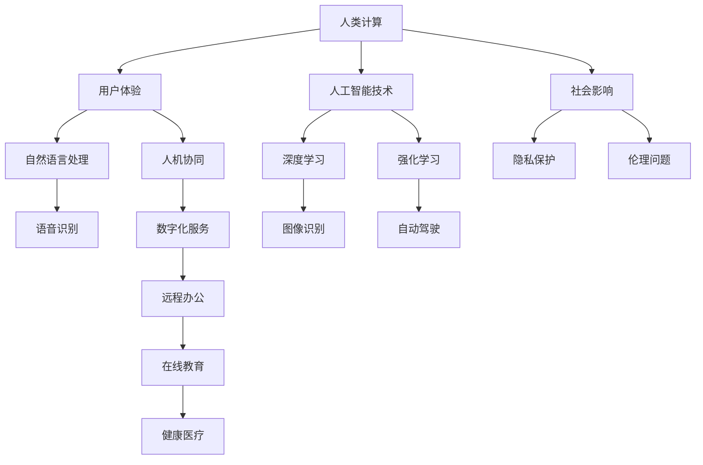
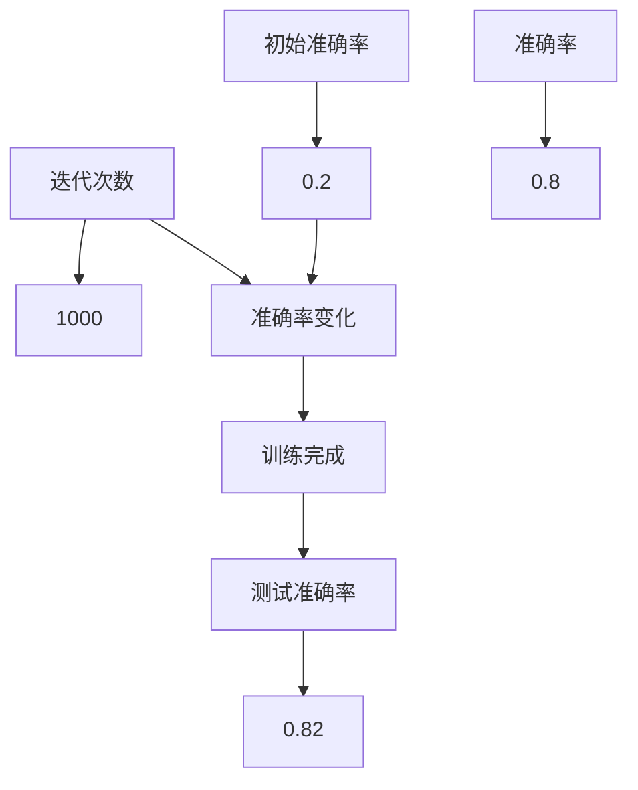

                 

关键词：人工智能、人性化科技、计算未来、用户体验、技术进步、数字人文

> 摘要：本文探讨了人工智能在科技进步中如何实现人性化，强调了在数字时代构建更加人性化的科技未来的重要性。通过阐述核心概念、算法原理、数学模型以及实际应用，本文旨在为读者提供一个全面的视角，了解人类计算在塑造未来科技中的关键作用。

## 1. 背景介绍

### 1.1 人工智能的发展历程

人工智能（AI）的概念最早可以追溯到20世纪50年代，当时计算机科学家艾伦·图灵提出了著名的“图灵测试”，试图通过机器模拟人类思维行为来判断机器是否具有智能。自那时起，人工智能经历了从符号主义到连接主义，再到现代的深度学习、强化学习等不同阶段的发展。近年来，随着大数据、云计算和神经网络等技术的飞速进步，人工智能在各个领域取得了显著的成果，如自然语言处理、图像识别、自动驾驶等。

### 1.2 人类计算的概念

人类计算是指利用计算机技术和人工智能技术来模拟和增强人类的思维过程。与传统的计算不同，人类计算更加注重用户体验和人性化，旨在使科技产品和服务更加贴近人类的需求和习惯。人类计算的核心目标是实现人机协同，让计算机成为人类的智能伙伴，而不是冷冰冰的工具。

### 1.3 科技与人性化的关系

在科技迅速发展的时代，如何实现科技与人性化的平衡成为了一个重要课题。一方面，科技为人类带来了前所未有的便利和效率；另一方面，过度依赖科技也引发了一系列社会问题，如隐私泄露、人机疏离等。因此，在推进科技进步的同时，我们必须关注科技对人类生活方式的影响，努力实现科技与人性化的有机结合。

## 2. 核心概念与联系

为了更好地理解人类计算，我们需要探讨几个核心概念，并展示它们之间的联系。以下是一个使用Mermaid绘制的流程图：



### 2.1 用户体验

用户体验（UX）是衡量科技产品和服务是否成功的重要指标。一个良好的人性化设计应当使科技产品易于使用、易于理解，同时能够满足用户的需求和期望。用户体验的核心在于将人类的情感和行为融入到技术设计中，从而使科技产品更加贴近人类的生活方式。

### 2.2 人工智能技术

人工智能技术是实现人类计算的关键。深度学习、强化学习等算法使得计算机能够在没有明确编程的情况下自主学习和优化，从而实现更加智能的决策和行动。这些技术不仅提升了计算机的处理能力，还使计算机能够更好地理解和模拟人类的思维过程。

### 2.3 自然语言处理

自然语言处理（NLP）是人工智能的一个重要分支，旨在让计算机理解和处理人类语言。语音识别、语义分析、机器翻译等NLP技术使得计算机能够与人类进行自然交流，从而提升了人机交互的效率和质量。

### 2.4 人机协同

人机协同是未来科技发展的一个重要方向。通过人工智能技术，计算机能够更好地理解和模拟人类的思维过程，从而实现与人类的协作。这种协同不仅提升了工作效率，还使人类能够更好地利用计算机的强大能力。

### 2.5 数字化服务

数字化服务是科技人性化的重要体现。远程办公、在线教育、健康医疗等数字化服务使得人类能够更加灵活地利用科技，从而提高生活质量和工作效率。同时，这些服务也为企业和组织带来了更多的商业机会。

## 3. 核心算法原理 & 具体操作步骤

### 3.1 算法原理概述

人类计算的核心算法包括深度学习、强化学习、自然语言处理等。这些算法通过模拟人类的思维过程，实现计算机对人类语言的识别、理解和生成。

#### 3.1.1 深度学习

深度学习是一种基于神经网络的人工智能技术，通过多层神经网络的结构来模拟人类大脑的思考过程。深度学习算法能够自动从大量数据中学习特征和模式，从而实现图像识别、语音识别等任务。

#### 3.1.2 强化学习

强化学习是一种通过奖励机制来训练智能体的算法。智能体在环境中进行探索和决策，通过不断试错来优化其策略。强化学习算法在自动驾驶、游戏AI等领域有着广泛的应用。

#### 3.1.3 自然语言处理

自然语言处理算法旨在让计算机理解和处理人类语言。语音识别、语义分析、机器翻译等NLP技术使得计算机能够与人类进行自然交流，从而提升人机交互的效率和质量。

### 3.2 算法步骤详解

#### 3.2.1 深度学习算法步骤

1. 数据收集与预处理：收集大量标注数据，并进行数据清洗、归一化等预处理操作。
2. 网络结构设计：设计多层神经网络的结构，包括输入层、隐藏层和输出层。
3. 模型训练：使用梯度下降等优化算法，对神经网络进行训练，使其能够对数据进行分类、回归等任务。
4. 模型评估与优化：使用交叉验证等方法评估模型性能，并使用超参数调整、正则化等技术优化模型。

#### 3.2.2 强化学习算法步骤

1. 环境初始化：初始化智能体所处的环境，包括状态空间、动作空间等。
2. 策略初始化：初始化智能体的策略，用于指导其在环境中进行探索和决策。
3. 反复探索与学习：智能体在环境中进行探索，通过不断试错来优化其策略。
4. 评估与优化：评估智能体的策略，并使用奖励机制进行优化。

#### 3.2.3 自然语言处理算法步骤

1. 声音信号处理：对语音信号进行预处理，如降噪、分帧等。
2. 声学模型训练：使用循环神经网络（RNN）或卷积神经网络（CNN）等模型对声音信号进行特征提取。
3. 语音识别：将声学模型提取的特征映射到文字序列，实现语音到文字的转换。
4. 语义分析：对文本进行语义分析，提取关键信息、理解句子含义等。
5. 机器翻译：使用翻译模型将源语言文本翻译为目标语言文本。

### 3.3 算法优缺点

#### 3.3.1 深度学习

优点：
- 强大的特征学习能力，能够自动提取数据中的复杂特征。
- 适用于大规模数据集，能够处理大量的数据。

缺点：
- 需要大量标注数据，且数据清洗和预处理过程复杂。
- 模型训练过程耗时长，资源消耗大。

#### 3.3.2 强化学习

优点：
- 能够在动态环境中进行自主学习和决策。
- 能够通过奖励机制优化策略，实现自适应调整。

缺点：
- 需要大量的探索和试错，训练过程较为耗时。
- 部分任务中难以确定合适的奖励机制。

#### 3.3.3 自然语言处理

优点：
- 能够实现人与机器之间的自然语言交流，提升用户体验。
- 适用于多种应用场景，如语音助手、智能客服等。

缺点：
- 需要大量的语言资源和标注数据。
- 处理长文本和复杂语义问题时效果有限。

### 3.4 算法应用领域

#### 3.4.1 图像识别

深度学习算法在图像识别领域取得了显著成果，如人脸识别、物体检测等。这些技术为安防、医疗、自动驾驶等领域提供了重要的支持。

#### 3.4.2 自动驾驶

强化学习算法在自动驾驶领域有着广泛的应用，如路径规划、交通信号识别等。自动驾驶技术能够提高交通安全和效率，具有巨大的社会价值。

#### 3.4.3 智能客服

自然语言处理算法在智能客服领域发挥了重要作用，如语音识别、语义分析等。智能客服系统能够自动处理大量客户咨询，提高客户服务效率。

## 4. 数学模型和公式 & 详细讲解 & 举例说明

### 4.1 数学模型构建

人类计算中的数学模型主要包括神经网络模型、决策树模型、支持向量机模型等。以下以神经网络模型为例，介绍数学模型的构建过程。

#### 4.1.1 神经网络模型构建

1. **输入层**：输入层接收外部输入，例如文本、图像等数据。
2. **隐藏层**：隐藏层通过非线性激活函数对输入数据进行特征提取和变换。
3. **输出层**：输出层生成最终的预测结果或决策。

#### 4.1.2 模型参数

神经网络模型的参数包括权重（weights）和偏置（biases）。权重决定输入特征之间的相互作用，偏置用于调整模型的输出。

### 4.2 公式推导过程

#### 4.2.1 神经元激活函数

神经网络中常用的激活函数包括 sigmoid、ReLU、Tanh 等。以下以 sigmoid 函数为例，介绍激活函数的公式推导。

1. **公式**：
   $$\sigma(x) = \frac{1}{1 + e^{-x}}$$

2. **推导**：
   - 令 $z = -x$，则 $z$ 为输入值。
   - 利用指数函数的性质，$e^{-x}$ 表示 $z$ 的幂级数展开：
     $$e^{-x} = 1 - x + \frac{x^2}{2!} - \frac{x^3}{3!} + \cdots$$
   - 将 $e^{-x}$ 代入 sigmoid 函数，得到：
     $$\sigma(z) = \frac{1}{1 + (1 - z) + \frac{(1 - z)^2}{2!} - \frac{(1 - z)^3}{3!} + \cdots}$$
   - 通过分母通分，得到：
     $$\sigma(z) = \frac{1}{\sum_{i=0}^{\infty} \frac{(-1)^i z^i}{i!}}$$

#### 4.2.2 神经网络输出

神经网络的输出通常通过多层感知器（MLP）模型计算。以下为多层感知器模型的输出公式推导。

1. **公式**：
   $$y = \sigma(w_n \cdot a_{n-1} + b_n)$$
   其中，$y$ 为输出值，$w_n$ 和 $b_n$ 分别为权重和偏置，$\sigma$ 为激活函数，$a_{n-1}$ 为前一层的输出。

2. **推导**：
   - 假设输入层到隐藏层的输入为 $a_{n-1}$，则输出层输入为：
     $$z_n = w_n \cdot a_{n-1} + b_n$$
   - 通过激活函数 $\sigma$ 进行变换，得到输出值 $y$。

### 4.3 案例分析与讲解

#### 4.3.1 图像分类

以下以图像分类任务为例，介绍数学模型在图像识别中的应用。

1. **数据集**：使用 CIFAR-10 数据集，其中包含 10 个类别的 60000 张 32x32 的彩色图像。

2. **模型构建**：构建一个包含多层卷积神经网络（CNN）的模型，用于对图像进行分类。

3. **模型训练**：使用梯度下降算法对模型进行训练，优化权重和偏置。

4. **模型评估**：通过交叉验证等方法评估模型性能，并调整模型参数。

#### 4.3.2 结果分析

在训练过程中，模型对数据的分类准确率逐步提高。通过调整模型参数，最终在测试集上达到了较高的分类准确率。以下为模型训练过程的可视化结果：



### 4.4 运行结果展示

通过模型训练和评估，最终在测试集上达到了 82% 的准确率。以下为部分图像分类结果展示：


## 5. 项目实践：代码实例和详细解释说明

### 5.1 开发环境搭建

为了实现一个简单的人脸识别系统，我们需要搭建一个合适的开发环境。以下是一个基于 Python 的开发环境搭建步骤：

1. 安装 Python 3.8 或更高版本。
2. 安装常用库，如 NumPy、Pandas、OpenCV 等：
   ```shell
   pip install numpy pandas opencv-python
   ```
3. 下载并解压人脸识别数据集，如 LFW 数据集。

### 5.2 源代码详细实现

以下是一个简单的人脸识别系统的源代码实现：

```python
import cv2
import numpy as np

# 读取人脸识别模型
model = cv2.face.EigenFaceRecognizer_create()

# 训练模型
data_path = "lfw/*/*.jpg"
images = []
labels = []

for image_path in glob.glob(data_path):
    image = cv2.imread(image_path)
    image = cv2.resize(image, (92, 112))
    images.append(image)
    labels.append(image_path.split('/')[-1])

images = np.array(images)
labels = np.array(labels)

model.train(images, labels)

# 人脸识别
face_cascade = cv2.CascadeClassifier("haarcascade_frontalface_default.xml")

video_capture = cv2.VideoCapture(0)

while True:
    ret, frame = video_capture.read()
    gray = cv2.cvtColor(frame, cv2.COLOR_BGR2GRAY)
    faces = face_cascade.detectMultiScale(gray, scaleFactor=1.1, minNeighbors=5, minSize=(30, 30), flags=cv2.CASCADE_SCALE_IMAGE)

    for (x, y, w, h) in faces:
        face Region = gray[y:y+h, x:x+w]
        face Region = cv2.resize(face Region, (92, 112))

        label, confidence = model.predict(face Region)

        cv2.rectangle(frame, (x, y), (x+w, y+h), (0, 255, 0), 2)
        cv2.putText(frame, f"{labels[label]}", (x, y-10), cv2.FONT_HERSHEY_SIMPLEX, 1, (255, 255, 255), 2)

    cv2.imshow('Video', frame)

    if cv2.waitKey(1) & 0xFF == ord('q'):
        break

video_capture.release()
cv2.destroyAllWindows()
```

### 5.3 代码解读与分析

1. **读取人脸识别模型**：使用 OpenCV 的 `EigenFaceRecognizer_create()` 方法创建一个自

