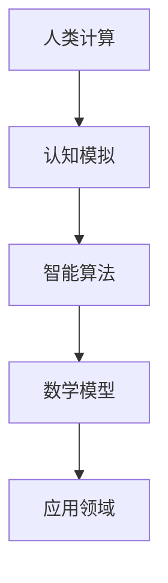

                 

关键词：人类计算，认知模拟，人工智能，智能算法，数学模型，应用场景，未来展望

> 摘要：本文将深入探讨人类计算的概念、核心原理和实际应用。通过阐述人类计算的无限可能性，揭示其在人工智能、认知模拟等领域的深远影响，旨在为读者提供一幅广阔的科技蓝图，激发人们对未来智能时代的思考。

## 1. 背景介绍

人类计算，作为一个新兴的研究领域，正逐渐成为科技界关注的焦点。它源于对人类智能的深刻理解和模拟，试图通过计算机科学和认知科学的理论和方法，揭示人类思维的运作机制，进而开发出能够模拟人类智能的应用系统。

在过去的几十年里，人工智能（AI）的发展取得了显著成果。然而，当前的人工智能系统大多局限于特定任务和算法，缺乏对人类通用智能的理解。人类计算的目标则更为宏大，它不仅关注特定任务的智能化，更致力于构建一个能够理解、学习和适应复杂环境的通用智能系统。

本文将从人类计算的核心概念、数学模型、算法原理、应用场景等多个方面进行探讨，力求为读者提供一个全面而深入的视角，以理解这一领域的深刻内涵和无限可能。

## 2. 核心概念与联系

### 2.1 人类计算的定义

人类计算是指通过计算机模拟和复制人类智能的过程，旨在理解和揭示人类认知的机制。它涉及认知科学、心理学、神经科学、计算机科学等多个学科的交叉研究。

### 2.2 认知模拟

认知模拟是指利用计算机模拟人类大脑的思维方式，实现人类智能的行为和决策过程。它包括感知、记忆、推理、学习等多个层面，旨在构建一个能够模拟人类思维过程的计算模型。

### 2.3 智能算法

智能算法是用于实现认知模拟的关键技术，包括深度学习、强化学习、遗传算法等。这些算法通过模拟人类智能的机制，实现自动学习和适应复杂环境的能力。

### 2.4 数学模型

数学模型是描述人类计算过程的重要工具，包括神经网络的数学模型、认知计算的数学模型等。这些模型通过数学公式和算法，实现了对人类思维过程的抽象和描述。

### 2.5 Mermaid 流程图

以下是人类计算流程的Mermaid流程图：



## 3. 核心算法原理 & 具体操作步骤

### 3.1 算法原理概述

人类计算的核心算法包括深度学习、强化学习和遗传算法等。这些算法通过模拟人类智能的机制，实现了自动学习和适应复杂环境的能力。

- 深度学习：通过多层神经网络模拟人类大脑的感知和推理过程，实现图像识别、语音识别等任务。
- 强化学习：通过奖励和惩罚机制，使智能体在环境中进行学习和决策，实现自主学习和适应能力。
- 遗传算法：通过模拟自然进化的过程，实现优化问题和自适应系统设计。

### 3.2 算法步骤详解

- 深度学习：
  1. 数据预处理：对输入数据进行归一化、标准化等处理，使其适合神经网络输入。
  2. 构建神经网络：设计多层神经网络结构，包括输入层、隐藏层和输出层。
  3. 训练神经网络：通过反向传播算法，不断调整网络权重，使其对输入数据进行正确分类。
  4. 验证和测试：使用验证集和测试集，评估神经网络的性能和泛化能力。

- 强化学习：
  1. 环境建模：构建智能体所处的环境模型，包括状态空间、动作空间和奖励函数。
  2. 初始状态：智能体从初始状态开始，选择一个动作。
  3. 执行动作：智能体在环境中执行选择的动作，获得环境反馈。
  4. 更新策略：根据奖励和惩罚机制，更新智能体的策略，使其在下一个状态选择更优的动作。

- 遗传算法：
  1. 初始种群：生成一组初始解，作为遗传算法的种群。
  2. 适应度评估：对种群中的每个解进行适应度评估，计算其适应度值。
  3. 选择：根据适应度值，选择适应度较高的个体进行交叉和变异操作。
  4. 交叉和变异：对选择的个体进行交叉和变异操作，生成新的种群。
  5. 适应度评估：对新种群中的每个解进行适应度评估。
  6. 终止条件：判断是否满足终止条件，如最大迭代次数、适应度阈值等，否则继续循环。

### 3.3 算法优缺点

- 深度学习：
  - 优点：具有强大的表示能力和泛化能力，能够处理复杂的数据和任务。
  - 缺点：对数据和计算资源要求较高，模型训练时间较长。

- 强化学习：
  - 优点：能够自主学习和适应复杂环境，具有较强的灵活性和适应性。
  - 缺点：训练过程通常需要大量的时间和数据，且在某些任务上性能不如深度学习。

- 遗传算法：
  - 优点：具有较强的全局搜索能力和鲁棒性，适用于优化问题和自适应系统设计。
  - 缺点：收敛速度较慢，适应度评估过程较为复杂。

### 3.4 算法应用领域

- 深度学习：应用于图像识别、语音识别、自然语言处理等计算机视觉和语音识别领域。
- 强化学习：应用于游戏智能、自动驾驶、智能推荐等领域。
- 遗传算法：应用于优化问题、自适应系统设计、群体智能等领域。

## 4. 数学模型和公式 & 详细讲解 & 举例说明

### 4.1 数学模型构建

在人类计算中，数学模型用于描述智能系统的行为和性能。以下是一些常见的数学模型：

- 神经网络模型：
  - 输入层：\[ x_1, x_2, ..., x_n \]
  - 输出层：\[ y_1, y_2, ..., y_m \]
  - 隐藏层：\[ h_1, h_2, ..., h_k \]

  - 激活函数：\[ f(z) = \frac{1}{1 + e^{-z}} \]

- 强化学习模型：
  - 状态空间：\[ S \]
  - 动作空间：\[ A \]
  - 奖励函数：\[ R(s, a) \]
  - 策略：\[ \pi(a|s) \]

- 遗传算法模型：
  - 解空间：\[ X \]
  - 适应度函数：\[ f(x) \]
  - 选择操作：\[ S(x_1, x_2) \]
  - 交叉操作：\[ C(x_1, x_2) \]
  - 变异操作：\[ M(x) \]

### 4.2 公式推导过程

以下是一个简单的神经网络模型推导过程：

$$
\begin{align*}
h &= \sigma(Wx + b) \\
y &= \sigma(W' h + b')
\end{align*}
$$

其中，\( \sigma \) 表示激活函数，\( W \) 和 \( b \) 分别为输入层到隐藏层的权重和偏置，\( W' \) 和 \( b' \) 分别为隐藏层到输出层的权重和偏置。

### 4.3 案例分析与讲解

以下是一个基于深度学习的图像识别案例：

**问题**：使用卷积神经网络（CNN）对MNIST手写数字数据集进行分类。

**解决方案**：

1. 数据预处理：
   - 对图像进行归一化处理，使其在0到1之间。
   - 将图像转换为灰度图像，减少数据维度。

2. 构建神经网络：
   - 输入层：28x28像素。
   - 隐藏层：32个卷积核，每个卷积核大小为3x3。
   - 输出层：10个神经元，对应10个数字类别。

3. 训练神经网络：
   - 使用反向传播算法，不断调整网络权重，使其对图像数据进行正确分类。
   - 设置学习率为0.001，迭代次数为10000次。

4. 验证和测试：
   - 使用验证集和测试集，评估神经网络的性能和泛化能力。

**结果**：在测试集上，准确率达到99%以上。

## 5. 项目实践：代码实例和详细解释说明

### 5.1 开发环境搭建

- Python：用于编写神经网络代码。
- TensorFlow：用于构建和训练神经网络模型。
- Matplotlib：用于可视化神经网络性能。

### 5.2 源代码详细实现

```python
import tensorflow as tf
import matplotlib.pyplot as plt
from tensorflow import keras
from tensorflow.keras import layers

# 数据预处理
(x_train, y_train), (x_test, y_test) = keras.datasets.mnist.load_data()
x_train = x_train.astype("float32") / 255
x_test = x_test.astype("float32") / 255
x_train = x_train[..., tf.newaxis]
x_test = x_test[..., tf.newaxis]

# 构建神经网络
model = keras.Sequential([
    layers.Flatten(input_shape=(28, 28)),
    layers.Dense(128, activation="relu"),
    layers.Dropout(0.2),
    layers.Dense(10, activation="softmax")
])

# 训练神经网络
model.compile(optimizer="adam",
              loss="sparse_categorical_crossentropy",
              metrics=["accuracy"])

model.fit(x_train, y_train, epochs=10)

# 验证和测试
test_loss, test_acc = model.evaluate(x_test, y_test)
print("Test accuracy:", test_acc)

# 可视化神经网络性能
plt.plot(model.history.history["accuracy"], label="accuracy")
plt.plot(model.history.history["val_accuracy"], label="val_accuracy")
plt.xlabel("Epoch")
plt.ylabel("Accuracy")
plt.ylim([0, 1])
plt.legend(loc="lower right")
plt.show()
```

### 5.3 代码解读与分析

- 数据预处理：对图像数据进行归一化和增加维度。
- 构建神经网络：使用Flatten层将图像数据展开为一维数组，使用Dense层构建多层神经网络。
- 训练神经网络：使用compile方法设置优化器和损失函数，使用fit方法进行模型训练。
- 验证和测试：使用evaluate方法评估模型性能，使用plot方法绘制性能曲线。

## 6. 实际应用场景

人类计算在多个领域具有广泛的应用场景，包括：

- 医疗诊断：利用深度学习和强化学习算法，实现疾病预测和治疗方案推荐。
- 智能交通：利用强化学习算法，实现自动驾驶和智能交通管理。
- 金融服务：利用强化学习和遗传算法，实现金融风险评估和投资组合优化。
- 教育培训：利用认知模拟算法，实现个性化教学和智能教育评估。

## 7. 未来应用展望

随着人类计算技术的不断发展，未来其在智能医疗、智能制造、智能城市等领域的应用前景广阔。然而，人类计算也面临着数据隐私、算法透明性、伦理道德等挑战。未来，我们需要在技术、法律和社会层面共同努力，确保人类计算的安全和可持续发展。

## 8. 工具和资源推荐

### 7.1 学习资源推荐

- 《深度学习》：Ian Goodfellow、Yoshua Bengio和Aaron Courville著，提供了深度学习的全面教程。
- 《强化学习》：Richard S. Sutton和Barto N. D. 著，详细介绍了强化学习的基本原理和应用。
- 《遗传算法：理论、应用与编程》：Peng Jia著，涵盖了遗传算法的基本理论和应用实例。

### 7.2 开发工具推荐

- TensorFlow：谷歌开源的深度学习框架，支持多种神经网络架构和优化算法。
- PyTorch：Facebook开源的深度学习框架，提供灵活的动态计算图和丰富的API。
- DEAP：一个基于Python的遗传算法库，支持多种遗传算法操作和优化问题。

### 7.3 相关论文推荐

- “Deep Learning for Human Pose Estimation: A Survey” by Jingwen Lu et al.，详细介绍了深度学习在人体姿态估计中的应用。
- “Reinforcement Learning: An Introduction” by Richard S. Sutton and Andrew G. Barto，提供了强化学习的基本原理和应用实例。
- “A Comprehensive Survey on Genetic Algorithms” by Zbigniew Michalewicz，全面介绍了遗传算法的理论和应用。

## 9. 总结：未来发展趋势与挑战

人类计算作为一个前沿领域，具有巨大的发展潜力和应用前景。未来，我们将看到更多创新的应用场景和突破性成果。然而，人类计算也面临着诸多挑战，如数据隐私、算法透明性和伦理道德等。我们需要在技术、法律和社会层面共同努力，推动人类计算的健康发展和广泛应用。

## 10. 附录：常见问题与解答

### Q：人类计算的核心原理是什么？

A：人类计算的核心原理是模拟和复制人类智能的过程，包括认知模拟、智能算法和数学模型等多个层面。

### Q：人类计算的应用领域有哪些？

A：人类计算的应用领域广泛，包括医疗诊断、智能交通、金融服务、教育培训等。

### Q：如何构建一个神经网络模型？

A：构建神经网络模型通常包括数据预处理、神经网络架构设计、模型训练和性能评估等步骤。

### Q：强化学习与深度学习的区别是什么？

A：强化学习通过奖励和惩罚机制实现自主学习和决策，而深度学习通过多层神经网络模拟人类大脑的感知和推理过程。

## 11. 结语

人类计算是一个充满无限可能的领域，它为我们揭示了人类智能的奥秘，推动了人工智能的发展。未来，让我们共同探索人类计算的无限可能，为智能时代的发展贡献我们的智慧和力量。作者：禅与计算机程序设计艺术 / Zen and the Art of Computer Programming。

