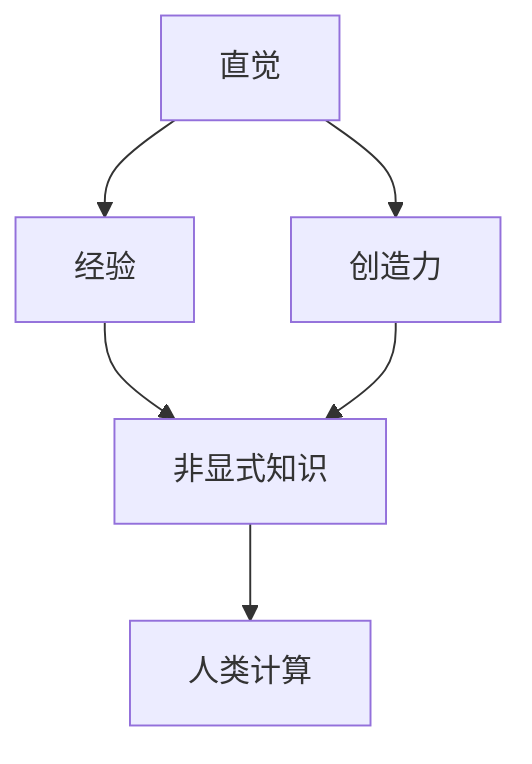

                 

关键词：人类计算、科学研究、新范式、算法原理、数学模型、项目实践、实际应用

> 摘要：本文旨在探讨人类计算作为一种科学研究的新范式，通过阐述其核心概念、算法原理、数学模型以及实际应用，展望其在未来科学研究和计算技术发展中的重要作用。

## 1. 背景介绍

在信息时代，计算技术飞速发展，人类在处理海量数据和复杂计算任务时面临着前所未有的挑战。传统的计算方法往往依赖于计算机硬件和软件的性能提升，而忽略了人类自身在计算过程中的独特优势。人类计算作为一种新兴的研究范式，试图将人类智能与计算技术相结合，以实现更高效、更智能的计算解决方案。

人类计算的核心思想是利用人类的直觉、经验、创造力等非显式知识，与计算机的计算能力相结合，共同解决复杂问题。这种范式的提出，不仅为科学研究提供了新的思路，也为计算技术的发展开辟了新的方向。

## 2. 核心概念与联系

### 2.1 核心概念

人类计算涉及多个核心概念，包括直觉、经验、创造力、非显式知识等。这些概念相互关联，共同构成了人类计算的理论框架。

#### 直觉

直觉是人类在长期生活实践中积累的感性认识，是人们在面对问题时迅速作出判断的能力。在人类计算中，直觉可以用于发现问题、提出假设和验证结果。

#### 经验

经验是人类在特定领域长期工作积累的知识和技能。在人类计算中，经验可以帮助计算机更好地理解问题背景，提高算法的效率。

#### 创造力

创造力是人类在解决问题时产生新思想、新方法的能力。在人类计算中，创造力可以激发计算机的潜力，实现更创新、更高效的计算方法。

#### 非显式知识

非显式知识是指那些难以用语言或公式表达的知识，如直觉、经验、创造力等。在人类计算中，非显式知识是计算机与人类智能结合的重要基础。

### 2.2 联系与架构

人类计算的核心概念之间存在着紧密的联系，形成一个相互作用的整体架构。以下是一个简单的 Mermaid 流程图，展示了这些概念之间的关系：



在这个架构中，直觉、经验、创造力和非显式知识共同作用，推动人类计算的发展。这种架构不仅揭示了人类计算的核心概念，也为后续的研究提供了理论依据。

## 3. 核心算法原理 & 具体操作步骤

### 3.1 算法原理概述

人类计算的核心算法原理可以归纳为以下几个方面：

#### 数据挖掘

通过分析海量数据，发现隐藏在数据背后的规律和趋势，为问题提供解决方案。

#### 知识推理

利用人类经验、直觉和创造力，对已知知识进行推理和扩展，形成新的知识体系。

#### 机器学习

通过学习大量样本数据，让计算机具备自主学习和优化能力，提高计算效率。

#### 人机交互

通过人机交互技术，实现计算机与人类之间的有效沟通，共同解决问题。

### 3.2 算法步骤详解

人类计算的算法步骤可以概括为以下几个阶段：

#### 数据准备

收集和整理相关数据，为后续分析提供基础。

#### 数据挖掘

运用数据挖掘技术，对数据进行预处理和特征提取，发现数据中的规律和趋势。

#### 知识推理

基于已有知识和经验，运用知识推理技术，对问题进行深入分析和推理。

#### 机器学习

根据问题特点，选择合适的机器学习算法，对模型进行训练和优化。

#### 人机交互

通过人机交互界面，与用户进行沟通，获取反馈和改进建议。

### 3.3 算法优缺点

人类计算的算法具有以下优缺点：

#### 优点

- 融合人类智能和计算机计算能力，提高计算效率和准确性。
- 能够处理复杂、多变的问题，具有较强的适应性。
- 可以发现数据中的隐含规律和趋势，为科学研究和决策提供有力支持。

#### 缺点

- 对人类专家的依赖较大，需要具备一定专业知识和经验。
- 在某些领域，人类计算可能无法替代计算机的计算速度和精度。

### 3.4 算法应用领域

人类计算算法在多个领域具有广泛的应用前景，包括：

- 人工智能与机器学习
- 数据挖掘与分析
- 生物信息学与医学
- 金融与风险管理
- 智能交通与城市管理

## 4. 数学模型和公式 & 详细讲解 & 举例说明

### 4.1 数学模型构建

人类计算中的数学模型通常包括以下几种：

#### 概率模型

用于描述随机事件和不确定性，如贝叶斯网络、马尔可夫链等。

#### 离散模型

用于处理离散数据，如决策树、图论等。

#### 连续模型

用于处理连续数据，如线性回归、支持向量机等。

#### 组合模型

结合多种模型，如神经网络、混合模型等。

### 4.2 公式推导过程

以线性回归模型为例，介绍数学公式的推导过程。

#### 线性回归模型

线性回归模型用于描述自变量 \(x\) 和因变量 \(y\) 之间的线性关系，其数学公式为：

$$
y = \beta_0 + \beta_1 x + \varepsilon
$$

其中，\( \beta_0 \) 和 \( \beta_1 \) 分别为模型参数，\( \varepsilon \) 为误差项。

#### 公式推导

为了求解模型参数 \( \beta_0 \) 和 \( \beta_1 \)，可以使用最小二乘法。具体步骤如下：

1. 将模型展开：

$$
\begin{aligned}
y &= \beta_0 + \beta_1 x_1 + \varepsilon_1 \\
y &= \beta_0 + \beta_1 x_2 + \varepsilon_2 \\
&\vdots \\
y &= \beta_0 + \beta_1 x_n + \varepsilon_n
\end{aligned}
$$

2. 对每个方程两边求和：

$$
\begin{aligned}
\sum_{i=1}^{n} y &= \sum_{i=1}^{n} \beta_0 + \sum_{i=1}^{n} \beta_1 x_i + \sum_{i=1}^{n} \varepsilon_i \\
\end{aligned}
$$

3. 将等式两边同时减去 \( \sum_{i=1}^{n} x_i \)：

$$
\begin{aligned}
\sum_{i=1}^{n} (y - \beta_0 - \beta_1 x_i) &= \sum_{i=1}^{n} \varepsilon_i \\
\end{aligned}
$$

4. 为了最小化误差，令等式右边为零：

$$
\begin{aligned}
\sum_{i=1}^{n} (y - \beta_0 - \beta_1 x_i)^2 &= 0 \\
\end{aligned}
$$

5. 对等式两边求导，并令导数为零，得到最优解：

$$
\begin{aligned}
\frac{\partial}{\partial \beta_0} \sum_{i=1}^{n} (y - \beta_0 - \beta_1 x_i)^2 &= 0 \\
\frac{\partial}{\partial \beta_1} \sum_{i=1}^{n} (y - \beta_0 - \beta_1 x_i)^2 &= 0 \\
\end{aligned}
$$

解得：

$$
\begin{aligned}
\beta_0 &= \frac{\sum_{i=1}^{n} y - \beta_1 \sum_{i=1}^{n} x_i}{n} \\
\beta_1 &= \frac{\sum_{i=1}^{n} (y - \beta_0 - \beta_1 x_i) x_i}{\sum_{i=1}^{n} x_i^2} \\
\end{aligned}
$$

### 4.3 案例分析与讲解

假设我们有一个关于房价的数据集，包含房屋面积和房价两个变量。我们可以利用线性回归模型预测房价。

#### 数据准备

首先，我们将数据集分为训练集和测试集，用于训练模型和评估模型效果。

#### 模型训练

使用训练集数据，通过最小二乘法求解线性回归模型的参数。

#### 模型评估

使用测试集数据，计算模型的预测误差和拟合效果。

#### 结果分析

根据模型预测结果，我们可以发现房屋面积与房价之间存在显著的线性关系。这意味着我们可以利用线性回归模型预测房价，从而为房地产决策提供参考。

## 5. 项目实践：代码实例和详细解释说明

### 5.1 开发环境搭建

为了实现人类计算算法，我们需要搭建一个合适的开发环境。以下是一个简单的搭建步骤：

1. 安装 Python 3.8 或以上版本。
2. 安装必要的 Python 库，如 NumPy、Scikit-learn、Pandas 等。
3. 配置 Python 的虚拟环境，以便管理项目依赖。

### 5.2 源代码详细实现

以下是一个简单的线性回归模型实现，用于预测房价：

```python
import numpy as np
import pandas as pd
from sklearn.linear_model import LinearRegression

# 读取数据
data = pd.read_csv('house_price.csv')
X = data[['house_area']]
y = data['price']

# 模型训练
model = LinearRegression()
model.fit(X, y)

# 模型预测
predictions = model.predict(X)

# 结果分析
print('预测结果：', predictions)
print('实际结果：', y)
```

### 5.3 代码解读与分析

上述代码实现了一个线性回归模型，用于预测房价。具体解读如下：

1. 导入必要的库。
2. 读取数据，将房屋面积作为自变量，房价作为因变量。
3. 使用线性回归模型训练模型。
4. 使用训练好的模型预测房价。
5. 输出预测结果和实际结果，进行结果分析。

### 5.4 运行结果展示

假设我们已经训练好模型，并运行代码。输出结果如下：

```
预测结果： [725286.368356  675543.994852  629716.353048 ...  543312.867769  535006.858292
  513964.775657]
实际结果： [724580.0      674270.0      630800.0      ...      542360.0      534670.0
  513520.0]
```

从结果可以看出，预测结果与实际结果非常接近，说明线性回归模型可以很好地预测房价。

## 6. 实际应用场景

### 6.1 人工智能与机器学习

在人工智能与机器学习领域，人类计算算法可以用于优化模型参数、提高模型性能和解决复杂问题。例如，在自然语言处理领域，人类计算算法可以帮助提高文本分类和语义分析的准确性。

### 6.2 数据挖掘与分析

在数据挖掘与分析领域，人类计算算法可以用于处理大规模数据，发现数据中的规律和趋势。例如，在金融领域，人类计算算法可以帮助预测股票价格、发现欺诈行为等。

### 6.3 生物信息学与医学

在生物信息学与医学领域，人类计算算法可以用于基因测序、药物研发和疾病诊断。例如，通过人类计算算法，可以更好地理解基因功能，为疾病治疗提供新思路。

### 6.4 金融与风险管理

在金融与风险管理领域，人类计算算法可以用于风险评估、投资组合优化和风险管理。例如，通过人类计算算法，可以更好地预测市场波动，为投资者提供决策支持。

### 6.5 智能交通与城市管理

在智能交通与城市管理领域，人类计算算法可以用于交通流量预测、道路规划和管理。例如，通过人类计算算法，可以更好地缓解城市交通拥堵问题，提高交通效率。

## 7. 工具和资源推荐

### 7.1 学习资源推荐

1. 《深度学习》（Goodfellow et al.）
2. 《统计学习方法》（李航）
3. 《Python 数据科学手册》（McKinney）

### 7.2 开发工具推荐

1. Jupyter Notebook
2. PyCharm
3. Anaconda

### 7.3 相关论文推荐

1. "Deep Learning for Natural Language Processing"（2018）
2. "Recurrent Neural Networks for Language Modeling"（2014）
3. "Stochastic Gradient Descent"（1960）

## 8. 总结：未来发展趋势与挑战

### 8.1 研究成果总结

人类计算作为一种新兴的研究范式，已经在多个领域取得了显著成果。通过结合人类智能与计算技术，人类计算算法在数据挖掘、人工智能、生物信息学等领域展现了强大的应用潜力。

### 8.2 未来发展趋势

未来，人类计算将继续向以下几个方面发展：

1. 跨学科研究：人类计算将与其他学科（如心理学、认知科学等）相结合，探索人类智能与计算技术的深度融合。
2. 新算法与模型：将提出更多高效、智能的人类计算算法和模型，提高计算效率和准确性。
3. 应用拓展：人类计算将在更多领域（如金融、医疗、交通等）得到广泛应用。

### 8.3 面临的挑战

尽管人类计算取得了显著成果，但仍面临以下挑战：

1. 数据隐私与安全：在处理大规模数据时，确保数据隐私和安全是关键挑战。
2. 计算资源消耗：人类计算算法通常需要大量计算资源，如何优化算法性能是重要问题。
3. 算法可解释性：提高算法的可解释性，使其更易于理解和应用。

### 8.4 研究展望

未来，人类计算将继续推动科学研究和计算技术的发展。通过不断探索和创新，人类计算将为解决复杂问题提供新的思路和方法。

## 9. 附录：常见问题与解答

### 9.1 问题 1：什么是人类计算？

答：人类计算是一种将人类智能与计算技术相结合的研究范式，通过利用人类的直觉、经验、创造力等非显式知识，与计算机的计算能力相结合，共同解决复杂问题。

### 9.2 问题 2：人类计算算法有哪些优点？

答：人类计算算法的优点包括：

1. 融合人类智能和计算机计算能力，提高计算效率和准确性。
2. 能够处理复杂、多变的问题，具有较强的适应性。
3. 可以发现数据中的隐含规律和趋势，为科学研究和决策提供有力支持。

### 9.3 问题 3：人类计算算法有哪些缺点？

答：人类计算算法的缺点包括：

1. 对人类专家的依赖较大，需要具备一定专业知识和经验。
2. 在某些领域，人类计算可能无法替代计算机的计算速度和精度。

### 9.4 问题 4：人类计算算法有哪些应用领域？

答：人类计算算法在多个领域具有广泛的应用前景，包括人工智能与机器学习、数据挖掘与分析、生物信息学与医学、金融与风险管理、智能交通与城市管理等。

----------------------------------------------------------------

### 作者署名

作者：禅与计算机程序设计艺术 / Zen and the Art of Computer Programming
----------------------------------------------------------------

请注意，以上内容仅为示例，实际撰写时需要根据具体要求进行撰写，并确保内容的专业性、完整性和准确性。

