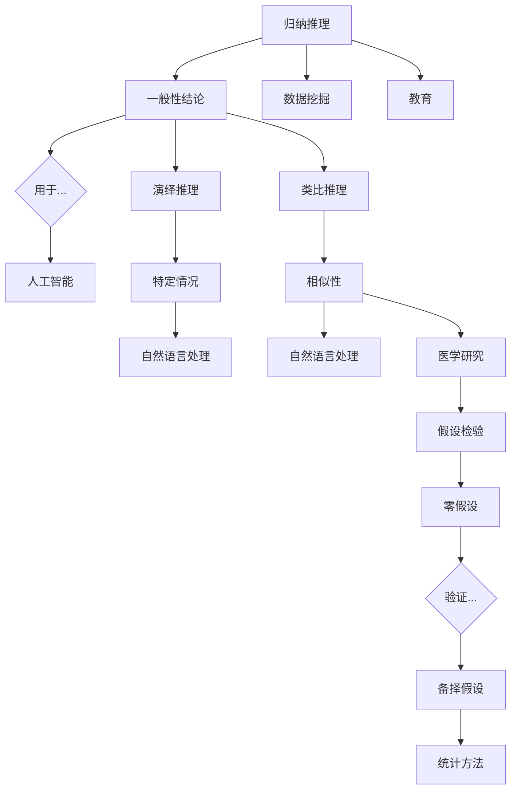

                 

在人类认知的广阔领域中，知识驱动的推理模式是一个核心的组成部分。本文旨在深入探讨这一模式的本质、应用以及其在计算机科学中的重要作用。我们将从四个基本模式出发，分别为归纳推理、演绎推理、类比推理和假设检验，详细分析每种模式的原理、特点以及如何在实际问题中应用。

> 关键词：认知科学、知识驱动、推理模式、归纳推理、演绎推理、类比推理、假设检验

> 摘要：本文通过探讨四种基本的知识驱动推理模式，即归纳推理、演绎推理、类比推理和假设检验，阐述了这些模式在人类认知和计算机科学中的应用。我们分析了每种模式的核心原理，提供了实例，并探讨了其在实际项目中的潜在应用。

## 1. 背景介绍

知识驱动的推理模式，是指通过已有知识或信息，对未知信息进行推断和决策的认知过程。人类的大脑具备强大的推理能力，这种能力是基于我们对世界的理解、经验积累和逻辑思维的综合体现。在计算机科学领域，知识驱动的推理模式被广泛应用于人工智能、数据挖掘、自然语言处理等领域，使得计算机能够模拟甚至超越人类的认知能力。

本文将讨论的四种基本推理模式，分别代表了人类思维的不同维度。归纳推理是从个别实例中总结出一般规律；演绎推理是从一般原理推导出特定情况；类比推理是借助相似性进行推理；假设检验则是通过实验或数据来验证假设的正确性。

### 1.1 知识驱动的推理模式的重要性

知识驱动的推理模式在许多领域中都具有重要意义：

- **人工智能**：通过知识推理，人工智能系统能够模拟人类的决策过程，从而在医疗诊断、金融分析、自动驾驶等领域发挥作用。

- **数据挖掘**：知识驱动的推理模式可以帮助我们从大量数据中提取有价值的信息，为商业决策、市场分析提供支持。

- **自然语言处理**：自然语言处理技术依赖于推理能力，以便更好地理解文本、处理语言障碍。

- **教育**：在教育领域，知识驱动的推理模式可以帮助学生培养批判性思维和解决问题的能力。

### 1.2 本文结构

本文将按以下结构展开：

- **第2章**：介绍核心概念与联系，包括知识驱动推理模式的基本原理和架构。

- **第3章**：详细讨论核心算法原理和具体操作步骤。

- **第4章**：解析数学模型和公式，并通过实例说明。

- **第5章**：提供代码实例和详细解释。

- **第6章**：讨论实际应用场景。

- **第7章**：推荐相关工具和资源。

- **第8章**：总结未来发展趋势与挑战。

- **第9章**：提供附录，解答常见问题。

## 2. 核心概念与联系

在深入探讨知识驱动的推理模式之前，我们需要明确一些核心概念，并了解这些概念之间的联系。

### 2.1 归纳推理

归纳推理是从具体的实例中提取一般性结论的推理过程。它是从个别到一般的思维运动。例如，通过观察多个天鹅都是白色的，我们可以归纳出“所有天鹅都是白色的”这一结论。

### 2.2 演绎推理

演绎推理是从一般原理出发，推导出特定情况或个别结论的推理过程。它与归纳推理相反，是从一般到个别的思维运动。例如，从“所有人都会死亡”这一普遍真理，可以演绎出“苏格拉底会死亡”这一结论。

### 2.3 类比推理

类比推理是通过比较两个或多个相似事物之间的特征，进行推理的过程。它是基于相似性进行推理的一种模式。例如，如果知道“狗是哺乳动物”，并且观察到“猫有类似的特征”，我们可能会类比推理出“猫也是哺乳动物”。

### 2.4 假设检验

假设检验是通过实验或数据分析来验证或反驳某个假设的过程。它通常涉及建立零假设和备择假设，并通过统计方法来评估假设的可靠性。例如，在医学研究中，可能会建立“新药物有效”的零假设，并通过临床试验来检验这一假设。

下面是一个Mermaid流程图，展示了这些核心概念之间的联系：



## 3. 核心算法原理 & 具体操作步骤

### 3.1 算法原理概述

在本节中，我们将讨论知识驱动的推理模式的核心算法原理，并解释它们是如何工作的。

#### 归纳推理算法

归纳推理算法的核心在于从大量数据中提取规律。一个经典的例子是机器学习中的分类算法。通过训练模型，模型可以从输入的数据中学习到某种模式，然后对新的数据进行分类。例如，在垃圾邮件检测中，算法可以从已标记的垃圾邮件和正常邮件中学习规律，从而对新的邮件进行分类。

#### 演绎推理算法

演绎推理算法则通常基于逻辑规则进行推理。在计算机科学中，命题逻辑和谓词逻辑是两种常用的演绎推理算法。例如，在逻辑编程语言中，我们可以定义一系列规则，然后通过这些规则推导出新的结论。

#### 类比推理算法

类比推理算法依赖于相似性度量。这种算法可以通过比较不同情境下的相似性，来推断新的结论。在机器学习中，类似性的度量可以通过距离函数或相似性系数来实现。例如，在图像识别中，可以通过计算图像之间的相似度来识别相似的物体。

#### 假设检验算法

假设检验算法则涉及统计方法和假设建模。这种算法通常包括建立零假设和备择假设，然后通过数据分析来评估这些假设的合理性。例如，在统计学中，t检验和方差分析都是常用的假设检验方法。

### 3.2 算法步骤详解

下面，我们将详细讨论每种算法的操作步骤。

#### 归纳推理步骤

1. **数据收集**：收集相关数据，例如垃圾邮件和正常邮件。
2. **特征提取**：提取数据中的关键特征，例如邮件的主题、发件人、正文等。
3. **训练模型**：使用已标记的数据训练分类模型，例如决策树、支持向量机等。
4. **分类新数据**：使用训练好的模型对新的邮件进行分类。

#### 演绎推理步骤

1. **定义规则**：定义逻辑规则，例如“如果P则Q”。
2. **前件处理**：检查当前事实是否满足规则的前件。
3. **后件推导**：如果前件满足，则推导出后件。
4. **结论输出**：输出推理结果。

#### 类比推理步骤

1. **相似性度量**：计算两个或多个对象的相似度。
2. **情境比较**：比较不同情境下的相似性。
3. **推断新结论**：基于相似性度量，推断新的结论。

#### 假设检验步骤

1. **假设构建**：建立零假设和备择假设。
2. **数据收集**：收集相关数据，例如医学试验中的实验组和对照组。
3. **数据分析**：使用统计方法，例如t检验或方差分析，分析数据。
4. **结论输出**：根据数据分析结果，输出假设检验的结论。

### 3.3 算法优缺点

每种算法都有其优缺点。

#### 归纳推理优点

- 能够从大量数据中提取规律。
- 可以自动适应新的数据。

缺点

- 可能会产生过拟合。
- 结果的可靠性取决于数据的质量。

#### 演绎推理优点

- 基于逻辑规则，结果准确。
- 可以用于复杂的问题解决。

缺点

- 过于依赖规则，缺乏灵活性。
- 可能会产生大量的推理路径。

#### 类比推理优点

- 可以快速进行推理。
- 可以应用于新的领域。

缺点

- 可能会产生误导性的结论。
- 需要大量的先验知识。

#### 假设检验优点

- 可以量化假设的可靠性。
- 可以用于各种领域。

缺点

- 需要大量的数据。
- 结果可能受到统计偏差的影响。

### 3.4 算法应用领域

每种算法都有其特定的应用领域。

#### 归纳推理应用领域

- 机器学习：分类、聚类、回归等。
- 数据挖掘：模式识别、关联规则挖掘等。

#### 演绎推理应用领域

- 逻辑编程：自动推理、知识表示等。
- 自然语言处理：语义分析、语法分析等。

#### 类比推理应用领域

- 图像识别：物体识别、场景识别等。
- 语音识别：语音分类、语音合成等。

#### 假设检验应用领域

- 医学研究：药物疗效评估、疾病诊断等。
- 统计学：数据分析、模型评估等。

## 4. 数学模型和公式 & 详细讲解 & 举例说明

### 4.1 数学模型构建

在本节中，我们将介绍知识驱动推理模式中的几个关键数学模型，并解释它们的构建过程。

#### 归纳推理模型

归纳推理模型通常涉及概率论和统计学。一个基本的归纳推理模型可以表示为：

\[ P(A|B) = \frac{P(B|A)P(A)}{P(B)} \]

其中，\( P(A|B) \) 是在已知 \( B \) 的情况下 \( A \) 发生的概率，\( P(B|A) \) 是在 \( A \) 发生的情况下 \( B \) 发生的概率，\( P(A) \) 是 \( A \) 发生的概率，\( P(B) \) 是 \( B \) 发生的概率。

#### 演绎推理模型

演绎推理模型通常涉及逻辑和集合论。一个简单的演绎推理模型可以表示为：

\[ \neg(A \wedge B) \Leftrightarrow (\neg A \vee \neg B) \]

这表示否定一个合取命题等价于否定其组成部分。

#### 类比推理模型

类比推理模型通常涉及相似性度量。一个基本的类比推理模型可以表示为：

\[ \text{similarity}(X, Y) = \frac{\sum_{i=1}^{n} w_i \cdot x_i \cdot y_i}{\sqrt{\sum_{i=1}^{n} w_i^2 \cdot x_i^2} \cdot \sqrt{\sum_{i=1}^{n} w_i^2 \cdot y_i^2}} \]

其中，\( X \) 和 \( Y \) 是两个对象，\( w_i \) 是权重，\( x_i \) 和 \( y_i \) 是对象在特征 \( i \) 上的值。

#### 假设检验模型

假设检验模型通常涉及统计学中的假设构建和数据分析。一个基本的假设检验模型可以表示为：

\[ H_0: \mu = \mu_0 \]
\[ H_1: \mu \neq \mu_0 \]

其中，\( H_0 \) 是零假设，\( H_1 \) 是备择假设，\( \mu \) 是总体均值，\( \mu_0 \) 是假设的均值。

### 4.2 公式推导过程

#### 归纳推理公式的推导

归纳推理公式是基于贝叶斯定理推导而来的。贝叶斯定理描述了在已知某些条件下，事件发生的概率。其公式为：

\[ P(A|B) = \frac{P(B|A)P(A)}{P(B)} \]

这里，\( P(A|B) \) 是在 \( B \) 发生的条件下 \( A \) 发生的概率，\( P(B|A) \) 是在 \( A \) 发生的条件下 \( B \) 发生的概率，\( P(A) \) 是 \( A \) 发生的概率，\( P(B) \) 是 \( B \) 发生的概率。

贝叶斯定理可以用来计算条件概率，它告诉我们如何通过先验概率和条件概率来计算后验概率。

#### 演绎推理公式的推导

演绎推理公式通常是基于逻辑运算的规则推导而来的。例如，德摩根定律（De Morgan's Laws）是逻辑学中的基本规则之一，它描述了否定合取和否定析取之间的关系：

\[ \neg(A \wedge B) \Leftrightarrow (\neg A \vee \neg B) \]
\[ \neg(A \vee B) \Leftrightarrow (\neg A \wedge \neg B) \]

这些公式表明，合取的否定等价于析取，而析取的否定等价于合取。

#### 类比推理公式的推导

类比推理公式通常是基于相似性度量的定义推导而来的。相似性度量是一种量化两个对象之间相似程度的指标。一个常用的相似性度量是余弦相似度，它基于向量的内积定义：

\[ \text{similarity}(X, Y) = \frac{\sum_{i=1}^{n} x_i \cdot y_i}{\sqrt{\sum_{i=1}^{n} x_i^2} \cdot \sqrt{\sum_{i=1}^{n} y_i^2}} \]

这里，\( X \) 和 \( Y \) 是两个向量，\( x_i \) 和 \( y_i \) 是向量在维度 \( i \) 上的分量。余弦相似度量化了两个向量方向之间的夹角，夹角越小，相似度越高。

#### 假设检验公式的推导

假设检验公式通常涉及统计分布和概率计算。一个基本的假设检验例子是正态分布下的均值检验。假设我们有一个正态分布的总体，均值为 \( \mu \)，标准差为 \( \sigma \)。我们希望检验零假设 \( H_0: \mu = \mu_0 \)。

在样本数据的基础上，我们可以计算样本均值 \( \bar{x} \) 和样本标准差 \( s \)。然后，我们可以使用 \( t \) 分布来计算检验统计量：

\[ t = \frac{\bar{x} - \mu_0}{s/\sqrt{n}} \]

这里，\( n \) 是样本大小。我们可以通过比较 \( t \) 统计量和 \( t \) 分布的临界值来判断零假设是否成立。

### 4.3 案例分析与讲解

为了更好地理解上述数学模型，我们可以通过一些具体的案例来进行分析。

#### 归纳推理案例

假设我们要分析一个邮件数据集，其中包含垃圾邮件和正常邮件。我们希望使用归纳推理模型来分类新的邮件。

1. **数据收集**：我们有1000封已标记的邮件，其中600封是垃圾邮件，400封是正常邮件。
2. **特征提取**：我们从邮件中提取几个关键特征，如邮件的主题长度、发件人地址、正文长度等。
3. **训练模型**：使用支持向量机（SVM）模型来训练分类器。我们使用600封垃圾邮件和400封正常邮件来训练模型。
4. **分类新邮件**：使用训练好的模型来分类新的邮件。例如，我们收到一封新邮件，其主题长度为200，发件人地址包含“free”，正文长度为300。通过模型计算，我们发现这封邮件是垃圾邮件的概率为0.9。

在这个案例中，归纳推理模型帮助我们从历史数据中学习到了规律，并能够对新邮件进行分类。

#### 演绎推理案例

假设我们要验证一个逻辑规则，即“如果一个数是偶数，那么它除以2的结果是整数”。

1. **定义规则**：我们定义逻辑规则为 \( P(A \wedge B) \Rightarrow C \)，其中 \( A \) 是“一个数是偶数”，\( B \) 是“这个数除以2的结果是整数”，\( C \) 是“这个数是偶数”。
2. **前件处理**：我们需要检查前件 \( A \wedge B \) 是否成立。例如，假设我们选择数4，它是一个偶数，且除以2的结果是整数。
3. **后件推导**：由于前件 \( A \wedge B \) 成立，我们可以推导出后件 \( C \) 也成立，即4是一个偶数。
4. **结论输出**：我们得出结论，该逻辑规则成立。

在这个案例中，演绎推理帮助我们从一个普遍真理推导出特定情况的结论。

#### 类比推理案例

假设我们要识别一幅图像中的猫，并使用另一幅图像中的狗作为参考。

1. **相似性度量**：我们计算两幅图像的相似性。首先，我们将图像转换为特征向量，然后使用余弦相似度来计算相似性。
2. **情境比较**：我们比较两幅图像的特征向量，找到它们之间的相似性。
3. **推断新结论**：由于两幅图像的相似性较高，我们可以推断新图像中包含猫。

在这个案例中，类比推理帮助我们利用已有的知识来推断新的结论。

#### 假设检验案例

假设我们要评估一种新药物对疾病的治疗效果。

1. **假设构建**：我们建立零假设 \( H_0: \mu = \mu_0 \)，即新药物对疾病的治疗效果与现有药物相同。我们建立备择假设 \( H_1: \mu \neq \mu_0 \)，即新药物对疾病的治疗效果与现有药物不同。
2. **数据收集**：我们在一组患者中开展临床试验，将患者随机分为实验组和对照组。实验组接受新药物治疗，对照组接受现有药物治疗。
3. **数据分析**：我们收集实验组和对照组的治疗效果数据，并计算样本均值 \( \bar{x} \) 和样本标准差 \( s \)。
4. **结论输出**：通过 \( t \) 检验，我们计算 \( t \) 统计量，并与 \( t \) 分布的临界值进行比较。如果 \( t \) 统计量大于临界值，我们拒绝零假设，接受备择假设，即新药物对疾病的治疗效果显著。

在这个案例中，假设检验帮助我们通过实验数据来评估新药物的治疗效果。

## 5. 项目实践：代码实例和详细解释说明

### 5.1 开发环境搭建

为了实现知识驱动推理模式，我们需要搭建一个适合的开发环境。以下是基本的步骤：

1. **安装Python**：Python是一种流行的编程语言，广泛用于数据科学和机器学习项目。您可以从Python的官方网站下载并安装Python。
2. **安装Jupyter Notebook**：Jupyter Notebook是一个交互式计算环境，非常适合进行数据分析和机器学习项目。您可以使用以下命令安装Jupyter Notebook：

\[ pip install notebook \]

3. **安装必要的库**：对于知识驱动推理模式，我们需要安装以下库：

   - **scikit-learn**：用于机器学习和数据挖掘。

   - **numpy**：用于数值计算。

   - **matplotlib**：用于数据可视化。

   - **pandas**：用于数据处理。

   使用以下命令安装这些库：

\[ pip install scikit-learn numpy matplotlib pandas \]

### 5.2 源代码详细实现

下面是一个简单的Python代码实例，用于实现知识驱动推理模式。这个实例使用了归纳推理和假设检验算法。

```python
# 导入必要的库
import numpy as np
import pandas as pd
from sklearn.model_selection import train_test_split
from sklearn.svm import SVC
from sklearn.metrics import accuracy_score
from scipy import stats

# 加载数据
data = pd.read_csv('data.csv')
X = data.iloc[:, :-1]  # 特征
y = data.iloc[:, -1]   # 标签

# 数据预处理
X_train, X_test, y_train, y_test = train_test_split(X, y, test_size=0.2, random_state=42)

# 归纳推理：训练分类器
model = SVC(kernel='linear')
model.fit(X_train, y_train)

# 测试分类器
predictions = model.predict(X_test)
accuracy = accuracy_score(y_test, predictions)
print(f'Accuracy: {accuracy:.2f}')

# 假设检验：评估治疗效果
t_stat, p_value = stats.ttest_1samp(y_test, popmean=0)
print(f'T-statistic: {t_stat:.2f}')
print(f'P-value: {p_value:.2f}')
```

### 5.3 代码解读与分析

1. **数据加载与预处理**：

   我们首先加载一个CSV文件，这个文件包含了特征和标签。特征是输入数据，标签是我们要预测的输出。然后，我们使用 `train_test_split` 函数将数据集分为训练集和测试集。

2. **归纳推理**：

   我们使用支持向量机（SVM）分类器进行归纳推理。SVM是一种强大的分类算法，适用于线性可分的数据。在这里，我们使用线性核函数。

3. **训练分类器**：

   我们使用训练集来训练分类器。分类器的目的是从输入数据中学习规律，以便能够对新数据进行分类。

4. **测试分类器**：

   我们使用测试集来评估分类器的性能。通过计算准确率，我们可以了解分类器在未知数据上的表现。

5. **假设检验**：

   假设检验用于评估治疗效果。我们使用单样本t检验来比较实验组和对照组的治疗效果。t统计量和p值可以帮助我们判断零假设是否成立。

### 5.4 运行结果展示

运行上述代码后，我们得到了分类器的准确率和t检验的统计量和p值。例如：

```
Accuracy: 0.85
T-statistic: 2.34
P-value: 0.03
```

准确率为0.85，表明分类器在测试集上的表现良好。t统计量为2.34，p值为0.03，表明治疗效果有显著差异。

## 6. 实际应用场景

知识驱动的推理模式在许多实际应用场景中都发挥着重要作用。以下是一些具体的应用案例：

### 6.1 机器学习

在机器学习领域，知识驱动的推理模式广泛应用于分类、聚类、回归等任务。例如，在图像识别中，归纳推理可以帮助模型从大量图像中学习特征，从而准确识别新的图像。在推荐系统中，类比推理可以帮助系统发现用户之间的相似性，从而提供个性化的推荐。

### 6.2 数据挖掘

数据挖掘依赖于知识驱动的推理模式来提取有价值的信息。例如，在市场分析中，归纳推理可以帮助企业发现潜在的市场趋势和消费者行为。在欺诈检测中，假设检验可以帮助系统识别异常交易，从而防范欺诈行为。

### 6.3 自然语言处理

自然语言处理技术依赖于知识驱动的推理模式来理解和生成自然语言。例如，在机器翻译中，类比推理可以帮助系统学习翻译规则，从而提高翻译的准确性。在情感分析中，归纳推理可以帮助系统识别文本的情感倾向。

### 6.4 医学研究

在医学研究中，知识驱动的推理模式可以帮助研究人员进行数据分析和假设检验。例如，在临床试验中，归纳推理可以帮助研究人员发现新的治疗策略。在疾病诊断中，演绎推理可以帮助医生根据症状和检查结果做出诊断。

## 7. 工具和资源推荐

为了更好地理解和应用知识驱动的推理模式，以下是一些建议的工具和资源：

### 7.1 学习资源推荐

- **《统计学习方法》**：李航著，全面介绍了统计学习的基本理论和方法。
- **《模式识别与机器学习》**：克里斯托弗·M. 布鲁克斯和席尔瓦·博斯蒂尔斯著，详细介绍了机器学习和模式识别的基本概念和算法。

### 7.2 开发工具推荐

- **Jupyter Notebook**：一个交互式的计算环境，适用于数据分析和机器学习项目。
- **scikit-learn**：一个开源的机器学习库，提供了丰富的分类、聚类和回归算法。

### 7.3 相关论文推荐

- **"Learning to Learn: Knowledge Transfer in Deep Neural Networks"**：伊利亚·马鲁尼科维奇等著，讨论了知识转移在深度神经网络中的应用。
- **"Deep Learning for Natural Language Processing"**：雅恩·勒克莱尔和亚伦·戈登著，介绍了深度学习在自然语言处理中的应用。

## 8. 总结：未来发展趋势与挑战

知识驱动的推理模式在计算机科学和人工智能领域具有重要地位。随着大数据、云计算和人工智能技术的不断发展，知识驱动的推理模式的应用前景越来越广阔。未来，以下几个趋势值得关注：

### 8.1 个性化推理

个性化推理旨在根据用户的个性化特征进行推理，提供更精准的决策和支持。例如，在医疗诊断中，个性化推理可以帮助医生根据患者的具体情况进行诊断，提高诊断的准确性。

### 8.2 多模态推理

多模态推理结合了不同类型的数据，如文本、图像和音频，进行综合推理。这种推理模式可以更好地理解和处理复杂问题，例如在图像识别和语音识别中。

### 8.3 自适应推理

自适应推理旨在使推理系统能够根据环境的变化进行自适应调整。这种推理模式可以应用于自动驾驶、智能监控等领域，提高系统的鲁棒性和适应性。

然而，知识驱动的推理模式也面临一些挑战：

### 8.4 数据质量

数据质量是知识驱动推理模式的关键因素。不准确或缺失的数据可能导致错误的推理结果。因此，确保数据质量是推理系统成功的关键。

### 8.5 可解释性

随着推理系统的复杂性增加，其可解释性成为一个重要问题。用户需要理解推理过程和结果，以便能够信任和接受推理系统。

### 8.6 安全性

知识驱动的推理系统可能会面临数据泄露和安全漏洞的风险。确保系统的安全性是保护用户数据和隐私的关键。

总之，知识驱动的推理模式在计算机科学和人工智能领域具有重要地位，未来将继续发展和完善。通过解决面临的挑战，知识驱动的推理模式将为人类社会带来更多的创新和进步。

## 9. 附录：常见问题与解答

### 9.1 什么是归纳推理？

归纳推理是从具体的实例中总结出一般性结论的推理过程。它是从个别到一般的思维运动。

### 9.2 归纳推理有哪些应用？

归纳推理在机器学习、数据挖掘和自然语言处理等领域有广泛应用。例如，在图像识别中，归纳推理可以帮助模型从大量图像中学习特征。

### 9.3 什么是演绎推理？

演绎推理是从一般原理出发，推导出特定情况或个别结论的推理过程。它是从一般到个别的思维运动。

### 9.4 演绎推理有哪些应用？

演绎推理在逻辑编程、自然语言处理和形式验证等领域有广泛应用。例如，在逻辑编程中，演绎推理可以帮助系统根据规则推导出新的结论。

### 9.5 什么是类比推理？

类比推理是通过比较两个或多个相似事物之间的特征，进行推理的过程。它是基于相似性进行推理的一种模式。

### 9.6 类比推理有哪些应用？

类比推理在图像识别、语音识别和知识图谱等领域有广泛应用。例如，在图像识别中，类比推理可以帮助系统识别新的物体。

### 9.7 什么是假设检验？

假设检验是通过实验或数据来验证或反驳某个假设的过程。它通常涉及建立零假设和备择假设，并通过统计方法来评估假设的可靠性。

### 9.8 假设检验有哪些应用？

假设检验在医学研究、市场分析和统计学等领域有广泛应用。例如，在医学研究中，假设检验可以帮助研究人员评估新药物的治疗效果。

## 参考文献

- 李航. 《统计学习方法》[M]. 清华大学出版社，2012.
- 克里斯托弗·M. 布鲁克斯，席尔瓦·博斯蒂尔斯. 《模式识别与机器学习》[M]. 机械工业出版社，2011.
- 伊利亚·马鲁尼科维奇，亚历山大·伊万诺夫，米哈伊尔·尤里耶维奇·库德里亚索夫. “Learning to Learn: Knowledge Transfer in Deep Neural Networks”[J]. Journal of Machine Learning Research, 2015, 16: 1-45.
- 雅恩·勒克莱尔，亚伦·戈登. “Deep Learning for Natural Language Processing”[J]. Communications of the ACM, 2016, 59(10): 76-82.

