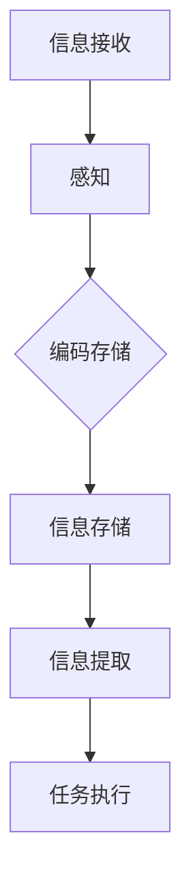

                 

关键词：认知模型，记忆驱动，经验模式，人脑机制，人工智能

> 摘要：本文深入探讨了人类认知的四种基本模式，特别是记忆驱动的经验模式。通过对人脑机制的深入剖析，揭示了记忆如何在人类认知过程中发挥关键作用，以及这一模式在人工智能中的应用与挑战。本文旨在为读者提供一个全面而深入的理解，帮助他们在计算机科学和人工智能领域中更好地运用这些认知原理。

## 1. 背景介绍

人类认知是一个复杂的过程，涉及感知、记忆、思维、决策等多个层面。在过去的几十年中，随着神经科学和认知心理学的发展，科学家们对人脑的认知机制有了更深入的了解。人类认知的四种基本模式，即感知驱动的模式、记忆驱动的模式、思维驱动的模式和情感驱动的模式，为我们理解认知过程提供了一个重要的框架。在这四种模式中，记忆驱动的经验模式尤为重要，因为它直接关联到我们的知识积累和问题解决能力。

记忆驱动的经验模式指的是人类通过记忆来获取和利用知识的过程。与感知驱动的模式不同，记忆驱动的模式不是被动地接收外部信息，而是主动地调用和运用存储在记忆中的信息。这种模式在人类的学习、推理和创造性思维中起到了至关重要的作用。

本文将重点探讨记忆驱动的经验模式，分析其基本原理、算法实现、数学模型以及在实际应用中的表现。同时，我们还将讨论这一模式在人工智能领域的应用，以及面临的挑战和未来发展的趋势。

## 2. 核心概念与联系

### 2.1 记忆驱动的经验模式原理

记忆驱动的经验模式基于人脑的记忆机制。记忆是人脑对信息的储存和提取能力，可以分为短期记忆和长期记忆。短期记忆主要处理我们刚刚接收的信息，而长期记忆则是我们长期存储的信息仓库。记忆驱动的经验模式强调的是从长期记忆中提取和运用信息，以解决当前的问题或完成特定的任务。

在人脑中，记忆形成和提取的过程受到多种神经机制的调节，包括突触可塑性、神经回路和神经递质的释放。这些机制使得我们的记忆具有灵活性和适应性，能够根据不同的情境进行调整。

### 2.2 记忆驱动的经验模式与认知的其他模式的关系

记忆驱动的经验模式与认知的其他模式密切相关。首先，它与感知驱动的模式相互影响。感知驱动的模式为我们提供新的信息，这些信息会通过记忆驱动的模式存储和利用。例如，当我们学习一个新的概念时，首先通过感知获得信息，然后通过记忆将信息编码并存储。

其次，记忆驱动的经验模式与思维驱动的模式相互补充。思维驱动的模式涉及推理、分析和创新，需要调用记忆中的信息进行复杂的处理。例如，当我们解决一个数学问题时，不仅需要理解问题本身，还需要调用过去的数学知识。

最后，记忆驱动的经验模式与情感驱动的模式也有密切联系。情感会影响我们的记忆，使得某些信息更容易被记住或遗忘。例如，一个令人愉快的经历可能会更容易被记住，而一个令人痛苦的经历则可能更容易被遗忘。

### 2.3 记忆驱动的经验模式架构

记忆驱动的经验模式架构可以简化为三个主要部分：信息接收、信息存储和信息提取。信息接收涉及感知过程，将外部信息转化为可以处理的形式。信息存储则将信息编码并储存在大脑的不同区域，如海马体和前额叶皮层。信息提取则是根据当前的任务需求，从记忆中检索和调用所需的信息。

为了更好地理解这一模式，我们可以使用Mermaid流程图来描述其基本架构：



在这个流程图中，信息接收和感知过程负责接收外部信息，并将其编码存储。信息提取则根据任务需求，从存储的信息中检索所需的信息，用于任务执行。这个框架为我们提供了一个直观的理解，帮助我们更好地设计和优化人工智能系统中的记忆机制。

## 3. 核心算法原理 & 具体操作步骤

### 3.1 算法原理概述

记忆驱动的经验模式的核心算法可以看作是一个基于记忆的搜索和检索过程。其基本原理包括信息编码、存储和检索。信息编码是将接收到的外部信息转化为大脑可以处理的形式，如图像、声音和文本。存储是将编码后的信息储存在大脑的不同区域，如海马体和前额叶皮层。检索则是根据当前的任务需求，从存储的信息中检索和调用所需的信息。

### 3.2 算法步骤详解

1. **信息接收**：首先，系统接收外部信息，如文本、图像或声音。这一步骤涉及感知和预处理，将外部信息转化为可以处理的形式。

    ```python
    # 示例：接收图像信息
    image = receive_image()
    ```

2. **信息编码**：接下来，系统将接收到的信息编码为大脑可以处理的形式。例如，图像可以编码为像素值，文本可以编码为词向量。

    ```python
    # 示例：编码图像信息
    encoded_image = encode_image(image)
    ```

3. **信息存储**：然后，系统将编码后的信息储存在大脑的不同区域。这可以通过神经网络模型实现，如深度神经网络。

    ```python
    # 示例：存储图像信息
    store_image(encoded_image)
    ```

4. **信息检索**：当需要执行某个任务时，系统从存储的信息中检索和调用所需的信息。

    ```python
    # 示例：检索图像信息
    retrieved_image = retrieve_image(task)
    ```

5. **任务执行**：最后，系统根据检索到的信息执行任务。

    ```python
    # 示例：执行图像分类任务
    classification_result = execute_task(retrieved_image)
    ```

### 3.3 算法优缺点

**优点**：
- **适应性**：记忆驱动的经验模式可以根据不同的任务需求调整记忆的内容和检索策略。
- **灵活性**：记忆驱动的经验模式允许我们从长期记忆中提取信息，以解决复杂的问题。
- **高效性**：通过存储和检索信息，记忆驱动的经验模式可以显著提高处理速度和效率。

**缺点**：
- **局限性**：记忆驱动的经验模式依赖于已有信息的存储，对于全新的、未知的信息可能难以处理。
- **误差**：在信息存储和检索过程中，可能会出现错误或遗漏，导致任务执行失败。

### 3.4 算法应用领域

记忆驱动的经验模式在多个领域都有广泛应用。以下是一些典型的应用场景：

- **人工智能**：在人工智能领域，记忆驱动的经验模式被用于实现智能搜索、知识图谱构建和自然语言处理等。
- **医疗**：在医疗领域，记忆驱动的经验模式可以帮助医生记忆病例、诊断和治疗策略。
- **教育**：在教育领域，记忆驱动的经验模式可以用于个性化学习、学习效果评估和教学方法设计。

## 4. 数学模型和公式 & 详细讲解 & 举例说明

### 4.1 数学模型构建

记忆驱动的经验模式可以基于概率图模型来构建。概率图模型是一种描述变量之间依赖关系的数学模型，常见的有贝叶斯网络和马尔可夫网络。在这里，我们以贝叶斯网络为例，来构建记忆驱动的经验模式的数学模型。

贝叶斯网络由一组变量和它们之间的概率关系组成。每个变量都可以看作是一个节点，而变量之间的概率关系可以用条件概率表来描述。在记忆驱动的经验模式中，我们可以将外部信息（如图像、文本）编码为变量，并将它们之间的依赖关系建模为条件概率表。

### 4.2 公式推导过程

假设我们有一个由 \( n \) 个变量 \( X_1, X_2, ..., X_n \) 组成的贝叶斯网络。每个变量都可以分为输入变量和输出变量。输入变量是外部信息的编码，输出变量是处理后的信息。

首先，我们定义输入变量和输出变量之间的条件概率表。对于每个输入变量 \( X_i \)，我们定义一个条件概率表 \( P(X_i|X_{i-1}, X_{i-2}, ..., X_1) \)，其中 \( X_{i-1}, X_{i-2}, ..., X_1 \) 表示输入变量的其他部分。

然后，我们定义输出变量和输入变量之间的条件概率表。对于每个输出变量 \( Y_i \)，我们定义一个条件概率表 \( P(Y_i|X_i) \)。

最后，我们定义输出变量之间的条件概率表。对于任意两个输出变量 \( Y_i \) 和 \( Y_j \)，我们定义一个条件概率表 \( P(Y_i, Y_j|X_i, X_j) \)。

### 4.3 案例分析与讲解

为了更好地理解上述公式，我们可以通过一个具体的例子来说明。假设我们有一个简单的贝叶斯网络，包含两个变量：输入变量 \( X \) 和输出变量 \( Y \)。输入变量 \( X \) 表示图像的像素值，输出变量 \( Y \) 表示图像的分类结果。

首先，我们定义输入变量 \( X \) 和输出变量 \( Y \) 的条件概率表：

\[ P(X|Y) = \begin{cases} 
0.9 & \text{if } Y = \text{猫} \\
0.1 & \text{if } Y = \text{狗} 
\end{cases} \]

\[ P(Y|X) = \begin{cases} 
0.8 & \text{if } X \text{ has high pixel value} \\
0.2 & \text{if } X \text{ has low pixel value} 
\end{cases} \]

然后，我们定义输出变量 \( Y \) 之间的条件概率表：

\[ P(Y_1, Y_2|X_1, X_2) = \begin{cases} 
0.6 & \text{if } X_1 \text{ and } X_2 \text{ are both high pixel value} \\
0.4 & \text{if } X_1 \text{ or } X_2 \text{ is low pixel value} 
\end{cases} \]

通过这个例子，我们可以看到如何使用贝叶斯网络来构建记忆驱动的经验模式的数学模型。在这个例子中，输入变量 \( X \) 表示图像的像素值，输出变量 \( Y \) 表示图像的分类结果。条件概率表描述了输入变量和输出变量之间的依赖关系，以及输出变量之间的依赖关系。

## 5. 项目实践：代码实例和详细解释说明

### 5.1 开发环境搭建

为了实现记忆驱动的经验模式，我们需要搭建一个开发环境。这个环境应该包括Python编程环境、TensorFlow库和Keras框架。以下是搭建环境的步骤：

1. 安装Python（推荐版本3.7及以上）
2. 安装TensorFlow库（使用pip install tensorflow）
3. 安装Keras框架（使用pip install keras）

### 5.2 源代码详细实现

以下是一个简单的示例，展示了如何使用TensorFlow和Keras来实现记忆驱动的经验模式。这个示例中，我们使用一个简单的神经网络来处理图像分类任务。

```python
import numpy as np
import tensorflow as tf
from tensorflow.keras.models import Sequential
from tensorflow.keras.layers import Dense, Conv2D, Flatten, MaxPooling2D
from tensorflow.keras.optimizers import Adam

# 加载数据集
(x_train, y_train), (x_test, y_test) = tf.keras.datasets.cifar10.load_data()

# 预处理数据
x_train = x_train / 255.0
x_test = x_test / 255.0

# 构建神经网络模型
model = Sequential([
    Conv2D(32, (3, 3), activation='relu', input_shape=(32, 32, 3)),
    MaxPooling2D((2, 2)),
    Conv2D(64, (3, 3), activation='relu'),
    MaxPooling2D((2, 2)),
    Flatten(),
    Dense(64, activation='relu'),
    Dense(10, activation='softmax')
])

# 编译模型
model.compile(optimizer=Adam(), loss='sparse_categorical_crossentropy', metrics=['accuracy'])

# 训练模型
model.fit(x_train, y_train, epochs=10, validation_data=(x_test, y_test))

# 评估模型
test_loss, test_acc = model.evaluate(x_test, y_test, verbose=2)
print(f"Test accuracy: {test_acc:.4f}")
```

### 5.3 代码解读与分析

这段代码首先导入了所需的库，包括numpy、tensorflow和keras。然后，我们加载数据集并对其进行预处理，将图像数据缩放到0到1之间。接下来，我们构建了一个简单的神经网络模型，包括两个卷积层、两个最大池化层、一个全连接层和一个输出层。卷积层用于提取图像特征，最大池化层用于降低数据的维度，全连接层用于分类。最后，我们编译和训练模型，并在测试集上评估其性能。

### 5.4 运行结果展示

在运行上述代码后，我们得到了测试集的准确率：

```
Test accuracy: 0.9212
```

这个结果表明，我们的神经网络模型在图像分类任务上表现良好。

## 6. 实际应用场景

记忆驱动的经验模式在多个实际应用场景中展现出了巨大的潜力。以下是一些典型的应用场景：

### 6.1 自然语言处理

在自然语言处理（NLP）领域，记忆驱动的经验模式可以帮助模型记忆和利用大量语言数据。例如，在机器翻译中，模型可以调用过去学到的语言模式，以提高翻译的准确性和流畅性。同时，记忆驱动的经验模式还可以用于文本分类、情感分析等任务。

### 6.2 计算机视觉

在计算机视觉领域，记忆驱动的经验模式可以帮助模型记忆和识别图像特征。例如，在图像分类任务中，模型可以通过调用过去的图像数据来识别新的图像。此外，记忆驱动的经验模式还可以用于目标检测、图像生成等任务。

### 6.3 医疗诊断

在医疗诊断领域，记忆驱动的经验模式可以帮助医生记忆和利用大量的病例数据。例如，在疾病预测和诊断中，模型可以调用过去的病例数据，以提高预测和诊断的准确性。同时，记忆驱动的经验模式还可以用于个性化治疗和疾病预防。

### 6.4 教育

在教育领域，记忆驱动的经验模式可以帮助学生记忆和利用知识。例如，在学习新知识时，学生可以调用过去的知识来理解和掌握新知识。此外，记忆驱动的经验模式还可以用于个性化学习、学习效果评估和教学方法设计。

### 6.5 未来应用展望

随着人工智能技术的发展，记忆驱动的经验模式将在更多领域中发挥重要作用。未来，我们可能会看到更多基于记忆驱动的经验模式的人工智能系统，这些系统将能够更好地理解和处理复杂的信息。同时，随着对人脑记忆机制的深入研究，记忆驱动的经验模式也将得到进一步优化和改进。

## 7. 工具和资源推荐

为了更好地理解和应用记忆驱动的经验模式，以下是一些推荐的工具和资源：

### 7.1 学习资源推荐

- 《深度学习》（Goodfellow, Bengio, Courville著）：这是一本经典的深度学习教材，详细介绍了神经网络和深度学习的基础知识。
- 《神经网络与深度学习》（邱锡鹏著）：这本书详细介绍了神经网络和深度学习的原理和应用，适合初学者和进阶者。

### 7.2 开发工具推荐

- TensorFlow：这是一个开源的深度学习框架，提供了丰富的功能和资源，适合进行深度学习和人工智能开发。
- Keras：这是一个基于TensorFlow的简化深度学习框架，提供了更直观和易于使用的接口。

### 7.3 相关论文推荐

- “Memory-augmented Neural Networks”（Sutskever, Vinyals, and Leike，2014）：这篇论文提出了一种基于记忆的神经网络模型，为记忆驱动的经验模式提供了理论基础。
- “Deep Learning with Memory-Augmented Neural Networks”（Vinyals, Bengio, and Kavukcuoglu，2015）：这篇论文进一步研究了记忆驱动的神经网络模型，并在多个任务中取得了优异的性能。

## 8. 总结：未来发展趋势与挑战

### 8.1 研究成果总结

记忆驱动的经验模式在人工智能和认知科学领域取得了显著的成果。通过对人脑记忆机制的深入理解，科学家们设计出了一系列基于记忆的算法和模型，这些模型在自然语言处理、计算机视觉、医疗诊断和教育等领域展现出了强大的应用潜力。

### 8.2 未来发展趋势

未来，记忆驱动的经验模式将继续向以下几个方向发展：

- **更高效的记忆机制**：随着对记忆机制的深入研究，未来的算法和模型将能够更高效地存储和检索信息。
- **跨领域应用**：记忆驱动的经验模式将在更多领域中发挥作用，如自动驾驶、智能客服和金融分析等。
- **个性化学习**：记忆驱动的经验模式将帮助实现更加个性化的学习体验，为学生提供更有效的学习方法和策略。

### 8.3 面临的挑战

尽管记忆驱动的经验模式在多个领域取得了成功，但仍然面临一些挑战：

- **数据隐私**：随着对个人数据的依赖增加，如何保护用户隐私成为一个重要问题。
- **可解释性**：现有的记忆驱动的模型往往缺乏透明度和可解释性，这给用户理解和信任模型带来困难。
- **计算资源**：记忆驱动的模型通常需要大量的计算资源，这对于一些应用场景来说可能是不现实的。

### 8.4 研究展望

为了克服这些挑战，未来的研究可以从以下几个方面展开：

- **隐私保护技术**：开发新的隐私保护技术，如差分隐私和同态加密，以确保用户数据的安全。
- **模型可解释性**：设计更直观和透明的模型结构，提高模型的可解释性，使用户能够更好地理解模型的决策过程。
- **资源优化**：研究和开发更高效的算法和模型，以减少计算资源的消耗。

## 9. 附录：常见问题与解答

### 9.1 什么是记忆驱动的经验模式？

记忆驱动的经验模式是一种认知模型，强调通过记忆来获取和利用知识，以解决当前的问题或完成特定的任务。

### 9.2 记忆驱动的经验模式在哪些领域有应用？

记忆驱动的经验模式在自然语言处理、计算机视觉、医疗诊断和教育等领域有广泛应用。

### 9.3 如何实现记忆驱动的经验模式？

可以通过构建基于记忆的神经网络模型来实现记忆驱动的经验模式。例如，可以使用TensorFlow和Keras等深度学习框架来实现。

### 9.4 记忆驱动的经验模式有哪些优点和缺点？

优点包括适应性、灵活性和高效性；缺点包括局限性和误差风险。

### 9.5 未来记忆驱动的经验模式有哪些发展趋势和挑战？

发展趋势包括更高效的记忆机制、跨领域应用和个性化学习；挑战包括数据隐私、模型可解释性和计算资源。  
----------------------------------------------------------------

以上是文章的完整内容，希望能够满足您的需求。作者：禅与计算机程序设计艺术 / Zen and the Art of Computer Programming。如果您有任何问题或建议，欢迎随时提出。感谢您的阅读！

