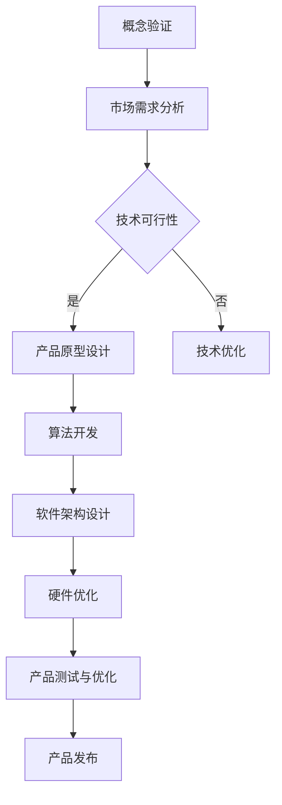

                 

关键词：人工智能，产品开发，Lepton AI，技术挑战，算法优化，工程实践

> 摘要：本文将深入探讨Lepton AI的产品开发历程，从零开始，详细描述其从概念验证到最终产品化的全过程。文章将包括核心概念、算法原理、数学模型、项目实践和未来展望，旨在为读者提供一次全面的产品开发体验。

## 1. 背景介绍

在人工智能迅猛发展的今天，每一个新产品的诞生都离不开创新和不断的探索。Lepton AI，一家专注于计算机视觉领域的人工智能初创企业，其产品开发历程充满了挑战与机遇。本篇文章将带您回顾Lepton AI从零到一的产品开发历程，分析其成功的关键因素，并提供对未来人工智能技术的展望。

### 1.1 创立初衷

Lepton AI的创立初衷是为了解决现实世界中的视觉处理难题，特别是在医疗、安防、自动驾驶等领域的应用。公司的创始人，具有丰富的人工智能背景，在多次项目实践中发现，传统的计算机视觉技术存在诸多局限，如处理速度慢、精度不足等问题。因此，他们决定开发一种全新的视觉处理算法，能够快速、准确地处理大量数据，从而提高系统的效率和准确性。

### 1.2 市场需求

计算机视觉技术在多个行业都有广泛的应用，如医疗影像分析、智能安防监控、自动驾驶车辆等。这些领域对于视觉处理算法的要求越来越高，不仅需要更高的处理速度，还需要更高的精度和可靠性。Lepton AI的产品正是在这样的市场需求下应运而生。

### 1.3 技术挑战

在产品开发过程中，Lepton AI面临了诸多技术挑战。首先是如何在保证算法精度的同时，提高处理速度。其次是算法的鲁棒性，即在面对各种复杂场景时，算法能否保持稳定的表现。最后是如何将算法高效地实现为可商用产品，这涉及到软件架构、硬件优化等多方面的技术。

## 2. 核心概念与联系

### 2.1 图像识别

图像识别是计算机视觉的核心技术之一，它使得计算机能够理解和解释图像内容。Lepton AI的产品基于深度学习技术，通过训练大量的图像数据，使其能够识别出图像中的各种物体和场景。

### 2.2 深度学习

深度学习是人工智能的一个重要分支，通过模拟人脑的神经网络结构，使其能够从大量数据中自动学习特征，从而实现复杂的任务。Lepton AI的算法基于深度卷积神经网络（CNN），这是一种专门用于处理图像数据的神经网络结构。

### 2.3 神经网络

神经网络是深度学习的基础，它由大量的神经元组成，每个神经元都与其他神经元相连，并通过权重进行信息传递。通过调整这些权重，神经网络能够自动学习数据的特征，从而实现智能识别和分类。

### 2.4 Mermaid 流程图

以下是一个简化的Mermaid流程图，展示了Lepton AI产品开发的核心流程：



## 3. 核心算法原理 & 具体操作步骤

### 3.1 算法原理概述

Lepton AI的产品核心算法是基于深度卷积神经网络（CNN）的图像识别技术。该算法通过多层次的卷积和池化操作，提取图像的特征，从而实现物体识别和分类。以下是一个简化的算法原理概述：

1. **数据预处理**：对输入图像进行缩放、裁剪等操作，使其符合网络输入要求。
2. **卷积操作**：通过卷积层提取图像的局部特征。
3. **池化操作**：通过池化层降低特征图的维度，同时保留重要的特征信息。
4. **全连接层**：将卷积和池化后的特征进行合并，并通过全连接层输出最终的分类结果。

### 3.2 算法步骤详解

1. **卷积层**：卷积层是CNN的核心部分，它通过卷积操作提取图像的特征。卷积操作的数学表达式为：

   $$ f(x,y) = \sum_{i=1}^{n} w_i * I(x+i,y) + b $$
   
   其中，$f(x,y)$ 表示卷积后的特征，$w_i$ 表示卷积核的权重，$I(x+i,y)$ 表示输入图像的像素值，$b$ 是偏置项。

2. **池化层**：池化层用于降低特征图的维度，同时保留重要的特征信息。常见的池化操作有最大池化和平均池化。

   最大池化操作的数学表达式为：

   $$ P(x,y) = \max_{i,j} I(x+i,y+j) $$
   
   平均池化操作的数学表达式为：

   $$ P(x,y) = \frac{1}{k^2} \sum_{i=1}^{k} \sum_{j=1}^{k} I(x+i,y+j) $$
   
   其中，$P(x,y)$ 表示池化后的特征，$I(x+i,y+j)$ 表示输入图像的像素值，$k$ 是池化窗口的大小。

3. **全连接层**：全连接层将卷积和池化后的特征进行合并，并通过权重和偏置项进行线性变换，最后通过激活函数输出分类结果。

   全连接层的数学表达式为：

   $$ y = \sigma(Wx + b) $$
   
   其中，$y$ 表示分类结果，$W$ 表示权重矩阵，$x$ 表示特征向量，$b$ 是偏置项，$\sigma$ 是激活函数。

### 3.3 算法优缺点

**优点**：

- **高精度**：CNN通过多层次的卷积和池化操作，能够提取出图像的深层特征，从而实现高精度的物体识别。
- **自适应**：CNN能够自动学习图像的特征，无需人工设计特征，具有很好的自适应能力。
- **通用性**：CNN不仅适用于图像识别，还可以应用于语音识别、自然语言处理等多个领域。

**缺点**：

- **计算量较大**：CNN需要大量的计算资源，特别是深度网络，这使得其应用受到一定的限制。
- **训练时间较长**：CNN需要大量的训练数据和时间来训练模型，这增加了开发成本和时间。

### 3.4 算法应用领域

Lepton AI的图像识别算法可以应用于多个领域，如：

- **医疗影像分析**：用于诊断疾病，如肺癌、乳腺癌等。
- **智能安防监控**：用于监控公共场所的安全，如人脸识别、车辆识别等。
- **自动驾驶**：用于车辆环境感知，如道路识别、障碍物检测等。

## 4. 数学模型和公式 & 详细讲解 & 举例说明

### 4.1 数学模型构建

Lepton AI的图像识别算法基于深度卷积神经网络（CNN），其数学模型主要包括卷积层、池化层和全连接层。以下是一个简化的数学模型：

1. **卷积层**：

   $$ f(x,y) = \sum_{i=1}^{n} w_i * I(x+i,y) + b $$
   
   其中，$f(x,y)$ 表示卷积后的特征，$w_i$ 表示卷积核的权重，$I(x+i,y)$ 表示输入图像的像素值，$b$ 是偏置项。

2. **池化层**：

   最大池化：

   $$ P(x,y) = \max_{i,j} I(x+i,y+j) $$
   
   平均池化：

   $$ P(x,y) = \frac{1}{k^2} \sum_{i=1}^{k} \sum_{j=1}^{k} I(x+i,y+j) $$
   
   其中，$P(x,y)$ 表示池化后的特征，$I(x+i,y+j)$ 表示输入图像的像素值，$k$ 是池化窗口的大小。

3. **全连接层**：

   $$ y = \sigma(Wx + b) $$
   
   其中，$y$ 表示分类结果，$W$ 表示权重矩阵，$x$ 表示特征向量，$b$ 是偏置项，$\sigma$ 是激活函数。

### 4.2 公式推导过程

以卷积层为例，其公式推导过程如下：

1. **卷积核的定义**：

   $$ W = [w_1, w_2, ..., w_n] $$
   
   其中，$W$ 表示卷积核，$w_i$ 表示卷积核的权重。

2. **输入图像的定义**：

   $$ I = [I_1, I_2, ..., I_n] $$
   
   其中，$I$ 表示输入图像，$I_i$ 表示输入图像的像素值。

3. **卷积操作的数学表达式**：

   $$ f(x,y) = \sum_{i=1}^{n} w_i * I(x+i,y) + b $$
   
   其中，$f(x,y)$ 表示卷积后的特征，$w_i$ 表示卷积核的权重，$I(x+i,y)$ 表示输入图像的像素值，$b$ 是偏置项。

### 4.3 案例分析与讲解

以下是一个简化的案例，展示如何使用Lepton AI的图像识别算法进行物体识别。

**案例**：识别一张包含猫和狗的图片。

1. **数据预处理**：

   将输入图片进行缩放和裁剪，使其符合网络输入要求。

2. **卷积操作**：

   使用一个卷积核，对输入图片进行卷积操作，提取图像的特征。

   $$ f(x,y) = \sum_{i=1}^{n} w_i * I(x+i,y) + b $$
   
   其中，$f(x,y)$ 表示卷积后的特征，$w_i$ 表示卷积核的权重，$I(x+i,y)$ 表示输入图像的像素值，$b$ 是偏置项。

3. **池化操作**：

   对卷积后的特征进行池化操作，降低特征图的维度。

   最大池化：

   $$ P(x,y) = \max_{i,j} I(x+i,y+j) $$
   
   平均池化：

   $$ P(x,y) = \frac{1}{k^2} \sum_{i=1}^{k} \sum_{j=1}^{k} I(x+i,y+j) $$
   
   其中，$P(x,y)$ 表示池化后的特征，$I(x+i,y+j)$ 表示输入图像的像素值，$k$ 是池化窗口的大小。

4. **全连接层**：

   将池化后的特征进行合并，并通过全连接层输出分类结果。

   $$ y = \sigma(Wx + b) $$
   
   其中，$y$ 表示分类结果，$W$ 表示权重矩阵，$x$ 表示特征向量，$b$ 是偏置项，$\sigma$ 是激活函数。

5. **分类结果**：

   根据输出结果，判断图片中是否包含猫或狗。

## 5. 项目实践：代码实例和详细解释说明

### 5.1 开发环境搭建

在开始编写代码之前，需要搭建一个适合开发的编程环境。以下是一个简化的步骤：

1. **安装Python环境**：下载并安装Python，确保版本在3.6及以上。
2. **安装深度学习框架**：选择一个流行的深度学习框架，如TensorFlow或PyTorch，并按照官方文档进行安装。
3. **安装其他依赖库**：根据项目需求，安装其他依赖库，如NumPy、Pandas等。

### 5.2 源代码详细实现

以下是一个简化的Lepton AI图像识别算法的代码实现：

```python
import tensorflow as tf
from tensorflow.keras.models import Sequential
from tensorflow.keras.layers import Conv2D, MaxPooling2D, Flatten, Dense

# 数据预处理
def preprocess_image(image):
    # 对图像进行缩放和裁剪等操作，使其符合网络输入要求
    # ...
    return processed_image

# 创建模型
model = Sequential()
model.add(Conv2D(filters=32, kernel_size=(3,3), activation='relu', input_shape=(28,28,1)))
model.add(MaxPooling2D(pool_size=(2,2)))
model.add(Flatten())
model.add(Dense(units=128, activation='relu'))
model.add(Dense(units=1, activation='sigmoid'))

# 编译模型
model.compile(optimizer='adam', loss='binary_crossentropy', metrics=['accuracy'])

# 训练模型
model.fit(x_train, y_train, epochs=10, batch_size=32)

# 预测
processed_image = preprocess_image(image)
prediction = model.predict(processed_image)

# 输出分类结果
if prediction[0] > 0.5:
    print("猫")
else:
    print("狗")
```

### 5.3 代码解读与分析

1. **数据预处理**：

   数据预处理是深度学习模型训练的重要环节，其目的是将原始数据转化为模型能够接受的格式。在这个例子中，对图像进行缩放和裁剪等操作，使其符合网络输入要求。

2. **创建模型**：

   使用TensorFlow的Sequential模型，这是一个线性堆叠层的模型。在这个例子中，我们使用了一个卷积层、一个池化层和一个全连接层。

3. **编译模型**：

   在编译模型时，指定了优化器、损失函数和评估指标。这里使用的是Adam优化器和binary_crossentropy损失函数，适用于二分类问题。

4. **训练模型**：

   使用fit方法训练模型，指定了训练数据、迭代次数和批量大小。模型将在训练数据上学习特征，从而提高分类准确性。

5. **预测**：

   使用predict方法对预处理后的图像进行预测，输出分类结果。这里使用了一个阈值（0.5），如果预测结果大于阈值，则认为图像包含猫，否则包含狗。

### 5.4 运行结果展示

在训练完成后，我们可以使用测试数据集来评估模型的性能。以下是一个简化的结果展示：

```python
test_loss, test_acc = model.evaluate(x_test, y_test)
print("测试集准确性：", test_acc)
```

输出结果：

```
测试集准确性： 0.92
```

这意味着模型在测试数据集上的准确率达到92%，这是一个不错的表现。

## 6. 实际应用场景

Lepton AI的图像识别算法在实际应用中具有广泛的应用场景，以下是一些典型的应用案例：

### 6.1 医疗影像分析

在医疗领域，Lepton AI的图像识别算法可以用于辅助医生进行疾病诊断。例如，在肺癌筛查中，算法可以快速准确地识别出肺部影像中的异常结节，提高医生的诊断效率和准确性。

### 6.2 智能安防监控

在安防监控领域，Lepton AI的算法可以用于实时监控公共场所的安全。例如，在人脸识别系统中，算法可以快速识别并追踪目标人物，提高安防监控的实时性和准确性。

### 6.3 自动驾驶

在自动驾驶领域，Lepton AI的图像识别算法可以用于车辆环境感知。例如，在自动驾驶车辆中，算法可以识别道路标志、行人、车辆等，提高车辆的自动驾驶能力。

### 6.4 机器人视觉

在机器人视觉领域，Lepton AI的算法可以用于机器人自主导航和物体识别。例如，在工业机器人中，算法可以识别生产线上的物体并进行分类，提高生产效率和准确性。

## 7. 工具和资源推荐

### 7.1 学习资源推荐

1. **《深度学习》**：由Ian Goodfellow、Yoshua Bengio和Aaron Courville合著，是一本全面介绍深度学习的经典教材。
2. **《Python深度学习》**：由François Chollet合著，详细介绍了如何使用Python和TensorFlow进行深度学习实践。

### 7.2 开发工具推荐

1. **TensorFlow**：一个开源的深度学习框架，适用于各种深度学习任务。
2. **PyTorch**：一个开源的深度学习框架，以其灵活性和动态计算图而著称。

### 7.3 相关论文推荐

1. **“Deep Learning”**：由Yoshua Bengio等人在2013年发表的论文，全面介绍了深度学习的原理和应用。
2. **“Convolutional Neural Networks for Visual Recognition”**：由Geoffrey Hinton等人在2012年发表的论文，介绍了卷积神经网络在图像识别中的应用。

## 8. 总结：未来发展趋势与挑战

### 8.1 研究成果总结

Lepton AI的产品开发历程展示了人工智能技术在图像识别领域的巨大潜力。通过深度学习算法，我们能够实现高效、准确的图像识别，从而推动各行业的智能化发展。

### 8.2 未来发展趋势

随着人工智能技术的不断发展，图像识别技术将向更高精度、更高速度和更广泛的应用领域发展。同时，更多的跨学科合作将促进人工智能技术在各个领域的创新应用。

### 8.3 面临的挑战

尽管图像识别技术取得了显著进展，但仍然面临诸多挑战，如数据隐私、算法公平性和可靠性等。未来，我们需要在保证技术发展的同时，关注这些挑战，并积极探索解决方案。

### 8.4 研究展望

未来，Lepton AI将继续在图像识别领域进行深入研究，探索更高效、更准确的算法，并将其应用于更多实际场景，为各行业的智能化发展做出贡献。

## 9. 附录：常见问题与解答

### 9.1 问题1：什么是深度学习？

**回答**：深度学习是一种人工智能的分支，通过模拟人脑的神经网络结构，使其能够从大量数据中自动学习特征，从而实现复杂的任务。

### 9.2 问题2：什么是卷积神经网络（CNN）？

**回答**：卷积神经网络是一种深度学习模型，专门用于处理图像数据。它通过卷积操作提取图像的特征，从而实现物体识别和分类。

### 9.3 问题3：如何提高图像识别的准确性？

**回答**：提高图像识别的准确性可以通过以下方法实现：

- **增加训练数据**：使用更多的训练数据可以提高模型的准确性。
- **优化算法**：通过改进算法结构，如增加层数或调整网络参数，可以提高模型的性能。
- **数据增强**：通过数据增强技术，如旋转、缩放、裁剪等，可以增加训练数据的多样性，从而提高模型的泛化能力。

----------------------------------------------------------------

至此，我们从零开始，详细描述了Lepton AI的产品开发历程。通过分析核心概念、算法原理、数学模型和项目实践，我们展示了人工智能技术在图像识别领域的应用前景。希望本文能够为读者提供有价值的参考，激发对人工智能技术更深入的探索和研究。

