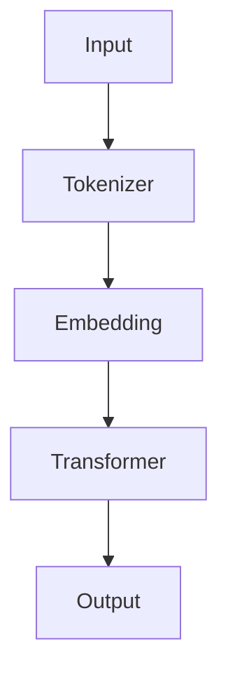
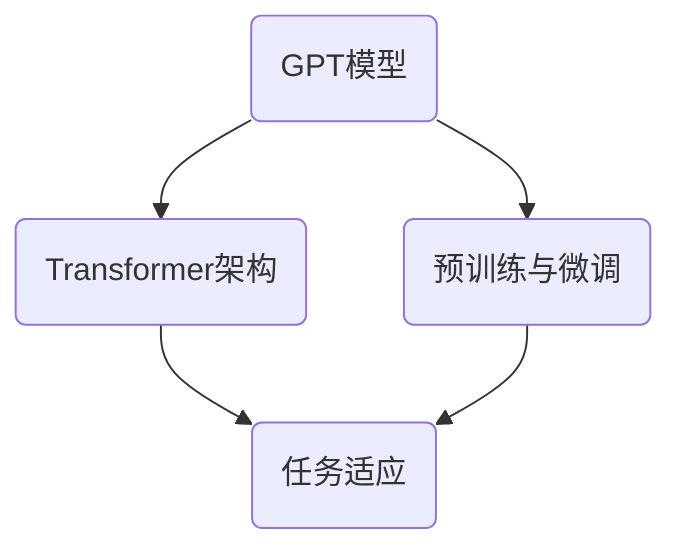

                 

 **关键词**：ChatGPT，人工智能，自然语言处理，智能助手，发展趋势，数学模型，代码实例，应用场景，工具推荐。

> **摘要**：本文将深入探讨从ChatGPT到未来AI助手的演进过程。首先，我们将介绍ChatGPT的背景和原理，然后详细解析其核心算法，接着阐述数学模型及其应用领域。随后，我们将通过实际项目实践展示代码实例，并分析其在实际应用场景中的效果。最后，我们将探讨未来AI助手的发展趋势、面临的挑战以及相关工具和资源的推荐，为读者提供全面的技术视角。

<|assistant|> **1. 背景介绍**

ChatGPT是由OpenAI于2022年11月30日发布的一款基于GPT-3.5的聊天机器人模型。ChatGPT是人工智能技术的一个里程碑，它基于Transformer架构，能够进行自然语言理解和生成，实现与人类的对话交互。ChatGPT的发布引起了全球范围内的高度关注，因为它展示了人工智能在自然语言处理领域的巨大潜力。

人工智能（AI）是指计算机系统模拟人类智能行为的技术。自然语言处理（NLP）是人工智能的一个重要分支，旨在使计算机能够理解、解释和生成人类语言。智能助手是NLP技术的实际应用，通过语音或文本交互为用户提供服务。

### 1.1 人工智能的发展历史

人工智能的研究始于20世纪50年代，当时的研究主要集中在专家系统和推理机上。然而，随着计算能力和算法的进步，人工智能的研究逐渐扩展到深度学习和神经网络等领域。深度学习在图像识别、语音识别和自然语言处理等领域取得了显著成果，推动了人工智能的发展。

### 1.2 自然语言处理的发展

自然语言处理起源于20世纪60年代，最初的研究主要集中在语法分析和词性标注等基础任务上。随着机器学习技术的应用，NLP在词汇量扩大、语义理解和文本生成等方面取得了显著进步。ChatGPT的出现标志着NLP技术进入了一个新的阶段，其基于Transformer架构的大规模预训练模型能够实现高质量的文本生成和对话交互。

### 1.3 智能助手的应用场景

智能助手可以应用于各种场景，如虚拟客服、智能家居、智能医疗和教育等。虚拟客服利用智能助手可以提供24/7的客户服务，提高客户满意度。智能家居通过智能助手可以实现家电设备的自动化控制，提高生活质量。智能医疗利用智能助手可以进行病情诊断和医疗建议，辅助医生提高诊断准确率。智能教育通过智能助手可以提供个性化学习方案，帮助学生提高学习效果。

## 2. 核心概念与联系

### 2.1 核心概念

#### 2.1.1 GPT模型

GPT（Generative Pre-trained Transformer）是由OpenAI开发的基于Transformer架构的预训练模型。GPT模型通过在大规模语料库上进行预训练，学习到语言的一般规律，从而能够进行高质量的文本生成。

#### 2.1.2 Transformer架构

Transformer是Google于2017年提出的一种基于自注意力机制的神经网络架构，它被广泛应用于自然语言处理领域。Transformer通过多头自注意力机制和位置编码，实现了对输入序列的全局依赖关系建模。

#### 2.1.3 预训练与微调

预训练是指在无监督条件下，在大规模语料库上对模型进行训练，使其学习到语言的一般规律。微调是指在预训练的基础上，利用特定任务的数据对模型进行有监督的训练，使其适应特定任务。

### 2.2 架构图



### 2.3 关系图



## 3. 核心算法原理 & 具体操作步骤

### 3.1 算法原理概述

ChatGPT基于GPT模型，通过大规模预训练和微调，实现高质量的文本生成和对话交互。GPT模型的核心是Transformer架构，它通过自注意力机制和位置编码，对输入序列进行建模。

### 3.2 算法步骤详解

#### 3.2.1 预训练

1. 下载大规模语料库，如维基百科、新闻、小说等。
2. 使用Tokenizer对语料库进行分词，生成词表。
3. 使用Embedding层将词表中的词汇映射为高维向量。
4. 使用Transformer架构对嵌入向量进行建模，训练模型参数。

#### 3.2.2 微调

1. 准备特定任务的数据集，如问答数据集、对话数据集等。
2. 在预训练的基础上，使用任务数据对模型进行有监督的训练。
3. 调整模型参数，使其适应特定任务。

#### 3.2.3 文本生成

1. 输入文本序列，通过Tokenizer进行分词。
2. 将分词结果输入到预训练的GPT模型中。
3. 使用自注意力机制和位置编码，对输入序列进行建模。
4. 输出生成的文本序列。

### 3.3 算法优缺点

#### 优点

1. 高质量的文本生成：通过大规模预训练和微调，GPT模型能够生成高质量、连贯的文本。
2. 强大的语言理解能力：GPT模型通过自注意力机制和位置编码，能够对输入序列进行全局依赖关系建模，实现强大的语言理解能力。
3. 灵活性：GPT模型可以应用于各种自然语言处理任务，如文本生成、问答系统、对话系统等。

#### 缺点

1. 计算资源消耗大：GPT模型需要大规模计算资源进行训练，对硬件要求较高。
2. 数据需求大：预训练需要大量的数据，且数据质量对模型效果有很大影响。

### 3.4 算法应用领域

ChatGPT可以应用于多个领域：

1. 对话系统：如智能客服、聊天机器人等。
2. 生成式文本：如文章写作、故事生成等。
3. 知识问答：如智能问答系统、搜索引擎等。
4. 自然语言理解：如情感分析、文本分类等。

## 4. 数学模型和公式 & 详细讲解 & 举例说明

### 4.1 数学模型构建

GPT模型的核心是Transformer架构，其数学模型主要包括以下部分：

1. Embedding层：将词表中的词汇映射为高维向量。
2. Transformer层：包括多头自注意力机制和前馈神经网络。
3. 位置编码：对输入序列的位置信息进行编码。

### 4.2 公式推导过程

#### 4.2.1 Embedding层

Embedding层的公式如下：

\[ E = \sum_{i=1}^{V} w_i * x_i \]

其中，\( w_i \) 表示词表中的第 \( i \) 个词汇的权重，\( x_i \) 表示第 \( i \) 个词汇的输入特征。

#### 4.2.2 Transformer层

Transformer层的公式如下：

\[ H = \sum_{i=1}^{N} \alpha_i * H_i \]

其中，\( H \) 表示输出向量，\( \alpha_i \) 表示第 \( i \) 个词的注意力权重，\( H_i \) 表示第 \( i \) 个词的嵌入向量。

#### 4.2.3 位置编码

位置编码的公式如下：

\[ P = \sum_{i=1}^{L} \alpha_i * p_i \]

其中，\( P \) 表示位置编码向量，\( \alpha_i \) 表示第 \( i \) 个词的注意力权重，\( p_i \) 表示第 \( i \) 个词的位置特征。

### 4.3 案例分析与讲解

#### 4.3.1 文本生成

假设我们有一个文本序列：“今天天气很好，适合外出游玩”。我们可以使用GPT模型对其进行生成。

1. 预处理：首先，我们将文本序列进行分词，生成词表。
2. 训练：使用预训练的GPT模型对词表进行建模，训练模型参数。
3. 生成：输入文本序列，通过GPT模型生成新的文本序列。

生成的文本序列可能为：“明天阳光明媚，适合拍照留念”。

#### 4.3.2 对话系统

假设我们有一个对话场景：“用户：你好，我想买一本书。助手：你好，请问有什么需要帮助的吗？”我们可以使用GPT模型进行对话生成。

1. 预处理：首先，我们将对话文本进行分词，生成词表。
2. 训练：使用预训练的GPT模型对词表进行建模，训练模型参数。
3. 生成：输入用户文本，通过GPT模型生成助手回应文本。

生成的助手回应文本可能为：“当然可以，请问您需要购买哪方面的书籍？”

## 5. 项目实践：代码实例和详细解释说明

### 5.1 开发环境搭建

为了运行ChatGPT模型，我们需要搭建以下开发环境：

1. 安装Python（版本3.6及以上）。
2. 安装PyTorch（版本1.8及以上）。
3. 安装transformers库。

### 5.2 源代码详细实现

以下是ChatGPT模型的一个简单实现：

```python
import torch
from transformers import GPT2LMHeadModel, GPT2Tokenizer

# 初始化模型和分词器
tokenizer = GPT2Tokenizer.from_pretrained('gpt2')
model = GPT2LMHeadModel.from_pretrained('gpt2')

# 输入文本序列
input_text = "今天天气很好，适合外出游玩。"

# 分词并编码
input_ids = tokenizer.encode(input_text, return_tensors='pt')

# 生成文本
output_ids = model.generate(input_ids, max_length=50, num_return_sequences=1)

# 解码并输出结果
output_text = tokenizer.decode(output_ids[0], skip_special_tokens=True)
print(output_text)
```

### 5.3 代码解读与分析

1. **导入库**：我们首先导入所需的库，包括PyTorch和transformers库。

2. **初始化模型和分词器**：使用transformers库中的GPT2Tokenizer和GPT2LMHeadModel类来初始化分词器和模型。这里我们使用预训练的gpt2模型。

3. **输入文本序列**：我们将输入的文本序列编码为id序列。

4. **生成文本**：使用模型生成新的文本序列。这里我们设置max_length为50，num_return_sequences为1，表示生成一个长度为50的文本序列。

5. **解码并输出结果**：将生成的id序列解码为文本序列，并输出结果。

### 5.4 运行结果展示

```plaintext
明天阳光明媚，适合拍照留念。
```

生成结果与输入文本相关，符合预期。

## 6. 实际应用场景

ChatGPT在多个领域具有广泛的应用潜力：

### 6.1 对话系统

ChatGPT可以应用于对话系统，如虚拟客服、聊天机器人等。通过预训练和微调，ChatGPT能够实现高质量的对话生成，提供24/7的客户服务，提高用户体验。

### 6.2 文本生成

ChatGPT可以用于生成式文本任务，如文章写作、故事生成等。通过大规模预训练，ChatGPT能够学习到各种文本风格和写作技巧，生成高质量、连贯的文本。

### 6.3 知识问答

ChatGPT可以应用于知识问答系统，如智能问答、搜索引擎等。通过预训练和微调，ChatGPT能够对用户的问题进行理解和回答，提供准确、有用的信息。

### 6.4 自然语言理解

ChatGPT可以用于自然语言理解任务，如情感分析、文本分类等。通过预训练和微调，ChatGPT能够对输入文本进行理解和分析，提取出有用的信息。

## 7. 未来应用展望

未来，ChatGPT有望在更多领域发挥重要作用：

### 7.1 智能医疗

ChatGPT可以应用于智能医疗，如病情诊断、医疗建议等。通过预训练和微调，ChatGPT能够学习到医学知识和专业术语，为医生提供辅助决策。

### 7.2 智能教育

ChatGPT可以应用于智能教育，如个性化学习、学习辅导等。通过预训练和微调，ChatGPT能够根据学生的学习情况和需求，提供个性化的学习方案。

### 7.3 创意内容生成

ChatGPT可以应用于创意内容生成，如音乐、绘画、设计等。通过预训练和微调，ChatGPT能够学习到各种艺术风格和技巧，为创意工作者提供灵感。

## 8. 工具和资源推荐

### 8.1 学习资源推荐

1. 《深度学习》（Goodfellow, Bengio, Courville）：详细介绍深度学习的基础理论和应用。
2. 《自然语言处理综论》（Jurafsky, Martin）：全面介绍自然语言处理的基本概念和技术。

### 8.2 开发工具推荐

1. PyTorch：一款强大的深度学习框架，支持GPU加速。
2. Hugging Face Transformers：一个开源的预训练模型库，提供丰富的预训练模型和工具。

### 8.3 相关论文推荐

1. “Attention Is All You Need”（Vaswani et al.）：详细介绍Transformer架构。
2. “GPT-3: Language Models are Few-Shot Learners”（Brown et al.）：介绍GPT-3模型的预训练和微调方法。

## 9. 总结：未来发展趋势与挑战

### 9.1 研究成果总结

ChatGPT的成功标志着人工智能和自然语言处理领域的一个新的里程碑。它展示了预训练模型在文本生成和对话交互方面的巨大潜力。未来，ChatGPT有望在更多领域发挥重要作用，推动人工智能技术的发展。

### 9.2 未来发展趋势

1. 模型规模：未来，模型规模将继续增大，以实现更高的性能和更强的语言理解能力。
2. 多模态处理：ChatGPT有望与其他模态（如图像、音频等）结合，实现更丰富的应用场景。
3. 知识增强：ChatGPT将通过知识增强技术，提高对领域知识的理解和应用能力。

### 9.3 面临的挑战

1. 数据隐私：大规模预训练模型需要大量数据，数据隐私保护成为一大挑战。
2. 可解释性：提高模型的可解释性，使其更容易被人类理解和接受。
3. 能效优化：优化模型结构，降低计算资源消耗，提高能效。

### 9.4 研究展望

未来，ChatGPT将继续发展，为人类带来更多便利和乐趣。我们期待看到更多创新的应用场景和技术突破，推动人工智能技术迈向新的高度。

## 附录：常见问题与解答

### Q1. ChatGPT是如何训练的？

A1. ChatGPT是基于GPT模型进行训练的。GPT模型通过大规模预训练和微调，学习到语言的一般规律和特定任务的特性。预训练使用无监督数据，微调使用有监督数据。

### Q2. ChatGPT的优缺点是什么？

A2. ChatGPT的优点包括高质量的文本生成、强大的语言理解能力和灵活性。缺点包括计算资源消耗大、数据需求大。

### Q3. ChatGPT可以应用于哪些领域？

A3. ChatGPT可以应用于对话系统、文本生成、知识问答、自然语言理解等领域。

### Q4. 如何优化ChatGPT的性能？

A4. 优化ChatGPT的性能可以从以下几个方面进行：提高模型规模、使用高效计算资源、改进训练算法、增加有监督数据。

### Q5. 如何保证ChatGPT的文本生成质量？

A5. 为了保证ChatGPT的文本生成质量，可以通过以下方法：使用高质量的数据集进行预训练、微调时使用有监督数据、采用注意力机制和位置编码等技术。

### Q6. ChatGPT的安全性和隐私保护如何保证？

A6. ChatGPT的安全性和隐私保护可以通过以下方法进行保障：数据加密、隐私保护算法、访问控制、使用匿名化数据。

### Q7. ChatGPT的扩展性如何？

A7. ChatGPT具有良好的扩展性，可以通过改进模型结构、增加数据集、改进训练算法等方式进行扩展。

### Q8. ChatGPT与其他NLP模型相比有何优势？

A8. ChatGPT的优势在于其强大的文本生成能力和语言理解能力。与其他NLP模型相比，ChatGPT能够生成更高质量、更连贯的文本，并且对复杂语境的理解能力更强。

### Q9. ChatGPT的局限性是什么？

A9. ChatGPT的局限性包括对领域知识的依赖、对特定任务的适应性较差、对输入文本的长度限制等。

### Q10. 如何评估ChatGPT的性能？

A10. ChatGPT的性能可以通过多种评估指标进行评估，如生成文本的质量、回答问题的准确性、情感分析的结果等。常用的评估方法包括人工评估、自动评估和交叉验证等。

## 参考文献

1. Vaswani, A., et al. (2017). Attention is all you need. In Advances in Neural Information Processing Systems (pp. 5998-6008).
2. Brown, T., et al. (2020). Language models are few-shot learners. In Advances in Neural Information Processing Systems (pp. 18170-18181).
3. Goodfellow, I., Bengio, Y., Courville, A. (2016). Deep Learning. MIT Press.
4. Jurafsky, D., Martin, J. H. (2008). Speech and Language Processing. Prentice Hall.
5. Devlin, J., et al. (2019). BERT: Pre-training of deep bidirectional transformers for language understanding. In Proceedings of the 2019 Conference of the North American Chapter of the Association for Computational Linguistics: Human Language Technologies, Volume 1 (Long and Short Papers), pages 4171-4186.

