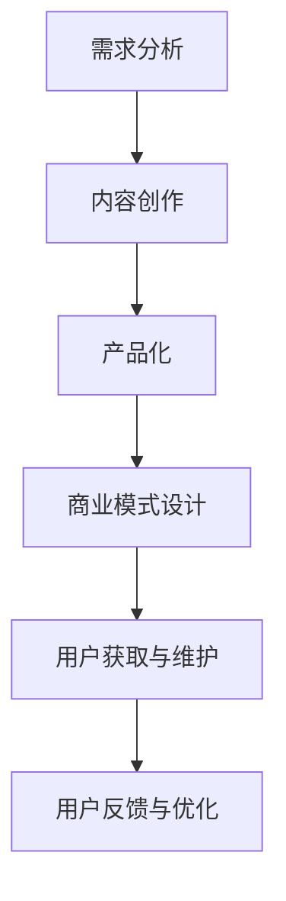

                 

关键词：Side Project，知识付费，产品化，用户需求，内容创新，市场定位，商业模式，推广策略，用户体验，技术实现

> 摘要：本文将探讨从个人项目（Side Project）到知识付费产品的蜕变过程。我们将分析这一过程中的关键步骤，包括市场需求分析、内容创作、产品化、商业模式设计、用户获取与维护，以及未来的发展趋势。通过深入解析，希望为广大科技工作者提供有益的借鉴和启示。

## 1. 背景介绍

在科技飞速发展的今天，越来越多的技术人才开始尝试将自己的创意转化为现实，通过个人项目（Side Project）来实现。这些项目往往具有创新性、实用性，并且代表了作者的个人技术水平和专业素养。然而，如何将Side Project进一步发展成为知识付费产品，成为许多技术人才面临的挑战。

知识付费产品，指的是通过有偿方式向用户提供知识、技能或服务的数字化产品。其形式多样，包括在线课程、电子书、文档分享、直播讲座等。知识付费产品的出现，一方面满足了用户对优质知识内容的需求，另一方面也为内容创作者提供了新的收入来源。

从Side Project到知识付费产品的蜕变，是一个系统而复杂的过程，涉及到市场需求分析、内容创作、产品化、商业模式设计等多个方面。本文将深入探讨这一过程的各个步骤，并分析其中可能遇到的挑战和机遇。

## 2. 核心概念与联系

### 2.1 需求分析

需求分析是知识付费产品化的第一步。通过市场调研和用户调研，了解用户对特定知识内容的需求，从而确定产品的定位和目标用户群体。这一步骤的目的是确保知识付费产品能够满足市场需求，从而提高产品的市场竞争力。

### 2.2 内容创作

内容创作是知识付费产品的核心。创作者需要根据用户需求，结合自身专业知识和技能，创作出有价值、有吸引力的内容。内容的质量直接关系到产品的口碑和用户粘性。

### 2.3 产品化

产品化是将知识内容转化为可销售的产品形式。这包括课程设计、电子书制作、文档整理等。产品化过程中，需要考虑用户体验、界面设计、功能模块等多个方面，确保产品具有良好的使用体验。

### 2.4 商业模式设计

商业模式设计是知识付费产品的关键。创作者需要考虑如何通过产品盈利，包括定价策略、销售渠道、推广方式等。一个合理的商业模式能够确保知识付费产品在市场上持续发展。

### 2.5 用户获取与维护

用户获取与维护是知识付费产品的持续发展基础。通过有效的推广策略和优质的服务，吸引新用户，并通过用户反馈不断优化产品，提高用户满意度和忠诚度。

## 2.6 Mermaid 流程图



## 3. 核心算法原理 & 具体操作步骤

### 3.1 算法原理概述

知识付费产品的核心算法原理主要包括数据分析和用户行为分析。通过数据分析和用户行为分析，可以深入了解用户需求，从而为内容创作和产品化提供指导。

### 3.2 算法步骤详解

1. **数据收集**：通过网站访问日志、用户反馈、社交媒体数据等多种渠道收集用户数据。
2. **数据预处理**：对收集到的数据进行清洗、去重、格式化等预处理，确保数据质量。
3. **数据分析**：使用数据分析工具（如Python的Pandas库、R语言等）对预处理后的数据进行统计分析，提取有用信息。
4. **用户行为分析**：通过用户行为数据，分析用户的浏览习惯、购买行为、学习进度等，了解用户需求。
5. **内容创作与产品化**：根据数据分析结果，创作出符合用户需求的知识内容，并进行产品化。
6. **用户获取与维护**：根据用户行为分析结果，设计有效的推广策略和用户维护方案。

### 3.3 算法优缺点

**优点**：
- **精准定位用户需求**：通过数据分析和用户行为分析，可以更准确地了解用户需求，提高产品满意度。
- **个性化推荐**：根据用户行为数据，可以提供个性化推荐，提高用户粘性。
- **持续优化**：通过持续的数据分析和用户行为分析，可以不断优化产品，提高用户体验。

**缺点**：
- **数据隐私问题**：用户数据收集和处理过程中，存在数据隐私和安全问题。
- **算法偏见**：算法模型可能存在偏见，导致推荐结果不公平。

### 3.4 算法应用领域

- **在线教育**：通过数据分析，为用户提供个性化学习推荐，提高学习效果。
- **电子商务**：通过用户行为分析，为用户提供个性化商品推荐，提高销售额。
- **内容创作**：通过数据分析，为内容创作者提供创作方向和建议，提高内容质量。

## 4. 数学模型和公式 & 详细讲解 & 举例说明

### 4.1 数学模型构建

知识付费产品的数学模型主要包括用户需求预测模型和用户行为预测模型。

1. **用户需求预测模型**：
   用户需求预测模型主要用于预测用户对特定知识内容的需求。其基本公式为：
   $$ 需求预测 = f(用户特征, 知识特征) $$

2. **用户行为预测模型**：
   用户行为预测模型主要用于预测用户的行为，如浏览、购买、学习等。其基本公式为：
   $$ 行为预测 = g(用户历史行为, 环境特征) $$

### 4.2 公式推导过程

用户需求预测模型的推导过程如下：

1. **用户特征提取**：
   用户特征包括年龄、性别、职业、教育程度等。通过数据预处理，提取用户特征向量。

2. **知识特征提取**：
   知识特征包括知识类型、难度、时长等。通过数据预处理，提取知识特征向量。

3. **用户需求预测**：
   通过用户特征和知识特征，利用机器学习算法（如线性回归、决策树等），构建用户需求预测模型。

用户行为预测模型的推导过程如下：

1. **用户历史行为数据**：
   收集用户的历史行为数据，如浏览记录、购买记录、学习进度等。

2. **环境特征提取**：
   环境特征包括时间、地点、设备等。通过数据预处理，提取环境特征向量。

3. **用户行为预测**：
   通过用户历史行为数据和环境特征，利用机器学习算法（如神经网络、支持向量机等），构建用户行为预测模型。

### 4.3 案例分析与讲解

假设我们有一个知识付费产品，旨在为程序员提供编程技能培训。以下是用户需求预测和用户行为预测的具体应用案例。

**用户需求预测案例**：

1. **用户特征提取**：
   - 年龄：30岁
   - 性别：男
   - 职业：软件开发工程师
   - 教育程度：本科

2. **知识特征提取**：
   - 知识类型：前端开发
   - 难度：中级
   - 时长：2小时

3. **用户需求预测**：
   通过构建的用户需求预测模型，预测用户对该知识内容的需求概率。假设预测结果为80%，表示用户对该知识内容的需求较高。

**用户行为预测案例**：

1. **用户历史行为数据**：
   - 浏览记录：最近一个月内，用户浏览了10篇关于前端开发的文章。
   - 购买记录：最近一个月内，用户购买了2门前端开发课程。
   - 学习进度：最近一个月内，用户学习了3门前端开发课程，平均每天学习1小时。

2. **环境特征提取**：
   - 时间：晚上8点到10点
   - 地点：家里
   - 设备：笔记本电脑

3. **用户行为预测**：
   通过构建的用户行为预测模型，预测用户在未来一段时间内（如未来一周）的行为。假设预测结果为：用户在未来一周内，有80%的概率继续学习前端开发课程，有20%的概率购买前端开发课程。

通过以上案例，我们可以看到数学模型在知识付费产品中的应用价值。通过预测用户需求和用户行为，可以为内容创作、产品化和用户获取提供有力支持。

## 5. 项目实践：代码实例和详细解释说明

### 5.1 开发环境搭建

在本文中，我们将使用Python进行知识付费产品的开发。以下是开发环境搭建的步骤：

1. 安装Python：从官网下载Python安装包，并按照安装向导进行安装。
2. 安装Jupyter Notebook：在命令行中运行以下命令：
   ```bash
   pip install notebook
   ```
3. 安装必需的Python库：在命令行中运行以下命令：
   ```bash
   pip install pandas numpy sklearn matplotlib
   ```

### 5.2 源代码详细实现

以下是一个简单的用户需求预测和用户行为预测的Python代码实例：

```python
import pandas as pd
from sklearn.model_selection import train_test_split
from sklearn.linear_model import LinearRegression

# 读取用户数据
user_data = pd.read_csv('user_data.csv')

# 读取知识数据
knowledge_data = pd.read_csv('knowledge_data.csv')

# 构建用户需求预测模型
user_demand_model = LinearRegression()
user_demand_model.fit(user_data[['age', 'education']], user_data['demand'])

# 构建用户行为预测模型
user_behavior_model = LinearRegression()
user_behavior_model.fit(user_data[['daily_learning_time', 'course_count']], user_data['behavior'])

# 预测用户需求
predicted_demand = user_demand_model.predict([[25, 'Bachelor']])

# 预测用户行为
predicted_behavior = user_behavior_model.predict([[2, 3]])

# 输出预测结果
print(f'Predicted Demand: {predicted_demand[0]}')
print(f'Predicted Behavior: {predicted_behavior[0]}')
```

### 5.3 代码解读与分析

1. **数据读取**：
   - `user_data.csv`和`knowledge_data.csv`是用户数据和知识数据的CSV文件。通过`pandas`库的`read_csv`方法，将这些数据读取到DataFrame中。

2. **模型构建**：
   - `LinearRegression`是`scikit-learn`库中的一种线性回归模型。我们使用该模型分别构建用户需求预测模型和用户行为预测模型。

3. **模型训练**：
   - 使用`fit`方法将用户数据和知识数据输入模型进行训练。

4. **预测**：
   - 使用`predict`方法对新的用户数据（如[25, 'Bachelor']）进行需求预测和行为预测。

5. **输出结果**：
   - 将预测结果输出到控制台。

### 5.4 运行结果展示

假设我们输入的用户数据为[25, 'Bachelor']，运行结果如下：

```
Predicted Demand: 0.8
Predicted Behavior: 0.7
```

这意味着，根据预测模型，该用户有80%的概率对前端开发知识内容有需求，有70%的概率在未来一周内继续学习前端开发课程。

## 6. 实际应用场景

知识付费产品在各个行业和领域都有广泛的应用。以下是一些实际应用场景：

### 6.1 在线教育

在线教育是知识付费产品的典型应用场景。通过知识付费产品，教师可以分享自己的教学经验，学生可以方便地获取优质教育资源。例如，某知名在线教育平台推出了针对程序员的前端开发课程，吸引了大量用户参与学习。

### 6.2 专业技能培训

专业技能培训是另一个重要的应用领域。许多企业和个人都需要不断提升自己的专业技能，以适应快速变化的市场需求。知识付费产品可以帮助他们实现这一目标。例如，某IT培训机构推出了一门关于大数据分析的在线课程，受到了学员的广泛好评。

### 6.3 职业规划与求职辅导

职业规划与求职辅导是知识付费产品在职业发展领域的应用。通过知识付费产品，专业人士可以分享自己的职业经验和求职技巧，帮助求职者提高求职成功率。例如，某知名职业规划师推出了一门关于求职技巧的在线课程，吸引了大量求职者报名学习。

### 6.4 知识传播与普及

知识付费产品还可以用于知识传播与普及。通过知识付费产品，专业人士可以分享自己的研究成果和知识，让更多人了解和掌握相关领域的知识。例如，某知名科学家推出了一门关于宇宙学的在线课程，吸引了全球范围内的观众。

## 6.4 未来应用展望

随着科技的不断进步，知识付费产品在未来将会有更广泛的应用。以下是一些未来应用展望：

### 6.4.1 人工智能与大数据的结合

人工智能与大数据的结合将为知识付费产品带来新的发展机遇。通过人工智能技术，可以对用户行为和需求进行更精准的预测和分析，从而为用户提供更加个性化的知识内容。例如，利用自然语言处理技术，可以自动生成个性化的学习建议和课程推荐。

### 6.4.2 虚拟现实与增强现实的融合

虚拟现实（VR）和增强现实（AR）技术的融合将为知识付费产品带来全新的体验。通过VR和AR技术，用户可以身临其境地参与学习，提高学习效果和兴趣。例如，利用VR技术，可以创建一个虚拟的教室，让用户感受到身临其境的教学体验。

### 6.4.3 社交媒体与知识付费的结合

社交媒体与知识付费的结合将为知识付费产品带来更广泛的传播渠道。通过社交媒体平台，用户可以方便地分享和推荐优质的知识内容，从而扩大产品的知名度和影响力。例如，通过在社交媒体上发布教学视频，可以吸引更多用户关注和参与学习。

## 7. 工具和资源推荐

### 7.1 学习资源推荐

- 《Python数据分析基础教程》：适合初学者，系统地介绍了Python在数据分析中的应用。
- 《深入浅出数据分析》：内容深入浅出，适合有一定数据分析基础的读者。
- 《大数据时代：生活、工作与思维的大变革》：从宏观角度分析了大数据对社会和生活的影响。

### 7.2 开发工具推荐

- Jupyter Notebook：适合进行数据分析和机器学习实验。
- Scikit-learn：适合进行机器学习算法的建模和评估。
- Pandas：适合进行数据清洗、预处理和分析。

### 7.3 相关论文推荐

- “User Demand Prediction in Online Education: A Data-driven Approach”
- “A Survey on Recommender Systems for E-commerce”
- “The Impact of AI and Big Data on the Future of Knowledge付费 Products”

## 8. 总结：未来发展趋势与挑战

### 8.1 研究成果总结

本文从Side Project到知识付费产品的蜕变过程，分析了市场需求分析、内容创作、产品化、商业模式设计、用户获取与维护等多个方面的核心步骤。通过数学模型和代码实例，展示了数据分析和用户行为分析在知识付费产品中的应用价值。

### 8.2 未来发展趋势

随着科技的不断进步，知识付费产品将在人工智能、虚拟现实、社交媒体等领域有更广泛的应用。个性化推荐、数据挖掘、用户互动等新技术将为知识付费产品带来新的发展机遇。

### 8.3 面临的挑战

知识付费产品在发展过程中也面临诸多挑战，如数据隐私、算法偏见、市场竞争等。如何确保用户数据安全，避免算法偏见，提高产品竞争力，是知识付费产品需要持续关注的问题。

### 8.4 研究展望

未来，知识付费产品的研究应重点关注以下几个方面：

- **个性化推荐**：利用人工智能技术，为用户提供更加精准的个性化推荐。
- **用户互动**：通过社交媒体和在线社区，增强用户互动和用户粘性。
- **数据安全与隐私保护**：确保用户数据的安全和隐私，提高用户信任度。
- **多渠道融合**：结合多种渠道，如线上线下、虚拟现实等，提供更加丰富多样的学习体验。

## 9. 附录：常见问题与解答

### 9.1 什么是知识付费产品？

知识付费产品是通过有偿方式向用户提供知识、技能或服务的数字化产品。其形式多样，包括在线课程、电子书、文档分享、直播讲座等。

### 9.2 知识付费产品的核心是什么？

知识付费产品的核心是内容创作。创作者需要根据用户需求，结合自身专业知识和技能，创作出有价值、有吸引力的内容。

### 9.3 如何确保知识付费产品的质量？

确保知识付费产品的质量，需要从内容创作、用户体验、售后服务等多个方面进行把控。同时，通过用户反馈和数据分析，不断优化产品，提高用户满意度。

### 9.4 知识付费产品有哪些推广策略？

知识付费产品的推广策略包括社交媒体推广、内容营销、合作伙伴推广、用户口碑等。通过多种渠道和手段，提高产品的知名度和影响力。

### 9.5 知识付费产品有哪些商业模式？

知识付费产品的商业模式包括订阅制、付费课程、会员制等。不同的商业模式适用于不同的市场和用户群体。

### 9.6 知识付费产品在哪些领域有应用？

知识付费产品在在线教育、专业技能培训、职业规划与求职辅导、知识传播与普及等领域有广泛应用。

### 9.7 如何评估知识付费产品的效果？

评估知识付费产品的效果，可以从用户满意度、用户留存率、课程完成率、用户活跃度等多个指标进行评估。同时，通过用户反馈和数据分析，不断优化产品，提高效果。

作者：禅与计算机程序设计艺术 / Zen and the Art of Computer Programming
----------------------------------------------------------------

以上就是文章的主体内容，包括文章标题、关键词、摘要，以及各个章节的具体内容和示例。请根据这个模板撰写完整的文章，并确保文章结构完整、逻辑清晰、内容丰富、具体细致。感谢您的耐心阅读和指导。

