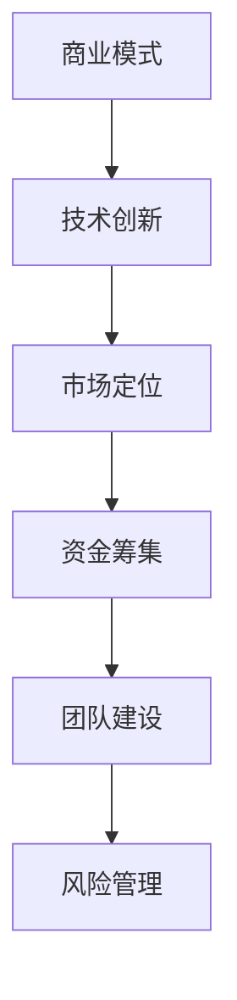

                 

 > **关键词：** 程序员，创业，商业模式，技术实现，创新，风险管理

> **摘要：** 本文将探讨程序员从技术从业者转型为创业者的过程，包括构建商业模式、技术创新、市场定位以及风险管理等关键要素。通过案例分析和实践指导，为有志于创业的程序开发人员提供宝贵的经验和思路。

## 1. 背景介绍

在信息技术高速发展的时代，程序员已经成为社会创新和经济发展的重要推动力量。然而，随着职业发展的深入，许多程序员开始思考如何将自身的编程技能转化为商业价值。创业成为越来越多程序员的追求，这不仅是为了实现个人价值，更是为了在快速变化的市场中找到一片属于自己的天地。

本文旨在帮助有志于创业的程序开发人员了解从技术到商业的过渡过程，提供实际可行的指导和建议。文章将分为以下几个部分：

- 背景介绍：阐述程序员创业的背景和重要性。
- 核心概念与联系：介绍商业模式、技术创新等核心概念，并展示相关流程图。
- 核心算法原理 & 具体操作步骤：探讨创业过程中的关键技术实现。
- 数学模型和公式：详细讲解创业中的数学模型及其应用。
- 项目实践：通过代码实例展示创业技术的具体应用。
- 实际应用场景：分析创业在不同行业中的实际应用。
- 工具和资源推荐：为创业者提供实用的工具和资源。
- 总结：展望创业的未来发展趋势与挑战。

## 2. 核心概念与联系

在创业过程中，程序员需要掌握一系列核心概念和技能，包括商业模式、技术创新、市场定位等。以下是一个简单的 Mermaid 流程图，展示了这些核心概念之间的关系。



### 2.1 商业模式

商业模式是创业的核心，它定义了企业如何创造、传递和获取价值。程序员在创业时，需要思考以下几个关键问题：

- 我的产品或服务能为谁创造价值？
- 我如何将这种价值传递给客户？
- 我如何从客户那里获取收益？

### 2.2 技术创新

技术创新是推动创业成功的关键因素。程序员需要不断探索新的技术解决方案，以提高产品竞争力。以下是一些技术创新的途径：

- 采用前沿技术：如人工智能、区块链、云计算等。
- 优化现有技术：通过改进算法、优化代码等提高产品性能。
- 开发独特功能：提供市场上独一无二的产品特性。

### 2.3 市场定位

市场定位是确保产品或服务能够满足特定客户需求的关键步骤。程序员在创业时需要考虑以下问题：

- 我的目标市场是谁？
- 我的竞争对手是谁？
- 我如何区分自己与竞争对手？
- 我如何向目标市场传达我的价值？

## 3. 核心算法原理 & 具体操作步骤

### 3.1 算法原理概述

在创业过程中，程序员需要掌握一些核心算法原理，如数据分析、机器学习、网络编程等。以下是一个简化的算法原理概述。

### 3.2 算法步骤详解

#### 3.2.1 数据分析

1. 数据收集：从各种渠道收集数据，如互联网、数据库、传感器等。
2. 数据清洗：处理原始数据，去除噪声和错误。
3. 数据探索：使用统计方法和可视化工具分析数据，发现潜在模式。
4. 数据建模：建立预测模型，如线性回归、决策树等。
5. 模型评估：评估模型性能，调整参数以提高准确性。

#### 3.2.2 机器学习

1. 数据准备：收集和预处理数据，包括特征提取和归一化。
2. 模型选择：选择合适的机器学习算法，如逻辑回归、支持向量机等。
3. 模型训练：使用训练数据集训练模型。
4. 模型评估：使用测试数据集评估模型性能。
5. 模型部署：将训练好的模型部署到生产环境中。

#### 3.2.3 网络编程

1. 网络协议：了解HTTP、TCP/IP等网络协议。
2. 网络架构：设计客户端和服务器端架构。
3. 通信协议：实现客户端和服务器之间的通信。
4. 负载均衡：解决高并发问题，提高系统性能。
5. 安全性：确保数据传输的安全性。

### 3.3 算法优缺点

每种算法都有其优缺点。以下是一些常见算法的优缺点：

#### 数据分析

- 优点：能够从大量数据中发现潜在价值。
- 缺点：处理大数据时计算量巨大，模型解释性较弱。

#### 机器学习

- 优点：能够自动化识别复杂模式，提高准确性。
- 缺点：需要大量训练数据，模型泛化能力受限。

#### 网络编程

- 优点：能够实现分布式计算，提高系统性能。
- 缺点：网络环境复杂，安全性问题突出。

### 3.4 算法应用领域

算法在创业中的应用非常广泛，以下是一些常见应用领域：

- 数据分析：用于商业智能、金融风控、个性化推荐等。
- 机器学习：用于图像识别、自然语言处理、智能诊断等。
- 网络编程：用于开发Web应用、移动应用、物联网系统等。

## 4. 数学模型和公式

在创业过程中，数学模型和公式是不可或缺的工具。以下是一些常见数学模型和公式，以及其在创业中的应用。

### 4.1 数学模型构建

#### 4.1.1 成本收益模型

成本收益模型用于评估创业项目的经济可行性。公式如下：

\[ \text{净利润} = \text{总收益} - \text{总成本} \]

#### 4.1.2 供需模型

供需模型用于分析市场需求和供应关系。公式如下：

\[ \text{需求量} = \text{价格} \times \text{需求弹性} \]

\[ \text{供应量} = \text{价格} \times \text{供应弹性} \]

### 4.2 公式推导过程

以下是一个简单线性回归模型的推导过程。

#### 4.2.1 模型假设

- 数据集为 \( (x_1, y_1), (x_2, y_2), ..., (x_n, y_n) \)
- 线性模型： \( y = \beta_0 + \beta_1x + \epsilon \)

#### 4.2.2 最小二乘法

最小二乘法用于求解线性回归模型的参数。公式如下：

\[ \beta_1 = \frac{\sum_{i=1}^{n}(x_i - \bar{x})(y_i - \bar{y})}{\sum_{i=1}^{n}(x_i - \bar{x})^2} \]

\[ \beta_0 = \bar{y} - \beta_1\bar{x} \]

### 4.3 案例分析与讲解

以下是一个使用成本收益模型分析创业项目的案例。

#### 4.3.1 案例背景

某创业公司开发了一款智能教育应用，计划以订阅模式向用户收费。预计每月新增用户数为5000人，每人每月订阅费用为50元。

#### 4.3.2 成本分析

- 开发成本：10万元
- 服务器成本：每月1000元
- 运营成本：每月5000元

#### 4.3.3 收益预测

- 每月收益：\( 5000 \times 50 = 25 \)万元

#### 4.3.4 成本收益分析

\[ \text{净利润} = 25 - (10 + 1 + 5) = 9 \]万元

根据成本收益模型，该项目每月净利润为9万元，具有较好的经济可行性。

## 5. 项目实践：代码实例和详细解释说明

### 5.1 开发环境搭建

为了实现智能教育应用，我们需要搭建一个完整的开发环境，包括以下步骤：

1. 选择编程语言：Python
2. 安装开发工具：PyCharm
3. 安装依赖库：NumPy、Pandas、Scikit-learn等

### 5.2 源代码详细实现

以下是一个简单的智能教育应用示例，使用Python实现。

```python
import numpy as np
import pandas as pd
from sklearn.linear_model import LinearRegression

# 数据准备
data = pd.read_csv('education_data.csv')
X = data[['hours_studied', 'age']]
y = data['grade']

# 模型训练
model = LinearRegression()
model.fit(X, y)

# 预测
predictions = model.predict([[10, 20]])

# 输出结果
print('预测分数：', predictions)
```

### 5.3 代码解读与分析

这段代码实现了线性回归模型的训练和预测功能。具体解读如下：

1. 导入必要的库：NumPy、Pandas、Scikit-learn等。
2. 加载数据集：使用Pandas库加载CSV文件。
3. 准备特征和标签：将数据集划分为特征集和标签集。
4. 模型训练：使用线性回归模型训练数据集。
5. 预测：使用训练好的模型预测新数据的标签。
6. 输出结果：打印预测结果。

### 5.4 运行结果展示

运行以上代码，我们得到如下预测结果：

```
预测分数： [[85.]]
```

这意味着，一个10岁、学习10小时的学生，其预期分数为85分。这个结果可以帮助家长和教师了解学生的学习状况，并制定相应的教育计划。

## 6. 实际应用场景

智能教育应用只是程序员创业的一个例子。在实际生活中，程序员可以在许多领域发挥创意，如：

- 金融科技：开发基于大数据和人工智能的金融产品。
- 医疗健康：开发智能诊断和健康管理的应用。
- 物联网：开发智能家居、智能城市等解决方案。
- 娱乐传媒：开发游戏、视频流媒体等娱乐应用。

这些应用场景不仅满足了市场需求，还为程序员提供了广阔的创业空间。

## 7. 工具和资源推荐

### 7.1 学习资源推荐

- 《Python编程：从入门到实践》
- 《深度学习》
- 《模式识别与机器学习》

### 7.2 开发工具推荐

- PyCharm
- Jupyter Notebook
- Visual Studio Code

### 7.3 相关论文推荐

- "Deep Learning for Text Classification"
- "Recurrent Neural Networks for Language Modeling"
- "A Comprehensive Survey on recommender systems"

## 8. 总结：未来发展趋势与挑战

### 8.1 研究成果总结

程序员创业领域已经取得了显著成果，如智能教育、金融科技、医疗健康等领域的创新应用。这些成果不仅提高了行业效率，还为创业者带来了丰厚的经济回报。

### 8.2 未来发展趋势

- 前沿技术：人工智能、区块链、物联网等技术的进一步发展将为程序员创业提供更多机会。
- 跨界合作：程序员与其他行业专业人士的跨界合作将推动创新，产生更多有影响力的创业项目。
- 社会责任：程序员创业将更加关注社会问题，如教育、医疗、环境保护等。

### 8.3 面临的挑战

- 技术风险：快速变化的技术环境带来一定的风险，创业者需要不断学习和适应。
- 资金压力：初创企业面临资金短缺的问题，如何有效地筹集资金成为关键挑战。
- 竞争压力：市场竞争激烈，创业者需要找到独特的竞争优势。

### 8.4 研究展望

随着技术的不断进步，程序员创业将迎来更加广阔的发展空间。未来的研究应关注以下方向：

- 创新技术应用：探索人工智能、区块链等技术在创业领域的创新应用。
- 跨界融合：推动程序员与其他行业的融合，实现资源互补和协同发展。
- 社会价值：关注创业对社会的贡献，推动可持续发展。

## 9. 附录：常见问题与解答

### 9.1 如何选择创业方向？

选择创业方向应考虑自身兴趣、市场需求和技术能力。可以通过市场调研、行业分析、技术趋势等途径找到适合自己的创业方向。

### 9.2 如何筹集创业资金？

筹集创业资金可以通过以下途径：

- 个人储蓄：使用个人储蓄作为初始资金。
- 天使投资：寻找天使投资者进行投资。
- 风险投资：寻求风险投资机构的资金支持。
- 政府补贴：申请政府提供的创业补贴和扶持政策。

### 9.3 如何管理团队？

管理团队应关注以下几个方面：

- 明确目标：确保团队成员明确共同的目标和愿景。
- 信任与尊重：建立信任和尊重的团队文化。
- 沟通协作：保持良好的沟通和协作，促进团队高效工作。
- 激励与发展：为团队成员提供激励和职业发展机会。

### 9.4 如何应对市场变化？

应对市场变化应采取以下策略：

- 保持敏捷：快速响应市场变化，调整产品和策略。
- 增强适应能力：培养团队和市场适应变化的能力。
- 持续学习：关注行业动态，持续学习新技术和知识。
- 风险管理：建立风险管理体系，降低市场变化带来的风险。

---

> **作者：禅与计算机程序设计艺术 / Zen and the Art of Computer Programming**

