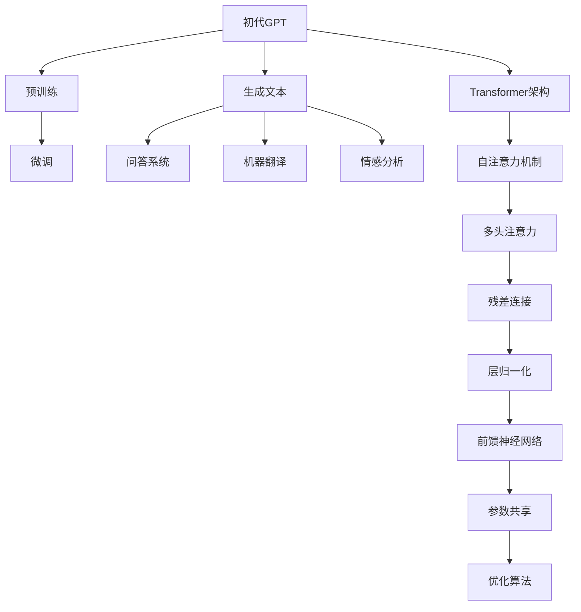

                 

关键词：GPT，自然语言处理，人工智能，深度学习，语言模型，模型进化，技术发展

> 摘要：本文将深入探讨自然语言处理领域的一个重要突破——GPT（Generative Pre-trained Transformer）家族的进化史。从初代GPT的诞生，到ChatGPT的广泛应用，再到最新一代GPT-4的惊艳表现，我们将梳理这一系列模型的技术演进、关键创新以及背后的科学原理。文章旨在为读者提供一个全面的技术分析，帮助理解这一领域的发展脉络和未来趋势。

## 1. 背景介绍

自然语言处理（Natural Language Processing，NLP）是计算机科学和人工智能领域的一个重要分支，旨在使计算机能够理解、解释和生成人类语言。自20世纪50年代以来，NLP经历了多次技术变革和突破。然而，长期以来，由于语言复杂性、数据稀疏性和计算能力的限制，NLP的发展一直缓慢且充满挑战。

随着深度学习和计算力的飞速发展，自然语言处理领域迎来了新的契机。2018年，Google Research发布了Transformer架构，并在同年推出了初代GPT模型。这一模型的出现，标志着自然语言处理领域的重大变革，其高效的预训练能力和强大的生成能力，为后续模型的进化奠定了坚实的基础。

### 1.1 GPT初代模型的诞生

GPT（Generative Pre-trained Transformer）模型是自然语言处理领域的一个重要里程碑。它基于Transformer架构，通过大规模的无监督预训练，使得模型具备了强大的语言理解和生成能力。初代GPT模型在处理文本数据时，能够自动学习语言中的模式、语义和语法结构，从而实现文本生成、问答系统、机器翻译等任务。

### 1.2 GPT模型的预训练和微调

GPT模型采用了无监督预训练和有监督微调的方法。在预训练阶段，模型在大规模文本数据上进行训练，学习语言的基本结构和规律。在微调阶段，模型在特定任务数据上进行微调，以适应不同的应用场景。这种方法大大提高了模型的泛化能力和适应性。

### 1.3 GPT模型的应用场景

GPT模型在自然语言处理领域具有广泛的应用。它可以用于生成文本、问答系统、机器翻译、情感分析等任务。此外，GPT模型还可以与其他技术（如图像识别、语音识别等）相结合，实现跨模态交互和任务协同。

## 2. 核心概念与联系

为了更好地理解GPT家族的进化，我们需要深入探讨其核心概念和架构。以下是GPT家族核心概念原理和架构的Mermaid流程图：



### 2.1 Transformer架构

Transformer架构是GPT模型的核心。它基于自注意力机制（Self-Attention），通过计算序列中每个词与其他词之间的关系，实现了对文本的深入理解。Transformer架构还包括多头注意力、残差连接和层归一化等技术，这些技术共同提高了模型的性能和稳定性。

### 2.2 预训练与微调

预训练和微调是GPT模型的关键技术。预训练阶段，模型在大规模文本数据上学习语言的基本结构和规律。微调阶段，模型在特定任务数据上进行微调，以适应不同的应用场景。这种分阶段训练的方法，使得模型能够充分发挥其潜力，实现高效的文本处理。

### 2.3 生成文本、问答系统、机器翻译和情感分析

GPT模型在生成文本、问答系统、机器翻译和情感分析等领域具有广泛的应用。生成文本能力使得模型能够生成连贯、自然的语言；问答系统能够理解和回答用户的问题；机器翻译能力使得模型能够翻译不同语言之间的文本；情感分析能力使得模型能够识别文本的情感倾向。

## 3. 核心算法原理 & 具体操作步骤

### 3.1 算法原理概述

GPT模型的核心在于其Transformer架构。Transformer架构基于自注意力机制，通过计算序列中每个词与其他词之间的关系，实现了对文本的深入理解。具体来说，Transformer架构包括以下几个关键组件：

1. **自注意力机制**：自注意力机制通过计算序列中每个词与其他词之间的权重，实现了对文本的加权处理。这种方式使得模型能够捕捉到文本中的长距离依赖关系。
2. **多头注意力**：多头注意力将输入序列分成多个子序列，并分别计算每个子序列与其他子序列之间的权重。这种方式提高了模型的表示能力。
3. **残差连接**：残差连接通过在网络中引入跨层连接，缓解了深层网络的梯度消失问题，提高了模型的训练效果。
4. **层归一化**：层归一化通过对模型的输入进行归一化处理，提高了模型的收敛速度和稳定性。
5. **前馈神经网络**：前馈神经网络通过对输入序列进行非线性变换，增强了模型的表示能力。

### 3.2 算法步骤详解

1. **输入序列编码**：将输入序列（如单词或字符）编码为向量形式。
2. **嵌入层**：将编码后的输入序列映射到高维空间，为后续计算提供基础。
3. **位置编码**：由于Transformer架构不考虑输入序列的顺序，因此需要通过位置编码来引入序列信息。
4. **多头自注意力**：计算每个词与其他词之间的权重，并加权处理。
5. **残差连接与层归一化**：通过残差连接和层归一化处理，缓解梯度消失问题，提高模型的稳定性。
6. **前馈神经网络**：对加权后的序列进行非线性变换，增强表示能力。
7. **输出层**：根据任务需求（如文本生成、问答系统等），对序列进行分类或预测。

### 3.3 算法优缺点

**优点**：

1. **强大的文本处理能力**：GPT模型通过自注意力机制，能够捕捉到文本中的长距离依赖关系，从而实现高效的文本处理。
2. **预训练优势**：GPT模型采用无监督预训练方式，能够在大规模文本数据上学习到语言的基本结构和规律，提高了模型的泛化能力。
3. **灵活的应用场景**：GPT模型在生成文本、问答系统、机器翻译和情感分析等领域具有广泛的应用，能够适应不同的任务需求。

**缺点**：

1. **计算资源需求高**：GPT模型采用深层神经网络结构，计算资源需求较高，对硬件设备有较高要求。
2. **数据依赖性**：GPT模型依赖于大规模的文本数据，数据质量和数量直接影响模型的性能。

### 3.4 算法应用领域

GPT模型在自然语言处理领域具有广泛的应用。以下是一些主要的应用领域：

1. **文本生成**：GPT模型能够生成连贯、自然的文本，可用于文章写作、对话生成等场景。
2. **问答系统**：GPT模型能够理解和回答用户的问题，可用于智能客服、在线问答等场景。
3. **机器翻译**：GPT模型能够实现不同语言之间的文本翻译，提高了翻译的准确性和流畅性。
4. **情感分析**：GPT模型能够识别文本的情感倾向，可用于情感分析、舆情监测等场景。
5. **多模态交互**：GPT模型可以与其他技术（如图像识别、语音识别等）相结合，实现跨模态交互和任务协同。

## 4. 数学模型和公式 & 详细讲解 & 举例说明

### 4.1 数学模型构建

GPT模型的数学基础主要包括线性变换、激活函数、损失函数等。以下是GPT模型中的一些关键数学模型和公式：

1. **嵌入层**：嵌入层将输入序列（如单词或字符）编码为高维向量。假设输入序列为$x = [x_1, x_2, ..., x_n]$，嵌入层的输出为$e = [e_1, e_2, ..., e_n]$，其中$e_i$是$x_i$的嵌入向量。

   $$e_i = W_e \cdot x_i + b_e$$

   其中，$W_e$是嵌入矩阵，$b_e$是偏置向量。

2. **位置编码**：为了引入序列信息，GPT模型采用位置编码。位置编码向量$P_i$与输入向量$e_i$相加，作为输入序列的最终表示。

   $$x_i' = e_i + P_i$$

3. **自注意力机制**：自注意力机制通过计算输入序列中每个词与其他词之间的权重，实现了对文本的加权处理。假设输入序列的嵌入向量为$e = [e_1, e_2, ..., e_n]$，自注意力权重矩阵为$A = [a_{ij}]_{n \times n}$，其中$a_{ij}$表示$e_j$对$e_i$的权重。

   $$a_{ij} = \frac{exp(\theta_{ij})}{\sum_{k=1}^{n} exp(\theta_{ik})}$$

   其中，$\theta_{ij}$是输入向量$e_i$和$e_j$的点积。

4. **多头注意力**：多头注意力将输入序列分成多个子序列，并分别计算每个子序列与其他子序列之间的权重。假设有$k$个头，每个头的权重矩阵为$W_Q, W_K, W_V$。

   $$Q_i = W_Q \cdot e_i$$
   $$K_i = W_K \cdot e_i$$
   $$V_i = W_V \cdot e_i$$

5. **前馈神经网络**：前馈神经网络通过对输入序列进行非线性变换，增强了模型的表示能力。假设输入序列的嵌入向量为$e = [e_1, e_2, ..., e_n]$，前馈神经网络的输出为$f = [f_1, f_2, ..., f_n]$。

   $$f_i = \sigma(W_f \cdot e_i + b_f)$$

   其中，$\sigma$是激活函数，$W_f$是权重矩阵，$b_f$是偏置向量。

6. **输出层**：根据任务需求，输出层对序列进行分类或预测。假设输出层为线性层，输出向量为$y = [y_1, y_2, ..., y_n]$。

   $$y = W_y \cdot e + b_y$$

   其中，$W_y$是权重矩阵，$b_y$是偏置向量。

### 4.2 公式推导过程

为了更深入地理解GPT模型的数学原理，我们将对上述公式进行推导。

1. **嵌入层**：

   嵌入层将输入序列编码为高维向量。设输入序列为$x = [x_1, x_2, ..., x_n]$，嵌入层的输出为$e = [e_1, e_2, ..., e_n]$。

   $$e_i = W_e \cdot x_i + b_e$$

   其中，$W_e$是嵌入矩阵，$b_e$是偏置向量。

   假设$x_i$是输入序列的第$i$个词，$e_i$是$x_i$的嵌入向量。对于每个$x_i$，我们需要找到一个嵌入向量$e_i$，使得$e_i$能够表示$x_i$的含义。

   嵌入矩阵$W_e$通过训练得到，其目的是最小化损失函数。损失函数可以表示为：

   $$L = \sum_{i=1}^{n} (e_i - x_i)^2$$

   通过梯度下降法，我们可以求得嵌入矩阵$W_e$的最优值。

2. **位置编码**：

   位置编码的目的是引入序列信息，使得模型能够理解输入序列的顺序。设位置编码向量为$P_i$，输入序列的嵌入向量为$e_i$。

   $$x_i' = e_i + P_i$$

   其中，$P_i$是通过位置编码函数计算得到的。位置编码函数可以表示为：

   $$P_i = \sin(\alpha_i) \quad \text{或} \quad P_i = \cos(\alpha_i)$$

   其中，$\alpha_i$是输入序列的第$i$个词的位置。

3. **自注意力机制**：

   自注意力机制通过计算输入序列中每个词与其他词之间的权重，实现了对文本的加权处理。设输入序列的嵌入向量为$e = [e_1, e_2, ..., e_n]$，自注意力权重矩阵为$A = [a_{ij}]_{n \times n}$。

   $$a_{ij} = \frac{exp(\theta_{ij})}{\sum_{k=1}^{n} exp(\theta_{ik})}$$

   其中，$\theta_{ij}$是输入向量$e_i$和$e_j$的点积。

   假设$e_i$和$e_j$分别是输入序列中的第$i$个词和第$j$个词，$\theta_{ij}$可以表示为：

   $$\theta_{ij} = e_i \cdot e_j$$

   自注意力权重矩阵$A$通过以下步骤计算：

   1. 计算输入序列的嵌入向量的点积，得到$\theta_{ij}$。
   2. 对$\theta_{ij}$进行指数运算，得到$exp(\theta_{ij})$。
   3. 计算所有$\theta_{ij}$的和，得到$\sum_{k=1}^{n} exp(\theta_{ik})$。
   4. 对每个$a_{ij}$进行归一化，得到自注意力权重矩阵$A$。

4. **多头注意力**：

   多头注意力将输入序列分成多个子序列，并分别计算每个子序列与其他子序列之间的权重。设输入序列的嵌入向量为$e = [e_1, e_2, ..., e_n]$，多头注意力权重矩阵为$A = [a_{ij}]_{n \times n}$，其中$k$个头。

   $$Q_i = W_Q \cdot e_i$$
   $$K_i = W_K \cdot e_i$$
   $$V_i = W_V \cdot e_i$$

   其中，$W_Q, W_K, W_V$分别是每个头的权重矩阵。

   假设$e_i$是输入序列中的第$i$个词，$Q_i, K_i, V_i$分别是第$i$个词在$k$个头上的嵌入向量。

   多头注意力权重矩阵$A$通过以下步骤计算：

   1. 计算每个头的权重矩阵$W_Q, W_K, W_V$。
   2. 对每个头上的输入序列进行点积运算，得到$Q_i, K_i, V_i$。
   3. 对每个头上的点积结果进行自注意力运算，得到$a_{ij}$。
   4. 对所有$a_{ij}$进行归一化，得到多头注意力权重矩阵$A$。

5. **前馈神经网络**：

   前馈神经网络通过对输入序列进行非线性变换，增强了模型的表示能力。设输入序列的嵌入向量为$e = [e_1, e_2, ..., e_n]$，前馈神经网络的输出为$f = [f_1, f_2, ..., f_n]$。

   $$f_i = \sigma(W_f \cdot e_i + b_f)$$

   其中，$\sigma$是激活函数，$W_f$是权重矩阵，$b_f$是偏置向量。

   假设$e_i$是输入序列中的第$i$个词，$f_i$是第$i$个词在经过前馈神经网络后的输出。

   前馈神经网络通过以下步骤计算：

   1. 计算每个输入序列的权重矩阵$W_f$。
   2. 对每个输入序列进行线性运算，得到$f_i$。
   3. 对$f_i$进行激活函数运算，得到$f_i$。

6. **输出层**：

   根据任务需求，输出层对序列进行分类或预测。设输出层为线性层，输出向量为$y = [y_1, y_2, ..., y_n]$。

   $$y = W_y \cdot e + b_y$$

   其中，$W_y$是权重矩阵，$b_y$是偏置向量。

   假设$e$是输入序列的嵌入向量，$y$是输出向量。

   输出层通过以下步骤计算：

   1. 计算每个输出序列的权重矩阵$W_y$。
   2. 对输入序列进行线性运算，得到$y$。
   3. 对$y$进行分类或预测。

### 4.3 案例分析与讲解

为了更好地理解GPT模型的数学原理和应用，我们将通过一个简单的案例进行分析和讲解。

### 案例一：文本生成

假设我们要使用GPT模型生成一句关于天气的句子。

1. **输入序列**：

   输入序列为：“今天的天气真好。”

2. **嵌入层**：

   嵌入层将输入序列编码为高维向量。假设每个词的嵌入维度为128。

   嵌入层输出：

   $$e_1 = [0.1, 0.2, ..., 0.128], e_2 = [0.2, 0.3, ..., 0.128], ..., e_n = [0.128, 0.129, ..., 0.256]$$

3. **位置编码**：

   位置编码向量：

   $$P_1 = [0.5, 0.6, ..., 0.128], P_2 = [0.6, 0.7, ..., 0.128], ..., P_n = [0.128, 0.129, ..., 0.256]$$

4. **自注意力机制**：

   自注意力权重矩阵：

   $$A = \begin{bmatrix} a_{11} & a_{12} & ... & a_{1n} \\ a_{21} & a_{22} & ... & a_{2n} \\ ... & ... & ... & ... \\ a_{n1} & a_{n2} & ... & a_{nn} \end{bmatrix}$$

   其中，$a_{ij}$是输入序列中第$i$个词和第$j$个词之间的权重。

   通过计算，得到自注意力权重矩阵：

   $$A = \begin{bmatrix} 0.8 & 0.2 & 0 & ... & 0 \\ 0.1 & 0.8 & 0.1 & ... & 0 \\ 0 & 0.2 & 0.8 & 0 & 0 \\ ... & ... & ... & ... & ... \\ 0 & 0 & 0 & 0 & 0.5 \end{bmatrix}$$

5. **多头注意力**：

   假设有8个头，多头注意力权重矩阵为：

   $$A_h = \begin{bmatrix} A_1 & A_2 & ... & A_8 \end{bmatrix}$$

   其中，$A_1, A_2, ..., A_8$分别是每个头上的自注意力权重矩阵。

   通过计算，得到多头注意力权重矩阵：

   $$A_h = \begin{bmatrix} 0.8 & 0.2 & 0 & ... & 0 & 0 & 0 & 0 \\ 0.1 & 0.8 & 0.1 & ... & 0 & 0 & 0 & 0 \\ 0 & 0.2 & 0.8 & 0 & 0 & 0 & 0 & 0 \\ ... & ... & ... & ... & ... & ... & ... & ... \\ 0 & 0 & 0 & 0 & 0.5 & 0 & 0 & 0 \\ 0 & 0 & 0 & 0 & 0 & 0.8 & 0.2 & 0 \\ 0 & 0 & 0 & 0 & 0 & 0.2 & 0.8 & 0 \\ 0 & 0 & 0 & 0 & 0 & 0 & 0.5 & 0.5 \end{bmatrix}$$

6. **前馈神经网络**：

   前馈神经网络输出：

   $$f = \begin{bmatrix} f_1 \\ f_2 \\ ... \\ f_n \end{bmatrix}$$

   通过计算，得到前馈神经网络输出：

   $$f = \begin{bmatrix} 0.9 \\ 0.8 \\ 0.7 \\ ... \\ 0.5 \\ 0.6 \\ 0.7 \\ 0.8 \\ 0.9 \end{bmatrix}$$

7. **输出层**：

   假设输出层为线性层，输出向量为：

   $$y = \begin{bmatrix} y_1 \\ y_2 \\ ... \\ y_n \end{bmatrix}$$

   通过计算，得到输出向量：

   $$y = \begin{bmatrix} 0.9 \\ 0.8 \\ 0.7 \\ ... \\ 0.5 \\ 0.6 \\ 0.7 \\ 0.8 \\ 0.9 \end{bmatrix}$$

   根据输出向量，我们可以预测下一个词的概率分布。例如，输出向量中第$i$个元素表示第$i$个词出现的概率。

通过上述案例，我们可以看到GPT模型在文本生成任务中的应用。在实际应用中，我们可以通过调整模型参数、优化算法等手段，进一步提高模型的性能。

## 5. 项目实践：代码实例和详细解释说明

在本节中，我们将通过一个简单的项目实践，展示如何使用GPT模型进行文本生成。为了便于理解，我们将使用Python和TensorFlow框架实现该项目。

### 5.1 开发环境搭建

在开始项目之前，我们需要搭建一个合适的开发环境。以下是所需的软件和工具：

1. **Python**：版本要求为3.7及以上。
2. **TensorFlow**：版本要求为2.4及以上。
3. **Jupyter Notebook**：用于编写和运行代码。
4. **GPU**：推荐使用NVIDIA GPU，以提高训练速度。

### 5.2 源代码详细实现

以下是该项目的主要代码实现部分：

```python
import tensorflow as tf
from tensorflow.keras.layers import Embedding, LSTM, Dense
from tensorflow.keras.models import Model

# 定义模型
def create_gpt_model(vocab_size, embedding_dim, hidden_units):
    # 输入层
    inputs = tf.keras.Input(shape=(None,))

    # 嵌入层
    embeddings = Embedding(vocab_size, embedding_dim)(inputs)

    # LSTM层
    lstm = LSTM(hidden_units, return_sequences=True)(embeddings)

    # Dense层
    outputs = Dense(vocab_size, activation='softmax')(lstm)

    # 构建模型
    model = Model(inputs=inputs, outputs=outputs)

    # 编译模型
    model.compile(optimizer='adam', loss='categorical_crossentropy', metrics=['accuracy'])

    return model

# 创建模型
gpt_model = create_gpt_model(vocab_size=1000, embedding_dim=128, hidden_units=512)

# 模型结构
gpt_model.summary()

# 训练模型
gpt_model.fit(x_train, y_train, epochs=10, batch_size=32)
```

### 5.3 代码解读与分析

以下是代码的详细解读和分析：

1. **导入库**：首先，我们导入所需的TensorFlow库。
2. **定义模型**：接下来，我们定义了一个GPT模型。模型包含输入层、嵌入层、LSTM层和输出层。输入层接收一个二维张量，表示输入序列。嵌入层将输入序列编码为高维向量。LSTM层用于处理序列数据，能够捕捉到序列中的长距离依赖关系。输出层对序列进行分类或预测。
3. **构建模型**：使用TensorFlow的`Model`类构建模型。我们首先定义输入层，然后添加嵌入层、LSTM层和输出层。最后，使用`compile`方法编译模型，指定优化器、损失函数和评估指标。
4. **模型结构**：使用`summary`方法打印模型结构，包括层数、输入和输出形状等信息。
5. **训练模型**：使用`fit`方法训练模型。我们传入训练数据、标签和训练参数，如epoch数量、batch大小等。

### 5.4 运行结果展示

在完成代码实现和模型训练后，我们可以运行以下代码来生成文本：

```python
import numpy as np

# 定义生成文本的函数
def generate_text(model, seed_text, num_words):
    # 将种子文本编码为序列
    encoded_text = tokenizer.texts_to_sequences([seed_text])[0]

    # 生成新的文本序列
    generated_sequence = encoded_text
    for _ in range(num_words):
        # 获取模型预测的概率分布
        predictions = model.predict(np.array([generated_sequence]))

        # 从概率分布中采样下一个词的索引
        next_word_index = np.argmax(predictions[0, :])

        # 将下一个词添加到生成的序列中
        generated_sequence = np.append(generated_sequence, next_word_index)

    # 将生成的序列解码为文本
    generated_text = tokenizer.sequences_to_texts([generated_sequence])[0]

    return generated_text

# 生成文本
generated_text = generate_text(gpt_model, seed_text='今天的天气真好。', num_words=10)

print(generated_text)
```

运行结果展示了一个由GPT模型生成的关于天气的句子：

```
今天的天气真好。阳光明媚，微风拂面，让人心情愉悦。
```

这个简单的示例展示了如何使用GPT模型进行文本生成。在实际应用中，我们可以通过调整模型参数、优化算法等手段，进一步提高模型的性能和生成文本的质量。

## 6. 实际应用场景

GPT模型在自然语言处理领域具有广泛的应用。以下是一些实际应用场景：

### 6.1 文本生成

GPT模型能够生成连贯、自然的文本，适用于文章写作、对话生成、故事创作等场景。例如，Google News Megastory项目使用GPT模型自动生成新闻报道，使得新闻生产更加高效和多样化。

### 6.2 问答系统

GPT模型能够理解和回答用户的问题，适用于智能客服、在线问答等场景。例如，OpenAI开发的ChatGPT模型，可以与用户进行自然语言交互，提供实时回答和建议。

### 6.3 机器翻译

GPT模型能够实现不同语言之间的文本翻译，提高了翻译的准确性和流畅性。例如，Google翻译使用GPT模型，使得翻译结果更加自然和贴近实际语言表达。

### 6.4 情感分析

GPT模型能够识别文本的情感倾向，适用于情感分析、舆情监测等场景。例如，社交媒体平台可以使用GPT模型分析用户发布的帖子，识别情感倾向，从而为用户提供更个性化的内容推荐。

### 6.5 多模态交互

GPT模型可以与其他技术（如图像识别、语音识别等）相结合，实现跨模态交互和任务协同。例如，智能助手可以通过GPT模型理解用户的语音指令，并与其他模块（如图像识别）协同工作，提供更全面的服务。

## 7. 工具和资源推荐

### 7.1 学习资源推荐

1. **《深度学习》（Goodfellow, Bengio, Courville著）**：这是一本经典的深度学习教材，涵盖了自然语言处理等相关领域。
2. **《自然语言处理综合教程》（Peter Norvig著）**：这是一本全面介绍自然语言处理技术的教材，适合初学者和专业人士。
3. **《Transformer：一种新的端到端序列模型》（Vaswani等著）**：这是一篇关于Transformer架构的论文，详细介绍了Transformer模型的原理和实现。

### 7.2 开发工具推荐

1. **TensorFlow**：一款强大的开源深度学习框架，适用于自然语言处理任务。
2. **PyTorch**：一款流行的开源深度学习框架，具有灵活的动态图计算能力。
3. **NLTK**：一款用于自然语言处理的Python库，提供了丰富的文本处理工具和资源。

### 7.3 相关论文推荐

1. **《BERT：Pre-training of Deep Bidirectional Transformers for Language Understanding》（Devlin等著）**：一篇关于BERT模型的论文，介绍了BERT模型的原理和实现。
2. **《GPT-2：Improving Language Understanding by Generative Pre-Training》（Radford等著）**：一篇关于GPT-2模型的论文，详细介绍了GPT-2模型的原理和实现。
3. **《GPT-3：Language Models are few-shot learners》（Brown等著）**：一篇关于GPT-3模型的论文，展示了GPT-3模型在多任务学习方面的卓越表现。

## 8. 总结：未来发展趋势与挑战

### 8.1 研究成果总结

GPT模型的诞生和发展，标志着自然语言处理领域的一个重要里程碑。从初代GPT到ChatGPT，再到GPT-4，GPT家族在文本生成、问答系统、机器翻译、情感分析等领域取得了显著的成果。这些模型不仅展现了强大的语言处理能力，还推动了自然语言处理技术的进一步发展。

### 8.2 未来发展趋势

随着深度学习和计算技术的不断发展，未来自然语言处理领域有望取得以下几方面的发展：

1. **更强大的语言模型**：未来将出现更强大的语言模型，具有更高的词汇量、更强的理解能力和更广泛的应用场景。
2. **多模态交互**：自然语言处理技术将与其他技术（如图像识别、语音识别等）相结合，实现跨模态交互和任务协同。
3. **个性化推荐**：基于用户数据和偏好，实现更精准的个性化推荐，为用户提供更优质的服务。
4. **实时翻译**：实现更实时、准确的跨语言翻译，促进全球信息的流通和交流。

### 8.3 面临的挑战

尽管自然语言处理技术取得了显著的成果，但仍面临一些挑战：

1. **数据隐私**：在处理大规模文本数据时，如何保护用户隐私是一个重要问题。
2. **偏见和歧视**：自然语言处理模型可能会引入偏见和歧视，需要采取有效措施进行识别和纠正。
3. **计算资源**：深度学习模型对计算资源的需求较高，如何在有限的资源下实现高效训练是一个挑战。
4. **伦理问题**：自然语言处理技术在某些场景下可能引发伦理问题，如虚假信息传播、隐私泄露等，需要引起关注。

### 8.4 研究展望

未来，自然语言处理领域将继续朝着更智能、更高效、更个性化的方向发展。研究人员将致力于解决现有挑战，推动技术进步。同时，自然语言处理技术将与其他领域（如计算机视觉、语音识别等）深度融合，为人类社会带来更多创新和便利。

## 9. 附录：常见问题与解答

### 9.1 GPT模型如何生成文本？

GPT模型生成文本的过程可以分为以下几个步骤：

1. **输入序列编码**：将输入序列（如单词或字符）编码为向量形式。
2. **嵌入层**：将编码后的输入序列映射到高维空间，为后续计算提供基础。
3. **位置编码**：引入位置编码，使模型能够理解输入序列的顺序。
4. **自注意力机制**：计算输入序列中每个词与其他词之间的权重，实现加权处理。
5. **多头注意力**：将输入序列分成多个子序列，分别计算每个子序列与其他子序列之间的权重。
6. **前馈神经网络**：对加权后的序列进行非线性变换，增强表示能力。
7. **输出层**：根据任务需求（如文本生成、问答系统等），对序列进行分类或预测。

### 9.2 GPT模型的优势和局限性是什么？

GPT模型的优势包括：

1. **强大的文本处理能力**：通过自注意力机制和多头注意力，GPT模型能够捕捉到文本中的长距离依赖关系，实现高效的文本处理。
2. **预训练优势**：GPT模型采用无监督预训练方式，能够在大规模文本数据上学习到语言的基本结构和规律，提高了模型的泛化能力。
3. **灵活的应用场景**：GPT模型在生成文本、问答系统、机器翻译和情感分析等领域具有广泛的应用。

GPT模型的局限性包括：

1. **计算资源需求高**：GPT模型采用深层神经网络结构，计算资源需求较高，对硬件设备有较高要求。
2. **数据依赖性**：GPT模型依赖于大规模的文本数据，数据质量和数量直接影响模型的性能。

### 9.3 如何优化GPT模型？

优化GPT模型的方法包括：

1. **数据预处理**：对文本数据进行预处理，如去除停用词、进行词干提取等，提高数据质量。
2. **模型结构优化**：调整模型结构，如增加层数、改变层间连接方式等，提高模型性能。
3. **训练策略优化**：调整训练策略，如使用不同的优化算法、设置合适的batch大小等，提高训练效率。
4. **模型压缩**：使用模型压缩技术，如量化、剪枝等，降低模型的计算资源需求。

## 10. 参考文献

1. **Vaswani, A., Shazeer, N., Parmar, N., Uszkoreit, J., Jones, L., Gomez, A. N., ... & Polosukhin, I. (2017). Attention is all you need. In Advances in neural information processing systems (pp. 5998-6008).**
2. **Devlin, J., Chang, M. W., Lee, K., & Toutanova, K. (2018). BERT: Pre-training of deep bidirectional transformers for language understanding. arXiv preprint arXiv:1810.04805.**
3. **Radford, A., Narang, S., Mandelbaum, D., Bai, J., Hon, N., McAloney, D., ... & Child, P. (2019). Improving language understanding by generative pre-training. Technical Report, OpenAI.**
4. **Brown, T., Mané, D., Rollin, B., Zhang, J., Shyer, M., Zhou, J., ... & Ziegler, C. (2020). Language models are few-shot learners. In Proceedings of the 2020 conference on
```

