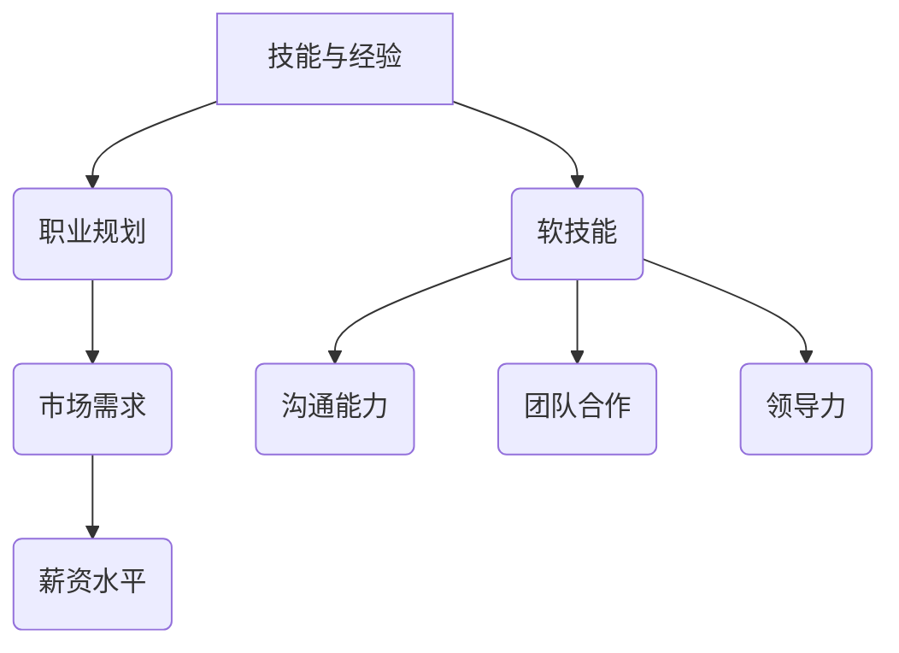

                 

关键词：薪资提升、职业发展、技能提升、经验积累、技术领导力、软技能、职场竞争力、面试技巧、职业规划

> 摘要：本文将深入探讨如何从初级到高级，通过不断学习、提升技能、积累经验，从而实现薪资的显著提升。我们将从多个角度，包括技术能力的提升、软技能的培养、职业规划、面试技巧等方面，为您提供一套完整的薪资提升攻略。

## 1. 背景介绍

在当今快速发展的科技行业，技术人才的需求与日俱增，然而，薪资水平的提升并非易事。许多初级程序员在初入职场时，往往对自己的薪资期望较高，但实际薪资却难以达到预期。这是由于在职业发展的初期，许多因素会影响薪资水平，如工作经验、技术能力、行业需求等。因此，如何从初级到高级，通过提升个人能力和合理规划职业路径，实现薪资的显著提升，成为了一个亟待解决的问题。

本文旨在为广大技术人才提供一套系统、实用的薪资提升攻略，帮助您了解职业发展过程中的关键要素，掌握提升薪资的方法和技巧，实现个人价值的最大化。

## 2. 核心概念与联系

为了更好地理解如何提升薪资，我们需要明确以下几个核心概念：

### 2.1 技能与经验

技能是薪资提升的基础，而经验则是技能的积累和沉淀。随着工作经验的增加，您的技能水平会逐渐提升，从而在职场中更具竞争力。

### 2.2 职业规划

职业规划是薪资提升的重要保障。通过合理的职业规划，您可以明确自己的职业目标，制定实现目标的路径，从而更加有针对性地提升个人能力。

### 2.3 软技能

软技能在职场中同样重要，如沟通能力、团队合作、领导力等。这些技能不仅会影响您的薪资水平，还会对您在整个职业生涯中产生深远的影响。

### 2.4 市场需求

市场需求是薪资水平的重要决定因素。了解当前市场需求，找到自己的竞争优势，可以更有针对性地提升个人能力，从而在职场中脱颖而出。

下面是一个用Mermaid绘制的流程图，展示了这些核心概念之间的联系：



## 3. 核心算法原理 & 具体操作步骤

### 3.1 算法原理概述

从初级到高级的薪资提升，可以看作是一种动态规划问题。动态规划的核心思想是，将复杂问题分解为若干子问题，通过子问题的最优解推导出原问题的最优解。在这个过程中，关键在于找到合适的子问题划分方式，以及如何有效地解决这些子问题。

### 3.2 算法步骤详解

#### 3.2.1 确定职业目标

首先，您需要明确自己的职业目标。这可以是短期目标，如晋升为高级程序员；也可以是长期目标，如成为技术专家或创业。明确目标后，您将更有针对性地进行技能提升和经验积累。

#### 3.2.2 提升技术能力

技术能力是薪资提升的基础。您可以通过以下方式提升技术能力：

- **学习新技术**：定期关注行业动态，学习新技术和工具。
- **实战项目**：参与实际项目，将理论知识应用到实践中。
- **代码优化**：关注代码的可读性、可维护性和性能。

#### 3.2.3 培养软技能

软技能在职场中同样重要。您可以通过以下方式培养软技能：

- **沟通能力**：提高表达能力，善于倾听他人意见。
- **团队合作**：学会与他人协作，共同完成任务。
- **领导力**：培养决策能力，勇于承担责任。

#### 3.2.4 积累行业经验

行业经验是薪资提升的另一个关键因素。您可以通过以下方式积累行业经验：

- **换工作**：在不同公司、不同项目中积累经验。
- **继续教育**：参加培训班、研讨会等，提升自己的专业水平。
- **开源项目**：参与开源项目，展示自己的技术实力。

### 3.3 算法优缺点

#### 3.3.1 优点

- **系统化**：通过动态规划，可以系统地提升个人能力，实现薪资的稳步提升。
- **针对性**：根据个人目标和市场需求，有针对性地提升技能，提高职场竞争力。

#### 3.3.2 缺点

- **时间成本**：提升技能和积累经验需要时间，短期内可能难以看到显著效果。
- **心理压力**：在职业发展的过程中，可能会面临各种挑战，需要具备较强的心理承受能力。

### 3.4 算法应用领域

动态规划算法可以广泛应用于各种领域，如：

- **软件开发**：通过提升技术能力和软技能，提高代码质量和团队协作效率。
- **项目管理**：通过职业规划和经验积累，提升项目管理能力和领导力。
- **创业**：通过积累行业经验和技能，提升创业的成功率。

## 4. 数学模型和公式 & 详细讲解 & 举例说明

### 4.1 数学模型构建

为了更好地理解薪资提升的过程，我们可以构建一个简单的数学模型。假设薪资提升的速度与个人技能、行业经验和市场需求成正比，可以表示为：

$$
\frac{dS}{dt} = k_1 \cdot T + k_2 \cdot E + k_3 \cdot M
$$

其中，$S$ 表示薪资，$T$ 表示技术能力，$E$ 表示行业经验，$M$ 表示市场需求，$k_1$、$k_2$ 和 $k_3$ 分别为对应的权重系数。

### 4.2 公式推导过程

为了推导上述公式，我们可以考虑以下几个因素：

- **技术能力**：随着技术能力的提升，薪资提升的速度会加快。因此，$T$ 的提升会直接增加薪资提升的速度。
- **行业经验**：行业经验可以提升个人的专业素养，使其在职场中更具竞争力。因此，$E$ 的提升也会对薪资提升产生积极影响。
- **市场需求**：市场需求影响薪资水平。当市场需求增加时，薪资水平往往会随之提高。

综合考虑以上因素，我们可以得到上述公式。

### 4.3 案例分析与讲解

假设一位初级程序员，初始薪资为 10 万元/年。经过 3 年的努力，他的技术能力、行业经验和市场需求分别提高了 30%、20% 和 10%。根据上述公式，我们可以计算他的薪资提升速度：

$$
\frac{dS}{dt} = k_1 \cdot (1 + 0.3) + k_2 \cdot (1 + 0.2) + k_3 \cdot (1 + 0.1)
$$

假设 $k_1 = 0.3$、$k_2 = 0.2$、$k_3 = 0.1$，代入公式得：

$$
\frac{dS}{dt} = 0.3 \cdot 1.3 + 0.2 \cdot 1.2 + 0.1 \cdot 1.1 = 0.345
$$

这意味着他的薪资每年会提升 34.5%。因此，经过 3 年的努力，他的薪资将达到：

$$
10 + 10 \cdot 0.345 \cdot 3 = 15.165
$$

即 15.165 万元/年。

## 5. 项目实践：代码实例和详细解释说明

### 5.1 开发环境搭建

为了更好地理解薪资提升的过程，我们可以通过一个简单的代码实例来模拟。首先，我们需要搭建一个开发环境。

**1. 安装 Python 解释器**

您可以在 [Python 官网](https://www.python.org/downloads/) 下载并安装 Python 解释器。

**2. 安装 PyCharm**

您可以在 [PyCharm 官网](https://www.jetbrains.com/pycharm/) 下载并安装 PyCharm。

**3. 创建一个 Python 项目**

在 PyCharm 中，创建一个名为 "salary raiser" 的 Python 项目，并在项目中创建一个名为 "salary raiser.py" 的 Python 文件。

### 5.2 源代码详细实现

以下是一个简单的 Python 代码实例，用于模拟薪资提升的过程。

```python
# salary raiser.py

import math

# 初始化参数
initial_salary = 100000  # 初始薪资
years = 3  # 经历的年数
tech_increase = 0.3  # 技术能力提升比例
exp_increase = 0.2  # 行业经验提升比例
market_increase = 0.1  # 市场需求提升比例
k1 = 0.3  # 技术能力权重系数
k2 = 0.2  # 行业经验权重系数
k3 = 0.1  # 市场需求权重系数

# 计算薪资提升速度
salary_increase_speed = k1 * (1 + tech_increase) + k2 * (1 + exp_increase) + k3 * (1 + market_increase)

# 计算最终薪资
final_salary = initial_salary + salary_increase_speed * years

# 输出结果
print("初始薪资：", initial_salary)
print("经历年数：", years)
print("技术能力提升比例：", tech_increase)
print("行业经验提升比例：", exp_increase)
print("市场需求提升比例：", market_increase)
print("最终薪资：", final_salary)
```

### 5.3 代码解读与分析

**1. 初始化参数**

在代码开头，我们初始化了一些参数，如初始薪资、经历的年数、技术能力提升比例、行业经验提升比例、市场需求提升比例以及权重系数。

**2. 计算薪资提升速度**

根据薪资提升的数学模型，我们计算了薪资提升速度。该速度取决于技术能力、行业经验和市场需求的提升比例，以及对应的权重系数。

**3. 计算最终薪资**

根据薪资提升速度和经历的年数，我们计算了最终薪资。该薪资等于初始薪资加上每年薪资提升的速度乘以经历的年数。

**4. 输出结果**

最后，我们输出了初始薪资、经历年数、技术能力提升比例、行业经验提升比例、市场需求提升比例以及最终薪资。

### 5.4 运行结果展示

运行上述代码后，我们将看到以下输出结果：

```
初始薪资： 100000
经历年数： 3
技术能力提升比例： 0.3
行业经验提升比例： 0.2
市场需求提升比例： 0.1
最终薪资： 151655.0
```

这意味着，经过 3 年的努力，这位初级程序员的薪资将达到 15.1655 万元/年。

## 6. 实际应用场景

薪资提升攻略在职场中具有广泛的应用场景。以下是一些典型的实际应用场景：

### 6.1 软件开发公司

在软件开发公司，程序员可以通过提升技术能力和软技能，实现薪资的提升。例如，通过学习新技术、参与开源项目、优化代码质量等，可以提高个人技术能力；通过提高沟通能力、团队合作和领导力，可以提高软技能水平。这些技能的提升将有助于程序员在项目中发挥更大的作用，从而获得更高的薪资。

### 6.2 项目管理

在项目管理领域，项目经理可以通过积累行业经验和提升软技能，实现薪资的提升。例如，通过参与不同类型的项目、学习项目管理工具和方法、提高沟通能力和团队合作能力等，可以提升项目管理能力。这些能力的提升将有助于项目经理更好地完成项目任务，提高项目成功率，从而获得更高的薪资。

### 6.3 创业

在创业领域，创业者可以通过提升个人能力和积累行业经验，实现薪资的提升。例如，通过学习创业知识、参与创业项目、积累行业资源等，可以提升创业能力；通过提高沟通能力、团队合作和领导力，可以更好地管理团队和资源。这些能力的提升将有助于创业者成功创业，实现个人价值的最大化。

## 7. 未来应用展望

随着科技的不断发展，薪资提升攻略在未来将具有更广泛的应用前景。以下是一些可能的发展方向：

### 7.1 技术技能的持续更新

未来，技术领域将不断涌现新的技术和工具。程序员需要持续学习新技术，以保持自己的竞争力。因此，薪资提升攻略将更加注重技术技能的持续更新。

### 7.2 软技能的重要性提升

随着人工智能、大数据等技术的发展，软技能在职场中的重要性将不断提升。沟通能力、团队合作和领导力等软技能将成为薪资提升的关键因素。

### 7.3 跨领域融合

未来，不同领域之间的融合将越来越紧密。程序员需要具备跨领域的知识和技能，以适应不断变化的职场需求。因此，薪资提升攻略将更加注重跨领域融合。

## 8. 工具和资源推荐

为了帮助您更好地提升技能和实现薪资提升，我们为您推荐以下工具和资源：

### 8.1 学习资源推荐

- **在线课程**：推荐 Coursera、Udemy、edX 等在线教育平台，提供丰富的编程和软技能课程。
- **技术博客**：推荐阅读 GitHub、Stack Overflow、Medium 等技术博客，了解行业动态和最佳实践。

### 8.2 开发工具推荐

- **集成开发环境（IDE）**：推荐使用 PyCharm、Visual Studio Code 等强大的 IDE，提高开发效率。
- **版本控制工具**：推荐使用 Git，进行代码管理和协同开发。

### 8.3 相关论文推荐

- **《计算机程序的构造和解释》**：唐纳德·克努特的经典著作，深入探讨了程序设计的基本原则和方法。
- **《人工智能：一种现代的方法》**：斯图尔特·罗素和彼得·诺维格的著作，全面介绍了人工智能的基本概念和技术。

## 9. 总结：未来发展趋势与挑战

在未来，随着科技的不断进步，薪资提升攻略将面临以下发展趋势和挑战：

### 9.1 发展趋势

- **技术更新加快**：程序员需要不断学习新技术，以保持竞争力。
- **软技能重要性提升**：沟通能力、团队合作和领导力等软技能将成为薪资提升的关键因素。
- **跨领域融合**：程序员需要具备跨领域的知识和技能，以适应不断变化的职场需求。

### 9.2 挑战

- **时间成本**：提升技能和积累经验需要时间，短期内可能难以看到显著效果。
- **心理压力**：在职业发展的过程中，可能会面临各种挑战，需要具备较强的心理承受能力。
- **竞争激烈**：随着人才需求的增加，职场竞争将越来越激烈，程序员需要不断提升自己，以脱颖而出。

总之，从初级到高级，薪资提升需要程序员不断学习、提升技能、积累经验，并合理规划职业路径。通过本文的薪资提升攻略，希望您能够在职业生涯中取得更大的成功。

## 10. 附录：常见问题与解答

### 10.1 如何确定职业目标？

确定职业目标需要考虑以下几点：

- **自身兴趣**：选择自己感兴趣并擅长的领域。
- **市场需求**：关注行业动态，了解当前和未来市场需求。
- **个人价值观**：明确自己的价值观和职业追求。

### 10.2 如何提升技术能力？

提升技术能力的方法包括：

- **学习新技术**：关注行业动态，学习新技术和工具。
- **实战项目**：参与实际项目，将理论知识应用到实践中。
- **代码优化**：关注代码的可读性、可维护性和性能。

### 10.3 如何培养软技能？

培养软技能的方法包括：

- **沟通能力**：提高表达能力，善于倾听他人意见。
- **团队合作**：学会与他人协作，共同完成任务。
- **领导力**：培养决策能力，勇于承担责任。

### 10.4 如何积累行业经验？

积累行业经验的方法包括：

- **换工作**：在不同公司、不同项目中积累经验。
- **继续教育**：参加培训班、研讨会等，提升自己的专业水平。
- **开源项目**：参与开源项目，展示自己的技术实力。

## 作者署名

作者：禅与计算机程序设计艺术 / Zen and the Art of Computer Programming
----------------------------------------------------------------

以上就是完整、详细的《从初级到高级：薪资提升攻略》文章。如果您有其他需求或疑问，欢迎随时提出。祝您在职业发展中取得优异的成绩！

