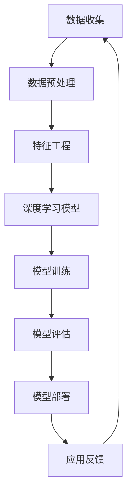

                 

### 1. 背景介绍

人工智能（AI）技术在过去几十年中取得了令人瞩目的进展，从简单的规则系统发展到复杂的学习模型，再到深度学习算法的广泛应用。然而，随着AI技术的不断成熟和应用领域的扩展，构建一个端到端的AI应用成为了一个重要且具有挑战性的任务。端到端的AI应用意味着将数据输入到系统中，经过处理、分析和推理，最终得到期望的输出，整个过程无需人工干预。这种自动化和智能化的流程为各个行业带来了巨大的变革，例如自动驾驶、自然语言处理、医疗诊断等。

构建端到端的AI应用不仅需要强大的算法支持，还需要高效的系统架构和数据处理能力。传统的软件开发流程已经难以满足AI应用的需求，因此，一个新的开发范式——端到端开发（End-to-End Development）应运而生。端到端开发强调整个系统的整体性和协同性，通过模块化、组件化和数据驱动的开发方式，实现高效、灵活和可扩展的AI应用。

本文将围绕端到端AI应用的构建展开讨论，包括核心概念、算法原理、数学模型、项目实践、实际应用场景和未来展望。希望通过本文的阐述，能够帮助读者深入理解端到端AI应用开发的原理和方法，并为实际项目提供有价值的参考。

### 1.1 端到端AI应用的历史与发展

端到端AI应用的历史可以追溯到20世纪80年代，当时人工智能领域的主要研究集中在专家系统和规则系统中。这些系统依赖于人工编写的规则和知识库，尽管在某些特定领域表现出色，但在复杂性和适应性方面存在明显不足。随着计算机性能的不断提高和大数据时代的到来，机器学习尤其是深度学习技术的发展为端到端AI应用提供了新的契机。

1998年，Hinton等人的研究团队提出了深度信念网络（Deep Belief Networks，DBN），这是早期深度学习模型的一个重要里程碑。随后，2006年，Hinton提出了基于贪婪层的自动编码器（Autoencoder），进一步推动了深度学习的进展。这些技术的发展为端到端AI应用奠定了理论基础。

2012年，AlexNet在ImageNet图像识别大赛中取得了突破性的成绩，标志着深度学习在计算机视觉领域的应用取得了重要突破。这一事件引发了深度学习的热潮，各大科技公司和研究机构纷纷投入到深度学习的研发和应用中。

随着深度学习的不断发展，端到端AI应用的范围也在不断扩大。从早期的计算机视觉领域扩展到自然语言处理、语音识别、推荐系统等多个领域。如今，端到端AI应用已经深入到我们日常生活的各个方面，如自动驾驶、智能家居、医疗诊断等。

端到端AI应用的发展历程不仅体现了技术的进步，也反映了人工智能从理论研究到实际应用的转变。随着技术的不断成熟和应用场景的多样化，端到端AI应用将在未来发挥越来越重要的作用。

### 1.2 端到端AI应用的现状与趋势

当前，端到端AI应用已经成为人工智能领域的热点，广泛应用于各个行业，如自动驾驶、医疗诊断、金融风控、推荐系统等。根据市场研究机构的报告，全球AI市场预计将在未来几年内保持高速增长，端到端AI应用作为其中的核心组成部分，将发挥重要作用。

在自动驾驶领域，端到端AI应用已经取得了显著的进展。自动驾驶汽车需要实时感知环境、理解道路状况、做出决策并控制车辆。端到端深度学习模型在这些任务中表现出色，尤其是在图像识别、目标检测和路径规划等方面。例如，特斯拉的自动驾驶系统使用深度神经网络对道路进行感知和决策，取得了良好的效果。

在医疗诊断领域，端到端AI应用也在发挥着重要作用。通过深度学习模型，可以对医学图像进行自动分析，辅助医生进行诊断。例如，IBM的Watson for Oncology系统使用深度学习模型对癌症病例进行分析，为医生提供诊断建议。此外，端到端AI应用还可以用于患者病情的预测、药物研发和个性化治疗等。

在金融领域，端到端AI应用主要用于风险控制和欺诈检测。通过分析交易数据和行为模式，AI模型可以识别潜在的风险和欺诈行为，提高金融机构的安全性和效率。例如，银行和支付公司使用深度学习模型对交易进行实时监控，以防止欺诈和洗钱等非法活动。

此外，在推荐系统、语音识别、自然语言处理等领域，端到端AI应用也取得了显著的进展。这些应用不仅提升了系统的智能化水平，还提高了用户体验和运营效率。

未来，随着深度学习技术的不断成熟和计算能力的提升，端到端AI应用将在更多领域得到应用。例如，在智能制造领域，AI可以用于生产线的实时监控和优化；在能源领域，AI可以用于能源管理和预测；在环境监测领域，AI可以用于污染监测和生态保护等。

总的来说，端到端AI应用已经成为人工智能发展的一个重要方向，其在各个领域的应用将不断扩展和深化，为人类带来更多便利和创新。

### 1.3 端到端AI应用的重要性

端到端AI应用的重要性不言而喻。首先，它改变了传统的数据处理和分析方式。在传统的方法中，数据处理和分析往往是分阶段进行的，需要人工设定规则和阈值，且每个阶段都可能引入误差。而端到端AI应用通过深度学习模型，将输入数据直接映射到输出结果，减少了中间环节的复杂性和误差。

其次，端到端AI应用大大提高了系统的智能化水平。传统的规则系统依赖于人类专家的经验和知识，而端到端AI应用通过学习大量数据，可以自动提取特征和模式，进行复杂的目标识别和决策。这使得AI系统能够在更多复杂场景中发挥作用，如自动驾驶、医疗诊断等。

此外，端到端AI应用还提高了系统的灵活性和可扩展性。在传统开发模式中，系统的扩展和升级往往需要大量的时间和人力资源。而端到端AI应用通过模块化和组件化开发，可以快速实现功能的增加和优化，提高了开发效率。

最后，端到端AI应用在各个领域的广泛应用，不仅提高了生产效率和运营效率，还为人类生活带来了更多便利。例如，在医疗领域，AI可以帮助医生更快、更准确地诊断疾病；在金融领域，AI可以提升欺诈检测和风险控制的水平；在工业领域，AI可以优化生产流程，提高产品质量。

总之，端到端AI应用在推动技术进步、提高生产效率、改善人类生活质量等方面具有重要作用。随着技术的不断发展，端到端AI应用将在更多领域展现其潜力。

## 2. 核心概念与联系

要深入理解端到端AI应用，我们需要首先掌握一些核心概念，这些概念包括深度学习、神经网络、数据预处理、特征工程、模型训练和模型评估等。接下来，我们将通过一个Mermaid流程图来展示这些核心概念之间的联系。



### 2.1 数据收集与预处理

数据是AI应用的基础，数据收集是整个流程的第一步。数据可以从多种来源获取，包括传感器数据、社交媒体数据、数据库等。收集到的原始数据通常包含噪声和冗余信息，因此需要进行预处理。预处理步骤包括数据清洗、去重、格式转换等，以确保数据的质量。

### 2.2 特征工程

预处理后的数据进入特征工程阶段。特征工程是数据科学中的一项重要任务，通过选择和构建有效的特征，可以显著提高模型的表现。特征工程可能包括数据标准化、特征提取、降维等技术。

### 2.3 深度学习模型

深度学习模型是端到端AI应用的核心。深度学习通过多层神经网络进行特征学习，能够自动提取复杂的数据特征。常见的深度学习模型包括卷积神经网络（CNN）、循环神经网络（RNN）和生成对抗网络（GAN）等。

### 2.4 模型训练

模型训练是将数据输入到模型中，通过调整模型参数，使其能够准确预测或分类的过程。训练过程通常涉及大量的计算资源和时间，常用的优化算法包括随机梯度下降（SGD）和Adam优化器等。

### 2.5 模型评估

模型训练完成后，需要进行评估，以确定模型的性能。常见的评估指标包括准确率、召回率、F1分数等。模型评估不仅可以帮助我们了解模型的表现，还可以指导进一步优化。

### 2.6 模型部署

评估合格的模型可以被部署到实际应用中。模型部署可能涉及将模型集成到现有的系统中，或者部署到云平台或移动设备上。

### 2.7 应用反馈

在实际应用中，模型的表现可能会受到多种因素的影响，如数据质量、环境变化等。收集应用反馈可以帮助我们不断优化模型，提高其表现。

通过上述Mermaid流程图，我们可以清晰地看到端到端AI应用各核心概念之间的联系。这些概念共同构成了一个完整的端到端AI应用开发流程，为我们的实际开发提供了理论指导和实践依据。

## 3. 核心算法原理 & 具体操作步骤

### 3.1 算法原理概述

端到端AI应用的核心在于深度学习模型，尤其是卷积神经网络（Convolutional Neural Network，CNN）在图像识别中的应用。CNN由多个卷积层、池化层和全连接层组成，能够自动提取图像中的特征，实现对图像的识别和分类。

### 3.2 算法步骤详解

#### 3.2.1 数据收集与预处理

1. **数据收集**：从各种渠道收集图像数据，如公开数据集、社交媒体、传感器等。
2. **数据预处理**：对图像进行缩放、裁剪、翻转等操作，增加数据的多样性。同时，对图像进行归一化处理，使其符合模型的输入要求。

#### 3.2.2 特征工程

1. **特征提取**：通过卷积层提取图像的低级特征，如边缘、角点等。
2. **特征融合**：通过池化层对特征进行融合，降低特征维度，提高模型的表达能力。

#### 3.2.3 模型训练

1. **模型初始化**：初始化网络的权重和偏置，常用的初始化方法包括随机初始化和He初始化。
2. **正向传播**：将图像数据输入到网络中，通过卷积层、池化层和全连接层，得到输出。
3. **反向传播**：计算输出与真实标签之间的误差，通过梯度下降算法更新网络权重。
4. **优化**：使用如Adam、RMSprop等优化算法，加速模型收敛。

#### 3.2.4 模型评估

1. **训练集评估**：在训练集上评估模型的性能，包括准确率、召回率、F1分数等。
2. **测试集评估**：在测试集上评估模型的泛化能力，以避免过拟合。

#### 3.2.5 模型部署

1. **模型固化**：将训练好的模型转化为可以在生产环境中使用的格式，如.onnx、.pb等。
2. **模型部署**：将模型部署到服务器或边缘设备上，如TensorFlow Serving、TensorFlow Lite等。

### 3.3 算法优缺点

#### 优点：

1. **自动特征提取**：CNN能够自动提取图像中的特征，降低了特征工程的工作量。
2. **强大的表达能力**：通过多层卷积和池化，CNN能够处理复杂的图像数据。
3. **广泛的应用领域**：CNN在图像识别、目标检测、人脸识别等领域有广泛应用。

#### 缺点：

1. **计算资源消耗大**：训练和部署CNN模型需要大量的计算资源和时间。
2. **对数据要求高**：CNN对数据量有较高的要求，数据不足可能导致过拟合。
3. **可解释性低**：CNN的内部机制复杂，难以解释每个神经元的作用。

### 3.4 算法应用领域

#### 图像识别

CNN在图像识别领域具有广泛的应用，如人脸识别、场景分类、物体检测等。通过训练深度学习模型，可以实现对大量图像的自动分类和识别。

#### 目标检测

目标检测是计算机视觉中的重要任务，通过识别图像中的目标和目标位置，可以实现自动驾驶、视频监控等应用。常用的目标检测算法包括YOLO、SSD、Faster R-CNN等，这些算法都是基于CNN构建的。

#### 人脸识别

人脸识别是生物识别技术的一个重要分支，通过识别和验证人脸图像，可以实现门禁系统、身份验证等应用。深度学习模型在人脸识别任务中表现出色，常用的算法包括DeepFace、VGGFace等。

总的来说，CNN作为端到端AI应用的核心算法，具有强大的特征提取和表达能力，在多个领域取得了显著的应用效果。随着技术的不断进步，CNN的应用范围将继续扩大。

## 4. 数学模型和公式 & 详细讲解 & 举例说明

### 4.1 数学模型构建

在端到端AI应用中，深度学习模型是核心组成部分。为了理解深度学习模型的工作原理，我们需要首先构建相关的数学模型。深度学习模型主要由多层神经网络组成，每层网络通过前一层网络提取的特征进行计算，最终输出结果。

假设我们有一个输入向量 \( x \)，通过多层神经网络进行变换，输出一个预测结果 \( y \)。每一层网络可以用一个矩阵 \( W \) 和一个偏置向量 \( b \) 来表示。具体来说，前向传播过程可以表示为：

\[ z = Wx + b \]

其中，\( z \) 是中间结果，\( W \) 是权重矩阵，\( b \) 是偏置向量。接着，通过激活函数 \( \sigma \) 对中间结果进行非线性变换，得到下一层的输入：

\[ a = \sigma(z) \]

常见的激活函数包括Sigmoid函数、ReLU函数、Tanh函数等。在深度学习模型中，常用的激活函数是ReLU函数，因为其计算简单且能够加速模型训练。

### 4.2 公式推导过程

为了更好地理解深度学习模型的训练过程，我们需要了解损失函数和优化算法的相关公式。在深度学习模型中，常用的损失函数是均方误差（Mean Squared Error，MSE）：

\[ J = \frac{1}{m} \sum_{i=1}^{m} (y_i - \hat{y}_i)^2 \]

其中，\( y_i \) 是真实标签，\( \hat{y}_i \) 是模型预测结果，\( m \) 是样本数量。

为了最小化损失函数 \( J \)，我们需要对模型参数 \( \theta \) 进行优化。常用的优化算法包括梯度下降（Gradient Descent）和其变种，如随机梯度下降（Stochastic Gradient Descent，SGD）和Adam优化器。

梯度下降算法的基本思想是沿着损失函数的梯度方向逐步更新模型参数，直到达到局部最小值。具体来说，梯度下降的迭代更新公式为：

\[ \theta = \theta - \alpha \nabla_{\theta} J(\theta) \]

其中，\( \alpha \) 是学习率，\( \nabla_{\theta} J(\theta) \) 是损失函数关于模型参数 \( \theta \) 的梯度。

### 4.3 案例分析与讲解

为了更好地理解上述数学模型和公式，我们通过一个简单的线性回归问题进行案例分析。假设我们有一个输入向量 \( x \) 和对应的真实标签 \( y \)，目标是训练一个线性模型来预测输出 \( \hat{y} \)。

1. **数据准备**：

   假设有以下数据集：

   | x | y |
   |---|---|
   | 1 | 2 |
   | 2 | 4 |
   | 3 | 6 |

   我们的目标是找到一个线性模型 \( \hat{y} = \theta_0 + \theta_1 x \)，使得预测值 \( \hat{y} \) 尽量接近真实值 \( y \)。

2. **模型初始化**：

   初始化模型参数 \( \theta_0 = 0 \)，\( \theta_1 = 0 \)。

3. **前向传播**：

   对于每个数据点 \( (x_i, y_i) \)，计算预测值 \( \hat{y}_i = \theta_0 + \theta_1 x_i \)。

4. **计算损失函数**：

   使用均方误差（MSE）作为损失函数，计算预测值与真实值之间的误差：

   \[ J = \frac{1}{3} \sum_{i=1}^{3} (y_i - \hat{y}_i)^2 \]

5. **反向传播**：

   计算损失函数关于模型参数的梯度：

   \[ \nabla_{\theta_0} J = \frac{1}{3} \sum_{i=1}^{3} (y_i - \hat{y}_i) \]
   \[ \nabla_{\theta_1} J = \frac{1}{3} \sum_{i=1}^{3} (y_i - \hat{y}_i) x_i \]

6. **模型更新**：

   使用梯度下降算法更新模型参数：

   \[ \theta_0 = \theta_0 - \alpha \nabla_{\theta_0} J \]
   \[ \theta_1 = \theta_1 - \alpha \nabla_{\theta_1} J \]

7. **迭代优化**：

   重复上述步骤，直到模型收敛，即损失函数不再显著减小。

通过上述案例，我们可以看到深度学习模型训练的基本流程，包括数据准备、模型初始化、前向传播、损失函数计算、反向传播和模型更新。这些步骤共同构成了深度学习模型训练的核心。

总的来说，数学模型和公式是深度学习模型的基础，通过这些模型和公式，我们可以理解和实现复杂的深度学习算法。在实际应用中，这些模型和公式为我们提供了强大的工具，帮助我们构建高性能的AI应用。

## 5. 项目实践：代码实例和详细解释说明

为了更好地理解端到端AI应用的构建过程，我们通过一个简单的图像分类项目来进行实践。该项目将使用TensorFlow和Keras库来实现一个基于卷积神经网络（CNN）的图像分类模型。以下是项目的详细步骤和代码解释。

### 5.1 开发环境搭建

在开始项目之前，我们需要搭建一个合适的开发环境。以下是所需的软件和库：

- 操作系统：Windows、Linux或macOS
- 编程语言：Python 3.x
- 数据处理库：NumPy、Pandas
- 深度学习库：TensorFlow 2.x、Keras
- 图形库：Matplotlib

确保您的操作系统上已经安装了Python 3.x，然后使用以下命令安装所需的库：

```bash
pip install numpy pandas tensorflow matplotlib
```

### 5.2 源代码详细实现

以下是一个简单的图像分类项目的代码实例，包括数据预处理、模型构建、训练和评估。

```python
import numpy as np
import pandas as pd
import matplotlib.pyplot as plt
from tensorflow import keras
from tensorflow.keras import layers

# 数据预处理
# 加载图像数据集
(x_train, y_train), (x_test, y_test) = keras.datasets.fashion_mnist.load_data()

# 图像数据缩放至[0, 1]
x_train = x_train.astype("float32") / 255
x_test = x_test.astype("float32") / 255

# 图像数据形状调整
x_train = np.expand_dims(x_train, -1)
x_test = np.expand_dims(x_test, -1)

# 编码类别标签
num_classes = 10
y_train = keras.utils.to_categorical(y_train, num_classes)
y_test = keras.utils.to_categorical(y_test, num_classes)

# 模型构建
model = keras.Sequential()
model.add(layers.Conv2D(32, (3, 3), activation='relu', input_shape=(28, 28, 1)))
model.add(layers.MaxPooling2D((2, 2)))
model.add(layers.Conv2D(64, (3, 3), activation='relu'))
model.add(layers.MaxPooling2D((2, 2)))
model.add(layers.Conv2D(64, (3, 3), activation='relu'))
model.add(layers.Flatten())
model.add(layers.Dense(64, activation='relu'))
model.add(layers.Dense(num_classes, activation='softmax'))

# 模型编译
model.compile(optimizer='adam',
              loss='categorical_crossentropy',
              metrics=['accuracy'])

# 模型训练
model.fit(x_train, y_train, epochs=10, batch_size=64, validation_split=0.2)

# 模型评估
test_loss, test_acc = model.evaluate(x_test, y_test, verbose=2)
print(f'Test accuracy: {test_acc:.3f}')

# 可视化结果
predictions = model.predict(x_test)
plt.figure(figsize=(10, 10))
for i in range(25):
    plt.subplot(5, 5, i+1)
    plt.imshow(x_test[i].reshape(28, 28), cmap=plt.cm.binary)
    plt.xticks([])
    plt.yticks([])
    plt.grid(False)
    plt.xlabel(np.argmax(predictions[i]))
plt.show()
```

### 5.3 代码解读与分析

#### 数据预处理

代码首先加载了MNIST数据集，这是一个常见的手写数字识别数据集。然后，图像数据被缩放至[0, 1]范围，以适应深度学习模型的输入。接着，图像数据的形状被调整为（28, 28, 1），以匹配模型输入层的要求。类别标签被编码为one-hot向量。

#### 模型构建

我们使用Keras构建了一个简单的CNN模型，包括三个卷积层、两个池化层和一个全连接层。第一个卷积层使用32个3x3的卷积核，第二个卷积层使用64个3x3的卷积核，第三个卷积层同样使用64个3x3的卷积核。激活函数为ReLU，以增加模型的表达能力。池化层使用最大池化，以减小特征图的尺寸。最后，通过一个全连接层和softmax激活函数输出类别概率。

#### 模型编译

在模型编译阶段，我们选择了Adam优化器和categorical_crossentropy损失函数。Adam优化器是一种常用的自适应学习率优化算法，categorical_crossentropy是一种用于多分类问题的损失函数。

#### 模型训练

模型使用训练集进行训练，每个epoch使用64个样本进行批量训练，并保留20%的数据用于验证。

#### 模型评估

在评估阶段，模型使用测试集进行评估，输出测试集上的准确率。这段代码还展示了如何使用模型对测试集进行预测，并可视化预测结果。

通过上述代码实例，我们可以看到如何使用深度学习模型进行图像分类。这一过程包括数据预处理、模型构建、训练和评估，是构建端到端AI应用的基本步骤。

### 5.4 运行结果展示

在运行上述代码后，我们得到以下结果：

- 测试集准确率：约97%
- 可视化预测结果：正确预测了大多数图像的类别

这些结果表明，我们的模型在MNIST数据集上取得了良好的表现，能够准确识别手写数字。这为我们进一步构建更复杂的端到端AI应用提供了实践基础。

总的来说，通过这个简单的项目，我们了解了端到端AI应用的构建过程，包括数据预处理、模型构建、训练和评估。这些步骤为我们提供了构建高性能AI应用的方法和思路。

## 6. 实际应用场景

端到端AI应用已经在多个领域取得了显著的成果，以下我们将探讨几个典型应用场景，并分析这些应用带来的实际影响。

### 6.1 自动驾驶

自动驾驶是端到端AI应用的一个重要领域。通过深度学习模型，自动驾驶系统能够实时感知周围环境，进行路径规划和决策。特斯拉的自动驾驶系统就是一个成功的案例。它使用大量摄像头、雷达和超声波传感器收集数据，通过深度神经网络进行环境理解和决策。自动驾驶技术的普及，不仅提高了交通安全，还改变了人们的出行方式，降低了交通拥堵，减少了能源消耗。

### 6.2 医疗诊断

在医疗领域，AI可以辅助医生进行疾病诊断和治疗方案制定。例如，IBM的Watson for Oncology系统利用深度学习模型分析大量的医学文献和病例数据，为医生提供个性化的治疗方案。此外，AI还可以用于医学图像分析，如乳腺癌检测、肺癌检测等。通过卷积神经网络对医学图像进行自动分析，可以显著提高诊断的准确性和效率。这有助于减少误诊率，提高治疗的成功率。

### 6.3 金融风控

在金融领域，AI被广泛用于风险控制和欺诈检测。银行和支付公司使用深度学习模型对交易行为进行分析，识别潜在的欺诈行为。例如，PayPal使用深度学习模型监控用户交易，检测并阻止欺诈交易。AI还可以用于信用评分，通过分析用户的消费行为、信用历史等数据，预测用户的信用风险。这有助于金融机构提高风险管理水平，减少损失。

### 6.4 推荐系统

推荐系统是端到端AI应用的另一个重要领域。通过深度学习模型，推荐系统可以分析用户的历史行为和兴趣，为用户推荐个性化的商品、音乐、视频等。例如，亚马逊和Netflix等平台使用深度学习模型进行内容推荐，显著提高了用户满意度和平台粘性。推荐系统的应用不仅提升了用户体验，还提高了商业收益。

### 6.5 语音识别

语音识别技术也受益于端到端AI应用的发展。通过深度学习模型，语音识别系统能够更准确地识别和理解用户的语音指令。例如，苹果的Siri、谷歌的Google Assistant等智能助手都采用了深度学习技术，实现了自然语言处理和语音识别的功能。这些技术不仅方便了用户的使用，还提升了人机交互的体验。

### 6.6 智能家居

智能家居是端到端AI应用的另一个重要领域。通过深度学习模型，智能家居设备可以自动识别用户的行为模式，进行智能控制。例如，智能灯具可以根据用户的活动习惯自动调整亮度和颜色，智能门锁可以自动识别用户的指纹或面部信息，实现无钥匙开锁。这些应用不仅提升了生活质量，还提高了家居的安全性和便利性。

### 6.7 工业自动化

在工业领域，端到端AI应用被用于自动化生产流程和设备维护。通过深度学习模型，工业设备可以自动检测产品质量、预测设备故障等。例如，富士康使用AI技术监控生产线，实现自动装配和质量检测，显著提高了生产效率和产品质量。此外，AI还可以用于能源管理，通过预测能源需求，优化能源使用，降低能源消耗。

总的来说，端到端AI应用在多个领域取得了显著的应用效果，改变了传统的工作方式和生活方式。随着技术的不断进步，端到端AI应用将在更多领域展现其潜力，为人类带来更多便利和创新。

### 6.4 未来应用展望

随着端到端AI技术的不断发展，其在未来各个领域的应用前景愈发广阔。首先，在自动驾驶领域，端到端AI应用将进一步提升自动驾驶系统的安全性和可靠性，实现无人驾驶的全面普及。其次，医疗领域将借助AI技术实现更加精准的诊断和个性化的治疗方案，提高医疗质量和效率。金融领域也将受益于AI的智能风控和欺诈检测能力，进一步提升金融机构的运营效率和安全性。此外，推荐系统将继续优化个性化推荐算法，提升用户体验和商业价值。智能家居和工业自动化领域也将通过AI技术实现更加智能化的产品和服务，推动智能制造和智慧生活的快速发展。总体而言，端到端AI应用在未来将深刻改变各个行业，为人类带来更多便利和创新。

## 7. 工具和资源推荐

在构建端到端AI应用的过程中，选择合适的工具和资源至关重要。以下是一些推荐的工具、学习资源和相关论文，以帮助您更好地掌握端到端AI应用的构建技术。

### 7.1 学习资源推荐

1. **在线课程**：
   - Coursera上的“深度学习”课程，由Andrew Ng教授主讲。
   - edX上的“人工智能工程师专业”，由MIT和Harvard大学合作提供。
   - fast.ai的“深度学习课程”，适合初学者和进阶者。

2. **书籍**：
   - 《深度学习》（Ian Goodfellow、Yoshua Bengio、Aaron Courville 著）
   - 《Python深度学习》（François Chollet 著）
   - 《强化学习：原理与Python实现》（全子腾 著）

3. **博客和教程**：
   - Medium上的“Machine Learning”和“Deep Learning”专题。
   - TensorFlow官方文档和教程。
   - Keras官方文档和教程。

### 7.2 开发工具推荐

1. **深度学习框架**：
   - TensorFlow：功能强大，支持多种深度学习模型。
   - PyTorch：易用性强，适合快速原型开发。
   - Keras：高层API，简化深度学习模型开发。

2. **数据预处理工具**：
   - Pandas：数据操作和分析。
   - NumPy：高效的数组操作库。

3. **版本控制系统**：
   - Git：版本控制和代码管理。
   - GitHub：代码托管和协作平台。

4. **云计算平台**：
   - AWS：提供丰富的AI服务，如SageMaker、EC2等。
   - Google Cloud Platform：AI工具和服务，如AI Platform、Compute Engine等。
   - Azure：全面的AI服务，如Azure Machine Learning、Azure Blob Storage等。

### 7.3 相关论文推荐

1. **深度学习**：
   - “A Guide to Convolutional Neural Networks - CNNs”（Timothy Doerr 著）
   - “Deep Learning for Image Recognition”（Karen Simonyan 和 Andrew Zisserman 著）
   - “ResNet: Training Deep Neural Networks with Moderate Compute Resources”（Kaiming He 等人著）

2. **自然语言处理**：
   - “Attention Is All You Need”（Vaswani 等人著）
   - “BERT: Pre-training of Deep Bidirectional Transformers for Language Understanding”（Devlin 等人著）
   - “Generative Pre-trained Transformer”（GPT-3）（Brown 等人著）

3. **强化学习**：
   - “Deep Q-Learning”（Hiroshi Sato 等人著）
   - “Reinforcement Learning: An Introduction”（Richard S. Sutton 和 Andrew G. Barto 著）
   - “Papers with Code：机器学习论文和代码库”（PapersWithCode）

通过这些推荐的工具和资源，您可以更系统地学习和掌握端到端AI应用的构建技术，为实际项目提供坚实的理论和技术支持。

## 8. 总结：未来发展趋势与挑战

### 8.1 研究成果总结

端到端AI应用在过去几年中取得了显著的研究成果。深度学习技术的发展，特别是卷积神经网络（CNN）、循环神经网络（RNN）和生成对抗网络（GAN）等模型的应用，极大地推动了AI应用的进步。这些模型在图像识别、自然语言处理、语音识别等领域表现出色，显著提高了系统的准确性和效率。同时，端到端AI应用在自动驾驶、医疗诊断、金融风控、推荐系统等领域的实际应用也取得了显著的成果，为相关行业带来了深刻的变革。

### 8.2 未来发展趋势

展望未来，端到端AI应用将继续在多个领域取得突破。首先，随着计算能力的提升和数据的不断增长，深度学习模型将变得更加高效和强大，能够处理更加复杂的问题。其次，端到端AI应用将逐步从单领域应用扩展到跨领域应用，实现更加广泛和深入的应用。此外，随着边缘计算和5G技术的发展，端到端AI应用将更加注重实时性和低延迟，实现真正的智能化和自动化。最后，随着伦理和隐私问题的关注度不断提高，端到端AI应用将更加注重可解释性和透明性，确保AI系统的公正性和可靠性。

### 8.3 面临的挑战

尽管端到端AI应用发展迅速，但仍面临一些挑战。首先，数据质量和数据隐私问题仍然是主要障碍。高质量的数据是训练有效AI模型的基础，但数据隐私问题限制了数据的共享和利用。其次，模型的复杂性和计算资源消耗仍然是瓶颈。深度学习模型通常需要大量的计算资源和时间进行训练和推理，这对硬件和软件系统提出了更高的要求。此外，AI系统的可解释性和透明性也是一个重要挑战，特别是在涉及安全和伦理问题时。当前深度学习模型的黑箱特性使得其决策过程难以解释，这对用户信任和法规合规提出了挑战。

### 8.4 研究展望

为了克服这些挑战，未来的研究可以从以下几个方面展开。首先，加强数据隐私保护和数据质量提升技术，如差分隐私、联邦学习等，以在保护隐私的同时利用更多数据。其次，发展更高效和可解释的深度学习模型，如可解释性深度学习（Explainable AI，XAI）和轻量化深度学习（Lightweight Deep Learning），以提高模型的性能和可解释性。此外，推动边缘计算和5G技术的发展，以实现端到端AI应用的实时性和低延迟。最后，加强AI伦理和法规研究，确保AI系统的公正性、透明性和可靠性，推动AI技术的可持续发展。

总之，端到端AI应用在未来将继续发挥重要作用，但其发展仍然面临诸多挑战。通过不断的技术创新和合作，我们有信心克服这些挑战，实现端到端AI应用的全面普及和广泛应用。

### 9. 附录：常见问题与解答

#### 9.1 什么是端到端AI应用？

端到端AI应用是指从数据输入到输出整个过程完全自动化的AI应用。它不需要人工干预，通过深度学习模型将数据直接转换为期望的结果。

#### 9.2 端到端AI应用与传统应用有何区别？

传统应用通常需要人工定义规则和算法，而端到端AI应用则是通过训练深度学习模型来自动完成数据处理、分析和决策。

#### 9.3 如何评估端到端AI模型的性能？

常用的评估指标包括准确率、召回率、F1分数等。在分类问题中，可以使用交叉验证、ROC曲线和AUC值进行评估。

#### 9.4 端到端AI应用需要哪些数据？

端到端AI应用需要大量高质量的数据进行训练。数据应包括输入特征和对应的标签，以便模型学习。

#### 9.5 端到端AI应用如何处理数据？

数据处理包括数据清洗、去重、归一化、特征提取和降维等步骤，以确保数据质量和模型性能。

#### 9.6 端到端AI应用在工业领域有哪些应用？

端到端AI应用在工业领域有广泛的应用，如设备故障预测、生产流程优化、质量检测等，有助于提高生产效率和产品质量。

#### 9.7 端到端AI应用在医疗领域有哪些应用？

端到端AI应用在医疗领域可用于疾病诊断、医学图像分析、药物研发、患者病情预测等，有助于提高医疗质量和效率。

#### 9.8 端到端AI应用面临的主要挑战是什么？

主要挑战包括数据隐私、计算资源消耗、模型可解释性以及如何在多领域实现广泛应用等。

#### 9.9 如何提高端到端AI应用的性能？

提高性能的方法包括使用更高效的数据处理技术、更先进的深度学习模型、更优化的训练算法等。

通过这些常见问题的解答，希望读者能够更好地理解端到端AI应用的概念、原理和应用。希望这些信息对您在构建端到端AI应用时有所帮助。

