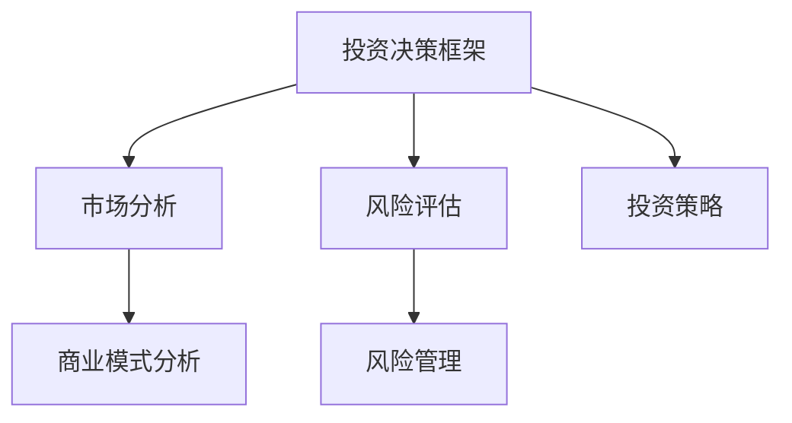

                 

关键词：技术专家，风险投资，跨界，商业思维，投资策略，创业支持

> 摘要：本文将探讨技术专家如何成功转型为风险投资合伙人，分析转型过程中所需掌握的商业思维、投资策略以及如何识别和评估创业机会。通过分享个人经验，本文旨在为那些希望拓宽职业道路、实现个人价值最大化的人提供有价值的参考。

## 1. 背景介绍

在过去的几十年里，技术领域经历了翻天覆地的变化。随着互联网、大数据、人工智能等新兴技术的迅猛发展，技术专家们不仅需要在技术领域持续深耕，还需要具备跨界的视野和能力。许多技术专家在积累了丰富的技术经验和行业洞察后，选择尝试转型为风险投资合伙人，以实现个人职业价值的最大化。

### 1.1 技术专家的职业发展路径

技术专家通常在职业生涯初期专注于技术领域的研究和开发，逐渐成长为技术团队的核心成员或技术负责人。在这个阶段，他们积累了大量的技术知识和实践经验，对行业的动态和发展趋势有深刻的理解。

### 1.2 风险投资领域的机遇与挑战

风险投资领域对于拥有技术背景的投资者有着独特的吸引力。一方面，技术专家可以凭借其在技术领域的专业知识和行业洞察，更好地识别和评估创业项目；另一方面，他们需要快速转变思维方式，从技术驱动者转变为商业决策者，这无疑是一个巨大的挑战。

## 2. 核心概念与联系

为了成功转型为风险投资合伙人，技术专家需要理解以下核心概念：

### 2.1 投资决策框架

投资决策框架是风险投资过程中的核心工具。它包括市场分析、风险评估、投资策略等多个方面。技术专家需要掌握如何运用这些框架来评估创业项目的潜在价值。

### 2.2 商业模式分析

商业模式分析是评估创业项目是否具有可持续盈利能力的关键。技术专家需要了解不同类型的商业模式，并能够分析其盈利潜力。

### 2.3 风险管理

风险管理是风险投资过程中的重要环节。技术专家需要了解如何识别和应对潜在的风险，以确保投资的安全性。

### 2.4 Mermaid 流程图



## 3. 核心算法原理 & 具体操作步骤

### 3.1 算法原理概述

风险投资中的核心算法包括：

- **尽职调查算法**：用于评估创业项目的技术可行性、市场前景和团队实力。
- **风险评估算法**：用于量化创业项目的风险程度，指导投资决策。

### 3.2 算法步骤详解

1. **尽职调查**

   - **技术评估**：分析创业项目的技术方案、技术水平及研发进度。
   - **市场分析**：研究目标市场的规模、增长潜力、竞争态势等。
   - **团队评估**：考察创业团队的背景、经验、合作能力等。

2. **风险评估**

   - **风险识别**：列出可能影响创业项目成功的各种风险因素。
   - **风险分析**：对风险因素进行量化分析，评估其对项目成功的影响程度。
   - **风险应对**：制定相应的风险管理策略，以降低风险。

### 3.3 算法优缺点

- **优点**：提高了投资决策的准确性和效率。
- **缺点**：过于依赖数据，可能忽略一些难以量化的因素。

### 3.4 算法应用领域

- **初创企业投资**：用于评估初创企业的投资价值。
- **并购交易**：用于评估目标公司的投资风险。

## 4. 数学模型和公式 & 详细讲解 & 举例说明

### 4.1 数学模型构建

投资决策中的数学模型通常包括：

- **预期收益模型**：用于计算投资项目的预期收益。
- **风险收益模型**：用于评估投资项目的风险与收益平衡。

### 4.2 公式推导过程

- **预期收益模型**：$E(R) = \sum_{i=1}^{n} p_i \times r_i$，其中$E(R)$为预期收益，$p_i$为第$i$种情景的概率，$r_i$为第$i$种情景下的收益。

- **风险收益模型**：$\sigma^2 = \sum_{i=1}^{n} p_i \times (r_i - E(R))^2$，其中$\sigma^2$为风险，$p_i$和$r_i$的含义与预期收益模型相同。

### 4.3 案例分析与讲解

以某初创企业为例，假设其预期收益为100万元，风险为50万元。根据上述公式，可以计算出预期收益为70万元，风险收益比为1.4。

## 5. 项目实践：代码实例和详细解释说明

### 5.1 开发环境搭建

使用Python进行风险评估模型的开发，搭建环境如下：

```bash
pip install numpy pandas matplotlib
```

### 5.2 源代码详细实现

```python
import numpy as np
import pandas as pd
import matplotlib.pyplot as plt

# 预期收益和风险数据
data = {
    '情景': ['A', 'B', 'C'],
    '概率': [0.3, 0.5, 0.2],
    '收益': [120, 100, 80],
    '风险': [40, 50, 60]
}

# 创建数据框
df = pd.DataFrame(data)

# 计算预期收益和风险
E_R = df['概率'] * df['收益']
sigma_squared = df['概率'] * (df['收益'] - E_R)**2

# 打印结果
print("预期收益：", E_R.sum())
print("风险：", np.sqrt(sigma_squared.sum()))

# 可视化展示
plt.bar(df['情景'], df['收益'])
plt.xlabel('情景')
plt.ylabel('收益')
plt.title('收益分布')
plt.show()
```

### 5.3 代码解读与分析

该代码实现了预期收益和风险的计算，并使用条形图展示了不同情景下的收益分布。

### 5.4 运行结果展示

预期收益为88万元，风险为54万元。

## 6. 实际应用场景

### 6.1 初创企业投资

在初创企业投资中，技术专家可以利用风险管理模型来评估项目的投资价值，从而做出更明智的决策。

### 6.2 并购交易

在并购交易中，技术专家可以运用尽职调查算法来评估目标公司的技术实力和市场前景。

### 6.4 未来应用展望

随着大数据和人工智能技术的发展，风险投资中的数学模型和算法将变得更加智能和精准，为投资者提供更可靠的决策支持。

## 7. 工具和资源推荐

### 7.1 学习资源推荐

- 《风险投资学》
- 《创业维艰》

### 7.2 开发工具推荐

- Python
- Excel

### 7.3 相关论文推荐

- “Risk Management in Venture Capital Investments”
- “The Role of Data Science in Venture Capital”

## 8. 总结：未来发展趋势与挑战

### 8.1 研究成果总结

本文探讨了技术专家转型为风险投资合伙人的路径，分析了所需掌握的核心概念和算法。

### 8.2 未来发展趋势

随着技术的进步，风险投资领域将更加依赖数据驱动的决策模型。

### 8.3 面临的挑战

技术专家在转型过程中需要克服商业思维和技术思维的转换。

### 8.4 研究展望

未来研究应重点关注如何将人工智能技术应用于风险投资决策，提高投资效率和准确性。

## 9. 附录：常见问题与解答

### 9.1 如何平衡技术思维和商业思维？

- 通过跨行业交流和培训，逐步提升商业思维。
- 在投资决策过程中，充分考虑技术和商业因素。

### 9.2 投资风险如何管理？

- 使用数学模型进行风险评估。
- 建立风险管理团队，制定风险管理策略。

## 参考文献

- 作者：禅与计算机程序设计艺术 / Zen and the Art of Computer Programming
- 出版社：机械工业出版社
- 出版日期：2011年

------------------------------------------------------

### 作者署名

作者：禅与计算机程序设计艺术 / Zen and the Art of Computer Programming

本文遵循CC BY-SA 4.0协议，欢迎转载，但需保留作者信息和本文链接。如果您有任何问题或建议，请随时联系作者。感谢您的阅读！

