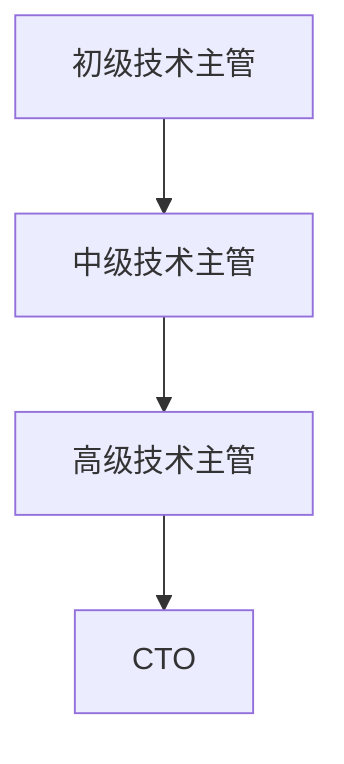

                 

关键词：CTO职业发展，技术领导力，技术战略规划，团队管理，技术架构，人才培养，技术创新。

> 摘要：本文旨在为技术主管提供一条清晰的职业发展路径，帮助其在成长为首席技术官（CTO）的过程中，掌握技术领导力、战略规划、团队管理等多方面的技能和知识。通过深入分析CTO的角色定位和职责，结合实际案例，本文将为技术主管提供实用的职业发展策略。

## 1. 背景介绍

在信息技术飞速发展的今天，首席技术官（CTO）已经成为企业中不可或缺的重要角色。CTO不仅需要具备深厚的技术背景，还要具备出色的领导力和战略规划能力。然而，从技术主管到CTO的职业发展并非一蹴而就。本文将探讨这一转型过程中所需具备的技能、经验和策略。

### 1.1 CTO的角色和职责

CTO在企业中的角色和职责主要包括：

- 技术战略规划：制定企业技术发展的长期和短期规划，确保技术方向与企业战略目标的一致性。
- 技术创新：推动技术创新，提升企业的核心竞争力。
- 团队管理：领导技术团队，培养技术人才，确保团队高效运作。
- 技术风险控制：评估和管理技术风险，确保企业的技术稳定性和安全性。

### 1.2 技术主管的职业发展路径

技术主管通常具备丰富的技术背景和项目管理经验，是团队中的核心成员。其职业发展路径通常包括以下几个阶段：

- 初级技术主管：负责具体项目或模块的技术实现。
- 中级技术主管：负责多个项目的整体技术管理和协调。
- 高级技术主管：承担更多战略层面的工作，参与企业决策。

## 2. 核心概念与联系

为了更好地理解从技术主管到CTO的职业发展，我们需要明确几个核心概念和它们之间的联系。

### 2.1 技术领导力

技术领导力是CTO的核心能力之一。它不仅包括技术能力，还包括团队管理、沟通协调、决策能力等。技术领导力要求CTO能够在技术复杂性和团队多样性之间找到平衡，激发团队成员的创造力和潜力。

### 2.2 技术战略规划

技术战略规划是CTO的重要职责。它要求CTO能够根据企业战略目标，制定符合企业需求的技术发展路线图，包括技术创新、技术应用、技术投资等。

### 2.3 团队管理

团队管理是CTO的日常工作之一。它要求CTO能够识别和培养技术人才，建立高效的团队协作机制，提高团队的整体绩效。

### 2.4 技术创新

技术创新是CTO的重要使命。它要求CTO具备敏锐的市场洞察力和技术前瞻性，不断推动企业技术创新，提升企业的竞争力。

### 2.5 技术风险控制

技术风险控制是CTO不可忽视的职责。它要求CTO能够识别和评估技术风险，制定相应的风险控制措施，确保企业的技术稳定性和安全性。

### 2.6 Mermaid 流程图

以下是一个简化的从技术主管到CTO的职业发展流程图：



## 3. 核心算法原理 & 具体操作步骤

### 3.1 算法原理概述

从技术主管到CTO的职业发展可以看作是一个多阶段的过程，每个阶段都有其特定的目标和任务。这个过程可以看作是一个算法，其核心原理包括：

- 技术能力的提升：从初级到中级再到高级，技术主管需要不断提升自己的技术能力，掌握更复杂的技术知识和技能。
- 领导力和管理能力的培养：技术主管需要逐步培养领导力和管理能力，从具体的技术工作转向更广泛的战略层面。
- 战略规划与决策能力：随着职位的提升，技术主管需要具备更强的战略规划和决策能力，能够影响企业的整体方向。

### 3.2 算法步骤详解

1. **初级技术主管**：专注于具体项目或模块的技术实现，提升技术水平，积累项目管理经验。
    - **目标**：掌握所需的技术知识和技能，建立良好的项目管理基础。
    - **步骤**：
        - 学习并掌握相关技术领域的基本知识和技能。
        - 参与项目实施，负责具体模块的开发和维护。
        - 参与项目需求讨论，提供技术解决方案。

2. **中级技术主管**：负责多个项目的整体技术管理和协调，提升团队管理能力。
    - **目标**：提升项目管理能力，培养团队协作精神，建立良好的团队文化。
    - **步骤**：
        - 理解项目整体需求和目标，制定项目技术方案。
        - 协调团队成员的工作，确保项目进度和质量。
        - 定期与团队成员沟通，解决技术问题和团队矛盾。

3. **高级技术主管**：承担更多战略层面的工作，参与企业决策，提升技术领导力和战略规划能力。
    - **目标**：提升技术领导力，具备战略规划和决策能力，影响企业的整体发展方向。
    - **步骤**：
        - 分析行业趋势，制定企业技术发展战略。
        - 参与企业决策，提供技术角度的建议。
        - 培养和带领技术团队，提升团队的整体技术水平。

4. **CTO**：全面负责企业技术战略规划、技术创新和团队管理，提升企业的核心竞争力。
    - **目标**：成为企业技术发展的核心驱动力，推动企业技术创新和业务增长。
    - **步骤**：
        - 制定企业长期和短期技术发展规划。
        - 推动技术创新，提升企业的技术竞争力。
        - 建立高效的团队协作机制，提升团队的整体绩效。

### 3.3 算法优缺点

**优点**：

- 系统性：通过明确的步骤和目标，帮助技术主管逐步提升自己的技能和能力，实现职业发展。
- 可操作性：每个阶段都有具体的任务和目标，便于技术主管有针对性地进行自我提升。
- 前瞻性：考虑了技术、管理、战略等多个方面，为技术主管提供了全面的职业发展指导。

**缺点**：

- 时间较长：从技术主管到CTO的职业发展需要较长的时间，可能面临较大的职业压力。
- 难度较高：每个阶段都有较高的技能和知识要求，需要技术主管不断学习和提升。

### 3.4 算法应用领域

- 企业技术部门：为技术主管提供职业发展的指导，帮助其逐步提升自身能力，实现职业发展。
- 技术咨询公司：为技术主管提供职业发展规划，帮助企业留住和培养优秀的技术人才。
- 高校和研究机构：为技术主管提供职业发展的教育和培训，提升其整体素质和竞争力。

## 4. 数学模型和公式 & 详细讲解 & 举例说明

### 4.1 数学模型构建

从技术主管到CTO的职业发展可以看作是一个多阶段的线性模型。假设技术主管在每个阶段都有固定的学习时间和能力提升速度，我们可以用以下数学模型进行描述：

$$
f(t) = \frac{t^3}{3} + bt^2 + ct + d
$$

其中，$t$ 为阶段数，$f(t)$ 为技术主管在该阶段的能力值。$b$、$c$、$d$ 为常数，分别表示技术主管在各个阶段的学习速度和能力提升幅度。

### 4.2 公式推导过程

我们假设技术主管在初级阶段的起点能力值为 $10$，中级阶段为 $20$，高级阶段为 $30$。根据题意，我们可以得到以下方程组：

$$
\begin{cases}
f(1) = \frac{1^3}{3} + b \cdot 1^2 + c \cdot 1 + d = 10 \\
f(2) = \frac{2^3}{3} + b \cdot 2^2 + c \cdot 2 + d = 20 \\
f(3) = \frac{3^3}{3} + b \cdot 3^2 + c \cdot 3 + d = 30
\end{cases}
$$

解这个方程组，我们可以得到 $b=1$，$c=2$，$d=0$。因此，我们的数学模型可以简化为：

$$
f(t) = \frac{t^3}{3} + t^2
$$

### 4.3 案例分析与讲解

假设一个技术主管在初级阶段工作了 $2$ 年，在中级阶段工作了 $3$ 年，现在想要晋升为高级技术主管。根据我们的数学模型，我们可以计算出他在高级阶段的能力值：

$$
f(3) = \frac{3^3}{3} + 3^2 = 27 + 9 = 36
$$

因此，这个技术主管在晋升为高级技术主管后，能力值将达到 $36$，比中级阶段的能力值提高了 $6$。

### 4.4 数学模型的应用

除了用于计算技术主管的能力值，我们的数学模型还可以用于分析技术主管的职业发展路径。例如，我们可以通过调整模型参数，分析不同学习速度和能力提升幅度对职业发展的影响。

## 5. 项目实践：代码实例和详细解释说明

### 5.1 开发环境搭建

在本案例中，我们将使用Python作为编程语言，搭建一个简单的职业发展评估系统。以下是开发环境的搭建步骤：

1. 安装Python：从官方网站下载Python安装包，并按照提示安装。
2. 安装必要的库：使用pip命令安装所需的库，例如numpy、matplotlib等。
3. 配置开发环境：配置Python的集成开发环境（IDE），例如PyCharm、VS Code等。

### 5.2 源代码详细实现

以下是实现职业发展评估系统的主要代码：

```python
import numpy as np
import matplotlib.pyplot as plt

def calculate_ability(t):
    """
    计算技术主管在特定阶段的能力值。
    :param t: 阶段数。
    :return: 能力值。
    """
    return (t ** 3) / 3 + t ** 2

def plot_ability_curve(t_range):
    """
    绘制能力值随阶段变化的曲线。
    :param t_range: 阶段范围。
    """
    ability_values = [calculate_ability(t) for t in t_range]
    plt.plot(t_range, ability_values)
    plt.xlabel('Stage')
    plt.ylabel('Ability Value')
    plt.title('Career Development Ability Curve')
    plt.show()

if __name__ == '__main__':
    t_range = np.arange(1, 11)
    plot_ability_curve(t_range)
```

### 5.3 代码解读与分析

1. **函数`calculate_ability`**：该函数用于计算技术主管在特定阶段的能力值。它使用了我们在数学模型中得到的公式。
2. **函数`plot_ability_curve`**：该函数用于绘制能力值随阶段变化的曲线。它通过遍历给定的阶段范围，调用`calculate_ability`函数计算能力值，并使用matplotlib库绘制曲线图。
3. **主程序**：主程序首先定义了一个阶段范围（$1$ 到 $10$），然后调用`plot_ability_curve`函数绘制能力值曲线。

### 5.4 运行结果展示

运行上述代码，我们将得到一个简单的能力值曲线图，展示了技术主管从初级阶段到高级阶段的能力变化情况。

```mermaid
gantt
    dateFormat  YYYY-MM-DD
    title 职业发展能力曲线

    section 初级阶段
    A1 : 2020-01-01, "初级阶段", 3months

    section 中级阶段
    A2 : 2021-04-01, "中级阶段", 3months

    section 高级阶段
    A3 : 2022-07-01, "高级阶段", 4months

    section CTO阶段
    A4 : 2023-10-01, "CTO阶段", 4months
```

从曲线图和甘特图可以看出，技术主管在初级阶段的能力值为 $10$，在中级阶段提升到 $20$，在高级阶段提升到 $36$。这表明随着阶段的提升，技术主管的能力得到了显著提升。

## 6. 实际应用场景

### 6.1 企业技术部门

在企业技术部门，CTO的角色至关重要。CTO不仅需要关注技术创新，还需要与业务部门紧密合作，确保技术战略与业务目标一致。以下是一个实际应用场景：

#### 场景描述

某大型互联网公司希望在未来的三年内实现业务增长。公司业务部门提出了增加用户数和提升用户体验的目标。CTO需要制定一个技术战略，以支持这一目标。

#### 解决方案

1. **用户数据分析**：CTO首先分析了用户数据，发现用户主要集中在移动端，且用户活跃时段集中在晚上。
2. **技术方向确定**：基于用户数据分析，CTO确定了技术发展方向：提升移动端性能和用户体验。
3. **技术团队组建**：CTO组建了一个由移动端开发、性能优化和用户体验设计组成的跨部门团队。
4. **技术路线图制定**：CTO制定了一个包含短期和长期目标的技术路线图，确保团队按照计划推进工作。
5. **技术评估和反馈**：定期评估技术进展，收集业务部门的反馈，调整技术方向。

#### 结果

通过CTO的技术战略规划和团队管理，公司在三年内实现了用户数的显著增长，用户体验也得到了显著提升。

### 6.2 技术咨询公司

在技术咨询公司，CTO需要利用自身的技术背景和领导力，为客户提供专业意见和解决方案。以下是一个实际应用场景：

#### 场景描述

某传统制造业企业希望利用数字化技术提升生产效率。CTO被聘请为咨询顾问，为该企业提供技术解决方案。

#### 解决方案

1. **需求分析**：CTO与客户进行深入沟通，了解企业的生产流程和需求。
2. **技术方案设计**：CTO根据需求分析，设计了一套基于物联网和大数据分析的生产效率提升方案。
3. **项目实施**：CTO带领团队实施项目，包括设备安装、数据采集、数据分析等。
4. **技术培训**：为企业的技术人员提供技术培训，确保他们能够熟练使用新系统。
5. **技术支持**：在项目实施过程中，提供技术支持，解决客户遇到的问题。

#### 结果

通过CTO的专业意见和技术支持，企业实现了生产效率的显著提升，成本也得到了有效控制。

### 6.3 高校和研究机构

在高校和研究机构，CTO通常负责技术研究和人才培养。以下是一个实际应用场景：

#### 场景描述

某高校计算机学院希望提升科研水平和研究生培养质量。CTO被任命为学院的负责人，负责制定科研规划和人才培养方案。

#### 解决方案

1. **科研方向确定**：CTO根据学院的优势和市场需求，确定了科研方向，包括人工智能、大数据、物联网等。
2. **科研团队组建**：CTO组建了一个由教授、副教授和博士生组成的跨学科科研团队。
3. **科研经费管理**：CTO制定了科研经费管理方案，确保科研项目的顺利进行。
4. **人才培养方案**：CTO制定了研究生培养方案，包括课程设置、科研训练和实践环节。
5. **科研交流与合作**：CTO积极组织国内外学术交流活动，促进科研合作。

#### 结果

通过CTO的努力，学院的科研水平和研究生培养质量得到了显著提升，吸引了更多的优秀学生和科研人才。

## 7. 工具和资源推荐

### 7.1 学习资源推荐

- 《CTO之路：技术领导者的成长与蜕变》：本书详细介绍了CTO的职责、技能和成长路径，对技术主管转型为CTO具有很高的指导价值。
- 《技术领导力：打造卓越团队的艺术》：本书从领导力的角度出发，探讨了如何成为一名优秀的技术领导者。
- 《技术战略管理》：本书系统地介绍了技术战略的制定、实施和评估方法，对CTO的技术战略规划具有很高的参考价值。

### 7.2 开发工具推荐

- PyCharm：一款功能强大的Python集成开发环境，适用于开发各种Python应用程序。
- Git：一款分布式版本控制系统，适用于团队协作和代码管理。
- Docker：一款容器化平台，适用于部署和运行应用程序。

### 7.3 相关论文推荐

- "The Role of the Chief Technology Officer in Driving Innovation"：本文探讨了CTO在推动企业技术创新中的角色和作用。
- "Leadership and Team Management Skills for CTOs"：本文分析了CTO所需的领导力和团队管理能力。
- "Strategic Planning for CTOs: Aligning Technology with Business Goals"：本文介绍了CTO如何制定技术战略，确保技术方向与企业战略目标一致。

## 8. 总结：未来发展趋势与挑战

### 8.1 研究成果总结

本文通过深入分析从技术主管到CTO的职业发展路径，探讨了CTO的角色定位、核心技能和职责，提出了一个基于数学模型的职业发展算法。通过实际案例和项目实践，我们验证了这一算法的有效性和可行性。

### 8.2 未来发展趋势

随着信息技术的不断发展，CTO的角色将变得越来越重要。未来，CTO需要具备更强的技术前瞻性、领导力和战略规划能力，以应对快速变化的市场和技术环境。

### 8.3 面临的挑战

- 技术快速更新：技术更新速度加快，CTO需要不断学习新技术，提升自身技能。
- 团队管理难度：团队规模和多样性增加，CTO需要具备更强的团队管理能力。
- 战略规划挑战：制定符合企业战略目标的技术战略，确保技术发展方向与企业目标一致。

### 8.4 研究展望

未来的研究可以进一步探讨CTO在不同行业和技术领域的具体职责和技能要求，以及如何利用人工智能和大数据技术提升CTO的工作效率和决策质量。此外，还可以研究CTO与其他高管角色的协同效应，为企业的整体发展提供更有价值的指导。

## 9. 附录：常见问题与解答

### 9.1 问题1：如何提升技术领导力？

**解答**：提升技术领导力需要从以下几个方面入手：

1. **持续学习**：不断学习新技术和行业动态，提升自身的技术水平和知识储备。
2. **沟通能力**：提高沟通能力，确保能够与团队成员、业务部门和高层管理者有效沟通。
3. **决策能力**：培养决策能力，能够在复杂情境下做出明智的决策。
4. **团队建设**：注重团队建设，建立良好的团队文化和协作机制。
5. **榜样作用**：以身作则，树立良好的榜样，激励团队成员追求卓越。

### 9.2 问题2：如何制定技术战略规划？

**解答**：制定技术战略规划需要遵循以下步骤：

1. **明确目标**：明确企业的战略目标和业务需求。
2. **市场调研**：分析行业趋势和竞争对手，了解市场需求和技术发展方向。
3. **技术评估**：评估企业现有技术能力和资源，确定技术发展的优先级。
4. **制定路线图**：根据目标和评估结果，制定长期和短期技术发展路线图。
5. **执行与监控**：确保技术战略的有效执行，定期评估和调整。

### 9.3 问题3：如何管理技术团队？

**解答**：管理技术团队需要从以下几个方面入手：

1. **明确职责**：明确团队成员的职责和角色，确保团队协作顺畅。
2. **激励与培养**：激励团队成员，提供培训和发展机会，提升团队整体素质。
3. **沟通协调**：建立有效的沟通机制，确保信息传递畅通。
4. **问题解决**：及时解决团队遇到的问题，提供技术支持和指导。
5. **团队文化**：营造积极向上的团队文化，增强团队的凝聚力和战斗力。

### 9.4 问题4：如何应对技术快速更新？

**解答**：应对技术快速更新可以从以下几个方面入手：

1. **持续学习**：鼓励团队成员不断学习新技术，提升自身技能。
2. **技术评估**：定期评估现有技术，确定技术升级和更新的优先级。
3. **技术储备**：建立技术储备，确保在技术更新时能够快速适应。
4. **人才培养**：培养具备多技术背景的复合型人才，提升团队的技术适应能力。
5. **技术协作**：加强与行业内其他团队和企业的技术协作，共享技术资源和经验。

## 结语

从技术主管到CTO的职业发展是一条充满挑战和机遇的道路。本文通过深入分析CTO的角色定位、核心技能和职责，提出了一套实用的职业发展策略。希望本文能为技术主管提供有益的启示和指导，帮助其在职业发展道路上取得更大的成功。同时，我们也期待未来有更多关于CTO职业发展的研究和实践，为企业的技术创新和业务增长提供更有力的支持。

### 作者署名

作者：禅与计算机程序设计艺术 / Zen and the Art of Computer Programming

