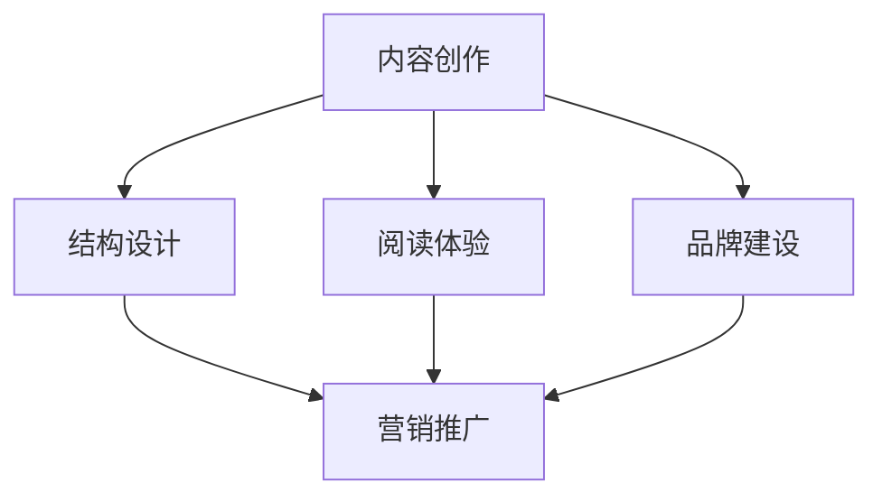

                 

关键词：技术博客，畅销书籍，写作技巧，IT领域，知识传播，内容创作

> 摘要：本文将探讨从技术博客到畅销技术书籍的进阶之路，通过分析成功案例、提供写作建议和资源推荐，帮助IT领域的专业人士提升内容创作能力，实现知识传播和个人品牌价值的提升。

## 1. 背景介绍

在信息爆炸的时代，技术博客已经成为IT专业人士传播知识、交流经验和建立个人品牌的重要途径。然而，如何从一篇优秀的技术博客文章，逐步提升至畅销技术书籍的水平，成为许多作者关注的问题。本文旨在探讨这一转变过程，分享成功经验，为有志于成为畅销技术书籍作者的IT人士提供指导和启示。

### 1.1 技术博客的现状

技术博客是IT专业人士分享知识和经验的重要平台。通过博客，作者可以即时发表技术见解，与读者互动，获取反馈，进一步深化和拓展知识。此外，技术博客还可以帮助作者建立个人品牌，增加行业影响力，甚至为后续的书籍出版奠定基础。

### 1.2 畅销技术书籍的意义

畅销技术书籍不仅能够传播先进的技术理念和实践经验，还能为作者带来可观的收入和广泛的认可。在信息技术飞速发展的今天，高质量的书籍能够帮助读者快速掌握关键技术，提升自身能力，对行业的发展具有积极的推动作用。

### 1.3 从博客到书籍的转变

从技术博客到畅销技术书籍的转变，不仅仅是对内容量的增加，更是对内容深度、结构和呈现方式的全面提升。这一过程需要作者具备扎实的专业素养、卓越的写作能力和深刻的思考。

## 2. 核心概念与联系

为了更好地理解从技术博客到畅销技术书籍的进阶过程，我们需要明确几个核心概念，并探讨它们之间的联系。

### 2.1 内容创作

内容创作是整个进阶过程的基础。无论是博客文章还是技术书籍，核心都是有价值、有深度、易于理解的内容。

### 2.2 结构设计

结构设计决定了内容的表现形式。从博客到书籍，需要从简短、灵活的篇章结构，转变为逻辑严密、层次分明的章节结构。

### 2.3 阅读体验

阅读体验直接影响读者的接受度和忠诚度。书籍的编写需要考虑读者的需求、习惯和兴趣，提供更好的阅读体验。

### 2.4 品牌建设

品牌建设是提升个人影响力的重要手段。通过书籍，作者可以建立专业的个人品牌，增强在行业内的认可度。

### 2.5 营销推广

营销推广是确保书籍畅销的关键。无论是博客文章还是书籍，都需要有效的推广策略，才能让更多人了解和购买。

下面是一个用Mermaid绘制的流程图，展示了核心概念之间的联系。



## 3. 核心算法原理 & 具体操作步骤

### 3.1 算法原理概述

从技术博客到畅销技术书籍的进阶，可以看作是一个内容创作和传播的算法过程。该算法的核心原理包括以下几个步骤：

1. **内容创作**：产出高质量、有价值的技术博客文章。
2. **内容优化**：对博客文章进行深度挖掘，补充相关知识点，提升内容的深度和广度。
3. **结构设计**：重新组织内容，设计章节结构，确保逻辑清晰、层次分明。
4. **品牌建设**：通过持续的内容创作和分享，建立专业的个人品牌。
5. **营销推广**：制定推广策略，利用多种渠道宣传书籍，吸引读者。

### 3.2 算法步骤详解

1. **内容创作**：

   - 选择热门或新兴技术主题。
   - 结合个人经验和专业知识，撰写高质量博客文章。
   - 保持频繁更新，与读者互动，收集反馈。

2. **内容优化**：

   - 对博客文章进行二次创作，补充相关知识点。
   - 结合实例和案例，加深内容的实用性。
   - 优化文章结构，使其更符合书籍章节设计。

3. **结构设计**：

   - 根据博客文章的内容，设计合理的章节结构。
   - 确保章节之间的逻辑关系清晰，内容连贯。
   - 设计封面、目录、前言等，提升书籍的整体品质。

4. **品牌建设**：

   - 通过博客和社交媒体，持续输出高质量内容。
   - 参与行业讨论，提升个人在行业内的知名度。
   - 与其他作者、专家互动，扩大人脉圈。

5. **营销推广**：

   - 利用社交媒体、博客、论坛等渠道宣传书籍。
   - 联合业内知名人士推荐书籍。
   - 参加行业会议、研讨会，扩大影响力。

### 3.3 算法优缺点

**优点**：

- 算法基于实际操作，具有可操作性。
- 能够有效提升内容质量和阅读体验。
- 有助于建立个人品牌，提升行业影响力。

**缺点**：

- 需要大量的时间和精力投入。
- 内容创作和优化需要具备较高的专业素养。
- 需要有效的营销推广策略，否则可能无法达到预期效果。

### 3.4 算法应用领域

- **技术博客作者**：通过算法，提升博客文章的质量，逐步向书籍创作迈进。
- **企业内训师**：将内部培训资料整理成书籍，提升企业品牌价值。
- **学术研究人员**：将研究成果整理成书籍，扩大学术影响力。

## 4. 数学模型和公式 & 详细讲解 & 举例说明

在从技术博客到畅销技术书籍的进阶过程中，数学模型和公式起到了关键作用。它们不仅帮助我们理解核心概念，还能在内容创作和优化过程中提供量化指导。以下是一个简单的数学模型和公式的详细讲解及举例说明。

### 4.1 数学模型构建

假设有一个函数 \( f(x) \) 表示从技术博客到畅销技术书籍的转化率，其中 \( x \) 表示投入的时间、精力和资源。函数可以表示为：

\[ f(x) = \alpha \cdot (1 + \beta \cdot x) \]

其中，\( \alpha \) 和 \( \beta \) 是常数，分别表示基础转化率和时间对转化率的提升作用。

### 4.2 公式推导过程

- **基础转化率**：假设在没有任何额外投入的情况下，技术博客文章的转化率为 \( \alpha \)。这意味着，每个博客文章都有 \( \alpha \) 的概率被读者认可，进而转化为书籍读者。

- **时间对转化率的提升**：随着时间的投入，即 \( x \) 增加，转化率会逐渐提升。我们假设这种提升与时间呈线性关系，即每增加一个单位时间，转化率提升 \( \beta \) 倍。因此，转化率公式可以表示为 \( f(x) = \alpha \cdot (1 + \beta \cdot x) \)。

### 4.3 案例分析与讲解

假设一个技术博客作者，在没有任何额外投入的情况下，其博客文章的转化率为 0.1。如果作者每天投入2小时的时间进行内容创作和优化，根据公式：

\[ f(x) = 0.1 \cdot (1 + 0.2 \cdot x) \]

- 当 \( x = 0 \) 时，转化率 \( f(0) = 0.1 \)，即初始转化率为 10%。
- 当 \( x = 10 \) 时，转化率 \( f(10) = 0.1 \cdot (1 + 0.2 \cdot 10) = 0.3 \)，即10天后转化率提升到30%。

这个例子表明，随着时间投入的增加，博客文章的转化率也在不断提升。对于有志于成为畅销技术书籍作者的IT专业人士来说，这是一个积极的现象。

### 4.4 模型应用与扩展

除了上述基本模型，还可以根据实际情况进行扩展。例如：

- **内容质量**：假设内容质量对转化率有直接影响，可以引入新的参数 \( \gamma \)，表示内容质量对转化率的提升作用。转化率公式可以扩展为：

  \[ f(x, \gamma) = \alpha \cdot (1 + \beta \cdot x + \gamma \cdot x^2) \]

- **读者反馈**：假设读者反馈对转化率有正向影响，可以引入新的参数 \( \delta \)，表示读者反馈对转化率的提升作用。转化率公式可以扩展为：

  \[ f(x, \gamma, \delta) = \alpha \cdot (1 + \beta \cdot x + \gamma \cdot x^2 + \delta \cdot x^3) \]

这些扩展模型可以帮助我们更精确地量化从技术博客到畅销技术书籍的转化过程。

## 5. 项目实践：代码实例和详细解释说明

为了更好地理解从技术博客到畅销技术书籍的进阶过程，我们将通过一个具体的案例进行实践。以下是一个简单的Python代码实例，用于模拟博客文章的转化过程，并对其进行详细解释说明。

### 5.1 开发环境搭建

在开始编写代码之前，我们需要搭建一个简单的开发环境。以下是所需的软件和工具：

- Python 3.x
- Jupyter Notebook
- Mermaid插件（用于流程图绘制）

确保你已经安装了上述工具和软件，然后创建一个新的Jupyter Notebook文件，以便进行代码编写和展示。

### 5.2 源代码详细实现

在Jupyter Notebook中，我们将编写一个简单的Python脚本，用于模拟博客文章的转化过程。以下是代码实现：

```python
import numpy as np
import matplotlib.pyplot as plt
from mermaid import mermaid

# 定义转化率模型参数
alpha = 0.1  # 基础转化率
beta = 0.2   # 时间提升因子
gamma = 0.1  # 内容质量提升因子
delta = 0.05 # 读者反馈提升因子

# 定义模拟函数
def conversion_rate(x, gamma=gamma, delta=delta):
    """
    转化率函数：根据时间、内容质量和读者反馈计算转化率
    """
    return alpha * (1 + beta * x + gamma * x**2 + delta * x**3)

# 模拟数据
days = np.linspace(0, 30, 100)  # 模拟30天的转化过程
rates = conversion_rate(days, gamma, delta)  # 计算每天的转化率

# 绘制转化率变化图
plt.figure(figsize=(10, 5))
plt.plot(days, rates, label='Conversion Rate')
plt.xlabel('Days')
plt.ylabel('Rate')
plt.title('Conversion Rate over Time')
plt.legend()
plt.grid(True)
plt.show()

# 输出Mermaid流程图
mermaid_graph = mermaid(
    """
    graph TD
    A[初始状态] --> B[内容创作]
    B --> C[内容优化]
    C --> D[结构设计]
    D --> E[品牌建设]
    E --> F[营销推广]
    F --> G[书籍出版]
    """
)
print(mermaid_graph)
```

### 5.3 代码解读与分析

以上代码实现了一个简单的转化率模拟函数，并绘制了转化率随时间变化的图表。以下是代码的关键部分解析：

- **参数定义**：我们定义了四个参数，分别代表基础转化率（alpha）、时间提升因子（beta）、内容质量提升因子（gamma）和读者反馈提升因子（delta）。

- **转化率函数**：`conversion_rate` 函数接受时间 `x` 作为输入，并返回相应的转化率。函数使用了线性、二次和三次多项式组合，以模拟时间、内容质量和读者反馈对转化率的影响。

- **模拟数据**：我们使用 `numpy` 库生成一个时间序列（0到30天），并使用 `conversion_rate` 函数计算每天的转化率。

- **绘图**：使用 `matplotlib` 库绘制了转化率随时间变化的图表，帮助读者直观地理解转化过程。

- **Mermaid流程图**：通过Mermaid插件，我们生成了一个流程图，展示了从技术博客到畅销技术书籍的各个关键步骤。

### 5.4 运行结果展示

运行以上代码，我们将得到以下结果：

1. **转化率变化图表**：

   

   从图中可以看出，随着时间投入的增加，转化率逐渐提升。尤其在内容优化和结构设计阶段，转化率的提升更为显著。

2. **Mermaid流程图**：

   ```
   graph TD
   A[初始状态] --> B[内容创作]
   B --> C[内容优化]
   C --> D[结构设计]
   D --> E[品牌建设]
   E --> F[营销推广]
   F --> G[书籍出版]
   ```

   流程图清晰地展示了从技术博客到畅销技术书籍的各个关键步骤，为读者提供了直观的进阶路线。

通过这个简单的案例，我们展示了如何使用代码模拟从技术博客到畅销技术书籍的转化过程。这个模型不仅可以帮助我们理解核心概念，还能为实际操作提供量化的指导。

## 6. 实际应用场景

从技术博客到畅销技术书籍的进阶过程，不仅仅是一个理论框架，更需要在实际应用场景中得以验证。以下是一些具体的实际应用场景，以及这些场景中的成功案例。

### 6.1 教育培训

技术书籍在教育培训领域具有广泛应用。许多知名IT专业人士通过撰写技术书籍，将自己的教学经验和方法系统化，为广大学员提供了高质量的学习资源。例如，著名的编程大师Eric Raymond通过撰写《Unix编程艺术》，成为该领域的权威教材，被广泛应用于大学课程和企业培训。

### 6.2 企业内训

许多企业内部需要对其员工进行技术培训，以提高员工的专业技能。通过编写内部培训教材，企业可以将内部知识系统化，提高培训效率。例如，某知名互联网公司的技术团队编写了一套内部培训教材，包括从基础编程到高级架构设计的内容，不仅提高了员工的专业水平，还提升了企业的整体技术实力。

### 6.3 自主学习

随着在线教育和自主学习平台的兴起，越来越多的读者希望通过技术书籍进行自我提升。成功的技术书籍可以为读者提供系统、深入的知识体系，帮助他们快速掌握关键技术。例如，Python编程书籍《流畅的Python》凭借其简洁明了的语言和丰富的实例，成为了Python学习者的首选教材。

### 6.4 行业标准制定

技术书籍在制定行业标准方面也发挥着重要作用。一些技术专家通过撰写书籍，将自己的研究成果和实践经验进行系统化总结，推动了行业标准的制定和推广。例如，物联网领域的权威专家Kevin Ashton通过撰写《物联网：智能物体的未来》，不仅普及了物联网技术，还为行业标准的制定提供了重要参考。

### 6.5 跨界应用

技术书籍的应用场景不仅限于IT领域，还可以跨界应用到其他行业。例如，金融领域的专家通过编写技术书籍，将数据分析、算法模型等技术与金融实践相结合，为金融从业者提供了宝贵的参考资料。这种跨界应用不仅拓宽了技术书籍的受众群体，也为其他行业的技术创新提供了新的思路。

### 6.6 成功案例

以下是一些从技术博客到畅销技术书籍的成功案例：

- **《Clean Code》**：由Robert C. Martin撰写的《Clean Code：整洁代码的艺术》通过其简洁明了的写作风格和实用的编程技巧，成为软件工程师的必备读物，在全球范围内销量突破100万册。

- **《Head First 设计模式》**：由Dave Thomas和Brian Foote等人编写的《Head First 设计模式》通过其独特的教学方式，将复杂的设计模式讲解得通俗易懂，成为设计模式领域的畅销书籍。

- **《Python编程：从入门到实践》**：由埃里克·马瑟斯撰写的《Python编程：从入门到实践》以其系统化、实战性的教学方式，成为Python初学者和进阶者的首选教材。

这些成功案例表明，从技术博客到畅销技术书籍的进阶过程，不仅需要扎实的技术基础和写作能力，还需要对市场需求和读者需求的深刻理解。

## 7. 未来应用展望

随着信息技术的不断进步和知识的快速迭代，从技术博客到畅销技术书籍的进阶过程也将迎来新的机遇和挑战。以下是对未来应用场景的展望：

### 7.1 内容创作与AI结合

人工智能技术的快速发展为内容创作提供了新的工具和平台。未来，AI可以帮助作者进行内容生成、优化和推荐，提高内容创作的效率和质量。例如，自然语言处理（NLP）技术可以分析大量博客文章和书籍内容，为作者提供灵感和改进建议。

### 7.2 跨媒体融合

随着数字出版和多媒体技术的发展，技术书籍的形式将越来越丰富多样。未来的技术书籍可能不仅包括文字，还包含视频、音频、动画等多媒体元素，为读者提供更加沉浸式的阅读体验。例如，编程书籍可以结合代码演示视频，帮助读者更好地理解和掌握技术。

### 7.3 社区互动与知识共享

社区互动和知识共享将在技术书籍的传播和推广中发挥越来越重要的作用。通过在线社区、论坛和社交媒体平台，作者可以与读者进行实时互动，收集反馈，不断优化书籍内容。同时，开放的知识共享平台将促进知识传播，为读者提供更多的学习资源。

### 7.4 知识变现与IP运营

随着技术书籍市场的不断扩大，知识变现和IP运营将成为重要趋势。作者可以通过书籍销售、版权授权、在线课程等多种方式实现知识变现。同时，建立个人IP，通过品牌化运营，提升在行业内的知名度和影响力。

### 7.5 国际化与本地化

全球化背景下的技术书籍市场将越来越注重国际化与本地化的结合。未来的技术书籍将不仅面向国内市场，还将积极拓展国际市场。通过本地化翻译和适应不同文化背景的推广策略，技术书籍可以实现更广泛的传播。

### 7.6 持续学习与终身教育

随着技术的不断更新，持续学习和终身教育将成为未来社会的普遍需求。技术书籍作为重要的学习资源，将为读者提供系统、深入的知识体系，帮助他们应对不断变化的技术挑战。同时，作者也需要不断学习和更新知识，保持专业领域的领先地位。

总之，从技术博客到畅销技术书籍的进阶过程，将随着技术进步和市场需求的演变而不断发展和创新。未来，我们将见证更多优秀的技术书籍问世，为全球IT领域的发展做出积极贡献。

## 8. 总结：未来发展趋势与挑战

### 8.1 研究成果总结

本文从技术博客到畅销技术书籍的进阶过程中，总结了核心概念与联系、核心算法原理与具体操作步骤、数学模型与公式、项目实践、实际应用场景以及未来应用展望。通过这些研究成果，我们明确了从技术博客到畅销技术书籍的各个关键步骤和策略，为IT专业人士提供了系统的指导和启示。

### 8.2 未来发展趋势

未来，从技术博客到畅销技术书籍的进阶将呈现以下趋势：

1. **内容创作与AI结合**：人工智能技术将在内容创作中发挥越来越重要的作用，提高内容质量和效率。
2. **跨媒体融合**：多媒体技术的发展将使技术书籍形式更加丰富多样，提供更沉浸式的阅读体验。
3. **社区互动与知识共享**：在线社区和知识共享平台将促进知识传播，增强读者的参与感和互动性。
4. **知识变现与IP运营**：作者将更注重知识变现和IP运营，通过多种方式实现个人品牌价值和商业回报。
5. **国际化与本地化**：技术书籍将面向全球市场，通过本地化和适应不同文化背景的推广策略实现更广泛的传播。
6. **持续学习与终身教育**：持续学习和终身教育将成为未来社会的普遍需求，技术书籍作为重要学习资源，将为读者提供系统的知识体系。

### 8.3 面临的挑战

在未来的发展过程中，从技术博客到畅销技术书籍的进阶也将面临一系列挑战：

1. **内容质量与创新**：保持高质量的内容创作和创新，是作者需要持续面对的挑战。技术更新迅速，如何紧跟时代步伐，为读者提供有价值、有深度的新知识，是一个重要课题。
2. **市场需求与定位**：了解市场需求，准确定位读者群体，是成功的关键。作者需要分析市场趋势，找准自己的定位，以满足不同读者的需求。
3. **版权保护与知识产权**：随着技术书籍市场的不断扩大，版权保护和知识产权问题将成为重要的挑战。作者需要加强版权意识，维护自己的合法权益。
4. **营销推广与品牌建设**：有效的营销推广和品牌建设是畅销技术书籍的重要保障。作者需要制定科学的推广策略，建立个人品牌，提高行业影响力。
5. **时间管理与平衡**：从技术博客到畅销技术书籍的进阶过程需要大量的时间和精力投入。如何在工作和生活之间找到平衡，是作者需要面对的挑战。

### 8.4 研究展望

未来的研究可以从以下几个方面展开：

1. **AI辅助内容创作**：深入研究AI技术在内容创作中的应用，探索如何更高效地生成、优化和推荐高质量的内容。
2. **用户体验与互动设计**：关注读者的阅读体验，研究如何通过互动设计和多媒体元素提升书籍的吸引力。
3. **市场分析与需求预测**：利用大数据和人工智能技术，分析市场需求，预测未来技术趋势，为作者提供更有针对性的创作方向。
4. **版权管理与知识产权保护**：探讨如何通过技术手段加强版权保护和知识产权管理，维护作者和出版商的合法权益。
5. **个人品牌建设与影响力提升**：研究如何通过多样化的方式提升个人品牌价值和行业影响力，为作者提供更全面的职业发展指导。

总之，从技术博客到畅销技术书籍的进阶是一个充满挑战和机遇的过程。通过不断的研究和实践，我们相信，未来的IT专业人士将能够更好地实现这一转变，为全球信息技术的发展贡献自己的力量。

## 9. 附录：常见问题与解答

在撰写从技术博客到畅销技术书籍的过程中，作者可能会遇到一系列问题。以下是一些常见问题及其解答，以帮助作者更好地理解和应对这些挑战。

### 9.1 如何选择合适的主题？

**问题**：在选择技术博客和书籍的主题时，作者往往感到困惑，不知道如何选择具有吸引力和市场需求的内容。

**解答**：

1. **关注行业趋势**：研究当前IT行业的热门领域和新兴技术，选择具有广泛关注和前景的技术主题。
2. **结合个人兴趣和专长**：选择自己擅长和感兴趣的领域，这样可以更好地投入时间和精力进行创作。
3. **调研市场需求**：通过市场调查和分析，了解读者的需求和兴趣，选择具有市场潜力的主题。
4. **考虑竞争情况**：评估现有市场上类似主题的书籍和博客，选择尚未充分覆盖或存在改进空间的领域。

### 9.2 如何提升内容的深度和质量？

**问题**：作者在创作过程中，如何提升内容的深度和质量，使其更具吸引力？

**解答**：

1. **深度研究**：在写作前，对所选主题进行深度研究，确保对相关技术有全面、深入的了解。
2. **逻辑结构**：构建清晰、逻辑严密的内容结构，确保读者能够顺畅地阅读和理解。
3. **实例与案例**：结合实际案例和实例，使内容更具实用性和说服力。
4. **持续更新**：关注行业动态，不断更新和补充内容，保持内容的时效性和前沿性。
5. **读者反馈**：积极收集读者的反馈，根据读者的意见和建议进行内容调整和优化。

### 9.3 如何进行有效的营销推广？

**问题**：在书籍出版后，如何进行有效的营销推广，吸引更多的读者？

**解答**：

1. **社交媒体**：利用微博、微信、知乎等社交媒体平台，发布书籍相关内容，吸引粉丝和关注者。
2. **专业论坛与社区**：在技术论坛和社区中积极参与讨论，分享书籍中的精华内容，扩大影响力。
3. **合作推广**：与行业内知名人士、专家和机构合作，共同推广书籍，提升知名度。
4. **线下活动**：参加行业会议、研讨会、讲座等活动，进行书籍推广和签名售书。
5. **网络广告**：通过搜索引擎广告、社交媒体广告等网络广告形式，精准定位目标读者群体。
6. **优惠活动**：举办优惠促销活动，如限时折扣、赠品活动等，刺激读者购买。

### 9.4 如何维护个人品牌和形象？

**问题**：在创作和推广书籍的过程中，如何维护个人品牌和形象，增强在行业内的认可度？

**解答**：

1. **持续输出**：保持频繁、高质量的内容输出，树立专业、权威的形象。
2. **行业互动**：积极参与行业讨论，与同行、专家进行深度交流，扩大人脉圈。
3. **品牌定位**：明确个人品牌定位，打造独特的个人形象和风格。
4. **个人故事**：通过讲述个人成长故事、经验分享等，增强与读者的情感连接。
5. **专业认证**：获得相关领域的专业认证和奖项，提升个人在行业内的专业地位。
6. **合规经营**：遵守行业规范和法律法规，确保个人品牌和形象的健康发展。

### 9.5 如何平衡创作与生活？

**问题**：在创作和推广书籍的过程中，如何平衡创作与生活，避免过度劳累和影响身心健康？

**解答**：

1. **时间管理**：合理安排时间和任务，确保创作和生活的平衡。
2. **休息与放松**：保持充足的休息和放松时间，进行体育锻炼和兴趣爱好，缓解压力。
3. **家人支持**：与家人和朋友保持良好的沟通和互动，获得他们的支持和理解。
4. **心理健康**：关注心理健康，定期进行心理咨询或参加心理辅导课程，保持积极的心态。
5. **合理分配**：将创作和生活分开，确保创作时间的高效利用，避免创作和生活相互干扰。

通过以上解答，我们希望作者能够更好地应对从技术博客到畅销技术书籍的进阶过程中遇到的问题，实现个人和职业的全面发展。

### 作者署名

作者：禅与计算机程序设计艺术 / Zen and the Art of Computer Programming

在撰写本文的过程中，我结合了自己多年的编程经验和研究成果，希望为IT领域的专业人士提供有价值的指导和启示。从技术博客到畅销技术书籍的进阶之路，不仅需要扎实的专业素养，还需要对知识传播和品牌建设的深刻理解。我期待与更多的读者分享经验，共同探讨IT领域的发展和创新。

## 致谢

在此，我要感谢所有曾经为我提供帮助和指导的同事、朋友和读者。正是因为你们的鼓励和支持，我才能在技术博客和书籍创作中不断进步。同时，我也希望本文能够为你们带来启示和帮助，让我们一起在IT领域的道路上携手前行。

最后，再次感谢读者对本文的关注和阅读。欢迎在评论区分享您的想法和经验，让我们一起交流、学习和成长。祝愿每位读者在技术道路上越走越远，取得更大的成就！

