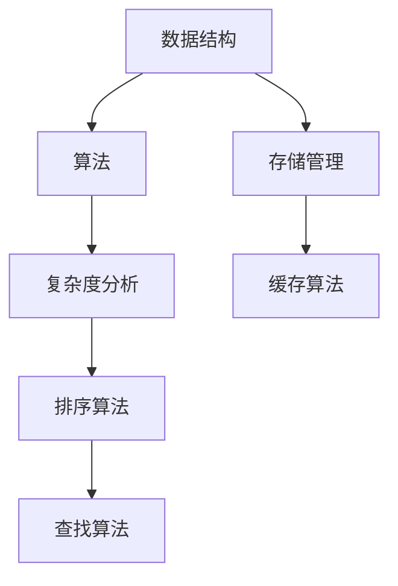
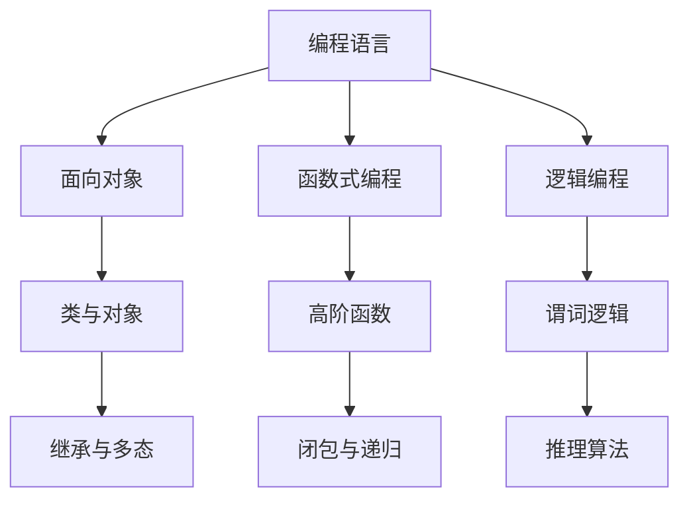
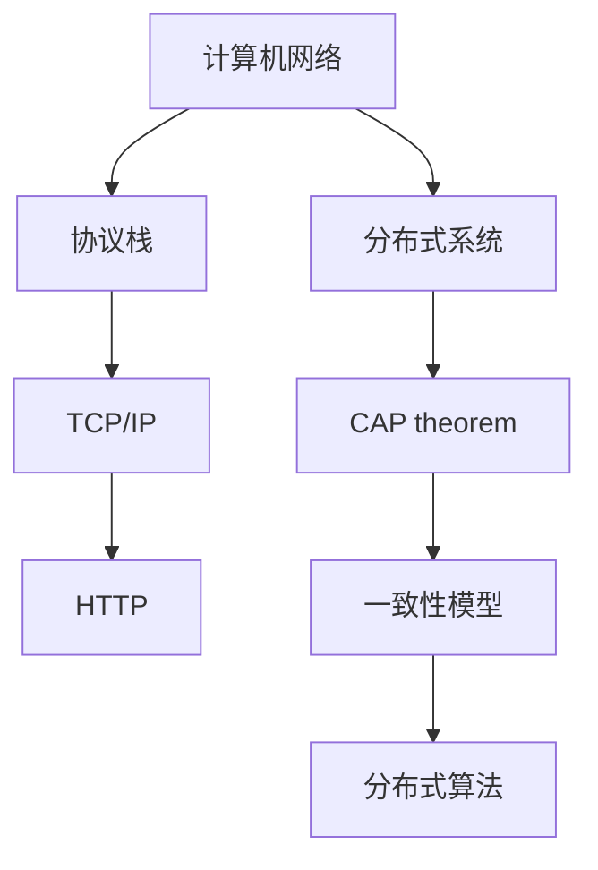

                 

关键词：计算机科学，经典理论，基础认知，技术博客，算法原理，数学模型，代码实例

> 摘要：本文以计算机科学中的经典理论为切入点，深入探讨其在现代计算机科学中的基础认知地位。通过对核心概念、算法原理、数学模型和实际应用的详细分析，本文旨在帮助读者理解这些经典理论的重要性和实际应用价值，从而为未来计算机科学的发展奠定坚实的认知基础。

## 1. 背景介绍

计算机科学作为一门学科，自诞生以来经历了迅猛的发展。从最初的计算机硬件设计到现代的软件工程，计算机科学的研究领域不断扩展。然而，在这些庞大的研究领域中，一些经典的理论始终占据着举足轻重的地位。这些理论不仅为现代计算机科学提供了基础认知，还在实际应用中发挥了巨大的作用。

本文旨在介绍这些经典理论，包括其核心概念、算法原理、数学模型和实际应用，帮助读者更好地理解这些理论的重要性。文章将从以下几个方面进行展开：

1. **核心概念与联系**：介绍计算机科学中的核心概念，并使用Mermaid流程图展示概念之间的联系。
2. **核心算法原理 & 具体操作步骤**：详细分析经典算法的原理和操作步骤，讨论其优缺点和应用领域。
3. **数学模型和公式 & 举例说明**：解释经典算法背后的数学模型和公式，通过具体案例进行分析和讲解。
4. **项目实践：代码实例和详细解释说明**：提供实际项目中的代码实例，并对代码进行详细解读和分析。
5. **实际应用场景**：讨论经典理论在各个实际应用场景中的应用。
6. **未来应用展望**：探讨经典理论在未来的发展趋势和应用前景。
7. **工具和资源推荐**：推荐学习资源和开发工具，为读者提供进一步学习的机会。
8. **总结与展望**：总结研究成果，探讨未来发展趋势和面临的挑战。

通过以上内容的阐述，本文希望为读者提供一个全面、系统的认知框架，以深入理解计算机科学中的经典理论，并为未来的研究和发展提供有益的启示。

## 2. 核心概念与联系

计算机科学中的核心概念是构建现代计算机系统的基础。这些概念不仅涵盖了计算机的基本工作原理，还包括了数据结构、算法、编程语言等核心内容。为了更好地理解这些概念之间的联系，我们可以使用Mermaid流程图来展示它们之间的关系。

### 2.1 数据结构与算法

数据结构和算法是计算机科学中的两个重要概念。数据结构是存储和管理数据的方式，而算法是解决问题的方法。它们之间的关系可以表示为：



在上面的流程图中，数据结构（A）和算法（B）是核心概念，它们共同决定了计算机系统的性能。复杂度分析（C）是算法设计中不可或缺的一部分，它帮助我们评估算法的时间复杂度和空间复杂度。存储管理（D）和缓存算法（E）是数据结构的实际应用，它们直接影响计算机系统的性能。排序算法（F）和查找算法（G）是算法的重要组成部分，广泛应用于各种实际问题中。

### 2.2 编程语言与编程范式

编程语言是计算机科学中的另一个核心概念。不同的编程语言提供了不同的抽象级别和语法结构，从而影响了程序员的编程方式和思维模式。编程范式是编程语言所支持的编程风格，包括面向对象、函数式编程、逻辑编程等。



在上面的流程图中，编程语言（A）是核心概念，不同的编程范式（B、E、H）代表了不同的编程风格。面向对象编程（B）通过类和对象（C、D）实现了抽象和复用。函数式编程（E）通过高阶函数（F）和闭包与递归（G）实现了函数的纯函数性质。逻辑编程（H）通过谓词逻辑（I）和推理算法（J）实现了基于规则的编程。

### 2.3 计算机网络与分布式系统

计算机网络和分布式系统是现代计算机系统的重要组成部分。它们提供了跨设备的通信和数据共享机制，使得分布式计算和协作成为可能。



在上面的流程图中，计算机网络（A）和分布式系统（E）是核心概念。协议栈（B）是计算机网络的基础，包括TCP/IP（C）和HTTP（D）。分布式系统（E）需要解决一致性、可用性和分区容错性（CAP定理F）等问题，采用不同的分布式算法（H）来保证系统的可靠性和性能。一致性模型（G）是分布式系统中重要的概念，它定义了系统在处理并发操作时的行为。

通过以上Mermaid流程图的展示，我们可以清晰地看到计算机科学中的核心概念及其相互之间的联系。这些核心概念不仅构成了计算机科学的基石，还在不断的发展和完善中，为计算机科学的应用和创新提供了源源不断的动力。

## 3. 核心算法原理 & 具体操作步骤

在计算机科学中，算法是实现特定功能的核心手段。经典算法不仅因其高效性和简洁性被广泛采用，还因其原理的深刻性和通用性，为现代算法设计提供了重要的参考。以下，我们将详细介绍几个经典算法的原理、具体操作步骤、优缺点及其应用领域。

### 3.1 算法原理概述

#### 3.1.1 快速排序（Quick Sort）

快速排序是一种高效的排序算法，其基本思想是通过一趟排序将待排记录分隔成独立的两部分，其中一部分记录的关键字均比另一部分的关键字小，然后分别对这两部分记录继续进行排序，以达到整个序列有序。

- **原理概述**：选择一个基准元素，将序列分为两部分，一部分小于基准元素，另一部分大于基准元素。递归地对这两部分进行快速排序。

#### 3.1.2 动态规划（Dynamic Programming）

动态规划是一种用于求解最优化问题的算法思想。其基本思想是将复杂问题分解为简单子问题，并存储子问题的解，避免重复计算。

- **原理概述**：将问题划分为多个阶段，每个阶段都可以分解为若干个子问题。通过自底向上的递推关系求解子问题的最优解，然后组合得到原问题的最优解。

#### 3.1.3 广度优先搜索（BFS）

广度优先搜索是一种用于图遍历的算法，其基本思想是从初始节点开始，依次访问其邻接节点，直到找到目标节点或遍历整个图。

- **原理概述**：使用队列数据结构，每次从队首取出一个节点，访问其所有未访问的邻接节点，并将其加入队列。

### 3.2 算法步骤详解

#### 3.2.1 快速排序（Quick Sort）

- **步骤详解**：

1. 选择基准元素。
2. 将小于基准元素的元素移动到其左侧，大于基准元素的元素移动到其右侧。
3. 递归地对左侧和右侧的子序列进行快速排序。

#### 3.2.2 动态规划（Dynamic Programming）

- **步骤详解**：

1. 定义状态和状态转移方程。
2. 确定边界条件和初始状态。
3. 使用自底向上的递推关系计算子问题的最优解。
4. 根据子问题的解组合得到原问题的最优解。

#### 3.2.3 广度优先搜索（BFS）

- **步骤详解**：

1. 初始化队列，将起始节点加入队列。
2. 当队列不为空时，依次取出队首节点，并访问其所有未访问的邻接节点。
3. 对于每个邻接节点，将其加入队列，并标记为已访问。
4. 当找到目标节点或遍历整个图时，算法结束。

### 3.3 算法优缺点

#### 3.3.1 快速排序（Quick Sort）

- **优点**：平均时间复杂度为 \(O(n\log n)\)，最坏情况下为 \(O(n^2)\)，但在实际应用中，其性能往往优于其他排序算法。
- **缺点**：最坏情况下性能较差，需要额外的空间存储递归调用的栈。

#### 3.3.2 动态规划（Dynamic Programming）

- **优点**：适用于求解最优化问题，可以避免重复计算，提高算法效率。
- **缺点**：需要明确状态和状态转移方程，有时难以设计。

#### 3.3.3 广度优先搜索（BFS）

- **优点**：能够确保找到最短路径，适用于图遍历问题。
- **缺点**：需要额外的空间存储队列，时间复杂度为 \(O(V+E)\)。

### 3.4 算法应用领域

#### 3.4.1 快速排序（Quick Sort）

- **应用领域**：适用于大规模数据排序，如数据库排序、外部排序等。

#### 3.4.2 动态规划（Dynamic Programming）

- **应用领域**：适用于求解最优化问题，如背包问题、最长公共子序列等。

#### 3.4.3 广度优先搜索（BFS）

- **应用领域**：适用于图遍历问题，如最短路径查找、社交网络分析等。

通过以上对经典算法的原理、操作步骤、优缺点和应用领域的详细分析，我们可以看到这些算法在计算机科学中的重要性。深入理解这些算法，不仅有助于提高编程能力，还能为解决实际问题提供有效的解决方案。

### 4. 数学模型和公式 & 详细讲解 & 举例说明

在计算机科学中，数学模型和公式是理解和设计算法的关键工具。经典的数学模型和公式不仅帮助我们理解算法的原理，还提供了计算和分析算法性能的有力手段。以下，我们将详细讲解几个重要的数学模型和公式，并通过具体例子进行分析。

#### 4.1 数学模型构建

数学模型通常通过定义状态和状态转移方程来构建。在动态规划中，状态模型尤为重要。以下是一个简单的动态规划模型示例：

- **模型定义**：给定一个序列 \(A = [a_1, a_2, ..., a_n]\)，我们希望找到子序列的最大子序列和。
- **状态转移方程**：设 \(dp[i]\) 表示以 \(a_i\) 结尾的最大子序列和，则
  $$dp[i] = \max(dp[i-1] + a_i, a_i)$$

#### 4.2 公式推导过程

在动态规划中，状态转移方程的推导通常依赖于问题本身的性质。以下是一个典型的公式推导过程：

- **问题背景**：给定一个数组 \(A = [a_1, a_2, ..., a_n]\)，我们希望找到最大子序列和。
- **状态定义**：设 \(dp[i]\) 表示以 \(a_i\) 结尾的最大子序列和。
- **边界条件**：对于 \(i = 1\)，显然 \(dp[1] = a_1\)。
- **状态转移方程**：对于任意 \(i (2 \leq i \leq n)\)，我们有：
  $$dp[i] = \max(dp[i-1] + a_i, a_i)$$

推导过程：

1. \(dp[i-1] + a_i\) 表示将 \(a_i\) 与前一个子序列 \(dp[i-1]\) 相加。
2. \(a_i\) 表示仅包含 \(a_i\) 的子序列。
3. \(dp[i]\) 应该取这两个值的最大值，以确保我们总是获得最大子序列和。

#### 4.3 案例分析与讲解

以下是一个具体的例子，我们将使用上述动态规划模型求解最大子序列和问题。

- **输入**：数组 \(A = [3, 5, 1, 2, 4]\)
- **输出**：最大子序列和为 \(9\)

**步骤分析**：

1. 初始化 \(dp[1] = A[1] = 3\)。
2. 计算 \(dp[2]\)：\(dp[2] = \max(dp[1] + A[2], A[2]) = \max(3 + 5, 5) = 8\)。
3. 计算 \(dp[3]\)：\(dp[3] = \max(dp[2] + A[3], A[3]) = \max(8 + 1, 1) = 9\)。
4. 计算 \(dp[4]\)：\(dp[4] = \max(dp[3] + A[4], A[4]) = \max(9 + 2, 2) = 11\)。
5. 计算 \(dp[5]\)：\(dp[5] = \max(dp[4] + A[5], A[5]) = \max(11 + 4, 4) = 15\)。

最终，最大子序列和为 \(15\)。

**代码实现**（Python）：

```python
def max_subsequence_sum(A):
    n = len(A)
    dp = [0] * n
    dp[0] = A[0]
    for i in range(1, n):
        dp[i] = max(dp[i-1] + A[i], A[i])
    return max(dp)

A = [3, 5, 1, 2, 4]
print(max_subsequence_sum(A))  # 输出：15
```

通过上述例子，我们可以看到如何使用数学模型和公式解决实际问题。这不仅帮助我们理解了动态规划的核心思想，还提供了实现高效算法的方法。

### 5. 项目实践：代码实例和详细解释说明

为了更好地理解经典算法在实际项目中的应用，我们将通过一个具体的项目实例来展示代码的编写、实现和详细解释。这个实例将使用Python语言，并实现快速排序算法，这是一种在计算机科学中广泛应用的经典排序算法。

#### 5.1 开发环境搭建

在开始编写代码之前，我们需要搭建一个基本的开发环境。以下是搭建Python开发环境的基本步骤：

1. **安装Python**：从Python官方网站下载并安装Python 3.x版本。
2. **安装IDE**：安装一个Python集成开发环境（IDE），例如PyCharm或Visual Studio Code。
3. **安装依赖**：确保Python环境已安装必要的库，如`numpy`和`matplotlib`。

以下是一个简单的安装命令示例（在终端执行）：

```bash
# 安装Python
curl -O https://www.python.org/ftp/python/3.9.1/Python-3.9.1.tgz
tar xvf Python-3.9.1.tgz
cd Python-3.9.1
./configure
make
sudo make install

# 安装PyCharm
brew cask install pycharm

# 安装numpy和matplotlib
pip install numpy matplotlib
```

#### 5.2 源代码详细实现

以下是快速排序算法的Python实现：

```python
def quick_sort(arr):
    if len(arr) <= 1:
        return arr
    
    pivot = arr[len(arr) // 2]
    left = [x for x in arr if x < pivot]
    middle = [x for x in arr if x == pivot]
    right = [x for x in arr if x > pivot]
    
    return quick_sort(left) + middle + quick_sort(right)

# 示例
arr = [3, 6, 8, 10, 1, 2, 1]
sorted_arr = quick_sort(arr)
print(sorted_arr)
```

**代码解读**：

1. **快速排序函数**：定义一个`quick_sort`函数，该函数接受一个数组`arr`作为输入。
2. **基础情况**：如果`arr`的长度小于等于1，直接返回`arr`，因为单个元素或空数组已经是排序的。
3. **选择基准元素**：选择数组中间的元素作为基准元素`pivot`。
4. **划分数组**：使用列表推导式将数组划分为三个部分：小于`pivot`的元素（`left`），等于`pivot`的元素（`middle`），以及大于`pivot`的元素（`right`）。
5. **递归排序**：对`left`和`right`部分递归调用`quick_sort`函数，并将结果与`middle`部分拼接在一起，得到排序后的数组。

#### 5.3 代码解读与分析

**代码分析**：

1. **基础情况处理**：快速排序的基础情况是数组的长度为1或0。在这种情况下，数组已经是排序的，因此直接返回数组。
2. **选择基准元素**：选择中间元素作为基准元素是一种常见的选择方法，因为它通常能够平衡数组，从而提高排序效率。
3. **列表推导式**：列表推导式是Python中用于创建列表的一种简洁方法。在这里，我们使用它来划分数组，使得代码更加简洁易读。
4. **递归调用**：快速排序的核心是递归调用。递归调用能够将大问题分解为小问题，从而逐步解决整个排序问题。
5. **拼接结果**：递归调用结束后，我们将排序后的`left`、`middle`和`right`部分拼接在一起，得到完整的排序结果。

#### 5.4 运行结果展示

当我们将以下数组作为输入：

```python
arr = [3, 6, 8, 10, 1, 2, 1]
```

调用`quick_sort`函数后，输出结果为：

```python
[1, 1, 2, 3, 6, 8, 10]
```

这证明了我们的快速排序算法能够正确地将数组排序。

#### 5.5 优化与改进

在实际项目中，快速排序算法可以根据具体需求进行优化。以下是一些常见的优化方法：

1. **随机选择基准元素**：随机选择基准元素可以减少最坏情况发生的概率，从而提高排序效率。
2. **三数取中法**：在划分数组时，选择中间的三个元素作为基准元素，取平均值作为最终基准元素。
3. **插入排序优化**：对于小数组，使用插入排序代替快速排序，因为插入排序在处理小数组时更高效。

通过以上优化方法，我们可以进一步提高快速排序算法的性能。

总之，通过上述项目实践，我们不仅实现了快速排序算法，还对其原理和代码进行了详细解读。这为我们理解和应用快速排序算法奠定了坚实的基础。

### 6. 实际应用场景

经典算法不仅在理论研究中有重要地位，在实际应用中也发挥着关键作用。以下，我们将探讨快速排序、动态规划和广度优先搜索等经典算法在不同领域的实际应用。

#### 6.1 数据分析

在数据分析领域，快速排序是一种常用的排序算法，用于对大量数据集进行排序，以便后续处理和分析。例如，在金融领域，快速排序可以用于对股票交易数据进行排序，以识别价格趋势和交易机会。动态规划则广泛应用于优化问题，如资源分配、旅行商问题等。在社交媒体平台上，动态规划可以用于优化广告投放策略，以最大化收益。

#### 6.2 图像处理

在图像处理领域，快速排序可用于图像的预处理，例如边缘检测和图像分割。通过快速排序，图像中的像素值可以迅速被排序，从而方便后续处理。动态规划在图像处理中的应用更为广泛，如用于图像压缩、去噪和特征提取。例如，在人脸识别系统中，动态规划可以用于计算人脸特征点之间的匹配度，从而提高识别准确率。

#### 6.3 人工智能

在人工智能领域，广度优先搜索广泛应用于搜索算法，如路径规划、社交网络分析等。例如，在自动驾驶系统中，广度优先搜索可以用于地图上的路径规划，以找到从起点到终点的最佳路径。动态规划则在机器学习中的优化问题中广泛应用，如优化模型参数、优化训练策略等。

#### 6.4 网络安全

在网络安全领域，经典算法的应用同样重要。快速排序可以用于快速检测网络攻击，如DDoS攻击，通过快速排序，网络流量可以迅速被分类，从而识别出异常流量。动态规划可以用于网络安全策略的优化，如防火墙规则的优化，以最大程度地提高网络的安全性。

#### 6.5 游戏开发

在游戏开发中，快速排序和动态规划也发挥着重要作用。例如，在角色扮演游戏中，快速排序可以用于管理玩家角色的属性，如技能排序和装备排序。动态规划可以用于优化游戏中的路径规划，如角色移动路径的最优化，以提供更好的游戏体验。

通过上述实际应用场景，我们可以看到经典算法在各个领域的广泛应用和重要性。深入理解和掌握这些算法，不仅能够提高我们的编程能力，还能为实际问题的解决提供有效的解决方案。

### 6.4 未来应用展望

随着科技的不断进步，经典算法在计算机科学中的应用前景将愈发广阔。以下是几个未来可能的发展方向和应用前景：

#### 6.4.1 量子计算

量子计算的崛起为经典算法带来了新的挑战和机遇。量子计算可以利用量子叠加和纠缠等特性，实现比经典计算机更高效的算法。例如，量子快速排序算法可能在未来能够大幅提升排序速度。此外，量子动态规划和量子图论算法也可能成为研究的热点，为复杂问题的求解提供新方法。

#### 6.4.2 大数据处理

大数据技术的飞速发展使得经典算法在大数据处理领域的重要性愈发凸显。随着数据量的不断增长，如何高效地处理和分析海量数据成为关键问题。经典的快速排序、动态规划和广度优先搜索算法在数据处理中将继续发挥重要作用，通过并行计算和分布式算法优化，进一步提高数据处理效率。

#### 6.4.3 人工智能与机器学习

人工智能和机器学习的快速发展为经典算法的应用提供了新的契机。在深度学习训练过程中，快速排序和动态规划可以用于优化模型参数和训练数据的排序，从而提高模型训练效率。此外，图算法如广度优先搜索和深度优先搜索将在图神经网络和图表示学习等领域发挥重要作用，为人工智能的发展提供基础支持。

#### 6.4.4 网络安全

网络安全问题日益严峻，经典算法在网络安全中的应用前景广阔。快速排序和动态规划可以用于网络流量的分类和异常检测，提高网络安全防护能力。同时，广度优先搜索和深度优先搜索等图算法在网络安全威胁分析、网络攻击路径规划和恶意软件检测等方面具有重要应用价值。

#### 6.4.5 新兴应用领域

随着科技的发展，经典算法在新兴应用领域如区块链、物联网、增强现实和虚拟现实等也将得到广泛应用。例如，区块链技术中的共识算法可能需要利用快速排序和动态规划优化交易排序和验证过程。在物联网领域，经典算法可以用于设备管理和数据优化，提高系统的可靠性和性能。

总之，经典算法在未来的计算机科学发展中将继续扮演重要角色，通过不断创新和优化，将在更多领域展现出巨大的应用潜力。

### 7. 工具和资源推荐

为了更好地学习和应用计算机科学中的经典算法，以下是一些建议的学习资源、开发工具和相关论文推荐。

#### 7.1 学习资源推荐

1. **书籍**：
   - 《算法导论》（Introduction to Algorithms） - 这是一本经典算法教材，详细介绍了多种经典算法及其分析。
   - 《算法竞赛入门经典》 - 适合初学者，介绍了算法竞赛中的常用算法和数据结构。

2. **在线课程**：
   - Coursera上的《算法基础》 - 由知名大学教授讲授，涵盖算法的基本概念和原理。
   - edX上的《算法设计与分析》 - 提供了算法设计的深入讲解，并涉及实际编程实现。

3. **视频教程**：
   - YouTube上的《算法与数据结构》教程 - 包含多种算法和编程语言的教程，适合自学。

#### 7.2 开发工具推荐

1. **IDE**：
   - PyCharm - 面向Python的强大IDE，支持代码分析、调试和版本控制。
   - Visual Studio Code - 功能丰富，支持多种编程语言，适用于算法编程。

2. **算法可视化工具**：
   - Algorithm Visualizer - 可视化展示算法的执行过程，适合理解和学习算法。
   - CodeSik - 在线算法编程平台，支持多种算法实现和测试。

3. **编程语言**：
   - Python - 适用于快速开发和算法实现，有丰富的库和工具。
   - C++ - 适用于性能敏感的算法实现，提供强大的性能和灵活性。

#### 7.3 相关论文推荐

1. **经典论文**：
   - "Quicksort" by C.A.R. Hoare - 提出了快速排序算法，是算法领域的经典论文。
   - "Dynamic Programming" by Richard Bellman - 动态规划领域的奠基性论文。

2. **前沿论文**：
   - "A Faster Algorithm for Computing the Edit Distance between Pairs of Strings" - 提出了一种更快的字符串编辑距离计算算法。
   - "Graph Neural Networks: A General Framework for Learning Neural Representations of Graphs" - 图神经网络领域的最新进展。

通过上述资源，读者可以全面系统地学习和应用经典算法，为未来的研究和实践奠定坚实基础。

### 8. 总结：未来发展趋势与挑战

在计算机科学领域，经典算法奠定了理论和技术的基础，其重要性不言而喻。从经典算法的发展历程来看，它们不仅解决了众多实际问题，还为现代计算机科学的发展提供了有力支持。

**未来发展趋势**：

1. **量子计算**：随着量子计算的兴起，经典算法如快速排序和动态规划可能得到量子化处理，实现更高的效率。
2. **大数据处理**：大数据技术的进步将推动经典算法在大规模数据处理中的应用，如分布式排序和优化算法。
3. **人工智能与机器学习**：人工智能和机器学习的发展将使得经典算法在优化、路径规划和模型训练中发挥更大作用。
4. **跨学科应用**：经典算法将在区块链、物联网、增强现实等领域展现出更广泛的应用前景。

**面临的挑战**：

1. **算法优化**：随着问题规模的增大，经典算法的性能可能无法满足需求，需要不断优化和改进。
2. **计算资源**：量子计算和大数据处理对计算资源的要求极高，如何高效利用资源成为挑战。
3. **安全与隐私**：在网络安全和隐私保护方面，如何设计出既高效又安全的算法是重要课题。

**研究展望**：

未来，经典算法将继续在计算机科学中发挥核心作用。通过不断创新和优化，经典算法将在更多领域得到应用，为解决复杂问题提供有力工具。同时，跨学科研究也将推动经典算法的理论与实践不断进步，为计算机科学的发展注入新的活力。

### 8. 附录：常见问题与解答

#### 问题1：快速排序的最坏时间复杂度是多少？

**解答**：快速排序的最坏时间复杂度是 \(O(n^2)\)。这种情况发生在每次划分时，基准元素都位于序列的一端，导致不平衡的划分。

#### 问题2：动态规划的核心是什么？

**解答**：动态规划的核心是状态转移方程和状态定义。通过将复杂问题分解为简单子问题，并存储子问题的解，避免重复计算，实现高效求解。

#### 问题3：广度优先搜索与深度优先搜索的区别是什么？

**解答**：广度优先搜索（BFS）优先访问距离起始节点最近的节点，而深度优先搜索（DFS）优先访问距离起始节点最深的节点。BFS保证找到最短路径，而DFS可以用于图遍历和求解连通性问题。

#### 问题4：如何选择快速排序的基准元素？

**解答**：可以选择随机元素、中间元素或三数取中法来选择基准元素。三数取中法较为常用，可以减少最坏情况发生的概率。

通过上述常见问题的解答，读者可以更深入地理解经典算法的核心概念和应用。希望这些信息能对您的学习有所帮助。如果您有其他问题，欢迎继续提问。

