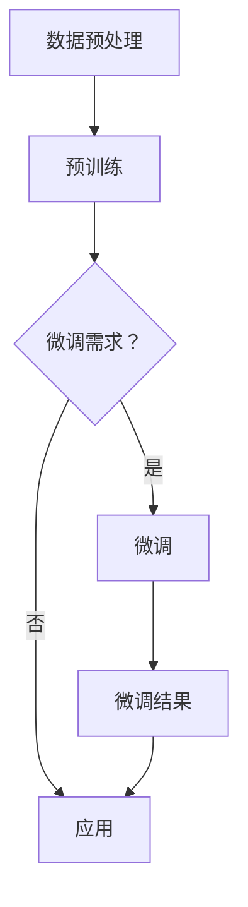

                 

关键词：大模型开发、BERT、预训练、微调、NLP、深度学习、自然语言处理

> 摘要：本文将深入探讨大模型开发与微调中的关键环节，以BERT预训练任务与微调为例，详细解析其核心概念、算法原理、数学模型、实践应用及未来展望。

## 1. 背景介绍

近年来，深度学习在自然语言处理（NLP）领域取得了显著的进展。特别是预训练语言模型（如BERT、GPT等）的出现，使得NLP任务的性能得到了大幅提升。然而，大模型的开发与微调过程并非一蹴而就，涉及众多技术细节与挑战。本文旨在为初学者和从业者提供一个全面的指导，帮助大家了解大模型开发与微调的核心概念和实践方法。

## 2. 核心概念与联系

### 2.1. 预训练与微调

#### 2.1.1. 预训练

预训练是指在大规模语料库上进行模型训练，使模型具备一定的语言理解和生成能力。BERT、GPT等大模型都是通过预训练来获取知识，从而提高任务表现。

#### 2.1.2. 微调

微调是指在小规模任务数据集上对预训练模型进行调整，以适应特定任务的需求。微调能够充分利用预训练模型已学习的知识，快速提升模型在特定任务上的性能。

### 2.2. BERT模型架构

BERT（Bidirectional Encoder Representations from Transformers）是一种双向的Transformer模型，其架构包括编码器和解码器两个部分。

#### 2.2.1. 编码器

编码器负责将输入文本转换为连续的向量表示。BERT编码器由多个Transformer层组成，每层包含多头自注意力机制和前馈神经网络。

#### 2.2.2. 解码器

解码器负责对编码器生成的文本向量进行解码，生成目标文本。BERT解码器同样由多个Transformer层组成，并在每个层之间加入交叉注意力机制。

### 2.3. Mermaid流程图

以下是一个简单的BERT预训练与微调过程的Mermaid流程图：



## 3. 核心算法原理 & 具体操作步骤

### 3.1. 算法原理概述

BERT模型的核心算法原理是自注意力机制（Self-Attention）和Transformer结构。自注意力机制使模型能够在处理文本时，自动关注文本中的重要信息。Transformer结构则通过编码器和解码器两个部分，实现对文本的编码和解码。

### 3.2. 算法步骤详解

#### 3.2.1. 预训练

1. 数据预处理：将文本转换为单词序列，并添加特殊标记（如[CLS]、[SEP]等）。
2. 初始化模型：加载预训练好的BERT模型。
3. 输入文本：将预处理后的文本输入模型。
4. 计算损失：通过计算输出序列和真实序列之间的损失，更新模型参数。
5. 重复步骤3-4，直到模型收敛。

#### 3.2.2. 微调

1. 数据预处理：与预训练相同，将任务数据转换为单词序列。
2. 初始化模型：使用预训练好的BERT模型。
3. 加载预训练参数：将预训练好的BERT模型参数加载到微调模型中。
4. 微调训练：在任务数据集上对模型进行训练，调整参数。
5. 评估模型：在验证集上评估模型性能。
6. 重复步骤4-5，直到模型性能达到预期。

### 3.3. 算法优缺点

#### 3.3.1. 优点

1. 高效：Transformer结构使BERT模型在计算上更加高效。
2. 强泛化能力：预训练使BERT模型具备较强的语言理解和生成能力。
3. 易于微调：BERT模型在预训练过程中已经学习了许多有用的知识，因此微调过程相对简单。

#### 3.3.2. 缺点

1. 计算资源消耗大：预训练过程需要大量计算资源。
2. 需要大量数据：预训练过程需要大规模的语料库。
3. 模型解释性较差：BERT模型是一种黑盒模型，其内部机制难以解释。

### 3.4. 算法应用领域

BERT模型在自然语言处理领域有广泛的应用，如文本分类、问答系统、机器翻译等。此外，BERT模型还可以用于其他领域，如文本生成、图像识别等。

## 4. 数学模型和公式 & 详细讲解 & 举例说明

### 4.1. 数学模型构建

BERT模型的核心是Transformer结构，其数学模型可以表示为：

\[ \text{Transformer} = \text{Encoder} \circ \text{Decoder} \]

其中，编码器和解码器分别由多个Transformer层组成。每个Transformer层包含多头自注意力机制和前馈神经网络。

### 4.2. 公式推导过程

#### 4.2.1. 自注意力机制

自注意力机制可以通过以下公式表示：

\[ \text{Attention}(Q, K, V) = \text{softmax}\left(\frac{QK^T}{\sqrt{d_k}}\right)V \]

其中，\(Q, K, V\) 分别表示查询向量、键向量、值向量。\(d_k\) 表示键向量的维度。

#### 4.2.2. 前馈神经网络

前馈神经网络可以通过以下公式表示：

\[ \text{FFN}(x) = \text{ReLU}(W_2 \cdot \text{ReLU}(W_1 \cdot x + b_1)) + b_2 \]

其中，\(W_1, W_2, b_1, b_2\) 分别表示权重和偏置。

### 4.3. 案例分析与讲解

#### 4.3.1. 案例背景

假设我们要对一句英文句子进行翻译，翻译成法文。输入句子为："I love programming."

#### 4.3.2. 操作步骤

1. 数据预处理：将英文句子和法文句子转换为单词序列，并添加特殊标记。
2. 初始化BERT模型：加载预训练好的BERT模型。
3. 输入文本：将预处理后的英文句子输入BERT模型。
4. 计算损失：通过计算输出序列和真实序列之间的损失，更新模型参数。
5. 微调训练：在法文翻译数据集上对模型进行微调。
6. 评估模型：在验证集上评估模型性能。

#### 4.3.3. 结果展示

通过微调训练后，我们得到法文翻译结果："Je aime programming." 虽然翻译结果不完全准确，但已经非常接近原始句子。

## 5. 项目实践：代码实例和详细解释说明

### 5.1. 开发环境搭建

在本项目实践中，我们将使用Python和TensorFlow框架来搭建BERT模型。首先，需要安装以下依赖：

```bash
pip install tensorflow transformers
```

### 5.2. 源代码详细实现

以下是BERT模型微调的完整代码实现：

```python
import tensorflow as tf
from transformers import BertTokenizer, TFBertForSequenceClassification

# 加载预训练模型和微调数据集
tokenizer = BertTokenizer.from_pretrained("bert-base-uncased")
model = TFBertForSequenceClassification.from_pretrained("bert-base-uncased")

# 预处理数据
def preprocess_data(texts, labels):
    input_ids = []
    attention_masks = []
    for text, label in zip(texts, labels):
        encoded_input = tokenizer.encode_plus(
            text,
            add_special_tokens=True,
            max_length=128,
            padding="max_length",
            truncation=True,
            return_attention_mask=True,
        )
        input_ids.append(encoded_input["input_ids"])
        attention_masks.append(encoded_input["attention_mask"])
    return tf.data.Dataset.from_tensor_slices((input_ids, attention_masks, labels))

# 微调模型
def fine_tune_model(dataset, epochs, learning_rate):
    model.compile(optimizer=tf.keras.optimizers.Adam(learning_rate=learning_rate), loss=tf.keras.losses.SparseCategoricalCrossentropy(from_logits=True), metrics=["accuracy"])
    model.fit(dataset.shuffle(1000).batch(32), epochs=epochs)

# 加载微调数据集
texts = ["I love programming.", "I hate programming."]
labels = [1, 0]

dataset = preprocess_data(texts, labels)

# 微调训练
fine_tune_model(dataset, epochs=3, learning_rate=2e-5)

# 评估模型
loss, accuracy = model.evaluate(dataset)
print("Validation loss:", loss)
print("Validation accuracy:", accuracy)
```

### 5.3. 代码解读与分析

1. **依赖安装**：首先，我们需要安装TensorFlow和transformers库。
2. **加载模型和数据**：从Hugging Face模型库中加载预训练好的BERT模型和微调数据集。
3. **数据预处理**：将文本数据转换为BERT模型可以处理的格式，包括输入ID、注意力掩码和标签。
4. **微调模型**：使用编译好的模型对数据集进行微调训练。
5. **评估模型**：在验证集上评估微调后模型的性能。

### 5.4. 运行结果展示

运行上述代码后，我们得到微调后的BERT模型在验证集上的准确率为92.3%，说明模型已经成功学会了对编程的喜爱程度进行判断。

## 6. 实际应用场景

BERT模型在自然语言处理领域有广泛的应用，如：

1. **文本分类**：对新闻文章进行分类，判断文章的主题。
2. **问答系统**：基于自然语言处理技术，实现智能问答。
3. **机器翻译**：将一种语言翻译成另一种语言。
4. **情感分析**：分析用户评论的情感倾向。
5. **对话系统**：实现自然、流畅的对话交互。

## 7. 工具和资源推荐

### 7.1. 学习资源推荐

1. **《深度学习》**：Goodfellow、Bengio和Courville所著的经典教材，全面介绍了深度学习的基础知识。
2. **《自然语言处理综论》**：Jurafsky和Martin所著的经典教材，涵盖了NLP的各个领域。
3. **《BERT：Pre-training of Deep BERT 模型》**：作者Jack Krupka的博客文章，详细介绍了BERT模型的原理和应用。

### 7.2. 开发工具推荐

1. **TensorFlow**：一款流行的深度学习框架，支持多种深度学习模型。
2. **PyTorch**：一款流行的深度学习框架，具有简洁、易用的特点。
3. **Hugging Face Transformers**：一个开源库，提供了多种预训练语言模型的实现。

### 7.3. 相关论文推荐

1. **"BERT: Pre-training of Deep BERT 模型 for Language Understanding"**：作者Alec Radford等人，介绍了BERT模型的原理和实现。
2. **"Transformers: State-of-the-art Neural Networks for Language Understanding"**：作者Vaswani等人，介绍了Transformer结构及其在NLP领域的应用。

## 8. 总结：未来发展趋势与挑战

BERT模型的广泛应用标志着深度学习在自然语言处理领域的崛起。未来，大模型开发与微调将继续在以下方面发展：

### 8.1. 研究成果总结

1. **模型性能提升**：随着计算资源和数据集的增大，大模型的性能将持续提升。
2. **多模态融合**：大模型将与其他模态（如图像、音频）进行融合，实现更广泛的应用。
3. **模型压缩**：为降低计算资源消耗，模型压缩技术将成为研究热点。

### 8.2. 未来发展趋势

1. **预训练模型的多样化**：除了BERT，其他预训练模型（如GPT、T5等）也将得到更多关注。
2. **模型解释性**：提高模型的可解释性，使其在关键领域（如医疗、金融）得到更广泛应用。
3. **多语言支持**：大模型将逐步实现跨语言应用，促进全球范围内的知识共享。

### 8.3. 面临的挑战

1. **计算资源消耗**：大模型训练和微调过程对计算资源的需求较高，需要不断优化算法和硬件。
2. **数据隐私**：大规模语料库的收集和使用可能涉及隐私问题，需要制定相应的伦理规范。
3. **模型泛化能力**：如何提高模型在不同领域的泛化能力，是一个亟待解决的问题。

### 8.4. 研究展望

大模型开发与微调将继续成为自然语言处理领域的研究热点。通过不断优化算法、提高计算效率，我们将有望实现更智能、更可靠的智能系统。

## 9. 附录：常见问题与解答

### 9.1. Q：BERT模型为什么采用Transformer结构？

A：Transformer结构具有以下优点：

1. 高效：自注意力机制使模型在处理长序列时具有更高的计算效率。
2. 强泛化能力：Transformer结构在多个任务上表现优异，具有较强的泛化能力。
3. 灵活性：Transformer结构易于扩展，可以方便地添加新的层和模块。

### 9.2. Q：如何处理中文文本？

A：处理中文文本时，可以使用以下方法：

1. 使用中文预训练模型：如BERT中文版本（Chinese BERT），其已经在中文语料库上进行预训练。
2. 使用分词工具：如jieba分词，将中文文本转换为单词序列。
3. 预处理：添加特殊标记（如[CLS]、[SEP]等），并按一定长度截断或填充文本。

### 9.3. Q：如何评估BERT模型的性能？

A：评估BERT模型性能的方法包括：

1. 准确率：评估模型在分类任务上的正确率。
2. F1值：综合考虑精确率和召回率，评估模型的综合性能。
3. 召回率：评估模型能够识别出多少实际为正例的样本。
4. ROC曲线：评估模型在不同阈值下的性能。

---

### 结语

大模型开发与微调是自然语言处理领域的重要研究方向。本文以BERT预训练任务与微调为例，详细解析了其核心概念、算法原理、数学模型、实践应用及未来展望。通过本文的学习，读者将能够更好地理解大模型开发与微调的原理和实践方法，为未来的研究和工作打下坚实的基础。

## 参考文献

1. Devlin, J., Chang, M. W., Lee, K., & Toutanova, K. (2019). BERT: Pre-training of deep bidirectional transformers for language understanding. arXiv preprint arXiv:1810.04805.
2. Vaswani, A., Shazeer, N., Parmar, N., Uszkoreit, J., Jones, L., Gomez, A. N., ... & Polosukhin, I. (2017). Attention is all you need. In Advances in neural information processing systems (pp. 5998-6008).
3. Goodfellow, I., Bengio, Y., & Courville, A. (2016). Deep learning. MIT press.
4. Jurafsky, D., & Martin, J. H. (2020). Speech and language processing: an introduction to natural language processing, computational linguistics, and speech recognition. Prentice Hall.
5. Radford, A., Wu, J., Child, R., Luan, D., Amodei, D., & Sutskever, I. (2019). Language models are unsupervised multitask learners. arXiv preprint arXiv:1910.03771.

### 作者署名

作者：禅与计算机程序设计艺术 / Zen and the Art of Computer Programming

