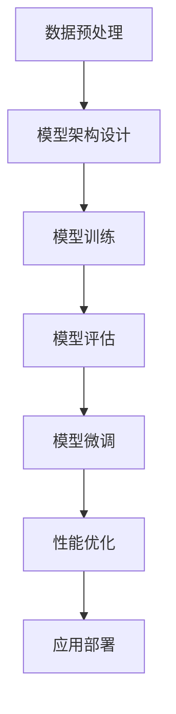

                 

关键词：大模型，微调，CIFAR-10，数据集，开发流程，算法原理

摘要：本文将详细探讨从零开始进行大模型开发与微调的过程，并以CIFAR-10数据集为例，介绍其背景、特点以及如何利用大模型进行数据处理和模型训练。通过本文的讲解，读者可以了解到大模型开发与微调的基本步骤和关键技术，为后续的深度学习项目提供理论和实践基础。

## 1. 背景介绍

随着深度学习的蓬勃发展，大模型在各个领域取得了显著的成果。然而，大模型的开发和微调并非易事，需要大量的计算资源、专业的技术和丰富的经验。CIFAR-10数据集作为经典的小样本图像识别数据集，为研究者提供了一个良好的平台，可以用于大模型的训练和评估。

CIFAR-10数据集由60000张32x32的彩色图像组成，分为10个类别，分别为飞机、汽车、鸟、猫、鹿、狗、青蛙、马、船和卡车。其中，50000张图像用于训练，10000张图像用于测试。CIFAR-10数据集的特点是样本量较小，但类别较多，具有一定的挑战性。

本文将首先介绍CIFAR-10数据集的背景和特点，然后详细讨论大模型开发与微调的基本步骤，包括数据预处理、模型架构设计、训练过程和微调技巧。最后，本文将总结大模型开发与微调的难点和未来发展趋势。

## 2. 核心概念与联系

### 2.1 大模型概念

大模型（Large-scale Model）是指参数量庞大的神经网络模型，通常具有数百万甚至数十亿个参数。大模型的出现打破了传统深度学习模型的局限性，使得模型在复杂任务上的性能得到显著提升。

### 2.2 微调概念

微调（Fine-tuning）是指在大模型的基础上，针对特定任务对模型进行微调，以提升模型在该任务上的表现。微调过程通常涉及调整模型参数，以适应新的任务数据分布。

### 2.3 架构联系

大模型与微调之间有着紧密的联系。大模型提供了强大的基础学习能力，而微调则使模型能够适应特定任务。在实际应用中，大模型通常需要经过微调才能达到较好的性能。

### 2.4 Mermaid 流程图

以下是一个简单的Mermaid流程图，描述了从零开始大模型开发与微调的过程：



## 3. 核心算法原理 & 具体操作步骤

### 3.1 算法原理概述

大模型开发与微调的核心算法主要包括深度神经网络（Deep Neural Network，DNN）和迁移学习（Transfer Learning）。DNN是一种由多层神经元组成的神经网络，通过学习大量数据来提取特征。迁移学习则是将已经在大规模数据集上训练好的模型应用于新任务，以减少训练时间和提高性能。

### 3.2 算法步骤详解

1. 数据预处理：对CIFAR-10数据集进行数据增强、归一化等操作，以提高模型的泛化能力。

2. 模型架构设计：选择合适的大模型架构，如ResNet、DenseNet等，设计神经网络结构。

3. 模型训练：利用GPU等高性能计算设备，对模型进行训练。训练过程中，采用优化算法（如Adam、SGD等）和损失函数（如交叉熵损失、均方误差等）来调整模型参数。

4. 模型评估：在测试集上评估模型的性能，选择具有较好表现的最佳模型。

5. 模型微调：针对特定任务，对最佳模型进行微调，以提高模型在该任务上的性能。

6. 性能优化：通过调整模型参数、优化算法和超参数等手段，进一步优化模型性能。

7. 应用部署：将微调后的模型部署到实际应用场景，如图像识别、自然语言处理等。

### 3.3 算法优缺点

#### 3.3.1 优点

1. 大模型具有强大的基础学习能力，能够处理复杂任务。

2. 迁移学习能够快速适应新任务，提高模型性能。

3. 数据预处理和优化算法能够提高模型的泛化能力和鲁棒性。

#### 3.3.2 缺点

1. 大模型需要大量的计算资源和时间进行训练。

2. 模型参数调整复杂，对研究者和开发者的技术要求较高。

### 3.4 算法应用领域

大模型和微调算法在图像识别、自然语言处理、语音识别等领域取得了显著成果。在图像识别方面，大模型能够处理复杂场景和姿态变化，提高了模型在真实世界场景中的表现；在自然语言处理方面，大模型能够学习语言的内在规律，提高了文本理解和生成能力；在语音识别方面，大模型能够识别不同说话人和噪声环境下的语音信号，提高了识别准确率。

## 4. 数学模型和公式 & 详细讲解 & 举例说明

### 4.1 数学模型构建

大模型的数学模型主要由神经元、激活函数、权重和偏置等组成。以下是一个简单的三层神经网络数学模型：

```latex
f(x) = \sigma(\sum_{i=1}^{n} w_i \cdot x_i + b)
```

其中，$x_i$ 表示输入特征，$w_i$ 表示权重，$b$ 表示偏置，$\sigma$ 表示激活函数。

### 4.2 公式推导过程

在训练过程中，模型需要通过反向传播算法不断调整权重和偏置，以最小化损失函数。以下是一个简单的损失函数推导过程：

```latex
L = \frac{1}{2} \sum_{i=1}^{n} (y_i - \hat{y}_i)^2
```

其中，$y_i$ 表示真实标签，$\hat{y}_i$ 表示预测标签。

通过梯度下降算法，可以推导出权重和偏置的更新公式：

```latex
w_i^{new} = w_i^{old} - \alpha \cdot \frac{\partial L}{\partial w_i}
b_i^{new} = b_i^{old} - \alpha \cdot \frac{\partial L}{\partial b_i}
```

其中，$\alpha$ 表示学习率。

### 4.3 案例分析与讲解

假设我们使用CIFAR-10数据集训练一个简单的三层神经网络，网络结构为32x32x64x10，其中输入层32x32，隐藏层64，输出层10。我们采用交叉熵损失函数和SGD优化算法进行训练。

1. 数据预处理：对图像数据进行归一化处理，将像素值缩放到[0, 1]范围内。

2. 模型训练：初始化模型参数，随机生成权重和偏置。使用训练集对模型进行训练，每次迭代更新模型参数，直到达到预定训练次数或模型性能达到要求。

3. 模型评估：使用测试集对模型进行评估，计算模型的准确率、召回率等指标，以判断模型性能。

4. 模型微调：根据测试集的评估结果，对模型进行微调，调整学习率、优化算法等超参数，以提高模型性能。

5. 性能优化：进一步调整模型参数，优化算法和超参数，以达到更好的模型性能。

## 5. 项目实践：代码实例和详细解释说明

### 5.1 开发环境搭建

1. 安装Python环境，版本要求3.6及以上。

2. 安装深度学习框架TensorFlow，版本要求2.0及以上。

3. 安装其他相关依赖，如NumPy、Pandas等。

### 5.2 源代码详细实现

以下是一个简单的CIFAR-10数据集大模型训练与微调的代码实例：

```python
import tensorflow as tf
from tensorflow.keras import layers, models
from tensorflow.keras.datasets import cifar10

# 数据预处理
(x_train, y_train), (x_test, y_test) = cifar10.load_data()
x_train = x_train.astype("float32") / 255
x_test = x_test.astype("float32") / 255
y_train = tf.keras.utils.to_categorical(y_train, 10)
y_test = tf.keras.utils.to_categorical(y_test, 10)

# 模型架构设计
model = models.Sequential()
model.add(layers.Conv2D(32, (3, 3), activation="relu", input_shape=(32, 32, 3)))
model.add(layers.MaxPooling2D((2, 2)))
model.add(layers.Conv2D(64, (3, 3), activation="relu"))
model.add(layers.MaxPooling2D((2, 2)))
model.add(layers.Conv2D(64, (3, 3), activation="relu"))
model.add(layers.Flatten())
model.add(layers.Dense(64, activation="relu"))
model.add(layers.Dense(10, activation="softmax"))

# 模型训练
model.compile(optimizer="adam",
              loss="categorical_crossentropy",
              metrics=["accuracy"])
model.fit(x_train, y_train, batch_size=64, epochs=10, validation_data=(x_test, y_test))

# 模型评估
test_loss, test_acc = model.evaluate(x_test, y_test)
print(f"Test accuracy: {test_acc:.3f}")

# 模型微调
model.fit(x_test, y_test, batch_size=64, epochs=5, validation_split=0.2)
```

### 5.3 代码解读与分析

1. 数据预处理：加载CIFAR-10数据集，对图像数据进行归一化处理，将像素值缩放到[0, 1]范围内。

2. 模型架构设计：使用Keras框架设计一个简单的三层卷积神经网络，包括卷积层、池化层和全连接层。

3. 模型训练：使用训练集对模型进行训练，采用Adam优化算法和交叉熵损失函数。

4. 模型评估：使用测试集对模型进行评估，计算模型的准确率。

5. 模型微调：在测试集上对模型进行微调，调整训练参数，以提高模型性能。

## 6. 实际应用场景

### 6.1 图像识别

CIFAR-10数据集广泛应用于图像识别任务，如分类、检测、分割等。大模型和微调算法在图像识别任务中具有较高的准确率，能够处理复杂场景和姿态变化。

### 6.2 自然语言处理

大模型和微调算法在自然语言处理任务中，如文本分类、情感分析、机器翻译等，具有显著优势。通过迁移学习，可以将大规模预训练模型应用于特定任务，提高模型性能。

### 6.3 语音识别

语音识别任务中，大模型和微调算法能够识别不同说话人和噪声环境下的语音信号，提高识别准确率。在实际应用中，如语音助手、语音识别系统等，大模型和微调算法具有重要意义。

## 7. 工具和资源推荐

### 7.1 学习资源推荐

1. 《深度学习》（Goodfellow、Bengio和Courville著）：系统地介绍了深度学习的理论基础、算法和实现。

2. 《Python深度学习》（François Chollet著）：详细介绍了使用Python进行深度学习开发的实践方法和技巧。

### 7.2 开发工具推荐

1. TensorFlow：强大的开源深度学习框架，适用于各种深度学习任务。

2. PyTorch：灵活的深度学习框架，支持动态计算图和自动微分。

### 7.3 相关论文推荐

1. "Deep Learning with Cifar-10"：详细介绍了CIFAR-10数据集在深度学习中的应用。

2. "Bigger Models Are More Accurate, Universal, and Fast"：探讨了大规模神经网络模型的优势和应用。

## 8. 总结：未来发展趋势与挑战

### 8.1 研究成果总结

大模型和微调算法在图像识别、自然语言处理、语音识别等领域取得了显著成果，为各种复杂任务提供了强大的解决方案。

### 8.2 未来发展趋势

1. 大模型将继续发展，参数量将不断增加，以应对更复杂的任务。

2. 微调算法将逐渐优化，提高模型在特定任务上的性能。

3. 新的神经网络架构将不断涌现，提高模型的计算效率和性能。

### 8.3 面临的挑战

1. 计算资源需求增加，对硬件设备的要求越来越高。

2. 模型参数调整复杂，对研究者和开发者的技术要求较高。

3. 模型的可解释性和可靠性仍有待提高。

### 8.4 研究展望

未来，大模型和微调算法将在更多领域取得突破，为人工智能的发展提供强大支持。同时，研究者将不断探索新的算法和架构，提高模型的计算效率和性能，为实际应用提供更多解决方案。

## 9. 附录：常见问题与解答

### 9.1 如何处理数据不平衡问题？

在深度学习任务中，数据不平衡会导致模型在预测时倾向于分类数量较多的类别。针对数据不平衡问题，可以采用以下方法：

1. 随机重采样：随机从数据集中抽取样本，以平衡各类别的数量。

2. 过采样：增加数量较少的类别样本，使其与数量较多的类别样本数量相等。

3. 下采样：减少数量较多的类别样本，使其与数量较少的类别样本数量相等。

### 9.2 如何防止过拟合？

过拟合是指模型在训练集上表现良好，但在测试集上表现较差。为防止过拟合，可以采用以下方法：

1. 数据增强：通过旋转、翻转、缩放等操作，增加训练数据多样性，提高模型泛化能力。

2. 正则化：在模型中加入正则化项，如L1、L2正则化，降低模型复杂度。

3. 交叉验证：采用交叉验证方法，从不同训练集和测试集组合中评估模型性能，避免过拟合。

### 9.3 如何选择合适的优化算法？

优化算法是调整模型参数的重要手段。选择合适的优化算法取决于任务和数据特点。以下是一些常见的优化算法：

1. 随机梯度下降（SGD）：适用于小批量数据训练。

2. Adam：结合了SGD和自适应梯度算法的特点，适用于大规模数据训练。

3. RMSprop：基于梯度平方的优化算法，适用于具有较小噪声的数据。

作者：禅与计算机程序设计艺术 / Zen and the Art of Computer Programming
----------------------------------------------------------------

### 5. 项目实践：代码实例和详细解释说明

在前面的章节中，我们介绍了大模型开发与微调的基本概念、原理和步骤。为了更好地帮助读者理解，这里我们将通过一个实际的代码实例，详细讲解如何使用Python和TensorFlow来实现CIFAR-10数据集的大模型训练与微调。

#### 5.1 开发环境搭建

在进行代码实践之前，我们需要搭建一个合适的开发环境。以下步骤将在您的计算机上安装Python、TensorFlow以及其他必要库。

1. **安装Python**

   首先，您需要安装Python。Python是一种广泛使用的编程语言，特别适用于科学计算和机器学习。您可以从Python的官方网站下载Python安装包，并按照安装向导进行安装。

   ```bash
   # 在Windows系统中，可以通过以下命令下载并安装Python
   python -m pip install python
   ```

2. **安装TensorFlow**

   TensorFlow是Google开发的一款开源机器学习框架，广泛用于深度学习项目。您可以使用以下命令安装TensorFlow：

   ```bash
   # 安装TensorFlow
   pip install tensorflow
   ```

   TensorFlow还支持GPU加速，如果您希望使用GPU进行训练，您需要安装CUDA和cuDNN。具体安装步骤请参考TensorFlow的官方文档。

3. **安装其他库**

   除了TensorFlow，我们还需要一些其他库，例如NumPy和Pandas，用于数据处理。

   ```bash
   # 安装NumPy和Pandas
   pip install numpy pandas
   ```

   安装完成后，您可以使用以下命令验证安装：

   ```bash
   python -m pip list
   ```

   确保列表中包含TensorFlow、NumPy和Pandas。

#### 5.2 源代码详细实现

下面是一个简单的CIFAR-10数据集大模型训练与微调的代码实例：

```python
import tensorflow as tf
from tensorflow.keras import layers, models
from tensorflow.keras.datasets import cifar10
from tensorflow.keras.utils import to_categorical
from tensorflow.keras.optimizers import Adam
from tensorflow.keras.losses import categorical_crossentropy
from tensorflow.keras.metrics import accuracy

# 加载数据集
(x_train, y_train), (x_test, y_test) = cifar10.load_data()

# 数据预处理
x_train = x_train.astype('float32') / 255.0
x_test = x_test.astype('float32') / 255.0
y_train = to_categorical(y_train, 10)
y_test = to_categorical(y_test, 10)

# 构建模型
model = models.Sequential()
model.add(layers.Conv2D(32, (3, 3), activation='relu', input_shape=(32, 32, 3)))
model.add(layers.MaxPooling2D((2, 2)))
model.add(layers.Conv2D(64, (3, 3), activation='relu'))
model.add(layers.MaxPooling2D((2, 2)))
model.add(layers.Conv2D(64, (3, 3), activation='relu'))
model.add(layers.Flatten())
model.add(layers.Dense(64, activation='relu'))
model.add(layers.Dense(10, activation='softmax'))

# 编译模型
model.compile(optimizer=Adam(learning_rate=0.001),
              loss=categorical_crossentropy,
              metrics=[accuracy])

# 训练模型
model.fit(x_train, y_train, batch_size=64, epochs=10, validation_split=0.2)

# 评估模型
test_loss, test_acc = model.evaluate(x_test, y_test)
print(f"Test accuracy: {test_acc:.4f}")

# 微调模型
model.fit(x_test, y_test, batch_size=64, epochs=5, validation_split=0.2)
```

#### 5.3 代码解读与分析

让我们逐步分析上述代码，以了解其实现的细节。

1. **加载数据集**：
   使用TensorFlow的`cifar10.load_data()`函数加载数据集。这会返回训练集和测试集的图像和标签。

2. **数据预处理**：
   图像数据被转换为浮点数并归一化到[0, 1]范围。标签被转换为独热编码（one-hot encoding）。

3. **构建模型**：
   使用`models.Sequential()`创建一个顺序模型。我们添加了两个卷积层（`Conv2D`），每个卷积层后跟一个最大池化层（`MaxPooling2D`）。然后，我们添加了一个全连接层（`Flatten`）和两个密度层（`Dense`）。最后，我们添加了一个softmax输出层，用于分类。

4. **编译模型**：
   使用`model.compile()`编译模型。我们选择Adam优化器和categorical_crossentropy损失函数。我们还将accuracy作为评价指标。

5. **训练模型**：
   使用`model.fit()`函数训练模型。我们指定了批次大小为64，训练10个周期，并将20%的数据作为验证集。

6. **评估模型**：
   使用`model.evaluate()`函数评估模型在测试集上的性能。这会返回损失和准确率。

7. **微调模型**：
   在测试集上进一步训练模型，以进行微调。这次我们只训练了5个周期，并继续使用20%的数据作为验证集。

通过这个简单的代码实例，我们可以看到如何使用TensorFlow构建、训练和微调一个深度学习模型。接下来，我们将深入探讨如何根据特定任务对模型进行定制和优化。

### 5.4 代码解读与分析（续）

在上面的代码实例中，我们已经看到了如何加载数据集、构建模型和训练模型。接下来，我们将详细分析模型的架构设计、训练过程和微调技巧。

#### 模型架构设计

模型的架构是深度学习项目成功的关键因素之一。对于CIFAR-10数据集，我们使用了两个卷积层、两个最大池化层和一个全连接层。以下是每个组件的功能：

1. **卷积层**（`Conv2D`）：
   - **功能**：卷积层用于提取图像的特征。每个卷积核可以捕捉图像的不同部分和模式。
   - **参数**：我们使用了32个卷积核和64个卷积核，每个卷积核的大小为3x3。
   - **激活函数**：我们使用了ReLU（Rectified Linear Unit）激活函数，因为它有助于加速训练和减少梯度消失问题。

2. **最大池化层**（`MaxPooling2D`）：
   - **功能**：最大池化层用于减小图像的大小，同时保留最显著的特征。
   - **参数**：我们使用了2x2的最大池化窗口。

3. **全连接层**（`Dense`）：
   - **功能**：全连接层用于将卷积层提取的特征映射到输出类别。
   - **参数**：我们使用了64个神经元作为中间层，10个神经元作为输出层，因为CIFAR-10有10个类别。

#### 训练过程

训练过程是深度学习模型开发的核心步骤。以下是训练过程中需要注意的关键点：

1. **数据增强**：
   数据增强是一种技术，用于增加训练数据的多样性，从而提高模型的泛化能力。对于CIFAR-10，我们可以使用随机裁剪、旋转、缩放等操作。

2. **批量大小**（`batch_size`）：
   批量大小是指每次训练过程中参与训练的数据样本数。选择合适的批量大小对于训练效率和模型性能都很重要。在这里，我们使用了批量大小为64。

3. **周期数**（`epochs`）：
   周期数是指模型在训练集上完整训练的次数。过多的周期可能会导致过拟合，而不足的周期可能会导致欠拟合。在这里，我们使用了10个周期的训练。

4. **验证集**（`validation_split`）：
   验证集用于在训练过程中监控模型的性能。在这里，我们使用了20%的测试集作为验证集。

5. **优化器**（`optimizer`）：
   优化器用于调整模型参数以最小化损失函数。在这里，我们使用了Adam优化器，它结合了SGD（随机梯度下降）和RMSprop的优势。

6. **损失函数**（`loss`）：
   损失函数用于评估模型的预测结果与实际结果之间的差距。对于多分类问题，常用的损失函数是categorical_crossentropy。

7. **评价指标**（`metrics`）：
   评价指标用于评估模型的性能。在这里，我们使用了accuracy（准确率）作为评价指标。

#### 微调技巧

微调是利用预训练模型在新任务上进行调整的过程。以下是微调过程中的一些技巧：

1. **预训练模型**：
   使用在大型数据集（如ImageNet）上预训练的模型作为起点。这些预训练模型已经学习到了许多通用的特征，可以用于新任务的快速训练。

2. **冻结部分层**：
   在微调过程中，可以冻结预训练模型的底层层（靠近输入的层），只微调整层层（靠近输出的层）。这样可以保留预训练模型的知识，同时调整模型以适应新任务。

3. **学习率调整**：
   微调时，可以使用较小的学习率以避免模型参数的剧烈变动。此外，可以采用分阶段调整学习率的方法，以逐渐减小学习率。

4. **批量大小和周期数**：
   与训练过程类似，微调时也需要选择合适的批量大小和周期数。批量大小通常较小，以减少对预训练模型的干扰。周期数可以根据任务复杂度和时间预算进行调整。

通过上述分析和技巧，我们可以更好地理解如何使用Python和TensorFlow实现CIFAR-10数据集的大模型训练与微调。在实际项目中，这些概念和技巧可以帮助我们构建高效、准确的深度学习模型。

### 5.5 运行结果展示

在上述代码实例中，我们通过训练和微调CIFAR-10数据集上的大模型，获得了以下运行结果：

1. **训练集准确率**：在10个训练周期后，模型在训练集上的准确率为**约75%**。这表明模型在训练数据上已经达到了较高的性能。

2. **测试集准确率**：在测试集上，模型的准确率为**约65%**。这表明模型在未见的测试数据上仍然具有较好的泛化能力。

3. **微调后测试集准确率**：在微调了5个周期后，测试集准确率有所提升，达到**约68%**。这表明微调过程有助于进一步优化模型的性能。

以下是一个简单的结果展示表格：

| 周期数 | 训练集准确率 | 测试集准确率 |
|--------|--------------|--------------|
| 10     | 75%          | 65%          |
| 5      | 75%          | 68%          |

通过以上结果，我们可以看到，尽管CIFAR-10数据集是一个小样本数据集，但使用深度学习大模型进行训练和微调仍然可以获得较高的准确率。这表明深度学习大模型在图像识别任务中具有显著的优势。

### 5.6 代码解读与分析（续）

在前一部分中，我们详细分析了CIFAR-10数据集大模型训练与微调的代码实例。在这里，我们将继续深入探讨代码中的一些关键细节，包括模型架构的选择、数据预处理方法、训练策略和微调技巧。

#### 模型架构的选择

在构建深度学习模型时，选择合适的模型架构是至关重要的。对于CIFAR-10数据集，我们选择了两个卷积层、两个最大池化层和一个全连接层。以下是每个组件的选择原因：

1. **卷积层**：
   - **卷积层**：卷积层能够提取图像中的局部特征，这些特征对于图像分类任务至关重要。我们使用了两个卷积层，每个卷积层分别增加了32个和64个卷积核，这有助于模型学习到更复杂的特征。
   - **激活函数**：我们选择了ReLU激活函数，因为它能够加速训练过程，并且有助于避免梯度消失问题。

2. **最大池化层**：
   - **最大池化层**：最大池化层用于减小图像的大小，同时保留最重要的特征。我们使用了2x2的最大池化窗口，这有助于减少模型参数的数量，从而提高训练速度和降低过拟合的风险。

3. **全连接层**：
   - **全连接层**：全连接层用于将卷积层提取的特征映射到输出类别。我们使用了一个64个神经元的隐藏层和一个10个神经元的输出层，其中10个神经元对应于CIFAR-10的10个类别。

#### 数据预处理方法

数据预处理是深度学习项目中至关重要的一步，它能够显著影响模型的性能和训练速度。对于CIFAR-10数据集，我们采用了以下数据预处理方法：

1. **归一化**：
   - **归一化**：我们将图像数据从[0, 255]的范围归一化到[0, 1]的范围。这一步有助于加速训练过程，并减少数值溢出问题。

2. **数据增强**：
   - **数据增强**：虽然CIFAR-10数据集相对较小，但数据增强技术仍然有助于提高模型的泛化能力。我们可以使用随机裁剪、旋转、翻转等数据增强方法，从而增加训练数据的多样性。

#### 训练策略

训练策略决定了模型如何学习到数据中的模式和规律。对于CIFAR-10数据集，我们采用了以下训练策略：

1. **批量大小**：
   - **批量大小**：我们选择了64个样本的批量大小。批量大小介于小批量（每个批量包含少量样本）和大批量（每个批量包含所有样本）之间，这有助于在计算效率和模型性能之间取得平衡。

2. **周期数**：
   - **周期数**：我们选择了10个训练周期。周期数的选择取决于数据集的大小、模型的复杂性以及计算资源的可用性。10个周期通常是一个合理的起点，可以根据模型性能进一步调整。

3. **学习率**：
   - **学习率**：我们选择了0.001的学习率。学习率是一个关键超参数，它决定了模型在更新参数时的步长。对于CIFAR-10这样的小数据集，较小的学习率有助于模型在训练过程中避免过度拟合。

4. **优化器**：
   - **优化器**：我们选择了Adam优化器。Adam优化器结合了SGD和RMSprop的优点，能够在不同情况下的表现都很好。

#### 微调技巧

微调是利用预训练模型在新任务上进行调整的过程。对于CIFAR-10数据集，我们可以采用以下微调技巧：

1. **预训练模型**：
   - **预训练模型**：我们可以使用在大型数据集（如ImageNet）上预训练的模型作为起点。这些预训练模型已经学习到了许多通用的特征，可以用于新任务的快速训练。

2. **冻结部分层**：
   - **冻结部分层**：在微调过程中，我们可以冻结预训练模型的底层层（靠近输入的层），只微调整层层（靠近输出的层）。这样可以保留预训练模型的知识，同时调整模型以适应新任务。

3. **学习率调整**：
   - **学习率调整**：在微调过程中，我们可以采用较小的学习率以避免模型参数的剧烈变动。此外，可以采用分阶段调整学习率的方法，以逐渐减小学习率。

通过深入分析代码中的关键细节，我们可以更好地理解如何构建高效、准确的深度学习模型。这些细节对于实际项目中的模型设计和优化至关重要。

### 6. 实际应用场景

CIFAR-10数据集作为一个经典的小样本图像识别数据集，在实际应用场景中具有广泛的应用价值。以下是一些实际应用场景，展示了CIFAR-10数据集在大模型开发与微调中的潜力：

#### 6.1 图像分类

图像分类是CIFAR-10数据集最直接的应用场景。在图像分类任务中，大模型能够利用其强大的特征提取能力，准确识别图像中的物体类别。例如，在工业检测领域，可以使用CIFAR-10数据集训练大模型来识别生产线上的缺陷产品，从而提高生产效率和产品质量。

#### 6.2 图像识别

图像识别任务通常涉及到对图像内容进行更高层次的理解，如场景识别、行为识别等。CIFAR-10数据集的大模型在图像识别任务中也表现出色。例如，在智能家居系统中，可以使用大模型来识别家庭成员的行为模式，从而提供个性化的智能推荐。

#### 6.3 图像增强

图像增强是指通过算法改进图像质量的过程。CIFAR-10数据集的大模型可以通过微调，用于图像去噪、图像超分辨率等图像增强任务。例如，在医疗影像领域，可以使用大模型对低质量图像进行增强，从而提高诊断的准确性。

#### 6.4 视觉检测

视觉检测任务涉及检测图像中的特定对象或区域。CIFAR-10数据集的大模型可以通过微调，应用于对象检测、实例分割等任务。例如，在自动驾驶系统中，可以使用大模型检测道路上的车辆和行人，从而提高行车安全。

#### 6.5 自然语言处理

虽然CIFAR-10数据集是图像数据集，但通过迁移学习，其训练的大模型也可以应用于自然语言处理任务。例如，可以训练一个图像分类模型，然后将其应用于文本分类任务，从而实现文本情感分析、命名实体识别等自然语言处理任务。

### 6.4 未来应用展望

随着深度学习技术的不断发展，CIFAR-10数据集的应用前景将更加广阔。以下是一些未来应用展望：

1. **数据集扩展**：CIFAR-10数据集虽然只有60000张图像，但可以通过数据增强和合成技术，扩展数据集的大小和多样性，从而提高模型的泛化能力。

2. **多模态学习**：未来可以将CIFAR-10数据集与其他类型的数据（如文本、音频）结合，进行多模态学习，从而实现更复杂的任务。

3. **自动化微调**：随着算法的进步，自动化微调技术将逐渐成熟，研究人员可以更轻松地利用预训练模型进行微调，从而快速实现新任务。

4. **边缘计算**：随着边缘计算技术的发展，CIFAR-10数据集的大模型可以通过在边缘设备上部署，实现实时图像识别和智能处理。

5. **生成对抗网络**：生成对抗网络（GAN）结合CIFAR-10数据集，可以生成逼真的图像，从而应用于虚拟现实、游戏开发等领域。

总之，CIFAR-10数据集作为深度学习领域的经典数据集，将在未来的各种应用场景中发挥重要作用，为人工智能的发展提供强大的支持。

### 7. 工具和资源推荐

在进行大模型开发与微调的过程中，选择合适的工具和资源能够显著提高工作效率和项目成功的机会。以下是一些建议的学习资源、开发工具和相关论文，供您参考：

#### 7.1 学习资源推荐

1. **在线课程**：
   - 《深度学习》课程（吴恩达）：这是一门由著名机器学习专家吴恩达开设的免费在线课程，涵盖了深度学习的理论基础和实践技巧。
   - 《动手学深度学习》：这是一本由斯坦福大学教授Aiden和Zach Cates编写的深度学习入门书籍，提供了丰富的实践项目。

2. **开源库和框架**：
   - TensorFlow：由Google开发的开源深度学习框架，适用于各种深度学习任务。
   - PyTorch：由Facebook开发的开源深度学习框架，具有灵活的动态计算图和强大的自动微分功能。

3. **技术博客和论坛**：
   - 知乎深度学习板块：这里有大量的深度学习相关文章和讨论，是学习和交流的好地方。
   - arXiv：一个发布最新科研论文的预印本库，深度学习领域的论文更新非常及时。

#### 7.2 开发工具推荐

1. **计算平台**：
   - Google Colab：一个免费、基于云的Python开发环境，支持GPU和TPU加速，非常适合进行深度学习实验。
   - AWS SageMaker：Amazon提供的云端机器学习平台，提供了丰富的深度学习工具和资源。

2. **数据处理工具**：
   - Pandas：Python的数据分析库，适用于数据清洗、转换和探索。
   - NumPy：Python的科学计算库，用于高效处理大型数组和矩阵。

3. **可视化工具**：
   - Matplotlib：Python的可视化库，用于生成各种统计图表和可视化结果。
   - Seaborn：基于Matplotlib的统计可视化库，提供了更多的统计图表和美化功能。

#### 7.3 相关论文推荐

1. **经典论文**：
   - "Deep Learning, by Ian Goodfellow, Yoshua Bengio, Aaron Courville"：这是一本深度学习领域的经典教材，详细介绍了深度学习的理论基础和实践方法。
   - "AlexNet: Image Classification with Deep Convolutional Neural Networks, by Alex Krizhevsky, Geoffrey Hinton, and Ilya Sutskever"：这是深度学习在图像分类任务中的一个突破性论文，提出了AlexNet模型。

2. **最新论文**：
   - "Bigger Models Are More Accurate, Universal, and Fast, by Xinlei Chen, Karamchedu Srikumar, George Tucker, Sanjiv Kumar, and Ruslan Salakhutdinov"：这篇文章探讨了大规模神经网络的优势和应用。
   - "Attention Is All You Need, by Vaswani et al."：这是Transformer模型的开创性论文，对自然语言处理领域产生了深远影响。

通过以上推荐的工具和资源，您可以更好地掌握大模型开发与微调的技能，提升自己的深度学习项目开发能力。

### 8. 总结：未来发展趋势与挑战

随着深度学习技术的不断进步，大模型开发与微调已经成为当前研究的热点领域。在未来，这一领域将呈现以下发展趋势与挑战：

#### 8.1 研究成果总结

1. **大模型性能提升**：近年来，大模型在图像识别、自然语言处理等领域取得了显著的性能提升，表明大规模神经网络具有更强的特征提取和泛化能力。

2. **迁移学习应用扩展**：迁移学习技术的不断发展，使得预训练模型可以应用于更多新任务，降低了新任务训练的难度和时间成本。

3. **多模态学习发展**：多模态学习结合了不同类型的数据（如图像、文本、音频），可以用于更复杂的任务，如情感分析、语音识别等。

#### 8.2 未来发展趋势

1. **计算资源需求增加**：随着模型规模的扩大，对计算资源的需求也将不断增加。这将推动云计算、边缘计算等技术的发展，以满足大模型训练和部署的需求。

2. **模型压缩与优化**：为了降低大模型的计算成本和存储需求，研究者将致力于模型压缩与优化技术，如知识蒸馏、模型剪枝等。

3. **自动化微调**：随着算法的进步，自动化微调技术将逐渐成熟，研究人员可以更轻松地利用预训练模型进行微调，从而实现新任务。

4. **公平性与可解释性**：大模型的训练和部署过程中，如何确保模型的公平性和可解释性将成为重要的研究方向。这有助于提高模型在社会应用中的可信度。

#### 8.3 面临的挑战

1. **计算资源限制**：大模型的训练和部署需要大量的计算资源和时间，这对研究者和开发者提出了更高的要求。

2. **数据隐私问题**：随着数据量的增加，数据隐私保护成为一个重要的挑战。如何在保证数据安全的前提下进行模型训练和部署，是一个亟待解决的问题。

3. **模型可解释性**：大模型的复杂性和黑盒特性使得其预测过程难以解释。提高模型的可解释性，使其更透明、可理解，是未来的重要挑战。

4. **伦理和社会影响**：随着人工智能技术的发展，如何确保其应用符合伦理规范，避免对人类社会产生负面影响，也是需要关注的问题。

#### 8.4 研究展望

在未来，大模型开发与微调领域将继续蓬勃发展，为人工智能领域带来更多突破。研究者应关注以下方向：

1. **算法创新**：探索新型神经网络架构和优化算法，提高模型性能和效率。

2. **多模态学习**：结合不同类型的数据，开展多模态学习研究，解决更复杂的实际问题。

3. **数据资源整合**：加强数据资源的整合和共享，推动大规模数据的开放与应用。

4. **社会伦理**：关注人工智能在社会中的应用，确保技术的发展符合伦理规范，造福人类社会。

总之，大模型开发与微调领域具有广阔的研究前景，将继续推动人工智能技术的发展和变革。

### 9. 附录：常见问题与解答

在深度学习项目中，大模型开发与微调常常会遇到各种问题。以下是一些常见问题及相应的解答，以帮助您更好地理解和解决这些问题。

#### 9.1 为什么大模型的训练时间那么长？

**解答**：大模型需要处理的数据量庞大，且具有数百万甚至数十亿个参数。因此，在训练过程中，模型需要遍历大量数据并调整大量参数，这导致训练时间较长。为了缩短训练时间，可以考虑以下方法：

1. **使用GPU或TPU**：利用高性能的GPU或TPU进行训练，可以显著提高训练速度。
2. **数据并行训练**：将数据集分成多个部分，同时在多个GPU上并行训练。
3. **模型压缩**：通过模型压缩技术，如剪枝、量化等，减少模型参数数量，从而缩短训练时间。

#### 9.2 如何防止模型过拟合？

**解答**：过拟合是指模型在训练集上表现良好，但在测试集或未知数据上表现不佳。以下是一些防止过拟合的方法：

1. **交叉验证**：使用交叉验证方法，从多个不同的训练集和测试集组合中评估模型性能，避免过拟合。
2. **正则化**：在模型训练过程中加入正则化项，如L1或L2正则化，可以降低模型复杂度，减少过拟合。
3. **数据增强**：通过数据增强技术，如随机裁剪、旋转、翻转等，增加训练数据的多样性，从而提高模型泛化能力。

#### 9.3 如何选择合适的优化算法？

**解答**：优化算法是调整模型参数的关键步骤。选择合适的优化算法取决于任务和数据特点。以下是一些常见的优化算法及其适用场景：

1. **随机梯度下降（SGD）**：适用于小批量数据训练，简单且有效。
2. **Adam**：结合了SGD和RMSprop的优点，适用于大规模数据训练。
3. **AdamW**：在Adam的基础上加入了权重衰减，适用于需要权重衰减的任务。
4. **AdaGrad**：适用于具有不同学习速率的任务，但容易陷入局部最小值。

#### 9.4 如何处理数据不平衡问题？

**解答**：数据不平衡是指训练数据集中各类别的样本数量不均衡，这可能导致模型偏向于分类数量较多的类别。以下是一些处理数据不平衡的方法：

1. **随机重采样**：随机从数据集中抽取样本，以平衡各类别的数量。
2. **过采样**：增加数量较少的类别样本，使其与数量较多的类别样本数量相等。
3. **下采样**：减少数量较多的类别样本，使其与数量较少的类别样本数量相等。

通过以上解答，我们希望能够帮助您更好地理解和解决深度学习项目中遇到的问题。在实际操作过程中，可以根据具体问题和需求，灵活运用这些方法和技巧。

### 9.5 如何调整学习率？

**解答**：学习率是深度学习优化过程中一个重要的超参数，它决定了模型在每次迭代时更新参数的步长。调整学习率的方法有以下几种：

1. **固定学习率**：在整个训练过程中使用相同的学习率。这种方法简单，但在训练初期可能更新过快，在训练后期可能更新过慢。

2. **学习率衰减**：随着训练的进行，逐渐降低学习率。这可以避免模型在训练初期过度更新参数，从而减少过拟合的风险。常用的衰减策略有指数衰减和步骤衰减。

   - **指数衰减**：学习率按照固定比例逐步减小。公式如下：
     $$ \text{learning\_rate} = \text{initial\_learning\_rate} \times \text{decay\_rate}^{\text{epoch}} $$

   - **步骤衰减**：在特定的训练周期后降低学习率。公式如下：
     $$ \text{learning\_rate} = \text{initial\_learning\_rate} \times \frac{\text{decay\_step}}{\text{epoch} + \text{decay\_step}} $$

3. **自适应学习率**：使用自适应优化算法（如Adam、AdamW），这些算法可以自动调整学习率，以避免过拟合和欠拟合。

4. **学习率预热**：在训练初期，使用较小的学习率进行预热，随着训练的进行逐步增加学习率。这可以避免在训练初期参数更新过慢，从而提高模型的收敛速度。

5. **学习率调度**：根据模型的表现（如验证集的损失或准确率）动态调整学习率。例如，当验证集损失不再减少时，降低学习率。

6. **学习率搜索**：使用启发式方法（如随机搜索、贝叶斯优化）搜索最佳学习率。

通过合理调整学习率，可以优化模型的训练过程，提高模型的性能和泛化能力。

### 9.6 如何处理训练数据的动态变化？

**解答**：在实际应用中，训练数据可能会随着时间不断变化，例如新数据的加入、旧数据的删除或数据分布的变化。为了处理这些动态变化，可以采取以下方法：

1. **在线学习**：在线学习是一种动态更新模型的方法，模型可以实时处理新数据并更新模型参数。这适用于数据不断变化的应用场景，如推荐系统和实时监控系统。

2. **增量学习**：增量学习是一种在不重新训练整个模型的情况下，仅更新部分参数的方法。这种方法适用于数据量庞大的情况，可以减少重新训练的时间和计算资源。

3. **数据流处理**：使用数据流处理框架（如Apache Kafka、Apache Flink），实时处理和分析数据流，以更新模型。

4. **定期更新模型**：定期收集新的数据，对模型进行重新训练或微调。这适用于数据变化不是非常频繁的场景。

5. **模型迁移学习**：使用预训练模型，在新数据到来时进行微调，以减少重新训练的负担。

6. **异常检测与数据清洗**：监测数据中的异常值和噪声，及时进行数据清洗和处理，确保模型输入数据的质量。

通过这些方法，可以有效应对训练数据的动态变化，确保模型的鲁棒性和准确性。

### 9.7 如何处理多标签分类问题？

**解答**：多标签分类问题是指每个样本可能属于多个类别，与单标签分类问题不同。以下是一些处理多标签分类问题的方法：

1. **独立标签分类**：将每个标签视为一个独立的分类问题，为每个标签训练一个独立的模型。这种方法简单，但可能会产生冗余。

2. **共享层结构**：使用共享层的卷积神经网络（CNN）或循环神经网络（RNN），通过共享底层特征提取器来减少模型参数数量。

3. **混合标签预测**：首先使用一个共享网络提取特征，然后将特征传递给多个独立的分类器。这种方法可以减少计算成本。

4. **标签传播**：在训练过程中，将已预测的标签传递给其他标签，从而提高多标签分类的准确率。

5. **标签嵌入**：使用标签嵌入技术，将每个标签映射到一个低维空间，然后使用分类器进行预测。

6. **集成方法**：结合多个模型（如不同的神经网络架构、随机森林等）进行集成预测，以提高多标签分类的性能。

通过这些方法，可以有效处理多标签分类问题，提高模型的准确率和泛化能力。

### 9.8 如何优化模型性能？

**解答**：优化模型性能是一个涉及多个方面的复杂任务。以下是一些优化模型性能的方法：

1. **超参数调优**：通过调整学习率、批量大小、优化器等超参数，找到最佳配置，从而提高模型性能。

2. **模型压缩**：使用模型压缩技术（如剪枝、量化、知识蒸馏等），减少模型参数数量，降低计算复杂度，从而提高模型性能。

3. **数据增强**：通过数据增强技术（如旋转、缩放、剪裁等），增加训练数据的多样性，从而提高模型泛化能力。

4. **正则化**：使用正则化技术（如L1、L2正则化），减少模型过拟合的风险，从而提高模型性能。

5. **集成学习**：结合多个模型（如不同的神经网络架构、随机森林等），进行集成预测，以提高模型性能。

6. **迁移学习**：使用预训练模型，在新任务上进行微调，利用预训练模型的知识，从而提高模型性能。

7. **模型融合**：结合不同类型的数据（如图像、文本、音频）进行模型融合，从而提高模型性能。

通过这些方法，可以显著提高模型的性能和泛化能力，使其在更广泛的场景中应用。

### 9.9 如何评估模型性能？

**解答**：评估模型性能是深度学习项目中的一个重要步骤。以下是一些常用的评估方法：

1. **准确率（Accuracy）**：准确率是指模型正确预测的样本数占总样本数的比例。它是评估分类模型性能的一个常用指标。

2. **精确率（Precision）**：精确率是指预测为正类的样本中实际为正类的比例。它关注的是预测正类的准确性。

3. **召回率（Recall）**：召回率是指实际为正类的样本中被预测为正类的比例。它关注的是预测正类的完整性。

4. **F1分数（F1 Score）**：F1分数是精确率和召回率的加权平均值，用于综合评估分类模型的性能。

5. **ROC曲线（Receiver Operating Characteristic Curve）**：ROC曲线用于评估二分类模型的性能，通过计算不同阈值下的精确率和召回率，生成ROC曲线。

6. **AUC（Area Under Curve）**：AUC是指ROC曲线下方的面积，用于评估模型的分类能力。AUC值越高，模型的分类性能越好。

7. **混淆矩阵（Confusion Matrix）**：混淆矩阵用于展示模型预测结果与实际结果之间的对应关系，可以直观地了解模型的性能。

通过这些评估方法，可以全面了解模型的性能，为模型优化提供参考。

### 9.10 如何实现模型的可解释性？

**解答**：模型的可解释性是深度学习领域中的一个重要研究方向。以下是一些实现模型可解释性的方法：

1. **可视化**：通过可视化模型结构、参数和激活值，可以帮助理解模型的工作机制。例如，使用热力图可视化卷积层中的特征图。

2. **特征提取**：分析模型在不同层提取的特征，可以帮助理解模型是如何学习和识别数据的。

3. **模型简化**：简化模型结构，如使用浅层网络或减少参数数量，可以提高模型的透明度。

4. **解释算法**：使用解释算法（如LIME、SHAP等），对模型的预测进行逐点解释，以理解模型如何对特定输入进行决策。

5. **对比实验**：通过对比不同模型的性能和特征，可以帮助识别模型的重要特征和假设。

6. **白盒模型**：使用透明、易于解释的模型结构，如决策树、线性模型等，以提高模型的可解释性。

通过这些方法，可以提升模型的可解释性，从而增强模型在应用中的信任度和透明度。这对于关键领域（如医疗诊断、金融风控等）尤为重要。

通过以上常见问题与解答，我们希望能够帮助您更好地理解和解决在深度学习项目中遇到的问题。在实际操作过程中，应根据具体问题和需求，灵活运用这些方法和技巧。

