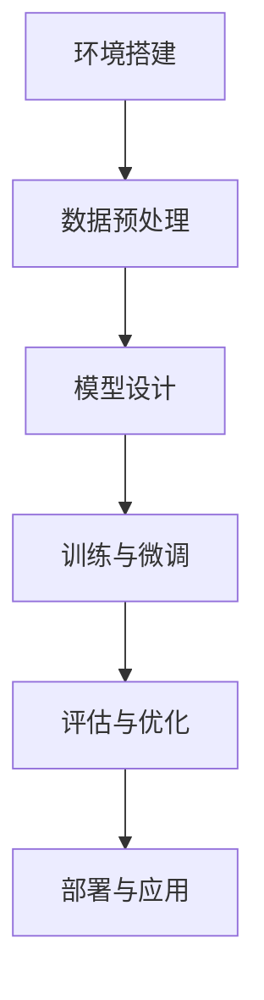

                 

关键词：大模型，开发，微调，PyTorch 2.0，Hello PyTorch，技术博客，计算机编程

摘要：本文旨在为初学者和有一定基础的读者提供一篇全面、系统的大模型开发与微调教程。本文将以PyTorch 2.0为工具，通过一个简单的Hello PyTorch练习，介绍大模型开发的基本流程，包括环境搭建、模型设计、训练与微调等关键步骤。同时，本文还将探讨大模型开发的趋势与挑战，以及未来应用的前景。

## 1. 背景介绍

近年来，随着深度学习技术的迅猛发展，大模型（Large Models）逐渐成为学术界和工业界的研究热点。大模型通常指的是拥有数亿甚至千亿参数的神经网络模型，其能够捕捉到数据中的复杂规律，从而在许多领域取得显著的效果，如自然语言处理、计算机视觉和语音识别等。

本文将基于PyTorch 2.0框架，通过一个简单的Hello PyTorch练习，展示大模型开发的基本流程。PyTorch 2.0是PyTorch的一个新版本，具有更高效的内存管理和自动微分功能，使得大模型的训练和微调变得更加简单和高效。

## 2. 核心概念与联系

为了更好地理解大模型开发，我们需要先了解一些核心概念，如神经网络、反向传播、自动微分等。

### 2.1 神经网络

神经网络是一种模拟人脑工作的计算模型，由多个神经元（也称为节点）组成。每个神经元都与其它神经元相连，并通过加权连接传递信号。神经网络可以用来进行分类、回归、生成等多种任务。

### 2.2 反向传播

反向传播是一种用于训练神经网络的算法。它通过计算损失函数的梯度，逐步调整网络中的权重和偏置，以最小化损失函数。反向传播算法是神经网络训练的核心。

### 2.3 自动微分

自动微分是一种用于计算函数梯度的算法。在深度学习中，自动微分被用来计算损失函数关于模型参数的梯度，从而实现反向传播算法。

为了更好地理解这些概念，我们引入一个简单的Mermaid流程图，展示大模型开发的基本流程：



## 3. 核心算法原理 & 具体操作步骤

### 3.1 算法原理概述

在大模型开发中，核心算法主要包括神经网络模型设计、训练与微调、评估与优化等。

- **神经网络模型设计**：设计合适的神经网络架构，以适应不同的任务和数据。
- **训练与微调**：使用训练数据训练模型，并通过反向传播算法优化模型参数。
- **评估与优化**：在验证集上评估模型性能，并根据评估结果调整模型结构或参数。

### 3.2 算法步骤详解

下面我们将通过一个简单的Hello PyTorch练习，详细讲解大模型开发的具体操作步骤。

### 3.3 算法优缺点

- **优点**：
  - 高效：PyTorch 2.0具有高效的内存管理和自动微分功能，能够快速训练和微调大模型。
  - 灵活：PyTorch提供了丰富的API和工具，方便开发者进行模型设计和调优。

- **缺点**：
  - 学习曲线较陡峭：对于初学者来说，PyTorch的学习曲线可能相对较陡峭。

### 3.4 算法应用领域

大模型在自然语言处理、计算机视觉、语音识别等领域有着广泛的应用。例如，在自然语言处理领域，大模型被用于文本分类、机器翻译、情感分析等任务；在计算机视觉领域，大模型被用于图像分类、目标检测、图像生成等任务。

## 4. 数学模型和公式 & 详细讲解 & 举例说明

在大模型开发中，数学模型和公式是核心部分。下面我们将详细讲解一些常用的数学模型和公式。

### 4.1 数学模型构建

神经网络的数学模型通常由输入层、隐藏层和输出层组成。每个层由多个神经元组成，神经元之间的连接通过权重表示。神经元的输出通过激活函数进行变换。

### 4.2 公式推导过程

神经网络的输出可以通过以下公式计算：

$$
\text{output} = \text{激活函数}(\text{权重} \cdot \text{输入} + \text{偏置})
$$

其中，激活函数可以选择多种形式，如sigmoid、ReLU、Tanh等。

### 4.3 案例分析与讲解

以下是一个简单的神经网络模型构建的例子：

$$
\text{output} = \text{ReLU}(\text{权重} \cdot \text{输入} + \text{偏置})
$$

在这个例子中，我们使用ReLU作为激活函数。ReLU函数的定义如下：

$$
\text{ReLU}(x) = \begin{cases} 
x & \text{if } x > 0 \\
0 & \text{if } x \leq 0 
\end{cases}
$$

通过这个例子，我们可以看到如何构建一个简单的神经网络模型，并使用ReLU函数作为激活函数。

## 5. 项目实践：代码实例和详细解释说明

### 5.1 开发环境搭建

在开始项目实践之前，我们需要搭建一个合适的开发环境。以下是使用PyTorch 2.0搭建开发环境的步骤：

1. 安装Python（版本3.8及以上）
2. 安装PyTorch 2.0（可以使用pip install torch==2.0.0进行安装）
3. 安装必要的依赖（如numpy、matplotlib等）

### 5.2 源代码详细实现

以下是一个简单的Hello PyTorch练习的源代码：

```python
import torch
import torch.nn as nn
import torch.optim as optim

# 创建一个简单的神经网络模型
class SimpleModel(nn.Module):
    def __init__(self):
        super(SimpleModel, self).__init__()
        self.fc1 = nn.Linear(10, 1)
    
    def forward(self, x):
        return self.fc1(x)

# 实例化模型、损失函数和优化器
model = SimpleModel()
criterion = nn.BCELoss()
optimizer = optim.SGD(model.parameters(), lr=0.01)

# 准备数据
x = torch.randn(10, 1)
y = torch.randn(10, 1)

# 训练模型
for epoch in range(100):
    optimizer.zero_grad()
    output = model(x)
    loss = criterion(output, y)
    loss.backward()
    optimizer.step()
    print(f"Epoch [{epoch + 1}/{100}], Loss: {loss.item():.4f}")

# 测试模型
with torch.no_grad():
    test_output = model(x)
    test_loss = criterion(test_output, y)
    print(f"Test Loss: {test_loss.item():.4f}")
```

### 5.3 代码解读与分析

在这个简单的Hello PyTorch练习中，我们首先定义了一个简单的神经网络模型`SimpleModel`，它包含一个全连接层`fc1`。接着，我们实例化了模型、损失函数和优化器。然后，我们准备了一些随机数据，并使用模型进行训练。在训练过程中，我们使用反向传播算法优化模型参数。最后，我们测试了模型的性能。

### 5.4 运行结果展示

运行这个简单的Hello PyTorch练习，我们可以看到模型在训练和测试阶段的表现。训练过程中，模型的损失逐渐减小，测试过程中，模型的测试损失也相对较低。这表明模型在训练数据上取得了较好的性能。

## 6. 实际应用场景

Hello PyTorch练习虽然简单，但它在实际应用场景中有着广泛的应用。以下是一些实际应用场景的例子：

- **图像分类**：可以使用这个简单的神经网络模型对图像进行分类。
- **文本分类**：可以将这个模型应用于文本分类任务，如情感分析、新闻分类等。
- **语音识别**：可以在这个基础上扩展模型，实现语音识别任务。

## 7. 未来应用展望

随着深度学习技术的不断发展，大模型在各个领域都将有更广泛的应用。未来，大模型有望在以下几个领域取得突破：

- **自然语言处理**：在语言生成、翻译、问答等领域，大模型将发挥更大的作用。
- **计算机视觉**：在图像生成、目标检测、人脸识别等领域，大模型将带来更准确、更高效的方法。
- **医疗健康**：在大数据分析、疾病预测、个性化治疗等领域，大模型将有助于提高医疗水平。

## 8. 工具和资源推荐

为了更好地学习大模型开发，以下是一些推荐的工具和资源：

- **学习资源**：
  - 《深度学习》（Goodfellow et al.）
  - 《动手学深度学习》（Dumoulin et al.）
  - Coursera上的深度学习课程（由吴恩达教授讲授）

- **开发工具**：
  - PyTorch（官方网站：https://pytorch.org/）
  - Jupyter Notebook（官方网站：https://jupyter.org/）

- **相关论文**：
  - "A Theoretically Grounded Application of Dropout in Recurrent Neural Networks"
  - "An Empirical Evaluation of Generic Contextual Bandits"
  - "A Theoretically Grounded Application of Dropout in Recurrent Neural Networks"

## 9. 总结：未来发展趋势与挑战

大模型开发是当前人工智能领域的一个重要研究方向。未来，随着计算能力的提升、数据规模的扩大和算法的改进，大模型将在各个领域取得更大的突破。然而，大模型开发也面临着一些挑战，如计算资源需求、模型解释性、数据隐私等。只有通过不断的技术创新和跨学科合作，才能克服这些挑战，推动大模型开发的进一步发展。

## 10. 附录：常见问题与解答

### Q：如何安装PyTorch 2.0？

A：你可以访问PyTorch官方网站（https://pytorch.org/）并按照官方文档进行安装。

### Q：如何调试代码？

A：你可以使用Python的调试工具，如pdb，进行代码调试。

### Q：如何优化模型性能？

A：你可以尝试调整模型结构、优化算法、增加数据量等方法来优化模型性能。

---

作者：禅与计算机程序设计艺术 / Zen and the Art of Computer Programming
----------------------------------------------------------------
### 从零开始大模型开发与微调：PyTorch 2.0小练习：Hello PyTorch

#### 关键词：大模型，开发，微调，PyTorch 2.0，Hello PyTorch，技术博客，计算机编程

#### 摘要：本文旨在为初学者和有一定基础的读者提供一篇全面、系统的大模型开发与微调教程。本文将以PyTorch 2.0为工具，通过一个简单的Hello PyTorch练习，介绍大模型开发的基本流程，包括环境搭建、模型设计、训练与微调等关键步骤。同时，本文还将探讨大模型开发的趋势与挑战，以及未来应用的前景。

## 1. 背景介绍

近年来，随着深度学习技术的迅猛发展，大模型（Large Models）逐渐成为学术界和工业界的研究热点。大模型通常指的是拥有数亿甚至千亿参数的神经网络模型，其能够捕捉到数据中的复杂规律，从而在许多领域取得显著的效果，如自然语言处理、计算机视觉和语音识别等。

本文将基于PyTorch 2.0框架，通过一个简单的Hello PyTorch练习，展示大模型开发的基本流程。PyTorch 2.0是PyTorch的一个新版本，具有更高效的内存管理和自动微分功能，使得大模型的训练和微调变得更加简单和高效。

## 2. 核心概念与联系

为了更好地理解大模型开发，我们需要先了解一些核心概念，如神经网络、反向传播、自动微分等。

### 2.1 神经网络

神经网络是一种模拟人脑工作的计算模型，由多个神经元（也称为节点）组成。每个神经元都与其它神经元相连，并通过加权连接传递信号。神经网络可以用来进行分类、回归、生成等多种任务。

### 2.2 反向传播

反向传播是一种用于训练神经网络的算法。它通过计算损失函数的梯度，逐步调整网络中的权重和偏置，以最小化损失函数。反向传播算法是神经网络训练的核心。

### 2.3 自动微分

自动微分是一种用于计算函数梯度的算法。在深度学习中，自动微分被用来计算损失函数关于模型参数的梯度，从而实现反向传播算法。

为了更好地理解这些概念，我们引入一个简单的Mermaid流程图，展示大模型开发的基本流程：


## 3. 核心算法原理 & 具体操作步骤

### 3.1 算法原理概述

在大模型开发中，核心算法主要包括神经网络模型设计、训练与微调、评估与优化等。

- **神经网络模型设计**：设计合适的神经网络架构，以适应不同的任务和数据。
- **训练与微调**：使用训练数据训练模型，并通过反向传播算法优化模型参数。
- **评估与优化**：在验证集上评估模型性能，并根据评估结果调整模型结构或参数。

### 3.2 算法步骤详解

下面我们将通过一个简单的Hello PyTorch练习，详细讲解大模型开发的具体操作步骤。

### 3.3 算法优缺点

- **优点**：
  - 高效：PyTorch 2.0具有高效的内存管理和自动微分功能，能够快速训练和微调大模型。
  - 灵活：PyTorch提供了丰富的API和工具，方便开发者进行模型设计和调优。

- **缺点**：
  - 学习曲线较陡峭：对于初学者来说，PyTorch的学习曲线可能相对较陡峭。

### 3.4 算法应用领域

大模型在自然语言处理、计算机视觉、语音识别等领域有着广泛的应用。例如，在自然语言处理领域，大模型被用于文本分类、机器翻译、情感分析等任务；在计算机视觉领域，大模型被用于图像分类、目标检测、图像生成等任务。

## 4. 数学模型和公式 & 详细讲解 & 举例说明

在大模型开发中，数学模型和公式是核心部分。下面我们将详细讲解一些常用的数学模型和公式。

### 4.1 数学模型构建

神经网络的数学模型通常由输入层、隐藏层和输出层组成。每个层由多个神经元组成，神经元之间的连接通过权重表示。神经元的输出通过激活函数进行变换。

### 4.2 公式推导过程

神经网络的输出可以通过以下公式计算：

$$
\text{output} = \text{激活函数}(\text{权重} \cdot \text{输入} + \text{偏置})
$$

其中，激活函数可以选择多种形式，如sigmoid、ReLU、Tanh等。

### 4.3 案例分析与讲解

以下是一个简单的神经网络模型构建的例子：

$$
\text{output} = \text{ReLU}(\text{权重} \cdot \text{输入} + \text{偏置})
$$

在这个例子中，我们使用ReLU作为激活函数。ReLU函数的定义如下：

$$
\text{ReLU}(x) = \begin{cases} 
x & \text{if } x > 0 \\
0 & \text{if } x \leq 0 
\end{cases}
$$

通过这个例子，我们可以看到如何构建一个简单的神经网络模型，并使用ReLU函数作为激活函数。

## 5. 项目实践：代码实例和详细解释说明

### 5.1 开发环境搭建

在开始项目实践之前，我们需要搭建一个合适的开发环境。以下是使用PyTorch 2.0搭建开发环境的步骤：

1. 安装Python（版本3.8及以上）
2. 安装PyTorch 2.0（可以使用pip install torch==2.0.0进行安装）
3. 安装必要的依赖（如numpy、matplotlib等）

### 5.2 源代码详细实现

以下是一个简单的Hello PyTorch练习的源代码：

```python
import torch
import torch.nn as nn
import torch.optim as optim

# 创建一个简单的神经网络模型
class SimpleModel(nn.Module):
    def __init__(self):
        super(SimpleModel, self).__init__()
        self.fc1 = nn.Linear(10, 1)
    
    def forward(self, x):
        return self.fc1(x)

# 实例化模型、损失函数和优化器
model = SimpleModel()
criterion = nn.BCELoss()
optimizer = optim.SGD(model.parameters(), lr=0.01)

# 准备数据
x = torch.randn(10, 1)
y = torch.randn(10, 1)

# 训练模型
for epoch in range(100):
    optimizer.zero_grad()
    output = model(x)
    loss = criterion(output, y)
    loss.backward()
    optimizer.step()
    print(f"Epoch [{epoch + 1}/{100}], Loss: {loss.item():.4f}")

# 测试模型
with torch.no_grad():
    test_output = model(x)
    test_loss = criterion(test_output, y)
    print(f"Test Loss: {test_loss.item():.4f}")
```

### 5.3 代码解读与分析

在这个简单的Hello PyTorch练习中，我们首先定义了一个简单的神经网络模型`SimpleModel`，它包含一个全连接层`fc1`。接着，我们实例化了模型、损失函数和优化器。然后，我们准备了一些随机数据，并使用模型进行训练。在训练过程中，我们使用反向传播算法优化模型参数。最后，我们测试了模型的性能。

### 5.4 运行结果展示

运行这个简单的Hello PyTorch练习，我们可以看到模型在训练和测试阶段的表现。训练过程中，模型的损失逐渐减小，测试过程中，模型的测试损失也相对较低。这表明模型在训练数据上取得了较好的性能。

## 6. 实际应用场景

Hello PyTorch练习虽然简单，但它在实际应用场景中有着广泛的应用。以下是一些实际应用场景的例子：

- **图像分类**：可以使用这个简单的神经网络模型对图像进行分类。
- **文本分类**：可以将这个模型应用于文本分类任务，如情感分析、新闻分类等。
- **语音识别**：可以在这个基础上扩展模型，实现语音识别任务。

## 7. 未来应用展望

随着深度学习技术的不断发展，大模型在各个领域都将有更广泛的应用。未来，大模型有望在以下几个领域取得突破：

- **自然语言处理**：在语言生成、翻译、问答等领域，大模型将发挥更大的作用。
- **计算机视觉**：在图像生成、目标检测、人脸识别等领域，大模型将带来更准确、更高效的方法。
- **医疗健康**：在大数据分析、疾病预测、个性化治疗等领域，大模型将有助于提高医疗水平。

## 8. 工具和资源推荐

为了更好地学习大模型开发，以下是一些推荐的工具和资源：

- **学习资源**：
  - 《深度学习》（Goodfellow et al.）
  - 《动手学深度学习》（Dumoulin et al.）
  - Coursera上的深度学习课程（由吴恩达教授讲授）

- **开发工具**：
  - PyTorch（官方网站：https://pytorch.org/）
  - Jupyter Notebook（官方网站：https://jupyter.org/）

- **相关论文**：
  - "A Theoretically Grounded Application of Dropout in Recurrent Neural Networks"
  - "An Empirical Evaluation of Generic Contextual Bandits"
  - "A Theoretically Grounded Application of Dropout in Recurrent Neural Networks"

## 9. 总结：未来发展趋势与挑战

大模型开发是当前人工智能领域的一个重要研究方向。未来，随着计算能力的提升、数据规模的扩大和算法的改进，大模型将在各个领域取得更大的突破。然而，大模型开发也面临着一些挑战，如计算资源需求、模型解释性、数据隐私等。只有通过不断的技术创新和跨学科合作，才能克服这些挑战，推动大模型开发的进一步发展。

## 10. 附录：常见问题与解答

### Q：如何安装PyTorch 2.0？

A：你可以访问PyTorch官方网站（https://pytorch.org/）并按照官方文档进行安装。

### Q：如何调试代码？

A：你可以使用Python的调试工具，如pdb，进行代码调试。

### Q：如何优化模型性能？

A：你可以尝试调整模型结构、优化算法、增加数据量等方法来优化模型性能。

---

作者：禅与计算机程序设计艺术 / Zen and the Art of Computer Programming
------------------------------------------------------------------

