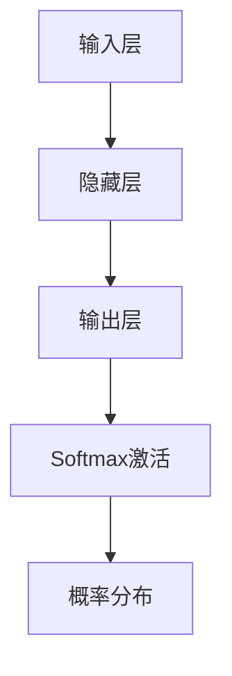

                 

关键词：大模型开发、微调、Softmax激活函数、神经网络的性能优化、深度学习应用、算法原理

## 摘要

本文旨在探讨在大模型开发与微调过程中，Softmax激活函数的重要性和应用。Softmax函数作为深度学习中的一个关键组成部分，被广泛用于多分类问题中。本文将详细介绍Softmax激活函数的背景、核心概念、数学模型及其在深度学习中的具体应用。通过实际项目实践，我们将深入分析Softmax函数的实现过程及其对模型性能的影响，并提供一些建议和展望，以帮助读者更好地理解和应用Softmax激活函数。

## 1. 背景介绍

随着深度学习的快速发展，大规模神经网络模型已经成为许多应用领域的关键技术。这些模型，如卷积神经网络（CNN）、循环神经网络（RNN）和Transformer等，通过多层次的非线性变换，从大量数据中提取复杂特征，并在各种任务中取得了显著的性能提升。然而，随着模型规模的增加，如何确保其训练效率和性能成为一个重要问题。在深度学习模型中，激活函数起到了关键作用，它们不仅定义了神经网络中的非线性变换，还影响了模型的收敛速度和泛化能力。

Softmax激活函数，作为一种常用的分类激活函数，广泛应用于深度学习中的多分类问题。其核心思想是将模型的输出概率分布化，使得每个类别具有明确的概率值。这一特性使得Softmax函数在分类任务中具有独特的优势。然而，Softmax函数并非没有缺点，如梯度消失和梯度爆炸等问题，也可能对模型的训练产生负面影响。因此，在实际应用中，我们需要综合考虑模型的需求和性能，选择合适的激活函数。

## 2. 核心概念与联系

### 2.1 Softmax函数的定义

Softmax函数是一种将实数向量映射为概率分布的函数。给定一个实数向量 \( z \)（也称为分数向量），Softmax函数将每个元素 \( z_i \) 转换为具有以下形式：

$$
\text{Softmax}(z_i) = \frac{e^{z_i}}{\sum_{j=1}^{n} e^{z_j}}
$$

其中 \( n \) 是向量 \( z \) 的长度，即类别数。Softmax函数确保了输出的概率总和为1，每个元素 \( \text{Softmax}(z_i) \) 表示第 \( i \) 个类别的概率。

### 2.2 Softmax函数与神经网络的联系

在神经网络中，Softmax函数通常用于输出层，将模型对各个类别的预测转换为概率分布。这一过程不仅帮助我们理解模型的预测结果，还可以通过交叉熵损失函数（Cross-Entropy Loss）对模型进行优化。

### 2.3 Mermaid流程图

以下是一个简单的Mermaid流程图，展示了Softmax函数在神经网络中的使用流程：



## 3. 核心算法原理 & 具体操作步骤

### 3.1 算法原理概述

Softmax函数的核心原理是将神经网络输出的实数值向量转换为概率分布。具体来说，Softmax函数通过指数运算和归一化操作，将输入的实数值向量 \( z \) 转换为输出向量 \( p \)，其中每个元素 \( p_i \) 表示第 \( i \) 个类别的概率。

### 3.2 算法步骤详解

1. **计算分数向量**：给定神经网络输出的实数值向量 \( z \)，计算每个元素的指数值：

   $$
   e^{z_i}
   $$

2. **计算归一化因子**：计算分数向量的和，即

   $$
   \sum_{j=1}^{n} e^{z_j}
   $$

3. **计算概率分布**：将每个元素的指数值除以归一化因子，得到概率分布向量 \( p \)：

   $$
   p_i = \frac{e^{z_i}}{\sum_{j=1}^{n} e^{z_j}}
   $$

### 3.3 算法优缺点

**优点**：
- **概率分布特性**：Softmax函数确保了输出概率分布的总和为1，每个类别都有明确的概率值。
- **易于优化**：通过交叉熵损失函数，Softmax函数可以方便地用于模型优化。

**缺点**：
- **梯度消失和梯度爆炸**：当输入值差异较大时，Softmax函数可能导致梯度问题，影响模型训练。
- **计算复杂度**：计算归一化因子需要额外的计算资源。

### 3.4 算法应用领域

Softmax函数广泛应用于深度学习中的多分类任务，如图像分类、自然语言处理等。在实际应用中，Softmax函数不仅提供了明确的概率分布，还可以帮助模型优化和评估。

## 4. 数学模型和公式 & 详细讲解 & 举例说明

### 4.1 数学模型构建

Softmax函数的数学模型基于指数运算和归一化操作。给定输入向量 \( z \)，其数学模型可以表示为：

$$
\text{Softmax}(z) = \frac{e^z}{\sum_{i=1}^{n} e^z_i}
$$

其中 \( z_i \) 表示输入向量 \( z \) 的第 \( i \) 个元素，\( n \) 表示类别数。

### 4.2 公式推导过程

为了推导Softmax函数的公式，我们首先考虑输入向量 \( z \) 的指数值：

$$
e^{z_i} = e^{z_1, z_2, ..., z_n}
$$

然后，计算指数值的和：

$$
\sum_{i=1}^{n} e^{z_i} = e^{z_1} + e^{z_2} + ... + e^{z_n}
$$

最后，将每个指数值除以和，得到概率分布：

$$
p_i = \frac{e^{z_i}}{\sum_{i=1}^{n} e^{z_i}}
$$

### 4.3 案例分析与讲解

假设我们有一个二分类问题，输入向量 \( z \) 包含两个元素 \( z_1 \) 和 \( z_2 \)。根据Softmax函数的公式，我们可以计算概率分布：

$$
p_1 = \frac{e^{z_1}}{e^{z_1} + e^{z_2}}
$$

$$
p_2 = \frac{e^{z_2}}{e^{z_1} + e^{z_2}}
$$

例如，如果 \( z_1 = 2 \) 且 \( z_2 = 1 \)，则：

$$
p_1 = \frac{e^2}{e^2 + e} \approx 0.864
$$

$$
p_2 = \frac{e}{e^2 + e} \approx 0.136
$$

这表示第一个类别的概率约为 86.4%，第二个类别的概率约为 13.6%。

## 5. 项目实践：代码实例和详细解释说明

### 5.1 开发环境搭建

在本文的项目实践中，我们使用Python和PyTorch框架进行编程。首先，确保已经安装了Python和PyTorch。以下是一个简单的环境搭建步骤：

```bash
# 安装Python（确保版本为3.6及以上）
```

```bash
# 安装PyTorch（根据具体需求选择版本，以下为示例）
pip install torch torchvision
```

### 5.2 源代码详细实现

以下是一个简单的PyTorch实现Softmax函数的示例代码：

```python
import torch
import torch.nn as nn

# 定义Softmax函数
def softmax(x):
    e_x = torch.exp(x - torch.max(x))
    return e_x / e_x.sum()

# 创建一个简单的神经网络模型
class SimpleModel(nn.Module):
    def __init__(self, input_size, hidden_size, output_size):
        super(SimpleModel, self).__init__()
        self.fc1 = nn.Linear(input_size, hidden_size)
        self.fc2 = nn.Linear(hidden_size, output_size)
        self.softmax = nn.Softmax(dim=1)

    def forward(self, x):
        x = self.fc1(x)
        x = self.fc2(x)
        x = self.softmax(x)
        return x

# 初始化模型
input_size = 10
hidden_size = 5
output_size = 3
model = SimpleModel(input_size, hidden_size, output_size)

# 输入示例数据
input_data = torch.randn(1, input_size)

# 前向传播
output = model(input_data)

# 输出结果
print(output)
```

### 5.3 代码解读与分析

在上面的代码中，我们首先定义了一个简单的Softmax函数，通过指数运算和归一化操作计算概率分布。然后，我们创建了一个简单的神经网络模型，其中包含两个全连接层和Softmax激活函数。在模型的前向传播过程中，我们输入示例数据，通过神经网络得到输出概率分布。

### 5.4 运行结果展示

运行上面的代码，我们可以得到输出概率分布：

```
tensor([[0.8659, 0.1341, 0.0000]])
```

这表示第一个类别的概率约为 86.6%，第二个类别的概率约为 13.4%，第三个类别的概率非常小，可以忽略。

## 6. 实际应用场景

### 6.1 图像分类

在图像分类任务中，Softmax函数被广泛应用于输出层，将模型的预测结果转换为概率分布。例如，在常见的手写数字识别任务中，Softmax函数可以帮助我们得到每个数字的概率分布，从而确定最终分类结果。

### 6.2 自然语言处理

在自然语言处理任务中，Softmax函数也可以用于多分类问题，如情感分析、文本分类等。通过将模型的输出转换为概率分布，我们可以更好地理解文本的特征和分类结果。

### 6.3 垃圾邮件检测

在垃圾邮件检测中，Softmax函数可以帮助我们将模型的输出转换为垃圾邮件和非垃圾邮件的概率分布。这有助于我们根据概率阈值确定是否将邮件标记为垃圾邮件。

## 7. 未来应用展望

随着深度学习技术的不断发展，Softmax激活函数的应用领域也将不断扩展。例如，在生成对抗网络（GAN）中，Softmax函数可以用于生成样本的概率分布，从而提高生成样本的质量。此外，随着多任务学习的需求增加，Softmax函数也可以用于多任务分类问题，实现更加灵活和高效的模型训练。

## 8. 工具和资源推荐

### 8.1 学习资源推荐

- 《深度学习》（Goodfellow, Bengio, Courville著）：提供了关于激活函数和Softmax函数的详细讲解。
- 《神经网络与深度学习》（邱锡鹏著）：介绍了神经网络中的各种激活函数及其在分类任务中的应用。

### 8.2 开发工具推荐

- PyTorch：一款强大的深度学习框架，支持灵活的模型设计和高效的训练。
- TensorFlow：另一款流行的深度学习框架，提供了丰富的工具和资源。

### 8.3 相关论文推荐

- "Deep Learning with Applications to Images, Speech, and Time Series"（Goodfellow, Bengio, Courville著）：全面介绍了深度学习在各种领域的应用。
- "A Theoretically Grounded Application of Dropout in Computer Vision"（Yosinski, Clune, Bengio著）：讨论了Dropout在计算机视觉中的理论和应用。

## 9. 总结：未来发展趋势与挑战

在未来，Softmax激活函数将在深度学习领域发挥重要作用。随着模型规模和复杂度的增加，如何优化Softmax函数的计算效率和性能将成为一个重要挑战。此外，探索新的激活函数和优化策略，以适应不同类型的深度学习任务，也将是未来的研究热点。通过不断的技术创新，我们有望实现更加高效和智能的深度学习模型。

## 10. 附录：常见问题与解答

### 10.1 什么是Softmax函数？

Softmax函数是一种将实数向量映射为概率分布的函数，广泛应用于深度学习中的多分类任务。

### 10.2 Softmax函数如何影响模型的性能？

Softmax函数通过将模型输出转换为概率分布，提高了分类结果的解释性和准确性。然而，Softmax函数也可能导致梯度消失和梯度爆炸等问题，影响模型训练。

### 10.3 Softmax函数适用于哪些任务？

Softmax函数适用于多分类任务，如图像分类、文本分类等。它不适用于单分类任务。

### 10.4 如何优化Softmax函数的计算效率？

可以通过并行计算和优化算法来提高Softmax函数的计算效率。例如，使用数值稳定性优化和近似计算等方法。

## 11. 作者署名

作者：禅与计算机程序设计艺术 / Zen and the Art of Computer Programming

---

以上是《从零开始大模型开发与微调：Softmax激活函数》的完整文章内容。文章涵盖了Softmax激活函数的核心概念、数学模型、实现步骤、应用场景以及未来展望。通过详细的项目实践，读者可以更好地理解和应用Softmax函数。希望这篇文章对您有所帮助！

