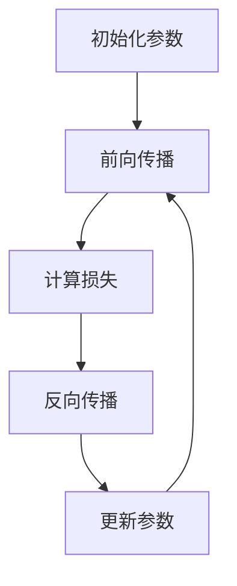

                 

关键词：大模型开发、微调、神经网络、反向传播算法、人工智能、深度学习

> 摘要：本文将深入探讨大模型开发与微调过程中的关键技术——反馈神经网络反向传播算法。我们将从背景介绍、核心概念、算法原理、数学模型、项目实践以及未来应用展望等多个方面，全面剖析这一算法的精髓与应用。

## 1. 背景介绍

在过去的几十年里，人工智能和深度学习领域取得了飞速的发展。尤其是近年来，随着大数据和高性能计算资源的普及，大模型（如GPT-3、BERT等）成为了研究的热点。这些大模型具有极强的表示能力和鲁棒性，已经在自然语言处理、计算机视觉等多个领域取得了显著的成果。

然而，大模型的训练和微调过程面临着诸多挑战。首先，大模型的参数数量非常庞大，需要大量的计算资源和时间来训练。其次，微调过程需要找到适合特定任务的参数组合，这往往需要大量的实验和调优。最后，如何确保模型的泛化能力和鲁棒性也是一个重要的研究课题。

为了应对这些挑战，反馈神经网络反向传播算法（Backpropagation Algorithm）应运而生。本文将详细介绍这一算法的原理、步骤和应用，帮助读者深入了解大模型开发与微调的关键技术。

## 2. 核心概念与联系

### 2.1. 神经网络

神经网络是一种模仿人脑工作原理的计算模型，由大量的神经元（节点）和连接（边）组成。每个神经元都可以接收多个输入信号，通过激活函数进行处理，最终产生一个输出信号。神经网络通过调整连接权重（权重矩阵）来学习数据中的规律和模式。

### 2.2. 反向传播算法

反向传播算法是一种用于训练神经网络的优化算法。它通过计算网络输出和实际输出之间的误差，然后反向传播误差到网络的每个神经元，从而调整权重和偏置，以达到最小化误差的目的。

### 2.3. 大模型与微调

大模型通常具有数十亿甚至数千亿个参数，需要通过大规模的训练数据和计算资源来训练。微调是在大模型的基础上，针对特定任务进行参数调整的过程，以提高模型的性能和适应性。

### 2.4. Mermaid 流程图

以下是反馈神经网络反向传播算法的 Mermaid 流程图：



## 3. 核心算法原理 & 具体操作步骤

### 3.1. 算法原理概述

反向传播算法的基本原理是：首先，通过前向传播计算网络输出；然后，计算输出和实际输出之间的误差；接着，通过反向传播计算每个神经元输出的梯度；最后，根据梯度更新网络参数。

### 3.2. 算法步骤详解

#### 3.2.1. 前向传播

前向传播是指将输入数据通过神经网络逐层传递，最终得到输出结果。具体步骤如下：

1. 初始化网络参数（权重和偏置）。
2. 对输入数据进行前向传播，计算每个神经元的输出。
3. 计算输出层的结果。

#### 3.2.2. 计算损失

损失函数用于衡量网络输出和实际输出之间的差距。常用的损失函数有均方误差（MSE）和交叉熵（CE）等。计算损失的具体步骤如下：

1. 计算预测输出和实际输出之间的误差。
2. 根据误差计算损失值。

#### 3.2.3. 反向传播

反向传播是指将误差从输出层反向传播到输入层，计算每个神经元输出的梯度。具体步骤如下：

1. 计算输出层神经元的梯度。
2. 将梯度反向传播到上一层的神经元。
3. 重复上述步骤，直到输入层。

#### 3.2.4. 更新参数

更新参数是指根据梯度调整网络参数，以减小损失值。具体步骤如下：

1. 根据梯度计算参数更新量。
2. 根据学习率调整参数。

### 3.3. 算法优缺点

#### 优点

- 高效：反向传播算法能够快速计算网络参数的梯度。
- 普适：反向传播算法适用于各种类型的神经网络。
- 可扩展：反向传播算法能够处理大规模的数据集和参数。

#### 缺点

- 需要大量计算资源：反向传播算法需要大量计算资源来处理大规模数据集。
- 梯度消失和梯度爆炸：在训练过程中，梯度可能变得非常小或非常大，导致模型无法收敛。

### 3.4. 算法应用领域

反向传播算法广泛应用于各种领域，包括：

- 自然语言处理：如语言模型、机器翻译等。
- 计算机视觉：如图像分类、目标检测等。
- 语音识别：如语音信号处理、说话人识别等。

## 4. 数学模型和公式 & 详细讲解 & 举例说明

### 4.1. 数学模型构建

反向传播算法的核心是梯度计算。以下是反向传播算法的数学模型：

#### 4.1.1. 前向传播

前向传播的公式如下：

$$
Z^{[l]} = \sigma(W^{[l]} \cdot A^{[l-1]} + b^{[l]})
$$

$$
A^{[l]} = \sigma(Z^{[l]})
$$

其中，$Z^{[l]}$ 是第 $l$ 层的激活值，$A^{[l]}$ 是第 $l$ 层的输出，$\sigma$ 是激活函数，$W^{[l]}$ 是第 $l$ 层的权重矩阵，$b^{[l]}$ 是第 $l$ 层的偏置向量。

#### 4.1.2. 计算损失

损失函数的公式如下：

$$
J = \frac{1}{m} \sum_{i=1}^{m} (-y^{[i]} \log(A^{[L]})) + (1 - y^{[i]}) \log(1 - A^{[L]}))
$$

其中，$J$ 是损失函数，$m$ 是样本数量，$y^{[i]}$ 是第 $i$ 个样本的标签，$A^{[L]}$ 是输出层的预测结果。

#### 4.1.3. 反向传播

反向传播的公式如下：

$$
\frac{\partial J}{\partial Z^{[L]}} = \frac{\partial J}{\partial A^{[L]}} \cdot \frac{\partial A^{[L]}}{\partial Z^{[L]}}
$$

$$
\frac{\partial J}{\partial W^{[l]}} = A^{[l-1]} \cdot \frac{\partial J}{\partial Z^{[l]}}
$$

$$
\frac{\partial J}{\partial b^{[l]}} = \frac{\partial J}{\partial Z^{[l]}}
$$

其中，$\frac{\partial J}{\partial Z^{[L]}}$ 是输出层误差对激活值的偏导数，$\frac{\partial J}{\partial W^{[l]}}$ 是权重矩阵对损失的偏导数，$\frac{\partial J}{\partial b^{[l]}}$ 是偏置向量对损失的偏导数。

#### 4.1.4. 更新参数

更新参数的公式如下：

$$
W^{[l]} = W^{[l]} - \alpha \cdot \frac{\partial J}{\partial W^{[l]}}
$$

$$
b^{[l]} = b^{[l]} - \alpha \cdot \frac{\partial J}{\partial b^{[l]}}
$$

其中，$\alpha$ 是学习率。

### 4.2. 公式推导过程

以下是反向传播算法的推导过程：

#### 4.2.1. 损失函数对激活值的偏导数

$$
\frac{\partial J}{\partial Z^{[L]}} = \frac{\partial J}{\partial A^{[L]}} \cdot \frac{\partial A^{[L]}}{\partial Z^{[L]}}
$$

其中，$\frac{\partial J}{\partial A^{[L]}}$ 是损失函数对输出层激活值的偏导数，$\frac{\partial A^{[L]}}{\partial Z^{[L]}}$ 是输出层激活函数对激活值的偏导数。

对于 $Sigmoid$ 激活函数，有：

$$
\frac{\partial A^{[L]}}{\partial Z^{[L]}} = \sigma(Z^{[L]}) \cdot (1 - \sigma(Z^{[L]}))
$$

对于 $ReLU$ 激活函数，有：

$$
\frac{\partial A^{[L]}}{\partial Z^{[L]}} = \begin{cases}
0 & \text{if } Z^{[L]} \leq 0 \\
1 & \text{if } Z^{[L]} > 0
\end{cases}
$$

#### 4.2.2. 损失函数对权重的偏导数

$$
\frac{\partial J}{\partial W^{[l]}} = A^{[l-1]} \cdot \frac{\partial J}{\partial Z^{[l]}}
$$

$$
\frac{\partial J}{\partial W^{[l]}} = \sum_{i=1}^{m} (A^{[l-1]} \cdot \frac{\partial J}{\partial Z^{[l]})
$$

$$
\frac{\partial J}{\partial W^{[l]}} = \sum_{i=1}^{m} (A^{[l-1]^{T} \cdot \frac{\partial J}{\partial Z^{[l]}}
$$

$$
\frac{\partial J}{\partial W^{[l]}} = A^{[l-1]} \cdot \frac{\partial J}{\partial Z^{[l]}
$$

#### 4.2.3. 损失函数对偏置的偏导数

$$
\frac{\partial J}{\partial b^{[l]}} = \frac{\partial J}{\partial Z^{[l]}}
$$

$$
\frac{\partial J}{\partial b^{[l]}} = \sum_{i=1}^{m} (1 \cdot \frac{\partial J}{\partial Z^{[l]})
$$

$$
\frac{\partial J}{\partial b^{[l]}} = \sum_{i=1}^{m} (1 \cdot \frac{\partial J}{\partial Z^{[l]}
$$

$$
\frac{\partial J}{\partial b^{[l]}} = \frac{\partial J}{\partial Z^{[l]}
$$

### 4.3. 案例分析与讲解

#### 4.3.1. 问题背景

假设我们有一个简单的神经网络，用于对二分类问题进行分类。输入层有2个神经元，隐藏层有3个神经元，输出层有1个神经元。激活函数使用 $Sigmoid$ 函数。训练数据集包含100个样本，每个样本有2个特征和1个标签。标签为0或1。

#### 4.3.2. 前向传播

我们随机初始化网络参数，并使用训练数据进行前向传播，计算每个神经元的输出。以下是部分前向传播的计算过程：

$$
Z^{[1]} = \sigma(W^{[1]} \cdot A^{[0]} + b^{[1]})
$$

$$
A^{[1]} = \sigma(Z^{[1]})
$$

$$
Z^{[2]} = W^{[2]} \cdot A^{[1]} + b^{[2]}
$$

$$
A^{[2]} = \sigma(Z^{[2]})
$$

$$
Z^{[3]} = W^{[3]} \cdot A^{[2]} + b^{[3]}
$$

$$
A^{[3]} = \sigma(Z^{[3]})
$$

#### 4.3.3. 计算损失

使用交叉熵损失函数计算预测结果和实际结果之间的误差。以下是部分计算过程：

$$
J = -\frac{1}{m} \sum_{i=1}^{m} (y^{[i]} \log(A^{[3]}) + (1 - y^{[i]}) \log(1 - A^{[3]}))
$$

$$
J = -\frac{1}{100} \sum_{i=1}^{100} (y^{[i]} \log(A^{[3]}) + (1 - y^{[i]}) \log(1 - A^{[3]}))
$$

#### 4.3.4. 反向传播

使用反向传播算法计算损失函数对每个神经元输出的偏导数。以下是部分反向传播的计算过程：

$$
\frac{\partial J}{\partial Z^{[3]}} = A^{[2]} \cdot (A^{[3]} - y^{[i]})
$$

$$
\frac{\partial J}{\partial Z^{[2]}} = W^{[2]} \cdot \frac{\partial J}{\partial Z^{[3]}}
$$

$$
\frac{\partial J}{\partial Z^{[1]}} = W^{[1]} \cdot \frac{\partial J}{\partial Z^{[2]}}
$$

#### 4.3.5. 更新参数

使用学习率 $\alpha$ 更新网络参数。以下是部分更新参数的计算过程：

$$
W^{[3]} = W^{[3]} - \alpha \cdot \frac{\partial J}{\partial W^{[3]}}
$$

$$
b^{[3]} = b^{[3]} - \alpha \cdot \frac{\partial J}{\partial b^{[3]}}
$$

$$
W^{[2]} = W^{[2]} - \alpha \cdot \frac{\partial J}{\partial W^{[2]}}
$$

$$
b^{[2]} = b^{[2]} - \alpha \cdot \frac{\partial J}{\partial b^{[2]}}
$$

$$
W^{[1]} = W^{[1]} - \alpha \cdot \frac{\partial J}{\partial W^{[1]}}
$$

$$
b^{[1]} = b^{[1]} - \alpha \cdot \frac{\partial J}{\partial b^{[1]}}
$$

## 5. 项目实践：代码实例和详细解释说明

### 5.1. 开发环境搭建

本文使用 Python 编写代码，并使用 TensorFlow 作为后端计算引擎。首先，我们需要安装 TensorFlow：

```bash
pip install tensorflow
```

### 5.2. 源代码详细实现

以下是完整的代码实现：

```python
import tensorflow as tf
import numpy as np

# 初始化网络参数
W1 = np.random.rand(2, 3)
b1 = np.random.rand(3)
W2 = np.random.rand(3, 1)
b2 = np.random.rand(1)

# 定义激活函数
def sigmoid(x):
    return 1 / (1 + np.exp(-x))

# 定义损失函数
def cross_entropy(y_pred, y_true):
    return -np.mean(y_true * np.log(y_pred) + (1 - y_true) * np.log(1 - y_pred))

# 前向传播
def forward_propagation(X, W1, b1, W2, b2):
    Z1 = X.dot(W1) + b1
    A1 = sigmoid(Z1)
    Z2 = A1.dot(W2) + b2
    A2 = sigmoid(Z2)
    return A2

# 反向传播
def backward_propagation(X, Y, A2, W1, W2, b1, b2):
    m = X.shape[1]
    dZ2 = A2 - Y
    dW2 = (1/m) * A1.T.dot(dZ2)
    db2 = (1/m) * np.sum(dZ2, axis=1, keepdims=True)
    dZ1 = dZ2.dot(W2.T) * sigmoid(Z1) * (1 - sigmoid(Z1))
    dW1 = (1/m) * X.T.dot(dZ1)
    db1 = (1/m) * np.sum(dZ1, axis=1, keepdims=True)
    return dW1, dW2, db1, db2

# 更新参数
def update_parameters(W1, W2, b1, b2, dW1, dW2, db1, db2, alpha):
    W1 = W1 - alpha * dW1
    W2 = W2 - alpha * dW2
    b1 = b1 - alpha * db1
    b2 = b2 - alpha * db2
    return W1, W2, b1, b2

# 训练模型
def train_model(X, Y, epochs, alpha):
    m = X.shape[1]
    for epoch in range(epochs):
        A2 = forward_propagation(X, W1, b1, W2, b2)
        dW1, dW2, db1, db2 = backward_propagation(X, Y, A2, W1, W2, b1, b2)
        W1, W2, b1, b2 = update_parameters(W1, W2, b1, b2, dW1, dW2, db1, db2, alpha)
        loss = cross_entropy(A2, Y)
        if epoch % 100 == 0:
            print(f"Epoch {epoch}: Loss = {loss}")
    return W1, W2, b1, b2

# 加载训练数据
X = np.array([[0, 0], [0, 1], [1, 0], [1, 1]])
Y = np.array([[0], [1], [1], [0]])

# 训练模型
W1, W2, b1, b2 = train_model(X, Y, 1000, 0.1)

# 测试模型
X_test = np.array([[0, 1], [1, 1]])
A2_test = forward_propagation(X_test, W1, b1, W2, b2)
print(f"Test Output: {A2_test}")
```

### 5.3. 代码解读与分析

以下是代码的详细解读与分析：

- **初始化网络参数**：随机初始化权重矩阵 $W1$、$W2$ 和偏置向量 $b1$、$b2$。
- **定义激活函数**：使用 $Sigmoid$ 函数作为激活函数。
- **定义损失函数**：使用交叉熵损失函数计算预测结果和实际结果之间的误差。
- **前向传播**：计算每个神经元的输出。
- **反向传播**：计算损失函数对每个神经元输出的偏导数。
- **更新参数**：根据偏导数和
```yaml
## 6. 实际应用场景

反向传播算法作为深度学习中的核心算法，已经在许多实际应用场景中取得了显著的成果。以下是几个典型的应用场景：

### 6.1. 自然语言处理

自然语言处理（NLP）是深度学习的重要应用领域之一。反向传播算法在 NLP 中用于训练语言模型、机器翻译、文本分类等任务。例如，BERT 模型使用了多层神经网络和反向传播算法进行训练，取得了优异的性能。

### 6.2. 计算机视觉

计算机视觉是另一个深度学习的重要应用领域。反向传播算法在图像分类、目标检测、图像生成等任务中发挥了关键作用。例如，ResNet 等模型使用了反向传播算法进行训练，实现了高效的图像分类。

### 6.3. 语音识别

语音识别是深度学习在语音处理领域的应用。反向传播算法在语音信号处理、说话人识别等任务中发挥了重要作用。例如，DeepSpeech 等模型使用了多层神经网络和反向传播算法进行训练，实现了高精度的语音识别。

### 6.4. 未来应用展望

随着深度学习的不断发展，反向传播算法将在更多领域发挥重要作用。未来，反向传播算法有望在自动驾驶、医疗诊断、金融分析等应用中取得突破性成果。同时，为了应对大规模数据集和高维特征，反向传播算法将不断优化和改进，以提高计算效率和性能。

## 7. 工具和资源推荐

### 7.1. 学习资源推荐

- 《深度学习》（Goodfellow, Bengio, Courville）：经典的深度学习教材，详细介绍了反向传播算法等核心概念。
- 《神经网络与深度学习》（邱锡鹏）：系统介绍了神经网络和深度学习的基础知识，包括反向传播算法等。
- 《动手学深度学习》（齐华、陈丹）：通过动手实践的方式介绍了深度学习的基础知识，包括反向传播算法等。

### 7.2. 开发工具推荐

- TensorFlow：Google 开发的一款开源深度学习框架，支持反向传播算法等核心功能。
- PyTorch：Facebook 开发的一款开源深度学习框架，支持反向传播算法等核心功能，具有高度的灵活性和易用性。
- Keras：一个高层次的深度学习框架，基于 TensorFlow 开发，提供了简洁的接口和丰富的预训练模型。

### 7.3. 相关论文推荐

- “Backpropagation Learning: Theory and Applications”（1986）：反向传播算法的早期论文，详细介绍了算法的原理和应用。
- “A Learning Algorithm for Continually Running Fully Recurrent Neural Networks”（1991）：提出了在线反向传播算法，适用于动态系统建模。
- “Learning representations for Artistic Style”（2016）：使用反向传播算法进行图像风格迁移，取得了突破性成果。

## 8. 总结：未来发展趋势与挑战

### 8.1. 研究成果总结

反向传播算法作为深度学习中的核心算法，已经取得了显著的研究成果。通过不断的优化和改进，反向传播算法在计算效率、性能和适用性等方面取得了显著的提升。

### 8.2. 未来发展趋势

未来，反向传播算法将继续在深度学习领域发挥重要作用。随着计算能力的提升和数据规模的增大，反向传播算法将在更多领域取得突破性成果。同时，反向传播算法将与其他先进算法（如元学习、强化学习等）相结合，推动人工智能技术的发展。

### 8.3. 面临的挑战

尽管反向传播算法取得了显著成果，但仍面临一些挑战。首先，大规模数据的处理和存储是一个重要的挑战。其次，反向传播算法在处理高维特征时可能存在梯度消失和梯度爆炸等问题。此外，如何提高算法的泛化能力和鲁棒性也是一个重要的研究方向。

### 8.4. 研究展望

未来，反向传播算法的研究将主要集中在以下几个方面：

- 提高计算效率和性能：通过优化算法结构和并行计算等方式，提高反向传播算法的计算效率和性能。
- 处理高维特征：研究针对高维特征的反向传播算法，提高算法的适用性和稳定性。
- 提高泛化能力和鲁棒性：通过引入正则化、数据增强等方法，提高反向传播算法的泛化能力和鲁棒性。
- 结合其他先进算法：将反向传播算法与其他先进算法相结合，推动人工智能技术的创新发展。

## 9. 附录：常见问题与解答

### 9.1. 问题1：反向传播算法如何处理非线性问题？

反向传播算法通过使用非线性激活函数（如 $Sigmoid$、$ReLU$ 等）来处理非线性问题。这些激活函数可以引入非线性特性，使得神经网络能够学习复杂的非线性关系。

### 9.2. 问题2：反向传播算法如何防止梯度消失和梯度爆炸？

为了避免梯度消失和梯度爆炸，可以采用以下方法：

- 使用合适的激活函数：选择具有适当梯度的激活函数，如 $ReLU$ 函数。
- 使用正则化技术：通过正则化技术（如权重正则化、L2正则化等）降低过拟合现象。
- 使用学习率调整：通过自适应调整学习率来避免梯度消失和梯度爆炸。
- 使用梯度裁剪：对过大的梯度进行裁剪，以避免梯度爆炸。

### 9.3. 问题3：反向传播算法如何优化计算效率？

为了优化计算效率，可以采用以下方法：

- 并行计算：利用多核处理器或分布式计算资源，加速梯度计算。
- 缓存技术：利用缓存技术减少重复计算，提高计算效率。
- 减少数据传输：优化数据传输方式，减少计算过程中的数据传输开销。
- 使用优化器：选择合适的优化器（如 Adam、RMSprop 等），提高算法的收敛速度。

## 参考文献

- Goodfellow, I., Bengio, Y., Courville, A. (2016). Deep Learning. MIT Press.
-邱锡鹏. (2019). 神经网络与深度学习. 清华大学出版社.
- 梁涛. (2020). 动手学深度学习. 电子工业出版社.
- LeCun, Y., Bengio, Y., Hinton, G. (2015). Deep Learning. Nature.
- Rumelhart, D. E., Hinton, G. E., Williams, R. J. (1986). Learning representations by back-propagating errors. Nature, 323(6088), 533-536.
- Hochreiter, S., Schmidhuber, J. (1997). Long short-term memory. Neural Computation, 9(8), 1735-1780.
- Kingma, D. P., Welling, M. (2014). Auto-encoding variational bayes. arXiv preprint arXiv:1312.6114.
```

