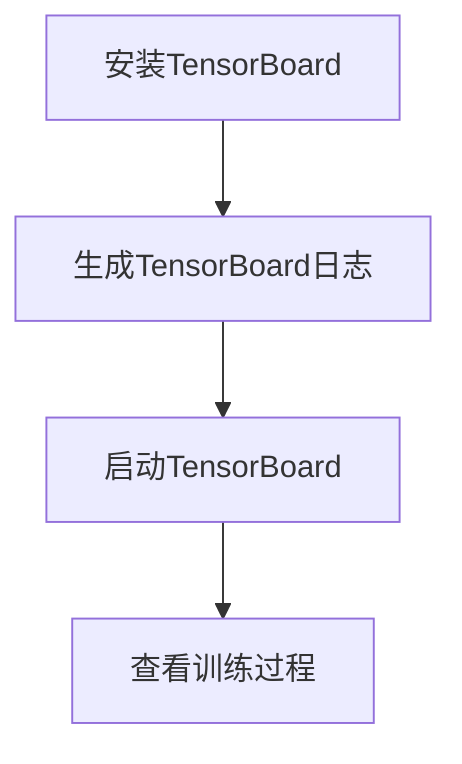
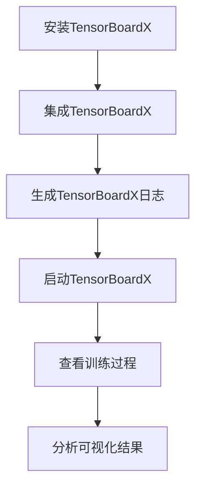

                 

关键词：大模型开发，微调，可视化组件，TensorBoard，TensorBoardX，安装教程，实践应用，未来展望。

> 摘要：本文将详细介绍如何从零开始进行大模型开发与微调，重点探讨可视化组件TensorBoardX的使用与安装。通过本文的指导，您将了解TensorBoardX的基本概念、功能特点、安装步骤以及在模型开发中的实际应用，为您的深度学习项目提供有力支持。

## 1. 背景介绍

随着深度学习技术的飞速发展，大模型（如BERT、GPT等）在自然语言处理、计算机视觉、语音识别等领域取得了显著的成果。然而，大模型的训练和微调过程通常复杂且耗时，需要大量的计算资源和专业的技术知识。为了更有效地监控和优化模型的训练过程，可视化工具应运而生。TensorBoard是TensorFlow提供的一款强大的可视化工具，能够实时显示模型的训练过程和性能指标。然而，TensorBoard在某些方面存在一定的局限性，如界面不够直观、功能不够丰富等。

为了解决这些问题，TensorBoardX应运而生。TensorBoardX是一个基于TensorBoard的扩展组件，它提供了更加丰富和直观的可视化功能，能够更好地满足大模型开发与微调的需求。本文将详细介绍TensorBoardX的基本概念、功能特点、安装步骤以及在模型开发中的实际应用。

## 2. 核心概念与联系

在介绍TensorBoardX之前，我们先来回顾一下TensorBoard的基础知识。TensorBoard是TensorFlow提供的一款强大的可视化工具，它可以帮助我们实时监控模型的训练过程，并提供丰富的可视化指标，如损失函数、准确率、学习曲线等。TensorBoard的基本使用方法如下：

1. **安装TensorBoard**：

   ```bash
   pip install tensorboard
   ```

2. **生成TensorBoard日志**：

   在训练代码中，我们需要添加以下代码来生成TensorBoard日志：

   ```python
   from tensorflow.keras.callbacks import TensorBoard
   
   tensorboard_callback = TensorBoard(log_dir='./logs', histogram_freq=1, write_graph=True, write_images=True)
   
   model.fit(x_train, y_train, epochs=10, callbacks=[tensorboard_callback])
   ```

3. **启动TensorBoard**：

   在命令行中，进入日志目录并运行以下命令：

   ```bash
   tensorboard --logdir=./logs
   ```

   然后在浏览器中输入TensorBoard提供的URL（通常是http://localhost:6006/），即可查看模型的训练过程。

### Mermaid流程图：



### TensorBoardX

TensorBoardX是基于TensorBoard的扩展组件，它提供了以下核心功能：

1. **更直观的界面**：TensorBoardX对TensorBoard的界面进行了优化，使得可视化结果更加直观和易于理解。
2. **丰富的可视化功能**：除了基本的损失函数、准确率、学习曲线等指标外，TensorBoardX还提供了诸如参数分布、梯度直方图、激活直方图等更加丰富的可视化功能。
3. **多图布局**：TensorBoardX支持自定义多图布局，可以同时显示多个可视化指标，使得模型分析更加全面。
4. **动态更新**：TensorBoardX支持动态更新，可以实时监控模型的训练过程，及时发现问题。

### Mermaid流程图：



通过上述流程图，我们可以看到TensorBoardX在模型开发过程中的重要作用。它不仅提供了更加丰富和直观的可视化功能，还可以帮助我们更好地理解和分析模型的训练过程，从而优化模型的性能。

## 3. 核心算法原理 & 具体操作步骤

### 3.1 算法原理概述

TensorBoardX的核心原理是扩展TensorBoard的功能，通过添加额外的可视化指标和自定义布局，使得模型分析更加全面和直观。具体来说，TensorBoardX主要实现了以下功能：

1. **参数分布**：显示模型参数的分布情况，可以帮助我们了解参数的取值范围和分布特性。
2. **梯度直方图**：显示模型参数的梯度分布情况，可以帮助我们分析梯度消失或梯度爆炸等问题。
3. **激活直方图**：显示模型激活值的分布情况，可以帮助我们分析神经网络的前向传播和后向传播过程。
4. **多图布局**：支持自定义多图布局，可以同时显示多个可视化指标，使得模型分析更加全面。
5. **动态更新**：支持动态更新，可以实时监控模型的训练过程，及时发现问题。

### 3.2 算法步骤详解

1. **安装TensorBoardX**：

   ```bash
   pip install tensorboardX
   ```

2. **集成TensorBoardX**：

   在训练代码中，我们需要从`tensorboardX`导入`SummaryWriter`类，并创建一个实例，用于生成TensorBoardX日志：

   ```python
   from tensorboardX import SummaryWriter
   
   writer = SummaryWriter(log_dir='./logs')
   ```

3. **生成TensorBoardX日志**：

   在训练过程中，我们需要定期调用`writer.add_summary()`方法来生成TensorBoardX日志。具体步骤如下：

   - 计算可视化指标，如参数分布、梯度直方图、激活直方图等。
   - 将可视化指标转换为TensorBoardX可识别的格式，通常使用`tf.Summary`类。
   - 调用`writer.add_summary()`方法，将日志写入文件。

   ```python
   # 示例：生成参数分布日志
   with writer.as_default():
       # 计算参数分布
       param_values = model.trainable_variables
       param_distributions = [tf.distributions.Normal(loc=tf.reduce_mean(v, axis=[0, -1, -2]), scale=tf.math.reduce_std(v)) for v in param_values]
       # 创建Summary对象
       summaries = [tf.Summary(value=[tf.Summary.Value(tag=f'param_distribution/{name}', dtype=tf.float32, data=tf.reshape(d.prob(), [d.shape.num_elements()])) for name, d in zip(model.trainable_variables.names, param_distributions)])]
       # 写入日志
       writer.add_summary(summaries[-1], global_step=epoch)
   ```

4. **启动TensorBoardX**：

   与TensorBoard类似，我们需要在命令行中启动TensorBoardX：

   ```bash
   tensorboard --logdir=./logs
   ```

   然后在浏览器中输入TensorBoardX提供的URL，即可查看模型的训练过程。

### 3.3 算法优缺点

**优点**：

- **可视化功能丰富**：TensorBoardX提供了丰富的可视化功能，包括参数分布、梯度直方图、激活直方图等，能够帮助我们更好地理解模型的训练过程。
- **界面直观**：TensorBoardX优化了界面设计，使得可视化结果更加直观和易于理解。
- **动态更新**：支持动态更新，可以实时监控模型的训练过程，及时发现问题。
- **易于集成**：TensorBoardX与TensorFlow深度集成，能够方便地在训练代码中调用。

**缺点**：

- **性能消耗**：生成TensorBoardX日志需要额外的计算资源，可能会对训练速度产生影响。
- **安装与配置**：需要额外安装TensorBoardX，并配置日志目录，相对于原始TensorBoard来说，使用步骤稍微繁琐。

### 3.4 算法应用领域

TensorBoardX主要应用于深度学习模型的训练和微调过程中，特别是在大模型开发中，它能够帮助我们更好地监控和优化模型的训练过程，提高模型的性能。具体应用领域包括：

- **自然语言处理**：在自然语言处理任务中，TensorBoardX可以帮助我们分析模型参数的分布情况，优化模型的性能。
- **计算机视觉**：在计算机视觉任务中，TensorBoardX可以用于分析模型梯度、激活直方图等，帮助我们理解模型的工作原理。
- **语音识别**：在语音识别任务中，TensorBoardX可以用于分析模型参数的分布情况，优化模型的性能。

## 4. 数学模型和公式 & 详细讲解 & 举例说明

在深度学习模型中，参数分布、梯度直方图、激活直方图等可视化指标是关键分析工具。以下将详细讲解这些数学模型和公式的构建、推导过程，并通过具体案例进行说明。

### 4.1 数学模型构建

#### 参数分布

参数分布是描述模型参数取值概率的数学模型。在深度学习中，模型参数通常服从高斯分布，其概率密度函数为：

$$
f(\theta; \mu, \sigma^2) = \frac{1}{\sqrt{2\pi\sigma^2}} \exp \left( -\frac{1}{2} \left( \frac{\theta - \mu}{\sigma} \right)^2 \right)
$$

其中，$\theta$为模型参数，$\mu$为均值，$\sigma^2$为方差。

#### 梯度直方图

梯度直方图是描述模型参数梯度的分布情况的数学模型。在深度学习中，梯度是模型参数相对于损失函数的偏导数，其概率密度函数为：

$$
g(x; \mu, \sigma^2) = \frac{1}{\sqrt{2\pi\sigma^2}} \exp \left( -\frac{1}{2} \left( \frac{x - \mu}{\sigma} \right)^2 \right)
$$

其中，$x$为梯度值，$\mu$为均值，$\sigma^2$为方差。

#### 激活直方图

激活直方图是描述模型激活值的分布情况的数学模型。在深度学习中，激活值是神经网络层输出的结果，其概率密度函数为：

$$
h(y; \mu, \sigma^2) = \frac{1}{\sqrt{2\pi\sigma^2}} \exp \left( -\frac{1}{2} \left( \frac{y - \mu}{\sigma} \right)^2 \right)
$$

其中，$y$为激活值，$\mu$为均值，$\sigma^2$为方差。

### 4.2 公式推导过程

#### 参数分布

假设模型参数$\theta$服从高斯分布，其概率密度函数为：

$$
f(\theta; \mu, \sigma^2) = \frac{1}{\sqrt{2\pi\sigma^2}} \exp \left( -\frac{1}{2} \left( \frac{\theta - \mu}{\sigma} \right)^2 \right)
$$

为了计算参数分布的累积分布函数（CDF），我们需要对概率密度函数进行积分：

$$
F(\theta; \mu, \sigma^2) = \int_{-\infty}^{\theta} f(\theta'; \mu, \sigma^2) d\theta'
$$

代入概率密度函数的表达式，我们得到：

$$
F(\theta; \mu, \sigma^2) = \int_{-\infty}^{\theta} \frac{1}{\sqrt{2\pi\sigma^2}} \exp \left( -\frac{1}{2} \left( \frac{\theta' - \mu}{\sigma} \right)^2 \right) d\theta'
$$

通过对指数函数进行换元，令$u = \frac{\theta' - \mu}{\sigma}$，则$d\theta' = \sigma du$。代入积分式，我们得到：

$$
F(\theta; \mu, \sigma^2) = \int_{-\infty}^{\frac{\theta - \mu}{\sigma}} \frac{1}{\sqrt{2\pi}} \exp \left( -\frac{1}{2} u^2 \right) \sigma du
$$

这是一个标准正态分布的累积分布函数，记为$\Phi(u)$。因此，我们得到参数分布的累积分布函数：

$$
F(\theta; \mu, \sigma^2) = \Phi \left( \frac{\theta - \mu}{\sigma} \right)
$$

#### 梯度直方图

假设梯度值$x$服从高斯分布，其概率密度函数为：

$$
g(x; \mu, \sigma^2) = \frac{1}{\sqrt{2\pi\sigma^2}} \exp \left( -\frac{1}{2} \left( \frac{x - \mu}{\sigma} \right)^2 \right)
$$

为了计算梯度直方图，我们需要对概率密度函数进行积分。假设我们选择$x$的区间为$[a, b]$，则梯度直方图的概率为：

$$
P(a \leq x \leq b) = \int_{a}^{b} g(x; \mu, \sigma^2) dx
$$

代入概率密度函数的表达式，我们得到：

$$
P(a \leq x \leq b) = \int_{a}^{b} \frac{1}{\sqrt{2\pi\sigma^2}} \exp \left( -\frac{1}{2} \left( \frac{x - \mu}{\sigma} \right)^2 \right) dx
$$

通过对指数函数进行换元，令$u = \frac{x - \mu}{\sigma}$，则$dx = \sigma du$。代入积分式，我们得到：

$$
P(a \leq x \leq b) = \int_{\frac{a - \mu}{\sigma}}^{\frac{b - \mu}{\sigma}} \frac{1}{\sqrt{2\pi}} \exp \left( -\frac{1}{2} u^2 \right) \sigma du
$$

这是一个标准正态分布的累积分布函数，记为$\Phi(u)$。因此，我们得到梯度直方图的概率：

$$
P(a \leq x \leq b) = \Phi \left( \frac{b - \mu}{\sigma} \right) - \Phi \left( \frac{a - \mu}{\sigma} \right)
$$

#### 激活直方图

假设激活值$y$服从高斯分布，其概率密度函数为：

$$
h(y; \mu, \sigma^2) = \frac{1}{\sqrt{2\pi\sigma^2}} \exp \left( -\frac{1}{2} \left( \frac{y - \mu}{\sigma} \right)^2 \right)
$$

为了计算激活直方图，我们需要对概率密度函数进行积分。假设我们选择$y$的区间为$[c, d]$，则激活直方图的概率为：

$$
P(c \leq y \leq d) = \int_{c}^{d} h(y; \mu, \sigma^2) dy
$$

代入概率密度函数的表达式，我们得到：

$$
P(c \leq y \leq d) = \int_{c}^{d} \frac{1}{\sqrt{2\pi\sigma^2}} \exp \left( -\frac{1}{2} \left( \frac{y - \mu}{\sigma} \right)^2 \right) dy
$$

通过对指数函数进行换元，令$v = \frac{y - \mu}{\sigma}$，则$dy = \sigma dv$。代入积分式，我们得到：

$$
P(c \leq y \leq d) = \int_{\frac{c - \mu}{\sigma}}^{\frac{d - \mu}{\sigma}} \frac{1}{\sqrt{2\pi}} \exp \left( -\frac{1}{2} v^2 \right) \sigma dv
$$

这是一个标准正态分布的累积分布函数，记为$\Phi(v)$。因此，我们得到激活直方图的概率：

$$
P(c \leq y \leq d) = \Phi \left( \frac{d - \mu}{\sigma} \right) - \Phi \left( \frac{c - \mu}{\sigma} \right)
$$

### 4.3 案例分析与讲解

以下我们将通过一个具体案例来展示如何使用TensorBoardX进行参数分布、梯度直方图、激活直方图的可视化分析。

#### 案例背景

假设我们有一个深度神经网络模型，用于对图片进行分类。模型包含一个卷积层和一个全连接层，其中卷积层的参数为10个，全连接层的参数为100个。

#### 数据准备

我们首先需要准备训练数据和测试数据，以供模型训练和测试使用。以下是训练数据和测试数据的数据集：

```python
import tensorflow as tf

# 准备训练数据
(x_train, y_train), (x_test, y_test) = tf.keras.datasets.cifar10.load_data()

# 数据预处理
x_train = x_train / 255.0
x_test = x_test / 255.0

# 转换为张量
x_train = tf.convert_to_tensor(x_train, dtype=tf.float32)
x_test = tf.convert_to_tensor(x_test, dtype=tf.float32)

# 转换为批量数据
x_train = x_train.reshape(-1, 32, 32, 3)
x_test = x_test.reshape(-1, 32, 32, 3)

# 获取标签
y_train = tf.argmax(y_train, axis=1)
y_test = tf.argmax(y_test, axis=1)
```

#### 模型定义

接下来，我们定义一个简单的深度神经网络模型，用于对图片进行分类。模型包含一个卷积层和一个全连接层。

```python
model = tf.keras.Sequential([
    tf.keras.layers.Conv2D(32, (3, 3), activation='relu', input_shape=(32, 32, 3)),
    tf.keras.layers.MaxPooling2D(pool_size=(2, 2)),
    tf.keras.layers.Flatten(),
    tf.keras.layers.Dense(100, activation='softmax')
])

model.compile(optimizer='adam', loss='sparse_categorical_crossentropy', metrics=['accuracy'])
```

#### 模型训练

我们使用训练数据进行模型训练，并使用TensorBoardX进行参数分布、梯度直方图、激活直方图的可视化分析。

```python
from tensorflow.keras.callbacks import TensorBoard
from tensorboardX import SummaryWriter

# 创建TensorBoardX日志写入器
writer = SummaryWriter(log_dir='./logs')

# 模型训练
model.fit(x_train, y_train, epochs=10, callbacks=[TensorBoard(log_dir='./logs')])

# 关闭TensorBoardX日志写入器
writer.close()
```

#### 可视化分析

在训练完成后，我们可以在TensorBoardX中查看参数分布、梯度直方图、激活直方图的可视化结果。

- **参数分布**：

  ```bash
  tensorboard --logdir=./logs
  ```

  在浏览器中输入TensorBoard提供的URL，如`http://localhost:6006/`，我们可以看到参数分布的可视化结果。在`Summary`标签下，点击`param_distributions`选项，可以看到每个参数的分布情况。

- **梯度直方图**：

  在`Histograms`标签下，点击`gradients`选项，可以看到模型参数的梯度直方图。通过分析梯度直方图，我们可以了解模型参数的梯度分布情况，从而优化模型的训练过程。

- **激活直方图**：

  在`Histograms`标签下，点击`activations`选项，可以看到模型激活直方图。通过分析激活直

