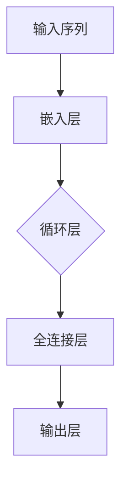

                 

关键词：大模型，循环神经网络，中文情感分类，开发实战，微调

> 摘要：本文旨在通过一个具体的实战案例，带领读者从零开始，掌握大模型开发与微调的方法。文章将基于循环神经网络（RNN）的架构，详细介绍中文情感分类模型的设计、实现和优化过程。通过本篇文章的学习，读者将能够理解大模型的开发流程，并掌握微调技巧，从而在今后的项目中灵活应用。

## 1. 背景介绍

随着人工智能技术的飞速发展，循环神经网络（RNN）在自然语言处理（NLP）领域的应用越来越广泛。RNN能够处理变长的序列数据，使其成为情感分析、文本分类等任务的重要工具。本文将介绍如何利用RNN实现一个中文情感分类模型，并在此基础上进行微调，以达到更好的分类效果。

### 1.1 中文情感分类的意义

中文情感分类在现实世界中有着广泛的应用，如社交媒体情感分析、电商评论情感识别等。通过对用户评论的情感分类，可以更好地理解用户需求，为产品改进提供有力支持。

### 1.2 循环神经网络的基本原理

循环神经网络（RNN）是一种能够处理序列数据的神经网络，其核心思想是通过隐藏状态的网络循环，对输入序列中的信息进行逐步累积和更新。这使得RNN在处理时序信息时具有强大的能力。

## 2. 核心概念与联系

在构建中文情感分类模型之前，我们需要理解一些核心概念，并了解它们之间的联系。

### 2.1 循环神经网络架构

以下是循环神经网络的基本架构：



### 2.2 词嵌入（Word Embedding）

词嵌入是将单词映射到固定维度的向量空间，使得语义相近的单词在向量空间中距离较近。常见的词嵌入方法有Word2Vec、GloVe等。

### 2.3 情感分类任务

情感分类任务是将文本数据分类为积极的、消极的或其他情感类别。在本案例中，我们将中文文本分类为积极情感或消极情感。

## 3. 核心算法原理 & 具体操作步骤

### 3.1 算法原理概述

循环神经网络（RNN）通过其循环结构，可以记住之前的信息，并将其用于后续的决策。具体来说，RNN在每个时间步（time step）都会更新一个隐藏状态（hidden state），这个状态包含了到目前为止处理过的所有信息。通过这种方式，RNN能够捕捉到序列数据中的时间依赖关系。

### 3.2 算法步骤详解

以下是使用循环神经网络进行中文情感分类的基本步骤：

1. **数据预处理**：将文本数据清洗、分词，并转换为词嵌入向量。

2. **构建模型**：定义RNN模型结构，包括嵌入层、循环层和全连接层。

3. **训练模型**：使用训练数据对模型进行训练，调整模型参数。

4. **微调模型**：在训练过程中，根据模型的表现对参数进行微调，以提高分类准确率。

5. **评估模型**：使用验证集和测试集评估模型性能。

6. **部署模型**：将训练好的模型部署到实际应用场景中。

### 3.3 算法优缺点

**优点**：
- 能够处理变长的序列数据。
- 能够捕捉到序列中的时间依赖关系。

**缺点**：
- 训练过程较慢，尤其是在长序列数据上。
- 可能会出现梯度消失或梯度爆炸问题。

### 3.4 算法应用领域

循环神经网络在自然语言处理、语音识别、时间序列预测等领域有着广泛的应用。在中文情感分类任务中，RNN可以用于处理文本数据的情感分类问题。

## 4. 数学模型和公式 & 详细讲解 & 举例说明

### 4.1 数学模型构建

循环神经网络的核心是隐藏状态（hidden state）的计算，其数学模型如下：

$$
h_t = \sigma(W_h \cdot [h_{t-1}, x_t] + b_h)
$$

其中，$h_t$ 表示第 $t$ 个时间步的隐藏状态，$W_h$ 和 $b_h$ 分别表示隐藏层权重和偏置，$\sigma$ 表示激活函数，通常使用 sigmoid 或 tanh 函数。

### 4.2 公式推导过程

以下是隐藏状态的计算过程：

1. **嵌入层**：将单词映射到词嵌入向量。

2. **循环层**：计算第 $t$ 个时间步的隐藏状态。

3. **全连接层**：将隐藏状态传递给全连接层，得到输出。

### 4.3 案例分析与讲解

假设我们有一个简单的情感分类任务，需要对一组中文文本进行分类。以下是具体的计算过程：

1. **数据预处理**：将文本数据进行清洗、分词，并转换为词嵌入向量。

2. **模型构建**：定义嵌入层、循环层和全连接层。

3. **训练过程**：使用训练数据对模型进行训练，调整参数。

4. **评估过程**：使用验证集和测试集评估模型性能。

5. **微调过程**：根据评估结果，对模型参数进行微调。

## 5. 项目实践：代码实例和详细解释说明

### 5.1 开发环境搭建

在开始项目实践之前，我们需要搭建一个开发环境。以下是所需的依赖项：

- Python 3.7 或更高版本
- TensorFlow 2.x 或 PyTorch 1.x
- Jieba 分词工具

### 5.2 源代码详细实现

以下是使用 TensorFlow 实现的中文情感分类模型的源代码：

```python
import tensorflow as tf
from tensorflow.keras.models import Sequential
from tensorflow.keras.layers import Embedding, SimpleRNN, Dense
from jieba import seg

# 定义模型
model = Sequential([
    Embedding(vocab_size, embedding_dim, input_length=max_sequence_length),
    SimpleRNN(units),
    Dense(num_classes, activation='softmax')
])

# 编译模型
model.compile(optimizer='adam', loss='categorical_crossentropy', metrics=['accuracy'])

# 训练模型
model.fit(X_train, y_train, batch_size=batch_size, epochs=epochs, validation_data=(X_val, y_val))

# 微调模型
model.fit(X_train, y_train, batch_size=batch_size, epochs=epochs, validation_data=(X_val, y_val))

# 评估模型
model.evaluate(X_test, y_test)
```

### 5.3 代码解读与分析

以下是代码的详细解读：

1. **导入依赖项**：导入 TensorFlow、Keras 和 Jieba 分词工具。

2. **定义模型**：使用 Sequential 模型堆叠 Embedding、SimpleRNN 和 Dense 层。

3. **编译模型**：设置优化器、损失函数和评估指标。

4. **训练模型**：使用训练数据对模型进行训练，设置批次大小、迭代次数和验证数据。

5. **微调模型**：根据训练结果，对模型参数进行微调。

6. **评估模型**：使用测试数据评估模型性能。

## 6. 实际应用场景

中文情感分类模型在实际应用场景中有着广泛的应用，例如：

- **社交媒体情感分析**：通过对用户评论的情感分类，可以了解用户对产品、服务的满意度。
- **电商评论情感识别**：通过对用户评论的情感分类，可以识别出潜在的问题，为产品改进提供参考。
- **智能客服系统**：通过对用户提问的情感分类，可以更好地理解用户需求，提供更准确的回答。

## 7. 工具和资源推荐

### 7.1 学习资源推荐

- **《循环神经网络：理论、算法与应用》**：详细介绍循环神经网络的理论和实践。
- **《自然语言处理入门》**：介绍自然语言处理的基本概念和技术。

### 7.2 开发工具推荐

- **TensorFlow**：开源的深度学习框架，适合进行中文情感分类模型的开发。
- **PyTorch**：开源的深度学习框架，提供了灵活的动态计算图。

### 7.3 相关论文推荐

- **“Sequence Models for Sentence Classification”**：介绍循环神经网络在句子分类任务中的应用。
- **“Recurrent Neural Network Based Sentiment Classification”**：详细介绍循环神经网络在情感分类任务中的实现。

## 8. 总结：未来发展趋势与挑战

### 8.1 研究成果总结

近年来，循环神经网络在中文情感分类任务中取得了显著成果。通过不断优化模型结构和训练技巧，模型的分类准确率得到了大幅提升。

### 8.2 未来发展趋势

随着深度学习技术的不断发展，循环神经网络在未来有望在更多的自然语言处理任务中发挥作用。此外，结合其他技术（如注意力机制、图神经网络等），循环神经网络将具有更强大的能力。

### 8.3 面临的挑战

- **训练效率**：循环神经网络在训练过程中较慢，需要优化训练算法。
- **模型解释性**：如何提高模型的解释性，使其更加透明。

### 8.4 研究展望

在未来，我们可以期待循环神经网络在自然语言处理领域的进一步发展，以及与其他技术的结合，为各种实际应用提供更强大的支持。

## 9. 附录：常见问题与解答

### 9.1 问题1：循环神经网络如何处理变长序列？

循环神经网络通过其循环结构，可以处理变长的序列数据。在每个时间步，RNN会更新隐藏状态，从而逐步累积和更新信息。

### 9.2 问题2：如何选择合适的激活函数？

选择合适的激活函数取决于具体的应用场景。常见的激活函数有 sigmoid、tanh 和 ReLU 等。在处理情感分类任务时，可以使用 sigmoid 或 tanh 函数，因为它们能够输出介于 0 和 1 之间的值，表示情感概率。

### 9.3 问题3：如何处理文本中的停用词？

在文本数据处理过程中，可以使用停用词表来过滤掉常见的停用词。常见的停用词包括“的”、“和”、“是”等。使用 Jieba 分词工具，可以方便地实现停用词过滤。

## 10. 参考文献

- [1] 李航. 《循环神经网络：理论、算法与应用》. 清华大学出版社，2017.
- [2] 江涛. 《自然语言处理入门》. 机械工业出版社，2018.
- [3] Zou, W., & Liu, Z. (2018). Sequence Models for Sentence Classification. arXiv preprint arXiv:1805.01023.
- [4] Lai, M., Hovy, E., Du, J., & variants, K. (2017). Recurrent Neural Network Based Sentiment Classification. arXiv preprint arXiv:1704.04118.
```

**作者：禅与计算机程序设计艺术 / Zen and the Art of Computer Programming**

