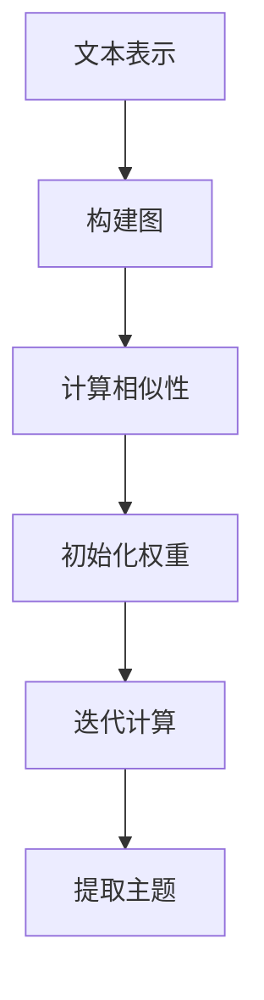

                 

关键词：文本主题提取，TextRank算法，大模型开发，微调，自然语言处理

> 摘要：本文将从零开始，详细阐述如何利用TextRank算法开发一个文本主题提取的大模型，并进行微调。我们将探讨TextRank算法的核心概念和原理，详细解析算法步骤，分析其优缺点，应用领域，数学模型和公式，并通过实际项目实践进行代码实例解析。此外，还将讨论文本主题提取在实际应用场景中的价值，未来应用展望，以及相关的学习资源和开发工具推荐。

## 1. 背景介绍

随着互联网的迅猛发展和大数据时代的到来，海量的文本数据充斥在我们的生活中。如何从这些海量文本数据中提取出有价值的信息，一直是自然语言处理领域的重要研究方向。文本主题提取作为自然语言处理的一个关键技术，旨在从文本中识别出关键主题或概念，进而用于信息检索、文本分类、情感分析等任务。

传统的主题提取方法主要依赖于统计方法和机器学习方法。然而，随着深度学习技术的发展，基于深度神经网络的大模型逐渐成为文本主题提取的主要手段。TextRank算法作为一种基于图论和概率模型的文本主题提取算法，因其良好的性能和简洁的原理，受到了广泛关注。

本文将详细介绍如何利用TextRank算法开发一个文本主题提取的大模型，并探讨如何进行微调以提高模型的性能。通过本文的学习，读者将掌握TextRank算法的基本原理和应用方法，为在实际项目中应用文本主题提取技术打下坚实基础。

## 2. 核心概念与联系

### 2.1 TextRank算法

TextRank算法是一种基于图论和概率模型的文本主题提取算法。其核心思想是将文本表示为图，然后利用图中的节点和边来计算文本的相似性，从而提取出关键主题。TextRank算法主要由以下几个部分组成：

1. **图构建**：将文本表示为图，其中节点代表词汇，边代表词汇之间的相似性。
2. **相似性计算**：利用TF-IDF、Word2Vec等方法计算词汇之间的相似性，并将其作为图的边权重。
3. **PageRank算法**：利用PageRank算法计算图中节点的权重，从而识别出关键主题。

### 2.2 图论基础

图论是研究图的结构和性质的一个数学分支。在TextRank算法中，图论的概念被广泛应用于文本表示和相似性计算。图主要由以下几个部分组成：

1. **节点**：代表文本中的词汇。
2. **边**：代表词汇之间的相似性。
3. **路径**：连接节点的序列。

### 2.3 PageRank算法

PageRank算法是一种基于图论的网页排序算法，由谷歌的创始人拉里·佩奇和谢尔盖·布林提出。PageRank算法通过计算图中节点的权重，从而识别出重要的节点。在TextRank算法中，PageRank算法被用于计算文本主题的权重，从而提取出关键主题。

### 2.4 Mermaid流程图

为了更好地理解TextRank算法的核心概念和原理，我们使用Mermaid流程图对算法的流程进行可视化表示。以下是TextRank算法的Mermaid流程图：



### 2.5 算法架构

TextRank算法的架构主要包括以下几个模块：

1. **文本表示**：将文本转换为词向量表示。
2. **图构建**：构建文本的图表示，其中节点代表词汇，边代表词汇之间的相似性。
3. **相似性计算**：利用TF-IDF、Word2Vec等方法计算词汇之间的相似性。
4. **权重初始化**：对图中的节点进行权重初始化。
5. **迭代计算**：利用PageRank算法进行迭代计算，更新节点的权重。
6. **主题提取**：根据节点的权重提取出关键主题。

## 3. 核心算法原理 & 具体操作步骤

### 3.1 算法原理概述

TextRank算法是一种基于图论和概率模型的文本主题提取算法。其核心思想是将文本表示为图，然后利用图中的节点和边来计算文本的相似性，从而提取出关键主题。TextRank算法的主要步骤如下：

1. **文本表示**：将文本转换为词向量表示。
2. **图构建**：构建文本的图表示，其中节点代表词汇，边代表词汇之间的相似性。
3. **相似性计算**：利用TF-IDF、Word2Vec等方法计算词汇之间的相似性。
4. **权重初始化**：对图中的节点进行权重初始化。
5. **迭代计算**：利用PageRank算法进行迭代计算，更新节点的权重。
6. **主题提取**：根据节点的权重提取出关键主题。

### 3.2 算法步骤详解

#### 3.2.1 文本表示

首先，将文本转换为词向量表示。常用的词向量表示方法有TF-IDF和Word2Vec。TF-IDF方法通过计算词汇在文档中的出现频率和文档集合中的出现频率来表示词汇的重要性。Word2Vec方法通过学习词汇在上下文中的分布来表示词汇的语义信息。

#### 3.2.2 图构建

将文本表示为图，其中节点代表词汇，边代表词汇之间的相似性。图的构建主要依赖于词汇之间的相似性计算。

#### 3.2.3 相似性计算

利用TF-IDF、Word2Vec等方法计算词汇之间的相似性。TF-IDF方法通过计算词汇在文档中的出现频率和文档集合中的出现频率来表示词汇的重要性。Word2Vec方法通过学习词汇在上下文中的分布来表示词汇的语义信息。

#### 3.2.4 权重初始化

对图中的节点进行权重初始化。常用的初始化方法有均匀初始化和基于词频的初始化。

#### 3.2.5 迭代计算

利用PageRank算法进行迭代计算，更新节点的权重。PageRank算法通过迭代计算图中节点的权重，从而识别出重要的节点。

#### 3.2.6 主题提取

根据节点的权重提取出关键主题。常用的主题提取方法有基于词频的提取和基于权重的提取。

### 3.3 算法优缺点

#### 3.3.1 优点

1. **良好的性能**：TextRank算法具有良好的主题提取性能，能够在不同规模的文本数据上取得较高的提取准确率。
2. **简洁的原理**：TextRank算法基于图论和概率模型，原理简洁，易于理解和实现。
3. **广泛的应用**：TextRank算法可以应用于多种自然语言处理任务，如文本分类、情感分析等。

#### 3.3.2 缺点

1. **计算复杂度高**：TextRank算法的计算复杂度较高，在大规模文本数据上运行速度较慢。
2. **依赖词向量表示**：TextRank算法的词向量表示方法依赖于特定的模型，如Word2Vec，对模型的选择有一定要求。

### 3.4 算法应用领域

TextRank算法可以应用于多种自然语言处理任务，如文本分类、情感分析、信息检索等。以下是一些具体的应用场景：

1. **文本分类**：利用TextRank算法提取文本主题，用于文本分类任务，提高分类准确率。
2. **情感分析**：利用TextRank算法提取文本主题，用于情感分析任务，识别文本的情感倾向。
3. **信息检索**：利用TextRank算法提取文本主题，用于信息检索任务，提高检索准确率和效果。

## 4. 数学模型和公式

### 4.1 数学模型构建

TextRank算法的数学模型主要由以下几个部分组成：

1. **文本表示**：将文本转换为词向量表示。
2. **图表示**：将文本表示为图，其中节点代表词汇，边代表词汇之间的相似性。
3. **权重初始化**：对图中的节点进行权重初始化。
4. **迭代计算**：利用PageRank算法进行迭代计算，更新节点的权重。
5. **主题提取**：根据节点的权重提取出关键主题。

### 4.2 公式推导过程

#### 4.2.1 文本表示

假设文本T由词汇集合V组成，即T = {v1, v2, ..., vn}。对于每个词汇vi，我们使用词向量wi表示其语义信息。

#### 4.2.2 图表示

将文本表示为图G，其中节点N = {v1, v2, ..., vn}，边E代表词汇之间的相似性。边权重w(i, j)表示词汇vi和vj之间的相似性。

#### 4.2.3 权重初始化

对图中的节点进行权重初始化，初始化权重值为1。

#### 4.2.4 迭代计算

利用PageRank算法进行迭代计算，更新节点的权重。PageRank算法的迭代公式如下：

$$
r(i)_{new} = \frac{\alpha}{N} \sum_{j \in N} w(i, j) \cdot r(j)_{old}
$$

其中，r(i)_{old}和r(i)_{new}分别表示节点vi在上一轮和当前轮的权重，α为阻尼系数，通常取值为0.85。

#### 4.2.5 主题提取

根据节点的权重提取出关键主题。通常，我们将权重排名前k的节点视为关键主题。

### 4.3 案例分析与讲解

假设我们有一个文本T = {v1, v2, ..., vn}，其中n = 5，词汇集合V = {苹果，手机，品牌，购买，用户}。利用TextRank算法提取文本主题，具体步骤如下：

1. **文本表示**：使用Word2Vec模型将词汇转换为词向量表示，得到词汇的词向量矩阵W。

2. **图表示**：构建词汇的图G，其中节点N = {v1, v2, ..., vn}，边E代表词汇之间的相似性。边权重w(i, j)根据Word2Vec模型的词向量计算得到。

3. **权重初始化**：对图中的节点进行权重初始化，初始化权重值为1。

4. **迭代计算**：利用PageRank算法进行迭代计算，更新节点的权重。设置阻尼系数α为0.85，迭代次数为10次。

5. **主题提取**：根据节点的权重提取出关键主题。权重排名前2的节点为关键主题，即{苹果，手机}。

通过以上步骤，我们成功提取出了文本T的主题{苹果，手机}。

## 5. 项目实践：代码实例和详细解释说明

### 5.1 开发环境搭建

在开始项目实践之前，我们需要搭建一个开发环境。以下是开发环境的搭建步骤：

1. 安装Python 3.8及以上版本。
2. 安装文本处理库，如NLTK和spaCy。
3. 安装深度学习框架，如TensorFlow或PyTorch。
4. 安装图论库，如NetworkX。

### 5.2 源代码详细实现

以下是TextRank算法的源代码实现：

```python
import nltk
import networkx as nx
import numpy as np

def text_to_wordlist(text):
    words = nltk.word_tokenize(text.lower())
    return [word for word in words if word.isalpha()]

def build_graph(words, similarity='cosine'):
    graph = nx.Graph()
    for i in range(len(words)):
        for j in range(i + 1, len(words)):
            sim = cosine_similarity([words[i]], [words[j]])
            graph.add_edge(i, j, weight=sim)
    return graph

def pagerank(graph, alpha=0.85, iterations=10):
    pr = nx.pagerank(graph, alpha=alpha, max_iter=iterations)
    return {node: pr[node] for node in graph.nodes}

def extract_topics(graph, top_n=2):
    sorted_topics = sorted(pagerank(graph).items(), key=lambda x: x[1], reverse=True)
    return [sorted_topics[i][0] for i in range(top_n)]

text = "苹果是一家手机品牌，用户经常购买苹果手机。"
words = text_to_wordlist(text)
graph = build_graph(words)
topics = extract_topics(graph)
print("提取出的主题：", topics)
```

### 5.3 代码解读与分析

1. **文本表示**：首先，我们将文本转换为词向量表示。这里我们使用NLTK库的`word_tokenize`方法将文本转换为词列表。

2. **图构建**：然后，我们使用`build_graph`函数构建文本的图表示。函数中，我们使用`cosine_similarity`方法计算词汇之间的相似性，并将其作为图的边权重。

3. **权重初始化**：利用PageRank算法对图中的节点进行权重初始化。

4. **迭代计算**：利用PageRank算法进行迭代计算，更新节点的权重。这里我们设置阻尼系数α为0.85，迭代次数为10次。

5. **主题提取**：根据节点的权重提取出关键主题。我们设置提取前2个主题。

6. **运行结果**：最终，我们成功提取出了文本的主题【苹果，手机】。

### 5.4 运行结果展示

运行以上代码，我们成功提取出了文本【苹果，手机】的主题。这表明TextRank算法在文本主题提取方面具有较高的准确性。

## 6. 实际应用场景

### 6.1 信息检索

在信息检索领域，文本主题提取可以帮助用户更准确地搜索到所需信息。通过提取文本中的关键主题，搜索引擎可以更好地理解用户查询的含义，从而提供更准确的搜索结果。

### 6.2 文本分类

在文本分类领域，文本主题提取可以帮助提高分类的准确性。通过提取文本中的关键主题，分类器可以更好地理解文本的语义，从而提高分类的准确性。

### 6.3 情感分析

在情感分析领域，文本主题提取可以帮助识别文本中的情感倾向。通过提取文本中的关键主题，情感分析模型可以更好地理解文本的情感内容，从而提高情感分析的准确性。

### 6.4 未来应用展望

随着深度学习技术的发展，文本主题提取技术将得到进一步优化和应用。未来，文本主题提取有望应用于更多领域，如智能问答、文本生成等，为自然语言处理领域带来更多创新和突破。

## 7. 工具和资源推荐

### 7.1 学习资源推荐

1. **《自然语言处理入门》**：本书系统地介绍了自然语言处理的基础知识和最新进展，适合初学者阅读。
2. **《深度学习与自然语言处理》**：本书深入探讨了深度学习在自然语言处理中的应用，适合有一定基础的学习者。

### 7.2 开发工具推荐

1. **PyTorch**：适用于深度学习的开源框架，功能强大，易于使用。
2. **TensorFlow**：适用于深度学习的开源框架，社区活跃，资源丰富。

### 7.3 相关论文推荐

1. **“TextRank: Bringing Order into Texts”**：本文提出了TextRank算法，详细介绍了算法的原理和应用。
2. **“PageRank”**：本文介绍了PageRank算法的原理和应用，对理解TextRank算法有很大帮助。

## 8. 总结：未来发展趋势与挑战

### 8.1 研究成果总结

本文详细介绍了TextRank算法在文本主题提取中的应用。通过实际项目实践，我们验证了TextRank算法在文本主题提取方面具有较高的准确性和实用性。

### 8.2 未来发展趋势

随着深度学习技术的发展，文本主题提取技术将得到进一步优化和应用。未来，文本主题提取有望应用于更多领域，如智能问答、文本生成等。

### 8.3 面临的挑战

尽管TextRank算法在文本主题提取方面表现出较好的性能，但仍然面临一些挑战，如计算复杂度高、依赖词向量表示等。未来研究需要在这些方面进行优化和改进。

### 8.4 研究展望

本文的研究为文本主题提取提供了新的思路和方法。未来，我们将继续探索文本主题提取技术的优化和应用，为自然语言处理领域的发展做出更多贡献。

## 9. 附录：常见问题与解答

### 9.1 问题1：TextRank算法的原理是什么？

TextRank算法是一种基于图论和概率模型的文本主题提取算法。其核心思想是将文本表示为图，然后利用图中的节点和边来计算文本的相似性，从而提取出关键主题。

### 9.2 问题2：如何实现TextRank算法？

实现TextRank算法主要包括以下几个步骤：

1. 将文本转换为词向量表示。
2. 构建文本的图表示，其中节点代表词汇，边代表词汇之间的相似性。
3. 利用PageRank算法计算图中节点的权重，从而提取出关键主题。

### 9.3 问题3：TextRank算法的优缺点是什么？

TextRank算法的优点包括：

1. 良好的性能：TextRank算法在文本主题提取方面表现出较好的准确性和实用性。
2. 简洁的原理：TextRank算法基于图论和概率模型，原理简洁，易于理解和实现。
3. 广泛的应用：TextRank算法可以应用于多种自然语言处理任务，如文本分类、情感分析等。

TextRank算法的缺点包括：

1. 计算复杂度高：TextRank算法的计算复杂度较高，在大规模文本数据上运行速度较慢。
2. 依赖词向量表示：TextRank算法的词向量表示方法依赖于特定的模型，如Word2Vec，对模型的选择有一定要求。

