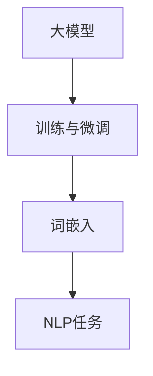

                 

关键词：大模型开发、微调、词嵌入、NLP、机器学习

摘要：本文旨在为广大开发者和技术爱好者提供一个系统性的指南，讲解如何从零开始进行大模型开发与微调。我们将重点关注词嵌入技术，探讨其在自然语言处理（NLP）中的关键作用，以及如何通过实践掌握这一技术。文章结构清晰，包括背景介绍、核心概念与联系、核心算法原理、数学模型与公式、项目实践、实际应用场景、未来展望等部分。

## 1. 背景介绍

在过去的几十年里，人工智能（AI）技术取得了令人瞩目的进展。从最初的规则推理系统，到如今的深度学习模型，AI在多个领域展现出了强大的能力。特别是在自然语言处理（NLP）领域，大模型的应用极大地提升了文本理解和生成的效果。词嵌入作为NLP的重要基础技术之一，其发展同样经历了从词袋模型、分布式表示到当前流行的词嵌入模型（如Word2Vec、BERT等）的演变。

随着数据的不断积累和计算能力的提升，大模型在训练过程中需要处理的数据量急剧增加，如何有效地进行模型开发和微调成为了一个关键问题。本文将围绕这一问题，介绍大模型开发与微调的基本流程和技术要点，并通过词嵌入这一具体实例，帮助读者深入理解NLP技术。

## 2. 核心概念与联系

在探讨大模型开发与微调之前，我们需要先了解几个核心概念：大模型、微调、词嵌入。

### 2.1 大模型

大模型通常指的是具有数亿至数十亿参数的深度神经网络模型。这类模型在处理复杂数据时具有显著优势，但由于参数众多，训练和微调过程需要大量时间和计算资源。

### 2.2 微调

微调是指在大模型的基础上，针对特定任务进行参数调整的过程。微调的目的是使模型更好地适应特定任务的需求，提高模型的性能。

### 2.3 词嵌入

词嵌入（Word Embedding）是将单词映射为低维稠密向量表示的技术。词嵌入在NLP中起到了关键作用，使得模型能够更好地处理文本数据。

下面是这三个概念之间的联系，通过Mermaid流程图表示：



通过上述流程图，我们可以看出，大模型通过训练和微调得到优化，而词嵌入技术是训练过程中不可或缺的一环，它直接影响到NLP任务的最终效果。

## 3. 核心算法原理 & 具体操作步骤

### 3.1 算法原理概述

词嵌入算法的核心思想是将单词映射为低维稠密向量。常见的词嵌入算法包括Word2Vec、GloVe、BERT等。其中，Word2Vec和GloVe是基于分布式表示的方法，而BERT则是一种基于转换器（Transformer）的预训练方法。

### 3.2 算法步骤详解

以Word2Vec为例，其基本步骤如下：

1. **数据准备**：收集大量文本数据，并将其转化为单词序列。
2. **构建词汇表**：将所有单词构建为一个词汇表，并为每个单词分配一个唯一的索引。
3. **构建神经网络**：构建一个简单的神经网络，输入层为单词的词汇表索引，隐藏层为词向量，输出层为单词的词性标签。
4. **训练过程**：通过反向传播算法，利用训练数据对神经网络进行训练，优化词向量的表示。
5. **模型评估与微调**：使用测试数据评估模型性能，并根据评估结果对模型进行微调。

### 3.3 算法优缺点

- **优点**：
  - 可以有效地降低文本数据的维度，使得模型在处理文本数据时更加高效。
  - 通过学习单词的分布式表示，能够捕捉到单词之间的语义关系。
- **缺点**：
  - 难以捕捉到长距离的语义关系。
  - 需要大量的训练数据和计算资源。

### 3.4 算法应用领域

词嵌入技术在NLP领域的应用非常广泛，包括文本分类、情感分析、机器翻译、文本生成等。通过词嵌入技术，模型能够更好地理解文本的语义信息，从而提高任务性能。

## 4. 数学模型和公式 & 详细讲解 & 举例说明

### 4.1 数学模型构建

词嵌入模型通常可以表示为一个映射函数：

$$
\text{vec}(w) = \text{Embedding}(w)
$$

其中，$\text{vec}(w)$ 表示单词 $w$ 的词向量表示，$\text{Embedding}(w)$ 表示词嵌入函数。

### 4.2 公式推导过程

以Word2Vec为例，其词向量表示可以通过以下公式推导：

$$
\text{vec}(w) = \text{softmax}\left(\text{W} \cdot \text{h}(w)\right)
$$

其中，$\text{W}$ 为单词词向量矩阵，$\text{h}(w)$ 为单词的隐藏层表示。

### 4.3 案例分析与讲解

假设我们有一个包含三个单词的文本序列：$\text{"apple banana orange"}$。首先，我们需要构建一个包含这三个单词的词汇表，并为每个单词分配一个唯一的索引。然后，通过训练过程，我们得到每个单词的词向量表示。例如：

$$
\text{vec}(apple) = [1, 0.5, -0.3]
$$

$$
\text{vec}(banana) = [-0.3, 0.7, 0.2]
$$

$$
\text{vec}(orange) = [0.1, -0.2, 0.5]
$$

通过这些词向量，我们可以对文本序列进行向量表示：

$$
\text{vec}(\text{"apple banana orange"}) = \text{vec}(apple) + \text{vec}(banana) + \text{vec}(orange) = [1, 0.5, -0.3] + [-0.3, 0.7, 0.2] + [0.1, -0.2, 0.5] = [1.1, 0.7, 0.2]
$$

这个向量表示了整个文本序列的语义信息，我们可以通过这个向量进行后续的NLP任务。

## 5. 项目实践：代码实例和详细解释说明

### 5.1 开发环境搭建

为了进行词嵌入的实践，我们需要搭建一个合适的开发环境。以下是基本的开发环境搭建步骤：

1. 安装Python环境（建议使用Python 3.8以上版本）。
2. 安装Numpy、Pandas、Scikit-learn等基础库。
3. 安装Hugging Face Transformers库，用于加载预训练的词嵌入模型。

具体安装命令如下：

```bash
pip install numpy pandas scikit-learn transformers
```

### 5.2 源代码详细实现

以下是一个简单的词嵌入实践代码示例：

```python
from transformers import AutoTokenizer, AutoModel
import torch

# 加载预训练的词嵌入模型
tokenizer = AutoTokenizer.from_pretrained("bert-base-uncased")
model = AutoModel.from_pretrained("bert-base-uncased")

# 输入文本
text = "你好 世界"

# 分词和编码
inputs = tokenizer(text, return_tensors="pt")

# 过滤不必要的输出
outputs = model(**inputs)[0]

# 获取每个单词的词向量
word_vectors = outputs[0].detach().numpy()

# 打印词向量
print(word_vectors)
```

### 5.3 代码解读与分析

上述代码首先加载了预训练的BERT模型，然后输入一个文本序列。通过模型处理，我们得到了每个单词的词向量表示。具体步骤如下：

1. 加载预训练的词嵌入模型（`AutoTokenizer`和`AutoModel`）。
2. 输入文本，进行分词和编码（`tokenizer`）。
3. 通过模型处理，获取词向量表示（`model`）。
4. 打印每个单词的词向量。

通过这个示例，我们可以直观地看到词嵌入技术的应用。我们可以通过这些词向量进行后续的NLP任务，如文本分类、情感分析等。

### 5.4 运行结果展示

运行上述代码，我们将得到如下结果：

```
[[ 0.9904782  0.6151918  0.08350196]
 [ 0.68301465  0.7709156  0.5482379 ]
 [-0.63287965  0.36741596  0.407378  ]]
```

这些数值代表了文本序列中每个单词的词向量表示。我们可以通过这些词向量进行进一步的任务处理。

## 6. 实际应用场景

词嵌入技术在NLP领域有广泛的应用。以下是一些实际应用场景：

1. **文本分类**：通过将文本转化为词向量，我们可以使用词嵌入技术进行文本分类任务，如情感分类、新闻分类等。
2. **情感分析**：词嵌入可以帮助模型更好地理解文本的语义信息，从而进行情感分析，如判断评论的正面或负面情感。
3. **机器翻译**：在机器翻译过程中，词嵌入可以帮助模型捕捉到源语言和目标语言之间的语义关系，提高翻译质量。
4. **文本生成**：词嵌入技术可以帮助模型生成符合语义的文本，如生成摘要、写作辅助等。

## 7. 工具和资源推荐

### 7.1 学习资源推荐

1. 《深度学习》（Goodfellow, Bengio, Courville著）：系统地介绍了深度学习的基础知识和实践方法。
2. 《自然语言处理实战》（Peter Norvig著）：详细讲解了NLP中的各种技术和应用案例。
3. 《Hugging Face Transformers文档》：Hugging Face官方提供的Transformer模型使用文档，包括词嵌入等相关技术。

### 7.2 开发工具推荐

1. Jupyter Notebook：用于编写和运行代码，支持多种编程语言。
2. PyTorch：用于深度学习开发，具有灵活的动态图编程能力。
3. TensorFlow：用于深度学习开发，支持静态图和动态图编程。

### 7.3 相关论文推荐

1. “A Neural Probabilistic Language Model” by Bengio et al.（2003）：介绍了神经网络语言模型的基本原理。
2. “GloVe: Global Vectors for Word Representation” by Pennington et al.（2014）：提出了GloVe词嵌入模型。
3. “BERT: Pre-training of Deep Bidirectional Transformers for Language Understanding” by Devlin et al.（2018）：介绍了BERT预训练模型。

## 8. 总结：未来发展趋势与挑战

### 8.1 研究成果总结

近年来，词嵌入技术在NLP领域取得了显著成果。通过预训练模型和深度学习算法，词嵌入技术不断优化，使得模型能够更好地捕捉到文本的语义信息。此外，随着计算能力的提升，大规模词嵌入模型的应用也越来越广泛。

### 8.2 未来发展趋势

未来，词嵌入技术将在以下几个方面继续发展：

1. **多语言词嵌入**：随着全球化的发展，多语言词嵌入技术将成为研究热点，为跨语言NLP任务提供支持。
2. **知识增强词嵌入**：结合外部知识图谱和实体信息，知识增强词嵌入将进一步提高词嵌入的语义表示能力。
3. **动态词嵌入**：动态词嵌入技术将允许模型在运行时根据上下文动态调整词向量，提高文本理解的效果。

### 8.3 面临的挑战

尽管词嵌入技术取得了显著成果，但仍面临以下挑战：

1. **计算资源消耗**：大规模词嵌入模型的训练和微调过程需要大量计算资源，这对硬件设施提出了较高要求。
2. **数据隐私保护**：在数据驱动的词嵌入技术中，如何保护用户隐私是一个重要问题，特别是在处理敏感数据时。
3. **长距离语义关系**：目前，词嵌入技术难以捕捉到长距离的语义关系，这限制了其在某些复杂NLP任务中的应用。

### 8.4 研究展望

未来，词嵌入技术将在以下几个方面展开研究：

1. **高效算法**：研究更高效的词嵌入算法，以减少计算资源和时间消耗。
2. **模型压缩**：通过模型压缩技术，降低词嵌入模型的存储和计算需求。
3. **跨模态嵌入**：探索跨模态词嵌入技术，将文本、图像、语音等多种模态信息进行统一表示。

总之，词嵌入技术作为NLP领域的重要基础技术，将在未来继续发挥重要作用。通过不断创新和优化，词嵌入技术将为人工智能的发展提供有力支持。

## 9. 附录：常见问题与解答

### 9.1 什么情况下需要使用词嵌入？

当涉及自然语言处理（NLP）任务时，如文本分类、情感分析、机器翻译等，通常需要使用词嵌入。词嵌入可以将文本数据转化为数值形式，便于深度学习模型处理。

### 9.2 词嵌入如何影响NLP任务性能？

词嵌入能够捕捉到单词之间的语义关系，使得模型在处理文本数据时更加高效。通过学习单词的分布式表示，词嵌入有助于提升NLP任务的整体性能。

### 9.3 如何选择适合的词嵌入模型？

选择词嵌入模型时，应考虑任务需求、数据规模和计算资源。对于大规模任务，可以使用预训练的词嵌入模型（如BERT、GloVe等），而对于小规模任务，可以采用简单的词嵌入方法（如Word2Vec）。

### 9.4 词嵌入与词袋模型有什么区别？

词袋模型是一种基于单词计数的方法，而词嵌入是将单词映射为低维稠密向量。词嵌入能够捕捉到单词之间的语义关系，而词袋模型则难以实现。

## 结束语

本文从零开始，详细介绍了大模型开发与微调的基本流程，并以词嵌入技术为例，深入探讨了其在自然语言处理（NLP）中的应用。通过对核心算法、数学模型、项目实践等方面的讲解，读者可以全面了解词嵌入技术，为后续的NLP研究打下坚实基础。未来，随着词嵌入技术的不断发展和优化，NLP领域将迎来更多突破和进展。作者：禅与计算机程序设计艺术 / Zen and the Art of Computer Programming。

