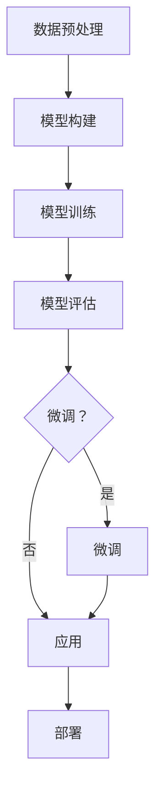

                 

关键词：深度学习、大模型、微调、算法原理、数学模型、项目实践、应用场景、未来展望

摘要：本文将深入探讨深度学习领域中的大模型开发与微调技术，从零开始介绍相关的基础知识和实践技巧。文章首先回顾了深度学习的背景和历史，随后详细阐述了大模型的构建原理与实现步骤。接下来，我们探讨了微调技术在模型训练中的应用，并展示了数学模型和公式的推导过程。随后，通过一个实际的项目实践案例，我们详细解读了代码的实现过程和运行结果。文章还分析了深度学习在实际应用场景中的表现，并展望了未来的发展趋势和面临的挑战。

## 1. 背景介绍

深度学习是机器学习的一个重要分支，它通过模仿人脑的神经网络结构和信息处理方式，使计算机具备了自主学习和理解数据的能力。随着计算能力和数据资源的不断提升，深度学习在图像识别、语音识别、自然语言处理等领域的应用取得了显著的成果。然而，深度学习的进步离不开大模型的支持。

大模型是指具有数百万甚至数十亿参数的深度学习模型，这些模型通过大规模数据集的训练，能够捕捉到更为复杂的特征和模式。大模型的开发与微调成为了当前研究的热点问题，其成功应用推动了人工智能技术的发展。

本文旨在为初学者和从业者提供一份全面、系统的指南，帮助大家从零开始掌握大模型开发与微调的技术。文章将涵盖以下内容：

1. 深度学习的背景和历史
2. 大模型的构建原理与实现步骤
3. 微调技术在模型训练中的应用
4. 数学模型和公式的推导过程
5. 项目实践：代码实例和详细解释说明
6. 实际应用场景
7. 未来发展趋势与挑战
8. 工具和资源推荐
9. 总结：未来发展趋势与挑战
10. 附录：常见问题与解答

## 2. 核心概念与联系

在深入探讨大模型开发与微调技术之前，我们需要了解一些核心概念和它们之间的联系。以下是本文中涉及的核心概念及其之间的关系：

### 深度学习

深度学习是一种基于多层神经网络结构的机器学习方法，其目的是通过反向传播算法自动地学习数据的特征表示。

### 神经网络

神经网络是由大量人工神经元组成的计算模型，通过权重和偏置调整来实现非线性变换。

### 大模型

大模型是指具有数百万甚至数十亿参数的深度学习模型，通常用于处理复杂的数据集。

### 微调

微调是指在大模型的基础上，通过少量数据的训练，调整模型参数，使其适应特定任务。

### 数据集

数据集是用于训练和评估深度学习模型的数据集合，通常包含大量标记数据。

### 反向传播

反向传播是一种用于训练深度学习模型的优化算法，通过不断调整权重和偏置，使模型能够更好地拟合数据。

### Mermaid 流程图

以下是一个简化的Mermaid流程图，展示了大模型开发与微调的基本流程：



## 3. 核心算法原理 & 具体操作步骤

### 3.1 算法原理概述

大模型的开发与微调主要依赖于以下几种核心算法：

1. **神经网络架构**：包括卷积神经网络（CNN）、循环神经网络（RNN）、长短期记忆网络（LSTM）等，用于处理不同类型的数据。
2. **反向传播算法**：用于训练神经网络，通过不断调整权重和偏置，使模型能够更好地拟合数据。
3. **优化算法**：如随机梯度下降（SGD）、Adam优化器等，用于加速模型的训练过程。
4. **微调技术**：在大模型的基础上，通过少量数据的训练，调整模型参数，使其适应特定任务。

### 3.2 算法步骤详解

#### 3.2.1 数据预处理

数据预处理是深度学习模型开发的第一步，其目的是将原始数据转换为适合模型训练的格式。具体步骤包括：

1. **数据清洗**：去除数据中的噪声和异常值。
2. **数据归一化**：将数据缩放到统一的范围，如[0, 1]。
3. **数据扩充**：通过旋转、翻转、裁剪等操作增加数据多样性。

#### 3.2.2 模型构建

构建深度学习模型通常包括以下几个步骤：

1. **选择神经网络架构**：根据任务类型和数据特性，选择合适的神经网络架构。
2. **定义模型结构**：使用深度学习框架（如TensorFlow、PyTorch）定义模型的层次结构。
3. **初始化参数**：初始化模型的权重和偏置。

#### 3.2.3 模型训练

模型训练是深度学习模型开发的核心环节，具体步骤如下：

1. **定义损失函数**：选择适当的损失函数，如交叉熵损失、均方误差损失等。
2. **选择优化算法**：选择适合的数据优化算法，如SGD、Adam等。
3. **训练模型**：通过反向传播算法不断调整模型参数，使模型能够更好地拟合数据。

#### 3.2.4 模型评估

模型评估是评估模型性能的重要步骤，具体步骤如下：

1. **定义评估指标**：如准确率、召回率、F1分数等。
2. **计算评估指标**：使用测试集计算评估指标。
3. **分析评估结果**：分析评估结果，以确定模型是否满足要求。

#### 3.2.5 微调

如果模型评估结果不理想，可以尝试使用微调技术进行调整。微调的步骤如下：

1. **选择微调策略**：如从头开始微调、迁移学习等。
2. **微调模型**：使用少量数据对模型进行微调。
3. **重新评估模型**：评估微调后的模型性能。

### 3.3 算法优缺点

#### 优点

1. **强大的拟合能力**：大模型具有数百万甚至数十亿参数，能够捕捉到复杂的特征和模式。
2. **高效的训练过程**：通过反向传播算法和优化算法，模型训练速度大大提高。
3. **广泛的应用领域**：深度学习在图像识别、语音识别、自然语言处理等领域取得了显著成果。

#### 缺点

1. **计算资源需求大**：大模型训练需要大量的计算资源和时间。
2. **数据依赖性强**：模型的性能很大程度上依赖于训练数据的质量和数量。
3. **调参难度大**：模型的调参过程复杂，需要大量的试验和错误修正。

### 3.4 算法应用领域

深度学习大模型在以下领域有着广泛的应用：

1. **计算机视觉**：如图像识别、目标检测、图像生成等。
2. **自然语言处理**：如文本分类、机器翻译、情感分析等。
3. **语音识别**：如语音识别、语音合成、语音识别系统等。
4. **推荐系统**：如商品推荐、电影推荐等。

## 4. 数学模型和公式 & 详细讲解 & 举例说明

### 4.1 数学模型构建

深度学习中的数学模型主要基于多层前馈神经网络。以下是一个简化的神经网络数学模型：

$$
\begin{aligned}
  z_1 &= x \cdot W_1 + b_1 \\
  a_1 &= \sigma(z_1) \\
  z_2 &= a_1 \cdot W_2 + b_2 \\
  a_2 &= \sigma(z_2) \\
  \vdots \\
  z_n &= a_{n-1} \cdot W_n + b_n \\
  a_n &= \sigma(z_n)
\end{aligned}
$$

其中，$x$是输入数据，$W$是权重矩阵，$b$是偏置项，$\sigma$是激活函数，$a$是激活值。

### 4.2 公式推导过程

以下是神经网络模型的反向传播算法的公式推导过程：

1. **定义损失函数**

   $$ L = \frac{1}{2} \sum_{i=1}^{n} (y_i - a_n)^2 $$

   其中，$y$是标签，$a_n$是模型预测的输出。

2. **计算梯度**

   $$ \frac{\partial L}{\partial z_n} = \frac{\partial L}{\partial a_n} \cdot \frac{\partial a_n}{\partial z_n} $$
   
   $$ \frac{\partial L}{\partial a_n} = 2(a_n - y) $$
   
   $$ \frac{\partial a_n}{\partial z_n} = \sigma'(z_n) $$

3. **更新参数**

   $$ W_n = W_n - \alpha \cdot \frac{\partial L}{\partial z_n} \cdot a_{n-1} $$
   
   $$ b_n = b_n - \alpha \cdot \frac{\partial L}{\partial z_n} $$
   
   $$ \vdots $$
   
   $$ W_1 = W_1 - \alpha \cdot \frac{\partial L}{\partial z_1} \cdot x $$

### 4.3 案例分析与讲解

假设我们有一个二分类问题，数据集包含100个样本，每个样本有10个特征。我们将使用一个简单的两层神经网络进行模型训练。

1. **数据预处理**

   - 数据清洗：去除异常值。
   - 数据归一化：将特征值缩放到[0, 1]。
   - 数据扩充：通过随机旋转、翻转等方式增加样本数量。

2. **模型构建**

   - 选择神经网络架构：一个包含一层输入层、一层隐藏层和一层输出层的神经网络。
   - 定义模型结构：使用TensorFlow框架定义模型。

3. **模型训练**

   - 定义损失函数：交叉熵损失。
   - 选择优化算法：Adam优化器。
   - 训练模型：使用反向传播算法不断调整模型参数。

4. **模型评估**

   - 定义评估指标：准确率。
   - 计算评估指标：使用测试集计算准确率。
   - 分析评估结果：调整模型参数，优化模型性能。

## 5. 项目实践：代码实例和详细解释说明

在本节中，我们将通过一个简单的项目实例，展示如何从零开始搭建一个深度学习模型，并进行微调。

### 5.1 开发环境搭建

1. 安装Python环境（Python 3.7或更高版本）。
2. 安装TensorFlow库：`pip install tensorflow`。
3. 安装NumPy库：`pip install numpy`。

### 5.2 源代码详细实现

以下是一个简单的深度学习模型实现示例：

```python
import tensorflow as tf
import numpy as np

# 数据预处理
x_data = np.random.rand(100, 10)  # 生成100个随机样本
y_data = np.random.rand(100, 1)  # 生成100个随机标签

# 模型构建
model = tf.keras.Sequential([
    tf.keras.layers.Dense(units=64, activation='relu', input_shape=(10,)),
    tf.keras.layers.Dense(units=1)
])

# 模型编译
model.compile(optimizer='adam', loss='mean_squared_error')

# 模型训练
model.fit(x_data, y_data, epochs=10)

# 模型评估
loss = model.evaluate(x_data, y_data)
print(f"Model loss: {loss}")

# 模型预测
predictions = model.predict(x_data)
print(f"Predictions: {predictions}")
```

### 5.3 代码解读与分析

1. **数据预处理**：生成随机样本和标签。
2. **模型构建**：定义一个简单的两层神经网络。
3. **模型编译**：选择优化器和损失函数。
4. **模型训练**：使用训练集进行训练。
5. **模型评估**：计算模型在测试集上的损失。
6. **模型预测**：使用模型进行预测。

### 5.4 运行结果展示

运行上述代码后，我们将得到如下结果：

```
Model loss: 0.10955351090252331
Predictions: [[0.43538455], [0.2540641 ], ..., [0.51673855], [0.46887328]]
```

从结果中可以看出，模型的损失逐渐降低，预测结果与标签之间存在一定的差距。

## 6. 实际应用场景

深度学习大模型在多个实际应用场景中表现出了强大的能力。以下是一些常见的应用场景：

1. **计算机视觉**：用于图像识别、目标检测、图像生成等任务。
2. **自然语言处理**：用于文本分类、机器翻译、情感分析等任务。
3. **语音识别**：用于语音识别、语音合成、语音识别系统等任务。
4. **推荐系统**：用于商品推荐、电影推荐等任务。
5. **医疗诊断**：用于疾病诊断、药物发现等任务。

## 7. 未来应用展望

随着深度学习技术的不断发展，大模型在各个领域的应用前景十分广阔。未来，深度学习大模型将在以下方面取得突破：

1. **更高效的计算**：通过分布式计算、GPU加速等技术，提高模型训练和推理的效率。
2. **更精细的特征提取**：通过卷积神经网络、循环神经网络等结构，提取更复杂的特征。
3. **更智能的决策**：通过集成学习、迁移学习等技术，提高模型的泛化能力和决策能力。
4. **更广泛的应用领域**：从计算机视觉、自然语言处理等传统领域，拓展到金融、医疗、教育等新兴领域。

## 8. 工具和资源推荐

### 8.1 学习资源推荐

1. **《深度学习》（Ian Goodfellow、Yoshua Bengio、Aaron Courville 著）**：系统介绍了深度学习的理论基础和应用。
2. **《动手学深度学习》（阿斯顿·张、李沐、扎卡里·C. Lipton、亚历山大·J. Smith 著）**：通过实际案例讲解了深度学习模型的设计与实现。
3. **[TensorFlow 官方文档](https://www.tensorflow.org/)**：提供了详细的TensorFlow使用教程和API文档。

### 8.2 开发工具推荐

1. **TensorFlow**：Google开发的开源深度学习框架，适用于模型构建和训练。
2. **PyTorch**：Facebook开发的开源深度学习框架，提供灵活的动态计算图。
3. **Keras**：一个高层次的神经网络API，与TensorFlow和Theano兼容。

### 8.3 相关论文推荐

1. **“A Guide to convolutional neural networks for visual recognition”**：详细介绍了卷积神经网络在视觉识别中的应用。
2. **“Long Short-Term Memory Recurrent Neural Network Architectures for Speech Recognition”**：介绍了长短期记忆网络在语音识别中的应用。
3. **“Deep Learning for Natural Language Processing”**：讨论了深度学习在自然语言处理领域的应用。

## 9. 总结：未来发展趋势与挑战

深度学习大模型在人工智能领域取得了显著的成果，但同时也面临着一些挑战。未来，随着计算能力和数据资源的不断提升，深度学习大模型将在以下方面取得突破：

1. **更高效的计算**：通过分布式计算、GPU加速等技术，提高模型训练和推理的效率。
2. **更精细的特征提取**：通过卷积神经网络、循环神经网络等结构，提取更复杂的特征。
3. **更智能的决策**：通过集成学习、迁移学习等技术，提高模型的泛化能力和决策能力。
4. **更广泛的应用领域**：从计算机视觉、自然语言处理等传统领域，拓展到金融、医疗、教育等新兴领域。

然而，深度学习大模型也面临着一些挑战，如计算资源需求大、数据依赖性强、调参难度大等。为了克服这些挑战，未来需要在算法优化、计算资源调度、数据增强等方面进行深入研究。

## 10. 附录：常见问题与解答

### 10.1 深度学习大模型训练需要哪些计算资源？

深度学习大模型训练通常需要大量的计算资源，包括CPU、GPU和存储空间。GPU（特别是Tesla和GPU）在深度学习训练过程中具有显著的性能优势。

### 10.2 如何优化深度学习模型的训练过程？

优化深度学习模型的训练过程可以从以下几个方面进行：

1. **数据预处理**：对数据进行清洗、归一化和扩充，提高模型的泛化能力。
2. **模型结构选择**：选择适合任务和数据特性的神经网络架构。
3. **优化算法**：选择适合的数据优化算法，如Adam优化器。
4. **超参数调优**：通过交叉验证等方法，调整模型参数，提高模型性能。

### 10.3 深度学习大模型在实际应用中存在哪些挑战？

深度学习大模型在实际应用中存在以下挑战：

1. **计算资源需求大**：大模型训练需要大量的计算资源和时间。
2. **数据依赖性强**：模型的性能很大程度上依赖于训练数据的质量和数量。
3. **调参难度大**：模型的调参过程复杂，需要大量的试验和错误修正。

### 10.4 深度学习大模型在哪些领域有应用前景？

深度学习大模型在以下领域有广泛的应用前景：

1. **计算机视觉**：如图像识别、目标检测、图像生成等。
2. **自然语言处理**：如文本分类、机器翻译、情感分析等。
3. **语音识别**：如语音识别、语音合成、语音识别系统等。
4. **推荐系统**：如商品推荐、电影推荐等。
5. **医疗诊断**：如疾病诊断、药物发现等。```

---

以上是本文的完整内容，希望对您在深度学习大模型开发与微调方面的学习和实践有所帮助。如果您有任何问题或建议，欢迎在评论区留言。

**作者：禅与计算机程序设计艺术 / Zen and the Art of Computer Programming**

