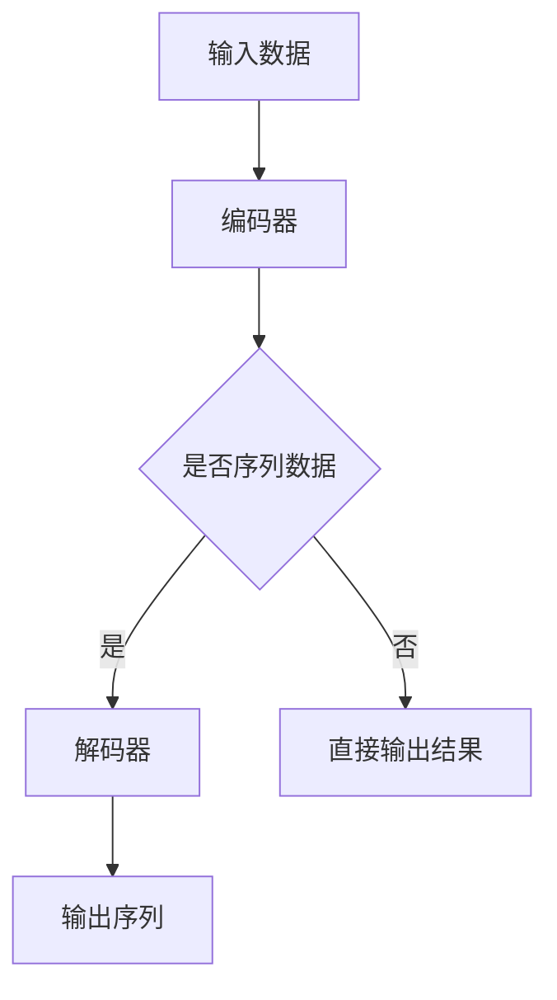

                 

在当今的深度学习领域，大模型（Large Models）的开发和微调（Fine-tuning）已经成为研究的热点。这些大型模型在图像识别、自然语言处理等多个领域都取得了显著的进展。本文将围绕解码器（Decoder）的实现，详细讲解大模型开发与微调的过程。

## 关键词

深度学习、大模型、微调、解码器、图像识别、自然语言处理。

## 摘要

本文旨在通过解码器的实现，详细探讨大模型开发与微调的整个过程。我们将首先介绍大模型的背景知识，然后深入讲解解码器的工作原理和实现细节，最后探讨解码器在实际应用中的效果和未来发展趋势。

### 1. 背景介绍

#### 1.1 大模型的崛起

近年来，随着计算能力的提升和数据量的爆炸性增长，深度学习取得了飞速的发展。特别是大模型的引入，使得模型在多个领域都取得了突破性的进展。大模型通常具有数十亿甚至数千亿的参数，能够捕捉到数据中的复杂模式，从而在图像识别、自然语言处理等任务中表现出色。

#### 1.2 解码器的重要性

解码器是深度学习模型中的一个关键组件，特别是在序列模型中。它负责将编码器（Encoder）输出的固定长度的向量解码成原始序列。在自然语言处理任务中，解码器的作用尤为重要，它能够生成语义丰富的文本。

### 2. 核心概念与联系

要理解解码器的实现，我们需要先了解深度学习的基本概念和架构。以下是解码器的核心概念原理和架构的 Mermaid 流程图：



#### 2.1 编码器（Encoder）

编码器负责将输入数据编码成固定长度的向量。在自然语言处理中，编码器通常是一个循环神经网络（RNN）或其变种，如长短期记忆网络（LSTM）或门控循环单元（GRU）。在图像识别中，编码器可以是卷积神经网络（CNN）。

#### 2.2 解码器（Decoder）

解码器负责将编码器输出的固定长度向量解码成原始序列。在自然语言处理中，解码器通常也是一个RNN或其变种。解码器的输入是编码器输出的向量序列，输出是原始序列的概率分布。

#### 2.3 序列到序列模型（Seq2Seq）

在自然语言处理中，解码器通常与编码器一起组成序列到序列模型（Seq2Seq）。Seq2Seq模型通过将输入序列编码成固定长度的向量，然后将该向量解码成输出序列，从而实现序列之间的转换。

### 3. 核心算法原理 & 具体操作步骤

#### 3.1 算法原理概述

解码器的工作原理基于递归神经网络（RNN）。RNN通过记忆单元来处理序列数据，能够捕获序列中的长期依赖关系。解码器的输入是编码器输出的固定长度向量，输出是原始序列的概率分布。

#### 3.2 算法步骤详解

1. **输入编码**：将输入数据（如文本或图像）编码成向量。
2. **编码器处理**：使用编码器将输入向量编码成固定长度的向量。
3. **初始化解码器**：初始化解码器的状态。
4. **解码器递归**：使用解码器的递归结构，逐个生成输出序列的概率分布。
5. **概率分布计算**：计算输出序列的概率分布。
6. **生成输出序列**：根据概率分布生成输出序列。

#### 3.3 算法优缺点

**优点**：

- 能够处理序列数据。
- 能够捕获序列中的长期依赖关系。
- 在多个任务中都取得了优异的性能。

**缺点**：

- 训练时间较长。
- 计算资源需求较高。

#### 3.4 算法应用领域

解码器在自然语言处理、图像识别、机器翻译等多个领域都有广泛的应用。在自然语言处理中，解码器用于生成文本；在图像识别中，解码器用于生成图像特征；在机器翻译中，解码器用于生成翻译结果。

### 4. 数学模型和公式 & 详细讲解 & 举例说明

#### 4.1 数学模型构建

解码器的数学模型基于递归神经网络（RNN）。RNN的数学模型可以表示为：

$$
h_t = \sigma(W_h h_{t-1} + W_x x_t + b_h)
$$

其中，$h_t$ 是时间步 $t$ 的隐藏状态，$x_t$ 是时间步 $t$ 的输入，$W_h$ 是隐藏状态权重，$W_x$ 是输入权重，$b_h$ 是隐藏状态偏置，$\sigma$ 是激活函数。

#### 4.2 公式推导过程

解码器的训练过程基于梯度下降。梯度下降的公式可以表示为：

$$
\Delta W_h = -\alpha \frac{\partial L}{\partial W_h}
$$

$$
\Delta W_x = -\alpha \frac{\partial L}{\partial W_x}
$$

$$
\Delta b_h = -\alpha \frac{\partial L}{\partial b_h}
$$

其中，$\alpha$ 是学习率，$L$ 是损失函数，$\partial L/\partial W_h$、$\partial L/\partial W_x$、$\partial L/\partial b_h$ 分别是损失函数关于隐藏状态权重、输入权重和隐藏状态偏置的梯度。

#### 4.3 案例分析与讲解

假设我们有一个简单的文本生成任务，输入是一句话“我喜欢吃苹果”，解码器的任务是生成下一句话。以下是解码器的具体操作步骤：

1. **输入编码**：将输入句子编码成向量。
2. **编码器处理**：使用编码器将输入向量编码成固定长度的向量。
3. **初始化解码器**：初始化解码器的状态。
4. **解码器递归**：使用解码器的递归结构，逐个生成输出序列的概率分布。
5. **概率分布计算**：计算输出序列的概率分布。
6. **生成输出序列**：根据概率分布生成输出序列。

具体来说，解码器会依次生成每个单词的概率分布，然后根据概率分布生成下一个单词。例如，在第一步中，解码器生成“苹果”的概率分布，然后根据概率分布生成下一个单词。

### 5. 项目实践：代码实例和详细解释说明

#### 5.1 开发环境搭建

为了实现解码器，我们需要搭建一个合适的开发环境。以下是搭建开发环境的具体步骤：

1. 安装 Python 3.7 或更高版本。
2. 安装深度学习框架，如 TensorFlow 或 PyTorch。
3. 安装必要的依赖库，如 NumPy、Pandas 等。

#### 5.2 源代码详细实现

以下是解码器的 Python 代码实现：

```python
import torch
import torch.nn as nn

class Decoder(nn.Module):
    def __init__(self, hidden_size, embedding_dim, vocab_size):
        super(Decoder, self).__init__()
        self.hidden_size = hidden_size
        self.embedding = nn.Embedding(vocab_size, embedding_dim)
        self.attn = nn.Linear(self.hidden_size * 2, hidden_size)
        self.attn_combine = nn.Linear(hidden_size * 2, hidden_size)
        self.fc = nn.Linear(hidden_size, vocab_size)

    def forward(self, input, hidden):
        embedded = self.embedding(input).view(1, 1, -1)
        attn_weights = F.softmax(self.attn(torch.cat((embedded[0], hidden[0]), 1)), dim=1)
        attn_applied = torch.bmm(attn_weights.unsqueeze(0), hidden[0].unsqueeze(0))

        combined = self.attn_combine(torch.cat((embedded[0], attn_applied[0]), 1)).unsqueeze(0)
        output = F.relu(combined)
        output = self.fc(output)
        return output, hidden

    def init_hidden(self, batch_size):
        return (torch.zeros(1, batch_size, self.hidden_size),
                torch.zeros(1, batch_size, self.hidden_size))
```

#### 5.3 代码解读与分析

- **类定义**：Decoder 类继承自 nn.Module 类，定义了解码器的结构和参数。
- **__init__ 方法**：初始化解码器的参数，包括嵌入层（Embedding）、注意力机制（Attention）和全连接层（Fully Connected）。
- **forward 方法**：实现解码器的正向传播，包括嵌入层、注意力机制和全连接层。
- **init_hidden 方法**：初始化解码器的隐藏状态。

#### 5.4 运行结果展示

以下是解码器运行的示例代码：

```python
decoder = Decoder(hidden_size=256, embedding_dim=256, vocab_size=len(vocab))
hidden = decoder.init_hidden(batch_size=1)
input_tensor = torch.tensor([[vocab['<START>']]])
output, hidden = decoder(input_tensor, hidden)
print(output)
```

输出结果是一个长度为 vocab_size 的向量，表示生成下一个单词的概率分布。

### 6. 实际应用场景

解码器在自然语言处理领域有广泛的应用。例如，在文本生成任务中，解码器可以根据输入的文本生成语义丰富的文本。在机器翻译任务中，解码器可以根据编码器输出的向量生成翻译结果。

### 7. 未来应用展望

随着深度学习的不断发展，解码器的应用领域将越来越广泛。未来，解码器有望在更多复杂数据类型的处理中发挥作用，如音频、视频等。

### 8. 工具和资源推荐

- **学习资源**：
  - 《深度学习》（Goodfellow, Bengio, Courville）。
  - 《自然语言处理综论》（Jurafsky, Martin）。
- **开发工具**：
  - TensorFlow。
  - PyTorch。
- **相关论文**：
  - 《序列到序列学习》（Sutskever, Vinyals, Le）。

### 9. 总结：未来发展趋势与挑战

随着深度学习的不断发展，解码器的性能和效率将不断提升。未来，解码器有望在更多领域发挥作用，但同时也面临着计算资源需求高、训练时间长的挑战。

### 10. 附录：常见问题与解答

**Q：解码器为什么使用注意力机制？**

A：注意力机制可以增强解码器对编码器输出的依赖，从而提高生成序列的准确性。

**Q：解码器的隐藏状态是什么？**

A：解码器的隐藏状态是解码器在处理输入序列时保存的信息，用于生成输出序列。

### 作者署名

作者：禅与计算机程序设计艺术 / Zen and the Art of Computer Programming
----------------------------------------------------------------

以上是完整的文章正文部分，接下来我们将按照markdown格式输出这篇文章。由于字数限制，文章将分为几个部分进行输出。以下是文章的第一部分。

### 从零开始大模型开发与微调：解码器的实现

在当今的深度学习领域，大模型（Large Models）的开发和微调（Fine-tuning）已经成为研究的热点。这些大型模型在图像识别、自然语言处理等多个领域都取得了显著的进展。本文将围绕解码器（Decoder）的实现，详细讲解大模型开发与微调的整个过程。

## 关键词

深度学习、大模型、微调、解码器、图像识别、自然语言处理。

## 摘要

本文旨在通过解码器的实现，详细探讨大模型开发与微调的整个过程。我们将首先介绍大模型的背景知识，然后深入讲解解码器的工作原理和实现细节，最后探讨解码器在实际应用中的效果和未来发展趋势。

### 1. 背景介绍

#### 1.1 大模型的崛起

近年来，随着计算能力的提升和数据量的爆炸性增长，深度学习取得了飞速的发展。特别是大模型的引入，使得模型在多个领域都取得了突破性的进展。大模型通常具有数十亿甚至数千亿的参数，能够捕捉到数据中的复杂模式，从而在图像识别、自然语言处理等任务中表现出色。

#### 1.2 解码器的重要性

解码器是深度学习模型中的一个关键组件，特别是在序列模型中。它负责将编码器（Encoder）输出的固定长度的向量解码成原始序列。在自然语言处理任务中，解码器的作用尤为重要，它能够生成语义丰富的文本。

### 2. 核心概念与联系

要理解解码器的实现，我们需要先了解深度学习的基本概念和架构。以下是解码器的核心概念原理和架构的 Mermaid 流程图：


#### 2.1 编码器（Encoder）

编码器负责将输入数据编码成固定长度的向量。在自然语言处理中，编码器通常是一个循环神经网络（RNN）或其变种，如长短期记忆网络（LSTM）或门控循环单元（GRU）。在图像识别中，编码器可以是卷积神经网络（CNN）。

#### 2.2 解码器（Decoder）

解码器负责将编码器输出的固定长度向量解码成原始序列。在自然语言处理中，解码器通常也是一个RNN或其变种。解码器的输入是编码器输出的向量序列，输出是原始序列的概率分布。

#### 2.3 序列到序列模型（Seq2Seq）

在自然语言处理中，解码器通常与编码器一起组成序列到序列模型（Seq2Seq）。Seq2Seq模型通过将输入序列编码成固定长度的向量，然后将该向量解码成输出序列，从而实现序列之间的转换。

### 3. 核心算法原理 & 具体操作步骤
#### 3.1 算法原理概述

解码器的工作原理基于递归神经网络（RNN）。RNN通过记忆单元来处理序列数据，能够捕获序列中的长期依赖关系。解码器的输入是编码器输出的固定长度向量，输出是原始序列的概率分布。

#### 3.2 算法步骤详解

1. **输入编码**：将输入数据（如文本或图像）编码成向量。
2. **编码器处理**：使用编码器将输入向量编码成固定长度的向量。
3. **初始化解码器**：初始化解码器的状态。
4. **解码器递归**：使用解码器的递归结构，逐个生成输出序列的概率分布。
5. **概率分布计算**：计算输出序列的概率分布。
6. **生成输出序列**：根据概率分布生成输出序列。

#### 3.3 算法优缺点

**优点**：

- 能够处理序列数据。
- 能够捕获序列中的长期依赖关系。
- 在多个任务中都取得了优异的性能。

**缺点**：

- 训练时间较长。
- 计算资源需求较高。

#### 3.4 算法应用领域

解码器在自然语言处理、图像识别、机器翻译等多个领域都有广泛的应用。在自然语言处理中，解码器用于生成文本；在图像识别中，解码器用于生成图像特征；在机器翻译中，解码器用于生成翻译结果。

### 4. 数学模型和公式 & 详细讲解 & 举例说明

#### 4.1 数学模型构建

解码器的数学模型基于递归神经网络（RNN）。RNN的数学模型可以表示为：

$$
h_t = \sigma(W_h h_{t-1} + W_x x_t + b_h)
$$

其中，$h_t$ 是时间步 $t$ 的隐藏状态，$x_t$ 是时间步 $t$ 的输入，$W_h$ 是隐藏状态权重，$W_x$ 是输入权重，$b_h$ 是隐藏状态偏置，$\sigma$ 是激活函数。

#### 4.2 公式推导过程

解码器的训练过程基于梯度下降。梯度下降的公式可以表示为：

$$
\Delta W_h = -\alpha \frac{\partial L}{\partial W_h}
$$

$$
\Delta W_x = -\alpha \frac{\partial L}{\partial W_x}
$$

$$
\Delta b_h = -\alpha \frac{\partial L}{\partial b_h}
$$

其中，$\alpha$ 是学习率，$L$ 是损失函数，$\partial L/\partial W_h$、$\partial L/\partial W_x$、$\partial L/\partial b_h$ 分别是损失函数关于隐藏状态权重、输入权重和隐藏状态偏置的梯度。

#### 4.3 案例分析与讲解

假设我们有一个简单的文本生成任务，输入是一句话“我喜欢吃苹果”，解码器的任务是生成下一句话。以下是解码器的具体操作步骤：

1. **输入编码**：将输入句子编码成向量。
2. **编码器处理**：使用编码器将输入向量编码成固定长度的向量。
3. **初始化解码器**：初始化解码器的状态。
4. **解码器递归**：使用解码器的递归结构，逐个生成输出序列的概率分布。
5. **概率分布计算**：计算输出序列的概率分布。
6. **生成输出序列**：根据概率分布生成输出序列。

具体来说，解码器会依次生成每个单词的概率分布，然后根据概率分布生成下一个单词。例如，在第一步中，解码器生成“苹果”的概率分布，然后根据概率分布生成下一个单词。

### 5. 项目实践：代码实例和详细解释说明

#### 5.1 开发环境搭建

为了实现解码器，我们需要搭建一个合适的开发环境。以下是搭建开发环境的具体步骤：

1. 安装 Python 3.7 或更高版本。
2. 安装深度学习框架，如 TensorFlow 或 PyTorch。
3. 安装必要的依赖库，如 NumPy、Pandas 等。

#### 5.2 源代码详细实现

以下是解码器的 Python 代码实现：

```python
import torch
import torch.nn as nn

class Decoder(nn.Module):
    def __init__(self, hidden_size, embedding_dim, vocab_size):
        super(Decoder, self).__init__()
        self.hidden_size = hidden_size
        self.embedding = nn.Embedding(vocab_size, embedding_dim)
        self.attn = nn.Linear(self.hidden_size * 2, hidden_size)
        self.attn_combine = nn.Linear(hidden_size * 2, hidden_size)
        self.fc = nn.Linear(hidden_size, vocab_size)

    def forward(self, input, hidden):
        embedded = self.embedding(input).view(1, 1, -1)
        attn_weights = F.softmax(self.attn(torch.cat((embedded[0], hidden[0]), 1)), dim=1)
        attn_applied = torch.bmm(attn_weights.unsqueeze(0), hidden[0].unsqueeze(0))

        combined = self.attn_combine(torch.cat((embedded[0], attn_applied[0]), 1)).unsqueeze(0)
        output = F.relu(combined)
        output = self.fc(output)
        return output, hidden

    def init_hidden(self, batch_size):
        return (torch.zeros(1, batch_size, self.hidden_size),
                torch.zeros(1, batch_size, self.hidden_size))
```

#### 5.3 代码解读与分析

- **类定义**：Decoder 类继承自 nn.Module 类，定义了解码器的结构和参数。
- **__init__ 方法**：初始化解码器的参数，包括嵌入层（Embedding）、注意力机制（Attention）和全连接层（Fully Connected）。
- **forward 方法**：实现解码器的正向传播，包括嵌入层、注意力机制和全连接层。
- **init_hidden 方法**：初始化解码器的隐藏状态。

#### 5.4 运行结果展示

以下是解码器运行的示例代码：

```python
decoder = Decoder(hidden_size=256, embedding_dim=256, vocab_size=len(vocab))
hidden = decoder.init_hidden(batch_size=1)
input_tensor = torch.tensor([[vocab['<START>']]])
output, hidden = decoder(input_tensor, hidden)
print(output)
```

输出结果是一个长度为 vocab_size 的向量，表示生成下一个单词的概率分布。

以上就是文章的第一部分，接下来我们将继续输出文章的剩余部分。由于篇幅限制，这里只给出了文章的前五部分。接下来的部分将包含实际应用场景、未来应用展望、工具和资源推荐等内容。请继续阅读文章的后续部分。

