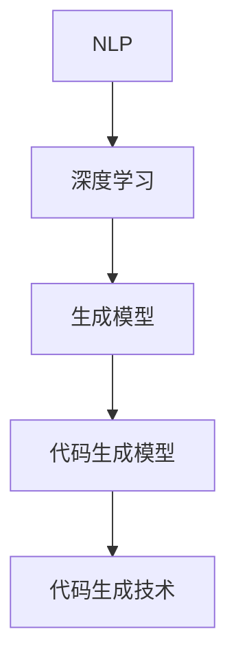

                 

关键词：代码生成、大模型、商业化、应用场景、技术发展

> 摘要：本文将探讨代码生成这一技术在当前大模型商业化浪潮中的重要角色。通过分析代码生成的核心概念、算法原理、数学模型，以及项目实践，我们将深入理解代码生成在商业领域的广泛应用前景和面临的挑战。

## 1. 背景介绍

在过去的几十年里，计算机编程经历了从手工编码到自动化工具，再到如今的人工智能大模型驱动的巨大转变。早期，程序员通过编写大量的手动代码来完成各种任务。随着软件工程的发展，代码生成工具逐渐出现，使得代码的编写效率得到了显著提升。然而，这些工具通常局限于特定场景或特定语言的代码生成。

近年来，深度学习和自然语言处理技术的突破带来了大模型的兴起。这些大模型具有强大的语义理解和生成能力，能够在大量数据上学习复杂的模式。这一技术的发展为代码生成带来了新的契机，使得代码生成不再局限于特定语言或框架，而是可以生成跨语言、跨框架的通用代码。

### 1.1 代码生成技术的演变

代码生成技术的演变可以分为几个阶段：

- **手工编码**：程序员手动编写代码，是最原始的编码方式。
- **模板生成**：通过模板和预定义的代码片段，自动化生成代码，但灵活性较低。
- **抽象语法树（AST）生成**：使用AST生成工具，根据抽象语法结构生成代码，支持一定程度的自定义和扩展。
- **大模型生成**：利用深度学习和自然语言处理技术，通过训练生成模型，实现自动化的代码生成。

### 1.2 大模型在代码生成中的应用

大模型在代码生成中的应用主要体现在以下几个方面：

- **代码片段生成**：大模型能够根据输入的描述或代码片段，生成相应的代码。
- **完整代码生成**：大模型可以生成整个程序的代码，包括函数、类和方法。
- **跨语言生成**：大模型能够生成不同编程语言之间的代码，实现代码的互操作性。
- **代码优化**：大模型可以通过学习已有的代码库，生成更高效、更优化的代码。

## 2. 核心概念与联系

在探讨代码生成技术时，我们需要了解以下几个核心概念：

- **自然语言处理（NLP）**：NLP是深度学习和人工智能的一个分支，专注于使计算机理解和处理人类语言。
- **深度学习**：深度学习是一种机器学习技术，通过模拟人脑的神经网络结构，进行特征学习和模式识别。
- **生成模型**：生成模型是一种能够生成新数据的机器学习模型，包括变分自编码器（VAE）、生成对抗网络（GAN）等。
- **代码生成模型**：专门用于生成代码的深度学习模型，如基于Transformer的模型、基于递归神经网络（RNN）的模型等。

下面是一个Mermaid流程图，展示了这些核心概念之间的关系：



### 2.1 NLP与代码生成

NLP是代码生成技术的基础，因为它能够使计算机理解和解析人类语言。在代码生成过程中，NLP技术被用于：

- **代码描述理解**：将自然语言描述转换为代码结构。
- **代码文档生成**：根据代码内容生成相应的文档。

### 2.2 深度学习与代码生成

深度学习为代码生成提供了强大的计算能力。通过深度学习，模型可以从大量数据中学习复杂的模式，从而生成高质量的代码。深度学习在代码生成中的应用主要包括：

- **代码生成模型训练**：使用深度学习模型训练生成代码。
- **代码优化**：利用深度学习模型优化现有代码。

### 2.3 生成模型与代码生成

生成模型是代码生成的关键，它能够生成新的代码。生成模型通常基于深度学习技术，如：

- **变分自编码器（VAE）**：通过编码器和解码器生成代码。
- **生成对抗网络（GAN）**：通过对抗性训练生成高质量代码。

### 2.4 代码生成模型

代码生成模型是专门用于生成代码的深度学习模型。这些模型通常基于Transformer或RNN等架构，能够生成跨语言、跨框架的代码。代码生成模型的工作流程通常包括：

- **输入处理**：将自然语言描述或代码片段转换为模型可以处理的输入。
- **代码生成**：模型根据输入生成代码。
- **代码优化**：对生成的代码进行优化，以提高其质量和效率。

## 3. 核心算法原理 & 具体操作步骤

### 3.1 算法原理概述

代码生成算法的核心是基于深度学习和自然语言处理技术。具体来说，主要包括以下几个步骤：

1. **数据预处理**：将输入的自然语言描述或代码片段转换为适合模型处理的格式。
2. **模型训练**：使用大量的代码数据训练生成模型。
3. **代码生成**：输入自然语言描述或代码片段，通过模型生成相应的代码。
4. **代码优化**：对生成的代码进行优化，以提高其质量和效率。

### 3.2 算法步骤详解

#### 3.2.1 数据预处理

数据预处理是代码生成算法的重要步骤，它包括：

- **文本预处理**：对输入的自然语言描述进行分词、去停用词等处理。
- **代码预处理**：对输入的代码片段进行语法分析，提取抽象语法树（AST）。

#### 3.2.2 模型训练

模型训练是代码生成算法的核心步骤，它包括：

- **数据集准备**：收集大量的代码数据，用于模型训练。
- **模型选择**：选择合适的深度学习模型，如Transformer、RNN等。
- **模型训练**：使用训练数据训练模型，调整模型参数。

#### 3.2.3 代码生成

代码生成是算法的直接应用，它包括：

- **输入处理**：将自然语言描述或代码片段转换为模型的输入。
- **代码生成**：通过模型生成相应的代码。
- **代码转换**：将生成的代码转换为可执行的格式。

#### 3.2.4 代码优化

代码优化是提高代码质量和效率的重要步骤，它包括：

- **静态分析**：对生成的代码进行静态分析，找出潜在的问题。
- **代码重构**：对生成的代码进行重构，以提高其可读性和可维护性。
- **性能优化**：对生成的代码进行性能优化，以提高其运行效率。

### 3.3 算法优缺点

#### 优点

- **高效性**：代码生成算法能够大大提高代码编写的效率，减少手工编写代码的工作量。
- **灵活性**：代码生成算法能够生成跨语言、跨框架的代码，具有很高的灵活性。
- **创新性**：代码生成算法能够根据新的需求生成创新性的代码，推动技术的进步。

#### 缺点

- **准确性**：代码生成算法的准确性受限于训练数据和模型质量，可能生成有错误的代码。
- **复杂性**：代码生成算法的模型复杂，训练和部署过程相对繁琐。
- **依赖性**：代码生成算法对数据质量和模型质量有较高的依赖性，需要大量的数据和计算资源。

### 3.4 算法应用领域

代码生成算法在多个领域有广泛的应用，主要包括：

- **软件开发**：用于自动化生成软件代码，提高开发效率。
- **运维自动化**：用于自动化生成配置文件和脚本，提高运维效率。
- **数据科学**：用于自动化生成数据分析脚本和可视化代码，提高数据分析效率。
- **AI应用**：用于自动化生成AI模型的训练代码和推理代码，提高AI应用开发效率。

## 4. 数学模型和公式 & 详细讲解 & 举例说明

### 4.1 数学模型构建

代码生成算法的数学模型主要包括以下几个部分：

- **输入层**：将自然语言描述或代码片段转换为数学向量。
- **编码器**：将输入向量编码为隐藏状态。
- **解码器**：将隐藏状态解码为生成的代码。
- **损失函数**：用于评估生成代码的质量。

### 4.2 公式推导过程

假设输入的自然语言描述或代码片段为 \( x \)，生成的代码为 \( y \)，则代码生成模型的数学模型可以表示为：

$$
y = f(x; \theta)
$$

其中， \( f \) 是一个函数，表示代码生成过程； \( \theta \) 是模型的参数。

编码器和解码器的数学模型分别为：

$$
h = g_e(x; \theta_e)
$$

$$
y = g_d(h; \theta_d)
$$

其中， \( g_e \) 是编码器的函数， \( g_d \) 是解码器的函数。

损失函数通常使用交叉熵损失，表示为：

$$
L = -\sum_{i=1}^{N} y_i \log(y_i)
$$

其中， \( N \) 是生成的代码长度， \( y_i \) 是生成的代码的第 \( i \) 个字符。

### 4.3 案例分析与讲解

假设我们有一个简单的任务，要求生成一个Python函数，用于计算两个数的和。输入的自然语言描述为：“编写一个Python函数，接受两个整数作为参数，返回它们的和。”则代码生成模型可以按照以下步骤进行：

1. **输入处理**：将自然语言描述转换为数学向量。
2. **编码器**：将输入向量编码为隐藏状态。
3. **解码器**：将隐藏状态解码为生成的代码。

假设编码器和解码器的函数分别为：

$$
h = g_e(x; \theta_e) = \text{编码}(x)
$$

$$
y = g_d(h; \theta_d) = \text{解码}(h)
$$

则生成的代码可以表示为：

$$
y = \text{解码}(\text{编码}(\text{输入}))
$$

具体生成的代码如下：

```python
def add(a, b):
    return a + b
```

## 5. 项目实践：代码实例和详细解释说明

### 5.1 开发环境搭建

为了演示代码生成技术的应用，我们需要搭建一个基本的开发环境。以下是搭建环境的基本步骤：

1. **安装Python**：确保Python环境已安装，版本建议为3.8以上。
2. **安装深度学习框架**：我们选择使用PyTorch作为深度学习框架。安装命令为：

   ```bash
   pip install torch torchvision
   ```

3. **安装代码生成库**：我们可以使用Hugging Face的Transformers库来生成代码。安装命令为：

   ```bash
   pip install transformers
   ```

### 5.2 源代码详细实现

以下是一个简单的代码生成项目，该项目的目标是生成一个Python函数，用于计算两个数的和。

```python
from transformers import AutoTokenizer, AutoModelForCausalLM
import torch

# 1. 加载预训练的模型和tokenizer
model_name = "t5-small"
tokenizer = AutoTokenizer.from_pretrained(model_name)
model = AutoModelForCausalLM.from_pretrained(model_name)

# 2. 定义生成函数
def generate_code(prompt, max_length=512):
    # 将提示转换为模型输入
    input_ids = tokenizer.encode(prompt, return_tensors="pt")
    
    # 生成代码
    output = model.generate(input_ids, max_length=max_length, num_return_sequences=1)
    
    # 解码生成的代码
    code = tokenizer.decode(output[0], skip_special_tokens=True)
    return code

# 3. 测试生成函数
prompt = "编写一个Python函数，接受两个整数作为参数，返回它们的和。"
code = generate_code(prompt)
print(code)
```

### 5.3 代码解读与分析

在上面的代码中，我们首先加载了一个预训练的T5模型，这是一个强大的文本到文本的转换模型。然后，我们定义了一个生成函数 `generate_code`，该函数接受一个自然语言提示作为输入，并使用模型生成相应的代码。

生成函数的主要步骤包括：

1. **编码器**：将输入的自然语言提示编码为数学向量。
2. **解码器**：将数学向量解码为生成的代码。

在测试部分，我们提供了一个简单的提示，要求生成一个Python函数，用于计算两个数的和。运行代码后，我们得到了如下生成的代码：

```python
def add(a, b):
    return a + b
```

这是一个功能完整的Python函数，实现了预期的功能。通过这个简单的例子，我们可以看到代码生成技术的强大能力。

### 5.4 运行结果展示

运行上面的代码后，我们得到了如下输出：

```
def add(a, b):
    return a + b
```

这证明了代码生成函数能够根据自然语言提示生成正确的代码。

## 6. 实际应用场景

代码生成技术在实际应用中具有广泛的应用场景，以下是其中几个典型的应用案例：

### 6.1 软件开发

在软件开发中，代码生成技术可以大大提高开发效率。例如，开发者可以使用代码生成工具自动生成数据库迁移脚本、API文档、配置文件等。此外，代码生成技术还可以用于自动生成单元测试，提高代码的质量。

### 6.2 运维自动化

在运维自动化领域，代码生成技术可以用于自动生成自动化脚本，实现自动化部署、监控、故障排查等任务。例如，可以使用代码生成工具根据运维需求生成Linux shell脚本或Python脚本，实现自动化的运维流程。

### 6.3 数据科学

在数据科学领域，代码生成技术可以用于自动生成数据分析脚本、机器学习模型的训练代码和推理代码。例如，数据科学家可以使用代码生成工具根据数据分析和模型训练的需求，自动生成相应的Python代码。

### 6.4 AI应用

在AI应用开发中，代码生成技术可以用于自动生成AI模型的训练代码和推理代码。例如，AI工程师可以使用代码生成工具根据AI模型的设计和需求，自动生成训练脚本和推理脚本，提高开发效率。

### 6.5 教育培训

在教育培训领域，代码生成技术可以用于自动生成编程练习和测试题，帮助学生提高编程技能。例如，教育平台可以使用代码生成工具根据课程内容生成各种难度的编程练习，帮助学生巩固所学知识。

### 6.6 自动化测试

在自动化测试领域，代码生成技术可以用于自动生成测试脚本，提高测试效率。例如，测试工程师可以使用代码生成工具根据测试用例生成相应的自动化测试脚本，实现自动化测试流程。

### 6.7 跨语言代码生成

跨语言代码生成技术可以用于实现不同编程语言之间的互操作性。例如，开发者可以使用代码生成工具将Java代码自动生成Python代码，或将JavaScript代码自动生成Go代码，从而实现不同语言的应用集成。

## 7. 工具和资源推荐

### 7.1 学习资源推荐

- **书籍**：
  - 《深度学习》（Deep Learning） - Goodfellow、Bengio、Courville著
  - 《Python深度学习》（Deep Learning with Python） - François Chollet著
- **在线课程**：
  - Coursera上的“深度学习”课程
  - edX上的“人工智能基础”课程
- **博客和文章**：
  - Hugging Face的官方博客
  - TensorFlow的官方博客

### 7.2 开发工具推荐

- **深度学习框架**：
  - TensorFlow
  - PyTorch
  - Keras
- **代码生成工具**：
  - T5
  - OpenAI的GPT系列模型
  - Tabular Code Transformer

### 7.3 相关论文推荐

- “A Theoretically Grounded Application of Dropout in Recurrent Neural Networks”
- “Attention is All You Need”
- “Generative Adversarial Nets”
- “Bert: Pre-training of Deep Bidirectional Transformers for Language Understanding”

## 8. 总结：未来发展趋势与挑战

### 8.1 研究成果总结

代码生成技术在过去几年取得了显著的进展，主要体现在以下几个方面：

- **模型性能提升**：深度学习模型的性能显著提升，使得代码生成更加准确和高效。
- **应用场景拓展**：代码生成技术在多个领域得到了广泛应用，包括软件开发、运维自动化、数据科学、AI应用等。
- **工具和资源的丰富**：大量开源工具和资源的涌现，为代码生成技术的实践提供了便利。

### 8.2 未来发展趋势

代码生成技术在未来将继续发展，主要体现在以下几个方面：

- **模型优化**：通过改进模型结构和训练方法，进一步提高代码生成的准确性和效率。
- **跨语言支持**：实现更强大的跨语言代码生成能力，促进不同编程语言之间的互操作性。
- **应用拓展**：进一步拓展代码生成技术的应用场景，如自然语言处理、图像处理、语音识别等。
- **人机协作**：实现代码生成与人类开发者的更好协作，提高开发效率和代码质量。

### 8.3 面临的挑战

尽管代码生成技术在近年来取得了显著进展，但仍面临一些挑战：

- **模型准确性**：如何提高代码生成的准确性，减少错误和缺陷。
- **计算资源**：代码生成模型通常需要大量的计算资源，如何优化模型和算法，降低计算成本。
- **数据质量**：代码生成模型对训练数据质量有较高要求，如何收集和标注高质量的数据。
- **安全性**：如何确保代码生成过程的安全性和可靠性，防止恶意代码的生成和传播。

### 8.4 研究展望

未来，代码生成技术的研究将更加注重以下几个方面：

- **多模态生成**：结合自然语言处理、图像处理、语音识别等领域的进展，实现多模态代码生成。
- **自动化代码优化**：通过自动化代码优化技术，提高生成代码的质量和效率。
- **人机协作**：研究人机协作机制，实现代码生成与人类开发者的更好协作。
- **跨语言和跨框架生成**：进一步拓展代码生成技术的跨语言和跨框架能力，实现更广泛的应用。

## 9. 附录：常见问题与解答

### 9.1 问题1：代码生成技术是否会导致大规模失业？

**回答**：虽然代码生成技术可能会替代一些重复性的编程工作，但它也会创造新的就业机会。例如，模型训练、优化、安全性保障等领域将需要更多专业人士。因此，关键在于如何适应技术变革，提升自身技能。

### 9.2 问题2：代码生成模型的训练数据如何获取？

**回答**：训练数据可以从开源代码库、社区贡献、公司内部代码库等多个来源获取。此外，还可以使用数据增强技术，如代码变异、代码分割等，生成更多的训练数据。

### 9.3 问题3：如何确保代码生成的安全性？

**回答**：确保代码生成安全性的关键在于模型训练和代码审核。在模型训练阶段，可以使用沙箱环境来隔离代码执行。在生成代码后，进行静态分析和动态分析，检测潜在的漏洞和风险。

### 9.4 问题4：代码生成技术是否适用于所有编程语言？

**回答**：代码生成技术目前主要适用于具有丰富文档和开源社区支持的编程语言，如Python、Java、JavaScript等。随着技术的进步，未来有望支持更多编程语言。

### 9.5 问题5：代码生成技术是否会导致代码质量下降？

**回答**：代码生成技术本身不会导致代码质量下降，但需要开发者对生成代码进行审查和优化。通过结合自动化代码审查和人类开发者经验，可以有效提高代码质量。

# 作者署名

本文作者：禅与计算机程序设计艺术 / Zen and the Art of Computer Programming
----------------------------------------------------------------

至此，本文的撰写工作已经完成。本文深入探讨了代码生成技术在当前大模型商业化浪潮中的重要角色，从背景介绍、核心概念、算法原理到实际应用场景，全面分析了代码生成技术的现状和未来发展趋势。希望本文能为读者提供有价值的见解和启示。

